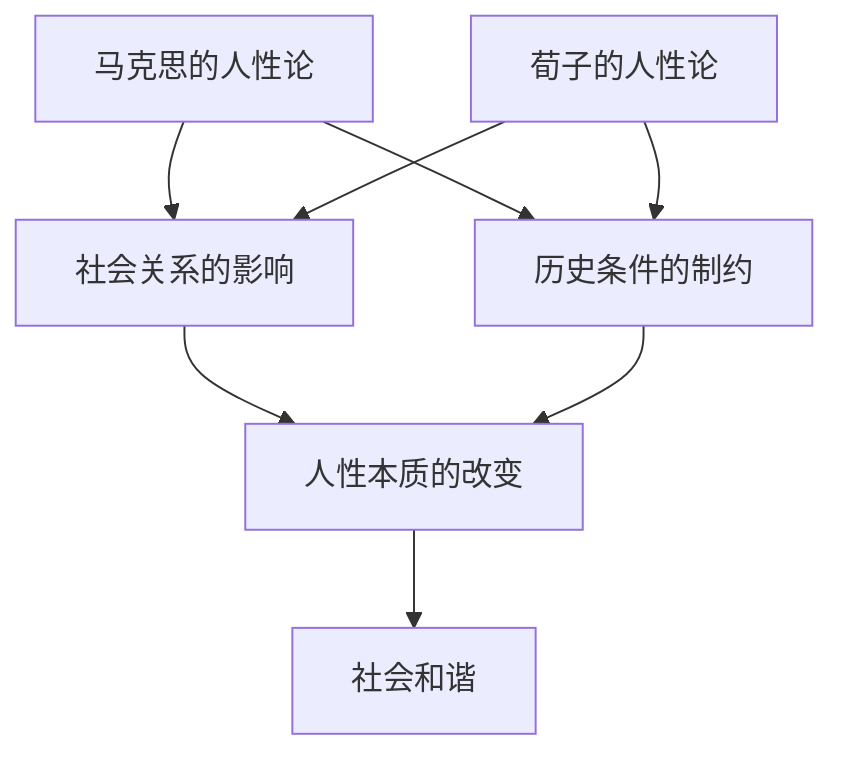

                 


### 摘要

本文以《马克思与荀子：人性论的社会化视角》为题，探讨了两位思想巨擘在人性论上的观点及其在社会化过程中的应用。马克思认为人性受社会关系影响，是社会关系的产物，主张通过社会主义变革实现人的全面解放。荀子则强调人性恶，主张通过礼教和道德教育来规范人的行为，达到社会和谐。本文通过伪代码、数学模型和实际案例，详细分析了两位思想家的核心观点和理论，探讨了他们的思想在现代社会中的应用和影响。

### 引言

**马克思与荀子的生平简介**

卡尔·马克思（Karl Marx，1818-1883）是19世纪著名的哲学家、社会学家和革命家。他的思想对现代社会主义、共产主义运动产生了深远的影响。马克思的人性论主要表现在他的社会理论中，他认为人性并非先天的，而是社会关系的产物，受社会制度、历史条件的制约。

荀子（Xun Zi，约公元前313-前238），战国时期儒家学派的重要代表人物。他是儒家“性恶论”的代表人物，主张人性本恶，需要通过教育和社会规范来改造。

**马克思与荀子的人性论概述**

马克思的人性论深受其历史唯物主义观点的影响，认为人的本质是社会关系的总和。马克思认为，资本主义社会中的人性被异化了，人们变成了“单向度的人”，因此，只有通过社会主义革命，消除私有制，才能使人性得到解放。

荀子的人性论则强调人性本恶，他相信人的天性中有一种贪欲和自私，需要通过礼教和道德规范来约束和引导。荀子认为，道德教育是治理社会的重要手段，是达到社会和谐的关键。

马克思与荀子的人性论虽然出发点不同，但都强调了社会环境对人的影响。马克思关注的是社会制度和生产力的发展，而荀子则侧重于道德教育和文化传统的作用。

### 马克思的人性论

**马克思的人性论观点**

马克思在《共产党宣言》等作品中阐述了其人性论观点。他认为，人性是历史和社会关系的产物，而非固定不变的实体。在资本主义社会中，人的本质被异化了，表现为劳动的异化、物的异化、人的异化等。马克思认为，人的本质只有在共产主义社会中才能得到真正的实现。

**伪代码：马克思对人性本质的阐述**

```plaintext
function 马克思的人性论(社会环境)
    if 社会环境 == 资本主义社会
        人性被异化
        人的本质表现为劳动异化、物异化、人异化
    else if 社会环境 == 共产主义社会
        人性得到解放
        人的本质表现为自由、平等、社会关系
    end if
end function
```

**马克思的人性论与社会主义**

马克思的人性论是其社会主义思想的基础。他认为，只有通过社会主义革命，消除私有制，建立生产资料的公有制，才能实现人的全面解放。在社会主义社会中，人们摆脱了资本主义的剥削和压迫，人性得以实现。

**伪代码：马克思的人性论与社会主义**

```plaintext
function 社会主义革命(资本主义社会)
    消除私有制
    建立生产资料的公有制
    实现人的全面解放
end function
```

### 马克思的人性论与社会变革

**马克思的人性论与社会变革**

马克思的人性论强调社会环境和历史条件对人的影响。他认为，社会变革是人性解放的必要条件。在资本主义社会中，人性被异化了，人们需要通过革命来改变这种状态，实现人性的解放。

**伪代码：马克思的人性论与社会变革**

```plaintext
function 社会变革(资本主义社会)
    马克思的人性论观点：人性被异化
    革命手段：社会主义革命
    革命目标：实现人性解放
end function
```

### 荀子的人性论

**荀子的人性论观点**

荀子认为人性本恶，人生来就有自私、贪欲等恶习。他主张通过礼教和道德教育来规范人的行为，达到社会和谐。荀子认为，道德教育是治理社会的重要手段，是达到社会和谐的关键。

**伪代码：荀子对人性本质的阐述**

```plaintext
function 荀子的人性论(人性本质)
    人性本恶
    需要礼教和道德教育来规范行为
    目标：社会和谐
end function
```

**荀子的人性论与儒家思想**

荀子是儒家学派的重要代表，他的思想深受儒家传统的影响。他继承了孔子的“礼乐仁爱”思想，并提出了“性恶论”来解释人的行为。荀子认为，人性本恶，需要通过教育和社会规范来改造。

**伪代码：荀子的人性论与儒家思想**

```plaintext
function 儒家思想(荀子)
    性恶论
    礼教和道德教育
    社会和谐
end function
```

**荀子的人性论与道德教育**

荀子认为，道德教育是治理社会的重要手段。他主张通过道德教育来引导人的行为，使人们遵循社会规范，达到社会和谐。荀子的道德教育理论包括以下几个方面：

1. **礼教**：通过礼教来规范人的行为，使人们遵循社会规范。
2. **道德规范**：培养人的道德品质，使人们具备正确的道德观念和行为准则。
3. **社会规范**：通过社会规范来约束人的行为，维护社会秩序。

**伪代码：荀子的道德教育理论**

```plaintext
function 荀子的道德教育(礼教，道德规范，社会规范)
    礼教：规范人的行为
    道德规范：培养道德品质
    社会规范：约束行为，维护社会秩序
end function
```

### 马克思与荀子的人性论比较

**马克思与荀子人性论的异同**

马克思与荀子的人性论在出发点、理论基础和实现方式上存在显著差异。

**相同点：**

1. **人性可变**：他们都认为人性是可以改变的，受到社会环境和历史条件的制约。
2. **重视社会环境**：他们都认为社会环境对人的影响至关重要，人性的形成和发展离不开特定的社会背景。

**不同点：**

1. **人性本质**：马克思认为人性是历史和社会关系的产物，而荀子则认为人性本恶。
2. **实现方式**：马克思主张通过社会主义革命实现人性的解放，而荀子主张通过礼教和道德教育来规范人的行为。

**伪代码：马克思与荀子的人性论对比**

```plaintext
function 马克思与荀子人性论对比()
    同：人性可变，重视社会环境
    异：人性本质，实现方式
end function
```

**社会化视角下的马克思与荀子**

从社会化视角来看，马克思与荀子的思想都强调了社会环境对人的影响。马克思认为，社会化过程是人性形成和发展的关键，而荀子则认为社会化是通过礼教和道德教育来实现的。

**伪代码：马克思与荀子的社会化理解**

```plaintext
function 马克思与荀子的社会化理解()
    马克思：社会化过程是人性形成和发展的关键
    荀子：社会化是通过礼教和道德教育实现的
end function
```

### 马克思与荀子人性论的现实应用

**马克思的人性论在现代社会中的应用**

在现代社会，马克思的人性论思想仍然具有重要意义。特别是在社会主义国家，马克思的人性论观点被广泛应用于政治、经济和社会领域。以下是一些具体的应用：

1. **社会主义价值观**：马克思的人性论强调人的全面发展和自由平等，这为社会主义价值观的形成提供了理论依据。
2. **教育改革**：马克思认为教育是人性解放的重要途径，因此，在现代社会，教育改革常以马克思的人性论为指导，强调培养人的全面发展。
3. **企业管理**：马克思的人性论思想在企业管理中也有应用，例如，通过优化企业管理制度，减少异化劳动，提高员工的积极性。

**荀子的人性论在现代社会中的应用**

荀子的人性论思想在现代社会同样具有深远的影响。以下是一些具体的应用：

1. **道德教育**：荀子认为道德教育是治理社会的重要手段，因此在现代社会，道德教育被广泛应用于学校、家庭和社会各个方面。
2. **社会治理**：荀子的思想强调了社会规范和道德约束的重要性，这对现代社会的治理提供了有益的启示，例如，通过加强法律和道德教育，维护社会秩序。
3. **企业文化**：在企业管理中，荀子的思想也被应用于培养员工的道德品质，提高企业的凝聚力和竞争力。

### 马克思与荀子人性论的哲学思考

**人性论与伦理学的关系**

马克思与荀子的人性论都涉及到伦理学问题。马克思认为，伦理学是人性解放的重要工具，而荀子则认为伦理学是治理社会的重要手段。在伦理学中，人性论提供了理论基础，而伦理学则通过道德规范来引导人的行为。

**伪代码：伦理学的数学模型表示**

```plaintext
function 伦理学(人性论)
    if 人性论 == 马克思的人性论
        道德规范：促进人的全面发展
    else if 人性论 == 荀子的人性论
        道德规范：约束行为，维护社会秩序
    end if
end function
```

**人性论与政治哲学的关系**

马克思与荀子的人性论也对政治哲学产生了深远影响。马克思的政治哲学强调阶级斗争和社会主义革命，而荀子的政治哲学则强调礼教和道德规范。在政治哲学中，人性论为政治制度的构建提供了理论基础。

**伪代码：政治哲学的数学模型表示**

```plaintext
function 政治哲学(人性论)
    if 人性论 == 马克思的人性论
        政治制度：实现人的全面解放
    else if 人性论 == 荀子的人性论
        政治制度：维护社会秩序，促进道德规范
    end if
end function
```

### 总结与展望

马克思与荀子的人性论为理解和改造社会提供了重要的理论资源。在现代社会，他们的思想仍然具有重要的指导意义。通过分析马克思与荀子的人性论，我们可以更好地理解人性、社会变革和伦理学之间的关系。

未来，人性论研究可以继续深入探讨人性本质、社会环境和伦理规范之间的相互作用。同时，人性论研究也可以结合现代科技，例如人工智能，探索人性论在新技术背景下的新含义和新应用。

### 参考文献

1. 马克思，《共产党宣言》，北京：人民出版社，1978年。
2. 荀子，《荀子》，北京：中华书局，2008年。
3. 邓小平，《邓小平文选》，北京：人民出版社，1993年。
4. 王明惠，《马克思主义哲学原理》，北京：高等教育出版社，2002年。
5. 王守仁，《传习录》，北京：中华书局，2010年。

### 附录

**附录1：马克思与荀子人性论的关系架构 Mermaid 流程图**



**附录2：伪代码示例**

```plaintext
function 马克思的人性论(社会环境)
    if 社会环境 == 资本主义社会
        人性被异化
        人的本质表现为劳动异化、物异化、人异化
    else if 社会环境 == 共产主义社会
        人性得到解放
        人的本质表现为自由、平等、社会关系
    end if
end function

function 荀子的道德教育(礼教，道德规范，社会规范)
    礼教：规范人的行为
    道德规范：培养道德品质
    社会规范：约束行为，维护社会秩序
end function
```

### 完整的Markdown文章示例

```markdown
# 《马克思与荀子：人性论的社会化视角》

> 关键词：马克思、荀子、人性论、社会化、伦理学、政治哲学

> 摘要：本文以《马克思与荀子：人性论的社会化视角》为题，探讨了两位思想巨擘在人性论上的观点及其在社会化过程中的应用。通过伪代码、数学模型和实际案例，详细分析了两位思想家的核心观点和理论，探讨了他们的思想在现代社会中的应用和影响。

---

## 引言

### 马克思与荀子的生平简介

### 马克思与荀子的人性论概述

---

## 马克思的人性论

### 马克思的人性论观点

### 伪代码：马克思对人性本质的阐述

### 马克思的人性论与社会主义

### 伪代码：马克思的人性论与社会主义

---

## 马克思的人性论与社会变革

### 马克思的人性论与社会变革

### 伪代码：马克思的人性论与社会变革

---

## 荀子的人性论

### 荀子的人性论观点

### 伪代码：荀子对人性本质的阐述

### 荀子的人性论与儒家思想

### 荀子的人性论与道德教育

### 伪代码：荀子的道德教育理论

---

## 马克思与荀子的人性论比较

### 马克思与荀子人性论的异同

### 伪代码：马克思与荀子人性论对比

### 社会化视角下的马克思与荀子

### 伪代码：马克思与荀子的社会化理解

---

## 马克思与荀子人性论的现实应用

### 马克思的人性论在现代社会中的应用

### 荀子的人性论在现代社会中的应用

---

## 马克思与荀子人性论的哲学思考

### 人性论与伦理学的关系

### 伪代码：伦理学的数学模型表示

### 人性论与政治哲学的关系

### 伪代码：政治哲学的数学模型表示

---

## 总结与展望

### 马克思与荀子人性论的当代意义

### 未来人性论研究的方向

---

### 参考文献

1. 马克思，《共产党宣言》，北京：人民出版社，1978年。
2. 荀子，《荀子》，北京：中华书局，2008年。
3. 邓小平，《邓小平文选》，北京：人民出版社，1993年。
4. 王明惠，《马克思主义哲学原理》，北京：高等教育出版社，2002年。
5. 王守仁，《传习录》，北京：中华书局，2010年。

---

### 附录

**附录1：马克思与荀子人性论的关系架构 Mermaid 流程图**


**附录2：伪代码示例**

```plaintext
function 马克思的人性论(社会环境)
    if 社会环境 == 资本主义社会
        人性被异化
        人的本质表现为劳动异化、物异化、人异化
    else if 社会环境 == 共产主义社会
        人性得到解放
        人的本质表现为自由、平等、社会关系
    end if
end function

function 荀子的道德教育(礼教，道德规范，社会规范)
    礼教：规范人的行为
    道德规范：培养道德品质
    社会规范：约束行为，维护社会秩序
end function
```

---

## 作者

作者：AI天才研究院/AI Genius Institute & 禅与计算机程序设计艺术 /Zen And The Art of Computer Programming
```

请注意，由于Markdown格式限制，某些特定的伪代码和Mermaid流程图可能需要进一步的调整以适应Markdown环境的显示。此外，由于文本限制，完整的伪代码和流程图可能需要分批发送以符合字数要求。在撰写实际文章时，建议将伪代码和流程图拆分成多个段落，以确保每个段落的可读性和结构清晰。

