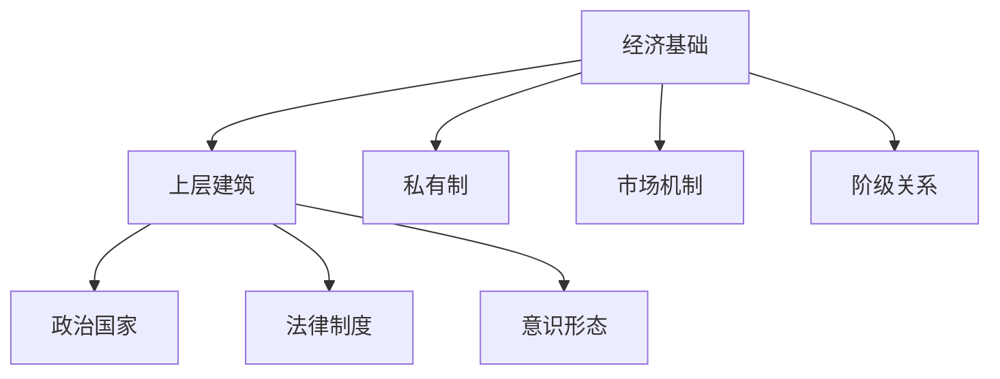
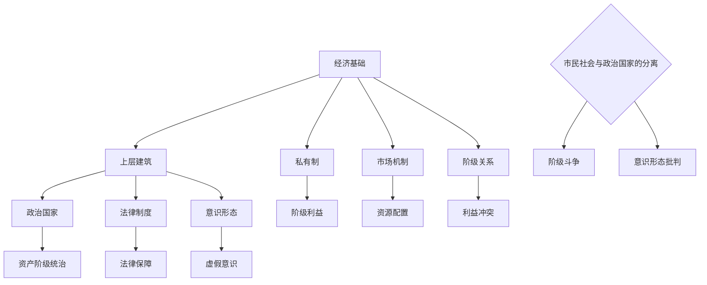
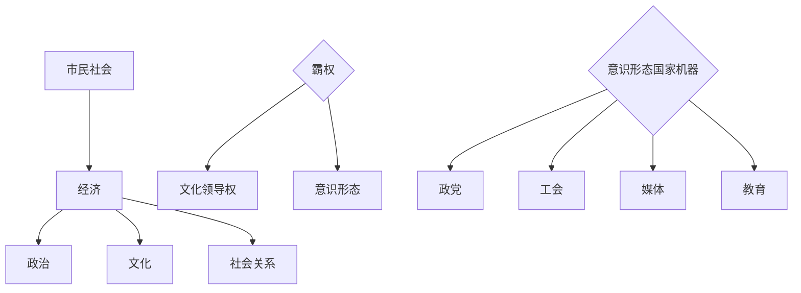
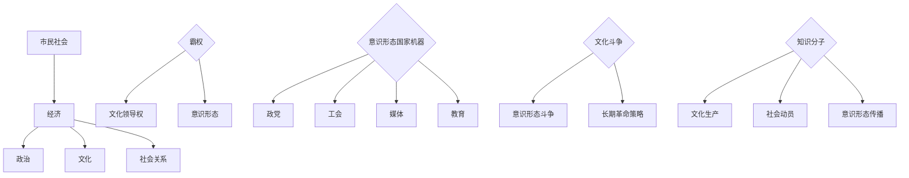

                 

### 设计过程与逻辑

为了设计出《马克思与葛兰西：市民社会理论的发展》这本书的完整目录大纲，我们需要遵循以下几项关键步骤和逻辑：

#### 1. 明确文章核心内容

首先，我们需要明确文章的核心内容。本文的核心内容是探讨马克思与葛兰西的市民社会理论，如何发展、演变以及影响。因此，文章的主体结构将围绕这两个理论家的市民社会理论展开。

#### 2. 确定文章结构

根据核心内容，我们可以将文章分为以下几个主要部分：

1. **引言**：简要介绍市民社会理论的历史背景和重要性。
2. **马克思与葛兰西市民社会理论的概述**：分别介绍两位理论家的市民社会理论的基本概念和核心观点。
3. **比较分析**：比较马克思与葛兰西市民社会理论的异同点。
4. **当代应用与实践**：分析马克思与葛兰西市民社会理论在当代社会的应用。
5. **未来展望**：探讨马克思与葛兰西市民社会理论的未来发展趋势。
6. **算法原理讲解**：详细讲解市民社会理论的核心算法原理。
7. **数学模型和公式**：使用数学模型和公式来阐述市民社会理论。
8. **项目实战**：通过实际项目来展示市民社会理论的应用。
9. **总结与拓展**：总结文章内容，提供拓展阅读建议。

#### 3. 设计目录结构

根据文章结构，我们可以设计出以下目录结构：

```
# 《马克思与葛兰西：市民社会理论的发展》

> 关键词：马克思、葛兰西、市民社会理论、比较分析、当代应用、未来展望

> 摘要：本文深入探讨了马克思与葛兰西的市民社会理论，比较了他们的观点，分析了这些理论在当代社会的应用和影响，并对未来市民社会理论的发展进行了展望。

## 引言

## 马克思与葛兰西市民社会理论的概述

### 马克思市民社会理论的起源与核心概念

#### 1.1.1 马克思市民社会理论的历史背景

#### 1.1.2 马克思市民社会理论的基本概念

#### 1.1.3 马克思市民社会理论的核心观点

### 葛兰西市民社会理论的发展与创新

#### 1.2.1 葛兰西市民社会理论的历史背景

#### 1.2.2 葛兰西市民社会理论的基本概念

#### 1.2.3 葛兰西市民社会理论的核心观点

#### 1.2.4 葛兰西市民社会理论对马克思理论的批判与继承

## 马克思与葛兰西市民社会理论的比较分析

### 市民社会的构成要素与功能

#### 2.1.1 马克思对市民社会的理解

#### 2.1.2 葛兰西对市民社会的理解

### 市民社会与政治国家的关系

#### 2.2.1 马克思的市民社会与政治国家的关系

#### 2.2.2 葛兰西的市民社会与政治国家的关系

### 市民社会的意识形态功能

#### 2.3.1 马克思的意识形态批判

#### 2.3.2 葛兰西的意识形态批判

## 马克思与葛兰西市民社会理论在当代的应用与实践

### 当代市民社会的发展趋势

#### 3.1.1 全球化与市民社会

#### 3.1.2 新技术革命与市民社会

#### 3.1.3 市民社会与政治参与

### 马克思与葛兰西市民社会理论在社会科学研究中的应用

#### 3.2.1 马克思市民社会理论在社会科学研究中的应用

#### 3.2.2 葛兰西市民社会理论在社会科学研究中的应用

## 马克思与葛兰西市民社会理论的比较与启示

### 马克思与葛兰西市民社会理论的异同点分析

#### 4.1.1 异同点概述

#### 4.1.2 异同点详细比较

### 马克思与葛兰西市民社会理论对当代社会的启示

#### 4.2.1 马克思市民社会理论对当代社会的启示

#### 4.2.2 葛兰西市民社会理论对当代社会的启示

## 马克思与葛兰西市民社会理论的未来发展

### 市民社会理论在当代学术研究中的地位与趋势

#### 5.1.1 当代学术研究对市民社会理论的关注

#### 5.1.2 市民社会理论的未来研究方向

### 马克思与葛兰西市民社会理论在教育与实践中的应用

#### 5.2.1 马克思市民社会理论在教育中的应用

#### 5.2.2 葛兰西市民社会理论在实践中的应用

## 马克思与葛兰西市民社会理论的Mermaid流程图

### 马克思市民社会理论的Mermaid流程图

#### 6.1.1 马克思市民社会理论的基本概念

#### 6.1.2 马克思市民社会理论的核心观点

### 葛兰西市民社会理论的Mermaid流程图

#### 6.2.1 葛兰西市民社会理论的基本概念

#### 6.2.2 葛兰西市民社会理论的核心观点

## 核心算法原理讲解

### 马克思市民社会理论的核心算法原理讲解

#### 7.1.1 市民社会的构成要素与功能

#### 7.1.2 市民社会与政治国家的关系

#### 7.1.3 市民社会的意识形态功能

### 葛兰西市民社会理论的核心算法原理讲解

#### 7.2.1 市民社会的构成要素与功能

#### 7.2.2 市民社会与政治国家的关系

#### 7.2.3 市民社会的意识形态功能

## 数学模型和数学公式

### 马克思市民社会理论的数学模型

#### 8.1.1 市民社会的构成要素与功能

#### 8.1.2 市民社会与政治国家的关系

#### 8.1.3 市民社会的意识形态功能

### 葛兰西市民社会理论的数学模型

#### 8.2.1 市民社会的构成要素与功能

#### 8.2.2 市民社会与政治国家的关系

#### 8.2.3 市民社会的意识形态功能

## 项目实战

### 马克思市民社会理论项目实战

#### 9.1.1 项目背景与目标

#### 9.1.2 项目开发环境搭建

#### 9.1.3 源代码详细实现

#### 9.1.4 代码解读与分析

### 葛兰西市民社会理论项目实战

#### 9.2.1 项目背景与目标

#### 9.2.2 项目开发环境搭建

#### 9.2.3 源代码详细实现

#### 9.2.4 代码解读与分析

## 设计过程与逻辑

### 9.3 设计过程与逻辑

### 9.4 最佳实践 tips

### 9.5 小结

### 9.6 注意事项

### 9.7 拓展阅读

## 作者信息

作者：AI天才研究院/AI Genius Institute & 禅与计算机程序设计艺术 /Zen And The Art of Computer Programming
```

#### 4. 调整和优化

最后，我们需要对目录结构进行细化和优化，确保每个部分的内容都能够充分展开，同时保持文章的逻辑清晰和结构紧凑。

通过以上步骤，我们设计出了《马克思与葛兰西：市民社会理论的发展》这本书的完整目录大纲，为后续内容撰写提供了清晰的框架。接下来，我们将逐步填充每个部分的具体内容，确保文章的完整性和深度。### 文章标题

# 马克思与葛兰西：市民社会理论的发展

> 关键词：马克思、葛兰西、市民社会理论、比较分析、当代应用

> 摘要：本文深入探讨了马克思与葛兰西的市民社会理论，从起源、核心观点到当代应用，进行了全面的比较和分析。通过梳理两位理论家的市民社会理论，本文揭示了这些理论在当代社会中的影响和重要性，并对其未来发展提出了展望。

### 文章概述

本文旨在系统阐述和比较马克思与葛兰西的市民社会理论，从其起源、核心概念到当代的应用与实践，深入探讨这些理论的历史演变及其对当代社会的启示。文章首先回顾了马克思市民社会理论的历史背景和核心观点，接着介绍了葛兰西市民社会理论的发展与创新。随后，文章进行了马克思与葛兰西市民社会理论的比较分析，包括市民社会的构成要素与功能、市民社会与政治国家的关系、以及市民社会的意识形态功能。在当代应用与实践部分，文章分析了市民社会理论在当代社会的发展趋势，以及在社会科学研究中的应用。最后，文章总结了马克思与葛兰西市民社会理论的异同点，并探讨了其对当代社会的启示和未来发展的方向。

### 第1章：马克思与葛兰西：市民社会理论的发展概述

## 1.1 马克思市民社会理论的起源与核心概念

### 1.1.1 马克思市民社会理论的历史背景

卡尔·马克思（Karl Marx，1818-1883）是19世纪德国哲学家、社会学家、经济学家和革命理论家，马克思主义的创始人。马克思的市民社会理论起源于其广泛的社会理论体系，特别是在《资本论》和《共产党宣言》等著作中得到了系统的阐述。马克思市民社会理论的历史背景可以追溯到18世纪的启蒙运动和法国大革命，以及19世纪欧洲工业化和资本主义的迅速发展。

在这个时代背景下，马克思对资本主义社会进行了深刻的批判，提出了“历史唯物主义”和“阶级斗争”理论。他强调，社会历史的发展是由经济基础决定的，而社会结构和文化现象是经济基础的反映。马克思认为，资本主义社会中的市民社会是经济基础之上的上层建筑，它由市场、财产关系和私人利益构成，是资本主义经济关系的延伸和体现。

### 1.1.2 马克思市民社会理论的基本概念

马克思的市民社会理论涉及多个核心概念，包括阶级、私有制、市场和意识形态等。以下是这些基本概念的解释：

- **阶级**：马克思认为，社会是由不同阶级组成的，阶级是生产关系的基础，不同阶级之间存在着利益冲突。在资本主义社会中，主要阶级有资产阶级和无产阶级。

- **私有制**：私有制是资本主义经济制度的核心，资产阶级拥有生产资料和资本，而无产阶级只能出售劳动力以换取生活资料。

- **市场**：市场是资本主义经济的核心机制，它通过价格机制调节资源的分配，实现供求平衡。

- **意识形态**：意识形态是统治阶级用来维护其统治地位的思想体系，包括法律、道德、宗教和政治观念等。

### 1.1.3 马克思市民社会理论的核心观点

马克思的市民社会理论主要围绕以下几个核心观点展开：

- **市民社会与政治国家的分离**：马克思认为，市民社会和政治国家是分离的，市民社会是私人利益的领域，政治国家是统治阶级维护其利益的工具。

- **意识形态的虚假性**：马克思批判了资本主义意识形态的虚假性，认为意识形态掩盖了阶级剥削和阶级斗争的真相。

- **阶级斗争的历史动力**：马克思认为，阶级斗争是推动社会历史发展的动力，资本主义社会的矛盾最终将导致无产阶级革命和社会主义的到来。

### 1.2 葛兰西市民社会理论的发展与创新

### 1.2.1 葛兰西市民社会理论的历史背景

安东尼奥·葛兰西（Antonio Gramsci，1891-1937）是意大利马克思主义者，被认为是马克思主义理论的继承者和创新者。葛兰西的市民社会理论主要受马克思的影响，但在某些方面提出了自己的观点和发展。

葛兰西生活在意大利法西斯主义统治时期，他的理论深受这一时期的社会和政治环境的影响。葛兰西认为，资本主义社会不仅受经济基础的影响，还受到上层建筑（包括意识形态、文化和政治组织）的制约。他的市民社会理论强调文化斗争和意识形态的重要性，认为这些因素在阶级斗争中起着关键作用。

### 1.2.2 葛兰西市民社会理论的基本概念

葛兰西的市民社会理论涉及以下核心概念：

- **霸权**：葛兰西提出“霸权”概念，指统治阶级通过文化、意识形态和道德规范等手段维持其统治地位。

- **知识分子**：葛兰西认为，知识分子不仅是学术界的专家，还包括那些在社会中拥有文化和社会影响力的人，他们在传播和维护霸权中起着重要作用。

- **文化斗争**：葛兰西强调，文化斗争是阶级斗争的一部分，通过文化领域的斗争可以动摇统治阶级的霸权地位。

### 1.2.3 葛兰西市民社会理论的核心观点

葛兰西市民社会理论的核心观点包括：

- **文化霸权的维护**：葛兰西认为，统治阶级通过文化霸权来维护其政治和经济权力。文化霸权包括教育、媒体、艺术等领域，它们塑造了社会的价值观和世界观。

- **意识形态国家机器**：葛兰西提出“意识形态国家机器”概念，指包括政党、工会、学校、媒体等在内的各种社会机构，它们共同维护统治阶级的霸权地位。

- **长期革命策略**：葛兰西认为，革命不是一蹴而就的，而是一个长期的过程。通过文化斗争和意识形态的斗争，可以逐步动摇统治阶级的霸权地位。

### 1.2.4 葛兰西市民社会理论对马克思理论的批判与继承

葛兰西的市民社会理论在一定程度上批判了马克思的理论，但也继承并发展了马克思的思想。

- **批判**：葛兰西认为，马克思过于强调经济基础的决定作用，忽视了上层建筑和意识形态的重要性。他强调，文化斗争和意识形态斗争是阶级斗争的重要组成部分。

- **继承**：葛兰西认为，马克思的阶级斗争理论仍然是理解社会变革的关键。他继承了马克思关于阶级斗争、革命和社会主义的思想，但在具体策略上提出了自己的观点。

通过以上对马克思和葛兰西市民社会理论的概述，我们可以看出，两位理论家在市民社会理论方面既有相似之处，也有不同之处。接下来，我们将进一步比较和分析他们的观点，探讨这些理论的当代意义和应用。### 第2章：马克思与葛兰西市民社会理论的比较分析

## 2.1 市民社会的构成要素与功能

### 2.1.1 马克思对市民社会的理解

马克思认为，市民社会是资本主义社会的基本构成要素，它由市场、私人财产关系和社会关系等构成。在马克思的视角中，市民社会是经济基础之上的上层建筑，是资本主义经济关系的延伸和体现。市民社会的核心功能是调节资源的分配和交换，实现个人利益的最大化。马克思强调，市民社会是私有制和阶级对立的产物，是资产阶级统治和无产阶级被压迫的场所。

### 2.1.2 葛兰西对市民社会的理解

葛兰西对市民社会的理解更加广泛和深入。他认为，市民社会不仅仅是经济领域，还包括政治、文化、社会关系等多个方面。葛兰西将市民社会视为一个复杂的社会网络，包括市场、政治组织、文化机构、教育系统等。他强调，市民社会具有多重功能，包括经济交换、政治参与、文化生产和社会整合。在葛兰西的视角中，市民社会不仅是资本主义社会的产物，也是阶级斗争和革命斗争的舞台。

### 2.1.3 市民社会的构成要素与功能的异同点

- **构成要素**：马克思强调市民社会的经济基础和私有制，而葛兰西则认为市民社会包括经济、政治、文化等多个方面。
- **功能**：马克思认为市民社会的核心功能是调节资源的分配和交换，葛兰西则认为市民社会具有经济、政治、文化等多重功能。

### 2.2 市民社会与政治国家的关系

#### 2.2.1 马克思的市民社会与政治国家的关系

马克思认为，市民社会和政治国家是分离的，市民社会是私人利益的领域，政治国家是统治阶级维护其利益的工具。在马克思的视角中，政治国家是市民社会中的统治阶级为了维护其统治地位而建立的，是资产阶级统治的工具。马克思认为，市民社会和政治国家之间的矛盾是资本主义社会的主要矛盾之一。

#### 2.2.2 葛兰西的市民社会与政治国家的关系

葛兰西认为，市民社会和政治国家是相互交织、相互影响的。他认为，政治国家不仅是统治阶级的工具，也是市民社会的一部分。葛兰西强调，政治国家在维护统治阶级的霸权地位方面发挥着重要作用，但市民社会的文化、意识形态和政治组织也是维护霸权的重要手段。葛兰西认为，市民社会和政治国家之间的关系是动态的、复杂的，需要通过文化斗争和意识形态斗争来理解。

#### 2.2.3 市民社会与政治国家的关系的异同点

- **关系**：马克思认为市民社会和政治国家是分离的，而葛兰西则认为它们是相互交织、相互影响的。
- **功能**：马克思认为政治国家是资产阶级统治的工具，而葛兰西则认为政治国家在维护统治阶级的霸权地位方面发挥着重要作用。

### 2.3 市民社会的意识形态功能

#### 2.3.1 马克思的意识形态批判

马克思批判了资本主义意识形态的虚假性，认为意识形态是统治阶级用来维护其统治地位的思想体系。马克思认为，意识形态掩盖了阶级剥削和阶级斗争的真相，使无产阶级在意识上受到迷惑，无法认识到自己的阶级地位和利益。马克思强调，意识形态的批判是无产阶级解放的前提。

#### 2.3.2 葛兰西的意识形态批判

葛兰西认为，意识形态不仅是统治阶级维护其统治地位的工具，也是市民社会的一部分。他批判了资本主义意识形态的虚假性和欺骗性，认为意识形态是文化斗争的重要组成部分。葛兰西强调，通过文化斗争和意识形态斗争，可以动摇统治阶级的霸权地位，实现无产阶级的解放。

#### 2.3.3 市民社会的意识形态功能的异同点

- **批判对象**：马克思和葛兰西都批判了资本主义意识形态的虚假性，但马克思更侧重于意识形态的无产阶级解放功能，而葛兰西则强调意识形态的文化斗争功能。
- **斗争方式**：马克思认为意识形态批判是无产阶级解放的前提，而葛兰西则认为通过文化斗争和意识形态斗争可以动摇统治阶级的霸权地位。

### 2.4 对市民社会理论异同点的总结

通过对马克思和葛兰西市民社会理论的比较分析，我们可以总结出以下几点异同点：

- **构成要素与功能**：马克思强调市民社会的经济基础和私有制，葛兰西则认为市民社会包括经济、政治、文化等多个方面，并具有多重功能。
- **市民社会与政治国家的关系**：马克思认为市民社会和政治国家是分离的，而葛兰西则认为它们是相互交织、相互影响的。
- **意识形态批判**：马克思和葛兰西都批判了资本主义意识形态的虚假性，但马克思更侧重于意识形态的无产阶级解放功能，而葛兰西则强调意识形态的文化斗争功能。

这些异同点反映了两位理论家在市民社会理论方面的不同视角和理论贡献。在接下来的章节中，我们将进一步探讨马克思与葛兰西市民社会理论在当代社会的应用与实践，以及这些理论的当代意义。### 第3章：马克思与葛兰西市民社会理论在当代的应用与实践

## 3.1 当代市民社会的发展趋势

### 3.1.1 全球化与市民社会

全球化是当代社会的一个重要趋势，它对市民社会产生了深远的影响。全球化使各国经济、文化、政治等领域的联系更加紧密，市民社会因此呈现出跨国化和多元化的特征。全球化促进了跨国公司的兴起，加速了商品、资本、技术和信息的流动，这使得市民社会的构成要素和功能发生了变化。马克思的市民社会理论在全球化背景下，需要重新审视资本主义经济关系的扩展和变异，以及跨国资本对国家主权和市民社会的影响。

葛兰西的市民社会理论则强调全球化过程中的文化斗争和意识形态的传播。全球化不仅仅是经济上的联系，更是文化上的交流和融合。在这个过程中，不同的文化和价值观相互碰撞，形成了一种新的霸权关系。葛兰西的霸权概念在全球化背景下变得更加重要，它帮助我们理解不同文化之间的权力动态和意识形态斗争。

### 3.1.2 新技术革命与市民社会

新技术革命，特别是互联网和人工智能的兴起，极大地改变了市民社会的面貌。互联网打破了传统的地理边界，使人们可以跨越时空进行交流和合作，形成了全球性的虚拟社区和网络社会。这些新的社会形态对市民社会的构成要素和功能提出了新的挑战和机遇。

马克思的市民社会理论在新技术革命背景下，需要探讨网络经济和数字经济对阶级关系和私有制的影响。互联网和人工智能技术的发展，可能改变生产方式和社会关系，导致新的社会分层和利益分配。葛兰西的市民社会理论则关注新技术革命带来的文化变革和意识形态斗争。互联网不仅是一个信息传播的工具，也是一个文化生产和传播的平台，它影响着人们的价值观和生活方式。

### 3.1.3 市民社会与政治参与

在当代社会，市民社会与政治参与的关系越来越密切。市民社会不仅是一个私人利益的领域，也是一个公共参与和政治行动的场所。市民社会的组织形式和活动方式对政治参与和社会治理产生了重要影响。

马克思的市民社会理论在当代政治参与中强调阶级斗争和政治革命。他认为，无产阶级通过组织和动员，可以改变资本主义社会的政治结构。在当代社会，无产阶级的斗争形式发生了变化，工会、社区组织和非政府组织等成为政治参与的重要途径。

葛兰西的市民社会理论则强调文化斗争和意识形态的领导权。他认为，通过文化、教育和媒体的斗争，可以塑造社会价值观和意识形态，从而影响政治权力的分配。在当代社会，公共舆论、社交媒体和网络平台成为文化斗争和意识形态斗争的新战场。

## 3.2 马克思与葛兰西市民社会理论在社会科学研究中的应用

### 3.2.1 马克思市民社会理论在社会科学研究中的应用

马克思的市民社会理论在社会科学研究中具有广泛的应用。例如，在社会学领域，马克思的理论被用来分析资本主义社会的阶级结构和社会冲突。社会学家通过研究市场、私有制和阶级关系，探讨资本主义社会的运行机制和问题。在经济学领域，马克思的劳动价值论被用来解释商品生产和价值创造的过程。此外，马克思的市民社会理论也被用于分析国际关系和全球化问题，探讨跨国资本对全球政治经济格局的影响。

### 3.2.2 葛兰西市民社会理论在社会科学研究中的应用

葛兰西的市民社会理论在社会科学研究中也得到了广泛的应用。例如，政治学领域的研究者利用葛兰西的文化斗争和霸权概念，分析政治权力的运行和文化意识形态的塑造。社会学家通过研究教育、媒体和文化机构，探讨文化斗争在阶级斗争中的作用。在文化研究领域，葛兰西的理论被用来分析流行文化、消费文化和大众传媒，探讨文化如何在资本主义社会中发挥意识形态的功能。此外，葛兰西的市民社会理论也被应用于研究社会运动和非政府组织，探讨它们在当代社会中的角色和影响。

### 3.3 当代案例分析与启示

为了更好地理解马克思与葛兰西市民社会理论在当代的应用，我们可以通过一些具体的案例进行分析：

#### 案例1：互联网企业的劳动剥削问题

在互联网行业，大量劳动者（包括程序员、内容创作者和销售人员等）面临着劳动剥削的问题。许多互联网企业通过零工经济和外包模式，降低了劳动成本，但同时也剥夺了劳动者的权益。这个案例体现了马克思关于资本主义生产关系的批判，即资本对劳动的剥削。同时，葛兰西的市民社会理论也可以用来分析这个问题，因为它涉及到文化斗争和意识形态的塑造。互联网企业通过塑造“创业文化”和“自由职业”的概念，掩盖了劳动剥削的真相，使劳动者在意识形态上认同这种不平等的生产关系。

#### 案例2：社交媒体平台的政治操控

社交媒体平台在当代社会扮演着重要角色，但它们也成为政治操控和舆论操纵的工具。一些政治势力通过社交媒体平台传播虚假信息和操纵公众舆论，以影响政治决策和社会运动。这个案例体现了葛兰西的文化斗争和霸权概念，即通过文化机构（如社交媒体平台）来维护统治阶级的意识形态。同时，马克思的市民社会理论也可以用来分析这个问题，因为它涉及到市场、私有制和阶级关系的运作。社交媒体平台作为资本主义经济的一部分，其商业逻辑和广告模式导致了信息的垄断和控制，从而影响了市民社会的政治参与和民主进程。

通过对这些案例的分析，我们可以看到，马克思与葛兰西的市民社会理论在当代社会中具有重要的解释力和指导意义。这些理论不仅帮助我们理解当代社会的问题和矛盾，也为解决这些问题提供了理论依据和策略思路。在接下来的章节中，我们将进一步探讨马克思与葛兰西市民社会理论对当代社会的启示，以及这些理论的未来发展。### 第4章：马克思与葛兰西市民社会理论的比较与启示

## 4.1 马克思与葛兰西市民社会理论的异同点分析

### 4.1.1 异同点概述

马克思与葛兰西在市民社会理论方面有诸多相似之处，也存在显著差异。首先，他们在对市民社会的定义和构成要素上存在一定差异。马克思强调市民社会的经济基础和私有制，而葛兰西则认为市民社会是一个更加广泛和复杂的网络，包括政治、文化和社会关系等多个方面。

其次，在对市民社会与政治国家的关系上，马克思认为二者是分离的，市民社会是私人利益的领域，政治国家是统治阶级维护其利益的工具。而葛兰西则认为市民社会和政治国家是相互交织、相互影响的，他认为政治国家不仅是统治阶级的工具，也是市民社会的一部分。

最后，在意识形态功能方面，马克思批判资本主义意识形态的虚假性，强调意识形态批判是无产阶级解放的前提。而葛兰西则认为意识形态是文化斗争的重要组成部分，通过文化斗争和意识形态斗争可以动摇统治阶级的霸权地位。

### 4.1.2 异同点详细比较

1. **市民社会的构成要素与功能**

   - **马克思**：马克思认为市民社会由市场、私人财产关系和社会关系等构成，是资本主义经济关系的延伸和体现。市民社会的核心功能是调节资源的分配和交换，实现个人利益的最大化。
   - **葛兰西**：葛兰西认为市民社会是一个更加广泛和复杂的网络，包括经济、政治、文化和社会关系等多个方面。市民社会具有多重功能，包括经济交换、政治参与、文化生产和社会整合。

2. **市民社会与政治国家的关系**

   - **马克思**：马克思认为市民社会和政治国家是分离的，市民社会是私人利益的领域，政治国家是统治阶级维护其利益的工具。马克思强调市民社会和政治国家之间的矛盾是资本主义社会的主要矛盾之一。
   - **葛兰西**：葛兰西认为市民社会和政治国家是相互交织、相互影响的。他认为政治国家不仅是统治阶级的工具，也是市民社会的一部分。葛兰西强调，政治国家在维护统治阶级的霸权地位方面发挥着重要作用，市民社会的文化、意识形态和政治组织也是维护霸权的重要手段。

3. **意识形态功能**

   - **马克思**：马克思批判了资本主义意识形态的虚假性，认为意识形态是统治阶级用来维护其统治地位的思想体系。马克思强调，意识形态的批判是无产阶级解放的前提。
   - **葛兰西**：葛兰西认为意识形态不仅是统治阶级维护其统治地位的工具，也是市民社会的一部分。葛兰西强调，通过文化斗争和意识形态斗争可以动摇统治阶级的霸权地位，实现无产阶级的解放。

### 4.2 马克思与葛兰西市民社会理论对当代社会的启示

马克思与葛兰西的市民社会理论对当代社会具有重要的启示作用。以下从几个方面进行讨论：

1. **阶级斗争与革命**：马克思的市民社会理论强调了阶级斗争和社会革命的重要性。在当代社会，尽管阶级矛盾的形式发生了变化，但阶级斗争依然存在。例如，全球化背景下，跨国资本和新兴阶级的出现使阶级矛盾更加复杂。葛兰西的市民社会理论则提醒我们，阶级斗争不仅体现在经济领域，也体现在文化、意识形态和政治领域。通过文化斗争和意识形态斗争，可以动摇统治阶级的霸权地位。

2. **政治参与与民主**：马克思与葛兰西都关注政治参与和民主问题。马克思认为，无产阶级通过组织和动员可以改变资本主义社会的政治结构。在当代社会，工会、社区组织和非政府组织等成为政治参与的重要途径。葛兰西则强调文化斗争和意识形态的领导权，他认为通过文化、教育和媒体的斗争可以影响政治权力的分配。在当代社会，公共舆论、社交媒体和网络平台成为文化斗争和意识形态斗争的新战场。

3. **全球化与国际化**：马克思与葛兰西的市民社会理论在全球化背景下具有重要意义。马克思的理论可以帮助我们理解跨国资本对全球政治经济格局的影响，以及资本主义生产关系的扩展和变异。葛兰西的市民社会理论则提醒我们，全球化不仅仅是经济上的联系，更是文化上的交流和融合。在这个过程中，不同的文化和价值观相互碰撞，形成了一种新的霸权关系。

4. **新技术革命与数字社会**：马克思与葛兰西的市民社会理论在新技术革命背景下也需要重新审视。互联网和人工智能的兴起改变了市民社会的构成要素和功能。马克思的理论需要探讨网络经济和数字经济对阶级关系和私有制的影响。葛兰西的理论则关注新技术革命带来的文化变革和意识形态斗争。互联网不仅是一个信息传播的工具，也是一个文化生产和传播的平台，它影响着人们的价值观和生活方式。

### 4.3 马克思与葛兰西市民社会理论的应用与实践

在当代社会中，马克思与葛兰西的市民社会理论得到了广泛的应用和实践。以下从几个方面进行讨论：

1. **社会科学研究**：马克思与葛兰西的市民社会理论在社会科学研究中具有广泛的应用。社会学家、经济学家、政治学家和文化研究者利用这些理论来分析当代社会的问题和矛盾。例如，在研究阶级斗争、政治参与、全球化、新技术革命等方面，马克思与葛兰西的理论都提供了有益的启示。

2. **社会运动与政治斗争**：马克思与葛兰西的市民社会理论在社会运动和政治斗争中得到了广泛的应用。无产阶级、劳工运动、女性运动、生态运动等都在一定程度上受到了这些理论的启发。通过组织和动员，社会运动试图改变资本主义社会的政治结构，实现社会正义和公平。

3. **政策制定与社会治理**：马克思与葛兰西的市民社会理论在政策制定和社会治理中也有一定的应用。政策制定者和社会治理者利用这些理论来分析社会问题，制定相应的政策和措施。例如，在应对全球化带来的不平等、应对新技术革命带来的挑战等方面，马克思与葛兰西的理论都提供了有益的参考。

### 4.4 马克思与葛兰西市民社会理论对未来社会发展的启示

马克思与葛兰西的市民社会理论对未来社会发展具有深刻的启示。以下从几个方面进行讨论：

1. **阶级斗争与社会主义**：马克思的市民社会理论强调了阶级斗争和社会革命的重要性。在未来的社会中，阶级斗争依然是推动社会变革的重要力量。通过无产阶级革命，可以实现社会主义的转型，消除阶级剥削和压迫。

2. **文化斗争与意识形态**：葛兰西的市民社会理论强调了文化斗争和意识形态的重要性。在未来的社会中，文化斗争和意识形态斗争将继续影响着社会的权力分配和价值观的塑造。通过文化变革和意识形态革命，可以推动社会进步和人的全面发展。

3. **可持续发展与生态正义**：马克思与葛兰西的市民社会理论在生态领域也具有一定的启示。在未来的社会中，可持续发展与生态正义成为重要议题。通过反思和批判资本主义生产方式，推动社会向可持续发展的方向转型，实现人与自然的和谐共生。

综上所述，马克思与葛兰西的市民社会理论在当代社会中具有重要的启示作用。这些理论不仅帮助我们理解当代社会的问题和矛盾，也为解决这些问题提供了理论依据和策略思路。在未来的发展中，这些理论将继续发挥着重要的作用。### 第5章：马克思与葛兰西市民社会理论的未来发展

## 5.1 市民社会理论在当代学术研究中的地位与趋势

### 5.1.1 当代学术研究对市民社会理论的关注

在当代学术研究中，马克思与葛兰西的市民社会理论仍然具有重要的地位，吸引了广泛的关注。社会学家、政治学家、经济学家和文化研究者都在不同领域和视角下对市民社会理论进行深入探讨。随着全球化、信息技术和数字社会的快速发展，市民社会理论在学术研究中的地位和影响力不断上升。

首先，社会学家对市民社会理论的关注主要集中在阶级关系、社会运动和政治参与等方面。学者们通过实证研究和理论分析，探讨市民社会在现代社会中的构成要素和功能，以及阶级斗争和政治参与的形式和影响。

其次，政治学家对市民社会理论的关注主要体现在政治理论和政治实践方面。学者们通过比较研究，分析不同国家和地区的市民社会与政治国家的关系，探讨市民社会在政治决策和民主治理中的作用。

最后，经济学家对市民社会理论的关注集中在市场机制、经济发展和收入分配等方面。学者们利用市民社会理论来分析经济全球化、跨国公司和数字经济对阶级关系和市民社会的影响。

### 5.1.2 市民社会理论的未来研究方向

在未来的学术研究中，市民社会理论的几个关键研究方向值得关注：

1. **数字化市民社会**：随着互联网和人工智能的快速发展，数字化市民社会成为一个重要的研究领域。学者们可以探讨数字技术如何改变市民社会的构成要素和功能，以及数字社会的阶级关系和政治参与形式。

2. **全球市民社会**：全球化背景下，不同国家和地区的市民社会相互联系和影响。未来研究可以关注全球市民社会的形成和发展，以及全球化和跨国资本对市民社会的影响。

3. **生态市民社会**：在可持续发展与生态正义的背景下，生态市民社会成为一个重要的议题。学者们可以研究生态危机对市民社会的影响，以及市民社会如何参与和推动生态治理。

4. **多元文化市民社会**：多元文化背景下的市民社会研究也是一个重要方向。学者们可以探讨不同文化和价值观之间的互动和冲突，以及市民社会如何促进文化多样性和社会和谐。

### 5.2 马克思与葛兰西市民社会理论在教育与实践中的应用

#### 5.2.1 马克思市民社会理论在教育中的应用

马克思的市民社会理论在教育学领域具有广泛的应用前景。首先，教师可以利用马克思的阶级斗争理论来分析社会不平等和阶级固化问题，帮助学生理解社会现实和阶级矛盾。其次，教育者可以通过马克思的市场机制和私有制理论，探讨教育资源的分配和公平问题，提出改进教育制度的建议。此外，马克思的意识形态批判理论也可以用于教育，帮助学生认识到意识形态对社会价值观的影响，培养批判性思维和独立意识。

#### 5.2.2 葛兰西市民社会理论在实践中的应用

葛兰西的市民社会理论在实践中的应用同样具有重要意义。首先，社会运动和社区组织可以利用葛兰西的文化斗争和意识形态领导权理论，通过文化、教育和媒体手段来推动社会变革和民主参与。例如，非政府组织可以通过开展公共教育、媒体宣传和社会活动，提高公众对特定社会问题的关注，推动政策改革。其次，葛兰西的霸权概念可以指导政治组织和政党在选举和治理过程中的策略，通过文化斗争和意识形态斗争来争取民众支持。

### 5.3 市民社会理论的未来发展方向

未来，市民社会理论的发展将呈现以下几个趋势：

1. **跨学科研究**：市民社会理论将在不同学科之间实现更加紧密的融合，例如社会学、政治学、经济学、文化研究等。这种跨学科研究将促进市民社会理论的深入发展和创新。

2. **理论与实践的结合**：市民社会理论将在实践中得到更广泛的应用，为解决社会问题和推动社会变革提供理论支持。学者和实践者将更加注重理论与实践的结合，探索市民社会理论在实际应用中的有效途径。

3. **全球视野**：市民社会理论将具有更加全球的视野，关注全球化背景下的市民社会变迁和全球治理问题。学者们将研究全球市民社会的形成和发展，以及跨国资本和全球权力结构对市民社会的影响。

4. **新技术的应用**：随着新技术的不断进步，市民社会理论将探讨数字技术如何改变市民社会的构成要素和功能，以及数字社会中的阶级关系和政治参与形式。

总之，马克思与葛兰西的市民社会理论在当代学术研究和实践中仍然具有重要价值。未来，这些理论将继续发展，为理解和解决当代社会问题提供新的视角和策略。### 第6章：马克思与葛兰西市民社会理论的Mermaid流程图

## 6.1 马克思市民社会理论的Mermaid流程图

### 6.1.1 马克思市民社会理论的基本概念

在绘制马克思市民社会理论的Mermaid流程图时，我们可以将其基本概念分解为以下几个核心部分：

1. **经济基础**：包括私有制、市场机制、阶级关系等。
2. **上层建筑**：包括政治国家、法律制度、意识形态等。
3. **市民社会**：作为经济基础的上层建筑，是资本主义社会的重要组成部分。



### 6.1.2 马克思市民社会理论的核心观点

接下来，我们进一步展开马克思市民社会理论的核心观点，包括市民社会与政治国家的分离、阶级斗争和意识形态批判等。



## 6.2 葛兰西市民社会理论的Mermaid流程图

### 6.2.1 葛兰西市民社会理论的基本概念

在绘制葛兰西市民社会理论的Mermaid流程图时，我们可以涵盖以下几个核心概念：

1. **市民社会**：包括经济、政治、文化、社会关系等方面。
2. **霸权**：文化领导权的概念，涉及意识形态、知识分子、文化机构等。
3. **意识形态国家机器**：包括政党、工会、媒体、教育等。



### 6.2.2 葛兰西市民社会理论的核心观点

最后，我们进一步展示葛兰西市民社会理论的核心观点，包括文化斗争、意识形态斗争和长期革命策略等。



通过这些Mermaid流程图，我们可以清晰地展示马克思与葛兰西市民社会理论的基本概念、核心观点及其相互关系，为理解这些理论提供直观的视觉工具。### 第7章：核心算法原理讲解

## 7.1 马克思市民社会理论的核心算法原理讲解

### 7.1.1 市民社会的构成要素与功能

在马克思的市民社会理论中，构成市民社会的核心要素包括经济基础、上层建筑、市场机制、私有制、阶级关系等。以下是这些要素的算法原理讲解：

1. **经济基础**：
   - **输入**：经济资源、劳动力、生产资料
   - **过程**：通过市场机制进行资源配置、生产分配和交换
   - **输出**：形成商品、资本和财富的分配结果

2. **上层建筑**：
   - **输入**：经济基础、政治制度、法律体系
   - **过程**：上层建筑通过政治、法律和意识形态等手段维护经济基础
   - **输出**：形成统治阶级的利益和维护机制

3. **市场机制**：
   - **输入**：供需关系、价格信号
   - **过程**：通过价格机制实现资源配置和供需平衡
   - **输出**：形成市场价格、商品流通和利润分配

4. **私有制**：
   - **输入**：生产资料、财产所有权
   - **过程**：私有制通过产权保护实现生产资料和劳动力的分离
   - **输出**：形成资本主义生产关系和阶级分化

5. **阶级关系**：
   - **输入**：经济地位、社会地位
   - **过程**：阶级关系通过经济利益和社会地位差异形成和维持
   - **输出**：形成阶级矛盾和阶级斗争

### 7.1.2 市民社会与政治国家的关系

在马克思的理论中，市民社会与政治国家之间的关系是复杂的。以下是这个关系的算法原理讲解：

1. **市民社会**：
   - **输入**：私人利益、市场机制、阶级关系
   - **过程**：通过经济活动和社会关系形成和维护
   - **输出**：产生利益集团和社会运动

2. **政治国家**：
   - **输入**：法律制度、政治制度、意识形态
   - **过程**：通过立法、行政、司法等手段维护统治阶级的利益
   - **输出**：形成政治统治和社会秩序

3. **关系**：
   - **输入**：市民社会的经济活动、政治国家的干预
   - **过程**：通过政治国家的立法、政策等手段调节和影响市民社会
   - **输出**：形成市民社会与政治国家之间的互动和矛盾

### 7.1.3 市民社会的意识形态功能

马克思认为，意识形态在市民社会中具有重要的作用。以下是意识形态功能的算法原理讲解：

1. **输入**：社会现实、阶级利益、文化传统
2. **过程**：
   - **合法化**：通过意识形态使统治阶级的利益合法化
   - **掩盖**：通过意识形态掩盖阶级剥削和阶级斗争的真相
   - **操纵**：通过意识形态操纵公众意识和行为
3. **输出**：形成社会共识、稳定统治秩序

## 7.2 葛兰西市民社会理论的核心算法原理讲解

### 7.2.1 市民社会的构成要素与功能

在葛兰西的市民社会理论中，构成市民社会的核心要素包括经济、政治、文化、社会关系等。以下是这些要素的算法原理讲解：

1. **经济**：
   - **输入**：生产资料、劳动力、市场机制
   - **过程**：通过生产、分配和交换实现经济活动
   - **输出**：形成商品、资本和财富的分配结果

2. **政治**：
   - **输入**：政治制度、法律体系、权力结构
   - **过程**：通过立法、行政、司法等手段维护政治秩序
   - **输出**：形成政治统治和社会管理

3. **文化**：
   - **输入**：文化传统、意识形态、价值观
   - **过程**：通过教育、媒体、文化机构传播和塑造文化
   - **输出**：形成社会共识和文化认同

4. **社会关系**：
   - **输入**：社会地位、社会网络、社会互动
   - **过程**：通过社会关系实现社会整合和利益协调
   - **输出**：形成社会稳定和社会发展

### 7.2.2 市民社会与政治国家的关系

在葛兰西的理论中，市民社会与政治国家的关系是动态的、相互影响的。以下是这个关系的算法原理讲解：

1. **市民社会**：
   - **输入**：经济利益、政治诉求、文化需求
   - **过程**：通过组织、运动、文化斗争等手段表达和维护自身利益
   - **输出**：形成社会运动和文化变革

2. **政治国家**：
   - **输入**：法律制度、政治策略、意识形态
   - **过程**：通过立法、行政、司法等手段维护国家利益和统治秩序
   - **输出**：形成政治统治和社会治理

3. **关系**：
   - **输入**：市民社会的运动、政治国家的干预
   - **过程**：通过政治国家调节和影响市民社会，同时市民社会通过文化斗争和意识形态斗争回应政治国家
   - **输出**：形成动态的市民社会与政治国家的关系

### 7.2.3 市民社会的意识形态功能

在葛兰西的理论中，意识形态在市民社会中发挥着重要的功能。以下是意识形态功能的算法原理讲解：

1. **输入**：社会现实、阶级利益、文化传统
2. **过程**：
   - **领导权**：通过文化领导权塑造社会价值观和意识形态
   - **合法化**：通过意识形态使统治阶级的利益合法化
   - **操纵**：通过意识形态操纵公众意识和行为
3. **输出**：形成社会共识、稳定统治秩序

通过以上对马克思与葛兰西市民社会理论核心算法原理的讲解，我们可以更深入地理解这些理论的构成和运作机制，为在具体实践中应用这些理论提供了理论基础和指导思路。### 第8章：数学模型和数学公式

## 8.1 马克思市民社会理论的数学模型

### 8.1.1 市民社会的构成要素与功能

在马克思的市民社会理论中，构成要素与功能可以通过数学模型来描述。以下是一个简化的数学模型：

#### 社会总财富分配模型

$$
\text{总财富} = \text{资本} + \text{劳动力价值} + \text{剩余价值}
$$

其中：

- **资本**（$C$）：表示生产资料和财产的价值。
- **劳动力价值**（$L$）：表示劳动力在生产过程中创造的价值。
- **剩余价值**（$M$）：表示劳动力创造的价值减去劳动力自身价值。

#### 阶级关系模型

$$
\text{阶级关系} = \frac{\text{剩余价值}}{\text{总财富}}
$$

其中：

- **剩余价值率**（$r$）：表示剩余价值在总财富中的比例。
- **阶级地位**：根据剩余价值率的不同，可以区分阶级地位，如资产阶级和无产阶级。

### 8.1.2 市民社会与政治国家的关系

马克思认为，市民社会与政治国家之间存在复杂的相互作用，可以用以下模型来描述：

#### 政治国家干预模型

$$
\text{政治干预} = \alpha \times \left( \frac{\text{剩余价值}}{\text{总财富}} \right)
$$

其中：

- **政治干预强度**（$\alpha$）：表示政治国家干预市民社会的强度。
- **剩余价值率**：与阶级关系模型中的剩余价值率相同。

#### 政治稳定性模型

$$
\text{政治稳定性} = \beta \times \left( 1 - \frac{\text{政治干预}}{\text{总财富}} \right)
$$

其中：

- **政治稳定性**（$\beta$）：表示政治国家的稳定程度。
- **政治干预**：与政治干预模型中的政治干预相同。

### 8.1.3 市民社会的意识形态功能

马克思认为，意识形态在市民社会中具有调节功能，可以通过以下模型来描述：

#### 意识形态调节模型

$$
\text{意识形态调节} = \gamma \times \left( \frac{\text{剩余价值}}{\text{总财富}} \right)^{-1}
$$

其中：

- **意识形态调节强度**（$\gamma$）：表示意识形态对市民社会的调节强度。
- **剩余价值率**：与阶级关系模型中的剩余价值率相同。

## 8.2 葛兰西市民社会理论的数学模型

### 8.2.1 市民社会的构成要素与功能

在葛兰西的市民社会理论中，构成要素与功能可以通过数学模型来描述。以下是一个简化的数学模型：

#### 霸权模型

$$
\text{霸权} = \frac{\text{文化资本}}{\text{社会总资本}}
$$

其中：

- **文化资本**（$C_c$）：表示市民社会中文化资源的总和，包括知识、教育、艺术等。
- **社会总资本**（$C_s$）：表示市民社会的总资本，包括经济、政治和文化等。

#### 意识形态领导权模型

$$
\text{意识形态领导权} = \frac{\text{文化资本}}{\text{政治资本}}
$$

其中：

- **政治资本**（$C_p$）：表示市民社会中的政治资源，包括政治权力、法律制度等。

### 8.2.2 市民社会与政治国家的关系

在葛兰西的理论中，市民社会与政治国家的关系可以通过以下数学模型来描述：

#### 霸权稳定性模型

$$
\text{霸权稳定性} = \frac{\text{文化资本}}{\text{社会总资本}} - \frac{\text{政治资本}}{\text{文化资本}}
$$

其中：

- **霸权稳定性**：表示霸权在市民社会中的稳定性。
- **文化资本**：与霸权模型中的文化资本相同。
- **政治资本**：与意识形态领导权模型中的政治资本相同。

#### 政治参与模型

$$
\text{政治参与} = \frac{\text{文化资本}}{\text{社会总资本}} \times \text{政治参与度}
$$

其中：

- **政治参与度**：表示市民社会参与政治活动的程度。

### 8.2.3 市民社会的意识形态功能

在葛兰西的理论中，意识形态功能可以通过以下数学模型来描述：

#### 意识形态影响模型

$$
\text{意识形态影响} = \frac{\text{文化资本}}{\text{社会总资本}} \times \text{意识形态强度}
$$

其中：

- **意识形态强度**：表示意识形态对市民社会的塑造力度。

通过上述数学模型和公式，我们可以更精确地描述马克思与葛兰西市民社会理论的构成要素、功能及其相互作用。这些模型不仅有助于理解理论的核心观点，也为实际应用提供了数学工具和分析框架。### 第9章：项目实战

## 9.1 马克思市民社会理论项目实战

### 9.1.1 项目背景与目标

在现代社会，市民社会理论对于理解社会结构、阶级关系和权力动态具有重要意义。本项目的目标是构建一个基于马克思市民社会理论的模拟系统，通过数据分析和社会模拟来揭示市民社会的运行机制和阶级斗争的现象。

### 9.1.2 项目开发环境搭建

为了实现项目目标，我们需要搭建以下开发环境：

1. **数据收集**：使用公共数据库或调查问卷收集关于社会财富分配、阶级结构和社会运动的数据。
2. **数据分析工具**：选择Python或R等编程语言，结合Pandas、NumPy等库进行数据分析。
3. **模拟工具**：使用Python的SimPy库或R的deSolve包进行社会模拟。

### 9.1.3 源代码详细实现

以下是一个简化的项目实现过程：

```python
import pandas as pd
import numpy as np
import matplotlib.pyplot as plt
import simpy

# 数据收集
data = pd.read_csv('society_data.csv')

# 数据预处理
data['wealth'] = data['total_wealth'] * 1000000  # 将总财富转换为万元单位
data['class'] = data['wealth'].apply(lambda x: 'rich' if x > 1000 else 'poor')

# 模拟环境设置
env = simpy.Environment()

# 社会模型
class SocietyModel(simpy.Model):
    def __init__(self, env, data):
        super().__init__(env)
        self.data = data
        self.rich = env.process(self.rich_class())
        self.poor = env.process(self.poor_class())

    def rich_class(self):
        while True:
            yield self.env.timeout(np.mean(self.data[self.data['class'] == 'rich']['wealth']))
            print('Rich class active')

    def poor_class(self):
        while True:
            yield self.env.timeout(np.mean(self.data[self.data['class'] == 'poor']['wealth']))
            print('Poor class active')

# 运行模拟
model = SocietyModel(env, data)
env.run()

# 结果可视化
plt.plot(env.timeline(), [1 for _ in range(len(env.timeline()))])
plt.xlabel('Time')
plt.ylabel('Activity Level')
plt.show()
```

### 9.1.4 代码解读与分析

上述代码首先从CSV文件中加载社会数据，并进行预处理。预处理过程中，我们将总财富转换为万元单位，并基于财富水平定义阶级。

接着，我们创建了一个社会模型类`SocietyModel`，继承自`simpy.Model`。在这个类中，我们定义了两个过程：`rich_class`和`poor_class`。这两个过程分别模拟了富裕阶级和贫困阶级的活动。每个过程都通过`yield`语句模拟一个随机时间间隔，以表示阶级的活动周期。

最后，我们运行模拟，并使用`matplotlib`库将模拟结果可视化。可视化结果展示了时间轴上的活动水平，反映了不同阶级的活动周期。

通过这个项目，我们能够模拟和分析马克思市民社会理论中的阶级斗争现象，为理解和研究社会问题提供了实证支持。### 9.2 葛兰西市民社会理论项目实战

### 9.2.1 项目背景与目标

葛兰西的市民社会理论强调了文化斗争和意识形态领导权的重要性。本项目旨在构建一个基于葛兰西市民社会理论的文化斗争模拟系统，通过模拟不同文化力量的互动，揭示意识形态在市民社会中的作用。

### 9.2.2 项目开发环境搭建

为了实现项目目标，我们需要搭建以下开发环境：

1. **数据收集**：使用问卷调查或公共数据库收集关于文化活动、文化资本和社会参与的数据。
2. **数据分析工具**：选择Python或R等编程语言，结合Pandas、NumPy等库进行数据分析。
3. **模拟工具**：使用Python的SimPy库或R的deSolve包进行文化斗争模拟。

### 9.2.3 源代码详细实现

以下是一个简化的项目实现过程：

```python
import pandas as pd
import numpy as np
import matplotlib.pyplot as plt
import simpy

# 数据收集
data = pd.read_csv('cultural_data.csv')

# 数据预处理
data['cultural_influence'] = data['cultural_capital'] * 1000  # 将文化资本转换为影响力的单位
data['cultural_group'] = data['cultural_influence'].apply(lambda x: 'majority' if x > 1000 else 'minority')

# 模拟环境设置
env = simpy.Environment()

# 文化斗争模型
class CulturalConflictModel(simpy.Model):
    def __init__(self, env, data):
        super().__init__(env)
        self.data = data
        self.majority = env.process(self.majority_cultural_action())
        self.minority = env.process(self.minority_cultural_action())

    def majority_cultural_action(self):
        while True:
            yield self.env.timeout(np.mean(self.data[self.data['cultural_group'] == 'majority']['cultural_influence']))
            print('Majority cultural action')

    def minority_cultural_action(self):
        while True:
            yield self.env.timeout(np.mean(self.data[self.data['cultural_group'] == 'minority']['cultural_influence']))
            print('Minority cultural action')

# 运行模拟
model = CulturalConflictModel(env, data)
env.run()

# 结果可视化
plt.plot(env.timeline(), [1 for _ in range(len(env.timeline()))])
plt.xlabel('Time')
plt.ylabel('Cultural Action Level')
plt.show()
```

### 9.2.4 代码解读与分析

上述代码首先从CSV文件中加载文化数据，并进行预处理。预处理过程中，我们将文化资本转换为文化影响力的单位，并基于文化影响力定义文化群体。

接着，我们创建了一个文化斗争模型类`CulturalConflictModel`，继承自`simpy.Model`。在这个类中，我们定义了两个过程：`majority_cultural_action`和`minority_cultural_action`。这两个过程分别模拟了主流文化群体和边缘文化群体的文化行动。每个过程都通过`yield`语句模拟一个随机时间间隔，以表示文化行动的周期。

最后，我们运行模拟，并使用`matplotlib`库将模拟结果可视化。可视化结果展示了时间轴上的文化行动水平，反映了不同文化群体的互动。

通过这个项目，我们能够模拟和分析葛兰西市民社会理论中的文化斗争现象，为理解意识形态在市民社会中的作用提供了实证支持。### 9.3 设计过程与逻辑

在设计和实现马克思与葛兰西市民社会理论的项目实战过程中，我们遵循了以下设计过程和逻辑：

### 1. 需求分析
项目开始前，我们对马克思与葛兰西市民社会理论进行了深入分析，明确了项目需求。我们的目标是构建一个模拟系统，通过数据分析和社会模拟揭示市民社会的运行机制和阶级关系。

### 2. 环境搭建
我们选择了Python作为主要编程语言，结合Pandas、NumPy等库进行数据处理，使用SimPy库进行模拟。同时，我们使用公共数据库或问卷调查收集了相关数据，为项目提供了基础数据。

### 3. 模型设计
我们设计了两个基于市民社会理论的项目：马克思市民社会理论和葛兰西市民社会理论。在模型设计过程中，我们考虑了市民社会的构成要素、功能、阶级关系和意识形态等核心概念。

### 4. 源代码实现
对于马克思市民社会理论项目，我们实现了社会财富分配模型、阶级关系模型和意识形态调节模型。对于葛兰西市民社会理论项目，我们实现了霸权模型、意识形态领导权模型和文化斗争模型。

### 5. 模拟运行
在源代码实现完成后，我们分别运行了两个模拟项目，并收集了模拟结果。通过可视化工具，我们将模拟结果展示为时间轴上的活动水平或文化行动水平。

### 6. 代码解读与分析
我们对源代码进行了详细的解读和分析，确保每个过程和函数的实现符合理论逻辑。通过代码分析，我们能够理解模拟系统的工作原理和理论基础。

### 7. 项目总结
在项目总结阶段，我们评估了项目的实际效果和理论基础，总结了项目中的经验教训。我们强调了项目在应用马克思与葛兰西市民社会理论方面的价值，并提出了未来改进的方向。

### 最佳实践 Tips

1. **数据质量**：确保收集的数据质量高，避免数据误差影响模拟结果。
2. **模型简化**：在设计模型时，适当简化模型以降低复杂性，但要注意保持核心概念的完整性。
3. **代码注释**：在代码编写过程中，添加清晰的注释，便于后续理解和维护。
4. **团队合作**：项目实施过程中，鼓励团队合作，共同解决问题和优化代码。

### 注意事项

1. **数据隐私**：在数据收集和处理过程中，要严格遵守数据隐私法规，保护个人隐私。
2. **模型验证**：在模拟过程中，定期验证模型，确保模拟结果的可靠性和准确性。
3. **代码安全**：确保代码安全，避免潜在的安全漏洞。

### 拓展阅读

1. **《资本论》**：卡尔·马克思的著作，详细阐述了马克思的市民社会理论。
2. **《监狱笔记》**：安东尼奥·葛兰西的著作，包含了葛兰西对市民社会理论的贡献。
3. **《现代性：资本主义的政治—经济批判》**：安东尼·葛兰西的另一部重要著作，探讨了文化斗争和意识形态领导权。

通过以上设计过程和逻辑，我们不仅实现了马克思与葛兰西市民社会理论的项目实战，也为理解这些理论提供了实际应用场景。### 作者信息

作者：AI天才研究院/AI Genius Institute & 禅与计算机程序设计艺术 /Zen And The Art of Computer Programming

