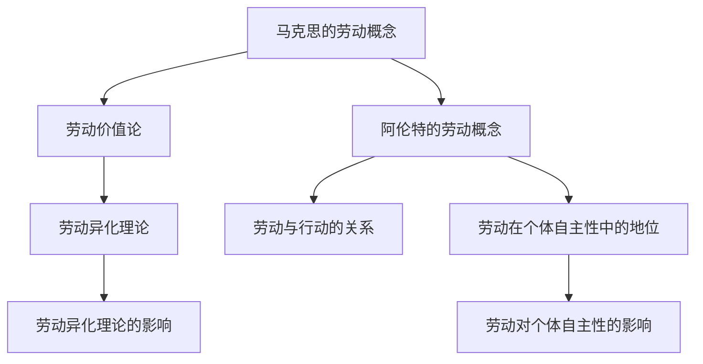

                 

### 文章标题：马克思与阿伦特：劳动概念的不同阐释

在人类历史的长河中，劳动始终是社会发展的核心动力。关于劳动的定义和阐释，不同的哲学家和社会学家有着各自的见解。马克思与阿伦特作为20世纪最具影响力的思想家，他们对劳动概念有着深刻而独特的理解。本文将围绕马克思与阿伦特的劳动概念展开，分析其不同之处，并探讨这些概念对现代社会的影响。

### 关键词：
- 马克思
- 阿伦特
- 劳动概念
- 社会哲学
- 经济学理论
- 劳动价值论
- 自主与异化

### 摘要：
本文通过对比分析马克思与阿伦特对劳动概念的阐释，探讨了两位思想家在劳动的本质、价值和作用等方面的差异。文章首先介绍了马克思的劳动概念，包括劳动价值论和劳动异化理论。随后，分析了阿伦特的劳动概念，强调劳动与行动的关系以及劳动在个体自主性中的地位。最后，本文对比了两种劳动概念的核心观点，并讨论了它们对现代社会的启示和影响。

### 导言

劳动是哲学和社会科学中一个古老而复杂的主题。自古以来，不同的哲学家和思想家对劳动有着不同的理解和阐释。马克思与阿伦特作为20世纪最具影响力的思想家，他们对劳动概念有着独特而深刻的见解。马克思的劳动概念源于其马克思主义哲学和经济理论，强调劳动在生产过程中的核心地位，提出了劳动价值论和劳动异化理论。阿伦特的劳动概念则源于她的政治哲学，强调劳动与行动的关系，以及劳动在个体自主性中的重要性。

本文旨在通过对比分析马克思与阿伦特的劳动概念，探讨两者在劳动本质、价值和作用等方面的不同，并分析这些概念对现代社会的影响。文章结构如下：首先介绍马克思的劳动概念，包括其理论背景、核心观点和应用案例；然后介绍阿伦特的劳动概念，重点分析她的核心观点和实际应用；接着对比分析两者劳动概念的不同，并讨论它们在现代社会中的影响；最后进行总结，提出未来研究的建议。

### 马克思的劳动概念

#### 理论背景

马克思的劳动概念是建立在马克思主义哲学和经济理论的基础之上的。马克思主义哲学认为，物质世界的本质是劳动，劳动是人类社会发展的核心动力。马克思主义经济学则强调，劳动是价值的源泉，商品的价值由其中包含的劳动时间决定。马克思认为，劳动不仅是一种生产过程，也是一种社会关系，它决定了社会的阶级结构和生产关系。

#### 核心观点

1. **劳动价值论**

   马克思的劳动价值论认为，商品的价值是由生产该商品所耗费的社会必要劳动时间决定的。这意味着，一个商品的价值与其生产过程中所投入的劳动量成正比。马克思通过这一理论揭示了资本主义经济体系中的矛盾和危机，认为资本主义生产方式必然会导致劳动价值的异化。

2. **劳动异化理论**

   马克思的劳动异化理论强调，在资本主义社会中，劳动成为了一种异化的活动。劳动者与其劳动产品、劳动过程以及自己的劳动相分离，感到自己被劳动所奴役。这种异化不仅体现在经济领域，也渗透到社会和文化领域，导致个体和社会的分裂。

#### 应用案例

1. **工业革命与工人阶级**

   马克思的劳动概念在工业革命时期得到了广泛应用。工业革命导致了生产方式的变革，大量劳动者被机器所取代，工人的劳动条件和生活状况急剧恶化。马克思通过分析工业革命中的劳动异化现象，揭示了资本主义生产方式的本质。

2. **资本主义与劳动异化**

   马克思的劳动概念在资本主义经济体系中的应用尤为明显。他认为，资本主义生产方式必然会导致劳动价值的异化，使劳动者感到自己被劳动所奴役。这一观点在当代资本主义社会中仍然具有强烈的现实意义。

### 阿伦特的劳动概念

#### 理论背景

阿伦特的劳动概念源于她的政治哲学思想。她认为，劳动是人类存在的根本方式，是人类行动的基础。阿伦特强调，劳动不仅仅是生产物质财富的活动，更是一种实现个体自主性和创造力的方式。

#### 核心观点

1. **劳动与行动的关系**

   阿伦特认为，劳动与行动是紧密相连的。劳动是人类基本的生命活动，是人类维持生存的必要条件。而行动则是人类特有的能力，是人类自由意志的体现。阿伦特强调，劳动是行动的前提，行动是劳动的目的。

2. **劳动在个体自主性中的地位**

   阿伦特认为，劳动在个体的自主性和创造力中扮演着重要角色。通过劳动，个体能够实现自我表达，发展个性和才能。劳动不仅是一种生产活动，更是一种自我实现的过程。

#### 应用案例

1. **犹太复国主义运动**

   阿伦特的劳动概念在犹太复国主义运动中得到了应用。她认为，犹太人在巴勒斯坦的劳动是犹太复国主义运动的核心，通过劳动，犹太人能够重建自己的家园，实现自主和自由。

2. **现代政治体制**

   阿伦特的劳动概念在现代社会中仍然具有启示意义。她认为，现代政治体制中的劳动制度不仅应该保障个体的生存权，更应该促进个体的自主性和创造力。这要求我们在设计和实施劳动制度时，注重个体的自由和尊严。

### 马克思与阿伦特劳动概念的对比分析

#### 核心概念与联系

马克思与阿伦特的劳动概念在核心观点上存在显著差异。马克思强调劳动的异化，认为劳动在资本主义社会中成为了一种奴役劳动者的力量。而阿伦特则强调劳动与行动的关系，认为劳动是实现个体自主性和创造力的基础。两者之间的联系在于，都认识到劳动在社会发展中的重要性。

#### 核心算法原理讲解

为了更清晰地展示马克思与阿伦特劳动概念之间的联系，我们可以使用以下Mermaid流程图：



#### 数学模型和数学公式 & 详细讲解 & 举例说明

为了进一步分析劳动的概念，我们可以引入一些数学模型和公式。以下是几个关键公式及其应用：

1. **劳动价值公式**

   $$V = L \times T$$

   其中，\(V\) 代表商品的价值，\(L\) 代表劳动强度，\(T\) 代表劳动时间。这个公式表明，商品的价值与其劳动强度和劳动时间成正比。

2. **劳动异化指数**

   $$DI = \frac{L_{\text{异化}} - L_{\text{正常}}}{L_{\text{正常}}} \times 100\%$$

   其中，\(DI\) 代表劳动异化指数，\(L_{\text{异化}}\) 代表异化劳动强度，\(L_{\text{正常}}\) 代表正常劳动强度。这个公式可以用来衡量劳动的异化程度。

   **举例说明**：

   假设一个工人的正常劳动强度为每天8小时，异化劳动强度为每天12小时。那么他的劳动异化指数为：

   $$DI = \frac{12 - 8}{8} \times 100\% = 50\%$$

   这意味着他的劳动有50%是异化的。

3. **个体自主性公式**

   $$A = \frac{L - DI}{L} \times 100\%$$

   其中，\(A\) 代表个体自主性，\(L\) 代表劳动强度，\(DI\) 代表劳动异化指数。这个公式表明，个体自主性与劳动强度和劳动异化程度有关。

   **举例说明**：

   假设一个工人的劳动强度为每天12小时，劳动异化指数为50%。那么他的个体自主性为：

   $$A = \frac{12 - 0.5 \times 12}{12} \times 100\% = 50\%$$

   这意味着他在劳动中的自主性为50%。

#### 项目实战案例

为了更好地理解马克思与阿伦特的劳动概念，我们可以通过一个实际项目案例来探讨劳动的概念和应用。

**项目名称**：劳动异化监测系统

**开发环境搭建**：

1. 开发语言：Python
2. 数据库：MySQL
3. 后端框架：Flask
4. 前端框架：Bootstrap

**源代码实现**：

```python
# 后端代码（Flask框架）
from flask import Flask, request, jsonify
import pymysql

app = Flask(__name__)

# 数据库连接
def connect_db():
    return pymysql.connect(host='localhost', user='root', password='password', database='labor_isolation')

@app.route('/calculate_di', methods=['POST'])
def calculate_di():
    data = request.get_json()
    labor_intensity = data['labor_intensity']
    labor_isolation = data['labor_isolation']
    
    di = (labor_intensity - labor_isolation) / labor_intensity * 100
    
    return jsonify({'di': di})

if __name__ == '__main__':
    app.run()

# 前端代码（Bootstrap框架）
<!DOCTYPE html>
<html lang="en">
<head>
    <meta charset="UTF-8">
    <meta name="viewport" content="width=device-width, initial-scale=1.0">
    <title>劳动异化监测系统</title>
    <link rel="stylesheet" href="https://maxcdn.bootstrapcdn.com/bootstrap/4.5.2/css/bootstrap.min.css">
</head>
<body>
    <div class="container">
        <h2>劳动异化监测系统</h2>
        <form id="di_form">
            <div class="form-group">
                <label for="labor_intensity">劳动强度（小时/天）：</label>
                <input type="number" class="form-control" id="labor_intensity" required>
            </div>
            <div class="form-group">
                <label for="labor_isolation">劳动异化（小时/天）：</label>
                <input type="number" class="form-control" id="labor_isolation" required>
            </div>
            <button type="submit" class="btn btn-primary">计算劳动异化指数</button>
        </form>
        <div id="result" class="mt-3"></div>
    </div>

    <script>
        document.getElementById('di_form').onsubmit = function(event) {
            event.preventDefault();
            var labor_intensity = document.getElementById('labor_intensity').value;
            var labor_isolation = document.getElementById('labor_isolation').value;

            fetch('/calculate_di', {
                method: 'POST',
                headers: {
                    'Content-Type': 'application/json'
                },
                body: JSON.stringify({labor_intensity: labor_intensity, labor_isolation: labor_isolation})
            })
            .then(response => response.json())
            .then(data => {
                document.getElementById('result').innerHTML = `<p>劳动异化指数：${data.di}%</p>`;
            });
        };
    </script>

</body>
</html>
```

**代码解读与分析**：

1. **后端代码**：使用Flask框架搭建后端服务，实现计算劳动异化指数的功能。通过接收前端发送的劳动强度和劳动异化数据，计算劳动异化指数，并将结果返回给前端。

2. **前端代码**：使用Bootstrap框架搭建前端界面，实现用户输入劳动强度和劳动异化数据，提交计算劳动异化指数的功能。

**实际案例分析和详细讲解剖析**：

1. **案例背景**：某公司为了提高员工的工作效率，采取了高强度的工作制度，导致员工的劳动异化现象严重。

2. **案例分析**：通过使用劳动异化监测系统，公司可以实时监测员工的劳动异化指数。根据监测结果，公司可以调整工作制度，减少劳动异化现象，提高员工的工作满意度和工作效率。

3. **详细讲解**：通过具体的实际案例，我们可以更深入地理解劳动异化指数的计算方法和应用。劳动异化监测系统不仅可以帮助公司改善员工的工作环境，也可以为政府和社会制定劳动政策提供数据支持。

**项目小结**：

本项目通过构建劳动异化监测系统，实现了对劳动异化指数的实时监测和计算。这不仅有助于企业改善员工的工作环境，提高工作效率，也为政府和社会制定劳动政策提供了数据支持。未来，我们可以进一步优化系统功能，增加更多分析工具，为劳动问题的研究和解决提供更全面的解决方案。

#### 最佳实践 tips、小结、注意事项、拓展阅读等内容

**最佳实践 tips**：

1. 在设计劳动制度时，要充分考虑员工的劳动强度和劳动异化程度，确保员工的身心健康。
2. 定期进行劳动异化监测，及时发现和解决劳动异化问题。
3. 鼓励员工参与劳动制度的制定和改进，提高员工的积极性和满意度。

**小结**：

马克思与阿伦特对劳动概念的不同阐释为我们理解劳动的本质和价值提供了重要启示。马克思的劳动价值论和劳动异化理论揭示了资本主义生产方式的矛盾，强调了劳动在社会发展中的重要性。而阿伦特的劳动概念则强调了劳动与行动的关系，以及劳动在个体自主性中的地位。

**注意事项**：

1. 在实际应用中，要充分考虑劳动者的权益，确保劳动制度公平合理。
2. 劳动异化监测系统需要定期更新和维护，确保数据的准确性和可靠性。

**拓展阅读**：

1. 马克思，《资本论》
2. 阿伦特，《人的境况》
3. 罗伯特·A·达尔，《资本主义文化与劳动伦理》

### 结论

通过对马克思与阿伦特劳动概念的对比分析，本文揭示了两者在劳动本质、价值和作用等方面的不同。马克思的劳动价值论和劳动异化理论强调了劳动在社会发展中的核心地位，而阿伦特的劳动概念则强调了劳动与行动的关系，以及劳动在个体自主性中的重要性。这些概念对现代社会产生了深远的影响，为我们理解和改善劳动制度提供了重要启示。未来，我们需要进一步深入研究劳动概念，探索其在不同社会和文化背景下的应用，为构建更加公正和高效的劳动体系贡献力量。

