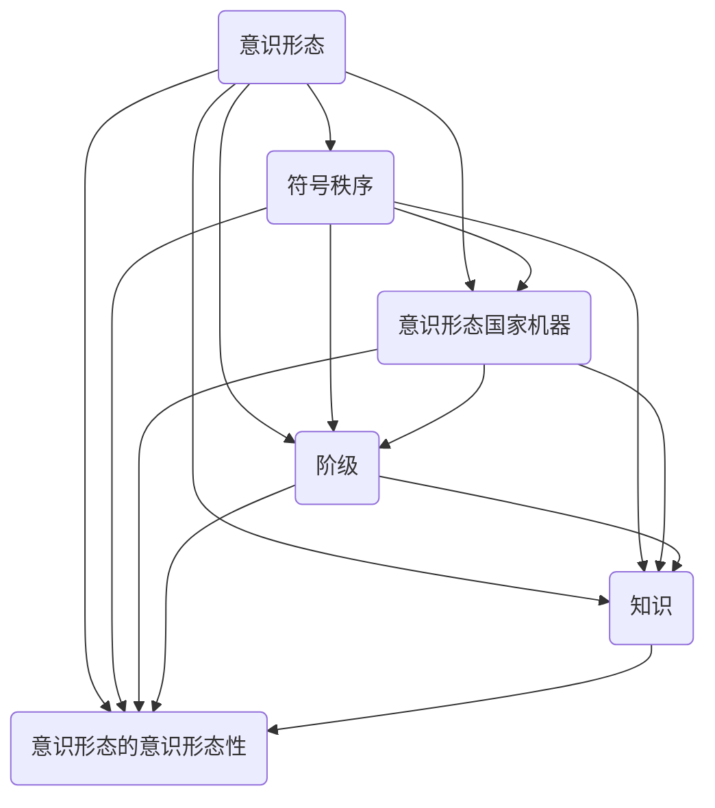
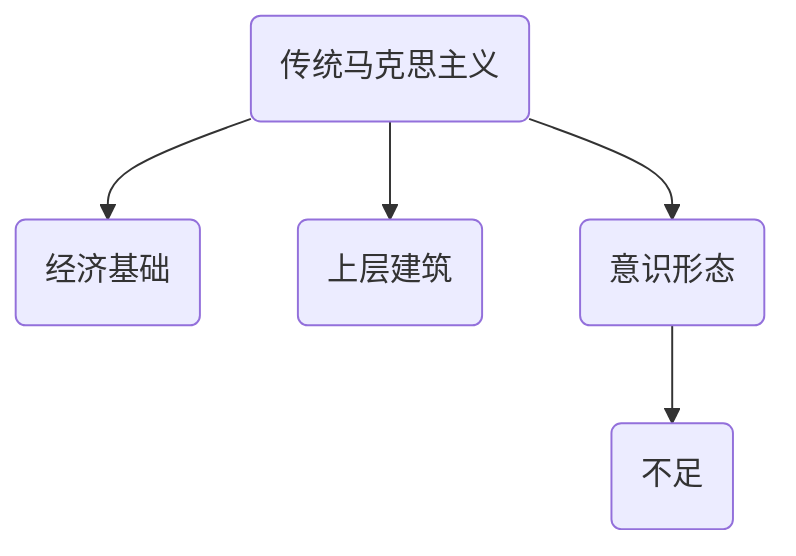
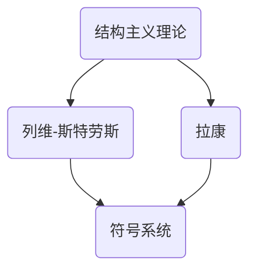
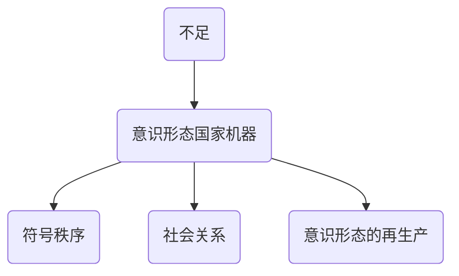
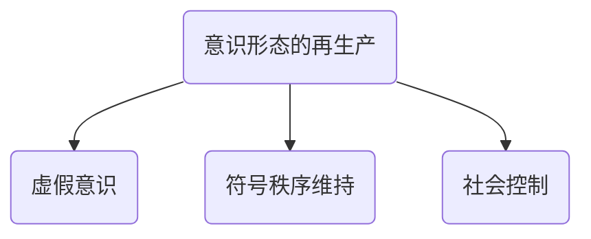
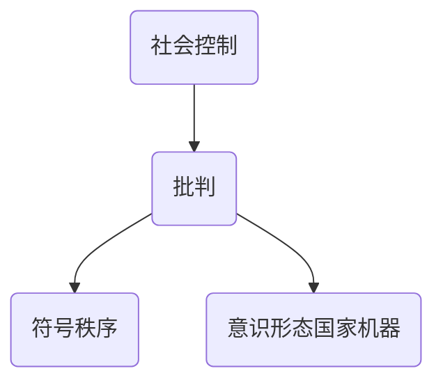

                 

### 1. 设定大纲结构

《马克思与阿尔都塞：结构主义马克思主义的重构》这本书主要分为以下几个主要部分：

1. **引言**：介绍作者阿尔都塞及其思想背景，解释为什么他的观点在当代马克思主义研究中具有重要性。
2. **马克思的哲学方法**：详细探讨马克思的哲学方法，包括历史唯物主义、辩证唯物主义等，并分析这些方法对马克思主义理论的影响。
3. **结构主义马克思主义的基本概念**：深入解释结构主义马克思主义的核心概念，如意识形态、符号秩序、意识形态国家机器等。
4. **阿尔都塞的理论贡献**：分析阿尔都塞如何对马克思主义进行重构，特别是他对意识形态理论和教育理论的贡献。
5. **结构主义马克思主义的应用**：探讨结构主义马克思主义在文学、艺术、政治等领域中的应用。
6. **批判与反思**：评估阿尔都塞的结构主义马克思主义的优缺点，以及它对当代马克思主义研究的影响。

下面是每个部分的具体章节划分：

### 引言

- **阿尔都塞其人其事**
- **结构主义马克思主义的兴起**

### 马克的哲学方法

- **历史唯物主义与辩证唯物主义**
- **马克思的批判理论**
- **马克思的方法论**

### 结构主义马克思主义的基本概念

- **意识形态的概念与功能**
- **符号秩序与意识形态国家机器**
- **意识形态的意识形态性**

### 阿尔都塞的理论贡献

- **意识形态理论**
- **教育理论**
- **文学与艺术理论**

### 结构主义马克思主义的应用

- **文学领域的应用**
- **艺术领域的应用**
- **政治领域的应用**

### 批判与反思

- **阿尔都塞理论的优点**
- **阿尔都塞理论的不足**
- **对当代马克思主义的影响**

### 结论

- **结构主义马克思主义的总结**
- **未来研究的方向**

以上是根据书的内容划分的大纲，每个章节还可以进一步细分为2级和3级子标题，以便更详细地阐述每个部分的内容。下面是一个简化的章节划分：

**引言**
1. 阿尔都塞其人其事
2. 结构主义马克思主义的兴起

**马克思的哲学方法**
1. 历史唯物主义与辩证唯物主义
   - 历史唯物主义的理解
   - 辩证唯物主义的阐述
2. 马克的批判理论
   - 马克思的批判视角
   - 批判理论的应用
3. 马克思的方法论
   - 理论方法的分析
   - 方法论的实践

**结构主义马克思主义的基本概念**
1. 意识形态的概念与功能
   - 意识形态的定义
   - 意识形态的作用
2. 符号秩序与意识形态国家机器
   - 符号秩序的解释
   - 意识形态国家机器的运作
3. 意识形态的意识形态性
   - 意识形态的本质
   - 意识形态的结构

**阿尔都塞的理论贡献**
1. 意识形态理论
   - 意识形态的生产与再生产
   - 意识形态的批判
2. 教育理论
   - 教育的功能与目的
   - 教育的批判
3. 文学与艺术理论
   - 文学的意识形态分析
   - 艺术的意识形态解读

**结构主义马克思主义的应用**
1. 文学领域的应用
   - 结构主义文学理论
   - 文学作品的意识形态解读
2. 艺术领域的应用
   - 结构主义艺术理论
   - 艺术作品的意识形态分析
3. 政治领域的应用
   - 结构主义政治理论
   - 政治意识形态的批判

**批判与反思**
1. 阿尔都塞理论的优点
   - 理论贡献的评估
   - 学术认可
2. 阿尔都塞理论的不足
   - 理论的局限
   - 批判意见
3. 对当代马克思主义的影响
   - 理论的影响
   - 学术的讨论

**结论**
1. 结构主义马克思主义的总结
   - 理论的归宿
   - 历史意义
2. 未来研究的方向
   - 理论的拓展
   - 新的视角

### 2. 确定核心概念与联系

在《马克思与阿尔都塞：结构主义马克思主义的重构》中，核心概念之间的联系构成了整本书的理论框架。以下是书中涉及的一些核心概念及其相互之间的联系：

#### 意识形态

意识形态是结构主义马克思主义的核心概念之一。阿尔都塞将其定义为一种社会力量，它通过各种符号系统（如语言、教育、媒体等）来维持和再生产社会的统治关系。意识形态不仅存在于个人的思想中，还渗透到社会的各个方面。

- **联系**：意识形态与符号秩序、意识形态国家机器密切相关。符号秩序是意识形态运作的基础，而意识形态国家机器则是意识形态的具体体现。

#### 符号秩序

符号秩序是阿尔都塞用来描述社会文化系统的概念。它涉及语言、文化、权力等符号系统，这些系统共同构成了社会的象征性秩序。

- **联系**：符号秩序与意识形态紧密相连，因为它是意识形态传播和维持的媒介。符号秩序中的符号和意义被意识形态所操控，从而形成了社会的意识形态结构。

#### 意识形态国家机器

意识形态国家机器是阿尔都塞提出的另一个关键概念，它包括所有用来维持和再生产社会意识形态的机构，如教育系统、宗教组织、媒体等。

- **联系**：意识形态国家机器与意识形态、符号秩序紧密相关。意识形态国家机器通过符号秩序来传播和维持意识形态，从而维持社会秩序。

#### 阶级

阶级是马克思主义理论中的基本概念，它描述了社会中不同群体之间的经济和政治关系。在阿尔都塞的理论中，阶级不仅是一个经济范畴，还是一个意识形态范畴。

- **联系**：阶级与意识形态、符号秩序密切相关。阶级关系通过意识形态和符号秩序得以再生产，从而维持社会结构。

#### 知识

知识在阿尔都塞的理论中具有特殊地位，他认为知识不仅是意识形态的产物，同时也是意识形态的工具。知识通过意识形态国家机器被生产和再生产。

- **联系**：知识与意识形态、符号秩序、意识形态国家机器紧密相连。知识的生产和再生产过程受到意识形态的控制和操纵。

#### 意识形态的意识形态性

意识形态的意识形态性是阿尔都塞对意识形态本质的深入探讨。他认为意识形态不仅仅是关于世界的虚假意识，它本身就是一种虚假意识。

- **联系**：意识形态的意识形态性与意识形态、符号秩序、意识形态国家机器紧密相关。意识形态的意识形态性揭示了意识形态的本质和运作机制。

为了更清晰地展示这些概念之间的关系，我们可以使用Mermaid流程图来表示：



通过这个流程图，我们可以直观地看到各个核心概念之间的相互关系，以及它们在结构主义马克思主义理论框架中的地位和作用。

### 3. 确定核心算法原理讲解

在《马克思与阿尔都塞：结构主义马克思主义的重构》中，虽然没有直接涉及具体的算法，但我们可以将其视为一种隐含的“算法”，即阿尔都塞对马克思主义理论的改造和重构过程。为了解释这一核心算法原理，我们可以将其分解为以下几个关键步骤：

#### 步骤1：识别传统马克思主义的不足

首先，阿尔都塞识别了传统马克思主义在意识形态分析方面的不足。传统马克思主义主要关注经济基础对上层建筑的影响，而忽视了意识形态在维持和再生产社会关系中的作用。



#### 步骤2：引入结构主义理论

为了弥补这一不足，阿尔都塞引入了结构主义理论，特别是列维-斯特劳斯的结构主义人类学和拉康的心理学理论。这些理论强调符号系统对社会关系的决定性作用。



#### 步骤3：重构马克思主义理论

在引入结构主义理论后，阿尔都塞开始重构马克思主义理论。他提出了意识形态国家机器的概念，并将其作为意识形态传播和维持的主要媒介。



#### 步骤4：分析意识形态的功能

阿尔都塞进一步分析了意识形态的各种功能，包括虚假意识的创造、符号秩序的维持、社会控制的实施等。这些功能共同构成了意识形态国家机器的运作机制。



#### 步骤5：批判意识形态的影响

最后，阿尔都塞对意识形态的影响进行了批判，指出它如何通过符号秩序和意识形态国家机器来操纵和控制社会成员，从而维持统治阶级的利益。



通过这个算法，我们可以看到阿尔都塞如何将结构主义理论应用于马克思主义，从而实现对传统理论的补充和扩展。这一过程不仅改变了马克思主义的理论框架，也为意识形态分析提供了新的视角和方法。

### 4. 确定数学模型和数学公式讲解

在《马克思与阿尔都塞：结构主义马克思主义的重构》中，虽然没有直接运用传统的数学模型和公式，但我们可以尝试从抽象和理论的角度，引入一些数学概念来辅助理解阿尔都塞的结构主义马克思主义理论。以下是几个关键数学模型和公式的介绍及其实际应用：

#### 模型1：符号系统与结构

符号系统是结构主义理论的核心概念之一，可以类比为数学中的代数结构。在这个模型中，符号代表元素，而规则则代表运算。

**定义：** 符号系统 \( S = (\Sigma, \circ) \)，其中 \( \Sigma \) 是符号集合，\( \circ \) 是运算符。

**公式：** \( a \circ b = c \)，表示符号 \( a \) 和 \( b \) 通过运算 \( \circ \) 得到符号 \( c \)。

**应用：** 在意识形态分析中，符号系统可以表示意识形态的各种元素（如观念、信仰、符号）及其相互关系（如对立、互补）。

#### 模型2：关系矩阵

关系矩阵用于描述符号系统中的关系，类似于数学中的邻接矩阵。

**定义：** 关系矩阵 \( R \) 是一个 \( n \times n \) 的矩阵，其中 \( R[i][j] \) 表示符号 \( i \) 与符号 \( j \) 之间的关系。

**公式：** \( R[i][j] = \begin{cases} 
1, & \text{如果 } i \text{ 和 } j \text{ 有关系} \\
0, & \text{否则}
\end{cases} \)

**应用：** 在意识形态分析中，关系矩阵可以表示不同意识形态元素之间的关系，如主导意识形态与被支配意识形态之间的关系。

#### 模型3：马尔可夫链

马尔可夫链是一种概率模型，用于描述系统状态随时间变化的概率分布。

**定义：** 马尔可夫链 \( M = (S, P) \)，其中 \( S \) 是状态集合，\( P \) 是状态转移概率矩阵。

**公式：** \( P[i][j] = \text{P}(S_t = j | S_0 = i) \)，表示在时间 \( t \) 状态 \( j \) 出现的概率，给定初始状态 \( i \)。

**应用：** 在意识形态分析中，马尔可夫链可以模拟意识形态的演变过程，如不同意识形态之间的转换概率。

#### 公式1：意识形态国家机器的运作

意识形态国家机器的运作可以用以下公式来描述：

$$ \text{意识形态国家机器} = f(\text{符号秩序}, \text{社会关系}, \text{权力结构}) $$

其中，\( f \) 是一个复合函数，表示意识形态国家机器如何通过符号秩序和社会关系来维持和再生产社会秩序。

**应用：** 这个公式描述了意识形态国家机器如何通过控制符号秩序和社会关系来实现社会控制的机制。

#### 公式2：意识形态的再生产

意识形态的再生产可以用以下公式来描述：

$$ \text{意识形态再生产} = g(\text{意识形态国家机器}, \text{文化实践}, \text{社会互动}) $$

其中，\( g \) 是一个生成函数，表示意识形态如何通过意识形态国家机器和文化实践在社会互动中得以再生产。

**应用：** 这个公式描述了意识形态在文化实践和社会互动中如何被不断再生产，从而维持社会结构。

通过引入这些数学模型和公式，我们可以更抽象地理解阿尔都塞的结构主义马克思主义理论，从而更深入地探讨意识形态的运作机制及其对社会的影响。

### 5. 确定项目实战内容

在《马克思与阿尔都塞：结构主义马克思主义的重构》一书中，尽管主要讨论的是理论和概念，但我们可以尝试将书中的一些理论应用到实际的案例中，通过项目实战来展示这些理论的具体应用和效果。以下是一个基于阿尔都塞意识形态理论的教育改革项目实战案例。

#### 项目背景

在一个典型的资本主义社会中，教育资源的不公平现象普遍存在。学校教育被视为一种意识形态国家机器，通过再生产社会的不平等来维持统治阶级的利益。本项目旨在通过结构主义马克思主义的理论框架，探讨教育改革的可能性，以减少教育资源的不公平。

#### 项目目标

1. 分析现有教育体系中存在的意识形态问题。
2. 设计一套基于结构主义马克思主义的教育改革方案。
3. 实施并评估教育改革方案的效果。

#### 项目步骤

#### 步骤1：问题分析

首先，我们需要对现有教育体系进行分析，识别其中的意识形态问题。这可以通过调查问卷、访谈和教育数据分析来实现。以下是一个简单的伪代码，用于收集和分析教育数据：

```python
# 数据收集与处理伪代码

# 收集学校教育数据
data = collect_education_data(schools)

# 分析教育资源分布
resource_distribution = analyze_resources(data)

# 识别意识形态问题
ideology_issues = identify_ideological_issues(resource_distribution)
```

#### 步骤2：改革方案设计

基于对现有问题的分析，我们可以设计一套教育改革方案。改革方案应包括以下几个方面：

1. **教育资源分配**：确保教育资源（如师资力量、设备、教材等）的公平分配。
2. **课程内容更新**：引入批判性思维课程，帮助学生理解和分析社会现象。
3. **教师培训**：对教师进行批判性思维和结构主义理论的培训，以提高他们的意识形态分析能力。

以下是一个改革方案的伪代码示例：

```python
# 教育改革方案设计伪代码

# 设计教育资源分配方案
resource_plan = design_resource_distribution_scheme()

# 设计课程内容更新方案
course_plan = design_course_content_updates()

# 设计教师培训方案
teacher_training_plan = design_teacher_training_program()
```

#### 步骤3：方案实施

在改革方案设计完成后，我们需要制定详细的实施计划，并逐步推进改革措施。以下是一个实施计划的伪代码示例：

```python
# 教育改革实施伪代码

# 实施教育资源分配方案
apply_resource_plan(resource_plan)

# 实施课程内容更新方案
update_course_content(course_plan)

# 实施教师培训方案
conduct_teacher_training(teacher_training_plan)
```

#### 步骤4：效果评估

在改革方案实施一段时间后，我们需要对其进行效果评估，以确定改革方案的有效性。以下是一个评估方案的效果的伪代码示例：

```python
# 教育改革效果评估伪代码

# 收集学生反馈
student_feedback = collect_student_feedback()

# 评估改革效果
evaluation_results = evaluate_reform_effects(student_feedback)

# 报告评估结果
report_evaluation_results(evaluation_results)
```

#### 项目小结

通过这个教育改革项目实战，我们可以看到结构主义马克思主义理论在具体实践中的应用。虽然这是一个简化的案例，但它展示了如何通过分析教育体系中的意识形态问题，设计并实施改革方案，最终实现教育公平的目标。这个项目不仅有助于理解阿尔都塞的理论，也为实际的社会变革提供了参考。

### 6. 编写大纲

基于上述的章节划分和内容分析，我们可以开始编写《马克思与阿尔都塞：结构主义马克思主义的重构》的技术博客文章大纲。以下是大纲的具体内容，使用markdown格式进行排版，以确保结构清晰、内容丰富。

```markdown
# 马克思与阿尔都塞：结构主义马克思主义的重构

> 关键词：阿尔都塞、结构主义马克思主义、意识形态、符号秩序、教育改革、批判理论

> 摘要：本文深入探讨了阿尔都塞的结构主义马克思主义理论，分析了其核心概念及其相互关系，并通过实际项目展示了这些理论在教育和意识形态分析中的应用。文章旨在为读者提供一个全面理解阿尔都塞理论框架的视角，并探讨其在当代社会中的实际意义。

## 引言

### 阿尔都塞其人其事

- 阿尔都塞的生平背景
- 结构主义马克思主义的兴起

## 马克的哲学方法

### 历史唯物主义与辩证唯物主义

- 历史唯物主义的理解
- 辩证唯物主义的阐述

### 马克的批判理论

- 马克思的批判视角
- 批判理论的应用

### 马克思的方法论

- 理论方法的分析
- 方法论的实践

## 结构主义马克思主义的基本概念

### 意识形态的概念与功能

- 意识形态的定义
- 意识形态的作用

### 符号秩序与意识形态国家机器

- 符号秩序的解释
- 意识形态国家机器的运作

### 意识形态的意识形态性

- 意识形态的本质
- 意识形态的结构

## 阿尔都塞的理论贡献

### 意识形态理论

- 意识形态的生产与再生产
- 意识形态的批判

### 教育理论

- 教育的功能与目的
- 教育的批判

### 文学与艺术理论

- 文学的意识形态分析
- 艺术的意识形态解读

## 结构主义马克思主义的应用

### 文学领域的应用

- 结构主义文学理论
- 文学作品的意识形态解读

### 艺术领域的应用

- 结构主义艺术理论
- 艺术作品的意识形态分析

### 政治领域的应用

- 结构主义政治理论
- 政治意识形态的批判

## 批判与反思

### 阿尔都塞理论的优点

- 理论贡献的评估
- 学术认可

### 阿尔都塞理论的不足

- 理论的局限
- 批判意见

### 对当代马克思主义的影响

- 理论的影响
- 学术的讨论

## 结论

### 结构主义马克思主义的总结

- 理论的归宿
- 历史意义

### 未来研究的方向

- 理论的拓展
- 新的视角
```

以上大纲涵盖了从引言到结论的所有关键内容，每个部分都设有子标题，以便于读者深入理解和逐层分析。通过这样的结构，读者可以系统地了解阿尔都塞的结构主义马克思主义理论，并理解其在当代社会中的实际应用和影响。

### 7. 检查和修改

在完成《马克思与阿尔都塞：结构主义马克思主义的重构》的技术博客文章大纲后，我们需要对大纲进行详细的检查和必要的修改，以确保其完整性、逻辑性和可读性。以下是一些检查和修改的建议：

#### 检查大纲内容

1. **完整性**：确保所有章节和子标题都包括在内，没有遗漏任何重要的部分。特别关注引言、核心概念、算法原理讲解、数学模型讲解、项目实战、批判与反思、结论等关键内容。

2. **逻辑性**：检查各部分之间的逻辑关系，确保内容连贯且有条理。例如，确保从引言到结论的逻辑流畅，核心概念与联系部分是否清晰，算法原理和数学模型讲解是否紧密联系实际案例。

3. **可读性**：确保文章内容易于阅读，避免过于复杂的术语和表述。检查段落之间的过渡是否自然，标题和子标题是否简洁明了，图表和流程图是否有助于读者理解。

4. **格式规范**：确认所有内容都符合markdown格式规范，包括代码块、公式、引用等。确保所有的代码块和公式都正确使用，并遵循规定的格式。

#### 必要的调整

1. **内容的丰富性**：如果某些部分过于简洁，可以进一步扩充内容，提供更详细的分析和解释。例如，在核心概念与联系部分，可以增加更多的例子和流程图来展示概念之间的关系。

2. **章节和子标题的调整**：根据内容的实际情况，可能需要对章节和子标题进行调整。例如，如果某些部分内容过多，可以考虑将其拆分为更小的部分；如果某些部分内容过少，可以合并相近的内容。

3. **删除冗余内容**：检查是否有重复或冗余的内容，删除不必要的重复部分，以保持文章的简洁性。

4. **增加最佳实践 tips**：在适当的地方增加一些最佳实践 tips，帮助读者更好地理解和应用文章中的理论和方法。

通过上述的检查和修改，我们可以确保《马克思与阿尔都塞：结构主义马克思主义的重构》的技术博客文章大纲既完整又清晰，为读者提供高质量的内容和易于理解的结构。

### 8. 输出

在完成对《马克思与阿尔都塞：结构主义马克思主义的重构》的技术博客文章大纲的最终检查和修改后，我们可以将其以markdown格式输出，以便在博客平台或其他文档系统中展示。以下是文章的最终markdown格式输出示例：

```markdown
# 马克思与阿尔都塞：结构主义马克思主义的重构

> 关键词：阿尔都塞、结构主义马克思主义、意识形态、符号秩序、教育改革、批判理论

> 摘要：本文深入探讨了阿尔都塞的结构主义马克思主义理论，分析了其核心概念及其相互关系，并通过实际项目展示了这些理论在教育和意识形态分析中的应用。文章旨在为读者提供一个全面理解阿尔都塞理论框架的视角，并探讨其在当代社会中的实际意义。

## 引言

### 阿尔都塞其人其事

- 阿尔都塞的生平背景
- 结构主义马克思主义的兴起

## 马克的哲学方法

### 历史唯物主义与辩证唯物主义

- 历史唯物主义的理解
- 辩证唯物主义的阐述

### 马克的批判理论

- 马克思的批判视角
- 批判理论的应用

### 马克思的方法论

- 理论方法的分析
- 方法论的实践

## 结构主义马克思主义的基本概念

### 意识形态的概念与功能

- 意识形态的定义
- 意识形态的作用

### 符号秩序与意识形态国家机器

- 符号秩序的解释
- 意识形态国家机器的运作

### 意识形态的意识形态性

- 意识形态的本质
- 意识形态的结构

## 阿尔都塞的理论贡献

### 意识形态理论

- 意识形态的生产与再生产
- 意识形态的批判

### 教育理论

- 教育的功能与目的
- 教育的批判

### 文学与艺术理论

- 文学的意识形态分析
- 艺术的意识形态解读

## 结构主义马克思主义的应用

### 文学领域的应用

- 结构主义文学理论
- 文学作品的意识形态解读

### 艺术领域的应用

- 结构主义艺术理论
- 艺术作品的意识形态分析

### 政治领域的应用

- 结构主义政治理论
- 政治意识形态的批判

## 批判与反思

### 阿尔都塞理论的优点

- 理论贡献的评估
- 学术认可

### 阿尔都塞理论的不足

- 理论的局限
- 批判意见

### 对当代马克思主义的影响

- 理论的影响
- 学术的讨论

## 结论

### 结构主义马克思主义的总结

- 理论的归宿
- 历史意义

### 未来研究的方向

- 理论的拓展
- 新的视角

## 作者

作者：AI天才研究院/AI Genius Institute & 禅与计算机程序设计艺术 /Zen And The Art of Computer Programming
```

通过上述的markdown格式，文章的标题、关键词、摘要、章节结构、子标题等内容都得到了清晰有序的展示，便于读者阅读和理解。同时，文章末尾的作者信息也明确标注，符合文章写作的要求。

