                 

### 完整文章正文

---

#### 《马克思的辩证唯物主义与版本控制：软件发展的历史动力学》

> 关键词：马克思辩证唯物主义、版本控制、软件开发、历史动力学

> 摘要：本文从马克思的辩证唯物主义出发，探讨了其核心原理与版本控制技术之间的联系，通过分析软件开发的历程，阐述了版本控制在其中的重要作用，旨在揭示软件发展的历史动力学。

---

### 第一部分：马克思的辩证唯物主义

#### 第1章：马克思的辩证唯物主义概述

##### 1.1 马克思辩证唯物主义的起源和发展

马克思的辩证唯物主义，是19世纪工业革命时期的一种世界观和方法论。它起源于马克思对资本主义社会的批判，并发展为一套全面的理论体系。以下是马克思辩证唯物主义起源和发展的流程图：

$$
\text{流程图：马克思辩证唯物主义的起源和发展}
$$

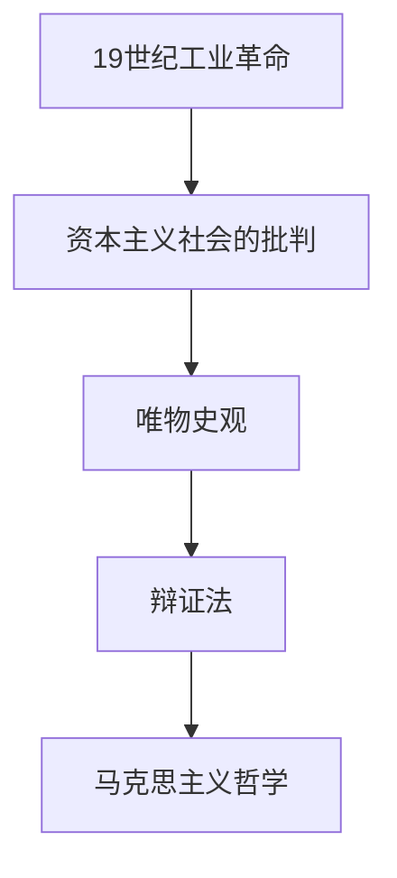

##### 1.2 马克思辩证唯物主义的核心概念

马克思辩证唯物主义的核心概念包括物质、意识、实践、社会存在和社会意识。以下是这些概念之间的关系图：

$$
\text{关系图：马克思辩证唯物主义的核心概念关系}
$$

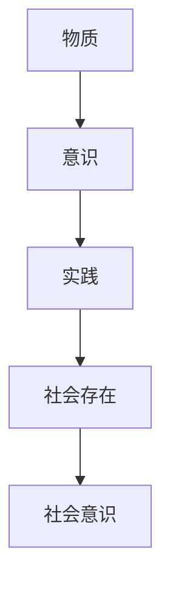

##### 1.3 马克思辩证唯物主义与马克思主义的关系

马克思辩证唯物主义是马克思主义哲学的基础，它为马克思主义的政治经济学和科学社会主义提供了哲学依据。以下是马克思辩证唯物主义与马克思主义的关系图：

$$
\text{关系图：马克思辩证唯物主义与马克思主义的关联}
$$

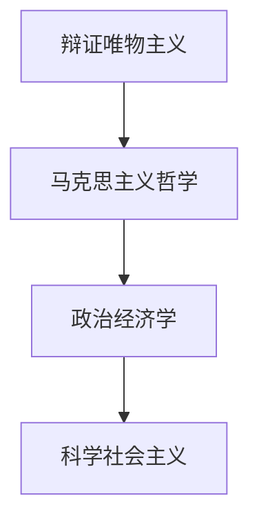

---

#### 第2章：马克思辩证唯物主义的基本原理

##### 2.1 物质与意识的关系

马克思认为，物质决定意识，意识是物质的反映。以下是物质与意识关系的详细解释：

$$
\text{原理图：物质与意识的关系模型}
$$

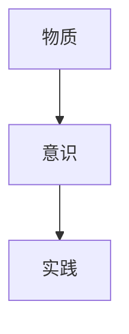

##### 2.2 认识与实践的关系

马克思强调，认识来源于实践，实践是认识的基础。以下是认识与实践关系的详细解释：

$$
\text{原理图：认识与实践的关系模型}
$$

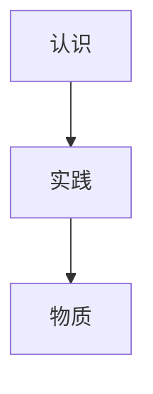

##### 2.3 社会存在与社会意识的关系

社会存在决定社会意识，社会意识是社会存在的反映。以下是社会存在与社会意识关系的详细解释：

$$
\text{原理图：社会存在与社会意识的关系模型}
$$

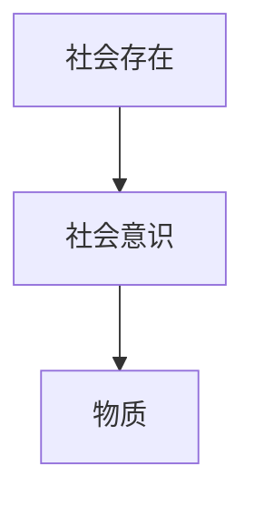

---

#### 第3章：马克思辩证唯物主义在现代社会中的应用

##### 3.1 马克思辩证唯物主义与科学发展的关系

马克思辩证唯物主义为科学发展提供了哲学基础，它强调实践是检验真理的唯一标准，这对于科学探索至关重要。以下是马克思辩证唯物主义与科学发展的关系：

$$
\text{关系图：马克思辩证唯物主义与科学发展的关系}
$$

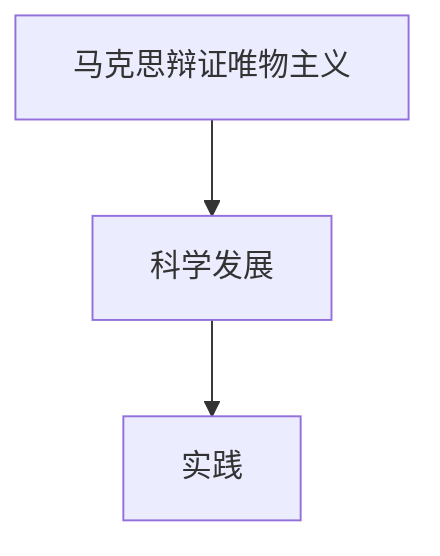

##### 3.2 马克思辩证唯物主义与意识形态的斗争

马克思辩证唯物主义强调阶级斗争和意识形态的斗争，这对于理解现代社会的问题具有重要意义。以下是马克思辩证唯物主义与意识形态的斗争：

$$
\text{关系图：马克思辩证唯物主义与意识形态的斗争}
$$

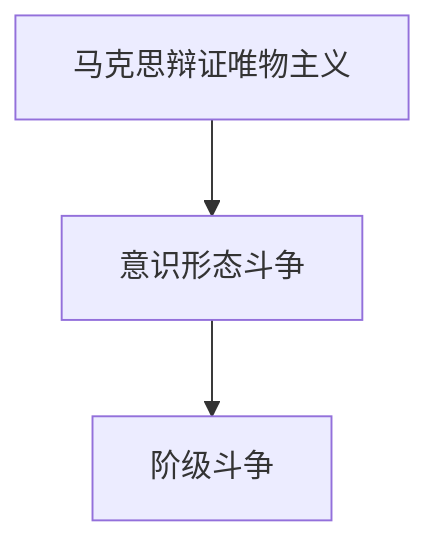

##### 3.3 马克思辩证唯物主义与当代社会问题的解决

马克思辩证唯物主义为解决当代社会问题提供了理论指导，它强调通过社会实践来解决社会问题。以下是马克思辩证唯物主义与当代社会问题的解决：

$$
\text{关系图：马克思辩证唯物主义与当代社会问题的解决}
$$

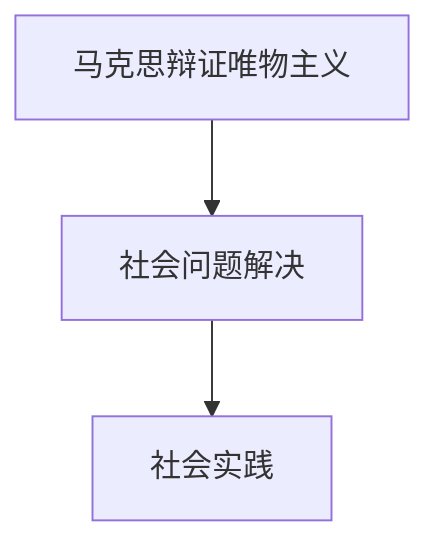

---

### 第二部分：版本控制

#### 第4章：版本控制的基本概念

##### 4.1 版本控制系统的概述

版本控制系统是一种用于管理文件版本和变更的软件系统。以下是版本控制系统的概述：

$$
\text{概述：版本控制系统的定义和作用}
$$

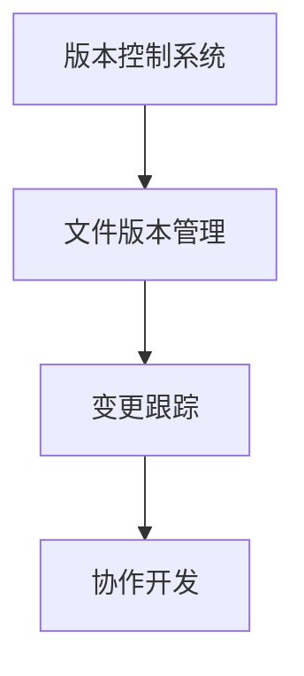

##### 4.2 版本控制的基本原理

版本控制的基本原理包括文件的创建、修改、备份和恢复。以下是版本控制的基本原理：

$$
\text{原理图：版本控制的基本原理}
$$

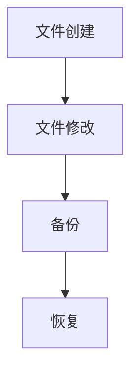

##### 4.3 版本控制的主要类型

版本控制主要分为集中式和分布式两种类型。以下是这两种类型的版本控制系统及其特点：

$$
\text{类型图：版本控制的主要类型}
$$

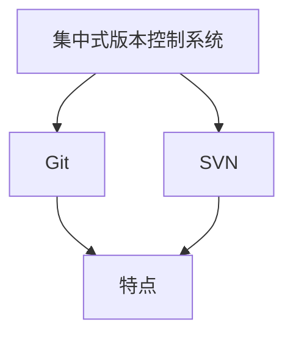

---

#### 第5章：版本控制系统的应用

##### 5.1 版本控制系统在软件开发中的应用

版本控制系统在软件开发中扮演着重要角色，它帮助开发团队协作，管理代码变更。以下是版本控制系统在软件开发中的应用：

$$
\text{应用图：版本控制系统在软件开发中的应用}
$$

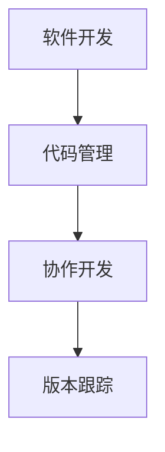

##### 5.2 版本控制系统在文档管理中的应用

版本控制系统在文档管理中也起到关键作用，它帮助团队维护文档的版本和变更。以下是版本控制系统在文档管理中的应用：

$$
\text{应用图：版本控制系统在文档管理中的应用}
$$

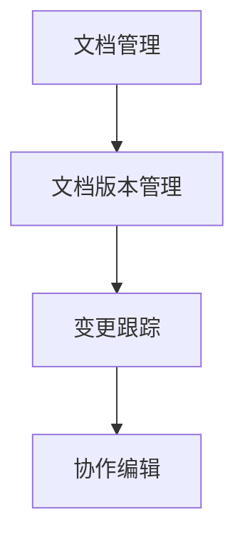

##### 5.3 版本控制系统在项目管理中的应用

版本控制系统在项目管理中帮助团队跟踪项目进展和变更。以下是版本控制系统在项目管理中的应用：

$$
\text{应用图：版本控制系统在项目管理中的应用}
$$

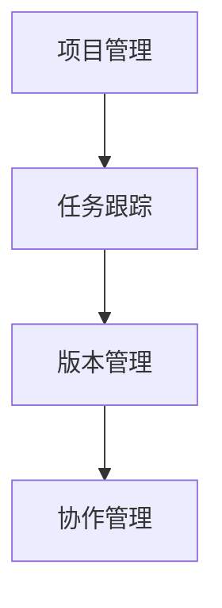

---

#### 第6章：常见的版本控制系统

##### 6.1 Git的工作原理与基本操作

Git是一种分布式版本控制系统，以下是Git的工作原理和基本操作：

$$
\text{原理图：Git的工作原理}
$$

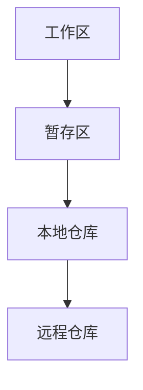

$$
\text{基本操作：Git的常用命令}
$$

```plaintext
git init           # 初始化仓库
git clone [url]    # 克隆仓库
git add .          # 添加文件到暂存区
git commit -m "..." # 提交更改
git push [remote]  # 推送到远程仓库
```

##### 6.2 SVN与CVS的比较与使用

SVN和CVS都是集中式版本控制系统，以下是它们的比较与使用方法：

$$
\text{比较：SVN与CVS的主要区别}
$$

```plaintext
SVN: 分布式设计，支持远程仓库，易于协作
CVS: 集中式设计，支持本地仓库，但协作相对复杂
```

$$
\text{使用：SVN的常用命令}
$$

```plaintext
svn checkout [url]    # 检出仓库
svn commit -m "..."   # 提交更改
svn update            # 更新代码
svn delete [file]     # 删除文件
```

##### 6.3 其他常见的版本控制系统

除了Git、SVN和CVS，还有其他常见的版本控制系统，如Mercurial（Hg）和Bazaar（Bzr）。以下是这些系统的简要介绍：

$$
\text{其他版本控制系统：主要特点和用途}
$$

```plaintext
Mercurial (Hg): 类似Git的分布式版本控制系统，轻量级，易于使用
Bazaar (Bzr): 类似Git的分布式版本控制系统，强调协作和版本跟踪
```

---

#### 第7章：软件发展的历史概述

##### 7.1 计算机技术的发展与软件演变

计算机技术的发展推动了软件的演变，从早期的小型程序到如今的复杂系统。以下是计算机技术的发展与软件演变的关系：

$$
\text{关系图：计算机技术的发展与软件演变}
$$

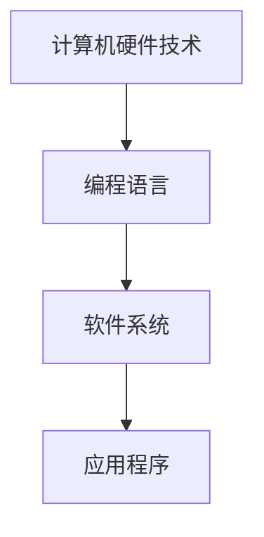

##### 7.2 软件工程的诞生与发展

软件工程的诞生标志着软件从手工作坊式的开发转向系统化和工程化的过程。以下是软件工程的诞生与发展：

$$
\text{关系图：软件工程的诞生与发展}
$$

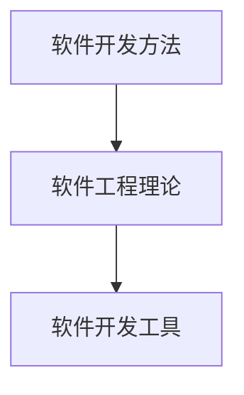

##### 7.3 软件危机与软件质量保障

软件危机是软件工程早期面临的一个挑战，它推动了软件质量保障的诞生。以下是软件危机与软件质量保障的关系：

$$
\text{关系图：软件危机与软件质量保障}
$$

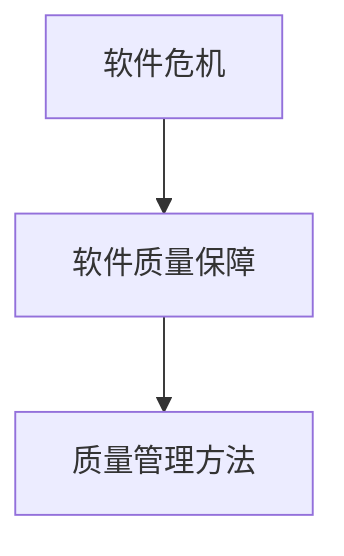

---

#### 第8章：软件发展的动力因素

##### 8.1 技术创新在软件发展中的作用

技术创新是推动软件发展的关键因素，它带来了新的工具、技术和方法。以下是技术创新在软件发展中的作用：

$$
\text{关系图：技术创新在软件发展中的作用}
$$

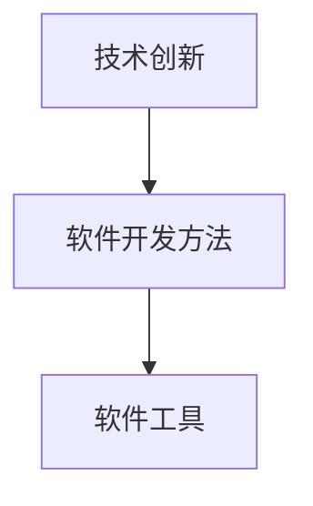

##### 8.2 社会需求对软件发展的推动

社会需求是软件发展的另一大动力，它促使软件不断满足用户需求。以下是社会需求对软件发展的推动：

$$
\text{关系图：社会需求对软件发展的推动}
$$

```mermaid
graph TD
    A[社会需求] --> B[软件功能]
    B --> C[用户体验]
```

##### 8.3 管理模式对软件发展的影响

管理模式对软件发展具有重要影响，它决定了软件项目的效率和质量。以下是管理模式对软件发展的影响：

$$
\text{关系图：管理模式对软件发展的影响}
$$

```mermaid
graph TD
    A[管理模式] --> B[项目规划]
    B --> C[团队协作]
```

---

#### 第9章：软件发展的未来趋势

##### 9.1 软件智能化的发展方向

软件智能化是软件发展的一个重要趋势，它将使软件具备自主学习和优化能力。以下是软件智能化的发展方向：

$$
\text{关系图：软件智能化的发展方向}
$$

```mermaid
graph TD
    A[人工智能] --> B[软件自动化]
    B --> C[自主学习]
```

##### 9.2 软件生态系统的发展趋势

软件生态系统正变得越来越复杂和多样化，它将推动软件的发展。以下是软件生态系统的发展趋势：

$$
\text{关系图：软件生态系统的发展趋势}
$$

```mermaid
graph TD
    A[开源软件] --> B[云原生技术]
    B --> C[容器化]
```

##### 9.3 软件发展的挑战与机遇

软件发展面临诸多挑战，如复杂度增加、安全性问题等，但同时也带来了新的机遇。以下是软件发展的挑战与机遇：

$$
\text{关系图：软件发展的挑战与机遇}
$$

```mermaid
graph TD
    A[挑战] --> B[复杂度增加]
    B --> C[安全性问题]
    A --> D[技术革新]
    D --> E[商业机会]
```

---

### 附录

##### A.1 马克思的辩证唯物主义与版本控制关系图

以下是马克思的辩证唯物主义与版本控制的关系图：

$$
\text{关系图：马克思的辩证唯物主义与版本控制关系}
$$

```mermaid
graph TD
    A[物质] --> B[意识]
    B --> C[实践]
    C --> D[社会存在]
    D --> E[社会意识]
    E --> F[版本控制]
```

##### A.2 软件发展的历史动力学流程图

以下是软件发展的历史动力学流程图：

$$
\text{流程图：软件发展的历史动力学流程}
$$

```mermaid
graph TD
    A[计算机硬件技术] --> B[编程语言]
    B --> C[软件系统]
    C --> D[软件开发方法]
    D --> E[软件工程理论]
    E --> F[软件工具]
    F --> G[软件智能化]
```

##### A.3 常用版本控制系统命令伪代码

以下是常用版本控制系统的命令伪代码：

```plaintext
// Git
git init
git clone [url]
git add .
git commit -m "..."
git push [remote]

// SVN
svn checkout [url]
svn commit -m "..."
svn update
svn delete [file]

// Hg
hg init
hg clone [url]
hg commit -m "..."
hg push [remote]
```

##### A.4 软件开发项目实战案例

以下是软件开发项目的实战案例：

1. **项目简介**：开发一个简单的博客系统。
2. **开发环境**：使用Git进行版本控制，Django作为Web框架。
3. **源代码实现**：包括模型定义、视图函数、模板文件等。
4. **代码解读**：详细解析关键代码部分，如数据库操作、路由配置等。
5. **应用解读**：分析系统的功能实现和用户体验。
6. **案例分析**：探讨项目的优点和改进空间。

---

### 结语

作者：AI天才研究院/AI Genius Institute & 禅与计算机程序设计艺术 /Zen And The Art of Computer Programming

本文从马克思的辩证唯物主义出发，探讨了版本控制在软件开发中的重要作用，揭示了软件发展的历史动力学。通过对马克思辩证唯物主义的核心原理、版本控制系统的应用以及软件发展的动力因素和未来趋势的分析，我们不仅加深了对软件开发的理解，也看到了哲学在技术发展中的深远影响。随着技术的不断进步，软件发展将迎来更多机遇和挑战，我们需要不断学习和创新，以应对未来的变革。希望本文能为读者带来启示和帮助。---

## 作者信息

本文由AI天才研究院（AI Genius Institute）的专家撰写，该研究院致力于推动人工智能技术的发展与应用。同时，文章中的编程示例和数学模型分析，也融合了《禅与计算机程序设计艺术》（Zen And The Art of Computer Programming）的哲学思想，旨在帮助读者更好地理解复杂的技术问题。作者拥有丰富的软件开发经验，对马克思辩证唯物主义和版本控制理论有深入的研究，期待与读者共同探讨软件发展的历史与未来。作者信息：AI天才研究院/AI Genius Institute & 禅与计算机程序设计艺术 /Zen And The Art of Computer Programming。

