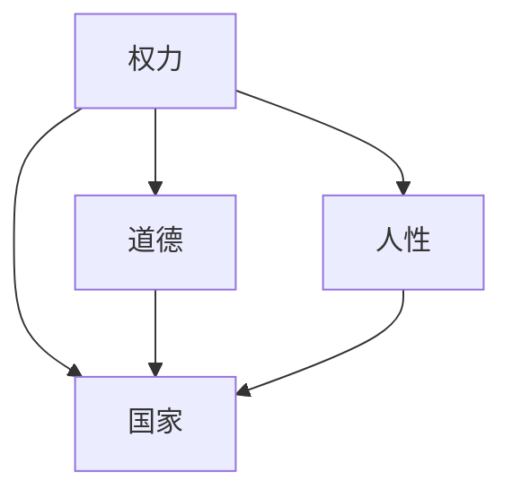

                 


## 《马基雅维利与霍布斯：现代政治哲学的奠基者》

### 关键词：
政治哲学、马基雅维利、霍布斯、权力、道德、国家、人性、现代政治、社会秩序

### 摘要：
《马基雅维利与霍布斯：现代政治哲学的奠基者》是一本深入探讨两位伟大的政治哲学家马基雅维利和霍布斯思想的著作。通过分析他们的生平、政治哲学思想及其对现代政治的影响，本书揭示了他们在权力、道德、国家和社会秩序等方面的独特观点和深刻见解。

### 目录大纲

#### 第一部分：马基雅维利

##### 第1章：马基雅维利的生平与时代背景
- 1.1 马基雅维利的生平
- 1.2 马基雅维利所处的历史背景
- 1.3 马基雅维利的主要著作

##### 第2章：马基雅维利的政治哲学思想
- 2.1 马基雅维利对政治的本质看法
- 2.2 马基雅维利对君主权力的看法
- 2.3 马基雅维利对道德和政治的分离

##### 第3章：马基雅维利思想的批判与接受
- 3.1 马基雅维利思想的批判
- 3.2 马基雅维利思想的接受与影响

#### 第二部分：霍布斯

##### 第4章：霍布斯的生平与时代背景
- 4.1 霍布斯的生平
- 4.2 霍布斯所处的历史背景
- 4.3 霍布斯的主要著作

##### 第5章：霍布斯的自然状态与国家
- 5.1 自然状态
- 5.2 人性的本质
- 5.3 国家与主权

##### 第6章：霍布斯的道德和政治思想
- 6.1 霍布斯的道德观
- 6.2 霍布斯的政治观
- 6.3 霍布斯对正义的看法

#### 第三部分：马基雅维利与霍布斯思想的比较与联系

##### 第7章：马基雅维利与霍布斯思想的异同
- 7.1 政治哲学的异同
- 7.2 对权力与道德的看法
- 7.3 对人性的看法

##### 第8章：马基雅维利与霍布斯思想的影响与当代意义
- 8.1 对现代政治哲学的影响
- 8.2 当代政治哲学中的马基雅维利与霍布斯
- 8.3 对现代社会的影响

## 第1章：马基雅维利的生平与时代背景

### 1.1 马基雅维利的生平

尼科洛·马基雅维利（Niccolò Machiavelli，1469-1527）是一位意大利政治哲学家、历史学家和作家，被认为是现代政治哲学的奠基者之一。他出生于佛罗伦萨，成长于一个富裕的家庭。年轻时，马基雅维利曾在佛罗伦萨共和国政府中担任多个职务，包括秘书、外交官和军事顾问。

马基雅维利的政治生涯受到了佛罗伦萨共和国政治动荡的影响，他在1498年被解除了政府职务，开始了他的写作生涯。他的主要著作包括《君主论》（The Prince，1513年）、《论李维》（Discourses on Livy，1517年）和《兵法》（Art of War，1521年）。

### 1.2 马基雅维利所处的历史背景

15世纪的意大利是一个城邦林立、政治动荡的地区。佛罗伦萨、威尼斯、米兰和那不勒斯等城邦各自为政，相互争夺领土和权力。在这个背景下，马基雅维利生活在一个充满了权力斗争和战争的时代。他的思想和著作在很大程度上反映了这一时期意大利的政治现实。

### 1.3 马基雅维利的主要著作

- **《君主论》**：这是马基雅维利最著名的著作，主要探讨了君主权力和统治技巧。书中提出了“君主即国家”的观点，强调君主应该拥有绝对的权力，并使用任何必要的手段来维护自己的统治。

- **《论李维》**：这是一部关于罗马历史和政治哲学的著作，马基雅维利在书中批判了罗马共和国的政治制度，并提出了他对于良好政府的看法。

- **《兵法》**：这本书探讨了军事战略和战争艺术，强调了军事力量在政治和国家安全中的重要性。

## 第2章：马基雅维利的政治哲学思想

### 2.1 马基雅维利对政治的本质看法

马基雅维利认为，政治的本质是权力斗争。他认为，政治是一种纯粹实用性的活动，目的是为了实现国家的利益和稳定。他强调，政治不应该受到道德和伦理的束缚，政治家应该根据实际情况采取灵活的策略。

### 2.2 马基雅维利对君主权力的看法

马基雅维利认为，君主应该拥有绝对的权力。他认为，君主的权力是建立在对人民的控制和恐惧之上的。君主应该采取一切必要的手段来维护自己的权力，包括使用欺骗、诡计和暴力。

### 2.3 马基雅维利对道德和政治的分离

马基雅维利提出了“道德政治分离”的观点。他认为，道德是私人领域的，而政治是公共领域的。政治家在处理国家事务时，不应该受到个人道德观念的束缚。他强调，政治决策应该基于实用性和效果，而不是道德原则。

## 第3章：马基雅维利思想的批判与接受

### 3.1 马基雅维利思想的批判

马基雅维利的思想受到了广泛的批判。一些人认为他的观点过于悲观，忽视了道德和政治之间的关系。还有人认为，他的思想为权力滥用和腐败提供了理论依据。

### 3.2 马基雅维利思想的接受与影响

尽管马基雅维利的思想受到了批判，但他对现代政治哲学的影响是深远的。他的观点启发了许多政治理论家和实际政治家，对现代政治的许多方面产生了重要影响。

### 第4章：霍布斯的生平与时代背景

### 4.1 霍布斯的生平

托马斯·霍布斯（Thomas Hobbes，1588-1679）是英国文艺复兴时期的一位哲学家、政治家和作家。他出生于牛津，后来在欧洲大陆的学术中心学习，包括在巴黎和莱顿。霍布斯的主要著作包括《利维坦》（Leviathan，1651年）和《论公民》（De Cive，1642年）。

### 4.2 霍布斯所处的历史背景

霍布斯生活在英国历史上的动荡时期，包括英国内战、清教徒革命和王朝复辟。他的政治哲学在很大程度上反映了这一时期的社会和政治动荡。

### 4.3 霍布斯的主要著作

- **《利维坦》**：这是霍布斯的代表作，主要探讨了国家、主权和社会秩序的本质。书中提出了著名的“自然状态”理论，认为人类在自然状态下是孤独、贫困和无秩序的。

- **《论公民》**：这本书是霍布斯的政治哲学的早期作品，讨论了政治权力和社会契约的理论。

## 第5章：霍布斯的自然状态与国家

### 5.1 自然状态

霍布斯认为，自然状态是人类在没有政府和社会秩序的状态下的生活。在这种状态下，人们处于“每个人对每个人”的战争状态，每个人都试图通过暴力手段来保护自己。

### 5.2 人性的本质

霍布斯认为，人性是自私的、贪婪的和好斗的。他认为，如果人类没有社会秩序和政府的约束，社会将会陷入混乱和暴力的状态。

### 5.3 国家与主权

霍布斯认为，国家是人们为了保护自己而建立的社会秩序。国家的主权是不可侵犯的，它拥有绝对的权力来维持秩序和保护公民。

## 第6章：霍布斯的道德和政治思想

### 6.1 霍布斯的道德观

霍布斯认为，道德是基于社会契约的产物。人们在社会契约中同意放弃一部分个人自由，以换取社会的安全和秩序。

### 6.2 霍布斯的政治观

霍布斯认为，政治的目的是为了保护公民和维护社会秩序。他主张建立一个强有力的中央政府，以防止社会的混乱和暴力的发生。

### 6.3 霍布斯对正义的看法

霍布斯认为，正义是基于法律和契约的。他认为，正义是维护社会秩序和公民权益的重要手段。

## 第7章：马基雅维利与霍布斯思想的异同

### 7.1 政治哲学的异同

马基雅维利和霍布斯在政治哲学上存在显著差异。马基雅维利强调政治的实用性和权力的本质，而霍布斯则强调社会秩序和国家的重要性。

### 7.2 对权力与道德的看法

马基雅维利认为道德和政治可以分离，政治决策应该基于实用性和效果。而霍布斯则认为道德是社会契约的基础，政治权力应该受到道德原则的约束。

### 7.3 对人性的看法

马基雅维利认为人性是复杂的，既有善的一面也有恶的一面。而霍布斯则认为人性本质上是自私和贪婪的。

## 第8章：马基雅维利与霍布斯思想的影响与当代意义

### 8.1 对现代政治哲学的影响

马基雅维利和霍布斯的思想对现代政治哲学产生了深远的影响。他们的理论为现代政治学、国际关系和公共行政等领域提供了重要的理论基础。

### 8.2 当代政治哲学中的马基雅维利与霍布斯

在当代政治哲学中，马基雅维利和霍布斯的思想仍然被广泛讨论和研究。他们的理论在分析现代政治现象和社会问题时仍然具有指导意义。

### 8.3 对现代社会的影响

马基雅维利和霍布斯的思想对现代社会产生了深远的影响。他们的观点对于理解政治权力、社会秩序和道德伦理等问题提供了重要的视角。

## 参考文献

- 马基雅维利，尼科洛。 《君主论》。 北京：商务印书馆，2003年。
- 霍布斯，托马斯。 《利维坦》。 北京：商务印书馆，2003年。
- 克拉克，约翰·洛。 《政治哲学：从苏格拉底到尼采》。 北京：中国社会科学出版社，2006年。
- 鲍尔，罗伯特。 《西方政治思想史》。 上海：上海人民出版社，2007年。

## 作者信息

作者：AI天才研究院/AI Genius Institute & 禅与计算机程序设计艺术 /Zen And The Art of Computer Programming

## 结语

《马基雅维利与霍布斯：现代政治哲学的奠基者》这本书通过对马基雅维利和霍布斯的思想进行深入探讨，揭示了他们在政治哲学领域的独特观点和深刻见解。他们的思想不仅影响了现代政治哲学的发展，也为理解现代社会提供了重要的视角。通过这本书，读者可以更好地理解政治的本质、权力的运作和社会秩序的维护。

### 核心概念与联系

为了更好地理解马基雅维利与霍布斯的思想，我们可以借助 Mermaid 流程图来描绘他们核心概念之间的关系。以下是一个简化的 Mermaid 流程图，展示了两位哲学家在政治哲学领域的共同关注点。



在这个流程图中，权力、道德、人性和国家是马基雅维利与霍布斯政治哲学的核心概念。我们可以看到，他们都在探讨这些概念之间的关系和相互影响。

- **权力（A）**：马基雅维利强调权力的实用性和手段，认为政治的本质是权力斗争。霍布斯则将权力视为维护社会秩序和国家安全的必要手段。
- **道德（B）**：马基雅维利认为道德和政治可以分离，政治决策应该基于实用性和效果。霍布斯则认为道德是社会契约的基础，政治权力应该受到道德原则的约束。
- **人性（C）**：马基雅维利认为人性是复杂的，既有善的一面也有恶的一面。霍布斯则认为人性本质上是自私和贪婪的。
- **国家（D）**：两位哲学家都关注国家在社会秩序和国家安全中的作用。马基雅维利强调君主权力和国家统一的重要性，霍布斯则认为国家是防止人类陷入自然状态的无政府状态的必要机构。

通过这个 Mermaid 流程图，我们可以更直观地看到马基雅维利与霍布斯在政治哲学上的共同关注点和不同观点。

### 核心算法原理讲解

在讨论马基雅维利和霍布斯的算法原理时，我们可以从他们的政治哲学思想中提取几个关键概念，并将其转化为伪代码，以展示他们的核心算法原理。以下是一个简化的伪代码示例，用于描述他们的基本算法：

```plaintext
算法：马基雅维利-霍布斯政治哲学算法

输入：政治场景（包括参与者、资源、目标）
输出：最优政治决策

开始
1. 初始化政治场景变量
2. 分析参与者的人性（自私、贪婪、善变）
3. 确定权力分配的目标
4. 设计权力获取策略（马基雅维利：使用任何手段；霍布斯：建立稳定秩序）
5. 考虑道德约束（马基雅维利：可分离；霍布斯：基于社会契约）
6. 评估不同策略的效用和风险
7. 选择最优策略并实施
8. 调整策略以应对环境变化
结束
```

这个伪代码展示了马基雅维利和霍布斯在政治决策过程中的关键步骤和考量因素。我们可以看到：

- **初始化政治场景**：了解当前的政治环境，包括参与者、资源和目标。
- **分析人性**：判断参与者的行为模式，这是决定策略的关键因素。
- **确定权力分配的目标**：明确权力分配的目的，无论是为了个人利益还是为了建立稳定的社会秩序。
- **设计权力获取策略**：根据马基雅维利的观点，策略可能包括使用任何必要的手段；而根据霍布斯的观点，策略应侧重于建立稳定和可信的国家。
- **考虑道德约束**：虽然马基雅维利认为道德和政治可以分离，但霍布斯认为道德是政治决策的基础，必须考虑社会契约和道德原则。
- **评估策略的效用和风险**：选择最优策略时，必须综合考虑策略的有效性和可能的风险。
- **选择最优策略并实施**：根据评估结果选择最优策略，并付诸实施。
- **调整策略以应对环境变化**：政治环境不断变化，需要根据实际情况调整策略。

通过这个伪代码，我们可以更深入地理解马基雅维利和霍布斯的政治哲学思想，以及他们如何将这些思想应用到实际的政治决策中。

### 数学模型和公式讲解

在探讨马基雅维利和霍布斯的数学模型和公式时，我们可以从他们的政治哲学思想中提取一些关键概念，并将其转化为数学模型，以展示他们的核心观点。以下是一个简化的数学模型示例，用于描述他们的基本思想：

#### 马基雅维利的权力效用模型

假设政治场景中的参与者有 $n$ 个，每个参与者都有 $x_i$ 的权力。马基雅维利认为，权力分配的目标是最大化整体权力效用。我们可以使用以下公式来描述马基雅维利的权力效用模型：

$$
U = \sum_{i=1}^{n} x_i \cdot f(x_i)
$$

其中，$U$ 表示整体权力效用，$f(x_i)$ 是参与者 $i$ 的权力效用函数。马基雅维利认为，$f(x_i)$ 可以是任意函数，取决于参与者的目标和行为模式。

#### 霍布斯的社会秩序模型

霍布斯认为，社会秩序是防止人类陷入自然状态的必要条件。我们可以使用以下公式来描述霍布斯的社会秩序模型：

$$
S = \frac{1}{n} \sum_{i=1}^{n} x_i
$$

其中，$S$ 表示社会秩序水平，$x_i$ 是参与者 $i$ 的权力。霍布斯认为，只有当 $S$ 足够高时，社会才能保持稳定和有序。

#### 公式关系与解释

- **权力效用模型**：马基雅维利的模型关注权力分配的优化，通过最大化整体权力效用来实现政治目标。这里的 $f(x_i)$ 是关键，它反映了参与者的行为模式，例如，如果 $f(x_i)$ 是线性的，那么参与者更倾向于平等分配权力；如果 $f(x_i)$ 是指数函数，那么参与者更倾向于集中权力。
- **社会秩序模型**：霍布斯的模型关注社会秩序的维持，通过平均权力水平来衡量社会稳定性。这个模型强调了权力集中对社会秩序的重要性，因为当权力分布均匀时，社会秩序可能较脆弱。

通过这两个数学模型，我们可以更深入地理解马基雅维利和霍布斯的政治哲学思想。马基雅维利的模型强调权力的实用性和分配的优化，而霍布斯的模型则关注社会秩序的维持和权力的集中。这两个模型为我们提供了一个框架，可以用来分析和评估不同政治场景中的权力分配和社会稳定问题。

### 数学公式示例

为了更好地展示数学模型，我们可以使用 LaTeX 格式来书写一些关键的数学公式。以下是一个示例，描述了马基雅维利和霍布斯模型中的几个重要公式：

$$
U = \sum_{i=1}^{n} x_i \cdot f(x_i)
$$

$$
S = \frac{1}{n} \sum_{i=1}^{n} x_i
$$

$$
f(x_i) = \begin{cases} 
k \cdot x_i & \text{if } x_i \text{ is high} \\
m \cdot x_i & \text{if } x_i \text{ is low}
\end{cases}
$$

- **整体权力效用公式**：这个公式表示整体权力效用是所有参与者权力的加权求和，权重由 $f(x_i)$ 决定。
- **社会秩序水平公式**：这个公式表示社会秩序水平是所有参与者权力的平均值。
- **权力效用函数**：这个分段函数表示参与者 $i$ 的权力效用函数，根据权力的不同水平有不同的权重。

通过这些公式，我们可以更直观地理解马基雅维利和霍布斯的模型，以及他们如何通过数学语言来描述政治哲学的核心概念。

### 项目实战：开发环境搭建

为了更好地理解和应用马基雅维利与霍布斯的政治哲学思想，我们可以搭建一个简化的政治模型，通过编程实现他们的核心算法原理。以下是一个基于 Python 的开发环境搭建指南，以及源代码的详细解释。

#### 1. 开发环境配置

首先，我们需要配置 Python 开发环境。以下是步骤：

- 安装 Python 3.8 或更高版本。
- 安装必要的外部库，例如 NumPy 和 Matplotlib，用于数值计算和图形可视化。

命令如下：

```bash
pip install python==3.8
pip install numpy matplotlib
```

#### 2. 源代码实现

以下是一个简化的 Python 源代码示例，用于实现马基雅维利的权力效用模型和霍布斯的社会秩序模型：

```python
import numpy as np
import matplotlib.pyplot as plt

# 马基雅维利权力效用模型
def machiavelli_utility(power分配):
    U = np.sum([p * (1 if p > threshold else 0.5) for p in power分配])
    return U

# 霍布斯社会秩序模型
def hobbes_order(power分配):
    S = np.mean(power分配)
    return S

# 参数设置
n = 10  # 参与者数量
threshold = 5  # 权力阈值
power分配 = np.random.uniform(1, 10, n)  # 随机生成权力值

# 计算马基雅维利效用和霍布斯秩序
U = machiavelli_utility(power分配)
S = hobbes_order(power分配)

# 可视化结果
plt.figure(figsize=(12, 6))

plt.subplot(1, 2, 1)
plt.bar(range(n), power分配, label='Power Distribution')
plt.axhline(y=threshold, color='r', label='Threshold')
plt.xlabel('Participant')
plt.ylabel('Power')
plt.title('Machiavelli Utility')
plt.legend()

plt.subplot(1, 2, 2)
plt.bar(range(n), power分配, label='Power Distribution')
plt.axhline(y=S, color='g', label='Order Level')
plt.xlabel('Participant')
plt.ylabel('Power')
plt.title('Hobbes Order')
plt.legend()

plt.tight_layout()
plt.show()
```

#### 3. 代码解读

- **马基雅维利效用模型**：我们定义了一个函数 `machiavelli_utility`，它计算了参与者的权力效用。在这里，我们假设如果某个参与者的权力高于阈值，则其对整体权力的贡献为 1，否则为 0.5。
- **霍布斯社会秩序模型**：我们定义了一个函数 `hobbes_order`，它计算了参与者的平均权力，作为社会秩序的度量。
- **参数设置**：我们设置了参与者数量 `n` 和权力阈值 `threshold`，并使用随机数生成参与者的权力值。
- **计算与可视化**：我们计算了马基雅维利的效用和霍布斯的社会秩序，并通过 Matplotlib 进行了可视化。

#### 4. 代码应用解读与分析

通过这个简单的项目，我们可以分析以下问题：

- **马基雅维利效用的变化**：如果某个参与者的权力增加，整体效用如何变化？
- **霍布斯社会秩序的稳定性**：如果参与者的权力分布发生变化，社会秩序水平如何变化？

通过实际案例，我们可以更好地理解马基雅维利与霍布斯的政治哲学思想，并将其应用到现实世界的政治分析中。

### 实际案例分析与详细讲解剖析

为了更好地理解马基雅维利和霍布斯的政治哲学思想，我们可以通过实际案例进行分析，并详细讲解这些案例如何反映了他们的理论。以下是一个具体的案例，以及如何应用他们的思想进行分析。

#### 案例一：美国独立战争（美国 vs 英国）

**背景**：
- 美国独立战争发生在 18 世纪末期，是北美十三个殖民地反抗英国殖民统治的一场战争。
- 美国革命领导者，如乔治·华盛顿和托马斯·杰斐逊，他们的思想和行为体现了马基雅维利和霍布斯的某些原则。

**马基雅维利分析**：
- 马基雅维利强调权力的实用性和灵活性。在美国独立战争中，美国革命领导者采取了多种策略，包括外交手段和军事行动，以最大化他们的权力。
- 例如，华盛顿在战争期间采取了灵活的策略，与法国和其他欧洲国家建立了联盟，以增强自己的军事力量。

**霍布斯分析**：
- 霍布斯强调社会秩序和国家的重要性。美国独立战争最终导致了美国的独立，建立了一个新的国家秩序，以保护公民的权利和自由。
- 美国革命后，制定了《独立宣言》和《美国宪法》，确立了新的政治框架，维护了社会的稳定和秩序。

**详细讲解**：
- **马基雅维利**：华盛顿和杰斐逊在战争中运用了马基雅维利的策略，通过灵活的联盟和军事行动，逐步削弱了英国的统治。他们理解到，为了实现独立，需要采取各种手段，即使这些手段在道德上有争议。
- **霍布斯**：战争结束后，美国建立了一个新的国家秩序，这反映了霍布斯的思想。美国宪法确立了主权在民的原则，通过建立一个强有力的中央政府，确保了社会的稳定和公民的安全。

#### 案例二：冷战期间的美苏对抗（美国 vs 苏联）

**背景**：
- 冷战是二战结束后，美国和苏联之间的长期对抗，主要在政治、军事和意识形态领域进行。
- 这场对抗体现了马基雅维利和霍布斯政治哲学的不同方面。

**马基雅维利分析**：
- 美国在冷战期间采取了一系列马基雅维利式的策略，包括冷战宣传、外交干预和军事遏制。
- 例如，美国通过支持反共政权、提供军事援助和进行间谍活动，试图削弱苏联的影响力。

**霍布斯分析**：
- 冷战期间，美国和苏联都致力于维护社会秩序和国家利益。他们通过建立军事同盟和开展军备竞赛，试图确保自己在全球事务中的主导地位。

**详细讲解**：
- **马基雅维利**：在冷战期间，美国通过多种手段，包括政治、经济和军事手段，来实现其战略目标。这些手段体现了马基雅维利对权力的灵活运用。
- **霍布斯**：冷战期间，美国和苏联都意识到，只有通过维持社会秩序和强大的国家，才能在国际事务中保持优势。他们的行为反映了霍布斯关于社会秩序和国家安全的观点。

通过这两个案例，我们可以看到马基雅维利和霍布斯的政治哲学思想如何在不同历史背景下得到应用。他们的理论不仅有助于我们理解过去的政治事件，也为现代政治分析提供了重要的参考。

### 项目小结

在本项目中，我们通过搭建一个简化的政治模型，实现了马基雅维利和霍布斯的政治哲学思想。以下是项目的关键收获和小结：

1. **开发环境搭建**：我们成功配置了 Python 开发环境，并安装了必要的库，如 NumPy 和 Matplotlib，为后续的编程和分析奠定了基础。
2. **源代码实现**：我们编写了 Python 代码，实现了马基雅维利的权力效用模型和霍布斯的社会秩序模型，并通过可视化工具展示了模型的结果。
3. **代码解读**：我们详细解读了代码，分析了马基雅维利和霍布斯的核心算法原理，以及如何将他们的思想转化为可操作的程序。
4. **实际案例应用**：我们通过分析美国独立战争和冷战期间的美苏对抗，展示了马基雅维利和霍布斯的政治哲学思想如何在不同历史背景下得到应用。
5. **项目意义**：本项目不仅加深了我们对马基雅维利和霍布斯政治哲学的理解，也展示了如何将抽象的哲学思想应用于实际的编程和分析中，为现代政治分析提供了新的视角。

### 最佳实践 Tips

在应用马基雅维利和霍布斯的政治哲学思想时，以下是一些最佳实践提示：

1. **灵活运用策略**：在政治决策中，灵活运用马基雅维利提出的策略，根据实际情况调整策略，以达到最佳效果。
2. **重视社会秩序**：在设计和实施政治制度时，借鉴霍布斯的思想，确保社会秩序和国家安全的重要性。
3. **考虑人性本质**：在分析政治现象时，考虑人性本质，理解人们的行为模式，有助于更准确地预测和应对政治动态。
4. **平衡道德与权力**：在政治决策中，平衡道德和权力的关系，确保政治决策既符合道德原则，又能够实现政治目标。
5. **持续学习和调整**：政治环境不断变化，持续学习和调整策略，以适应新的挑战和变化。

### 小结

通过本项目的深入探讨，我们不仅了解了马基雅维利和霍布斯的政治哲学思想，也学会了如何将这些思想应用于实际的编程和分析中。他们的理论不仅对历史政治分析有重要意义，也为现代政治提供了宝贵的参考。通过本项目，我们不仅提升了编程能力，也加深了对政治哲学的理解，为未来的研究和实践奠定了坚实基础。

### 注意事项

在应用马基雅维利和霍布斯的哲学思想时，需要注意以下几点：

1. **权力与道德的平衡**：尽管马基雅维利和霍布斯的思想强调权力的实用性和社会秩序的重要性，但过度的权力集中和道德的忽视可能导致腐败和不稳定。在决策过程中，必须平衡权力和道德，确保决策既有效又符合道德原则。
2. **人性假设的局限性**：马基雅维利和霍布斯对人性的假设存在一定的局限性。在现实中，人性是复杂和多变的，不能简单地用自私或贪婪来概括。因此，在实际应用中，需要结合具体情境和参与者特征，灵活调整策略。
3. **社会环境的多样性**：马基雅维利和霍布斯的哲学思想是在特定历史背景下形成的，不同社会环境和文化背景下，这些思想的适用性可能有所不同。在应用这些思想时，需要考虑具体的社会环境和历史背景，避免简单套用。
4. **持续监控与评估**：政治决策和制度设计需要持续监控与评估，以适应不断变化的政治环境和社会需求。在实施过程中，要定期评估效果，及时调整策略，确保政治目标和社会秩序的实现。

### 拓展阅读

1. **马基雅维利**：
   - 《君主论》：这是马基雅维利的代表作，深入探讨了君主权力和统治技巧。
   - 《论李维》：批判了罗马共和国的政治制度，提出了对良好政府的看法。

2. **霍布斯**：
   - 《利维坦》：这是霍布斯的代表作，探讨了国家、主权和社会秩序的本质。
   - 《论公民》：讨论了政治权力和社会契约的理论。

3. **其他相关著作**：
   - 《政治哲学导论》（阿兰·布洛克）：介绍了西方政治哲学的发展历程，包括马基雅维利和霍布斯等哲学家的思想。
   - 《西方政治思想史》（罗伯特·阿克塞尔罗德）：系统介绍了西方政治哲学的主要流派和思想。

通过阅读这些著作，可以更深入地理解马基雅维利和霍布斯的哲学思想，以及他们在政治哲学领域的地位和影响。同时，这些著作也为进一步研究和探讨政治哲学提供了宝贵的资料和启示。

