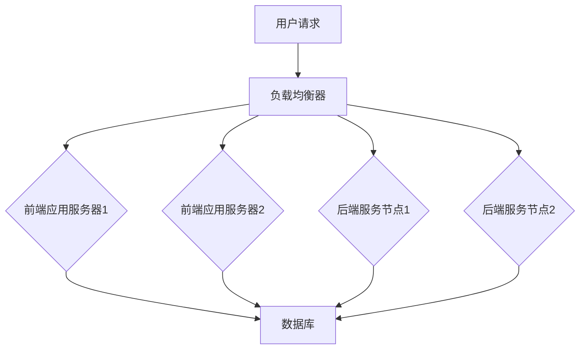
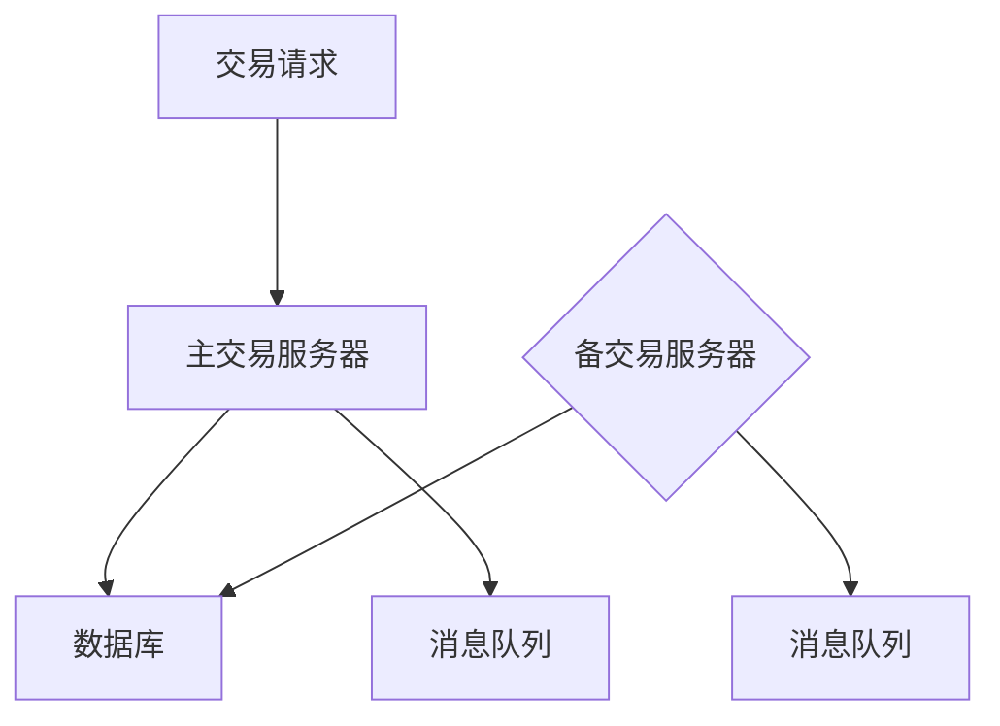
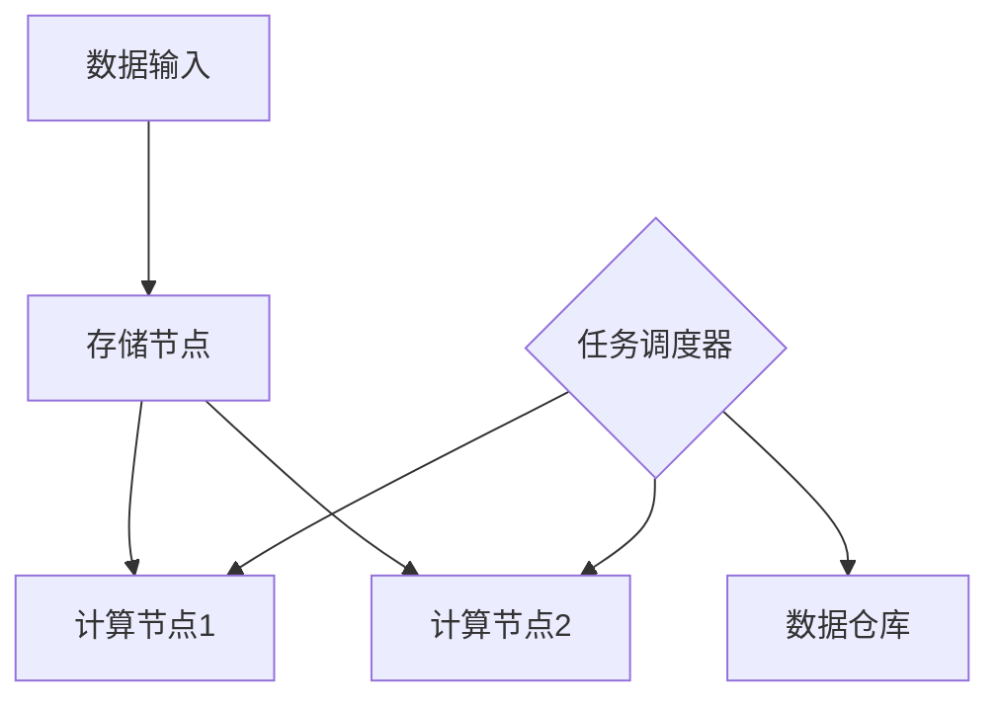

                 

# 文章标题：高可用方案的控制点

> 关键词：高可用性、系统控制点、故障转移、负载均衡、容错设计

> 摘要：本文将深入探讨高可用性方案的控制点，包括高可用性的重要性、控制点的定义和分类、常见的故障转移和负载均衡策略，以及高可用性方案的设计原则和最佳实践。通过本文的详细分析，读者将能够理解如何构建一个具有高可用性的系统，并在实际项目中应用这些技术。

## 引言

在高性能和高可靠性的系统中，高可用性是一个至关重要的概念。它确保了系统在面临各种故障和压力时能够持续运行，不中断服务。在现代IT环境中，高可用性不仅是企业竞争力的体现，更是客户满意度的保障。因此，设计和实现一个高可用性的系统至关重要。

本文将围绕高可用方案的控制点进行探讨。控制点是指在系统设计和实现过程中，需要特别注意和优化的关键环节。它们决定了系统在面对故障和负载时的响应能力和恢复速度。本文将依次介绍以下内容：

1. 高可用性的基本概念和重要性。
2. 高可用方案的控制点定义和分类。
3. 常见的故障转移和负载均衡策略。
4. 高可用性方案的设计原则和最佳实践。
5. 实际案例分析和详细讲解。

通过本文的阅读，读者将能够系统地了解高可用性方案的设计思路，掌握关键控制点的分析和应用，从而为实际项目提供可靠的技术支持。

## 高可用性的基本概念和重要性

高可用性（High Availability, HA）是确保系统在运行过程中尽可能长时间地保持可用状态的一种技术。它通过减少系统故障时间、提高系统恢复速度和增强系统的容错能力来实现。高可用性不仅仅是提高系统的运行时间，更重要的是保证在故障发生时系统能够迅速恢复，减少服务中断的时间和影响。

### 高可用性与系统可用性的区别

系统可用性（System Availability）是衡量系统在一段时间内保持正常运行的能力。它通常用百分比表示，计算公式为：

\[ \text{系统可用性} = \frac{\text{系统正常运行时间}}{\text{系统总运行时间}} \times 100\% \]

高可用性则是在系统可用性的基础上，通过冗余设计、故障检测与恢复机制等手段，进一步减少系统的停机时间，提升系统的整体可靠性。

### 高可用性的重要性

在高性能和高可靠性的系统中，高可用性具有以下几个重要意义：

1. **客户满意度**：高可用性系统能够提供连续的服务，确保客户始终能够访问和利用系统功能，从而提高客户满意度。
2. **业务连续性**：对于许多企业来说，业务连续性是至关重要的。高可用性系统能够在故障发生时迅速恢复，确保业务的连续运行，避免因系统故障导致的业务中断。
3. **成本节约**：虽然高可用性系统的设计和维护成本较高，但通过减少系统故障和停机时间，可以显著降低企业的运营成本。
4. **竞争力**：在现代竞争激烈的商业环境中，具备高可用性的系统能够提供独特的竞争优势，吸引和保留客户。

### 高可用性系统的基本原理

高可用性系统通常采用以下几种基本原理：

1. **冗余设计**：通过引入冗余组件，如备用服务器、存储设备和网络设备，确保在主设备发生故障时，系统能够自动切换到备用设备，保持服务的连续性。
2. **故障检测与恢复**：定期检测系统组件的状态，一旦发现故障，立即触发恢复流程，将服务切换到健康的组件。
3. **负载均衡**：通过负载均衡器将请求分布到多个服务器上，避免单点过载，提高系统的整体性能和可用性。
4. **分布式架构**：采用分布式架构，将系统功能分散到多个节点上，提高系统的容错能力和扩展性。

接下来，我们将详细探讨高可用性方案中的关键控制点。

## 高可用方案的控制点

在高可用性方案的设计与实施过程中，控制点是确保系统能够持续稳定运行的关键环节。控制点可以分为以下几类：

### 1. 硬件控制点

硬件控制点主要涉及系统的物理设备，如服务器、存储设备和网络设备。这些硬件组件的选择、配置和冗余设计是保障系统高可用性的基础。

**1.1 服务器冗余设计**

服务器冗余设计包括以下几个方面：

- **双机热备份**：通过双服务器同时运行相同的服务，确保在一台服务器发生故障时，另一台服务器可以接管其工作。
- **负载均衡**：通过负载均衡器将请求分发到多台服务器上，避免单点过载，提高系统的处理能力和可用性。
- **集群架构**：采用集群架构，将多台服务器组成一个整体，共享资源，实现故障自动转移。

**1.2 存储冗余设计**

存储冗余设计包括：

- **RAID技术**：使用RAID（独立冗余磁盘阵列）技术，通过多个磁盘的组合提高数据的可靠性和访问速度。
- **备份与恢复**：定期备份数据，并确保在数据丢失或损坏时能够迅速恢复。

**1.3 网络冗余设计**

网络冗余设计包括：

- **多路径网络**：通过多条网络路径连接服务器和存储设备，避免单点故障。
- **网络负载均衡**：将网络流量分布到多个路径上，提高网络的稳定性和吞吐量。

### 2. 软件控制点

软件控制点主要涉及系统的软件组件和应用程序，包括故障检测、自动恢复和负载均衡等。

**2.1 故障检测**

故障检测是高可用性系统的重要环节，包括以下几个方面：

- **健康检查**：定期对系统组件进行健康检查，检测是否存在异常。
- **告警机制**：一旦检测到故障，立即生成告警信息，通知相关人员。
- **日志分析**：通过分析系统日志，发现潜在问题并及时处理。

**2.2 自动恢复**

自动恢复包括：

- **故障转移**：当检测到主服务器发生故障时，自动将服务切换到备用服务器。
- **恢复策略**：制定详细的恢复策略，确保在故障发生时系统能够迅速恢复。
- **演练**：定期进行故障演练，验证自动恢复机制的有效性。

**2.3 负载均衡**

负载均衡包括：

- **负载监测**：实时监测系统负载，确保请求能够均匀地分配到各个服务器上。
- **算法选择**：选择适合业务的负载均衡算法，如轮询、最小连接数、源IP哈希等。
- **动态调整**：根据系统负载的实时变化，动态调整负载均衡策略。

### 3. 数据控制点

数据控制点主要涉及数据的一致性、备份和恢复等方面。

**3.1 数据一致性**

数据一致性包括：

- **分布式事务**：在分布式系统中处理事务时，确保所有节点上的数据一致性。
- **最终一致性**：在某些场景下，无法保证强一致性，可以通过最终一致性来降低系统的延迟和开销。

**3.2 数据备份**

数据备份包括：

- **全量备份**：定期进行全量备份，确保在数据丢失或损坏时能够恢复到最近的正常状态。
- **增量备份**：只备份自上次备份以来发生变化的数据，提高备份效率和存储空间利用率。

**3.3 数据恢复**

数据恢复包括：

- **快速恢复**：在发生数据丢失或损坏时，能够迅速恢复数据，降低业务中断时间。
- **恢复策略**：制定详细的恢复策略，确保在数据丢失时能够有效恢复。

通过以上对高可用性方案控制点的分析，我们可以看到，高可用性系统的设计需要从硬件、软件和数据等多个方面进行综合考虑。只有全面优化这些控制点，才能构建一个真正具有高可用性的系统。

### 常见的故障转移和负载均衡策略

在高可用性方案中，故障转移和负载均衡是两个关键组成部分。它们的工作原理和实现策略决定了系统在面临故障和负载时的响应能力和稳定性。以下将详细介绍常见的故障转移和负载均衡策略。

#### 1. 故障转移策略

故障转移（Fault Transfer）是指当系统中的某个组件或服务发生故障时，自动将负载切换到其他健康的组件或服务上，以确保系统的连续运行。常见的故障转移策略包括：

**1.1 主备切换（Active-Standby）**

主备切换是一种简单且常见的故障转移策略。在该策略中，系统有两个状态：主状态和备状态。主服务器负责处理所有请求，而备服务器处于待机状态，一旦主服务器发生故障，备服务器立即接管其工作。主备切换具有以下优点：

- 系统简单，易于实现和维护。
- 故障转移速度快，一般只需几秒钟。

缺点包括：

- 备服务器在大部分时间处于闲置状态，资源利用率低。
- 当主服务器发生故障时，可能存在一定的服务中断时间。

**1.2 集群（Clustering）**

集群是一种高级的故障转移策略，它通过多个服务器组成一个集群，共同处理请求。集群中的服务器分为主服务器和从服务器，当主服务器发生故障时，从服务器可以接管其工作，继续提供服务。集群具有以下优点：

- 提高资源利用率，所有服务器都可以参与处理请求。
- 故障转移速度较快，一般只需几十秒。

缺点包括：

- 系统复杂度较高，需要更多的时间和资源进行维护。
- 可能存在单点故障，如集群管理器发生故障时，整个集群将无法正常工作。

**1.3 分布式架构（Distributed Architecture）**

分布式架构通过将系统功能分散到多个节点上，实现高可用性。在分布式架构中，每个节点都可以独立处理请求，当某个节点发生故障时，其他节点可以继续提供服务。分布式架构具有以下优点：

- 高度容错性，单个节点的故障不会影响整个系统的运行。
- 良好的扩展性，可以通过增加节点来提高系统性能。

缺点包括：

- 系统复杂度高，需要更多的时间和资源进行开发和维护。
- 需要解决分布式一致性问题和数据同步问题。

#### 2. 负载均衡策略

负载均衡（Load Balancing）是将请求均匀地分配到多个服务器上，以提高系统的处理能力和稳定性。常见的负载均衡策略包括：

**2.1 轮询（Round Robin）**

轮询是一种简单的负载均衡策略，它按照顺序将请求分配到各个服务器上。轮询具有以下优点：

- 简单易实现，易于理解和维护。
- 均匀分配请求，确保每个服务器都承担相等的负载。

缺点包括：

- 当服务器性能差异较大时，可能导致部分服务器过载，而其他服务器闲置。
- 无法根据服务器的当前负载情况进行动态调整。

**2.2 最小连接数（Least Connections）**

最小连接数是一种根据当前连接数进行负载均衡的策略。它将请求分配到当前连接数最少的服务器上，以避免部分服务器过载。最小连接数具有以下优点：

- 考虑服务器的当前负载情况，避免部分服务器过载。
- 增加系统的整体性能。

缺点包括：

- 可能导致部分服务器处于空闲状态，资源利用率较低。
- 需要更多的资源和时间进行连接数的监控和统计。

**2.3 源IP哈希（Source IP Hashing）**

源IP哈希是一种基于客户端IP地址进行负载均衡的策略。它将请求按照客户端IP地址的哈希值分配到各个服务器上，确保来自同一IP地址的请求总是由同一服务器处理。源IP哈希具有以下优点：

- 提高会话保持性，确保来自同一客户端的请求总是由同一服务器处理。
- 简化客户端的身份验证和会话管理。

缺点包括：

- 可能导致部分服务器负载不均衡，如某个IP地址的请求量较大时，可能导致该服务器过载。
- 无法根据服务器的当前负载情况进行动态调整。

通过以上对故障转移和负载均衡策略的介绍，我们可以看到，每种策略都有其优缺点和适用场景。在实际应用中，需要根据具体需求和系统特点选择合适的故障转移和负载均衡策略，以确保系统的稳定性和性能。

### 高可用性方案的设计原则和最佳实践

设计高可用性方案是一个复杂而细致的过程，涉及到多个技术领域和业务需求。以下将介绍一些高可用性方案的设计原则和最佳实践，以帮助开发者构建具有高可靠性的系统。

#### 1. 设计原则

**1.1 冗余设计**

冗余设计是高可用性方案的基础。通过在系统组件、数据存储和网络等方面引入冗余，可以确保在故障发生时，系统仍能正常运行。冗余设计包括硬件冗余、软件冗余和数据冗余。

**1.2 故障检测和恢复**

故障检测和恢复机制是确保系统在故障发生后能够快速恢复的关键。通过定期健康检查、实时告警和自动恢复策略，可以及时发现问题并采取措施。

**1.3 负载均衡**

负载均衡可以有效地分配请求，避免单点过载，提高系统的整体性能。选择合适的负载均衡策略和算法，可以提高系统的稳定性和响应速度。

**1.4 分布式架构**

分布式架构可以降低系统的耦合度，提高容错能力和扩展性。通过将系统功能分散到多个节点上，可以有效应对单点故障和负载高峰。

**1.5 数据一致性**

数据一致性是高可用性系统的重要保障。在分布式环境中，需要确保多个节点上的数据保持一致。可以使用分布式事务、最终一致性等技术实现数据一致性。

**1.6 自动化部署和运维**

自动化部署和运维可以提高系统的可靠性、可扩展性和可维护性。通过使用自动化工具和平台，可以实现快速部署、监控和故障恢复。

#### 2. 最佳实践

**2.1 定期备份和恢复演练**

定期备份数据并进行恢复演练，可以确保在数据丢失或系统故障时能够迅速恢复，降低业务中断时间。

**2.2 多路径网络连接**

使用多路径网络连接，可以避免单点故障，提高网络的可靠性和性能。

**2.3 故障转移和负载均衡策略的合理配置**

根据系统的负载情况和业务需求，选择合适的故障转移和负载均衡策略，并合理配置相关参数，以提高系统的可用性和性能。

**2.4 日志管理和分析**

通过收集和分析系统日志，可以及时发现潜在问题并采取相应措施，提高系统的稳定性。

**2.5 防火墙和安全策略**

部署防火墙和制定安全策略，可以防止外部攻击和内部安全漏洞，确保系统的安全性。

**2.6 持续监控和优化**

持续监控系统的运行状态和性能指标，并根据监控数据优化系统配置和架构，以提高系统的可靠性和性能。

通过遵循以上设计原则和最佳实践，开发者可以构建一个具有高可用性的系统，确保系统在面临故障和负载时能够保持稳定运行。

### 实际案例分析与详细讲解

为了更好地理解高可用性方案的设计与应用，我们通过几个实际案例来详细分析和讲解。

#### 案例1：电商平台的高可用性架构设计

**背景介绍：**
某大型电商平台在其业务高峰期，需要确保系统的高可用性，以满足海量用户的购物需求。系统架构包括前端应用、后端服务、数据库和存储等关键组件。

**核心概念与联系：**
1. **分布式架构**：通过将系统功能分散到多个节点上，实现高可用性。
2. **负载均衡**：使用负载均衡器将用户请求分发到多个前端应用服务器和后端服务节点上。
3. **故障转移**：当某个节点发生故障时，负载均衡器自动将请求切换到其他健康节点。

**Mermaid流程图：**

**核心算法原理讲解：**
1. **负载均衡算法**：使用轮询算法，将用户请求均匀分配到前端应用服务器和后端服务节点上。
2. **故障检测与恢复**：使用心跳检测，定期检查节点状态。一旦发现故障节点，自动将其从负载均衡器中移除，并将请求切换到健康节点。

**数学模型和公式：**
$$
\text{系统可用性} = \frac{\text{系统正常运行时间}}{\text{系统总运行时间}} \times 100\%
$$

**详细讲解与举例说明：**
- 当用户发起请求时，负载均衡器将请求分配到前端应用服务器1和前端应用服务器2。
- 前端应用服务器处理用户请求，并调用后端服务节点1和后端服务节点2。
- 后端服务节点处理业务逻辑，访问数据库进行数据查询和操作。
- 当某个前端应用服务器或后端服务节点发生故障时，负载均衡器自动将其从负载列表中移除，并将请求切换到健康节点。

**项目小结：**
通过分布式架构和负载均衡，电商平台实现了高可用性，确保了在业务高峰期系统的稳定运行。

#### 案例2：金融交易系统的高可用性设计

**背景介绍：**
某金融交易系统需要在交易高峰期保持高可用性，以确保交易顺利进行。系统架构包括交易服务器、数据库、消息队列和缓存等组件。

**核心概念与联系：**
1. **主备切换**：通过主备服务器，实现故障自动转移。
2. **数据一致性**：确保在主服务器和备服务器之间的数据一致性。
3. **消息队列**：在主备切换过程中，使用消息队列保证数据的传递。

**Mermaid流程图：**

**核心算法原理讲解：**
1. **主备切换算法**：通过心跳检测，判断主服务器状态。当主服务器发生故障时，备服务器自动接管。
2. **数据一致性算法**：在主备切换过程中，使用消息队列记录主服务器和备服务器之间的数据差异，确保数据一致。

**数学模型和公式：**
$$
\text{系统可用性} = \frac{\text{系统正常运行时间}}{\text{系统总运行时间}} \times 100\%
$$

**详细讲解与举例说明：**
- 当用户发起交易请求时，主交易服务器处理请求，并将交易信息写入数据库和消息队列。
- 备交易服务器定期从消息队列中读取交易信息，并与主服务器保持数据同步。
- 当主交易服务器发生故障时，备交易服务器通过心跳检测得知主服务器状态，并自动接管其工作。
- 备交易服务器将接收到的交易请求处理完毕后，继续将数据同步到主服务器。

**项目小结：**
通过主备切换和数据一致性保障，金融交易系统实现了高可用性，确保了交易过程的连续性和数据一致性。

#### 案例3：大数据处理平台的高可用性架构

**背景介绍：**
某大数据处理平台需要处理海量数据，并保证系统的高可用性。系统架构包括计算节点、存储节点、任务调度器和数据仓库等组件。

**核心概念与联系：**
1. **分布式架构**：通过分布式计算和存储，提高系统的处理能力和容错能力。
2. **任务调度**：使用分布式调度器，合理分配任务到计算节点上。
3. **数据备份与恢复**：定期备份数据，确保在数据丢失或故障时能够迅速恢复。

**Mermaid流程图：**

**核心算法原理讲解：**
1. **任务调度算法**：根据计算节点的负载情况，动态分配任务。
2. **数据备份策略**：使用增量备份，只备份自上次备份以来发生变化的数据。

**数学模型和公式：**
$$
\text{系统可用性} = \frac{\text{系统正常运行时间}}{\text{系统总运行时间}} \times 100\%
$$

**详细讲解与举例说明：**
- 数据输入平台接收外部数据，将数据存储到存储节点上。
- 任务调度器根据数据量和计算节点的负载情况，将数据处理任务分配到计算节点上。
- 计算节点处理数据，并将结果存储到数据仓库中。
- 定期进行数据备份，确保在故障发生时能够迅速恢复。

**项目小结：**
通过分布式架构和任务调度，大数据处理平台实现了高可用性，确保了数据处理的连续性和稳定性。

### 最佳实践 tips

1. **定期备份和恢复演练**：定期备份数据，并进行恢复演练，确保在数据丢失或故障时能够迅速恢复。
2. **多路径网络连接**：使用多路径网络连接，避免单点故障，提高网络的可靠性和性能。
3. **合理配置负载均衡器**：根据业务需求和系统负载，选择合适的负载均衡算法和参数，确保请求均匀分配。
4. **持续监控和优化**：持续监控系统的运行状态和性能指标，并根据监控数据优化系统配置和架构。
5. **防火墙和安全策略**：部署防火墙和制定安全策略，防止外部攻击和内部安全漏洞。

### 小结

通过本文的详细分析和实际案例讲解，我们可以看到，高可用性方案的设计和实现是一个复杂而细致的过程。关键控制点包括硬件冗余、故障检测与恢复、负载均衡和数据备份等。通过遵循设计原则和最佳实践，可以构建一个具有高可用性的系统，确保系统在面对故障和负载时能够保持稳定运行。实际案例进一步验证了高可用性方案的有效性，为开发者提供了宝贵的经验和参考。

### 注意事项

1. **硬件冗余设计**：选择适合业务需求的硬件设备，并确保硬件冗余设计合理，以提高系统可靠性。
2. **软件故障检测与恢复**：定期检查软件组件的状态，及时修复发现的问题，确保系统稳定运行。
3. **负载均衡策略选择**：根据业务需求和系统负载情况，选择合适的负载均衡策略和算法，优化系统性能。
4. **数据备份与恢复**：制定详细的备份策略和恢复流程，确保在数据丢失或故障时能够迅速恢复。

### 拓展阅读

- 《高可用架构：大规模分布式系统设计与实践》
- 《分布式系统原理与范型》
- 《大规模分布式存储系统设计与实践》

通过阅读这些书籍，可以进一步深入了解高可用性系统的设计原理和实践方法。

## 作者信息

作者：AI天才研究院/AI Genius Institute & 禅与计算机程序设计艺术 /Zen And The Art of Computer Programming

AI天才研究院致力于推动人工智能技术的创新和应用，为全球企业提供先进的人工智能解决方案。作者所著《禅与计算机程序设计艺术》以其深入浅出的阐述和独特的视角，深受读者喜爱。感谢您的阅读，希望本文能为您的IT领域学习和实践带来帮助。如需进一步交流或咨询，欢迎联系作者。

