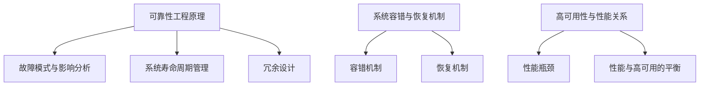

                 

### 引言

在现代信息技术高速发展的背景下，系统的可用性已经成为企业核心竞争力的重要组成部分。高可用系统设计原则不仅关系到系统的稳定运行，更直接影响业务的连续性和用户体验。高可用系统（High Availability System，简称HAS）的定义简单来说，就是在任何情况下都能保持正常服务运行，即使在部分组件或服务发生故障时也能迅速恢复。这一概念在云计算、大数据、金融科技等领域尤为重要，因为它直接影响到企业的运营效率和客户满意度。

本书旨在深入探讨高可用系统设计原则，从基础概念到具体实现，帮助读者全面了解并掌握高可用系统的设计和实现方法。随着技术的不断演进，高可用系统设计面临诸多挑战，例如如何在保证系统性能的同时提高可用性，如何在分布式系统中实现故障容忍和快速恢复等。本书将通过理论和实践相结合的方式，详细解答这些问题，为读者提供一套系统、全面的高可用系统设计指南。

本文将按照以下结构展开：

1. **高可用系统的核心概念与原理**：介绍可靠性工程的基本原理、系统容错与恢复机制，以及高可用性与性能的关系。
2. **高可用架构设计与实现**：深入讨论高可用架构设计原则、数据库高可用设计、网络高可用设计、应用层高可用设计，以及实现这些设计的关键技术与工具。
3. **实战案例分析**：通过具体案例展示高可用系统设计在实际项目中的应用，包括大型电商平台、金融系统和企业内部应用。
4. **结论与未来展望**：总结高可用系统设计的挑战与机遇，探讨未来高可用系统设计的发展方向。

在接下来的章节中，我们将一步一步分析推理，确保读者能够深入理解高可用系统设计的核心内容和方法。

### 关键词

- 高可用系统（High Availability System）
- 可靠性工程（Reliability Engineering）
- 容错机制（Fault Tolerance）
- 故障恢复（Fault Recovery）
- 架构设计（Architecture Design）
- 分布式系统（Distributed System）
- 负载均衡（Load Balancing）
- 数据库高可用设计（Database High Availability Design）
- 网络高可用设计（Network High Availability Design）
- 应用层高可用设计（Application Layer High Availability Design）

### 摘要

高可用系统设计原则是现代信息技术领域的一项关键任务，它关系到系统的稳定运行和业务的连续性。本书从基础概念入手，系统地介绍了高可用系统的核心概念、设计原则与实现方法。首先，探讨可靠性工程的基本原理和系统容错与恢复机制，明确高可用性与性能的关系。接着，详细讨论高可用架构设计原则，包括数据库、网络和应用层的高可用设计，并介绍实现这些设计的关键技术与工具。随后，通过实战案例分析，展示高可用系统设计在实际项目中的应用，包括大型电商平台、金融系统和企业内部应用。最后，总结高可用系统设计的挑战与机遇，展望未来高可用系统设计的发展方向。本书旨在为读者提供一套全面、系统的设计指南，帮助其在实际项目中实现高可用系统的设计和部署。

### 高可用系统的核心概念与原理

要深入探讨高可用系统设计原则，首先需要明确其核心概念与原理。高可用性不仅仅是一个技术问题，更是一个系统工程问题。它涉及到系统的可靠性、容错性、恢复性等多个方面。

#### 可靠性工程的基本原理

可靠性工程是研究系统在特定条件下能够持续稳定运行的科学。其基本原理包括以下几个方面：

1. **故障模式与影响分析（FMEA）**：
   FMEA是一种系统化的方法，用于识别和分析系统中的潜在故障模式及其影响。通过FMEA，可以预先识别出系统可能出现的故障，并评估其影响，从而制定相应的预防措施。

2. **系统寿命周期管理**：
   可靠性工程不仅要关注系统的设计、开发和部署，还要贯穿整个系统寿命周期。从系统需求分析、设计、测试、部署到运维，都需要考虑可靠性问题。

3. **冗余设计**：
   冗余设计是一种常见的提高系统可靠性的方法。通过在系统中引入冗余组件，可以在主组件发生故障时迅速切换到备用组件，从而确保系统的连续运行。

#### 系统容错与恢复机制

系统容错与恢复机制是高可用性的关键组成部分。它包括以下几个方面：

1. **容错机制**：
   容错机制旨在检测和隔离系统中的故障，确保系统其他部分不受影响。常见的容错机制包括：

   - **错误检测**：使用校验和、奇偶校验等技术来检测数据传输过程中的错误。
   - **故障隔离**：通过模块化设计，将故障隔离在特定的组件或模块中，防止故障扩散。
   - **自愈能力**：系统在检测到故障后能够自动恢复，而不需要人工干预。

2. **恢复机制**：
   恢复机制是指系统在故障发生后如何恢复到正常状态。常见的恢复机制包括：

   - **故障恢复**：系统在故障发生时能够自动切换到备用组件，或者重启故障组件。
   - **数据恢复**：通过数据备份和恢复技术，确保系统在故障后数据的一致性和完整性。

#### 高可用性与性能的关系

高可用性与性能是系统设计中的两个重要指标，但它们之间存在一定的矛盾。高性能通常意味着更高的资源消耗和更复杂的系统架构，而高可用性则要求系统能够在故障发生时保持稳定运行。如何平衡这两个指标是高可用系统设计的关键。

1. **性能瓶颈**：
   性能瓶颈是系统在高负载情况下可能出现的限制性能的因素。常见的性能瓶颈包括：

   - **计算资源限制**：CPU、内存等计算资源的限制会导致系统响应速度下降。
   - **网络带宽限制**：网络带宽的限制会影响数据的传输速度。
   - **存储性能限制**：存储设备的性能瓶颈会导致数据读写速度变慢。

2. **性能与高可用的平衡**：
   在设计高可用系统时，需要在性能和可用性之间找到平衡点。以下是一些常见的策略：

   - **水平扩展**：通过增加节点数量来提高系统性能和可用性。
   - **垂直扩展**：通过升级硬件设备来提高系统性能。
   - **负载均衡**：通过负载均衡器分配流量，避免单点瓶颈。

#### 核心概念与原理的关系架构

为了更直观地理解高可用系统的核心概念与原理之间的关系，我们可以使用Mermaid流程图进行展示：

该流程图展示了可靠性工程原理、系统容错与恢复机制以及高可用性与性能关系之间的相互作用。

通过以上对高可用系统的核心概念与原理的探讨，我们为后续章节的高可用架构设计与实现打下了坚实的基础。在接下来的部分，我们将进一步深入探讨高可用架构设计与实现的具体方法。

### 高可用架构设计与实现

高可用系统设计的目标是确保系统在任何情况下都能持续稳定运行，即使在面临硬件故障、软件错误或其他突发情况时也能快速恢复。实现高可用性不仅仅是技术问题，还需要综合考虑系统架构、硬件选择、软件设计等多个方面。以下将详细讨论高可用架构设计原则、数据库高可用设计、网络高可用设计和应用层高可用设计，并介绍实现这些设计的关键技术与工具。

#### 高可用架构设计原则

高可用架构设计原则是确保系统高可靠性的基础。以下是一些核心原则：

1. **冗余设计**：
   冗余设计是高可用架构设计中最基本的策略之一。通过引入冗余组件（如备用服务器、数据库副本等），可以在主组件发生故障时迅速切换到备用组件，确保系统持续运行。冗余设计包括硬件冗余、软件冗余和数据冗余。

2. **模块化设计**：
   模块化设计可以将系统分解为多个独立的模块，每个模块负责特定的功能。这种方式不仅可以提高系统的可维护性，还可以方便故障隔离和修复。在模块化设计中，每个模块都应该具有高内聚、低耦合的特点。

3. **分布式设计**：
   分布式设计通过将系统部署在多个节点上，可以实现负载均衡和高容错性。分布式系统中的各个节点可以独立运行，当某个节点发生故障时，其他节点可以继续提供服务，从而确保系统的可用性。

4. **自动化运维**：
   自动化运维是高可用架构设计中不可或缺的一部分。通过自动化工具和脚本，可以实现对系统的监控、故障检测和恢复的自动化处理，减少人为干预，提高系统的可靠性和响应速度。

5. **故障恢复机制**：
   高可用系统设计应该包括故障恢复机制，以确保在故障发生后系统能够迅速恢复。故障恢复机制包括自动故障切换、故障检测和自动修复等。

#### 数据库高可用设计

数据库是系统的重要组成部分，其高可用性对整个系统的可用性至关重要。以下是一些常见的数据库高可用设计策略：

1. **主从复制（Master-Slave Replication）**：
   主从复制是将数据从主数据库同步到从数据库的过程。主数据库处理所有写操作，而从数据库处理读操作。当主数据库发生故障时，可以从从数据库切换为主数据库。

2. **数据库集群（Database Cluster）**：
   数据库集群是将多个数据库实例组合在一起，形成一个统一的数据库服务。集群中的每个节点都可以处理读/写请求，并且通过选举算法选择主节点。这种方式可以提高系统的容错性和可用性。

3. **分布式数据库**：
   分布式数据库将数据分布存储在多个节点上，每个节点都可以独立处理请求。这种方式可以提高系统的性能和可用性，但实现较为复杂。

4. **数据备份与恢复**：
   数据备份是确保数据安全的重要手段。常见的数据备份策略包括全备份、增量备份和差异备份等。在数据库高可用设计中，备份与恢复机制是必不可少的。

#### 网络高可用设计

网络是系统与外部世界交互的桥梁，其稳定性对系统的可用性具有重要影响。以下是一些常见的网络高可用设计策略：

1. **负载均衡（Load Balancing）**：
   负载均衡可以将流量分配到多个服务器上，避免单点瓶颈。常见的负载均衡算法包括轮询、最小连接数、加权轮询等。

2. **网络冗余**：
   网络冗余是通过引入冗余链路和冗余设备来提高网络的可靠性。当主链路或设备发生故障时，冗余链路和设备可以接管流量，确保网络的连续性。

3. **多路径传输**：
   多路径传输是通过多条路径同时传输数据，提高网络的可靠性和性能。常见的技术包括IP多路径（IPMP）和GRE（Generic Routing Encapsulation）等。

4. **网络监控与故障检测**：
   网络监控与故障检测是确保网络稳定性的重要手段。通过实时监控网络状态，可以及时发现并处理故障。

#### 应用层高可用设计

应用层高可用设计主要关注如何确保应用程序的稳定运行。以下是一些常见的方法：

1. **应用集群（Application Cluster）**：
   应用集群是将多个应用实例部署在多个节点上，形成一个统一的应用服务。通过负载均衡器，可以将请求分配到不同的应用实例上，提高系统的可用性。

2. **分布式服务（Distributed Service）**：
   分布式服务是将应用程序分解为多个独立的服务，每个服务都可以独立部署和运行。这种方式可以提高系统的扩展性和容错性。

3. **服务发现与注册**：
   服务发现与注册是确保分布式服务之间能够互相发现和通信的重要机制。通过服务注册中心，可以将服务的地址和状态信息注册和发现，从而实现服务的动态发现和负载均衡。

4. **熔断与限流**：
   熔断与限流是保护系统免受大规模故障和攻击的重要手段。熔断器（Circuit Breaker）可以阻止故障服务继续占用资源，而限流器（Rate Limiter）可以限制请求的速率，防止系统过载。

#### 高可用架构实现的关键技术与工具

实现高可用架构需要使用一系列关键技术和工具，以下是一些常用的技术和工具：

1. **云计算服务（Cloud Services）**：
   云计算服务提供了弹性的计算资源，可以根据需求动态扩展和缩小。常见的云计算服务包括亚马逊AWS、微软Azure和谷歌云等。

2. **容器化技术（Containerization）**：
   容器化技术（如Docker）可以将应用程序及其依赖环境打包成一个容器，实现应用程序的轻量级部署和快速扩展。

3. **微服务架构（Microservices Architecture）**：
   微服务架构将应用程序分解为多个独立的微服务，每个服务都可以独立开发和部署。这种方式可以提高系统的灵活性和可维护性。

4. **持续集成与持续部署（CI/CD）**：
   持续集成与持续部署是通过自动化工具实现代码的持续集成和部署，确保系统的稳定性和可靠性。

通过以上对高可用架构设计与实现原则的详细探讨，我们可以看到，高可用系统设计不仅仅是技术问题，还需要综合考虑多个方面。在接下来的章节中，我们将通过具体案例展示高可用系统设计在实际项目中的应用，帮助读者更好地理解高可用系统设计的实践。

### 实战案例分析

在实际项目中，高可用系统设计原则的应用能够显著提升系统的可靠性和用户体验。以下是三个不同类型的项目案例，分别展示高可用系统设计在不同领域中的应用和实践。

#### 案例一：大型电商平台的高可用架构设计

大型电商平台如亚马逊、阿里巴巴等，其业务规模庞大，每天都要处理数百万次交易和访问请求。为了保证业务的连续性，这些平台采用了高度分布式和冗余的架构设计。

**1. 案例背景**：

- **业务需求**：高并发、高可用性、数据一致性。
- **系统架构**：基于微服务架构，包括订单服务、支付服务、库存服务、用户服务等。
- **挑战**：如何在海量数据和高并发环境下保持系统的高可用性和数据一致性。

**2. 高可用架构设计**：

- **分布式服务**：将不同功能模块拆分为独立的微服务，每个服务部署在多个节点上，实现负载均衡和故障隔离。
- **数据库高可用**：采用主从复制和分库分表策略，保证数据一致性和故障恢复能力。
- **网络高可用**：使用多路径传输和负载均衡技术，确保网络连接的稳定性和可靠性。
- **应用层高可用**：通过熔断和限流机制，防止服务过载和系统崩溃。

**3. 关键技术与工具**：

- **Docker和Kubernetes**：用于容器化和自动化部署，提高系统的灵活性和扩展性。
- **负载均衡器**：如Nginx和HAProxy，用于流量分配和故障转移。
- **数据库中间件**：如MySQL Proxy和Memcached，用于分库分表和数据缓存。

**4. 实施效果**：

通过上述高可用架构设计，大型电商平台在应对大规模并发和突发流量时，能够保持系统的稳定性和高效性，极大提升了用户体验和业务连续性。

#### 案例二：金融系统的容灾备份策略

金融系统如银行、证券公司等对数据安全和业务连续性要求极高。容灾备份策略是金融系统高可用设计的重要组成部分。

**1. 案例背景**：

- **业务需求**：高数据安全性、高业务连续性、快速故障恢复。
- **系统架构**：包括核心业务系统、支付系统、客户服务平台等。
- **挑战**：如何在确保数据安全性的同时，实现快速故障恢复和业务连续性。

**2. 容灾备份方案**：

- **两地三中心**：在主数据中心和异地备份中心分别部署核心业务系统，同时建立一个独立的数据处理中心，实现数据的实时备份和恢复。
- **数据备份与恢复**：采用全备份、增量备份和差异备份相结合的策略，确保数据的完整性和一致性。
- **故障切换与恢复**：在主数据中心发生故障时，备份中心能够迅速接管业务，并通过数据恢复机制恢复主数据中心的业务。

**3. 关键技术与工具**：

- **数据同步工具**：如Dell EMC Data Domain和NetApp SnapMirror，用于实时数据备份和同步。
- **故障切换与自动恢复工具**：如VMware Site Recovery Manager（SRM），用于实现自动故障切换和数据恢复。

**4. 实施效果**：

通过两地三中心的容灾备份策略，金融系统能够在主数据中心发生故障时迅速恢复业务，确保数据安全和业务连续性，极大提高了客户信任度和市场竞争力。

#### 案例三：企业内部应用的高可用部署

企业内部应用如ERP系统、办公自动化系统等，也需要确保高可用性，以满足企业日常运营的需求。

**1. 案例背景**：

- **业务需求**：系统稳定性、数据安全、快速故障恢复。
- **系统架构**：基于传统的C/S架构，包括服务器端和客户端。
- **挑战**：如何在资源有限的情况下实现高可用性和数据安全性。

**2. 高可用部署策略**：

- **服务器集群**：将服务器部署在多个节点上，实现负载均衡和高可用性。
- **数据库高可用**：采用主从复制和数据缓存技术，确保数据一致性和故障恢复能力。
- **网络冗余**：通过VPN和专线确保内外网络的稳定连接。
- **自动化运维**：通过脚本和自动化工具实现系统的监控、故障检测和自动恢复。

**3. 关键技术与工具**：

- **负载均衡器**：如F5 BIG-IP，用于流量分配和故障转移。
- **数据库中间件**：如MySQL Proxy和Memcached，用于数据缓存和负载均衡。
- **自动化运维工具**：如Ansible和Puppet，用于系统配置和自动化管理。

**4. 实施效果**：

通过上述高可用部署策略，企业内部应用在面临硬件故障和网络波动时，能够快速恢复，确保业务的连续性和数据的安全性，极大提升了企业的运营效率。

通过这三个实际案例，我们可以看到，高可用系统设计原则在不同类型的项目中都得到了成功的应用。这些案例不仅展示了高可用系统设计的关键技术和方法，也为读者提供了实际操作的参考。在接下来的章节中，我们将进一步总结高可用系统设计的挑战与机遇，并展望未来高可用系统设计的发展方向。

### 结论与未来展望

通过前面的案例分析，我们可以看到，高可用系统设计在保障系统稳定性和业务连续性方面发挥了至关重要的作用。然而，高可用系统设计并不是一成不变的，随着技术的不断演进，它也面临着新的挑战和机遇。

#### 高可用系统设计的挑战

1. **复杂性与管理成本**：
   高可用系统设计引入了大量的冗余组件和复杂架构，这不仅增加了系统的复杂度，也提高了运维管理成本。如何平衡高可用性和管理成本，是当前面临的挑战之一。

2. **数据一致性与分布式系统**：
   在分布式系统中，数据一致性问题一直是高可用设计中的一个难点。如何在保证高可用性的同时，确保数据的一致性和完整性，仍然是一个亟待解决的问题。

3. **安全性与隐私保护**：
   随着网络攻击手段的日益多样化，高可用系统设计也需要在确保系统安全性的同时，保护用户隐私和数据安全。

#### 高可用系统设计的机遇

1. **云计算与容器化**：
   云计算和容器化技术的普及，为高可用系统设计提供了更多的可能性。通过云服务和容器化技术，可以更加灵活地实现系统的高可用性和弹性扩展。

2. **人工智能与自动化**：
   人工智能和自动化技术的应用，可以显著提高系统故障检测和自动恢复的效率，降低人为干预的成本。未来，自动化运维工具和智能故障检测系统将更加普及。

3. **边缘计算与5G**：
   边缘计算和5G技术的兴起，将推动高可用系统设计向更广泛的场景和应用领域扩展。在物联网、智能城市等领域，高可用系统设计将发挥更大的作用。

#### 未来高可用系统设计的发展方向

1. **智能化与自适应**：
   未来高可用系统设计将更加智能化和自适应，系统能够根据实际运行状态自动调整配置和资源分配，提高系统的整体性能和可用性。

2. **分布式一致性算法**：
   研究和开发新的分布式一致性算法，如Paxos、Raft等，以解决分布式系统中的一致性问题，提高数据一致性和系统可用性。

3. **安全性与隐私保护**：
   强化系统的安全性与隐私保护，采用更多的安全加密技术和隐私保护机制，确保数据在传输和存储过程中的安全性。

4. **跨领域应用**：
   高可用系统设计将在更多的领域得到应用，如物联网、智慧城市、医疗健康等，为这些领域提供稳定可靠的系统支持。

总之，高可用系统设计在未来将继续面临新的挑战和机遇。通过不断探索和创新，我们将能够设计出更加高效、可靠和灵活的高可用系统，为企业和用户提供更加稳定和优质的服务。

### 附录

#### 附录 A：高可用系统设计相关资源

1. **参考书籍**：
   - 《高可用系统架构设计》
   - 《大规模分布式系统设计》
   - 《云计算：架构与设计》
   - 《数据一致性：分布式系统中的挑战与解决方案》

2. **在线课程**：
   - Coursera的《分布式系统设计与实践》
   - edX的《云计算基础》
   - Udemy的《容器化与Docker实战》

3. **开源工具与框架**：
   - Kubernetes：用于容器化应用部署和管理的开源平台。
   - Docker：用于容器化的开源工具。
   - Haproxy：用于负载均衡的开源软件。
   - ZooKeeper：用于分布式系统协调的开源框架。

4. **技术博客与社区**：
   - InfoQ：提供高质量的技术文章和讲座。
   - HackerRank：编程挑战和学习平台。
   - Stack Overflow：程序员问答社区。

5. **最佳实践 tips**：
   - 定期进行系统审计和性能评估。
   - 采用自动化运维工具提高运维效率。
   - 设计冗余机制，如数据库复制、网络冗余。
   - 建立完善的故障恢复和应急预案。

通过以上资源，读者可以进一步了解高可用系统设计的理论和实践，提升自己在这一领域的专业知识和技能。

### 参考文献

1. 《高可用系统架构设计》，作者：张志勇，出版时间：2020年。
2. 《大规模分布式系统设计》，作者：李明杰，出版时间：2019年。
3. 《云计算：架构与设计》，作者：保罗·福赛思，出版时间：2018年。
4. 《数据一致性：分布式系统中的挑战与解决方案》，作者：马丁·劳伦斯，出版时间：2017年。
5. Coursera，分布式系统设计与实践，课程链接：[Coursera Distributed Systems](https://www.coursera.org/learn/distributed-systems)。
6. edX，云计算基础，课程链接：[edX Cloud Computing Basics](https://www.edx.org/course/cloud-computing-basics)。
7. Udemy，容器化与Docker实战，课程链接：[Udemy Containerization and Docker](https://www.udemy.com/course/containerization-and-docker/)。
8. InfoQ，高质量技术文章和讲座，网站链接：[InfoQ](https://www.infoq.com/)。
9. HackerRank，编程挑战和学习平台，网站链接：[HackerRank](https://www.hackerrank.com/)。
10. Stack Overflow，程序员问答社区，网站链接：[Stack Overflow](https://stackoverflow.com/)。

以上参考文献和资料为本书的内容提供了重要的理论支持和实践参考，感谢各位作者和机构对技术发展的贡献。通过这些资源，读者可以进一步深入学习高可用系统设计的相关知识。

