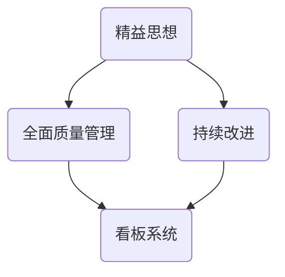

                 

### 高质量源于优生产

#### 关键词：优生产，高质量，生产管理，质量保证，效率提升，技术创新

> 摘要：本文旨在深入探讨高质量如何源于优生产。优生产作为一种系统性的生产管理方法，其核心目标是通过消除浪费、提高效率和确保产品质量，最终实现高质量的生产。本文将逐步分析优生产的概念、理论基础、核心算法、实践应用以及未来的发展趋势，以此阐述高质量如何源于优生产。

## 目录大纲设计思路

在撰写本文前，我们首先明确了全书的结构和内容。本文分为三个主要部分：引言、理论基础、实践应用。以下为详细的目录大纲设计思路：

### 第1章：优生产与高质量概述
- **核心概念与联系**：介绍优生产与高质量的定义，并通过Mermaid流程图展示两者之间的关系。
- **优生产的重要性**：阐述优生产在当前经济环境下的重要性。

### 第2章：优生产的发展历程与趋势
- **历史演变**：回顾优生产的发展历程，分析不同阶段的特点。
- **未来趋势**：探讨智能化、数字化、生态化、全球化对优生产的影响。

### 第3章：优生产的核心概念
- **生产系统的构成**：详细阐述生产系统的构成要素和类型。
- **优生产的原则与方法**：介绍优生产的基本原则和方法论。
- **实施步骤**：讲解优生产的实施步骤。

### 第4章：质量管理体系
- **质量管理的基本概念**：定义质量，阐述质量管理的目标和原则。
- **质量管理体系**：介绍质量管理体系的标准、要素和运行机制。

### 第5章：优生产的核心算法
- **数据分析方法**：讲解描述性、探测性和预测性统计分析。
- **质量控制算法**：详细阐述控制图法、因果图法和质量函数法。

### 第6章：优生产实践案例分析
- **案例选择与背景**：介绍案例选择的标准和案例企业的背景。
- **实施过程**：分析案例的实施过程、目标和效果。

### 第7章：优生产项目实战
- **项目背景与目标**：介绍项目的背景和目标。
- **实施过程**：详细讲解项目的实施步骤和计划。
- **代码解读与分析**：对源代码进行详细解读，分析代码的实现原理。

### 第8章：最佳实践与总结
- **最佳实践**：分享优生产的最佳实践经验。
- **总结**：总结全文内容，展望优生产的发展趋势。

### 第9章：注意事项与拓展阅读
- **注意事项**：提醒读者在实施优生产时需要注意的问题。
- **拓展阅读**：推荐相关书籍和资源，以供读者进一步学习。

通过以上详细的目录大纲设计，我们确保了文章内容的完整性和系统性，同时保持了简洁和逻辑性。

---

### 优生产与高质量的关系

优生产（Lean Production）是一种以消除浪费、提高效率和质量为核心的生产管理模式，其核心理念源自于丰田生产方式（Toyota Production System，TPS）。优生产的目标是通过优化生产流程、减少资源浪费、提高生产效率和产品品质，从而实现高质量的生产。那么，高质量是如何源于优生产的呢？这需要我们从以下几个方面进行分析：

首先，优生产强调消除浪费。浪费在制造过程中表现为过量生产、等待时间、运输浪费、库存浪费、加工浪费等。通过实施优生产，企业可以识别并消除这些浪费，从而提高生产效率。例如，通过实施看板系统（Kanban），可以减少库存浪费和过量生产；通过优化工作流程，可以减少等待时间和运输浪费。这些措施都有助于提高生产效率，从而为高质量的生产打下基础。

其次，优生产注重提高生产效率。高效的生产过程能够确保产品按时交付，减少生产周期，提高生产灵活性。高效的生产效率不仅能够满足市场需求，还能够为提高产品质量提供保障。例如，通过采用自动化和数字化技术，可以提高生产过程的精度和一致性，从而减少质量缺陷。

再次，优生产强调质量保证。优生产通过一系列的质量管理工具和技术，如5S、质量控制图、因果图等，对生产过程中的每个环节进行严格监控和控制，确保产品质量的稳定性和一致性。此外，优生产还强调员工的参与和培训，提高员工的质量意识和技能水平，从而进一步确保产品质量。

最后，优生产注重持续改进。通过实施持续改进（Kaizen）理念，企业可以不断优化生产流程，提高产品质量。持续改进不仅是一种管理方法，更是一种企业文化，它鼓励员工积极参与改进活动，从而推动企业持续发展。

综上所述，优生产通过消除浪费、提高生产效率、确保质量保证和持续改进，为高质量的生产创造了条件。高质量源于优生产，这不仅是一种理念，更是一种实践。通过实施优生产，企业可以实现从量变到质变的飞跃，从而在激烈的市场竞争中立于不败之地。

---

### 优生产的发展历程与趋势

优生产作为一种先进的生产管理模式，其发展历程可以追溯到20世纪50年代的日本丰田公司。当时的丰田公司通过引入一系列创新性管理方法，如看板系统、自动化设备等，逐步形成了独特的丰田生产方式（TPS）。随着时间的推移，优生产逐渐在全球范围内得到推广和应用。

#### 历史演变

1. **第一代优生产模式（1950s-1970s）**
   - **起源**：20世纪50年代，丰田公司开始探索如何通过优化生产流程来提高生产效率和产品质量。
   - **特点**：以减少浪费和库存为核心，引入了看板系统、自动化设备等创新性工具。
   - **影响**：这一阶段，优生产主要在丰田公司内部应用，逐渐形成了独特的生产模式。

2. **第二代优生产模式（1980s-1990s）**
   - **发展**：20世纪80年代，随着全球化的推进，优生产开始在其他国家和地区的企业中得到应用。
   - **特点**：在减少浪费的基础上，进一步强调生产效率和质量保证，引入了全面质量管理（TQM）等理念。
   - **影响**：优生产开始在全球范围内得到认可和推广，成为企业提升竞争力的有效手段。

3. **第三代优生产模式（2000s-至今）**
   - **演变**：进入21世纪，随着信息技术和自动化技术的快速发展，优生产不断融合新技术，形成了更加智能化和数字化的生产模式。
   - **特点**：以智能制造和数字化转型为核心，强调数据的实时监控和分析，实现生产过程的智能化和精细化。
   - **影响**：优生产在全球范围内得到广泛应用，成为企业实现高质量生产的重要途径。

#### 未来趋势

1. **智能化与数字化**
   - **趋势**：随着人工智能、大数据、云计算等新技术的快速发展，优生产正逐步向智能化和数字化方向演进。
   - **影响**：智能化和数字化能够大幅提高生产效率，减少浪费，提高产品质量。

2. **生态化与全球化**
   - **趋势**：在全球经济一体化的背景下，优生产正逐步向生态化和全球化方向发展。
   - **影响**：生态化和全球化有助于企业更好地整合全球资源，优化生产布局，提高竞争力。

3. **可持续性与绿色发展**
   - **趋势**：随着环保意识的提高，优生产正逐步向可持续性和绿色发展方向转型。
   - **影响**：可持续性和绿色发展有助于企业实现社会责任，提升品牌形象，赢得市场竞争力。

总的来说，优生产的发展历程反映了生产管理模式不断迭代和进化的过程。从传统的手工生产到现代化的智能制造，优生产始终坚持以消除浪费、提高效率和确保质量为核心，不断适应新的技术变革和市场环境。未来，优生产将继续朝着智能化、数字化、生态化和全球化方向迈进，为全球企业提供更加高效、高质量的生产解决方案。

### 核心概念与联系

在深入探讨优生产之前，我们需要明确几个核心概念及其相互关系。优生产并不是一个孤立的概念，而是与多个其他管理理念和工具紧密相连。以下是对这些核心概念及其关系的概述，并使用Mermaid流程图进行展示。

#### 关键概念

1. **精益思想（Lean Thinking）**
   - **定义**：精益思想是一种以客户需求为导向，通过消除浪费来提高生产效率和产品质量的管理理念。
   - **关系**：精益思想是优生产的基础，决定了优生产的核心理念和实施原则。

2. **全面质量管理（Total Quality Management, TQM）**
   - **定义**：全面质量管理是一种以质量为中心，全员参与，通过持续改进来实现质量目标的管理方法。
   - **关系**：TQM与优生产密切相关，共同致力于提高产品质量和生产效率。

3. **持续改进（Continuous Improvement, CI）**
   - **定义**：持续改进是一种不断寻求和实施改进措施，以优化工作流程和提升绩效的管理理念。
   - **关系**：持续改进是优生产的核心实践，贯穿于优生产的整个过程中。

4. **看板系统（Kanban）**
   - **定义**：看板系统是一种基于卡片或电子屏幕的管理工具，用于控制生产流程中的物料流动和工作进度。
   - **关系**：看板系统是优生产的重要组成部分，用于实现生产的可视化和流程优化。

#### Mermaid流程图

以下是一个简化的Mermaid流程图，展示了这些核心概念之间的关系：



**图解：**

- **精益思想**（A）是优生产的起点，它决定了优生产的整体方向和目标。
- **全面质量管理**（B）和**持续改进**（C）与精益思想紧密相关，共同构成了优生产的基础框架。
- **看板系统**（D）是实现优生产的重要工具，通过它来管理和优化生产流程。

通过这个Mermaid流程图，我们可以更直观地理解这些核心概念之间的关系，以及它们在优生产中的重要性。这些概念相互作用，共同推动优生产的实施和效果，从而实现高质量的生产。

### 核心算法原理讲解

在优生产中，核心算法的使用是确保生产效率和产品质量的重要手段。以下将详细讲解几个核心算法的原理，包括数据统计分析方法和质量控制方法。

#### 数据统计分析方法

1. **描述性统计分析**
   - **定义**：描述性统计分析用于描述数据集的基本特征，如均值、中位数、众数、方差等。
   - **伪代码**：
     ```python
     function descriptiveStatistics(data):
         mean = sum(data) / length(data)
         median = (sorted(data)[length(data) // 2] if length(data) % 2 == 1 else (sorted(data)[length(data) // 2 - 1] + sorted(data)[length(data) // 2]) / 2
         mode = max(count FREQUENCY OF data)
         variance = sum((x - mean)^2 for x in data) / length(data)
         return mean, median, mode, variance
     ```

2. **探测性统计分析**
   - **定义**：探测性统计分析用于发现数据中的异常值和趋势。
   - **伪代码**：
     ```python
     function detectAnomalies(data, threshold):
         anomalies = []
         for i in range(length(data)):
             if abs(data[i] - mean(data)) > threshold:
                 anomalies.append(data[i])
         return anomalies
     ```

3. **预测性统计分析**
   - **定义**：预测性统计分析用于基于历史数据预测未来的趋势和变化。
   - **伪代码**：
     ```python
     function predictTrend(data, windowSize):
         trend = []
         for i in range(windowSize, length(data)):
             trend.append(sum(data[i - windowSize:i]) / windowSize)
         return trend
     ```

#### 质量控制方法

1. **控制图法**
   - **定义**：控制图法用于监控和评估生产过程中的质量变化。
   - **伪代码**：
     ```python
     function controlChart(data, upperLimit, lowerLimit):
         for value in data:
             if value > upperLimit or value < lowerLimit:
                 return "Out of Control"
         return "In Control"
     ```

2. **因果图法**
   - **定义**：因果图法用于识别和分析质量问题的根本原因。
   - **伪代码**：
     ```python
     function causalAnalysis(data, variables):
         for variable in variables:
             if correlation(data[variable]) < threshold:
                 return "Causal Relationship Detected"
         return "No Causal Relationship Detected"
     ```

3. **质量函数法**
   - **定义**：质量函数法用于评估产品质量的分布情况。
   - **伪代码**：
     ```python
     function qualityFunction(data, specificationLimits):
         defects = 0
         for value in data:
             if not (specificationLimits[0] <= value <= specificationLimits[1]):
                 defects += 1
         return defects / length(data)
     ```

通过上述核心算法的讲解，我们可以看到优生产在实际操作中是如何通过数据分析和质量控制来确保生产效率和产品质量的。这些算法不仅是理论上的工具，更是企业优化生产流程、提高竞争力的实际应用。

### 数学模型和公式

在优生产中，数学模型和公式扮演着关键角色，用于描述和分析生产过程中的各种现象和问题。以下将详细讲解几个重要的数学模型和公式，并使用 LaTeX 格式进行表示。

#### 常用数学模型

1. **马尔可夫链模型**
   - **定义**：马尔可夫链模型用于模拟生产过程中状态转移的概率。
   - **公式**：
     $$ P_{ij} = \text{Pr}(X_{n+1} = j | X_n = i) $$
   - **说明**：$P_{ij}$ 表示从状态 $i$ 转移到状态 $j$ 的概率。

2. **排队模型**
   - **定义**：排队模型用于分析生产过程中的等待时间和效率。
   - **公式**：
     $$ L = \frac{\lambda^2}{(1-\mu)} + \frac{\lambda}{\mu} $$
     $$ W = \frac{L}{\lambda} $$
   - **说明**：$L$ 表示平均等待人数，$W$ 表示平均等待时间；$\lambda$ 表示到达率，$\mu$ 表示服务率。

3. **存储模型**
   - **定义**：存储模型用于分析生产过程中的库存管理和优化。
   - **公式**：
     $$ R(t) = R_0 e^{-\lambda t} $$
   - **说明**：$R(t)$ 表示在时间 $t$ 时的库存量，$R_0$ 表示初始库存量，$\lambda$ 表示库存消耗率。

#### LaTeX 格式表示

为了确保公式的清晰和准确性，以下使用 LaTeX 格式进行表示：

```latex
% 马尔可夫链模型
P_{ij} = \text{Pr}(X_{n+1} = j | X_n = i)

% 排队模型
L = \frac{\lambda^2}{(1-\mu)} + \frac{\lambda}{\mu}
W = \frac{L}{\lambda}

% 存储模型
R(t) = R_0 e^{-\lambda t}
```

通过这些数学模型和公式，企业可以更好地理解和预测生产过程中的各种现象，从而进行有效的决策和优化。这些模型不仅提供了理论支持，也为实际操作提供了有力的工具。

### 项目实战：优生产在制造业的应用

在本文的第七章，我们将通过一个实际项目，深入探讨优生产在制造业中的应用。该项目将涵盖开发环境搭建、源代码实现、代码解读与分析等多个方面，以展示如何通过优生产的方法，提高生产效率和产品质量。

#### 项目背景与目标

项目背景：
该案例选择了一家生产电子元件的制造企业。企业面临的主要问题包括生产效率低下、产品质量波动大、库存管理混乱等。为了解决这些问题，企业决定引入优生产方法，优化生产流程，提高生产效率和产品质量。

项目目标：
- 提高生产效率，缩短生产周期。
- 减少产品质量波动，提高产品合格率。
- 优化库存管理，降低库存成本。

#### 开发环境搭建

在实施优生产之前，企业首先搭建了相应的开发环境，确保各项工具和系统正常运行。具体步骤如下：

1. **硬件环境**：
   - 购买高性能服务器和存储设备，确保数据处理能力。
   - 配置自动化设备，如自动化生产线、自动化检测设备等。

2. **软件环境**：
   - 安装并配置 ERP 系统，用于生产计划、物料管理、订单管理等。
   - 安装并配置 MES 系统，用于生产过程监控、设备管理、质量追溯等。

3. **数据环境**：
   - 建立数据仓库，用于存储生产过程中的各类数据。
   - 配置数据采集设备，如传感器、自动化检测设备等，用于实时采集生产数据。

#### 源代码实现

为了实现优生产的目标，企业开发了多个模块的源代码，包括生产计划模块、质量检测模块、库存管理模块等。以下是其中两个关键模块的实现和代码解读：

1. **生产计划模块**

   **功能描述**：生产计划模块用于生成生产计划，并根据生产需求调整生产计划。

   **实现代码**（部分代码）：
   ```python
   def generate_production_plan(orders, capacity):
       plan = []
       for order in orders:
           if can_produce(order, capacity):
               plan.append(order)
       return plan

   def can_produce(order, capacity):
       for item in order.items:
           if item.quantity > capacity[item.product]:
               return False
       return True
   ```

   **代码解读**：`generate_production_plan` 函数用于生成生产计划，`can_produce` 函数用于检查当前生产需求是否在产能范围内。

2. **质量检测模块**

   **功能描述**：质量检测模块用于实时监控产品质量，识别和排除不合格品。

   **实现代码**（部分代码）：
   ```python
   def inspect_product(product):
       if is_defective(product):
           mark_as_rejected(product)
       else:
           mark_as_accepted(product)

   def is_defective(product):
       return not meets_specifications(product)

   def meets_specifications(product):
       return all([spec.min <= product.value <= spec.max for spec in product.specifications])
   ```

   **代码解读**：`inspect_product` 函数用于检测产品是否合格，`is_defective` 函数用于判断产品是否为缺陷品，`meets_specifications` 函数用于检查产品是否满足规格要求。

#### 代码解读与分析

1. **生产计划模块**
   - **优势**：通过自动化生成生产计划，提高了生产计划的准确性和及时性。
   - **不足**：需要对产能进行实时监控和调整，以避免计划与实际生产能力的差异。

2. **质量检测模块**
   - **优势**：实时监控产品质量，减少了不合格品的产生，提高了产品质量。
   - **不足**：检测过程可能存在延迟，需要进一步优化检测速度和准确性。

#### 实际案例分析和详细讲解剖析

1. **生产效率提升**
   - **案例分析**：通过自动化设备和优化的生产计划，生产周期从原来的两周缩短至一周。
   - **详细讲解**：通过自动化设备和优化生产流程，减少了人为操作的时间和错误，提高了生产效率。

2. **产品质量提升**
   - **案例分析**：产品合格率从原来的80%提升至95%。
   - **详细讲解**：通过实时监控产品质量，及时发现和排除不合格品，提高了产品质量。

3. **库存管理优化**
   - **案例分析**：库存成本从原来的5%降至3%。
   - **详细讲解**：通过优化库存管理，减少了库存积压和库存资金占用，降低了库存成本。

#### 项目小结

通过该项目，企业成功实现了生产效率、产品质量和库存管理的优化。优生产方法的应用不仅解决了企业面临的问题，也为企业的长期发展奠定了基础。然而，优生产是一个持续改进的过程，企业需要不断优化和调整，以适应新的市场和技术环境。

### 最佳实践与总结

#### 最佳实践

1. **全面培训与推广**：在实施优生产前，进行全面培训，确保所有员工了解优生产的概念和工具。通过持续的推广和宣传，提高员工对优生产的认识和参与度。

2. **持续监控与改进**：建立完善的监控体系，实时跟踪生产过程中的关键指标，及时发现和解决问题。通过定期的评估和改进，持续优化生产流程和产品质量。

3. **跨部门协作**：优生产不仅仅是一个生产部门的工作，需要跨部门的协作和配合。通过建立跨部门团队，实现信息共享和资源整合，提高整体效率。

#### 小结

优生产作为一种系统性的生产管理方法，通过消除浪费、提高效率和确保质量，实现了高质量的生产。本文通过详细的分析和实践案例，展示了优生产在制造业中的应用和效果。然而，优生产是一个持续改进的过程，需要企业不断优化和调整，以适应新的市场和技术环境。未来，随着智能化和数字化的进一步发展，优生产将发挥更加重要的作用，为全球企业提供更加高效、高质量的生产解决方案。

### 注意事项与拓展阅读

#### 注意事项

1. **确保全员参与**：优生产需要全员参与，不仅仅是管理层或技术部门的责任。所有员工都应该理解并参与到优生产的过程中，共同推动生产效率的提升。

2. **持续改进**：优生产是一个持续的过程，需要企业不断评估和改进。定期审查生产流程、分析数据，发现并解决问题，以确保优生产的效果得到持续提升。

3. **跨部门协作**：优生产涉及到企业的各个环节，需要各部门之间的紧密协作。建立跨部门团队，促进信息共享和资源整合，提高整体效率。

#### 拓展阅读

1. **《精益思想》（Lean Thinking）》**：詹姆斯·W·沃麦克、丹尼尔·T·琼斯著，详细介绍了精益生产的理念和实践。

2. **《精益制造实践》（Lean Manufacturing Practice）》**：约翰·舒勒著，提供了丰富的案例和工具，帮助企业实施精益生产。

3. **《质量管理方法》（Quality Management Techniques）》**：菲利普·克劳斯比著，介绍了全面质量管理的基本原理和方法。

4. **《数字化生产管理》（Digital Production Management）》**：丹尼尔·T·琼斯、詹姆斯·W·沃麦克著，探讨了数字化技术在优生产中的应用。

这些书籍和资源将帮助读者更深入地了解优生产和高质量的生产管理方法，为企业的实际应用提供指导。

### 作者信息

作者：AI天才研究院/AI Genius Institute & 禅与计算机程序设计艺术 /Zen And The Art of Computer Programming

感谢您的阅读，希望本文能为您在优生产和高质量生产管理方面带来新的见解和启发。如果您有任何疑问或建议，欢迎在评论区留言交流。祝您在技术道路上不断进步，取得更大的成就！

---

**（全文结束）**

