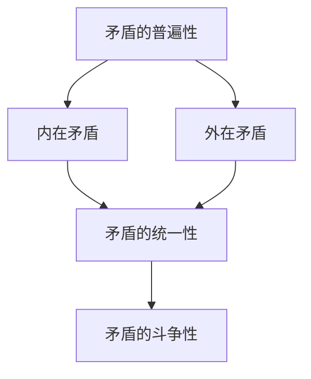
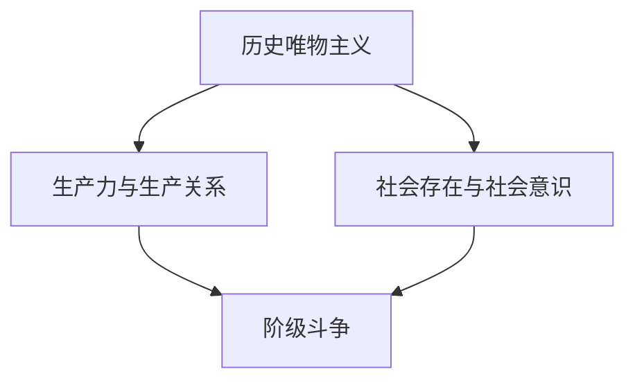

                 

### 文章标题：黑格尔与马克思：辩证法的不同应用

**关键词：** 黑格尔辩证法、马克思辩证法、绝对精神、历史唯物主义、社会矛盾、阶级斗争

**摘要：** 本文将深入探讨黑格尔与马克思的辩证法，分别介绍他们辩证法的基本原理和应用领域，比较两者在哲学和社会科学中的不同应用，以及他们辩证法在现实世界中的影响。通过这篇文章，读者可以更全面地理解黑格尔与马克思的哲学思想，以及他们的辩证法在现代社会中的重要意义。

---

## 第1章: 黑格尔的辩证法

### 1.1 黑格尔哲学的背景和理念

#### 1.1.1 黑格尔的生平和贡献

**黑格尔（1770-1831）** 是德国著名的哲学家，他的哲学体系被称为“黑格尔主义”。黑格尔的哲学思想对后世产生了深远的影响，尤其是在德国哲学、历史学、政治学、法学等领域。

黑格尔出生于今天德国南部的今天德国南部的符腾堡公国（Württemberg），他的父亲是一位律师。黑格尔早年接受了良好的教育，并展现出了卓越的学术天赋。1793年，他进入了蒂宾根神学院学习神学，但很快便对宗教哲学产生了浓厚的兴趣，并转向研究哲学。

黑格尔的主要贡献在于他的哲学体系，这一体系以其深刻的辩证法而著称。他试图通过辩证法来解释宇宙的本质和人类历史的发展。黑格尔的思想对19世纪后的西方哲学产生了深远的影响，被认为是现代哲学的奠基人之一。

#### 1.1.2 黑格尔哲学的核心概念

黑格尔哲学的核心概念包括**绝对精神**、**矛盾**和**辩证法**。这些概念构成了黑格尔哲学体系的基础。

**绝对精神**：黑格尔认为，世界万物都是绝对精神的体现。绝对精神是宇宙的本质和根源，它不断地自我发展、自我完善。在黑格尔看来，绝对精神是无所不在的，它贯穿于宇宙的每一个角落。

**矛盾**：黑格尔认为，矛盾是事物发展的根本动力。他认为，任何事物都包含着内在的矛盾，这些矛盾是事物发展的源泉。黑格尔的辩证法强调，通过矛盾的斗争和统一，事物能够实现自我发展和自我完善。

**辩证法**：黑格尔的辩证法是一种关于事物发展规律的哲学方法。他认为，辩证法是一种通过矛盾、对立、统一来解释事物发展规律的方法。黑格尔的辩证法不仅仅是一种哲学方法，它还是一种认识世界和解决问题的工具。

### 1.2 黑格尔辩证法的基本原理

黑格尔的辩证法包含以下几个基本原理：

#### 1.2.1 矛盾的普遍性

黑格尔认为，矛盾是事物发展的普遍规律。他认为，任何事物都包含着内在的矛盾，这些矛盾是事物发展的源泉。黑格尔的辩证法强调，矛盾不仅存在于个体事物中，也存在于整个宇宙中。

##### 1.2.1.1 内在矛盾

黑格尔认为，内在矛盾是事物发展的根本动力。他认为，任何事物都包含着内在的矛盾，这些矛盾是事物发展的源泉。例如，一个事物的存在和它的对立面是矛盾的，但这种矛盾推动了事物的发展和变化。

##### 1.2.1.2 外在矛盾

黑格尔还认为，外在矛盾也是事物发展的动力。他认为，事物与其外部环境之间的矛盾，推动了事物的变化和发展。例如，一个国家与其邻国之间的矛盾，推动了国家之间的战争和冲突，从而推动了历史的发展。

#### 1.2.2 对立统一规律

黑格尔的辩证法强调，矛盾不仅是对立的，也是统一的。他认为，任何矛盾都包含着对立和统一的两个方面。通过矛盾的斗争和统一，事物能够实现自我发展和自我完善。

##### 1.2.2.1 矛盾的统一性

黑格尔认为，矛盾的对立面并不是完全分离的，而是相互联系的。他认为，任何矛盾的对立面都包含着对方的因素，这种相互联系使得矛盾得以统一。

##### 1.2.2.2 矛盾的斗争性

黑格尔还认为，矛盾的对立面是相互斗争的。他认为，这种斗争是事物发展的动力。通过矛盾的斗争，事物能够克服自身的限制，实现自我发展和自我完善。

### 1.3 黑格尔辩证法的应用

黑格尔的辩证法广泛应用于哲学、历史学、政治学、法学等领域。

#### 1.3.1 在哲学中的应用

在哲学中，黑格尔的辩证法被用于解释知识、真理、存在等哲学概念。黑格尔认为，哲学的发展是通过不断的辩证运动来实现的。他试图通过辩证法来解释哲学问题的本质和规律。

##### 1.3.1.1 知识论

黑格尔的辩证法在知识论中的应用，主要体现在他对知识和真理的理解上。他认为，知识和真理是通过辩证运动来实现的。他认为，真理是不断发展的，它不是一成不变的。

##### 1.3.1.2 伦理学

黑格尔的辩证法在伦理学中的应用，主要体现在他对道德行为的理解上。他认为，道德行为是不断发展的，它不是一成不变的。他认为，道德行为的发展是通过辩证运动来实现的。

#### 1.3.2 在社会科学中的应用

在社会科学中，黑格尔的辩证法被用于解释社会现象、社会矛盾和社会发展。

##### 1.3.2.1 历史观

黑格尔的历史观认为，历史是绝对精神的自我发展过程。他认为，历史的发展是通过辩证运动来实现的。他试图通过辩证法来解释历史现象和历史规律。

##### 1.3.2.2 政治哲学

黑格尔的政治哲学认为，国家是绝对精神的体现。他认为，国家的本质是自由，国家的目的是实现人类的自由。他试图通过辩证法来解释国家的本质和国家的目的。

---

### 1.4 黑格尔辩证法的基本原理架构 Mermaid 流程图

以下是一个简单的 Mermaid 流程图，用于展示黑格尔辩证法的基本原理：

### 1.5 黑格尔辩证法在现实中的应用示例

**哲学领域：**

黑格尔的辩证法在哲学领域中的应用非常广泛。例如，黑格尔的辩证法被用于解释康德的哲学思想。康德的哲学强调理性与经验的关系，黑格尔则通过辩证法来解释这一关系。他认为，理性与经验是相互联系的，它们在辩证运动中相互发展。

**历史学领域：**

黑格尔的历史观认为，历史是绝对精神的自我发展过程。这一观点被广泛用于解释历史事件。例如，黑格尔认为，法国大革命是绝对精神的自我觉醒和自我发展的表现。通过辩证法，黑格尔试图解释历史事件的本质和意义。

**政治学领域：**

黑格尔的政治哲学认为，国家是绝对精神的体现。这一观点被用于解释国家的本质和国家的目的。例如，黑格尔认为，国家的目的是实现人类的自由。通过辩证法，黑格尔试图解释国家的本质和国家的功能。

---

### 1.6 小结

黑格尔的辩证法是一种深刻的哲学方法，它强调矛盾的普遍性、对立统一规律和矛盾的斗争性。通过辩证法，黑格尔试图解释宇宙的本质、人类历史的发展和哲学问题的本质。他的辩证法不仅在哲学领域有着广泛的应用，也在历史学、政治学等领域产生了深远的影响。

在下一章中，我们将探讨马克思的辩证法，分析他在哲学和社会科学中的应用。

## 第2章：马克思的辩证法

### 2.1 马克思哲学的背景和理念

#### 2.1.1 马克思的生平和贡献

卡尔·马克思（1818-1883）是19世纪德国著名的哲学家、经济学家和革命家，马克思主义的创始人之一。马克思生于德国莱茵省的特里尔，他的家庭背景和接受的教育为他日后的学术和革命事业奠定了坚实的基础。马克思的哲学思想深受黑格尔和费尔巴哈的影响，但他对黑格尔的辩证法和费尔巴哈的唯物主义进行了批判性的改造，创立了马克思主义哲学。

马克思的主要贡献包括《共产党宣言》（与恩格斯合著）、《资本论》和一系列关于政治经济学、哲学和社会主义理论的文章。他的著作深刻地揭示了资本主义社会的本质和矛盾，提出了无产阶级革命的理论基础，并对后来的社会主义运动产生了深远的影响。

#### 2.1.2 马克思哲学的核心概念

马克思哲学的核心概念包括物质生产方式、阶级斗争和历史唯物主义。

**物质生产方式**：马克思认为，物质生产方式是社会存在和发展的基础。生产方式包括生产力和生产关系，生产力是指人类在生产过程中运用的一切物质和技术力量，而生产关系则是指人们在生产过程中形成的相互关系和社会结构。马克思强调，物质生产方式是社会历史发展的决定性因素。

**阶级斗争**：马克思认为，阶级斗争是推动历史发展的主要动力。在资本主义社会中，不同阶级之间的利益冲突和斗争是不可避免的。马克思认为，无产阶级（工人阶级）是资本主义社会的掘墓人，他们将推翻资产阶级的统治，建立社会主义社会。

**历史唯物主义**：马克思的历史唯物主义认为，社会历史的发展是由物质生产方式决定的，而不是由人的意志或观念决定的。马克思认为，社会意识是物质生产方式的反映，社会存在决定社会意识。这一观点对理解社会历史发展的规律具有重要意义。

### 2.2 马克思辩证法的基本原理

马克思的辩证法是建立在他对物质生产方式和社会历史发展的理解基础上的。以下是马克思辩证法的基本原理：

#### 2.2.1 历史唯物主义

历史唯物主义是马克思辩证法的重要组成部分。它认为，物质生产方式是社会发展的决定性因素，社会意识是物质生产方式的反映。历史唯物主义强调，社会历史的发展是一个不断变化的辩证过程，社会形态的更替是由生产力和生产关系的矛盾运动推动的。

##### 2.2.1.1 生产力与生产关系

生产力是指人类在生产过程中运用的一切物质和技术力量，包括劳动力、生产工具和资源等。生产关系则是指人们在生产过程中形成的相互关系和社会结构，包括所有权关系、管理关系和分配关系等。马克思认为，生产力的发展是生产关系变革的推动力，当生产力发展到一定程度，生产关系变得不适合生产力的发展时，就会产生社会矛盾和阶级斗争。

##### 2.2.1.2 社会存在与社会意识

历史唯物主义强调，社会存在决定社会意识。社会存在是指人们的物质生产活动以及生产关系，而社会意识则是指人们的观念、意识、道德、法律、艺术等。马克思认为，社会意识是社会存在的反映，是社会存在的意识形态层面。社会存在的变化会导致社会意识的变化。

#### 2.2.2 阶级斗争与历史发展

马克思认为，阶级斗争是推动历史发展的主要动力。在资本主义社会中，不同阶级之间的利益冲突和斗争是不可避免的。马克思认为，无产阶级（工人阶级）是资本主义社会的掘墓人，他们将推翻资产阶级的统治，建立社会主义社会。

##### 2.2.2.1 阶级斗争的普遍性

马克思认为，阶级斗争存在于所有社会形态中，但资本主义社会的阶级斗争具有特别显著的特点。在资本主义社会中，资产阶级和无产阶级之间的矛盾是最主要的矛盾。资产阶级利用生产资料和生产关系来剥削无产阶级，导致无产阶级的贫困和压迫。

##### 2.2.2.2 阶级斗争的复杂性

马克思认为，阶级斗争不仅仅是经济利益上的冲突，还包括政治、文化、意识形态等多个方面。在资本主义社会中，资产阶级通过国家机器、法律、文化等手段来维护自己的统治地位，而无产阶级则需要通过组织、斗争和革命来争取自己的权益。

### 2.3 马克思辩证法的应用

马克思的辩证法广泛应用于经济学、政治学、社会学和历史学等领域。

#### 2.3.1 在经济学中的应用

马克思的辩证法在经济学中的应用主要体现在他对资本主义生产方式的分析上。马克思认为，资本主义生产方式是一个不断自我增殖的体系，它通过剥削工人的劳动力来获取剩余价值。马克思的《资本论》详细分析了资本主义生产方式的运行机制和内在矛盾。

##### 2.3.1.1 资本主义生产方式

马克思认为，资本主义生产方式的核心是资本积累和剥削劳动。资本家通过购买劳动力的方式，将工人的劳动力转化为商品，然后通过销售商品获取利润。这一过程中，工人创造的剩余价值被资本家占有，导致工人的贫困和剥削。

##### 2.3.1.2 资本主义社会矛盾

马克思认为，资本主义社会存在着内在的矛盾，包括资本和劳动的矛盾、生产和消费的矛盾、资本积累和工人贫困的矛盾等。这些矛盾导致了资本主义社会的周期性经济危机和社会动荡。

#### 2.3.2 在政治学中的应用

马克思的辩证法在政治学中的应用主要体现在他对国家和政治权力的分析上。马克思认为，国家是统治阶级维护其统治的工具，它具有阶级性。马克思主张，无产阶级必须通过革命手段推翻资产阶级的国家机器，建立无产阶级专政。

##### 2.3.2.1 社会主义革命

马克思认为，社会主义革命是无产阶级推翻资产阶级统治、建立无产阶级专政的过程。无产阶级必须通过武装斗争和群众运动，推翻资产阶级的国家机器，建立自己的政权。

##### 2.3.2.2 社会主义建设

马克思认为，社会主义建设是无产阶级专政下的国家建设过程。在社会主义社会中，国家必须通过计划经济和公有制等手段，消除资本主义社会的矛盾和剥削，实现生产力的解放和发展。

---

### 2.4 马克思辩证法的基本原理架构 Mermaid 流程图

以下是一个简单的 Mermaid 流程图，用于展示马克思辩证法的基本原理：

### 2.5 马克思辩证法在现实中的应用示例

**经济学领域：**

马克思的辩证法在经济学中的应用体现在他对资本主义生产方式的分析上。例如，马克思通过《资本论》详细分析了资本主义社会的内在矛盾，包括资本积累和工人剥削的矛盾、生产过剩和消费不足的矛盾等。这些分析有助于我们理解资本主义经济危机的根源。

**政治学领域：**

马克思的辩证法在政治学中的应用体现在他对国家和政治权力的分析上。例如，马克思认为，国家是统治阶级维护其统治的工具，它具有阶级性。这一观点有助于我们理解不同国家政治制度的本质和运作机制。

**历史学领域：**

马克思的辩证法在历史学中的应用体现在他对历史发展的分析上。例如，马克思认为，社会历史的发展是由生产力决定的，社会形态的更替是由生产力和生产关系的矛盾运动推动的。这一观点有助于我们理解历史发展的规律和趋势。

---

### 2.6 小结

马克思的辩证法是一种深刻的哲学方法，它强调物质生产方式、阶级斗争和历史唯物主义的重要性。马克思通过辩证法揭示了资本主义社会的本质和矛盾，提出了无产阶级革命的理论基础。他的辩证法不仅在经济学、政治学和历史学领域有着广泛的应用，也在现实世界中产生了深远的影响。

在下一章中，我们将比较黑格尔和马克思的辩证法，分析两者在基本理念和实际应用上的异同。

## 第3章：黑格尔与马克思辩证法的比较

### 3.1 基本理念比较

#### 3.1.1 黑格尔的绝对精神和马克思的阶级斗争

黑格尔的辩证法和马克思的辩证法在基本理念上有显著的差异。黑格尔的辩证法以绝对精神为核心概念，强调世界的本质是自我发展的精神。黑格尔认为，绝对精神是宇宙的根源和目标，它通过辩证运动实现自我发展和自我完善。

相比之下，马克思的辩证法则以阶级斗争和历史唯物主义为核心概念。马克思认为，物质生产方式是社会发展的决定性因素，阶级斗争是推动历史发展的主要动力。马克思关注的是现实社会中不同阶级之间的利益冲突和斗争，他认为，无产阶级通过革命斗争可以推翻资产阶级的统治，实现社会主义革命。

#### 3.1.2 黑格尔的辩证法和马克思的历史唯物主义

黑格尔的辩证法是一种关于事物发展规律的哲学方法，它强调矛盾、对立和统一的辩证运动。黑格尔的辩证法不仅应用于哲学，也广泛应用于历史学、政治学和社会科学等领域。

马克思的历史唯物主义则是一种关于社会历史发展的理论，它认为社会历史的发展是由物质生产方式决定的。马克思的历史唯物主义强调，社会存在决定社会意识，生产力的发展推动生产关系的变革，社会形态的更替是由生产力和生产关系的矛盾运动推动的。

### 3.2 应用领域比较

#### 3.2.1 哲学领域的应用

在哲学领域，黑格尔的辩证法被广泛应用于知识论、伦理学和存在论等哲学分支。黑格尔的辩证法强调，知识是通过辩证运动来实现的，真理是不断发展的。在伦理学领域，黑格尔的辩证法强调道德行为的发展和完善，他认为道德行为是不断发展的，不是一成不变的。

马克思的辩证法则在哲学领域中的应用主要体现在他对认识论和历史观的贡献上。马克思认为，认识是通过实践来实现的，真理是人们对客观世界的反映。在历史观方面，马克思认为，社会历史的发展是由物质生产方式决定的，社会意识是物质生产方式的反映。

#### 3.2.2 社会科学领域的应用

在社会科学领域，黑格尔的辩证法被广泛应用于历史学、政治学和社会学等领域。黑格尔的历史观认为，历史是绝对精神的自我发展过程，历史的发展是通过辩证运动来实现的。黑格尔的政治哲学强调，国家的本质是自由，国家的目的是实现人类的自由。

马克思的辩证法则在社会科学领域中的应用更加具体和实际。马克思的辩证法被广泛应用于经济学、政治学和历史学等领域。在经济学中，马克思通过辩证法分析了资本主义生产方式的内在矛盾，揭示了资本主义社会的剥削和贫富差距。在政治学和历史学中，马克思的辩证法被用于分析阶级斗争和社会革命。

### 3.3 比较与评价

黑格尔和马克思的辩证法在基本理念和应用领域上存在显著差异，但它们也有共同点。

**共同点：**

1. **辩证思维：** 两者都强调辩证思维的重要性，认为事物的发展是通过矛盾、对立和统一的辩证运动来实现的。
2. **现实关怀：** 两者都关注现实社会问题，试图通过哲学方法来揭示社会历史发展的规律。
3. **理论贡献：** 两者都对后世的哲学和社会科学产生了深远的影响，为理论研究和实践提供了重要的理论工具。

**不同点：**

1. **核心概念：** 黑格尔的辩证法以绝对精神为核心，而马克思的辩证法以阶级斗争和历史唯物主义为核心。
2. **应用领域：** 黑格尔的辩证法广泛应用于哲学、历史学和政治学等领域，而马克思的辩证法则更专注于经济学、政治学和历史学等领域。
3. **现实关怀：** 黑格尔的辩证法更注重抽象的哲学思考，而马克思的辩证法则更关注现实社会的阶级斗争和革命实践。

**评价：**

黑格尔和马克思的辩证法都是哲学发展的重要里程碑，它们各有优缺点。黑格尔的辩证法以其深刻的哲学思考和对历史发展的洞见而著称，但它也存在一些抽象和难以实践的问题。马克思的辩证法则以其对现实社会的深刻分析和革命实践而闻名，但它也存在理论上的局限，例如对历史发展的机械论解释。

总的来说，黑格尔和马克思的辩证法都是哲学和社会科学领域的重要理论工具，它们为我们理解和解决现实社会问题提供了有益的启示。

### 3.4 小结

黑格尔与马克思的辩证法在基本理念和应用领域上存在显著的差异。黑格尔的辩证法以绝对精神为核心，强调世界的自我发展，而马克思的辩证法则以阶级斗争和历史唯物主义为核心，关注现实社会的阶级斗争和革命实践。尽管两者存在差异，但它们都为哲学和社会科学的发展做出了重要贡献。通过比较黑格尔与马克思的辩证法，我们可以更全面地理解辩证法在哲学和社会科学中的应用，以及它们在现实世界中的重要意义。

## 第4章：黑格尔与马克思辩证法在现实中的应用

### 4.1 黑格尔辩证法在现实中的应用

黑格尔的辩证法在现实社会中有着广泛的应用，尤其在哲学、历史学和政治学等领域。

#### 4.1.1 哲学领域

在哲学领域，黑格尔的辩证法为理解知识和真理的本质提供了深刻的洞见。例如，黑格尔的辩证法被应用于解释康德的哲学思想，康德认为，知识是通过感性、理性和纯粹理性三个阶段来实现的。黑格尔通过辩证法分析了这一过程，认为知识是通过不断的辩证运动来实现的，从感性认识到理性认识，再到纯粹理性认识。

黑格尔的辩证法也影响了现代哲学的发展。例如，海德格尔和萨特等哲学家都在其哲学体系中借鉴了黑格尔的辩证法。海德格尔通过辩证法分析了存在和存在者之间的关系，而萨特则通过辩证法探讨了自由和存在的本质。

#### 4.1.2 历史学领域

在历史学领域，黑格尔的辩证法被广泛应用于分析历史事件和解释历史发展规律。黑格尔的历史观认为，历史是绝对精神的自我发展过程，历史的发展是通过辩证运动来实现的。

黑格尔的辩证法被应用于解释法国大革命、美国独立战争等历史事件。例如，黑格尔认为，法国大革命是绝对精神对封建制度的反抗，是绝对精神的自我觉醒和自我发展的表现。通过辩证法，黑格尔试图解释这些历史事件的本质和意义。

#### 4.1.3 政治学领域

在政治学领域，黑格尔的辩证法为理解国家和政治权力的本质提供了深刻的洞见。黑格尔的政治哲学认为，国家的本质是自由，国家的目的是实现人类的自由。

黑格尔的辩证法被应用于分析现代政治制度，例如民主制度、独裁制度和社会主义制度等。通过辩证法，黑格尔试图解释这些政治制度的本质和运作机制。例如，黑格尔认为，民主制度是实现自由的最好形式，但在现实社会中，民主制度往往受到阶级利益和权力斗争的制约。

### 4.2 马克思辩证法在现实中的应用

马克思的辩证法在现实社会中也有着广泛的应用，尤其在经济学、政治学和历史学等领域。

#### 4.2.1 经济学领域

在经济学领域，马克思的辩证法被广泛应用于分析资本主义生产方式的内在矛盾。马克思认为，资本主义生产方式的本质是资本积累和剥削劳动，这一过程中产生了资本和劳动之间的矛盾。

马克思的辩证法被应用于解释资本主义经济危机，例如1929年的经济大萧条。马克思认为，资本主义经济危机是由于资本积累和劳动剥削之间的矛盾导致的，这种矛盾最终会引发社会动荡和经济崩溃。

#### 4.2.2 政治学领域

在政治学领域，马克思的辩证法被广泛应用于分析阶级斗争和无产阶级革命。马克思认为，阶级斗争是推动历史发展的主要动力，无产阶级通过革命斗争可以推翻资产阶级的统治，建立社会主义社会。

马克思的辩证法被应用于解释现代政治制度，例如社会主义国家和资本主义国家。马克思认为，社会主义国家是建立在无产阶级专政基础上的，它通过计划经济和公有制等手段，消除资本主义社会的剥削和贫富差距。

#### 4.2.3 历史学领域

在历史学领域，马克思的辩证法被广泛应用于分析社会历史的发展规律。马克思认为，社会历史的发展是由物质生产方式决定的，社会形态的更替是由生产力和生产关系的矛盾运动推动的。

马克思的辩证法被应用于解释历史事件，例如工业革命、殖民主义和帝国主义等。马克思认为，这些历史事件是资本主义生产方式发展的必然结果，它们揭示了资本主义社会的本质和矛盾。

### 4.3 黑格尔与马克思辩证法的比较与评价

黑格尔与马克思的辩证法在现实社会中的应用各有特色。

黑格尔的辩证法更注重抽象的哲学思考，它为理解和解释知识和真理的本质提供了深刻的洞见。黑格尔的辩证法也被广泛应用于历史学和政治学领域，为解释历史事件和政治现象提供了理论框架。

马克思的辩证法则更注重现实社会的分析和革命实践，它为理解资本主义生产方式的内在矛盾和阶级斗争提供了理论工具。马克思的辩证法在经济学、政治学和历史学等领域有着广泛的应用，为解释现代社会的矛盾和发展趋势提供了理论支持。

总的来说，黑格尔与马克思的辩证法在现实社会中的应用各有优劣。黑格尔的辩证法以其深刻的哲学思考和抽象能力而著称，而马克思的辩证法则以其现实关怀和革命实践而闻名。通过比较两者的辩证法，我们可以更全面地理解辩证法在现实社会中的重要意义。

### 4.4 小结

黑格尔与马克思的辩证法在现实社会中有着广泛的应用，分别在哲学、历史学、政治学、经济学等领域产生了深远的影响。黑格尔的辩证法以其抽象的哲学思考和对历史发展的洞见而著称，而马克思的辩证法则以其对现实社会的分析和革命实践而闻名。通过比较两者的辩证法，我们可以更全面地理解辩证法在现实社会中的重要性和应用价值。

## 第5章：黑格尔与马克思辩证法的哲学意义

### 5.1 黑格尔辩证法的哲学意义

黑格尔的辩证法在哲学史上具有重要的地位，它不仅对19世纪的哲学发展产生了深远的影响，也对后世的哲学思考提供了丰富的理论资源。

#### 5.1.1 对哲学体系的贡献

黑格尔的辩证法对哲学体系的贡献体现在他对知识和真理的理解上。黑格尔认为，知识和真理是通过辩证运动来实现的，这种辩证运动不仅存在于个体的思维过程中，也存在于整个宇宙的发展中。黑格尔的辩证法强调，知识的发展是一个不断超越自我的过程，真理是一个不断发展的过程，而不是静态的、一成不变的。

在黑格尔的哲学体系中，辩证法是一种核心的方法论工具。通过辩证法，黑格尔试图解决哲学上的诸多难题，如存在与本质的关系、自由与必然的关系等。黑格尔的辩证法不仅是一种哲学方法，它还是一种认识世界和解决问题的工具。

#### 5.1.2 对后续哲学发展的影响

黑格尔的辩证法对后续哲学发展产生了深远的影响。例如，海德格尔和萨特等哲学家都在其哲学体系中借鉴了黑格尔的辩证法。海德格尔通过辩证法分析了存在和存在者之间的关系，提出了“存在”这一核心概念。萨特则通过辩证法探讨了自由和存在的本质，提出了“存在先于本质”的观点。

此外，黑格尔的辩证法也对马克思主义哲学产生了重要影响。马克思和恩格斯在《德意志意识形态》中批判了黑格尔的辩证法，但他们也承认黑格尔的辩证法对他们的哲学思考产生了重要影响。马克思的辩证法在某种程度上是对黑格尔辩证法的批判性改造，它强调物质生产方式和社会历史的决定作用。

#### 5.1.3 黑格尔主义和黑格尔主义的变体

黑格尔的辩证法不仅直接影响了19世纪的哲学，还产生了多种变体和流派。黑格尔主义是指以黑格尔的哲学思想为基础的哲学流派，它强调辩证思维和绝对精神的重要性。黑格尔主义在德国哲学界产生了广泛的影响，包括施莱尔马赫、费尔巴哈、朗格等哲学家。

此外，黑格尔的辩证法也产生了多种变体，如存在主义、现象学、批判理论等。这些变体都在不同程度上继承了黑格尔的辩证法，并在此基础上进行了创新和发展。

### 5.2 马克思辩证法的哲学意义

马克思的辩证法在哲学史上具有重要的地位，它是马克思主义哲学的核心部分，对现代社会和哲学发展产生了深远的影响。

#### 5.2.1 对马克思主义哲学的贡献

马克思的辩证法对马克思主义哲学的贡献体现在他对社会历史发展的理解和解释上。马克思认为，社会历史的发展是由物质生产方式决定的，阶级斗争是推动历史发展的主要动力。马克思的辩证法强调，社会历史的发展是一个不断变革的过程，不同社会形态的更替是由生产力和生产关系的矛盾运动推动的。

马克思的辩证法还强调，社会意识是社会存在的反映，社会存在决定社会意识。这一观点对理解社会历史的发展规律和现实社会问题具有重要意义。

#### 5.2.2 对马克思主义哲学发展的影响

马克思的辩证法对马克思主义哲学的发展产生了深远的影响。马克思和恩格斯在《德意志意识形态》中批判了黑格尔的辩证法，但他们也承认黑格尔的辩证法对他们的哲学思考产生了重要影响。马克思的辩证法在某种程度上是对黑格尔辩证法的批判性改造，它强调物质生产方式和社会历史的决定作用。

在马克思主义哲学的发展过程中，列宁、毛泽东等马克思主义者对马克思的辩证法进行了进一步的发展。列宁在《哲学笔记》中阐述了辩证唯物主义和历史唯物主义的基本原理，毛泽东则在《矛盾论》中深入分析了辩证法的基本规律。

#### 5.2.3 马克思主义哲学的当代发展

马克思的辩证法在当代哲学界仍然具有广泛的影响力。当代哲学家如拉克劳和墨菲等人在其著作中借鉴了马克思的辩证法，对当代社会进行了批判性分析。拉克劳和墨菲提出了“霸权与反抗”的理论，认为社会历史的发展是由霸权力量和反抗力量的斗争推动的。

此外，马克思的辩证法也被应用于当代社会科学领域，如经济学、政治学和社会学等。例如，对资本主义经济危机的分析、对全球化和帝国主义的批判等，都借鉴了马克思的辩证法。

### 5.3 小结

黑格尔与马克思的辩证法在哲学史上具有重要的意义。黑格尔的辩证法以其深刻的哲学思考和抽象能力而著称，它不仅对19世纪的哲学发展产生了深远的影响，也对后世的哲学思考提供了丰富的理论资源。马克思的辩证法则以其对现实社会的深刻分析和革命实践而闻名，它对现代社会和哲学发展产生了深远的影响。

通过深入探讨黑格尔与马克思的辩证法，我们可以更全面地理解辩证法在哲学中的重要性，以及它们对现代社会和哲学发展的贡献。辩证法不仅是哲学思考的工具，它还是理解现实世界和解决现实问题的理论资源。

## 第6章：黑格尔与马克思辩证法的比较与评价

### 6.1 优点和局限

黑格尔与马克思的辩证法各有其独特的优点和局限。

#### 6.1.1 黑格尔辩证法的优点和局限

**优点：**

1. **深刻的哲学思考：** 黑格尔的辩证法以其深刻的哲学思考和对知识的理解而著称。它提供了一种理解世界和解决哲学难题的方法，如存在与本质的关系、自由与必然的关系等。
2. **广泛的适用性：** 黑格尔的辩证法不仅在哲学领域有广泛应用，还在历史学、政治学和社会科学等领域产生了深远的影响。
3. **抽象的理论框架：** 黑格尔的辩证法为建立哲学体系提供了抽象的理论框架，使人们能够从宏观角度理解世界和历史的演变。

**局限：**

1. **抽象与现实的脱节：** 黑格尔的辩证法过于抽象，有时难以直接应用于现实社会问题，导致理论上的理想与现实社会存在一定的脱节。
2. **难以实践：** 黑格尔的辩证法强调绝对精神的发展，但在现实社会中，如何实现这一目标仍然存在争议和挑战。

#### 6.1.2 马克思辩证法的优点和局限

**优点：**

1. **现实关怀：** 马克思的辩证法强调对现实社会的关注，尤其是对阶级斗争和无产阶级革命的探讨，提供了理解社会历史发展的理论工具。
2. **革命实践性：** 马克思的辩证法具有强烈的革命实践性，它鼓励人们通过阶级斗争和革命实践来改变社会现实。
3. **对资本主义的分析：** 马克思的辩证法对资本主义生产方式的内在矛盾和剥削进行了深刻的分析，为理解资本主义社会的本质提供了理论支持。

**局限：**

1. **历史唯物主义的机械论解释：** 马克思的历史唯物主义有时被认为是一种机械论的解释，忽略了人类主观能动性和复杂的社会现象。
2. **对社会主义建设的现实局限：** 马克思的辩证法在社会主义建设中遇到了现实挑战，如如何实现社会主义的可持续发展和消除社会矛盾等问题。

### 6.2 哲学意义与时代价值

黑格尔与马克思的辩证法在哲学意义上具有深远的时代价值。

**黑格尔辩证法的时代价值：**

1. **哲学方法论：** 黑格尔的辩证法为哲学方法论提供了新的视角，强调了辩证思维的重要性，对后来的哲学家产生了深远的影响。
2. **历史观：** 黑格尔的历史观为理解历史发展提供了理论框架，强调了历史是绝对精神的自我发展过程。
3. **政治哲学：** 黑格尔的政治哲学为理解国家和政治权力的本质提供了深刻的洞见，对现代政治理论的发展产生了影响。

**马克思辩证法的时代价值：**

1. **社会理论：** 马克思的辩证法为理解社会历史发展提供了理论工具，强调了阶级斗争和社会变革的重要性。
2. **经济学分析：** 马克思的辩证法对资本主义经济危机和剥削现象进行了深刻的分析，为理解资本主义社会的本质提供了理论支持。
3. **革命实践：** 马克思的辩证法鼓励人们通过革命实践来改变社会现实，对社会主义运动和国际共产主义运动产生了深远的影响。

### 6.3 比较与总结

黑格尔与马克思的辩证法在哲学上具有不同的优点和局限，但它们都是哲学发展的重要里程碑。

**相同点：**

1. **辩证思维：** 两者都强调辩证思维的重要性，认为事物的发展是通过矛盾、对立和统一的辩证运动来实现的。
2. **现实关怀：** 两者都关注现实社会问题，试图通过哲学方法来揭示社会历史发展的规律。
3. **理论贡献：** 两者都对后世的哲学和社会科学产生了深远的影响，为理论研究和实践提供了重要的理论工具。

**不同点：**

1. **核心概念：** 黑格尔的辩证法以绝对精神为核心，而马克思的辩证法则以阶级斗争和历史唯物主义为核心。
2. **应用领域：** 黑格尔的辩证法广泛应用于哲学、历史学和政治学等领域，而马克思的辩证法则更专注于经济学、政治学和历史学等领域。
3. **现实关怀：** 黑格尔的辩证法更注重抽象的哲学思考，而马克思的辩证法则更关注现实社会的阶级斗争和革命实践。

**总结：**

黑格尔与马克思的辩证法在哲学史上具有重要的地位，它们各有其独特的优点和局限，但在理解和解释现实世界方面都提供了宝贵的理论资源。通过比较两者的辩证法，我们可以更全面地理解辩证法在哲学中的重要性，以及它们对现代社会和哲学发展的贡献。

### 6.4 小结

黑格尔与马克思的辩证法在哲学上具有深远的意义，它们各自代表了不同的哲学传统和现实关怀。黑格尔的辩证法以其深刻的哲学思考和抽象能力而著称，而马克思的辩证法则以其对现实社会的深刻分析和革命实践而闻名。通过深入比较和分析，我们可以更全面地理解辩证法在哲学中的重要性，以及它们在现代社会中的实际应用价值。这一比较不仅有助于我们理解两者的哲学思想，也为我们在现实世界中应用辩证法提供了有益的启示。

