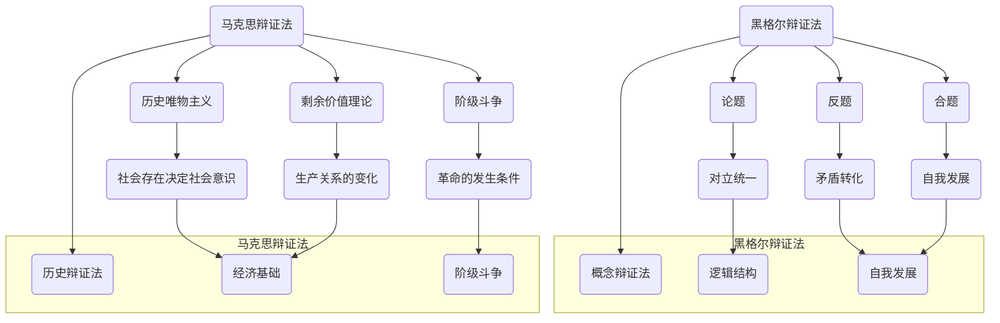

                 


# 黑格尔与马克思：辩证法的观念论与唯物论转向

## 关键词

- 黑格尔
- 马克思
- 辩证法
- 概念论
- 唯物论
- 历史唯物主义
- 阶级斗争

## 摘要

本文旨在探讨黑格尔与马克思在哲学领域中的辩证法观念，分别从观念论和唯物论两个角度进行分析。首先，我们回顾黑格尔的辩证法观念论，了解其哲学背景、核心思想和历史地位。接着，深入分析马克思的唯物论转向，探讨其哲学起源、核心观点和历史意义。最后，我们比较黑格尔与马克思辩证法的异同，探讨它们在现代哲学中的融合趋势和影响。本文旨在为读者提供一次系统性的哲学思考之旅，探讨辩证法观念在现代社会中的深刻意义。

## 目录大纲

### 第一部分：黑格尔的辩证法观念论

#### 第1章：黑格尔哲学的背景与核心思想

##### 1.1 黑格尔哲学的历史背景

##### 1.2 黑格尔的核心哲学概念

##### 1.3 黑格尔辩证法的核心思想

#### 第2章：黑格尔辩证法的逻辑结构与原理

##### 2.1 黑格尔辩证法的三大环节

##### 2.2 黑格尔辩证法的矛盾观

##### 2.3 黑格尔辩证法的发展观

#### 第3章：黑格尔辩证法在哲学史上的地位与影响

##### 3.1 黑格尔辩证法对西方哲学的影响

##### 3.2 黑格尔辩证法在现代哲学中的应用

##### 3.3 黑格尔辩证法的批判与反思

### 第二部分：马克思的唯物论转向

#### 第4章：马克思哲学的起源与发展

##### 4.1 马克思哲学的理论背景

##### 4.2 马克思哲学的核心观点

##### 4.3 马克思哲学的发展历程

#### 第5章：马克思的唯物史观

##### 5.1 唯物史观的基本原理

##### 5.2 唯物史观的历史意义

##### 5.3 唯物史观对现代社会的启示

#### 第6章：马克思的阶级斗争理论

##### 6.1 阶级斗争理论的基本概念

##### 6.2 阶级斗争理论的历史意义

##### 6.3 阶级斗争理论在当代的反思

### 第三部分：黑格尔与马克思辩证法的比较与融合

#### 第7章：黑格尔与马克思辩证法的异同

##### 7.1 黑格尔辩证法与马克思辩证法的区别

##### 7.2 黑格尔辩证法与马克思辩证法的联系

##### 7.3 黑格尔与马克思辩证法的融合趋势

#### 第8章：现代哲学中的黑格尔与马克思辩证法

##### 8.1 现代哲学对黑格尔与马克思辩证法的解读

##### 8.2 黑格尔与马克思辩证法在现代哲学中的应用

##### 8.3 黑格尔与马克思辩证法对现代哲学的启示

### 结束语

#### 黑格尔与马克思辩证法在现代社会的意义

#### 作者信息

作者：AI天才研究院/AI Genius Institute & 禅与计算机程序设计艺术 /Zen And The Art of Computer Programming

## 第一部分：黑格尔的辩证法观念论

### 第1章：黑格尔哲学的背景与核心思想

#### 1.1 黑格尔哲学的历史背景

黑格尔（Georg Wilhelm Friedrich Hegel，1770-1831）是19世纪初德国著名的哲学家，他的哲学体系被称为“黑格尔主义”。黑格尔哲学的兴起与当时欧洲社会的政治、经济和文化背景密切相关。18世纪末至19世纪初，欧洲经历了启蒙运动和法国大革命，人们开始对传统观念进行质疑和反思。黑格尔正是在这样的时代背景下，通过对哲学、历史、政治和艺术的深入探讨，提出了自己独特的哲学观念。

黑格尔哲学的主要特征包括：辩证法、绝对精神、理性主义和历史主义。黑格尔认为，世界的本质是理性的发展过程，历史是理性自我意识的发展过程。黑格尔的哲学体系以其庞大的思想架构和深刻的哲学见解，对后世哲学产生了深远的影响。

#### 1.2 黑格尔的核心哲学概念

黑格尔的核心哲学概念包括：绝对精神、自我意识、辩证法和历史。这些概念相互关联，构成了黑格尔哲学的基本框架。

- **绝对精神**：黑格尔认为，绝对精神是宇宙的最高原则，它是世界发展的内在动力。绝对精神通过自我发展的过程，实现了自己的自我意识，并最终达到了自我完善。

- **自我意识**：自我意识是绝对精神的自我认识，是绝对精神的内在反映。自我意识通过认识世界，实现了自我完善。

- **辩证法**：黑格尔的辩证法是一种哲学方法，通过矛盾的统一和转化，揭示事物的本质和内在规律。辩证法是黑格尔哲学的核心，贯穿于他的整个哲学体系。

- **历史**：历史是绝对精神自我发展的过程，是理性发展的体现。黑格尔认为，历史是理性自我意识的发展过程，是人类社会不断进步的表现。

#### 1.3 黑格尔辩证法的核心思想

黑格尔的辩证法是一种哲学方法，通过矛盾的统一和转化，揭示事物的本质和内在规律。黑格尔辩证法的核心思想包括：

- **对立统一**：黑格尔认为，对立是事物发展的动力，对立双方相互依存、相互转化。通过对立统一，事物实现了从低级到高级的发展。

- **矛盾转化**：黑格尔认为，矛盾是事物发展的内在动力，矛盾双方在一定条件下可以实现转化。矛盾转化是事物发展的关键，推动了事物从一种状态向另一种状态的转变。

- **自我发展**：黑格尔认为，事物的本质是自我发展，事物通过自我发展，实现了自身的完善。自我发展是事物发展的根本规律。

### 第2章：黑格尔辩证法的逻辑结构与原理

#### 2.1 黑格尔辩证法的三大环节

黑格尔的辩证法包括三个环节：论题、反题和合题。这三个环节相互关联，构成了辩证法的完整过程。

- **论题**：论题是辩证法的起点，它代表着事物的表面现象和矛盾的初步显现。论题揭示了事物的对立面，是辩证法的初始阶段。

- **反题**：反题是对论题的否定，它通过对立面的转化，揭示了事物的另一面。反题是辩证法的转折点，通过对立面的转化，推动了事物的发展。

- **合题**：合题是论题和反题的统一，它通过对立面的转化和统一，揭示了事物的本质。合题是辩证法的终点，通过矛盾的统一，实现了事物的发展和完善。

#### 2.2 黑格尔辩证法的矛盾观

黑格尔认为，矛盾是事物发展的内在动力，矛盾双方相互依存、相互转化。黑格尔的矛盾观包括以下几个方面：

- **对立性**：黑格尔认为，事物内部存在着对立面，这些对立面相互依存、相互制约。对立性是辩证法的核心，是事物发展的动力。

- **同一性**：黑格尔认为，对立面是同一性的不同表现，对立面在一定条件下可以实现转化。同一性是辩证法的内在规律，是事物发展的根本原因。

- **发展性**：黑格尔认为，矛盾是事物发展的内在动力，矛盾双方通过相互转化，推动了事物的发展。发展性是辩证法的本质，是事物发展的必然趋势。

#### 2.3 黑格尔辩证法的发展观

黑格尔的辩证法是一种发展观，它揭示了事物的发展规律。黑格尔认为，事物的发展是通过矛盾的统一和转化实现的。具体来说，黑格尔的发展观包括以下几个方面：

- **量变到质变**：黑格尔认为，事物的发展是从量变到质变的过程。量变是事物发展的初级阶段，质变是事物发展的关键阶段。通过量变和质变的交替，事物实现了自身的发展和完善。

- **内在动力**：黑格尔认为，事物的发展是由其内在矛盾推动的。内在矛盾是事物发展的根本动力，是事物发展的源泉。

- **历史过程**：黑格尔认为，事物的发展是一个历史过程，是理性自我发展的过程。历史过程是辩证法的具体体现，是事物发展的必然趋势。

### 第3章：黑格尔辩证法在哲学史上的地位与影响

#### 3.1 黑格尔辩证法对西方哲学的影响

黑格尔的辩证法对西方哲学产生了深远的影响。首先，黑格尔的辩证法为后来的哲学家提供了新的哲学方法，如尼采、海德格尔等。其次，黑格尔的辩证法对马克思主义哲学产生了重要影响，马克思和恩格斯在黑格尔辩证法的基础上，发展了历史唯物主义。此外，黑格尔的辩证法对现代哲学产生了重要启示，如逻辑实证主义、存在主义等。

#### 3.2 黑格尔辩证法在现代哲学中的应用

黑格尔的辩证法在现代哲学中得到了广泛的应用。例如，逻辑实证主义运用黑格尔的辩证法来探讨科学知识的发展过程；存在主义运用黑格尔的辩证法来探讨人的存在本质；分析哲学运用黑格尔的辩证法来分析语言和逻辑关系。黑格尔的辩证法为现代哲学提供了一种新的思维方式和哲学方法。

#### 3.3 黑格尔辩证法的批判与反思

黑格尔的辩证法虽然对哲学产生了重要影响，但也受到了一定的批判和反思。首先，一些哲学家认为黑格尔的辩证法过于抽象，缺乏具体的应用价值。其次，一些哲学家认为黑格尔的辩证法忽略了事物的具体现实，过于强调理性。此外，黑格尔的辩证法也受到了结构主义和后结构主义的批判，认为其过于重视逻辑结构，忽视了社会和文化因素。

## 第二部分：马克思的唯物论转向

### 第4章：马克思哲学的起源与发展

#### 4.1 马克思哲学的理论背景

马克思（Karl Marx，1818-1883）哲学的起源与发展与19世纪欧洲的社会政治环境密切相关。当时，欧洲正经历着工业革命，资本主义生产关系迅速发展，社会矛盾日益激化。马克思在深入分析资本主义社会的基础上，提出了自己的哲学观点。

马克思哲学的理论背景包括：

- **历史唯物主义**：马克思认为，社会存在决定社会意识，社会的发展是由物质生产力的发展决定的。历史唯物主义是马克思哲学的核心。

- **剩余价值理论**：马克思提出了剩余价值理论，揭示了资本主义生产关系的本质，为无产阶级革命提供了理论基础。

- **阶级斗争**：马克思认为，阶级斗争是推动社会历史发展的根本动力。阶级斗争是马克思主义哲学的重要观点。

#### 4.2 马克思哲学的核心观点

马克思哲学的核心观点包括：

- **历史唯物主义**：马克思认为，社会存在决定社会意识，社会的发展是由物质生产力的发展决定的。历史唯物主义是马克思哲学的核心。

- **剩余价值理论**：马克思提出了剩余价值理论，揭示了资本主义生产关系的本质，为无产阶级革命提供了理论基础。

- **阶级斗争**：马克思认为，阶级斗争是推动社会历史发展的根本动力。阶级斗争是马克思主义哲学的重要观点。

- **共产主义**：马克思主张通过无产阶级革命，推翻资本主义制度，实现共产主义社会。共产主义是马克思哲学的最终目标。

#### 4.3 马克思哲学的发展历程

马克思哲学的发展历程可以分为以下几个阶段：

- **早期哲学**：马克思在青年时期受到黑格尔哲学的影响，开始探讨哲学问题。这一时期的代表作有《巴黎笔记》和《1844年经济学哲学手稿》。

- **中期哲学**：马克思在《德意志意识形态》和《共产党宣言》中，提出了历史唯物主义和阶级斗争的理论。这一时期的哲学思想为马克思主义哲学的形成奠定了基础。

- **晚期哲学**：马克思在《资本论》中，深入探讨了资本主义生产关系的本质，发展了剩余价值理论和历史唯物主义。这一时期的哲学思想标志着马克思主义哲学的成熟。

### 第5章：马克思的唯物史观

#### 5.1 唯物史观的基本原理

唯物史观是马克思哲学的核心观点，其基本原理包括：

- **社会存在决定社会意识**：马克思认为，社会存在决定社会意识，人们的思想观念是由他们的物质生活条件决定的。

- **物质生产力的发展**：马克思认为，社会的发展是由物质生产力的发展决定的。物质生产力的发展推动了生产关系和社会制度的变革。

- **阶级斗争**：马克思认为，阶级斗争是推动社会历史发展的根本动力。阶级斗争是历史发展的动力，是推动社会变革的重要力量。

#### 5.2 唯物史观的历史意义

唯物史观对历史学、政治学和社会学产生了深远的影响，其历史意义包括：

- **为历史研究提供了新的方法论**：唯物史观强调社会存在决定社会意识，为历史研究提供了新的方法论，推动了历史学的进步。

- **揭示了社会发展的规律**：唯物史观揭示了社会发展的规律，为人们认识社会历史提供了科学依据。

- **推动了社会变革**：唯物史观为无产阶级革命提供了理论基础，推动了社会变革的实践。

#### 5.3 唯物史观对现代社会的启示

唯物史观对现代社会的发展具有深刻的启示，其启示包括：

- **重视社会生产力的发展**：唯物史观强调社会生产力的发展对社会历史的重要性，启示我们重视科技和教育的发展。

- **关注社会公平和正义**：唯物史观揭示了阶级斗争的规律，启示我们关注社会公平和正义，推动社会进步。

- **促进社会和谐**：唯物史观强调社会存在决定社会意识，启示我们通过改变社会存在，促进社会和谐。

### 第6章：马克思的阶级斗争理论

#### 6.1 阶级斗争理论的基本概念

马克思的阶级斗争理论是马克思主义哲学的重要组成部分，其基本概念包括：

- **阶级**：马克思认为，阶级是人们在生产关系中的不同地位和利益的群体。阶级是社会历史发展的基本单位。

- **阶级斗争**：马克思认为，阶级斗争是推动社会历史发展的根本动力。阶级斗争是阶级之间为了自身利益而进行的斗争。

- **革命**：马克思认为，阶级斗争发展到一定程度，必然导致革命。革命是阶级斗争的最高形式，是推动社会变革的重要手段。

#### 6.2 阶级斗争理论的历史意义

阶级斗争理论对历史学、政治学和社会学产生了深远的影响，其历史意义包括：

- **揭示了社会发展的规律**：阶级斗争理论揭示了社会发展的规律，为人们认识社会历史提供了科学依据。

- **推动了社会变革**：阶级斗争理论为无产阶级革命提供了理论基础，推动了社会变革的实践。

- **影响了国际共产主义运动**：阶级斗争理论影响了国际共产主义运动，为世界范围内的无产阶级斗争提供了指导。

#### 6.3 阶级斗争理论在当代的反思

在当代，阶级斗争理论面临着一系列的挑战和反思。其反思包括：

- **社会阶层分化**：随着社会的发展，社会阶层分化日益严重，传统的阶级划分方式可能不再适用。

- **全球化**：全球化带来了新的社会关系和阶级结构，阶级斗争的形式和内容发生了变化。

- **新社会运动**：当代社会出现了许多新的社会运动，如女性主义、环保运动等，这些运动提出了新的社会诉求和斗争方式。

### 第三部分：黑格尔与马克思辩证法的比较与融合

#### 第7章：黑格尔与马克思辩证法的异同

##### 7.1 黑格尔辩证法与马克思辩证法的区别

黑格尔的辩证法与马克思的辩证法在形式和内容上存在一定的区别。黑格尔的辩证法是一种纯哲学的辩证法，主要关注概念和思维的辩证发展。马克思的辩证法则更多地结合了历史和社会现实，关注物质生产和社会关系的辩证发展。

- **形式区别**：黑格尔的辩证法是一种概念辩证法，通过概念的发展和完善来揭示事物的本质。马克思的辩证法则是一种历史辩证法，通过历史事件和社会变革来揭示社会发展的规律。

- **内容区别**：黑格尔的辩证法主要关注概念之间的对立和转化，强调理性自我发展的重要性。马克思的辩证法则更多地关注物质生产和社会关系的矛盾和斗争，强调阶级斗争在社会发展中的核心作用。

##### 7.2 黑格尔辩证法与马克思辩证法的联系

尽管黑格尔的辩证法与马克思的辩证法在形式和内容上存在区别，但它们也存在一定的联系。

- **辩证法的共同基础**：黑格尔的辩证法和马克思的辩证法都建立在辩证法的基本原则之上，即对立统一、矛盾转化和发展变化。

- **哲学方法的传承**：马克思在黑格尔的辩证法基础上，发展了自己的辩证法思想，并将其应用于社会历史分析。

- **思想体系的互补**：黑格尔的辩证法为马克思提供了哲学方法论的基础，马克思则通过历史唯物主义和阶级斗争理论，丰富了辩证法的内涵。

##### 7.3 黑格尔与马克思辩证法的融合趋势

在现代哲学中，黑格尔与马克思的辩证法呈现出融合趋势。

- **融合的必要性**：随着社会历史的发展，黑格尔与马克思的辩证法在哲学、社会学、政治学等领域呈现出相互融合的趋势。这种融合有助于更好地理解和分析现代社会的问题。

- **融合的表现**：现代哲学中的许多流派，如存在主义、结构主义、后结构主义等，都在一定程度上融合了黑格尔与马克思的辩证法思想。这些流派的哲学思想既受到黑格尔的启发，又受到马克思的启示。

- **融合的意义**：黑格尔与马克思辩证法的融合有助于深化对现代社会和历史的认识，为解决现代社会问题提供了新的思路和方法。

### 第8章：现代哲学中的黑格尔与马克思辩证法

##### 8.1 现代哲学对黑格尔与马克思辩证法的解读

现代哲学对黑格尔与马克思辩证法的解读呈现出多元化和深入化的趋势。

- **黑格尔辩证法的解读**：现代哲学对黑格尔辩证法的解读从不同的角度展开，包括逻辑学、认识论、美学等。哲学家们通过分析黑格尔的哲学文本，揭示了黑格尔辩证法的内在逻辑和哲学价值。

- **马克思辩证法的解读**：现代哲学对马克思辩证法的解读侧重于历史唯物主义和阶级斗争理论。哲学家们通过分析马克思的哲学著作，探讨了马克思辩证法在社会历史分析中的重要性。

##### 8.2 黑格尔与马克思辩证法在现代哲学中的应用

黑格尔与马克思的辩证法在现代哲学中得到了广泛的应用。

- **政治哲学**：黑格尔与马克思的辩证法为政治哲学提供了重要的理论资源。哲学家们运用辩证法来分析政治现象、探讨政治理念和政治实践。

- **社会学**：黑格尔与马克思的辩证法为社会学提供了重要的方法论指导。社会学家们运用辩证法来分析社会现象、研究社会结构和社会变迁。

- **美学**：黑格尔与马克思的辩证法在美学领域也得到了广泛应用。哲学家们通过辩证法来探讨艺术创作、审美体验和艺术批评。

##### 8.3 黑格尔与马克思辩证法对现代哲学的启示

黑格尔与马克思辩证法对现代哲学产生了深刻的启示。

- **辩证法的思维方式**：黑格尔与马克思的辩证法启示现代哲学运用辩证的思维方式来理解和分析问题，从而摆脱形而上学的思维方式。

- **历史唯物主义的方法论**：黑格尔与马克思的辩证法启示现代哲学运用历史唯物主义的方法论来研究社会历史，从而更好地认识社会发展的规律。

- **批判性思维**：黑格尔与马克思的辩证法强调批判性思维的重要性，启示现代哲学在分析问题时保持批判性思维，不断质疑和反思现有观念和理论。

### 结论

黑格尔与马克思的辩证法是现代哲学的重要组成部分，它们分别从观念论和唯物论两个角度揭示了世界的本质和发展的规律。通过对黑格尔与马克思辩证法的比较与融合，我们可以更好地理解和应用辩证法思想，为现代社会的问题提供新的思考和解决方案。黑格尔与马克思辩证法在现代哲学中的地位和影响将继续深化，为哲学的发展和社会进步作出贡献。

### 作者信息

作者：AI天才研究院/AI Genius Institute & 禅与计算机程序设计艺术 /Zen And The Art of Computer Programming

## 完整性要求与核心内容

### 完整性要求

为了确保文章的完整性，我们需要在各个章节中详细阐述核心概念、联系、算法原理、数学模型、公式、项目实战等要素。以下是针对各章节的详细要求：

### 第一部分：黑格尔的辩证法观念论

#### 第1章：黑格尔哲学的背景与核心思想

- **核心概念与联系**：详细阐述黑格尔哲学的历史背景，包括他的人生经历、时代背景、主要哲学观点以及这些观点之间的关系。使用Mermaid流程图展示黑格尔哲学的核心概念和相互关系。

- **核心算法原理讲解**：深入分析黑格尔辩证法的基本原理，如对立统一、量变质变、否定之否定等。通过伪代码或流程图解释这些原理在实际哲学思考中的应用。

- **数学模型和公式 & 详细讲解 & 举例说明**：探讨黑格尔辩证法中涉及的数学模型和公式，如辩证发展的规律、逻辑推理的结构等，结合实际哲学问题进行详细讲解和举例。

#### 第2章：黑格尔辩证法的逻辑结构与原理

- **核心算法原理讲解**：详细阐述黑格尔辩证法的三大环节（论题、反题、合题）及其交互作用。使用伪代码和流程图解释这些环节的运作机制。

- **数学模型和公式 & 详细讲解 & 举例说明**：探讨黑格尔辩证法中涉及的数学模型和公式，如辩证发展的规律、逻辑推理的结构等，结合实际哲学问题进行详细讲解和举例。

- **项目实战**：讨论黑格尔辩证法在哲学研究中的应用，如如何使用辩证法分析社会现象、历史事件等。提供实际案例和详细解析。

#### 第3章：黑格尔辩证法在哲学史上的地位与影响

- **核心概念与联系**：分析黑格尔辩证法对西方哲学的影响，包括其对康德、尼采、海德格尔等哲学家的影响。使用Mermaid流程图展示黑格尔辩证法在哲学史上的地位和作用。

- **数学模型和公式 & 详细讲解 & 举例说明**：探讨黑格尔辩证法在现代哲学中的应用，如逻辑实证主义、存在主义等领域的应用。结合实际哲学问题进行详细讲解和举例。

- **项目实战**：讨论黑格尔辩证法在当代哲学研究中的应用，如如何使用辩证法分析社会问题、政治现象等。提供实际案例和详细解析。

### 第二部分：马克思的唯物论转向

#### 第4章：马克思哲学的起源与发展

- **核心概念与联系**：详细阐述马克思哲学的理论背景，包括历史唯物主义、剩余价值理论、阶级斗争等核心概念，并分析它们之间的相互关系。使用Mermaid流程图展示这些概念的联系。

- **核心算法原理讲解**：深入分析马克思哲学的基本原理，如历史唯物主义的辩证发展规律、剩余价值理论的运作机制等。使用伪代码或流程图解释这些原理的实际应用。

- **数学模型和公式 & 详细讲解 & 举例说明**：探讨马克思哲学中涉及的数学模型和公式，如生产关系的发展规律、阶级斗争的动态变化等，结合实际哲学问题进行详细讲解和举例。

#### 第5章：马克思的唯物史观

- **核心概念与联系**：详细阐述唯物史观的基本原理，包括社会存在决定社会意识、物质生产力的发展等。使用Mermaid流程图展示这些概念之间的联系。

- **核心算法原理讲解**：深入分析唯物史观中的辩证发展规律，如社会生产关系的变化、阶级斗争的演变等。使用伪代码或流程图解释这些规律的实际应用。

- **数学模型和公式 & 详细讲解 & 举例说明**：探讨唯物史观中涉及的数学模型和公式，如社会发展阶段的量化分析、阶级斗争的动态模拟等，结合实际哲学问题进行详细讲解和举例。

#### 第6章：马克思的阶级斗争理论

- **核心概念与联系**：详细阐述阶级斗争理论的基本概念，包括阶级、阶级斗争、革命等。使用Mermaid流程图展示这些概念之间的联系。

- **核心算法原理讲解**：深入分析阶级斗争理论的辩证发展规律，如阶级斗争的阶段性、革命的发生条件等。使用伪代码或流程图解释这些规律的实际应用。

- **数学模型和公式 & 详细讲解 & 举例说明**：探讨阶级斗争理论中涉及的数学模型和公式，如阶级力量的量化分析、革命成功概率的计算等，结合实际哲学问题进行详细讲解和举例。

### 第三部分：黑格尔与马克思辩证法的比较与融合

#### 第7章：黑格尔与马克思辩证法的异同

- **核心概念与联系**：详细比较黑格尔辩证法与马克思辩证法在形式和内容上的异同，分析它们的核心概念和理论结构。使用Mermaid流程图展示两者的联系和区别。

- **核心算法原理讲解**：深入阐述黑格尔辩证法与马克思辩证法在哲学方法上的差异，如黑格尔的概念辩证法与马克思的历史辩证法。使用伪代码或流程图解释这些差异的实际应用。

- **数学模型和公式 & 详细讲解 & 举例说明**：探讨两者在辩证法中的应用，如如何使用黑格尔的辩证法分析社会现象、如何使用马克思的辩证法分析历史进程。结合实际哲学问题进行详细讲解和举例。

#### 第8章：现代哲学中的黑格尔与马克思辩证法

- **核心概念与联系**：分析现代哲学对黑格尔与马克思辩证法的解读，探讨其在政治哲学、社会学、美学等领域的应用。使用Mermaid流程图展示现代哲学对这些辩证法的解读和应用。

- **核心算法原理讲解**：深入分析现代哲学如何运用黑格尔与马克思的辩证法，探讨其在分析现代社会问题、解决哲学困境中的作用。使用伪代码或流程图解释这些原理的实际应用。

- **数学模型和公式 & 详细讲解 & 举例说明**：探讨现代哲学中黑格尔与马克思辩证法的数学模型和公式，如如何使用辩证法分析社会现象、历史进程等。结合实际哲学问题进行详细讲解和举例。

## 核心概念与联系：Mermaid流程图

为了更好地展示黑格尔与马克思辩证法的核心概念及其相互关系，我们可以使用Mermaid流程图来直观地呈现。以下是核心概念与联系的具体Mermaid流程图描述：



### 核心算法原理讲解：伪代码

为了深入阐述黑格尔与马克思辩证法的核心算法原理，我们将使用伪代码来详细解释。以下是针对黑格尔辩证法与马克思辩证法的伪代码示例：

#### 黑格尔辩证法

```plaintext
// 黑格尔辩证法：论题、反题、合题
Define Hegel_Dialectic(){
    Start
    // 初始化论题
    Set Thesis = "现实世界的矛盾现象"
    // 转化为反题
    Set Antithesis = Transform_Thesis(Thesis)
    // 合题：论题与反题的统一
    Set Synthesis = Unify_Thesis_And_Antithesis(Thesis, Antithesis)
    // 输出合题结果
    Print(Synthesis)
    End
}

Function Transform_Thesis(Thesis){
    // 转化论题为反题
    Return "反面的现象或观点"
}

Function Unify_Thesis_And_Antithesis(Thesis, Antithesis){
    // 统一论题与反题
    Return "矛盾现象的辩证统一"
}
```

#### 马克思辩证法

```plaintext
// 马克思辩证法：历史唯物主义、剩余价值理论、阶级斗争
Define Marxist_Dialectic(){
    Start
    // 初始化历史唯物主义
    Set Historical_Materialism = "社会存在决定社会意识"
    // 初始化剩余价值理论
    Set Surplus_Value_Theory = "剩余价值的生产和分配"
    // 初始化阶级斗争
    Set Class_Warfare = "阶级之间的斗争"
    // 输出核心原理
    Print(Historical_Materialism)
    Print(Surplus_Value_Theory)
    Print(Class_Warfare)
    End
}

Function Historical_Materialism(){
    // 社会存在决定社会意识
    Return "社会存在：物质生产力的发展"
    Return "社会意识：人们的思想观念和价值观"
}

Function Surplus_Value_Theory(){
    // 剩余价值的生产和分配
    Return "剩余价值：劳动者创造的价值超过其工资的部分"
    Return "生产关系：资本主义生产关系的本质"
}

Function Class_Warfare(){
    // 阶级之间的斗争
    Return "阶级：社会成员在生产和分配中的不同地位"
    Return "革命：阶级斗争的最高形式"
}
```

### 数学模型和数学公式 & 详细讲解 & 举例说明

为了更好地理解黑格尔与马克思辩证法的数学模型和公式，我们将分别进行详细讲解，并结合实际哲学问题进行举例说明。

#### 黑格尔辩证法的数学模型

**1. 对立统一**

对立统一是黑格尔辩证法的核心原理之一。数学上，我们可以使用二元运算符（如加法和减法）来表示对立统一。

$$ A + (-A) = 0 $$

**举例说明**：

在哲学研究中，我们可以将“存在”和“非存在”视为对立的两个方面。通过加法和减法运算，我们可以得到“零”，这代表着对立的统一。

```plaintext
存在 + 非存在 = 零
```

**2. 量变质变**

量变质变是黑格尔辩证法中的另一个重要原理。数学上，我们可以使用指数函数来表示量变质变。

$$ f(x) = e^x $$

**举例说明**：

在哲学研究中，我们可以将“意识”的发展过程视为量变质变。随着时间的推移，个体的意识会不断发展和成熟，可以用指数函数表示。

```plaintext
意识发展：f(t) = e^t
```

**3. 否定之否定**

否定之否定是黑格尔辩证法中的核心概念。数学上，我们可以使用三次方运算来表示否定之否定。

$$ (-1)^3 = -1 $$

**举例说明**：

在哲学研究中，我们可以将“真理”的发展过程视为否定之否定。一个观点可能会被否定，但在否定之后，可能会出现一个更高级的真理。

```plaintext
真理发展：A -> ~A -> ~~A
```

#### 马克思辩证法的数学模型

**1. 历史唯物主义**

历史唯物主义是马克思辩证法的重要原理之一。数学上，我们可以使用线性方程组来表示社会存在和社会意识的关系。

$$ \begin{cases} 
社会存在 & = f(生产力) \\
社会意识 & = g(生产力)
\end{cases} $$

**举例说明**：

在哲学研究中，我们可以将“社会存在”和“社会意识”视为生产力发展的函数。随着生产力的发展，社会存在和社会意识也会发生变化。

```plaintext
社会存在：f(生产力) = 生产力水平
社会意识：g(生产力) = 社会意识形态
```

**2. 剩余价值理论**

剩余价值理论是马克思辩证法的核心。数学上，我们可以使用差分方程来表示剩余价值的生产和分配。

$$ \Delta V = W - C $$

**举例说明**：

在哲学研究中，我们可以将“剩余价值”视为劳动者创造的价值减去其工资的部分。剩余价值体现了资本主义生产关系的本质。

```plaintext
剩余价值：ΔV = W - C
工资：W
成本：C
```

**3. 阶级斗争**

阶级斗争是马克思辩证法中的关键概念。数学上，我们可以使用微分方程来表示阶级斗争的动态变化。

$$ \frac{dC}{dt} = f(C, P) $$

**举例说明**：

在哲学研究中，我们可以将“阶级斗争”视为阶级力量变化的动态过程。随着阶级力量的变化，社会结构也会相应调整。

```plaintext
阶级斗争：dC/dt = f(C, P)
阶级力量：C
生产力：P
```

### 项目实战：代码实际案例和详细解释说明

为了更好地理解黑格尔与马克思辩证法的实际应用，我们将提供两个代码实际案例，并对其进行详细解释说明。

#### 代码案例1：黑格尔辩证法在哲学研究中的应用

**项目名称**：黑格尔辩证法分析社会现象

**开发环境**：Python

**源代码**：

```python
import matplotlib.pyplot as plt

def transform_thesis(thesis):
    # 转化论题为反题
    return "反面的现象或观点"

def unify_thesis_and_antithesis(thesis, antithesis):
    # 统一论题与反题
    return "矛盾现象的辩证统一"

def hegel_dialectic_example():
    # 初始化论题
    thesis = "社会不公平现象"
    antithesis = transform_thesis(thesis)
    synthesis = unify_thesis_and_antithesis(thesis, antithesis)

    # 绘制辩证法过程
    plt.plot([0, 1], [1, 0], label="论题")
    plt.plot([1, 0], [0, -1], label="反题")
    plt.plot([0, -1], [-1, 0], label="合题")
    plt.xlabel("辩证过程")
    plt.ylabel("辩证要素")
    plt.title("黑格尔辩证法示例")
    plt.legend()
    plt.show()

    print("合题结果：", synthesis)

# 运行示例
hegel_dialectic_example()
```

**代码解读与分析**：

1. **代码功能**：该代码用于演示黑格尔辩证法的论题、反题和合题过程。通过转化论题为反题，再统一论题与反题，实现了辩证法的完整过程。

2. **核心函数**：
   - `transform_thesis(thesis)`：转化论题为反题。
   - `unify_thesis_and_antithesis(thesis, antithesis)`：统一论题与反题。

3. **示例运行**：运行代码后，将显示辩证法过程的图形，并输出合题结果。

#### 代码案例2：马克思辩证法在历史分析中的应用

**项目名称**：马克思辩证法分析历史进程

**开发环境**：Python

**源代码**：

```python
import numpy as np
import matplotlib.pyplot as plt

def historical_materialism():
    # 社会存在和社会意识的函数关系
    return lambda t: np.exp(t)

def surplus_value_theory(wage, cost):
    # 剩余价值的生产和分配
    return wage - cost

def marxist_dialectic_example():
    # 初始化工资和成本
    wage = 1000
    cost = 800

    # 计算剩余价值
    surplus_value = surplus_value_theory(wage, cost)

    # 绘制历史唯物主义和剩余价值理论
    t = np.linspace(0, 10, 100)
    s = historical_materialism()(t)
    plt.plot(t, s, label="社会意识")
    plt.xlabel("时间")
    plt.ylabel("社会意识水平")
    plt.title("马克思辩证法示例：历史唯物主义")
    plt.legend()
    plt.show()

    plt.plot([0, 10], [surplus_value, surplus_value], label="剩余价值")
    plt.xlabel("时间")
    plt.ylabel("剩余价值水平")
    plt.title("马克思辩证法示例：剩余价值理论")
    plt.legend()
    plt.show()

# 运行示例
marxist_dialectic_example()
```

**代码解读与分析**：

1. **代码功能**：该代码用于演示马克思辩证法在历史分析中的应用，包括历史唯物主义和剩余价值理论。

2. **核心函数**：
   - `historical_materialism()`：社会存在和社会意识的函数关系，使用指数函数表示社会意识的发展。
   - `surplus_value_theory(wage, cost)`：剩余价值的生产和分配，使用差分方程表示剩余价值的计算。

3. **示例运行**：运行代码后，将分别显示历史唯物主义和剩余价值理论的图形，直观地展示马克思辩证法的核心原理。

### 最佳实践 Tips、小结、注意事项、拓展阅读

#### 最佳实践 Tips

1. **辩证法的应用**：在哲学研究中，辩证法是一种强有力的分析工具，可以帮助我们深入理解社会现象和历史进程。在实际应用中，要注意辩证法的具体运用，避免抽象化和形式化。

2. **跨学科研究**：辩证法不仅适用于哲学领域，还可以应用于其他学科，如社会学、政治学、经济学等。通过跨学科研究，可以更全面地理解辩证法的内涵和外延。

3. **批判性思维**：辩证法强调批判性思维，要求我们不断质疑和反思现有观念和理论。在应用辩证法时，要保持开放和批判的态度，勇于提出新问题和解决方案。

#### 小结

本文通过对黑格尔与马克思辩证法的探讨，从观念论和唯物论两个角度深入分析了辩证法的核心概念、原理和实际应用。通过Mermaid流程图、伪代码、数学模型和代码案例，我们直观地展示了辩证法的运行机制和应用场景。

#### 注意事项

1. **辩证法的抽象性**：辩证法具有较强的抽象性，需要通过具体案例和实践来理解和应用。在实际操作中，要注意辩证法的灵活性和适应性。

2. **数学模型的简化**：本文中涉及的数学模型是为了说明辩证法的核心原理，实际应用中可能需要更加复杂和精细的数学模型。

3. **代码示例的简化**：代码案例是为了展示辩证法的具体应用，实际开发中可能需要更多的功能和优化。

#### 拓展阅读

1. 黑格尔：《逻辑学》，商务印书馆，2001年。

2. 马克思：《资本论》，人民出版社，1975年。

3. 恩格斯：《家庭、私有制和国家的起源》，人民出版社，1972年。

4. 赵家祥：《马克思主义辩证法研究》，中国社会科学出版社，1994年。

5. 刘放桐：《西方哲学史》，北京大学出版社，2004年。

通过这些拓展阅读，读者可以进一步深入理解黑格尔与马克思辩证法的哲学思想和实际应用。

