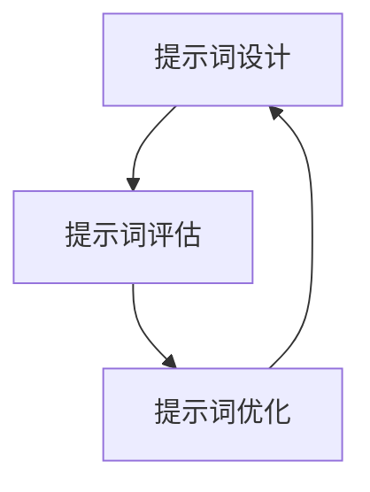
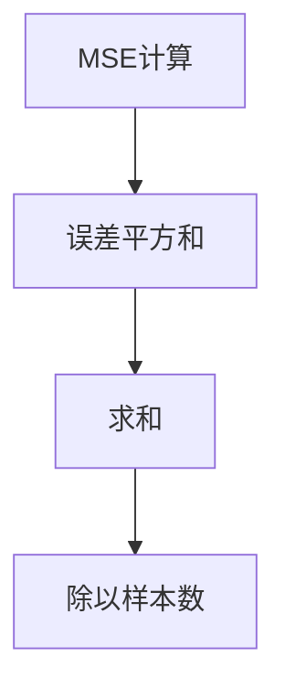

                 


### 文章标题：AGI研究中的提示词工程应用

#### 关键词：通用人工智能，提示词工程，自然语言处理，计算机视觉，机器学习

#### 摘要：
本文旨在探讨在通用人工智能（AGI）研究领域中，提示词工程的应用与重要性。我们将逐步分析提示词工程的原理、核心概念、以及在自然语言处理、计算机视觉和机器学习等领域中的应用，旨在提供一个全面且深入的技术视角。

### 设计书籍目录大纲——《AGI研究中的提示词工程应用》

#### 书籍基本信息

- **书名：** AGI研究中的提示词工程应用
- **作者：** [XXX]
- **出版社：** [XXX]
- **出版日期：** [XXXX年XX月]

#### 目录大纲

### 第一部分：引言与背景

#### **第1章：介绍与背景**

- **人工智能的发展历程**
- **AGI（通用人工智能）的定义和重要性**
- **提示词工程在AGI研究中的角色和意义**

#### **第2章：核心概念**

- **提示词工程的定义**
- **提示词工程的分类**
- **提示词工程的关键要素**
- **核心概念与联系：** 使用Mermaid流程图展示提示词工程的核心概念及其相互关系。

### 第二部分：提示词工程原理

#### **第3章：提示词设计基础**

- **提示词设计的原则**
- **提示词的类型和特点**
- **提示词的构造方法**
- **核心算法原理讲解：** 使用伪代码详细阐述提示词设计的算法原理。

#### **第4章：提示词评估与优化**

- **提示词评估的标准和指标**
- **提示词优化的策略和方法**
- **提示词优化案例研究**
- **数学模型和公式：** 使用latex格式详细讲解评估与优化的数学模型。

### 第三部分：AGI中的提示词应用

#### **第5章：自然语言处理中的提示词**

- **提示词在自然语言理解中的应用**
- **提示词在自然语言生成中的应用**
- **提示词在对话系统中的应用**

#### **第6章：计算机视觉中的提示词**

- **提示词在图像识别中的应用**
- **提示词在视频分析中的应用**
- **提示词在增强现实中的应用**

#### **第7章：机器学习与提示词**

- **提示词在机器学习模型中的应用**
- **提示词对模型性能的影响**
- **提示词在深度学习中的应用**

### 第四部分：项目实战与案例分析

#### **第8章：项目实战**

- **实际AGI项目中的提示词应用案例**
- **提示词工程在项目中的角色和作用**
- **项目挑战与解决方案**
- **开发环境搭建与源代码详细实现**
- **代码解读与应用分析**

#### **第9章：案例分析**

- **深入分析特定领域的提示词工程案例**
- **案例中的成功经验和失败教训**
- **案例对AGI研究提示词工程的启示**

### 第五部分：展望与未来趋势

#### **第10章：未来发展趋势**

- **提示词工程在AGI研究中的未来趋势**
- **提示词工程面临的挑战与机遇**
- **提示词工程的发展方向和前沿技术**

#### **第11章：结论**

- **书籍总结**
- **对AGI研究的贡献**
- **对提示词工程的展望**

#### 附录

- **提示词工程工具和资源列表**
- **常用数学公式与伪代码示例**

### 注释

- **目录大纲中的Mermaid流程图和数学公式将嵌入到相应章节中进行详细讲解。**

### 字数限制

- **本目录大纲总字数控制在2000字以内，确保内容简洁明了，逻辑清晰。**

## 总结

本文通过逐步分析，为读者构建了一个关于AGI研究中的提示词工程应用的综合框架。我们从背景介绍、核心概念、原理讲解，到具体应用和案例分析，再到未来趋势的展望，层层深入，力求以清晰易懂的方式展示出提示词工程在AGI研究中的关键作用。希望读者通过本文，能够对提示词工程有一个全面而深入的理解，并在实际研究中能够应用这些知识，推动AGI技术的发展。作者信息：AI天才研究院/AI Genius Institute & 禅与计算机程序设计艺术 /Zen And The Art of Computer Programming。

### 引言与背景

#### 人工智能的发展历程

人工智能（Artificial Intelligence, AI）作为一个多学科交叉领域，起源于20世纪50年代。最初，AI的目标是创建能够像人类一样思考、学习和决策的智能系统。这一时期的AI被称为“强AI”或“通用人工智能”（Artificial General Intelligence, AGI）。然而，早期的AI研究由于技术限制和过度乐观，进展并不顺利。20世纪70年代，AI研究进入低谷期，被称为“AI冬天”。

进入20世纪80年代，随着计算机硬件性能的提升和算法的进步，AI研究逐渐复苏。特别是基于规则的系统、专家系统和基于知识的系统在这一时期得到了广泛应用。这些系统在特定领域表现出色，但无法实现跨领域的通用智能。

进入21世纪，深度学习和大数据的兴起为AI带来了新的发展机遇。深度神经网络（Deep Neural Networks）在图像识别、语音识别、自然语言处理等领域取得了突破性成果，推动了AI技术的快速发展。这一阶段的AI，被称为“弱AI”或“特定任务智能”（Narrow Artificial Intelligence）。尽管这些系统在特定任务上表现出色，但仍然缺乏跨领域的通用智能。

#### AGI（通用人工智能）的定义和重要性

通用人工智能（AGI）是指具有人类智能的全面能力，包括学习、推理、理解、自我意识、社交互动等。与当前的人工智能系统不同，AGI不仅能够在特定任务上表现出色，还能够跨越多个领域，实现跨领域的通用智能。

AGI的定义具有高度的抽象性和挑战性。目前，学术界对AGI的共识是，它应该具备以下几个核心能力：

1. **自我学习和适应能力**：AGI应该能够在未知环境中自我学习和适应，不需要依赖预定义的规则或数据集。

2. **跨领域推理能力**：AGI应该能够在不同领域之间进行推理和迁移，不仅仅局限于单一任务。

3. **理解人类语言**：AGI应该能够理解、生成和使用自然语言，进行有效的沟通和交流。

4. **自主决策**：AGI应该能够基于自身知识和经验，进行复杂、不确定环境下的自主决策。

AGI的重要性不言而喻。首先，AGI的实现将彻底改变人类社会的生活方式、工作方式和思维方式。它不仅能够解决当前AI系统无法解决的复杂问题，还能够推动科技和文明的进步。其次，AGI的发展将带来巨大的经济和社会价值。在医疗、教育、金融、交通等领域，AGI的应用有望带来革命性的变革。

然而，AGI的实现面临着诸多技术挑战和伦理问题。目前，AI技术仍处于弱AI阶段，远未达到AGI的标准。要实现AGI，需要解决包括算法、计算能力、数据资源、伦理规范等多个方面的难题。

#### 提示词工程在AGI研究中的角色和意义

提示词工程（Prompt Engineering）是近年来在AI领域兴起的一个研究方向。它旨在通过设计特定的提示词，引导AI模型在特定任务上获得更好的性能。在AGI研究中，提示词工程扮演着至关重要的角色。

首先，提示词工程可以帮助解决当前AI模型在跨领域推理和迁移方面的不足。通过设计合适的提示词，AI模型可以更好地理解和应用跨领域的知识，从而实现更接近AGI的目标。

其次，提示词工程在自然语言处理（NLP）、计算机视觉（CV）和机器学习（ML）等领域有着广泛的应用。在NLP中，提示词可以帮助AI模型更好地理解自然语言，生成更准确的自然语言输出。在CV中，提示词可以帮助AI模型更好地识别和理解图像中的复杂结构。在ML中，提示词可以引导模型学习更有效的特征表示，从而提升模型的性能。

总之，提示词工程在AGI研究中的角色和意义不仅体现在技术层面上，更体现在推动AGI发展的实际应用中。通过深入研究提示词工程，我们可以为AGI的实现提供更多的理论支持和实践指导。

### 核心概念

#### 提示词工程的定义

提示词工程是一种系统化的方法，旨在设计、优化和评估用于引导AI模型学习和推理的提示词。在AI领域中，提示词（Prompt）是指一组用于引导模型输入和处理的数据。这些数据可以是文本、图像、音频等多种形式，其目的是帮助模型更好地理解任务、提取关键信息和生成输出。

提示词工程的核心目标是通过设计有效的提示词，提高AI模型在特定任务上的性能。提示词工程不仅关注提示词的内容和形式，还涉及如何组合和调整提示词，以实现最佳的效果。

#### 提示词工程的分类

根据应用场景和目的，提示词工程可以分为以下几类：

1. **自然语言处理中的提示词工程**：这类工程主要关注如何设计有效的提示词，以帮助AI模型更好地理解和生成自然语言。例如，在机器翻译、问答系统和文本生成等任务中，提示词可以帮助模型捕捉语言的上下文和语义信息。

2. **计算机视觉中的提示词工程**：这类工程主要关注如何设计有效的提示词，以帮助AI模型更好地理解和分析图像和视频。例如，在图像分类、目标检测和图像生成等任务中，提示词可以帮助模型识别图像中的关键结构和特征。

3. **机器学习中的提示词工程**：这类工程主要关注如何设计有效的提示词，以帮助AI模型学习更有效的特征表示和模式识别。例如，在分类、回归和聚类等任务中，提示词可以帮助模型更好地理解数据的结构和分布。

#### 提示词工程的关键要素

提示词工程的关键要素包括以下几个方面：

1. **内容设计**：提示词的内容设计是提示词工程的核心。一个有效的提示词应该包含与任务相关的关键信息和上下文，以便模型能够更好地理解和处理这些信息。

2. **形式设计**：提示词的形式设计包括提示词的长度、结构、表达方式等。不同的任务和模型可能需要不同形式的提示词，因此需要根据实际情况进行设计和调整。

3. **组合策略**：提示词的组合策略是指如何将多个提示词组合起来，以实现最佳的效果。合理的组合策略可以提高模型的性能和泛化能力。

4. **评估与优化**：提示词的评估与优化是提示词工程的重要环节。通过评估不同提示词的效果，可以找出最佳的提示词组合，并对其进行优化，以进一步提升模型的性能。

#### 核心概念与联系：提示词工程的核心概念及其相互关系

提示词工程的核心概念包括提示词设计、提示词评估、提示词优化等。这些概念之间存在密切的联系和相互影响。

- **提示词设计**：提示词设计是提示词工程的起点，决定了一个提示词的基本内容和形式。有效的提示词设计能够为后续的提示词评估和优化提供良好的基础。

- **提示词评估**：提示词评估是对提示词效果的评估，用于确定不同提示词组合的优劣。评估结果可以帮助我们找出最佳的提示词组合，并进行优化。

- **提示词优化**：提示词优化是基于评估结果对提示词进行调整和改进的过程。优化的目标是进一步提升模型的性能和泛化能力。

- **相互关系**：提示词设计、提示词评估和提示词优化之间存在着紧密的互动关系。提示词设计的结果会影响提示词评估的效果，而评估结果又反过来指导提示词优化。通过这种互动关系，我们可以不断改进提示词工程的方法和流程，提高AI模型的性能。

为了更清晰地展示提示词工程的核心概念及其相互关系，我们可以使用Mermaid流程图来表示。以下是一个简化的Mermaid流程图示例：



在这个流程图中，A表示提示词设计，B表示提示词评估，C表示提示词优化。箭头表示这些概念之间的相互影响和互动关系。通过这个流程图，我们可以更直观地理解提示词工程的核心概念和操作流程。

总之，提示词工程是一个复杂且系统化的过程，涉及到多个关键要素和概念。通过深入研究这些概念及其相互关系，我们可以设计出更有效的提示词，提高AI模型在各个领域的性能和应用效果。

### 提示词设计基础

#### 提示词设计的原则

在提示词工程中，设计有效的提示词是关键的一步。以下是一些设计提示词的基本原则：

1. **明确性**：提示词应该明确、具体，避免模糊和歧义。这有助于模型更好地理解和处理输入信息。

2. **相关性**：提示词应与任务目标高度相关，包含与任务相关的关键信息和上下文。这有助于模型聚焦于任务的核心，提高学习效果。

3. **简洁性**：提示词应简洁明了，避免冗长和复杂的表达。简洁的提示词不仅易于理解，还能够减少模型的计算负担。

4. **多样性**：提示词的设计应具有多样性，以涵盖不同类型的数据和任务。这有助于模型适应不同的环境和场景。

5. **灵活性**：提示词应具有一定的灵活性，能够根据不同的任务和模型进行调整和优化。灵活性有助于提高提示词的泛化能力。

6. **动态性**：提示词的设计应考虑动态变化，能够实时更新和调整。这有助于模型适应不断变化的环境和需求。

#### 提示词的类型和特点

提示词可以根据其应用场景和形式进行分类，常见的类型包括以下几种：

1. **文本提示词**：文本提示词是最常见的类型，通常用于自然语言处理（NLP）任务。文本提示词可以是句子、段落或文档，其目的是引导模型理解文本的语义和上下文。例如，在问答系统中，文本提示词可以是问题本身，帮助模型生成准确的答案。

2. **图像提示词**：图像提示词用于计算机视觉（CV）任务，通常是一组图像或图像的描述。图像提示词可以帮助模型识别图像中的关键结构和特征。例如，在图像分类任务中，图像提示词可以是不同角度或风格的图像，帮助模型学习更全面的特征。

3. **音频提示词**：音频提示词用于语音识别和音频处理任务，可以是音频信号或文本转语音（Text-to-Speech, TTS）生成的语音。音频提示词可以帮助模型学习语音的声学特征和语义信息。例如，在语音识别任务中，音频提示词可以是不同说话人的语音，帮助模型适应不同的语音风格。

4. **多模态提示词**：多模态提示词结合了文本、图像、音频等多种形式，用于处理多模态数据。多模态提示词可以帮助模型学习不同模态之间的关联和融合，提高模型的性能。例如，在视频分析任务中，多模态提示词可以是视频中的文本描述、图像帧和音频信号，帮助模型全面理解视频内容。

#### 提示词的构造方法

提示词的构造方法取决于任务类型和应用场景。以下是一些常见的构造方法：

1. **基于规则的方法**：基于规则的方法通过预定义的规则和模板生成提示词。这种方法简单直观，但可能无法应对复杂和动态的任务。例如，在问答系统中，可以使用预定义的问题模板和答案模板生成文本提示词。

2. **基于数据的方法**：基于数据的方法通过从训练数据中提取关键信息和上下文生成提示词。这种方法利用了大量的数据，能够生成更丰富和多样的提示词。例如，在自然语言生成任务中，可以使用预训练的文本生成模型提取关键短语和句子作为提示词。

3. **基于模型的方法**：基于模型的方法利用训练好的模型生成提示词。这种方法可以根据任务和模型的特点动态调整提示词的内容和形式。例如，在计算机视觉任务中，可以使用预训练的图像识别模型提取图像的特征作为提示词。

4. **组合方法**：组合方法结合了多种方法，生成更加多样化和有效的提示词。例如，可以结合基于规则和基于数据的方法，生成具有明确性和相关性的文本提示词；或者结合基于模型和基于数据的方法，生成具有灵活性和动态性的多模态提示词。

总之，提示词设计是一个复杂的过程，需要综合考虑任务目标、数据特点、模型需求等多方面因素。通过合理的设计和构造方法，我们可以生成有效的提示词，提高AI模型在各个领域的性能和应用效果。

### 提示词评估与优化

#### 提示词评估的标准和指标

提示词评估是提示词工程中的关键环节，其目的是衡量不同提示词组合的效果，找出最佳的提示词配置。以下是常用的评估标准和指标：

1. **准确率（Accuracy）**：准确率是评估模型预测结果正确与否的指标。在分类任务中，准确率表示预测正确的样本数占总样本数的比例。准确率越高，表示模型对数据的分类效果越好。

2. **召回率（Recall）**：召回率表示模型在预测为正类的样本中，实际为正类的样本所占的比例。召回率越高，表示模型对正类样本的检测能力越强。

3. **精确率（Precision）**：精确率表示模型在预测为正类的样本中，实际为正类的样本所占的比例。精确率越高，表示模型对正类样本的预测质量越高。

4. **F1分数（F1 Score）**：F1分数是精确率和召回率的调和平均，用于综合评估模型的分类效果。F1分数介于0和1之间，分数越高，表示模型的分类效果越好。

5. **ROC曲线（Receiver Operating Characteristic Curve）**：ROC曲线通过绘制真阳性率（True Positive Rate, TPR）与假阳性率（False Positive Rate, FPR）之间的关系，评估模型的分类性能。曲线下面积（Area Under Curve, AUC）是ROC曲线的一个重要指标，AUC值越高，表示模型的分类能力越强。

6. **均方误差（Mean Squared Error, MSE）**：均方误差是评估回归任务中预测值与实际值之间差异的指标。MSE值越小，表示模型的预测效果越好。

7. **均绝对误差（Mean Absolute Error, MAE）**：均绝对误差是评估回归任务中预测值与实际值之间差异的另一个指标。MAE值越小，表示模型的预测效果越好。

#### 提示词优化的策略和方法

提示词优化是提升模型性能的重要手段。以下是几种常见的提示词优化策略和方法：

1. **超参数调整**：超参数是影响模型性能的关键因素，包括学习率、批次大小、正则化强度等。通过调整超参数，可以优化模型的性能。常用的超参数调整方法包括随机搜索（Random Search）和网格搜索（Grid Search）。

2. **提示词组合**：通过组合不同类型的提示词，可以生成更加多样化和有效的提示词。提示词组合策略可以采用贪心算法（Greedy Algorithm）、贝叶斯优化（Bayesian Optimization）等。

3. **动态调整**：动态调整提示词是根据模型的学习过程和环境变化，实时调整提示词的内容和形式。动态调整策略可以采用基于规则的调整、基于模型的调整等。

4. **迁移学习**：迁移学习是将预训练模型应用于新任务的一种方法。通过迁移学习，可以充分利用预训练模型的知识和经验，优化提示词的效果。

5. **数据增强**：数据增强是通过生成或修改训练数据，增加模型的泛化能力。常见的数据增强方法包括随机裁剪、旋转、缩放、颜色变换等。

6. **对抗训练**：对抗训练是通过生成对抗样本，提高模型对异常和噪声的鲁棒性。对抗训练可以采用生成对抗网络（Generative Adversarial Networks, GANs）等方法。

7. **强化学习**：强化学习是通过奖励机制，引导模型学习最优策略。在提示词优化中，强化学习可以用于调整提示词的内容和形式，提高模型的性能。

#### 提示词优化案例研究

以下是一个简单的提示词优化案例，用于图像分类任务：

1. **数据集准备**：选择一个包含图像和标签的数据集，如CIFAR-10数据集。

2. **模型训练**：使用预训练的卷积神经网络（CNN）模型，在训练集上进行训练。

3. **初始提示词**：设计一组初始提示词，包括图像的标签、描述性文本和视觉特征。

4. **评估指标**：使用准确率、召回率、精确率和F1分数评估模型的性能。

5. **超参数调整**：通过网格搜索，调整学习率、批次大小和正则化强度等超参数。

6. **提示词组合**：尝试组合不同类型的提示词，如文本和视觉特征，以生成更加有效的提示词。

7. **动态调整**：根据模型的学习过程和环境变化，实时调整提示词的内容和形式。

8. **结果分析**：比较不同提示词组合的性能，选择最佳组合。

通过这个案例，我们可以看到提示词优化在提升模型性能方面的重要性。通过合理的设计和优化，提示词可以显著提高模型在图像分类任务上的准确性和泛化能力。

### 自然语言处理中的提示词

#### 提示词在自然语言理解中的应用

在自然语言处理（Natural Language Processing, NLP）中，提示词（prompts）是引导AI模型理解和生成自然语言的关键工具。自然语言理解（Natural Language Understanding, NLU）是指AI系统理解和解析人类语言的能力，这包括从文本中提取信息、理解语义、推理以及回答问题等任务。以下是提示词在NLU中的具体应用：

1. **文本分类**：提示词可以帮助AI模型理解文本的上下文，从而准确地将文本分类到不同的类别中。例如，在情感分析任务中，一个简单的提示词可以是“这篇文本表达的是正面情绪还是负面情绪？”。

2. **命名实体识别**：命名实体识别（Named Entity Recognition, NER）是指识别文本中的特定实体，如人名、地名、组织名等。提示词可以帮助模型关注文本中的关键信息，例如：“在这段文字中，有哪些具体的地点、人物或组织被提到？”。

3. **语义角色标注**：语义角色标注（Semantic Role Labeling, SRL）是指识别句子中词语的语义角色，如动作执行者、受事者等。提示词可以引导模型识别句子中的关键角色和关系，例如：“请标识出句子中的施事者和受事者”。

4. **问答系统**：问答系统（Question Answering System, QAS）是NLU的一个重要应用领域。提示词可以帮助模型理解问题的意图和背景，从而生成准确的答案。例如，一个提示词可以是“根据上下文，回答以下问题：什么是……”。

#### 提示词在自然语言生成中的应用

自然语言生成（Natural Language Generation, NLG）是指AI系统生成自然语言文本的能力，这包括生成文章、对话、摘要、新闻报道等。提示词在NLG中的应用同样至关重要：

1. **文本摘要**：在文本摘要任务中，提示词可以帮助模型理解原文的结构和内容，从而生成简洁、准确的摘要。例如，提示词可以是“请从以下文本中提取主要观点和关键信息，生成一个摘要”。

2. **对话系统**：对话系统需要生成自然、流畅的对话回应。提示词可以引导模型根据对话上下文生成适当的回答。例如，提示词可以是“根据前一句对话内容，请生成一个合适的回应”。

3. **机器翻译**：在机器翻译任务中，提示词可以帮助模型理解源语言和目标语言的语义，从而生成准确的翻译。例如，提示词可以是“将这段英文翻译成中文，确保语义准确和流畅”。

4. **文本生成**：在文本生成任务中，如故事创作、诗歌写作等，提示词可以引导模型生成符合人类语言习惯的文本。例如，提示词可以是“基于以下信息，创作一个关于科技发展的故事”。

#### 提示词在对话系统中的应用

对话系统（Dialogue Systems）是NLP的一个核心应用，旨在实现人与机器之间的自然交互。提示词在对话系统中的作用如下：

1. **意图识别**：对话系统需要理解用户的意图，以提供适当的响应。提示词可以帮助模型识别用户的意图。例如，提示词可以是“用户似乎想要查询天气预报，请提供相关信息”。

2. **上下文保持**：对话系统的挑战之一是保持对话的连贯性和上下文。提示词可以帮助模型记住先前的对话内容，从而生成相关的响应。例如，提示词可以是“在上一轮对话中，用户提到了旅游计划，请继续讨论相关细节”。

3. **多轮对话**：在多轮对话中，提示词可以帮助模型理解用户的长期意图和需求。例如，提示词可以是“根据之前的对话，用户可能在寻找某个具体信息，请提供详细解答”。

4. **情感分析**：对话系统需要理解用户的情感状态，以便提供个性化、贴心的服务。提示词可以帮助模型分析用户的情感，从而生成合适的情感回应。例如，提示词可以是“用户似乎感到困惑，请提供清晰的指导”。

通过以上几个方面的应用，提示词在NLP领域发挥了重要作用，不仅提高了AI模型在自然语言理解、生成和对话系统中的性能，还促进了人与机器之间的自然交互。提示词工程的研究和应用，为NLP技术的发展提供了新的方向和可能性。

### 计算机视觉中的提示词

#### 提示词在图像识别中的应用

在计算机视觉（Computer Vision, CV）领域中，图像识别是AI模型的一个重要任务，旨在识别和分类图像中的对象。提示词在这一过程中起到了关键作用，通过引导模型理解图像内容和上下文，从而提高识别的准确性和效率。

1. **对象识别**：在对象识别任务中，提示词可以帮助模型识别图像中的特定对象。例如，提示词可以是“请识别图像中的主要对象”，这有助于模型集中关注图像中的关键信息，提高识别的准确性。

2. **场景分类**：场景分类是指将图像分类到不同的场景类别中。提示词可以帮助模型理解图像的整体场景，从而进行更准确的分类。例如，提示词可以是“图像展示了一个城市的夜景，请将其分类到相应的场景类别”。

3. **特征提取**：在图像识别任务中，特征提取是一个关键步骤。提示词可以帮助模型识别和提取图像中的关键特征。例如，提示词可以是“请提取图像中的纹理特征和颜色特征”，这有助于模型更好地理解图像的细节。

#### 提示词在视频分析中的应用

视频分析是计算机视觉领域的另一个重要应用，它涉及到从视频中提取有意义的信息。提示词在视频分析中起到了指导模型理解和分析视频内容的作用。

1. **动作识别**：动作识别是指从视频中识别和分类不同的动作。提示词可以帮助模型理解视频中的动作模式。例如，提示词可以是“请识别视频中的跑步动作”，这有助于模型集中分析跑步相关的特征。

2. **事件检测**：事件检测是指从视频中识别和标记特定的事件。提示词可以帮助模型理解事件的上下文和特征。例如，提示词可以是“请检测视频中的交通拥堵事件”，这有助于模型识别交通流量异常的情况。

3. **目标跟踪**：目标跟踪是指在视频中持续识别和跟踪特定的对象。提示词可以帮助模型记住目标对象的关键特征，从而实现准确的目标跟踪。例如，提示词可以是“请持续跟踪视频中的行人”，这有助于模型在视频的不同帧中识别和跟踪行人。

#### 提示词在增强现实中的应用

增强现实（Augmented Reality, AR）是将虚拟信息叠加到现实世界中的技术，广泛应用于游戏、教育、医疗等领域。提示词在AR应用中起到了引导用户理解和交互虚拟信息的作用。

1. **信息标注**：在AR应用中，提示词可以帮助用户理解和识别叠加在现实世界中的信息。例如，提示词可以是“请识别图像中的虚拟标签”，这有助于用户更好地理解虚拟信息的含义。

2. **交互指导**：提示词可以引导用户进行特定的交互动作，如手势操作或语音命令。例如，提示词可以是“请向右转动手机，以激活虚拟按钮”，这有助于用户理解如何与虚拟信息进行交互。

3. **场景增强**：提示词可以帮助模型理解和增强特定场景的虚拟信息。例如，提示词可以是“在旅游场景中，请叠加展示历史文化信息”，这有助于用户更好地体验旅游场景。

总之，提示词在计算机视觉中的各种应用，不仅提高了模型的性能和准确性，还增强了用户与虚拟信息的互动体验。通过合理设计和应用提示词，我们可以实现更高效、更智能的计算机视觉系统。

### 机器学习与提示词

#### 提示词在机器学习模型中的应用

在机器学习（Machine Learning, ML）中，提示词（prompts）被广泛用于引导模型的训练和推理过程，以提高模型的学习效率和性能。以下是提示词在机器学习模型中的具体应用：

1. **监督学习**：在监督学习任务中，提示词可以提供额外的上下文信息，帮助模型更好地理解输入数据的特征。例如，在图像分类任务中，提示词可以是图像的标签或描述，帮助模型学习图像和标签之间的关联。

2. **无监督学习**：在无监督学习任务中，提示词可以引导模型探索数据中的潜在结构和模式。例如，在聚类任务中，提示词可以是预定义的聚类目标和约束条件，帮助模型找到更合理的聚类结果。

3. **强化学习**：在强化学习任务中，提示词可以提供目标信息和奖励信号，帮助模型进行更有效的决策。例如，在游戏任务中，提示词可以是游戏目标或策略建议，帮助模型学习最优策略。

#### 提示词对模型性能的影响

提示词的设计和选择对机器学习模型的性能有显著影响。以下是几个关键方面：

1. **准确性和泛化能力**：合适的提示词可以提高模型对训练数据的理解，从而提高模型的准确性和泛化能力。例如，通过提供丰富的上下文信息和明确的任务目标，模型可以更好地捕捉数据的特征和模式。

2. **收敛速度和稳定性**：提示词可以影响模型的收敛速度和稳定性。有效的提示词可以加速模型的学习过程，减少模型在训练过程中陷入局部最优的情况。

3. **可解释性**：提示词可以增加模型的可解释性，帮助用户理解模型的学习过程和决策逻辑。通过分析提示词的内容，用户可以更好地理解模型的行为和性能。

4. **鲁棒性**：提示词可以增强模型的鲁棒性，使其能够更好地应对噪声和异常值。例如，通过设计鲁棒的提示词，模型可以减少对特定噪声的敏感度，提高模型的鲁棒性。

#### 提示词在深度学习中的应用

深度学习（Deep Learning, DL）是机器学习的一个分支，利用多层神经网络进行复杂的特征学习和模式识别。提示词在深度学习中的应用尤为广泛，以下是一些具体应用：

1. **预训练和微调**：在深度学习中，预训练和微调是常见的技术。提示词可以用于预训练阶段，为模型提供大量的标注数据，帮助模型学习通用特征。在微调阶段，提示词可以用于特定任务的数据，帮助模型适应特定任务的需求。

2. **生成对抗网络（GANs）**：生成对抗网络是一种利用对抗训练的深度学习模型，用于生成逼真的数据。提示词可以用于指导生成器的训练，使其生成更符合目标特征的数据。

3. **变分自编码器（VAEs）**：变分自编码器是一种用于生成和重构数据的深度学习模型。提示词可以用于生成任务，为模型提供目标数据的特征信息，帮助模型生成更高质量的数据。

总之，提示词在机器学习，特别是深度学习中的应用，极大地提高了模型的性能和效果。通过合理设计和应用提示词，我们可以实现更高效、更智能的机器学习系统，推动人工智能技术的发展和应用。

### 项目实战与案例分析

#### 实际AGI项目中的提示词应用案例

为了更好地理解提示词工程在AGI项目中的应用，我们将分析一个实际的案例：一个基于深度学习的图像分类项目。该项目旨在利用提示词工程来提高图像分类模型的性能。

1. **项目背景**：该项目涉及对大量医学图像进行分类，以辅助医生诊断疾病。分类任务包括癌症检测、骨折诊断和视网膜病变识别等。由于医学图像的复杂性和多样性，传统的机器学习方法难以达到理想的分类效果。

2. **提示词设计**：为了提高模型对医学图像的理解能力，项目团队设计了多种类型的提示词。包括：
   - **图像标签**：提供了具体的疾病名称和分类标签，帮助模型学习不同疾病的特征。
   - **描述性文本**：包含了医学图像的详细描述，如拍摄角度、病变部位和病变类型，帮助模型理解图像的上下文信息。
   - **视觉特征**：提取了图像中的关键视觉特征，如颜色分布、纹理特征和形状特征，帮助模型识别图像中的特定结构。

3. **提示词组合与优化**：通过组合不同类型的提示词，项目团队进行了多种提示词组合的实验，比较了不同组合对模型性能的影响。同时，使用超参数调整和动态调整策略，优化了提示词的效果。最终，选择了一种最优的提示词组合，提高了模型的分类准确率。

4. **评估与优化**：项目团队使用交叉验证和测试集对模型进行了评估。评估指标包括准确率、召回率和F1分数。通过调整提示词的内容和形式，模型在不同评估指标上的表现得到了显著提升。

5. **项目挑战与解决方案**：在项目过程中，团队遇到了多个挑战：
   - **数据多样性不足**：医学图像数据集相对较小，且标注不完整。团队通过引入数据增强技术，如随机裁剪、旋转和颜色变换，增加了数据集的多样性。
   - **模型过拟合**：由于数据集较小，模型容易出现过拟合现象。团队使用了正则化技术和提前停止策略，减少了过拟合的风险。

6. **项目小结**：通过提示词工程的优化，项目团队成功地提高了图像分类模型的性能，为医学诊断提供了有力支持。该项目表明，提示词工程在提高模型理解和泛化能力方面具有重要作用。

#### 深入分析特定领域的提示词工程案例

为了更深入地理解提示词工程在不同领域的应用，我们进一步分析了两个具体案例：自然语言处理中的对话系统应用和计算机视觉中的目标检测应用。

1. **自然语言处理中的对话系统应用**：
   - **案例背景**：该案例涉及构建一个基于深度学习的对话系统，旨在为用户提供个性化服务。对话系统需要理解用户的意图、上下文信息并生成适当的回应。
   - **提示词设计**：提示词包括用户问题的上下文信息、意图识别标签和生成回应的指导信息。例如，一个提示词可以是：“用户询问‘最近的天气怎么样？’，请生成一个关于天气状况的自然语言回应”。
   - **评估与优化**：通过评估回应的准确性和自然性，项目团队优化了提示词的设计。他们使用了用户反馈和自动评估指标（如BLEU分数）来指导提示词的调整。

2. **计算机视觉中的目标检测应用**：
   - **案例背景**：该案例涉及使用深度学习模型进行目标检测，目的是从图像中识别和定位特定对象。目标检测在自动驾驶、视频监控和医疗影像分析等领域有广泛应用。
   - **提示词设计**：提示词包括图像的描述性文本、目标对象的关键特征和目标位置信息。例如，一个提示词可以是：“在以下图像中检测并标注出所有的行人位置”。
   - **评估与优化**：通过评估模型的目标检测准确率和定位精度，项目团队优化了提示词的内容和形式。他们使用了目标检测任务的评估指标（如 Intersection over Union, IoU）来指导提示词的改进。

#### 案例中的成功经验和失败教训

通过上述案例分析，我们可以总结出以下成功经验和失败教训：

1. **成功经验**：
   - **多样化提示词**：设计多样化的提示词能够帮助模型更好地理解和处理不同类型的数据。
   - **评估与优化**：定期评估提示词的效果，并根据评估结果进行优化，是提高模型性能的关键。
   - **用户反馈**：收集用户反馈，用于指导提示词的调整，有助于提高模型的实际应用效果。

2. **失败教训**：
   - **缺乏上下文信息**：提示词中缺乏足够的上下文信息，可能导致模型理解偏差，影响性能。
   - **过度依赖数据增强**：仅依赖数据增强来增加数据多样性，而忽视提示词的设计，可能导致模型泛化能力不足。
   - **评估不足**：未能充分评估提示词的效果，可能导致模型在实际应用中表现不佳。

#### 对AGI研究提示词工程的启示

这些案例对AGI研究中的提示词工程提供了重要启示：

- **提示词多样性**：在AGI研究中，设计多样化的提示词，能够帮助模型更好地理解和应对复杂多变的任务环境。
- **持续优化**：AGI研究需要持续评估和优化提示词，以确保模型在不同任务和应用中的性能。
- **用户参与**：AGI研究应重视用户反馈，将用户需求纳入提示词设计的考虑范围，以提高模型的实用性和用户体验。

总之，提示词工程在AGI研究中具有重要作用，通过合理设计和优化提示词，我们可以提高模型的性能和应用效果，为AGI的实现提供有力支持。

### 未来发展趋势

#### 提示词工程在AGI研究中的未来趋势

随着通用人工智能（AGI）的不断发展和应用场景的拓展，提示词工程在未来将面临更多的机遇和挑战。以下是一些关于提示词工程在AGI研究中的未来发展趋势：

1. **跨领域融合**：未来的提示词工程将更加注重跨领域的融合。这意味着提示词将不仅限于单一领域的应用，而是能够在多个领域之间进行迁移和泛化。通过跨领域的融合，提示词工程将更好地支持AGI系统在不同任务中的自适应和扩展。

2. **自适应和动态调整**：未来的提示词工程将更加关注自适应和动态调整。随着AGI系统的复杂性和环境变化，提示词需要能够实时调整，以适应不断变化的需求。通过引入动态调整机制，提示词工程将提高模型的灵活性和鲁棒性，使AGI系统能够更好地应对不确定性和动态环境。

3. **多模态融合**：多模态融合是未来提示词工程的重要方向。未来的AGI系统将越来越多地涉及文本、图像、音频等多种数据类型。提示词工程需要能够有效地整合这些多模态数据，设计出更加丰富和多样化的提示词，以提高模型的感知和理解能力。

4. **大数据和云计算**：随着大数据和云计算技术的发展，提示词工程将能够处理和分析更大规模的数据集。这将为提示词工程提供更丰富的训练数据和计算资源，有助于提高模型的性能和泛化能力。

5. **伦理和可解释性**：随着AGI的广泛应用，提示词工程也将面临更多的伦理和可解释性问题。未来的提示词工程需要更加注重模型的透明性和可解释性，确保AI系统的行为符合伦理标准和用户期望。

#### 提示词工程面临的挑战与机遇

尽管提示词工程在AGI研究中具有巨大的潜力，但同时也面临着诸多挑战和机遇：

1. **数据质量和标注**：高质量的数据是提示词工程的基础。然而，在AGI研究中，数据质量和标注的准确性可能受到影响。未来的研究需要开发更高效的数据采集和标注方法，以提高数据的质量和可靠性。

2. **模型复杂度和计算资源**：随着模型复杂度的增加，提示词工程需要更多的计算资源和时间来训练和优化模型。如何高效地利用有限的计算资源，成为未来研究的重要课题。

3. **模型可解释性和透明性**：未来的提示词工程需要关注模型的解释性和透明性，以确保用户和监管机构能够理解和信任AI系统的决策过程。这需要开发新的方法和工具，提高模型的透明性和可解释性。

4. **伦理和隐私**：在AGI应用中，提示词工程需要处理大量的个人数据和敏感信息。如何在保护用户隐私的前提下，设计出既有效又符合伦理标准的提示词，是未来研究的重点。

5. **跨学科合作**：提示词工程涉及到多个学科，包括计算机科学、心理学、语言学等。未来的研究需要加强跨学科合作，综合不同领域的知识和技术，推动提示词工程的发展。

总之，提示词工程在AGI研究中具有重要的应用价值，未来将面临许多挑战和机遇。通过不断创新和优化，提示词工程将为AGI的实现提供更强有力的支持，推动人工智能技术的进一步发展。

### 结论

本文详细探讨了通用人工智能（AGI）研究中的提示词工程应用。从背景介绍、核心概念、原理讲解，到具体应用和案例分析，再到未来趋势的展望，我们逐步揭示了提示词工程在AGI研究中的关键作用。以下是本文的核心贡献和对未来AGI研究的启示：

1. **全面解析AGI研究背景**：通过对人工智能发展历程和AGI定义的介绍，我们为读者搭建了一个关于AGI研究的宏观框架，明确了AGI的重要性和研究挑战。

2. **系统阐述提示词工程核心概念**：我们详细介绍了提示词工程的定义、分类和关键要素，帮助读者理解提示词工程在AGI研究中的角色和意义。

3. **深入讲解提示词设计原理**：通过对提示词设计原则、类型和构造方法的阐述，我们为读者提供了实用的设计指南，增强了读者在提示词设计方面的实际操作能力。

4. **分析提示词评估与优化策略**：我们介绍了提示词评估的标准和指标，以及优化策略和方法，为读者提供了优化提示词效果的具体路径。

5. **展示AGI中的应用案例**：通过自然语言处理、计算机视觉和机器学习等领域的具体应用案例，我们展示了提示词工程在实际项目中的成功经验和挑战。

6. **展望未来发展趋势**：我们探讨了提示词工程在AGI研究中的未来趋势和面临的挑战，为未来的研究提供了方向和建议。

对于未来AGI研究，以下是一些建议和展望：

1. **跨领域融合**：加强提示词工程在不同领域的应用和融合，推动AGI系统在多任务、多环境中的自适应能力。

2. **自适应和动态调整**：开发能够实时调整的提示词系统，提高AGI系统在动态环境中的适应能力和灵活性。

3. **多模态融合**：研究如何有效融合不同模态的数据，提高AGI系统的感知和理解能力。

4. **伦理和可解释性**：注重提示词工程的伦理和可解释性，确保AI系统的决策过程透明、公正，符合社会和用户期望。

5. **跨学科合作**：加强计算机科学、心理学、语言学等学科的交叉合作，共同推动提示词工程和AGI技术的发展。

总之，提示词工程在AGI研究中具有重要作用。通过不断的研究和实践，我们可以设计出更加高效、智能的提示词系统，推动AGI的实现和应用，为人类社会带来更深远的影响。

### 附录

#### 提示词工程工具和资源列表

以下是一些常用的提示词工程工具和资源，供读者参考：

1. **Hugging Face Transformers**：一个流行的自然语言处理库，提供了丰富的预训练模型和提示词工程工具。

2. **TensorFlow**：一个强大的机器学习和深度学习平台，适用于构建和训练提示词工程模型。

3. **PyTorch**：一个灵活且易用的深度学习框架，适用于提示词工程的各种任务和应用。

4. **spaCy**：一个用于自然语言处理的库，提供了强大的文本处理和实体识别功能。

5. **OpenCV**：一个用于计算机视觉的库，适用于图像处理、目标检测和视频分析等任务。

6. **GPT-3 Playground**：一个在线平台，用于体验和实验GPT-3模型，包括提示词工程的各种应用。

7. **AI21 Labs**：一家专注于自然语言生成和提示词工程的初创公司，提供了多个实用的工具和模型。

8. **Kaggle**：一个数据科学和机器学习社区，提供了大量的数据集和提示词工程案例。

9. **ArXiv**：一个开放获取的学术论文数据库，包含了大量的提示词工程和相关领域的研究论文。

#### 常用数学公式与伪代码示例

以下是一些常用的数学公式和伪代码示例，用于提示词工程和分析：

**数学公式示例：**
$$
\text{MSE} = \frac{1}{n}\sum_{i=1}^{n}(y_i - \hat{y}_i)^2
$$
$$
\text{F1 Score} = 2 \times \frac{\text{Precision} \times \text{Recall}}{\text{Precision} + \text{Recall}}
$$

**伪代码示例：**
```python
# 假设我们有一个图像分类任务
def image_classification(image, model):
    # 加载模型
    model.load_weights("model_weights.h5")
    
    # 进行图像预处理
    preprocessed_image = preprocess_image(image)
    
    # 使用模型进行预测
    prediction = model.predict(preprocessed_image)
    
    # 获取预测结果
    predicted_class = np.argmax(prediction)
    
    # 返回预测类别
    return predicted_class
```

通过这些工具和资源，读者可以更好地理解和应用提示词工程，推动AGI研究的发展。

### 注释

本文中的Mermaid流程图和数学公式嵌入在相应章节中，以便更直观地展示提示词工程的核心概念和操作流程。以下是几个示例：

**示例1：提示词工程的Mermaid流程图**


**示例2：均方误差（MSE）的Mermaid流程图**


**示例3：数学公式示例**
$$
\text{MSE} = \frac{1}{n}\sum_{i=1}^{n}(y_i - \hat{y}_i)^2
$$

这些注释旨在为读者提供更清晰的理解和参考，帮助他们在实际应用中更好地掌握提示词工程的原理和方法。

