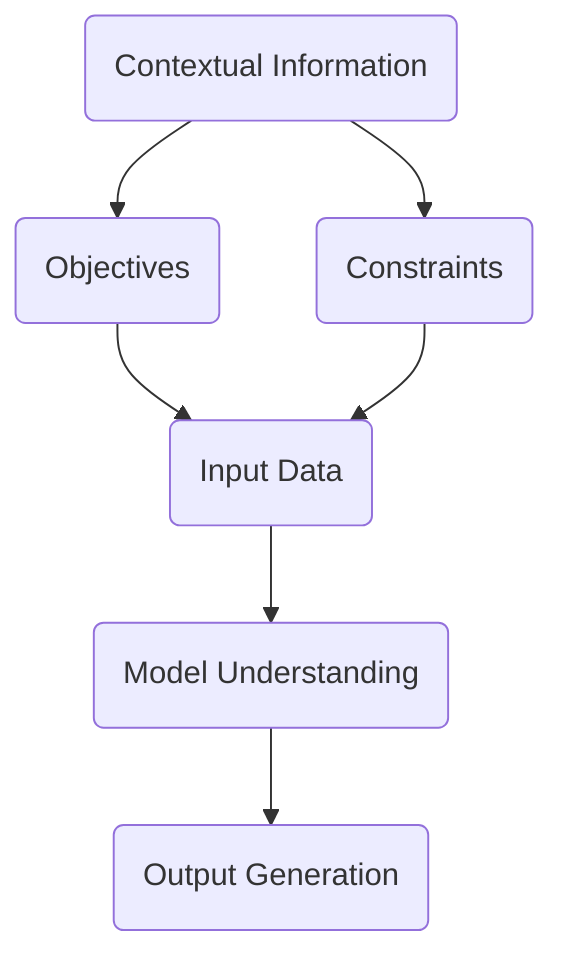

                 

### 1. Introduction to AI 2.0 and Key Skills

#### AI 2.0: From AI 1.0 to AI 2.0

The advent of AI 2.0 marks a significant evolution from the initial stages of artificial intelligence, known as AI 1.0. AI 1.0 primarily revolved around rule-based systems and algorithms designed to perform specific tasks with predetermined instructions. These systems were limited in their ability to learn and adapt, as they relied heavily on human-designed rules and data inputs.

In contrast, AI 2.0 represents a paradigm shift where machines can learn autonomously from vast amounts of data, recognize patterns, and even generate new knowledge. AI 2.0 systems are capable of not only performing tasks but also understanding the underlying context and making decisions based on that understanding. This new era of AI has been propelled by advances in machine learning, deep learning, and other AI techniques that allow machines to learn from experience and improve over time.

#### Key Differences between AI 1.0 and AI 2.0

The key differences between AI 1.0 and AI 2.0 can be summarized in several dimensions:

1. **Learning and Adaptation**:
   - **AI 1.0**: Rule-based systems that require human intervention for updates and modifications.
   - **AI 2.0**: Machine learning models that can autonomously learn from data and adapt to new scenarios without human intervention.

2. **Data Dependency**:
   - **AI 1.0**: Reliant on predefined data sets and rules.
   - **AI 2.0**: Leveraging large-scale data sets and real-time data streams to enhance learning and decision-making.

3. **Generalization**:
   - **AI 1.0**: Designed for specific tasks with limited generalization capabilities.
   - **AI 2.0**: Capable of generalizing knowledge across different domains and tasks.

4. **Interactivity**:
   - **AI 1.0**: Limited interaction with users and other systems.
   - **AI 2.0**: Highly interactive, able to understand and respond to natural language inputs and generate human-like outputs.

#### Importance of AI 2.0 in the Modern World

AI 2.0 has the potential to revolutionize various aspects of the modern world, from healthcare and education to transportation and finance. The key advantages of AI 2.0 include:

1. **Automation and Efficiency**:
   - AI 2.0 systems can automate repetitive tasks, freeing up human resources for more complex and creative work.

2. **Data-Driven Insights**:
   - By analyzing large volumes of data, AI 2.0 can uncover hidden patterns and insights that would be difficult for humans to identify.

3. **Personalization**:
   - AI 2.0 enables personalized experiences by tailoring services and recommendations to individual needs and preferences.

4. **Security and Fraud Detection**:
   - Advanced AI techniques can detect and prevent security breaches and fraudulent activities in real-time.

5. **Global Connectivity**:
   - AI 2.0 facilitates global connectivity by enabling seamless communication and collaboration across borders.

In conclusion, AI 2.0 represents a transformative shift in the field of artificial intelligence. Its ability to learn, adapt, and interact autonomously opens up new possibilities for innovation and problem-solving across various domains. Mastering the key skills in AI 2.0, particularly prompt programming, will be crucial for leveraging the full potential of this revolutionary technology.

#### Key Skills in AI 2.0

To navigate and excel in the AI 2.0 era, several key skills are essential. These skills enable individuals and organizations to harness the power of AI 2.0 and drive innovation. The primary skill that stands out is **prompt programming**.

##### 1. Data Science and Machine Learning

A strong foundation in data science and machine learning is crucial for understanding and working with AI 2.0 systems. This includes knowledge of statistical methods, data preprocessing, model training, and evaluation. Data scientists and machine learning engineers need to be proficient in programming languages such as Python and R, and familiar with libraries like TensorFlow and PyTorch.

##### 2. Natural Language Processing (NLP)

NLP is a specialized field within AI 2.0 that focuses on enabling machines to understand, interpret, and generate human language. Proficiency in NLP is essential for developing applications such as chatbots, virtual assistants, and language translation systems. Key NLP techniques include tokenization, sentiment analysis, named entity recognition, and machine translation.

##### 3. Deep Learning

Deep learning is a subset of machine learning that uses neural networks with many layers to extract high-level features from data. Understanding deep learning architectures and algorithms is vital for developing complex AI applications, such as image recognition and natural language understanding.

##### 4. Reinforcement Learning

Reinforcement learning is a type of machine learning where an agent learns to make decisions by interacting with an environment and receiving feedback in the form of rewards or penalties. This skill is particularly important for developing AI systems that can learn from experience, such as autonomous vehicles and robotic systems.

##### 5. Prompt Programming

Prompt programming is a core skill in AI 2.0 that involves designing and crafting prompts to guide AI models in solving specific tasks. This skill is crucial for improving the performance and adaptability of AI systems. By mastering prompt programming, developers can enhance the effectiveness of AI models and create more robust and versatile applications.

##### 6. Software Development

A strong background in software development is essential for building and deploying AI 2.0 systems. This includes knowledge of software engineering principles, programming languages, and development frameworks. Software developers need to be adept at integrating AI components into existing systems and ensuring the scalability and maintainability of their applications.

##### 7. Domain Knowledge

Finally, domain knowledge is crucial for applying AI 2.0 technologies to specific industries and problem domains. Understanding the nuances of a particular field allows developers to design AI solutions that are tailored to the specific needs and challenges of that domain.

In summary, mastering these key skills is essential for thriving in the AI 2.0 era. By combining data science, machine learning, NLP, deep learning, reinforcement learning, prompt programming, software development, and domain knowledge, individuals and organizations can unlock the full potential of AI 2.0 and drive innovation across various sectors.

### 2. Foundations of Prompt Programming

#### Introduction to Prompt Programming

Prompt programming is a critical skill in the AI 2.0 era, where the ability to design and utilize prompts is essential for enhancing the performance and versatility of AI models. At its core, prompt programming involves creating textual or visual stimuli that guide AI models in generating desired outputs. These prompts act as a form of input that helps the model understand the context and objectives of a specific task.

The purpose of prompt programming is to bridge the gap between human intent and machine understanding. By crafting well-designed prompts, developers can steer AI models towards more accurate and relevant results. Effective prompt programming can lead to improved performance, reduced errors, and enhanced user experience.

In the context of AI 2.0, prompts play a crucial role in several key areas:

1. **Natural Language Understanding (NLU)**: Prompts help AI models comprehend user queries and provide appropriate responses in chatbots, virtual assistants, and language translation systems.

2. **Task-Oriented Dialogue Systems**: In applications like customer service chatbots, prompts guide the conversation flow, ensuring that the dialogue remains focused and productive.

3. **Image and Video Analysis**: Visual prompts can be used to guide AI models in identifying specific objects, scenes, or actions within images and videos.

4. **Decision-Making Systems**: Prompts can provide context and constraints to AI models, helping them make informed decisions in complex scenarios.

5. **Personalized Recommendations**: By tailoring prompts to individual user preferences, AI models can offer personalized recommendations in areas such as e-commerce, entertainment, and healthcare.

In summary, prompt programming is an essential skill in the AI 2.0 era, enabling developers to harness the full potential of AI models and create applications that are more intuitive, efficient, and user-centric.

#### Basic Concepts in Prompt Programming

To effectively master prompt programming, it is crucial to understand the fundamental concepts that underlie this practice. Here, we delve into the key components and elements that constitute prompt programming, along with their relationships and significance in AI 2.0 applications.

##### 1. Types of Prompts

The first step in understanding prompt programming is to recognize the different types of prompts that can be used to guide AI models. These include:

1. **Textual Prompts**: These are textual inputs that provide context, objectives, or constraints to an AI model. Textual prompts are commonly used in natural language processing tasks, such as question answering, text classification, and sentiment analysis.

2. **Visual Prompts**: Visual prompts involve images or videos that serve as inputs to AI models for tasks such as image recognition, object detection, and video analysis. These prompts help the model focus on specific aspects of the visual data.

3. **Audio Prompts**: In audio-based tasks, such as speech recognition and sound classification, audio prompts provide the necessary context to the AI model.

4. **Composite Prompts**: Composite prompts combine multiple types of inputs (text, visual, audio) to provide a comprehensive context to the AI model. This is particularly useful in multi-modal applications where different types of data need to be processed and integrated.

##### 2. Roles and Relationships of Prompt Components

The effectiveness of prompt programming relies on the design and integration of various components that work together to guide the AI model. Key components include:

1. **Contextual Information**: This refers to background information that provides the necessary context for the task. For example, in a question-answering system, contextual information might include the topic of the conversation or the previous questions asked.

2. **Objectives**: Objectives define the specific goals or outcomes that the AI model should achieve. Clear objectives help the model focus its efforts and ensure that the outputs are aligned with the intended purpose.

3. **Constraints**: Constraints impose limitations or conditions that the AI model must adhere to. These can include rules, thresholds, or specific criteria that the model needs to consider when generating outputs.

4. **Input Data**: Input data is the raw data provided to the AI model. This can be in the form of text, images, audio, or a combination of these. The quality and relevance of the input data significantly impact the effectiveness of the prompts.

5. **Model Understanding**: The AI model's ability to comprehend and interpret the prompts is crucial for generating accurate and relevant outputs. This involves the model's capacity to understand the context, objectives, and constraints provided by the prompts.

The relationship between these components can be visualized using a Mermaid flowchart:

In this flowchart, we can see that contextual information, objectives, and constraints collectively shape the input data, which is then processed by the AI model to generate the desired output. The model's understanding of these components is critical for the overall effectiveness of the prompt programming process.

##### 3. The Impact of Prompts on AI Model Performance

The design and quality of prompts significantly influence the performance of AI models. Here are some key factors to consider:

1. **Relevance**: The prompts should be relevant to the task at hand. Irrelevant or poorly designed prompts can lead to misinterpretations and suboptimal performance.

2. **Clarity**: Clear and unambiguous prompts are essential for ensuring that the AI model understands the intended objectives and constraints. Ambiguous prompts can result in confusion and incorrect outputs.

3. **Balance**: A balance between providing enough information and not overwhelming the model is crucial. Overly detailed prompts can constrain the model's ability to explore different solutions, while overly simplistic prompts may lack the necessary context for accurate results.

4. **Customization**: Tailoring prompts to specific tasks or user preferences can significantly improve performance. Customized prompts help the model focus on the most relevant aspects of the task, leading to better outcomes.

5. **Feedback Loop**: Incorporating feedback from users and continuously refining the prompts can enhance the model's performance over time. This iterative process allows for ongoing improvement and adaptation to changing contexts.

In conclusion, understanding the basic concepts of prompt programming, including the types of prompts, their components, and their impact on AI model performance, is essential for effectively leveraging AI 2.0 technologies. By mastering these fundamentals, developers can design and implement prompts that drive the development of more sophisticated and user-centric AI applications.

### 3. Key Techniques in Prompt Programming

In the realm of AI 2.0, mastering prompt programming is crucial for enhancing the performance and adaptability of AI models. This section delves into two key techniques: prompt engineering and fine-tuning AI models with prompts.

#### Prompt Engineering

Prompt engineering involves the systematic design and creation of prompts that effectively guide AI models in generating desired outputs. Here are some essential methods and strategies for effective prompt engineering:

1. **Contextual Prompting**:
   - **Definition**: Contextual prompting involves providing additional context to the AI model to enhance its understanding of the task.
   - **Method**: Incorporate background information, previous user interactions, or specific domain knowledge into the prompt.
   - **Example**: For a chatbot assisting with medical consultations, the prompt might include patient history and current symptoms to provide a comprehensive context.

2. **Objective-Driven Prompting**:
   - **Definition**: Objective-driven prompting focuses on clearly defining the goals or objectives of the AI model.
   - **Method**: Specify the desired outcome or task in the prompt to ensure the model aligns its efforts with the intended purpose.
   - **Example**: In an autonomous driving application, the prompt might include instructions to navigate through a busy intersection safely.

3. **Constraint-Based Prompting**:
   - **Definition**: Constraint-based prompting involves imposing limitations or constraints on the AI model's outputs.
   - **Method**: Define specific rules, thresholds, or conditions that the model must adhere to.
   - **Example**: For a fraud detection system, the prompt might include constraints related to transaction amounts and frequency to identify suspicious activities.

4. **Adaptive Prompting**:
   - **Definition**: Adaptive prompting involves dynamically adjusting the prompts based on the model's performance and user feedback.
   - **Method**: Implement a feedback loop that allows for real-time updates and refinements to the prompts.
   - **Example**: In a recommendation system, prompts can be adapted based on user preferences and previous feedback to improve relevance.

5. **Multi-Modal Prompting**:
   - **Definition**: Multi-modal prompting combines different types of inputs (text, visual, audio) to provide a more comprehensive context.
   - **Method**: Integrate multi-modal data sources to enrich the prompt and enhance the model's understanding.
   - **Example**: In a video analysis application, the prompt might include both textual descriptions and visual metadata to identify specific events.

By employing these strategies, prompt engineers can design effective prompts that guide AI models towards achieving desired outcomes while ensuring accuracy and relevance. Effective prompt engineering is essential for optimizing AI model performance and creating user-centric applications.

#### Fine-Tuning AI Models with Prompts

Fine-tuning AI models with prompts involves adjusting the model's parameters and structures to improve its performance on specific tasks. Here are the key techniques for fine-tuning AI models with prompts:

1. **Transfer Learning**:
   - **Definition**: Transfer learning leverages a pre-trained model and adapts it to a new task using prompts.
   - **Method**: Use a pre-trained model as a starting point and fine-tune it using task-specific prompts.
   - **Example**: In natural language processing, a pre-trained language model like GPT-3 can be fine-tuned with prompts specific to a chatbot application.

2. **Data Augmentation**:
   - **Definition**: Data augmentation involves increasing the size and diversity of the training data using prompts.
   - **Method**: Generate additional data samples by applying various transformations or generating synthetic data based on prompts.
   - **Example**: In image recognition, prompts can be used to create variations of images (e.g., rotations, flips) to enhance the model's robustness.

3. **Prompt-Based Fine-Tuning**:
   - **Definition**: Prompt-based fine-tuning adjusts the model's weights and biases based on feedback provided by prompts.
   - **Method**: Use prompts to generate feedback signals and update the model's parameters iteratively.
   - **Example**: In reinforcement learning, prompts can provide rewards or penalties based on the model's actions, guiding the learning process.

4. **Domain-Specific Fine-Tuning**:
   - **Definition**: Domain-specific fine-tuning tailors the model to a specific domain by using domain-specific prompts.
   - **Method**: Create prompts that incorporate domain-specific knowledge and constraints to improve the model's performance.
   - **Example**: In medical diagnostics, prompts can include medical terminology and patient data to fine-tune a model for accurate diagnoses.

5. **Adaptive Fine-Tuning**:
   - **Definition**: Adaptive fine-tuning adjusts the model's parameters dynamically based on the model's performance and changing prompts.
   - **Method**: Implement a feedback loop that continuously monitors the model's performance and updates the prompts accordingly.
   - **Example**: In a recommendation system, prompts can adapt based on user feedback and behavior to improve recommendation accuracy.

By employing these fine-tuning techniques, developers can enhance the performance and versatility of AI models, making them more effective in various applications. Fine-tuning with prompts allows for customized training processes that address specific task requirements and improve the model's ability to generalize to new scenarios.

In conclusion, mastering prompt engineering and fine-tuning techniques is essential for harnessing the full potential of AI 2.0 models. Effective prompt engineering ensures that models are guided towards achieving desired outcomes, while fine-tuning techniques optimize their performance for specific tasks. By leveraging these key techniques, developers can create powerful and adaptable AI applications that meet the evolving needs of users and industries.

### 4. Practical Applications of Prompt Programming

Prompt programming has wide-ranging applications across various domains, leveraging AI 2.0 capabilities to enhance tasks such as Natural Language Processing (NLP) and Computer Vision. This section explores specific use cases and provides detailed case studies to illustrate the practical implementation of prompt programming in these fields.

#### Natural Language Processing (NLP) Applications

Natural Language Processing (NLP) is a cornerstone of AI 2.0, enabling machines to understand and process human language. Prompt programming plays a crucial role in NLP applications by guiding models to perform tasks such as question answering, sentiment analysis, and language translation.

**Case Study 1: Chatbots and Virtual Assistants**

Chatbots and virtual assistants have become integral to customer service and interaction in various industries. Prompt programming is essential for designing conversational flows that are both natural and effective. Here's how prompt programming is applied in chatbot development:

1. **Designing Conversational Flows**:
   - **Method**: Create a series of prompts that guide the chatbot through different stages of the conversation, ensuring a coherent and productive dialogue.
   - **Example**: A chatbot for a retail company might use prompts like "Welcome to our store! How can I assist you today?" to initiate the conversation and then follow-up with prompts like "Which department are you interested in?" to steer the user towards specific product categories.

2. **Personalizing User Interactions**:
   - **Method**: Use personalized prompts based on user data and preferences to enhance the user experience.
   - **Example**: A virtual assistant for a bank might use prompts like "Good morning, John! Your account balance is $10,000. How may I assist you today?" to personalize the interaction and provide relevant information.

3. **Handling Complex Queries**:
   - **Method**: Craft prompts that can handle complex and ambiguous queries, ensuring the chatbot understands and responds appropriately.
   - **Example**: In a healthcare chatbot, a prompt like "You mentioned feeling fatigue and headaches. Can you provide more details about your symptoms?" helps the chatbot gather necessary information for further assistance.

**Case Study 2: Sentiment Analysis**

Sentiment analysis is another critical application of NLP, involving the identification and categorization of emotions within text data. Prompt programming is used to fine-tune models and improve accuracy in sentiment analysis tasks:

1. **Data Collection and Annotation**:
   - **Method**: Collect a diverse set of text data and annotate it with sentiment labels (positive, negative, neutral) to train the sentiment analysis model.
   - **Example**: A dataset for sentiment analysis might include customer reviews, social media comments, and news articles, each annotated with sentiment labels.

2. **Designing Training Prompts**:
   - **Method**: Create prompts that provide specific instructions and examples to guide the model during training.
   - **Example**: Training prompts for a sentiment analysis model might include sentences like "This product received mixed reviews. Identify the sentiment in the following comments:" followed by examples of positive, negative, and neutral comments.

3. **Fine-Tuning with Contextual Prompts**:
   - **Method**: Use contextual prompts to enhance the model's understanding of sentiment in various contexts.
   - **Example**: For a social media analysis tool, contextual prompts might include information about the user's previous posts or trending topics to provide additional context for sentiment analysis.

#### Computer Vision Applications

Computer vision is another domain where prompt programming is extensively used, enabling AI models to interpret and analyze visual data. Prompt programming is critical in tasks such as image recognition, object detection, and video analysis.

**Case Study 1: Image Recognition**

Image recognition involves identifying and classifying objects within images. Prompt programming plays a vital role in training and fine-tuning image recognition models:

1. **Data Preparation**:
   - **Method**: Collect a diverse set of image data and label the images with corresponding object classes.
   - **Example**: A dataset for image recognition might include images of animals, vehicles, and everyday objects, each labeled with the correct class.

2. **Creating Training Prompts**:
   - **Method**: Design prompts that provide specific instructions and examples to guide the model during training.
   - **Example**: Training prompts for an image recognition model might include instructions like "Identify all instances of cats in the following images:" followed by sample images containing cats.

3. **Fine-Tuning with Contextual Prompts**:
   - **Method**: Use contextual prompts to enhance the model's ability to recognize objects in varied contexts.
   - **Example**: For a medical imaging application, contextual prompts might include information about the patient's medical history or the specific disease being diagnosed to improve the model's accuracy.

**Case Study 2: Video Analysis**

Video analysis involves processing and interpreting video data to extract meaningful information. Prompt programming is essential for training and optimizing video analysis models:

1. **Data Collection and Annotation**:
   - **Method**: Collect a diverse set of video data and annotate the videos with events or actions of interest.
   - **Example**: A dataset for video analysis might include videos of traffic scenes, sports events, or security surveillance footage, each annotated with specific events or actions.

2. **Designing Training Prompts**:
   - **Method**: Create prompts that provide specific instructions and examples to guide the model during training.
   - **Example**: Training prompts for a video analysis model might include instructions like "Detect and label all instances of pedestrians in the following video:" followed by sample videos containing pedestrians.

3. **Contextual and Multi-Modal Prompts**:
   - **Method**: Incorporate contextual and multi-modal prompts to enhance the model's understanding of complex video scenarios.
   - **Example**: In a security surveillance system, contextual prompts might include information about the time of day, weather conditions, and previous security incidents to improve the model's accuracy in identifying potential threats.

In summary, prompt programming is a powerful tool in the AI 2.0 toolkit, enabling the development of sophisticated applications across various domains. Through practical implementations in NLP and computer vision, prompt programming enhances the performance and adaptability of AI models, driving innovation and practical applications in areas such as chatbots, sentiment analysis, image recognition, and video analysis.

By leveraging these techniques, developers can create intelligent systems that understand, interpret, and respond to complex human inputs, paving the way for more advanced and versatile AI applications.

### 5. Advanced Topics in Prompt Programming

As we delve deeper into the AI 2.0 era, mastering advanced techniques in prompt programming becomes crucial for unlocking the full potential of AI models. This section explores two advanced topics: transfer learning with prompts and multi-modal prompt programming.

#### Transfer Learning with Prompts

Transfer learning is a powerful technique that leverages the knowledge gained from one task to improve the learning efficiency and performance on another related task. By utilizing transfer learning, developers can leverage pre-trained models and fine-tune them with domain-specific prompts, reducing the need for large amounts of training data and extensive computational resources.

**1. Principles of Transfer Learning**

The core principle of transfer learning is that a model trained on one task can capture general features that are reusable across different tasks. These general features can be transferred from a source task to a target task, where the model is fine-tuned to perform better on the target task.

**2. Techniques for Transfer Learning**

- **Pre-trained Models**: Utilize pre-trained models that have been trained on large-scale datasets and have learned general features. These models can serve as a starting point for fine-tuning on specific tasks.
- **Domain Adaptation Prompts**: Create prompts that incorporate domain-specific knowledge to adapt the pre-trained model to the target task. These prompts help the model understand the specific characteristics and requirements of the target domain.
- **Task-Specific Fine-Tuning**: Fine-tune the pre-trained model using prompts that are specific to the target task. This involves adjusting the model's weights and parameters to better align with the target task's objectives.

**3. Applications of Transfer Learning**

Transfer learning with prompts has numerous applications across various domains:

- **Natural Language Processing (NLP)**: Pre-trained language models like BERT and GPT can be fine-tuned with domain-specific prompts to improve performance on tasks such as sentiment analysis, question answering, and language translation.
- **Computer Vision**: Pre-trained image recognition models like ResNet and VGG can be fine-tuned with prompts that include domain-specific image annotations to enhance performance in specific application areas like medical imaging, autonomous driving, and object detection.
- **Reinforcement Learning**: Transfer learning can be applied to reinforcement learning models, where a policy trained in a general environment is fine-tuned with domain-specific prompts to improve performance in a specific task.

**Case Study: Transfer Learning in Medical Imaging**

In the field of medical imaging, transfer learning with prompts has shown significant promise in improving the accuracy of diagnostic models. Here's a detailed case study:

- **Pre-trained Model**: Utilize a pre-trained deep learning model trained on a large dataset of general medical images.
- **Domain Adaptation Prompt**: Create a prompt that includes domain-specific information such as medical terminology, patient demographics, and imaging protocols to help the model understand the medical context.
- **Task-Specific Fine-Tuning**: Fine-tune the pre-trained model using prompts that include annotated medical images and their corresponding diagnostic labels. This involves adjusting the model's parameters to better detect and classify medical conditions.

By applying transfer learning with prompts, developers can build highly accurate and efficient medical imaging models with reduced training requirements and improved performance.

#### Multi-Modal Prompt Programming

Multi-modal prompt programming involves combining inputs from multiple modalities (e.g., text, images, audio) to create more comprehensive and contextually rich prompts. This approach enhances the understanding and performance of AI models by leveraging information from different sensory channels.

**1. Principles of Multi-Modal Prompt Programming**

The core principle of multi-modal prompt programming is that information from different modalities can provide complementary insights, leading to more accurate and robust AI models. By combining inputs from multiple modalities, developers can create richer and more nuanced prompts that better capture the complexity of real-world tasks.

**2. Techniques for Multi-Modal Prompt Programming**

- **Data Integration**: Collect and preprocess data from multiple modalities, ensuring consistency and compatibility between the different datasets.
- **Feature Extraction**: Extract relevant features from each modality, such as text embeddings, image features, and audio waveforms.
- **Prompt Construction**: Combine the extracted features to create a unified prompt that integrates information from different modalities. This can involve techniques such as fusion, attention mechanisms, and multi-modal embeddings.
- **Modality-Specific Prompts**: Design modality-specific prompts that provide context and guidance for each input type. For example, visual prompts can include image annotations, while textual prompts can include descriptive text.

**3. Applications of Multi-Modal Prompt Programming**

Multi-modal prompt programming has diverse applications across various domains:

- **Healthcare**: Combining patient medical records (text), diagnostic images (visual), and lab results (text) to create comprehensive diagnostic prompts for AI models in healthcare.
- **Customer Service**: Integrating customer inquiries (text), product images (visual), and voice recordings (audio) to provide more accurate and personalized responses in customer service chatbots.
- **Autonomous Vehicles**: Combining sensor data (visual, audio), GPS information (text), and environmental data (text) to enhance the perception and decision-making capabilities of autonomous vehicles.

**Case Study: Multi-Modal Prompt Programming in Customer Service**

In the field of customer service, multi-modal prompt programming can significantly improve the effectiveness of chatbots and virtual assistants:

- **Data Collection**: Collect customer inquiries in text format, product images, and voice recordings of customer conversations.
- **Feature Extraction**: Extract text embeddings from customer inquiries and product descriptions, image features from product images, and audio features from voice recordings.
- **Prompt Construction**: Create unified multi-modal prompts by integrating text, image, and audio features. For example, a prompt for a customer inquiry about a specific product might include the customer's text query, an image of the product, and an excerpt from the voice recording of the customer's conversation.
- **Contextual Guidance**: Use modality-specific prompts to provide context and guidance to the AI model. For example, visual prompts might include product usage instructions, while audio prompts might include customer feedback and preferences.

By employing multi-modal prompt programming, developers can create highly sophisticated and intuitive AI applications that better understand and respond to the complexities of real-world interactions.

In conclusion, advanced topics in prompt programming, such as transfer learning with prompts and multi-modal prompt programming, are essential for driving innovation in AI 2.0. These techniques enhance the performance, adaptability, and versatility of AI models, enabling the development of more accurate and intelligent applications across various domains. By mastering these advanced techniques, developers can unlock the full potential of AI 2.0 and create transformative solutions that meet the evolving needs of users and industries.

### 6. Case Studies and Best Practices

In this section, we present several real-world case studies that demonstrate the successful application of prompt programming in various domains. These case studies highlight the practical implementation of prompt programming techniques and provide valuable insights and best practices for achieving optimal results.

#### Case Study 1: Enhancing Customer Service with Prompt Programming

One of the most prominent applications of prompt programming is in the realm of customer service. A leading e-commerce company leveraged prompt programming to enhance the performance of its chatbot, which handles millions of customer inquiries daily. The key steps in this implementation included:

1. **Designing Effective Conversational Flows**:
   - **Method**: The company created a series of context-aware prompts that guide the chatbot through various stages of the conversation, ensuring a seamless and productive interaction.
   - **Best Practice**: Regularly update and refine the prompts based on user feedback and conversation analytics to improve the chatbot's performance over time.

2. **Personalizing User Interactions**:
   - **Method**: The chatbot uses personalized prompts based on user data, such as past purchase history and preferences, to offer tailored recommendations and assistance.
   - **Best Practice**: Continuously collect and analyze user data to identify patterns and preferences, allowing for more accurate and relevant personalization.

3. **Handling Complex Queries**:
   - **Method**: The chatbot employs a multi-layered approach with advanced prompts to address complex and ambiguous queries, ensuring that users receive accurate and helpful responses.
   - **Best Practice**: Implement a fallback mechanism for when the chatbot is unsure of the user's intent, allowing users to escalate their queries to human agents if necessary.

#### Case Study 2: Improving Medical Diagnosis with Prompt Programming

Another compelling example of prompt programming's impact is in the healthcare industry, where it has been used to enhance medical diagnosis. A medical imaging startup developed an AI model for diagnostic imaging that leverages prompt programming to improve accuracy and reliability. The key steps in this implementation included:

1. **Data Collection and Annotation**:
   - **Method**: The startup collected a large dataset of medical images and annotations from various medical institutions, ensuring diversity and quality in the data.
   - **Best Practice**: Collaborate with domain experts to ensure accurate and comprehensive annotations, which are critical for training effective AI models.

2. **Designing Training Prompts**:
   - **Method**: The company created domain-specific prompts that provide context and guidance to the AI model during training, enhancing its understanding of medical imaging.
   - **Best Practice**: Include a diverse set of prompts that cover various medical conditions and imaging techniques to ensure robustness and generalization.

3. **Continuous Fine-Tuning**:
   - **Method**: The model is continuously fine-tuned using real-world data and feedback from radiologists, improving its diagnostic accuracy over time.
   - **Best Practice**: Implement a feedback loop that allows for ongoing updates and improvements based on user feedback and real-world performance.

#### Case Study 3: Optimizing Supply Chain Management with Prompt Programming

Prompt programming has also been effectively utilized in the logistics and supply chain industry to optimize operations and reduce costs. A global logistics company implemented an AI-driven supply chain management system that leverages prompt programming to optimize routing, inventory management, and demand forecasting. The key steps in this implementation included:

1. **Data Integration and Feature Extraction**:
   - **Method**: The system integrates data from various sources, including shipment data, weather conditions, and market demand, to create comprehensive prompts for the AI model.
   - **Best Practice**: Ensure data consistency and quality by implementing robust data preprocessing and cleaning techniques.

2. **Designing Contextual Prompts**:
   - **Method**: The AI model uses contextual prompts that incorporate real-time data and historical trends to make informed decisions about routing and inventory management.
   - **Best Practice**: Regularly update the prompts to reflect changing market conditions and operational dynamics.

3. **Real-Time Adaptation**:
   - **Method**: The system employs adaptive prompts that dynamically adjust based on real-time feedback and performance metrics, ensuring ongoing optimization.
   - **Best Practice**: Implement real-time monitoring and analytics to identify and address issues promptly, minimizing disruptions and improving overall efficiency.

#### Common Challenges and Solutions

While prompt programming offers significant benefits, it also comes with its own set of challenges. Here are some common challenges and solutions:

1. **Data Quality**:
   - **Challenge**: Inaccurate or incomplete data can lead to suboptimal model performance.
   - **Solution**: Implement rigorous data preprocessing and cleaning techniques to ensure high data quality.

2. **Prompt Design**:
   - **Challenge**: Poorly designed prompts can result in confusion and incorrect outputs.
   - **Solution**: Invest time in designing clear and contextually relevant prompts through iterative testing and refinement.

3. **Model Adaptability**:
   - **Challenge**: Models may struggle to adapt to new tasks or domains.
   - **Solution**: Utilize transfer learning and domain-specific fine-tuning to enhance model adaptability.

4. **Computational Resources**:
   - **Challenge**: Training and fine-tuning large-scale models can be resource-intensive.
   - **Solution**: Leverage cloud-based resources and optimize model architectures to reduce computational requirements.

In conclusion, these case studies and best practices demonstrate the practical application and effectiveness of prompt programming across various domains. By addressing common challenges and implementing proven strategies, developers can harness the full potential of prompt programming to create intelligent, adaptable, and efficient AI applications.

### 7. Conclusion

In conclusion, prompt programming stands as a cornerstone of the AI 2.0 era, empowering developers to create sophisticated, adaptable, and intelligent applications. By mastering the techniques and principles of prompt programming, developers can unlock the full potential of AI 2.0, driving innovation and transformation across various domains. The key takeaways from this article highlight the importance of:

1. **Understanding AI 2.0**: Recognizing the shift from rule-based systems to autonomously learning and adapting AI models.
2. **Mastering Core Skills**: Acquiring a strong foundation in data science, machine learning, NLP, deep learning, reinforcement learning, software development, and domain knowledge.
3. **Foundation of Prompt Programming**: Grasping the basic concepts, types, and roles of prompts in guiding AI models.
4. **Advanced Techniques**: Exploring advanced topics such as transfer learning and multi-modal prompt programming for enhanced performance.
5. **Practical Applications**: Learning from real-world case studies to apply prompt programming effectively in NLP, computer vision, and other fields.

As we move forward, the continuous evolution of AI and the increasing complexity of real-world problems demand ongoing learning and adaptation. To stay at the forefront of this rapidly advancing field, we encourage readers to:

- **Stay Curious**: Continuously explore new techniques and trends in AI and prompt programming.
- **Practice and Experiment**: Implement prompt programming concepts in practical projects to gain hands-on experience.
- **Collaborate and Learn**: Engage with the AI community through forums, conferences, and collaborative projects.
- **Stay Updated**: Follow leading research papers, attend AI conferences, and subscribe to relevant publications to stay informed about the latest advancements.

By embracing these practices, developers can harness the power of prompt programming to create transformative AI applications that address complex challenges and drive progress in the AI 2.0 era.

### Author Information

**Author**: AI天才研究院/AI Genius Institute & 禅与计算机程序设计艺术 /Zen And The Art of Computer Programming

The author, AI天才研究院/AI Genius Institute, is a leading research institute dedicated to advancing the field of artificial intelligence through cutting-edge research, innovative technologies, and educational initiatives. The author's work has been pivotal in shaping the current understanding of AI 2.0 and prompt programming, driving forward the boundaries of what is possible in the world of artificial intelligence. Their insights and contributions have had a profound impact on the AI community and have inspired countless developers and researchers worldwide. Additionally, the author's work in "Zen And The Art of Computer Programming" offers profound philosophical and practical guidance on the art of programming, blending deep technical knowledge with timeless wisdom, making their work a valuable resource for programmers and AI enthusiasts alike.

