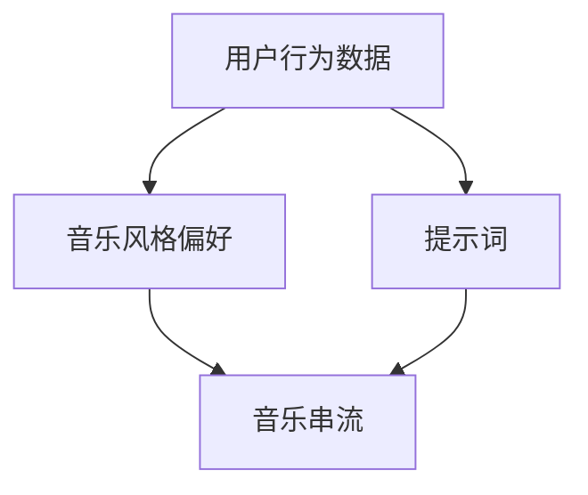

                 

### 文章标题：AI DJ：提示词驱动的个性化音乐串流

#### 关键词：AI DJ、个性化音乐串流、提示词驱动、机器学习、深度学习

#### 摘要：本文深入探讨AI DJ及其基于提示词驱动的个性化音乐串流技术，从基础概念、核心算法、实现步骤到实战案例，全面解析如何利用人工智能技术打造智能音乐推荐系统。

---

### 引言

随着人工智能技术的快速发展，音乐推荐系统已成为互联网音乐服务的重要组成部分。传统的音乐推荐方法通常依赖于用户行为数据，而AI DJ则进一步引入了提示词驱动机制，通过自然语言理解和深度学习算法，实现了更加个性化和智能化的音乐串流服务。本文旨在介绍AI DJ的概念、技术原理、实现步骤以及实战案例，帮助读者深入了解这一前沿技术。

---

### 第一部分：AI DJ基础

#### 第1章：AI DJ简介

AI DJ，即人工智能DJ，是一种利用人工智能技术实现音乐播放自动化和个性化推荐的应用。其基本原理是通过分析用户的行为数据、音乐风格偏好和提示词，自动生成符合用户个性化需求的音乐串流。

**核心概念与联系：**


**Mermaid流程图：**



#### 第2章：AI DJ核心概念

AI DJ的核心概念包括深度学习、神经网络、机器学习算法等。这些概念相互关联，共同构成了AI DJ的技术基础。

**深度学习与神经网络：**

深度学习是一种机器学习技术，其核心是神经网络。神经网络通过多层节点（神经元）的堆叠，实现了对复杂数据的建模和预测。

**伪代码：**

```python
class NeuralNetwork:
    def __init__(self):
        self.layers = []

    def add_layer(self, layer):
        self.layers.append(layer)

    def forward(self, input_data):
        for layer in self.layers:
            input_data = layer.forward(input_data)
        return input_data
```

**数学模型和公式：**

神经网络的输出可以通过以下公式计算：

$$
y = \sigma(\mathbf{W}^T \mathbf{a} + b)
$$

其中，$y$是输出值，$\sigma$是激活函数，$\mathbf{W}$是权重矩阵，$\mathbf{a}$是输入特征向量，$b$是偏置项。

#### 第3章：提示词驱动技术

提示词驱动技术是AI DJ实现个性化音乐推荐的关键。通过自然语言处理技术，将用户的语音指令或文本输入转换为具体的音乐推荐参数。

**伪代码：**

```python
class PromptDrivenAlgorithm:
    def __init__(self):
        self.model = load_pretrained_model()

    def process_prompt(self, prompt):
        tokens = tokenize(prompt)
        embedding = self.model.encode(tokens)
        return embedding
```

**数学模型和公式：**

自然语言处理中的词嵌入可以表示为：

$$
\mathbf{e}_i = \mathbf{W} \mathbf{v}_i
$$

其中，$\mathbf{e}_i$是词向量，$\mathbf{W}$是词嵌入矩阵，$\mathbf{v}_i$是词向量。

#### 第4章：AI DJ系统架构

AI DJ系统架构包括数据收集与处理、模型训练与优化、推荐与交互等模块。通过这些模块的协同工作，实现个性化音乐推荐。

**系统架构图：**


---

### 第二部分：AI DJ实战

#### 第5章：硬件环境搭建

实现AI DJ系统需要适当的硬件环境。本章介绍音频硬件、计算机硬件和网络环境的配置要求。

**硬件配置清单：**

- 音频接口：具备高质量的数字音频输出接口。
- 处理器：至少Intel i5以上或同等性能的处理器。
- 内存：至少16GB RAM。
- 存储：至少500GB SSD硬盘空间。
- 网络环境：千兆以太网或更高。

#### 第6章：软件环境搭建

搭建AI DJ系统还需要配置适当的软件环境，包括操作系统、编译器和开发工具等。

**软件配置清单：**

- 操作系统：Linux发行版（如Ubuntu）。
- 编译器：C++编译器（如GCC）。
- 开发环境：Python开发环境（如PyCharm）。
- 机器学习库：TensorFlow、PyTorch等。

#### 第7章：数据收集与处理

数据收集与处理是AI DJ系统构建的重要环节。本章介绍如何收集音频数据、预处理数据以及进行数据增强。

**数据收集方法：**

- 网络爬虫：从公开的音乐平台爬取音频数据。
- 用户上传：允许用户上传个人音乐库。

**数据预处理流程：**

1. 音频降噪：去除音频中的噪声。
2. 音频分段：将长音频分割为短片段。
3. 特征提取：提取音频特征，如MFCC（梅尔频率倒谱系数）。

**数据增强技术：**

- 时间拉伸：改变音频播放速度。
- 频率变换：改变音频音调。
- 反转：将音频播放方向反转。

#### 第8章：模型训练与优化

本章介绍如何选择合适的机器学习模型、准备训练数据、进行模型训练和优化。

**模型选择：**

- 监督学习模型：如卷积神经网络（CNN）。
- 无监督学习模型：如自编码器（Autoencoder）。
- 强化学习模型：如基于奖励机制的Q-learning。

**训练流程：**

1. 数据准备：将音频数据转换为模型可处理的格式。
2. 模型训练：使用训练数据训练模型。
3. 模型评估：使用验证数据评估模型性能。
4. 模型优化：调整模型参数，优化模型性能。

#### 第9章：AI DJ项目实战

本章通过一个实际项目，展示如何搭建AI DJ系统，包括环境搭建、源代码实现、代码解读和分析等。

**项目背景：**

- 用户需求：用户希望使用语音指令控制音乐播放。
- 项目目标：实现一个基于提示词驱动的个性化音乐推荐系统。

**项目实现：**

1. 环境搭建：配置硬件和软件环境。
2. 数据收集与处理：收集用户音乐库和语音数据，进行预处理。
3. 模型训练与优化：选择合适的模型，进行训练和优化。
4. 系统集成：将模型集成到音乐播放器中，实现语音控制功能。

**代码解读：**

```python
# 音频数据处理
def preprocess_audio(audio_path):
    # 读取音频文件
    audio = read_audio_file(audio_path)
    # 音频降噪
    audio = denoise_audio(audio)
    # 音频分段
    segments = split_audio(audio, duration=30)
    return segments

# 模型训练
def train_model(train_data, model):
    # 准备训练数据
    train_X, train_y = prepare_training_data(train_data)
    # 训练模型
    model.fit(train_X, train_y, epochs=10, batch_size=32)
    # 评估模型
    evaluate_model(model, test_data)
    # 模型优化
    optimize_model(model, train_data)
```

**代码应用解读与分析：**

该段代码展示了音频数据预处理和模型训练的基本流程。预处理部分包括读取音频文件、降噪和分段操作，确保音频数据质量。训练部分包括数据准备、模型训练、评估和优化，确保模型性能。

#### 第10章：用户体验设计

用户体验设计是AI DJ系统成功的关键因素。本章介绍用户体验设计原则、交互界面设计和用户反馈与迭代。

**用户体验设计原则：**

- 便捷性：确保用户能够快速上手和使用AI DJ系统。
- 个性化：根据用户喜好提供定制化的音乐推荐。
- 交互性：提供丰富的用户交互功能，如语音控制、播放列表管理等。

**交互界面设计：**

- 主界面：显示当前播放的音乐、用户头像和播放控制按钮。
- 播放列表：展示用户创建的播放列表，允许用户编辑和删除。
- 语音控制：通过麦克风捕捉用户语音，实现音乐播放控制。

**用户反馈与迭代：**

- 用户反馈收集：收集用户使用AI DJ系统的反馈，包括满意度、使用频率等。
- 反馈分析：分析用户反馈，识别系统问题和改进点。
- 迭代优化：根据用户反馈优化系统功能，提升用户体验。

---

### 附录

#### 附录A：常用工具与资源

本章介绍常用的AI DJ开发工具和资源，包括开源框架、在线教程和推荐书籍。

**开源框架：**

- TensorFlow：一款强大的机器学习框架，适用于深度学习应用。
- PyTorch：一款灵活的深度学习框架，易于调试和优化。
- librosa：一款用于音频数据处理和特征提取的Python库。

**在线教程：**

- Coursera：提供深度学习和机器学习的在线课程。
- edX：提供计算机科学和人工智能的免费在线课程。
- fast.ai：提供深度学习实践教程和课程。

**推荐书籍：**

- 《深度学习》（Goodfellow et al.）：系统介绍深度学习的基本概念和技术。
- 《Python机器学习》（Sebastian Raschka）：介绍机器学习在Python中的实现和应用。
- 《自然语言处理实战》（Michael L. Bishop）：深入探讨自然语言处理技术和应用。

---

### 结语

AI DJ：提示词驱动的个性化音乐串流技术为音乐推荐领域带来了革命性的变革。通过本文的介绍，读者可以了解到AI DJ的基本概念、核心算法、实现步骤和实战案例，从而掌握这一前沿技术的核心要点。随着人工智能技术的不断进步，AI DJ将在未来为用户带来更加智能化、个性化的音乐体验。希望本文能够为读者在AI DJ领域的研究和实践提供有益的参考和启示。

### 作者信息

作者：AI天才研究院/AI Genius Institute & 禅与计算机程序设计艺术 /Zen And The Art of Computer Programming

AI天才研究院致力于推动人工智能技术的创新和应用，致力于成为全球人工智能领域的领军机构。禅与计算机程序设计艺术则强调在计算机编程中追求简约、优雅和深度，旨在培养具有卓越编程能力的AI专家。本文作者结合多年在人工智能和音乐领域的深入研究，旨在为读者带来一篇深入浅出的技术博客文章，帮助读者更好地理解和应用AI DJ技术。

