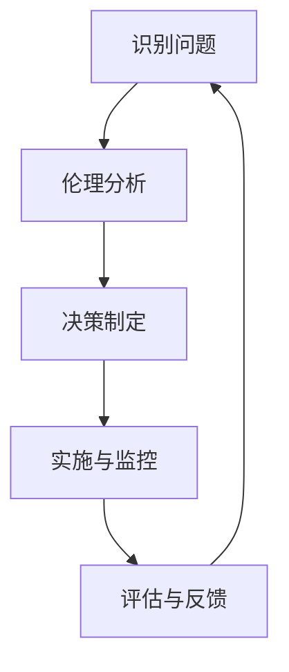

                 

### 文章标题：AI伦理：人工智能开发中的伦理决策

#### 关键词：
- 人工智能伦理
- 伦理决策
- 人工智能开发
- 伦理框架
- 数据隐私
- AI 偏见

#### 摘要：
随着人工智能技术的迅猛发展，其在社会各个领域的应用日益广泛。然而，AI 技术的快速进步也带来了诸多伦理挑战。本文将深入探讨人工智能开发中的伦理决策，分析其背景、核心概念、决策流程以及具体案例。通过对 AI 伦理的全面解析，旨在为 AI 开发者提供伦理决策的指导，促进人工智能技术的健康可持续发展。

---

### 引言

#### AI伦理的崛起

人工智能（AI）作为当代科技领域的前沿，其应用范围已经渗透到社会的方方面面。从智能家居到自动驾驶，从医疗诊断到金融服务，AI 技术的无所不在使得其对社会的影响愈发深远。然而，AI 技术的快速进步也引发了诸多伦理问题。例如，数据隐私泄露、AI 偏见、以及人工智能武器化等，这些挑战不仅关乎技术本身，更关乎社会的公平、正义和可持续发展。

#### 人工智能开发中的伦理挑战

在 AI 开发过程中，伦理问题不仅存在于技术层面，还涉及社会、经济和政治等多个维度。以下是几个典型的伦理挑战：

1. **数据隐私**：人工智能依赖于大量的数据，而这些数据的来源往往涉及到个人隐私。如何保护用户隐私，防止数据滥用，成为 AI 开发中的重要伦理问题。
2. **AI 偏见**：AI 系统在训练过程中可能会受到数据偏见的影响，从而产生对某些群体的不公平对待。这既包括性别、种族等方面的歧视，也涉及到算法歧视。
3. **人工智能武器化**：随着 AI 技术在军事领域的应用，人工智能武器化的问题日益凸显。如何防止 AI 武器落入不法分子手中，确保其不被用于非法目的，成为国际社会关注的焦点。

#### 阅读指南

本文旨在为 AI 开发者和相关从业者提供一套系统的伦理决策框架，帮助他们在开发过程中识别并解决伦理问题。文章将从以下几个方面展开：

1. **AI伦理基础概念**：介绍 AI 伦理的基本原理和核心原则。
2. **AI伦理决策流程**：详细阐述伦理决策的步骤和工具。
3. **AI伦理案例分析**：通过具体案例探讨 AI 伦理决策的实际应用。
4. **AI伦理挑战与展望**：分析 AI 伦理面临的挑战和未来发展趋势。

通过本文的阅读，读者将能够：

- 理解 AI 伦理的基本概念和重要性。
- 掌握 AI 伦理决策的流程和工具。
- 通过案例分析，增强对 AI 伦理问题的认识。
- 思考 AI 伦理的未来发展趋势，为未来的 AI 开发提供指导。

### 目录大纲设计步骤

#### 确定书籍主题和目标读者

书籍的主题是《AI伦理：人工智能开发中的伦理决策》，目标读者包括 AI 开发者、伦理学者、企业决策者等。通过对目标读者的分析，可以明确书籍的内容应具备的深度和广度，以及如何满足读者的需求。

#### 构建核心章节

核心章节应涵盖 AI 伦理的基础概念、决策流程、案例分析以及未来展望。每个章节都需要有明确的主题和目标，确保内容的系统性和逻辑性。

#### 细化章节内容

在构建核心章节的基础上，需要对每个章节进行细化。例如，AI 伦理的基础概念部分可以细化为 AI 伦理的定义、核心原则、伦理框架等；决策流程部分可以细化为问题识别、伦理分析、决策制定等。

#### 设计流程图

使用 Mermaid 等工具设计 AI 伦理框架和相关流程图，以直观展示概念和流程。流程图可以帮助读者更好地理解伦理决策的步骤和逻辑。

#### 编写伪代码和数学模型

对于核心算法原理，需要使用伪代码详细阐述。同时，对于数学模型和公式，使用 latex 格式进行详细讲解，以确保表达的准确性和专业性。

#### 案例与实践

设计实际案例，展示如何在实际开发中进行伦理决策。提供代码实现和解读，帮助读者理解具体操作。

#### 总结与展望

在文章的结尾部分，对全书要点进行总结，并对未来的 AI 伦理发展进行展望。

#### 确保字数限制

确保整个目录大纲的总字数在 2000 字以内，确保内容的紧凑性和可读性。

#### 目录大纲设计方案

根据上述步骤，我们可以设计出以下目录大纲：

## 第一部分 引言

### 1.1 书籍背景与目标

- AI伦理的崛起
- 人工智能开发中的伦理挑战
- 阅读指南

### 1.2 目录大纲结构设计

- 确定主题和目标读者
- 构建核心章节
- 细化章节内容
- 设计流程图
- 编写伪代码和数学模型
- 案例与实践
- 总结与展望
- 确保字数限制

## 第二部分 AI伦理基础概念

### 2.1 AI伦理的定义与意义

- AI伦理的定义
- AI伦理在人工智能开发中的重要性

### 2.2 AI伦理的核心原则

- 公正性
- 可解释性
- 安全性
- 隐私保护

### 2.3 AI伦理框架

- 全球AI伦理框架
- 国家级AI伦理框架
- 企业级AI伦理框架

## 第三部分 AI伦理决策流程

### 3.1 伦理决策的步骤

- 问题识别
- 伦理分析
- 决策制定
- 实施与监控

### 3.2 伦理决策工具与技术

- 常见的伦理决策工具
- 伦理决策支持系统

### 3.3 伦理决策的实际案例

- 案例分析
- 案例解读

## 第四部分 AI伦理案例分析

### 4.1 数据隐私与隐私泄露

- 案例介绍
- 案例分析
- 伦理决策

### 4.2 AI偏见与歧视

- 案例介绍
- 案例分析
- 伦理决策

### 4.3 AI武器化与战争伦理

- 案例介绍
- 案例分析
- 伦理决策

### 4.4 AI辅助医疗决策

- 案例介绍
- 案例分析
- 伦理决策

## 第五部分 AI伦理的挑战与展望

### 5.1 AI伦理面临的挑战

- 技术发展的速度
- 全球治理的协调
- 社会接受度

### 5.2 AI伦理的未来发展趋势

- 技术进步带来的变革
- 社会责任的增加
- 全球合作的重要性

## 附录

### 6.1 AI伦理相关资源

- 学术论文
- 报告
- 组织与机构

### 6.2 Mermaid流程图示例

- AI伦理决策流程图
- 数据隐私保护流程图

通过以上目录大纲的设计，我们可以确保文章内容的完整性和逻辑性，同时满足字数限制，为读者提供一篇高质量的技术博客文章。接下来，我们将逐步展开每个章节的内容，详细阐述 AI 伦理的相关概念和决策流程。

---

### 第二部分 AI伦理基础概念

在深入探讨 AI 伦理决策之前，我们首先需要了解 AI 伦理的基本概念和核心原则。AI 伦理是指关于人工智能技术的道德和伦理问题，它关注人工智能系统对社会、环境和人类福祉的影响。AI 伦理不仅包括技术层面的问题，还涉及到法律、社会、文化和经济等多个维度。

#### 2.1 AI伦理的定义与意义

AI 伦理的定义可以从多个角度进行理解。从技术角度来看，AI 伦理关注的是如何确保人工智能系统的可靠性和透明度，以及如何减少技术偏见和不公平。从社会角度来看，AI 伦理关注的是人工智能技术对社会结构和人类价值观的影响，以及如何保护用户的隐私和数据安全。从法律角度来看，AI 伦理涉及到人工智能技术是否符合现有的法律法规，以及如何制定新的法律法规来规范人工智能的发展。

AI 伦理在人工智能开发中的重要性不言而喻。首先，伦理问题是人工智能技术能否可持续发展的关键。如果一个技术系统缺乏伦理指导，可能会导致严重的社会问题，如隐私侵犯、数据滥用、偏见歧视等。其次，伦理问题也是企业和社会公众对人工智能技术的信任基础。如果公众对 AI 技术的伦理问题感到不安，可能会对 AI 技术的接受度和应用范围产生负面影响。

#### 2.2 AI伦理的核心原则

AI 伦理的核心原则是指导人工智能开发和应用的道德准则。以下是几个重要的核心原则：

1. **公正性**：AI 系统应确保公平对待所有用户，不应因性别、种族、年龄、地域等因素而产生歧视。公正性要求算法在决策过程中保持客观和公正。

2. **可解释性**：AI 系统的决策过程应具有可解释性，使得用户能够理解算法的决策依据。可解释性有助于增强用户对 AI 系统的信任，并有助于识别和纠正潜在的错误。

3. **安全性**：AI 系统应确保其稳定性和安全性，以防止恶意攻击和意外故障。安全性要求在设计和开发过程中考虑到潜在的安全风险，并采取相应的措施进行防范。

4. **隐私保护**：AI 系统应尊重用户的隐私权利，确保用户数据的安全和保护。隐私保护要求在数据处理过程中遵循隐私保护原则，如数据匿名化、权限控制和数据最小化等。

#### 2.3 AI伦理框架

AI 伦理框架是指导人工智能开发和应用的系统化指南。不同国家和组织有不同的 AI 伦理框架，但它们通常包含以下关键要素：

1. **基本原则**：明确 AI 伦理的核心原则，如公正性、可解释性、安全性和隐私保护等。

2. **伦理决策流程**：提供伦理决策的具体步骤和方法，如问题识别、伦理分析、决策制定和实施与监控等。

3. **伦理责任分配**：明确各方在 AI 伦理决策中的责任和角色，如开发者、用户、企业和社会等。

4. **法律法规遵循**：确保 AI 开发和应用符合现有的法律法规，并提供法律法规遵循的具体指南。

5. **伦理审查和监督**：建立伦理审查和监督机制，确保 AI 项目的伦理决策过程得到有效执行和监督。

#### 2.4 全球AI伦理框架

全球范围内，多个组织和机构发布了 AI 伦理框架，以下是一些重要的框架：

1. **欧盟人工智能伦理准则**：欧盟委员会发布了《人工智能伦理准则》，明确了人工智能在伦理、隐私、公平性和透明性等方面的要求。

2. **联合国 AI 指南**：联合国教科文组织发布了《人工智能伦理指南》，旨在促进全球范围内的人工智能伦理发展。

3. **美国国家人工智能委员会**：美国国家人工智能委员会发布了《美国人工智能伦理原则》，提出了人工智能在隐私、安全、透明性等方面的伦理要求。

#### 2.5 国家级AI伦理框架

不同国家根据自己的国情和发展阶段，制定了符合本国国情的 AI 伦理框架。例如：

1. **中国 AI 伦理准则**：中国发布了《中国人工智能伦理准则》，明确了人工智能在道德、法律和社会责任等方面的要求。

2. **印度 AI 伦理框架**：印度政府发布了《印度人工智能伦理框架》，旨在确保人工智能技术的道德和社会责任。

#### 2.6 企业级AI伦理框架

企业级 AI 伦理框架是企业在开发和应用人工智能技术时遵循的伦理准则。例如：

1. **谷歌 AI 伦理原则**：谷歌发布了《谷歌 AI 伦理原则》，明确了人工智能在公平性、隐私和安全等方面的要求。

2. **微软 AI 伦理指南**：微软发布了《微软 AI 伦理指南》，提出了人工智能在道德责任、透明性和隐私保护等方面的要求。

通过上述核心概念和框架的介绍，我们可以更好地理解 AI 伦理的基本原理和重要性。接下来，我们将详细阐述 AI 伦理决策的流程，帮助读者在实际开发中应用伦理决策原则。

---

### 第三部分 AI伦理决策流程

#### 3.1 伦理决策的步骤

在人工智能开发过程中，伦理决策是一个系统化、持续性的过程。有效的伦理决策不仅有助于确保技术的道德合法性，还能增强用户对 AI 系统的信任。以下是伦理决策的主要步骤：

1. **问题识别**：
   - 识别 AI 应用场景中可能存在的伦理问题，如数据隐私、算法偏见、安全风险等。
   - 收集相关数据和信息，包括技术背景、用户需求和社会影响等。

2. **伦理分析**：
   - 分析问题的影响范围和严重程度，确定问题的优先级。
   - 评估现有法律法规和伦理准则，确定适用的伦理框架。

3. **决策制定**：
   - 基于伦理分析和评估结果，制定具体的伦理决策方案。
   - 考虑不同的解决方案，权衡利弊，选择最符合伦理要求的方案。

4. **实施与监控**：
   - 实施决策方案，确保其有效执行。
   - 建立监控机制，定期评估伦理决策的实施效果，并根据反馈进行调整。

#### 3.2 伦理决策工具与技术

为了提高伦理决策的效率和质量，开发者可以借助以下工具和技术：

1. **伦理决策框架**：
   - 使用系统化的伦理决策框架，如欧盟的人工智能伦理准则、谷歌的 AI 伦理原则等，作为决策的基础。
   - 制定企业内部的伦理决策指南，确保团队成员在面临伦理问题时有一致的标准和流程。

2. **伦理决策支持系统**：
   - 开发专门用于伦理决策支持的系统，如伦理分析工具、伦理评估模型等，帮助开发者进行伦理分析和决策。
   - 利用自然语言处理和机器学习技术，自动识别和分类潜在伦理问题，提供决策建议。

3. **伦理培训与意识提升**：
   - 对开发人员进行伦理培训，提高其对 AI 伦理问题的认识和理解。
   - 定期组织伦理研讨和交流活动，增强团队在伦理决策方面的协作和沟通。

#### 3.3 伦理决策的实际案例

以下是一个实际案例，展示了如何在人工智能开发中进行伦理决策：

**案例：自动驾驶汽车的伦理决策**

背景：自动驾驶汽车技术在不断发展，但其在实际应用中面临诸多伦理挑战，如交通事故责任、道德选择等。

问题识别：
- 如何确保自动驾驶汽车在紧急情况下做出道德选择？
- 如何处理自动驾驶汽车与其他交通参与者之间的冲突？

伦理分析：
- 分析现有法律法规，如道路安全法规、交通事故处理规定等。
- 评估不同道德选择对用户、社会和环境的影响。

决策制定：
- 基于伦理分析和法律法规，制定自动驾驶汽车的伦理决策框架。
- 例如，设计一个“最小伤害原则”，在紧急情况下尽可能减少伤亡。

实施与监控：
- 在自动驾驶汽车系统中实现伦理决策框架，确保其在实际操作中有效执行。
- 定期评估决策效果，收集用户反馈，持续优化决策算法。

通过以上案例，我们可以看到，伦理决策是一个复杂而系统的过程。开发者需要综合考虑技术、法律、社会和伦理等多个因素，确保人工智能系统在道德和法律上的一致性。这不仅有助于保护用户权益，还能促进人工智能技术的可持续发展。

接下来，我们将通过具体案例分析，进一步探讨 AI 伦理决策在实际应用中的挑战和解决方案。

---

### 第四部分 AI伦理案例分析

在上一部分中，我们讨论了 AI 伦理决策的步骤和工具。为了更好地理解这些理论如何在实际中应用，我们将通过几个具体案例来探讨 AI 伦理面临的挑战及其解决方案。

#### 4.1 数据隐私与隐私泄露

**案例：Facebook 数据泄露事件**

背景：2018年，Facebook 数据泄露事件震惊全球。事件中，超过8700万用户的数据被不当使用，用于政治广告定向投放。

问题识别：
- 数据隐私如何得到保护？
- 数据收集和使用过程中的伦理问题是什么？

伦理分析：
- 数据泄露事件揭示了数据隐私保护的严重问题。
- 分析表明，数据滥用可能导致用户隐私侵犯、信任度下降以及社会不公平。

决策制定：
- Facebook 在事件后采取了一系列措施，包括加强数据保护法规、改进隐私设置、加强用户教育等。

实施与监控：
- 实施新的数据保护措施，如数据匿名化、权限控制和透明度提升。
- 建立持续监控机制，确保隐私保护措施得到有效执行。

**解决方案**：
- 强化法律法规，确保数据收集和使用过程透明。
- 采用技术手段，如数据加密和区块链技术，提高数据安全性。

#### 4.2 AI偏见与歧视

**案例：亚马逊招聘算法偏见**

背景：2018年，亚马逊的招聘算法被曝存在性别偏见，对女性求职者的评估明显低于男性。

问题识别：
- 如何避免 AI 算法中的偏见和歧视？
- 偏见如何影响社会公平和多元化？

伦理分析：
- 偏见源于训练数据中的不公平或错误，可能导致算法决策的不公正。
- 分析表明，算法偏见可能加剧社会不平等，影响职业发展和社会公正。

决策制定：
- 亚马逊承诺改进其算法，确保其评估过程公平。
- 引入多样性培训和监督机制，减少算法偏见。

实施与监控：
- 对算法进行定期审查和调整，确保其评估过程透明和公平。
- 建立多样性委员会，监督和指导算法改进工作。

**解决方案**：
- 使用多样化的训练数据，提高算法的公平性。
- 定期评估和审核算法，确保其不会产生偏见。

#### 4.3 AI武器化与战争伦理

**案例：无人机自主攻击系统**

背景：无人机自主攻击系统（Lethal Autonomous Weapons Systems，LAWS）在军事应用中引起伦理争议。

问题识别：
- 如何确保 AI 武器系统的道德合法性？
- 自主攻击系统的伦理问题是什么？

伦理分析：
- LAWS 在决策过程中缺乏人类监督，可能导致道德风险和误伤。
- 分析表明，自主攻击系统可能被滥用，引发战争伦理问题。

决策制定：
- 国际社会呼吁禁止自主攻击系统，以防止其滥用。
- 制定国际准则，确保 AI 武器系统在道德和法律框架内使用。

实施与监控：
- 强化国际监管和合作，确保自主攻击系统的使用符合伦理标准。
- 建立透明度和责任机制，确保决策过程可追溯和可审查。

**解决方案**：
- 禁止完全自主的 AI 武器系统，要求人类在关键决策中参与。
- 制定详细的操作规程和责任分配，确保道德责任明确。

#### 4.4 AI辅助医疗决策

**案例：医疗诊断 AI 算法偏见**

背景：一些 AI 医疗诊断算法被发现对某些种族或性别的人群存在偏见。

问题识别：
- 如何确保 AI 医疗决策的公平性和准确性？
- 算法偏见如何影响患者治疗？

伦理分析：
- 算法偏见可能导致误诊和治疗方案的不公，影响患者健康。
- 分析表明，医疗数据的多样性不足是导致偏见的主要原因。

决策制定：
- 医疗机构承诺改进算法，确保其公平性和准确性。
- 收集更多多样化的医疗数据，提高算法的代表性。

实施与监控：
- 定期审查和更新算法，确保其不受偏见影响。
- 建立患者反馈机制，及时调整算法和治疗方案。

**解决方案**：
- 加强医疗数据的多样性和代表性，减少算法偏见。
- 定期评估和审计算法性能，确保其符合伦理标准。

通过这些案例，我们可以看到，AI 伦理问题在具体应用中具有复杂性和多样性。有效的伦理决策需要综合考虑技术、法律、社会和伦理等多个因素，确保人工智能系统的道德合法性和社会责任。这些案例也为未来的 AI 开发提供了宝贵的经验和教训。

---

### 第五部分 AI伦理的挑战与展望

#### 5.1 AI伦理面临的挑战

随着人工智能技术的不断进步，AI 伦理面临着一系列严峻的挑战。以下是其中几个主要的挑战：

1. **技术发展的速度**：
   - AI 技术的发展速度远超过伦理和法律规范的更新速度，导致许多伦理问题得不到及时解决。
   - 新技术的快速迭代使得现有伦理框架和决策工具难以适应，增加了伦理风险。

2. **全球治理的协调**：
   - 不同国家和地区在 AI 伦理标准上存在差异，缺乏统一的全球治理框架，导致国际合作的难度加大。
   - 全球治理的不统一可能引发伦理问题上的竞争和冲突。

3. **社会接受度**：
   - 公众对 AI 技术的接受度和信任度较低，尤其是在涉及隐私、安全等问题时。
   - 社会接受度的不足可能限制 AI 技术的推广和应用，影响其社会价值。

#### 5.2 AI伦理的未来发展趋势

尽管面临诸多挑战，AI 伦理的未来发展趋势依然充满希望。以下是几个可能的发展方向：

1. **技术进步带来的变革**：
   - 人工智能技术的发展将继续推动伦理问题的深入研究和探讨，促使伦理规范和决策工具不断更新和完善。
   - 新技术的出现，如量子计算、区块链等，可能为解决某些伦理问题提供新的方法和工具。

2. **社会责任的增加**：
   - 企业和社会各界将更加重视 AI 伦理问题，加强社会责任感，推动 AI 技术的可持续发展。
   - 企业内部的伦理培训和文化建设将得到进一步重视，提高开发者的伦理意识和决策能力。

3. **全球合作的重要性**：
   - 国际社会将加强合作，共同制定全球性的 AI 伦理标准和法规，促进全球治理的协调。
   - 通过跨国合作和经验分享，提升全球 AI 伦理的水平和应用效果。

总之，AI 伦理的未来充满机遇和挑战。通过持续的研究和实践，我们可以逐步解决 AI 伦理问题，促进人工智能技术的健康、可持续发展。

---

### 附录

#### 6.1 AI伦理相关资源

以下是一些关于 AI 伦理的重要资源，供读者进一步学习和研究：

1. **学术论文**：
   - “The Ethics of Artificial Intelligence” by Luciano Floridi
   - “AI, Bias, and Accountability” by Timnit Gebru and Margaret Mitchell

2. **报告**：
   - “Artificial Intelligence and Global Governance” by the United Nations
   - “The AI Now Report” by the AI Now Institute

3. **组织与机构**：
   - “Center for Ethical Artificial Intelligence” (CEAI)
   - “IEEE Global Initiative on Ethics of Autonomous and Intelligent Systems”

#### 6.2 Mermaid流程图示例

以下是一个使用 Mermaid 工具绘制的 AI 伦理决策流程图示例：

该流程图展示了 AI 伦理决策的基本步骤，以及这些步骤之间的循环关系。

---

### 总结

本文系统地探讨了人工智能开发中的伦理决策问题。通过介绍 AI 伦理的基本概念、核心原则、决策流程和具体案例，我们帮助读者理解了 AI 伦理的重要性及其在实践中的应用。随着人工智能技术的不断进步，AI 伦理问题将成为技术开发、社会管理和国际治理中的重要议题。我们期待读者在未来的 AI 开发中，能够充分考虑伦理因素，推动人工智能技术的健康、可持续发展。

### 作者信息

**作者：AI天才研究院/AI Genius Institute & 禅与计算机程序设计艺术 /Zen And The Art of Computer Programming**

