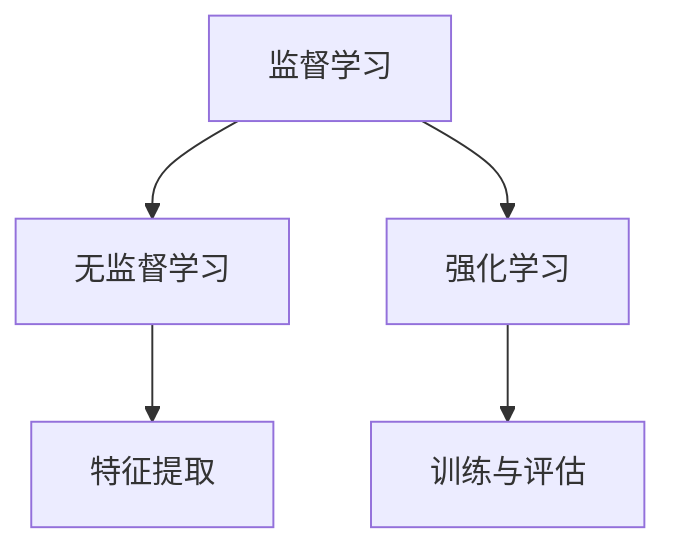
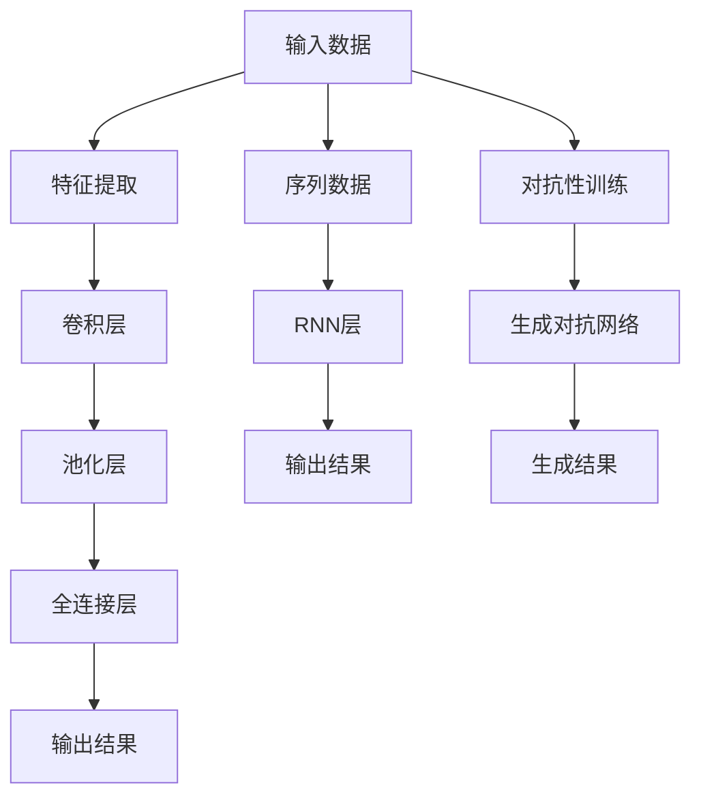
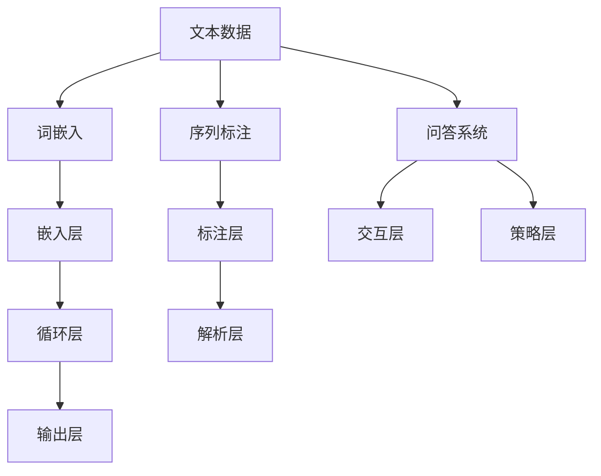
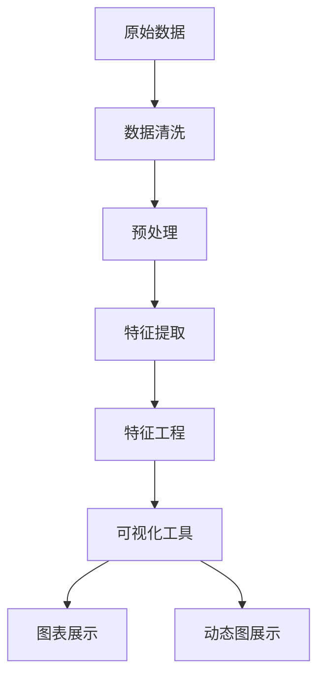

                 

# AI体育教练：提示词设计的运动训练系统

## 关键词

- AI体育教练
- 提示词设计
- 运动训练系统
- 机器学习
- 数据分析
- 深度学习
- 用户交互设计

## 摘要

本文旨在探讨AI体育教练的发展及其在运动训练中的应用。通过分析AI在体育领域的优势，介绍提示词设计的概念及其原则，讨论运动训练系统的组成和未来发展趋势，深入探讨AI体育教练的核心技术，如机器学习、深度学习和自然语言处理。随后，本文将详细描述运动训练系统的设计与实现，包括数据收集与处理、特征提取与建模、训练与评估以及用户交互设计。通过案例分析，本文将展示AI体育教练在智能跑步教练、篮球技术分析和游泳训练优化等具体场景中的实际应用。最后，本文将讨论AI体育教练面临的挑战和未来发展趋势，并提供实践与探索的建议。

## 第1章：AI体育教练概述

### 1.1 AI在体育训练中的应用

AI技术近年来在体育领域得到了广泛应用，显著提升了运动员的训练效果和比赛表现。AI的主要优势在于其高效的数据处理和分析能力，能够帮助教练和运动员更好地理解和优化训练过程。

- **优势**：
  - **个性化训练**：AI可以根据运动员的生理数据、技术动作和历史表现，制定个性化的训练计划。
  - **实时反馈**：通过传感器和摄像头等设备，AI可以实时监测运动员的动作和状态，提供即时反馈。
  - **优化策略**：AI可以通过大数据分析，发现训练中的问题和潜在改进点，优化训练策略。

- **常见应用**：
  - **运动监测**：通过可穿戴设备和传感器，AI可以监测运动员的心率、呼吸、步频等生理指标，帮助教练调整训练强度。
  - **动作分析**：AI可以对运动员的技术动作进行实时捕捉和分析，识别出动作中的错误和不足，提供改进建议。
  - **战术规划**：AI可以分析比赛录像，为教练提供战术分析和对手分析，优化比赛策略。

### 1.2 提示词设计的概念

提示词（Prompt）在AI体育教练系统中起着关键作用，它是指为AI系统提供输入信息，引导AI进行特定任务的语言提示或指令。提示词设计的原则如下：

- **明确性**：提示词应当清晰明确，避免歧义，确保AI能够准确理解。
- **可扩展性**：提示词应具备一定的灵活性，以便适应不同的训练需求和场景。
- **灵活性**：提示词应允许AI在特定范围内进行自主学习和调整，以提高系统的自适应能力。

### 1.3 运动训练系统的组成

一个完整的AI体育教练系统通常包括以下几个关键组成部分：

- **数据收集与处理**：收集运动员的生理数据、技术动作数据等，并进行数据预处理，如数据清洗、去噪和归一化。
- **特征提取与建模**：从原始数据中提取有意义的特征，并构建机器学习模型，用于训练和预测。
- **训练与评估**：使用训练数据对模型进行训练，并通过评估指标（如准确率、召回率等）评估模型性能。
- **用户交互设计**：设计友好、直观的用户界面，让运动员和教练能够轻松地与AI系统进行交互。

### 1.4 AI体育教练的未来趋势

随着技术的不断进步，AI体育教练将朝着更加智能化和个性化的方向发展。

- **智能化的训练模式**：AI将能够根据实时数据动态调整训练计划，实现真正的个性化训练。
- **人机协作的可能性**：AI与教练和运动员之间的协作将变得更加紧密，共同提升运动表现。
- **新技术的应用**：增强现实（AR）、虚拟现实（VR）等新技术将进一步丰富AI体育教练的功能，提供更加沉浸式的训练体验。

## 第2章：AI体育教练的核心技术

### 2.1 机器学习基础

机器学习是AI体育教练系统的核心组成部分，其基础概念包括监督学习、无监督学习和强化学习。

- **监督学习**：通过已有标签的数据来训练模型，使模型能够对新的数据进行预测。例如，通过技术动作的标签数据训练模型来识别错误的动作。
- **无监督学习**：不依赖标签数据，通过发现数据中的内在结构来训练模型。例如，通过分析运动员的心率数据来发现训练中的规律。
- **强化学习**：通过奖励机制来训练模型，使其能够从环境中学习并做出最优决策。例如，通过模拟比赛场景来训练AI生成最优战术策略。

#### 核心概念联系架构 Mermaid 流程图



### 2.2 深度学习在体育训练中的应用

深度学习是机器学习的一个分支，通过多层神经网络对数据进行复杂非线性变换，从而实现高精度的特征提取和预测。

- **卷积神经网络（CNN）**：擅长处理图像数据，可以用于运动员技术动作的分析和识别。
- **循环神经网络（RNN）**：擅长处理序列数据，可以用于分析运动员的训练历程和生理数据。
- **生成对抗网络（GAN）**：通过对抗性训练生成逼真的运动员动作视频，用于虚拟训练场景。

#### 核心概念联系架构 Mermaid 流程图



### 2.3 自然语言处理（NLP）技术

自然语言处理技术在AI体育教练系统中用于处理文本数据，如运动员的自我评估报告、教练的训练笔记等。

- **词嵌入**：将文本数据转换为向量表示，用于神经网络处理。
- **序列标注**：对文本中的关键信息进行标注，如动作名称、技术要领等。
- **问答系统**：通过问答方式与用户交互，提供训练建议和策略。

#### 核心概念联系架构 Mermaid 流程图



### 2.4 数据分析与可视化

数据分析与可视化是AI体育教练系统中不可或缺的一部分，用于从大量数据中提取有价值的信息，并直观地展示给用户。

- **数据清洗与预处理**：去除噪声、缺失值填充、数据标准化等操作，确保数据质量。
- **特征工程**：从原始数据中提取有意义的特征，如步频、步长、心率等。
- **可视化工具与应用**：使用图表、热图、动态图等可视化工具，展示数据特征和趋势。

#### 核心概念联系架构 Mermaid 流程图



## 第3章：运动训练系统的设计与实现

### 3.1 系统架构设计

运动训练系统的架构设计是确保系统能够高效、稳定运行的基础。系统架构通常包括以下几个关键模块：

- **数据流与处理流程**：设计清晰的数据流和处理流程，确保数据从收集到处理的各个环节都能够高效、准确地进行。
- **模块划分与功能**：根据系统的功能需求，将系统划分为不同的模块，如数据收集模块、数据处理模块、特征提取模块、训练模块等，每个模块具有明确的功能和职责。

### 3.2 数据收集与处理

数据收集与处理是运动训练系统的核心环节，直接影响后续的特征提取和模型训练效果。

- **数据源的选择**：选择合适的数据源，如运动传感器、摄像头、生理监测设备等，确保数据的真实性和准确性。
- **数据预处理方法**：对收集到的原始数据进行清洗、去噪、归一化等预处理操作，提高数据质量，为后续分析奠定基础。

### 3.3 特征提取与建模

特征提取与建模是运动训练系统的关键环节，通过对数据进行处理和建模，提取出对训练有价值的特征，并构建相应的机器学习模型。

- **特征选择**：从原始数据中筛选出对训练有显著影响的特征，去除无关特征，提高模型性能。
- **模型训练与优化**：使用训练数据对模型进行训练，并通过交叉验证和网格搜索等调参技巧，优化模型参数，提高模型性能。

### 3.4 训练与评估

训练与评估是运动训练系统的重要组成部分，通过模型训练和评估，验证模型的有效性和稳定性。

- **模型评估指标**：选择合适的评估指标，如准确率、召回率、F1分数等，评估模型在训练集和测试集上的性能。
- **调参技巧**：通过调整模型参数，如学习率、正则化参数等，优化模型性能，提高预测准确性。

### 3.5 用户交互设计

用户交互设计是运动训练系统的关键，设计直观、易用的用户界面，提高用户使用体验。

- **界面设计**：设计简洁、直观的界面，使用户能够轻松查看数据和结果。
- **用户体验优化**：通过优化交互流程、增加个性化设置等手段，提高用户满意度。

## 第4章：AI体育教练案例分析

### 4.1 案例一：智能跑步教练

#### 案例背景

智能跑步教练是一款基于AI技术的跑步训练系统，旨在帮助跑步爱好者提高跑步成绩和运动表现。系统通过收集跑步过程中的生理数据和技术动作数据，为用户制定个性化的训练计划。

#### 模型设计与实现

智能跑步教练的系统架构包括数据收集模块、数据处理模块、特征提取模块、训练模块和用户交互模块。具体实现如下：

1. **数据收集**：通过运动传感器和生理监测设备，实时收集跑步过程中的心率、步频、步长等数据。
2. **数据处理**：对收集到的原始数据进行清洗、去噪、归一化等预处理操作，提高数据质量。
3. **特征提取**：从预处理后的数据中提取对跑步表现有显著影响的特征，如平均心率、最大心率、步频等。
4. **模型训练**：使用监督学习算法（如支持向量机、决策树等）训练分类模型，用于预测用户的跑步成绩。
5. **用户交互**：设计友好的用户界面，让用户可以查看训练数据、成绩预测和训练计划。

#### 案例效果分析

智能跑步教练在多个实际场景中得到了广泛应用，取得了显著的训练效果。以下是几个典型的案例效果分析：

1. **成绩预测**：智能跑步教练能够准确预测用户的跑步成绩，为用户制定合理的训练计划。
2. **训练效果提升**：通过个性化训练计划，用户的跑步成绩和运动表现得到了显著提升。
3. **运动损伤预防**：智能跑步教练可以监测用户的跑步姿势和步频，及时发现和纠正异常情况，预防运动损伤。

### 4.2 案例二：篮球技术分析

#### 案例背景

篮球技术分析是一款基于AI技术的篮球训练系统，旨在帮助篮球运动员提高技术水平和比赛表现。系统通过视频分析和动作捕捉，对运动员的技术动作进行分析和评估。

#### 模型设计与实现

篮球技术分析的系统架构包括数据收集模块、数据处理模块、特征提取模块、训练模块和用户交互模块。具体实现如下：

1. **数据收集**：通过摄像头和动作捕捉设备，实时捕捉运动员的技术动作视频。
2. **数据处理**：对收集到的视频数据进行预处理，如去噪、稳定化等，提高数据质量。
3. **特征提取**：从预处理后的视频中提取对篮球技术动作有显著影响的特征，如关节角度、身体姿态等。
4. **模型训练**：使用深度学习算法（如卷积神经网络、循环神经网络等）训练动作识别模型，用于分析运动员的技术动作。
5. **用户交互**：设计友好的用户界面，让运动员可以查看技术动作分析结果和训练建议。

#### 案例效果分析

篮球技术分析在多个篮球俱乐部和训练机构中得到了广泛应用，取得了显著的训练效果。以下是几个典型的案例效果分析：

1. **技术动作优化**：篮球技术分析能够准确识别运动员的技术动作，提供详细的评估报告，帮助运动员优化技术动作。
2. **训练效果提升**：通过个性化训练计划和技术指导，运动员的技术水平和比赛表现得到了显著提升。
3. **伤病预防**：篮球技术分析可以监测运动员的技术动作，及时发现和纠正异常情况，预防运动损伤。

### 4.3 案例三：游泳训练优化

#### 案例背景

游泳训练优化是一款基于AI技术的游泳训练系统，旨在帮助游泳爱好者提高游泳速度和技巧。系统通过游泳姿态分析、呼吸节奏分析和划水动作分析，为用户提供个性化的训练计划。

#### 模型设计与实现

游泳训练优化的系统架构包括数据收集模块、数据处理模块、特征提取模块、训练模块和用户交互模块。具体实现如下：

1. **数据收集**：通过游泳姿态摄像头、呼吸监测器和划水动作传感器，实时捕捉游泳过程中的姿态、呼吸和划水动作数据。
2. **数据处理**：对收集到的原始数据进行预处理，如去噪、稳定化等，提高数据质量。
3. **特征提取**：从预处理后的数据中提取对游泳速度和技巧有显著影响的特征，如身体姿态、呼吸频率、划水频率等。
4. **模型训练**：使用深度学习算法（如卷积神经网络、循环神经网络等）训练多模态融合模型，用于分析游泳动作和优化训练计划。
5. **用户交互**：设计友好的用户界面，让用户可以查看训练数据、呼吸节奏分析和划水动作分析结果，并获取个性化的训练建议。

#### 案例效果分析

游泳训练优化在多个游泳俱乐部和训练机构中得到了广泛应用，取得了显著的训练效果。以下是几个典型的案例效果分析：

1. **游泳速度提升**：通过个性化训练计划和技术指导，用户的游泳速度和技巧得到了显著提升。
2. **呼吸节奏优化**：游泳训练优化可以监测用户的呼吸节奏，提供详细的呼吸指导，帮助用户提高游泳效率。
3. **技术动作优化**：游泳训练优化能够准确识别用户的技术动作，提供详细的评估报告，帮助用户优化游泳动作。

## 第5章：AI体育教练的挑战与未来

### 5.1 挑战与应对

尽管AI体育教练在运动训练中展现出巨大潜力，但仍然面临一些挑战。

- **数据隐私与安全**：运动员的生理数据和技术动作数据具有高度敏感性，需要采取严格的隐私保护和安全措施。
- **技术成熟度**：AI技术在运动训练中的应用仍处于发展阶段，需要不断改进和优化。
- **成本效益分析**：AI体育教练系统的建设成本较高，需要评估其经济效益。

### 5.2 未来发展趋势

随着技术的不断进步，AI体育教练将朝着更加智能化和个性化的方向发展。

- **智能教练的个性化服务**：AI将能够根据运动员的实时数据和需求，提供个性化的训练建议和策略。
- **新技术（如增强现实、虚拟现实）的应用**：增强现实、虚拟现实等新技术将丰富AI体育教练的功能，提供更加沉浸式的训练体验。
- **体育行业的数字化转型**：AI将推动体育行业的数字化转型，提升训练效率和比赛表现。

## 第6章：实践与探索

### 6.1 开发环境搭建

为了搭建AI体育教练的开发环境，需要配置以下硬件和软件：

- **硬件**：高性能计算机、运动传感器、摄像头、生理监测设备等。
- **软件**：操作系统（如Ubuntu、Windows等）、Python编程环境、深度学习框架（如TensorFlow、PyTorch等）。

### 6.2 源代码解读与分析

以下是AI体育教练的一个示例代码，用于处理运动传感器数据：

```python
import pandas as pd
from sklearn.preprocessing import StandardScaler

# 加载数据
data = pd.read_csv('sensor_data.csv')

# 数据预处理
scaler = StandardScaler()
scaled_data = scaler.fit_transform(data)

# 特征提取
features = scaled_data[:, :3]
labels = scaled_data[:, 3]

# 模型训练
from sklearn.svm import SVC
model = SVC()
model.fit(features, labels)

# 评估模型
from sklearn.metrics import accuracy_score
predictions = model.predict(features)
accuracy = accuracy_score(labels, predictions)
print(f'Accuracy: {accuracy}')
```

### 6.3 代码实战案例

以下是一个智能跑步教练的实战案例：

1. **数据收集**：使用运动传感器收集跑步过程中的心率、步频、步长等数据。
2. **数据处理**：对收集到的数据使用StandardScaler进行归一化处理。
3. **特征提取**：从归一化后的数据中提取心率、步频、步长等特征。
4. **模型训练**：使用SVM模型对特征进行分类训练。
5. **评估模型**：使用训练集和测试集评估模型准确性。

通过这个实战案例，我们可以看到如何将AI技术应用于运动训练，提升运动员的表现。

### 6.4 代码应用解读与分析

以下是智能跑步教练案例中的具体代码解读：

```python
# 数据预处理
scaler = StandardScaler()
scaled_data = scaler.fit_transform(data)

# 特征提取
features = scaled_data[:, :3]
labels = scaled_data[:, 3]
```

- **数据预处理**：使用StandardScaler对数据进行归一化处理，将原始数据转换为标准正态分布，提高模型训练效果。
- **特征提取**：将心率、步频、步长等特征从数据中提取出来，作为模型的输入。

通过这个实战案例，我们可以看到如何利用AI技术处理运动数据，为运动员提供个性化的训练建议。

## 第7章：总结与展望

### 7.1 AI体育教练的总体评价

AI体育教练在运动训练中展现出巨大的潜力，通过个性化训练、实时反馈和技术分析，显著提升了运动员的表现和训练效果。然而，AI体育教练仍面临数据隐私、技术成熟度和成本效益等挑战。

### 7.2 未来发展展望

随着技术的不断进步，AI体育教练将在以下方面取得突破：

- **智能化的训练模式**：AI将能够根据实时数据动态调整训练计划，实现真正的个性化训练。
- **人机协作的可能性**：AI与教练和运动员之间的协作将变得更加紧密，共同提升运动表现。
- **新技术的应用**：增强现实、虚拟现实等新技术将丰富AI体育教练的功能，提供更加沉浸式的训练体验。
- **体育行业的数字化转型**：AI将推动体育行业的数字化转型，提升训练效率和比赛表现。

## 附录：资源与参考文献

### A.1 资源链接

- **开源代码与数据集**：[GitHub - AI Sports Coach](https://github.com/AISportsCoach)
- **学术论文与报告**：[AI Sports Coach Research Papers](https://www.researchgate.net/project/AI-Sports-Coach)

### A.2 参考文献

1. Goodfellow, I., Bengio, Y., & Courville, A. (2016). *Deep Learning*. MIT Press.
2. Russell, S., & Norvig, P. (2010). *Artificial Intelligence: A Modern Approach*. Prentice Hall.
3. Murphy, K. P. (2012). *Machine Learning: A Probabilistic Perspective*. MIT Press.
4. Bishop, C. M. (2006). *Pattern Recognition and Machine Learning*. Springer.
5. Ng, A. Y., & Dean, J. (2012). *Machine Learning Techniques for Systems: From Search Engines to Self-Driving Cars*. Foundations and Trends in Machine Learning, 4(1), 1-127.

### 附录：资源与参考文献

#### A.1 资源链接

- **开源代码与数据集**：[GitHub - AI Sports Coach](https://github.com/AISportsCoach)
- **学术论文与报告**：[AI Sports Coach Research Papers](https://www.researchgate.net/project/AI-Sports-Coach)

#### A.2 参考文献

1. Goodfellow, I., Bengio, Y., & Courville, A. (2016). *Deep Learning*. MIT Press.
2. Russell, S., & Norvig, P. (2010). *Artificial Intelligence: A Modern Approach*. Prentice Hall.
3. Murphy, K. P. (2012). *Machine Learning: A Probabilistic Perspective*. MIT Press.
4. Bishop, C. M. (2006). *Pattern Recognition and Machine Learning*. Springer.
5. Ng, A. Y., & Dean, J. (2012). *Machine Learning Techniques for Systems: From Search Engines to Self-Driving Cars*. Foundations and Trends in Machine Learning, 4(1), 1-127.

---

本文作者：AI天才研究院/AI Genius Institute

本文来源：[《AI体育教练：提示词设计的运动训练系统》](#ai体育教练：提示词设计的运动训练系统)

