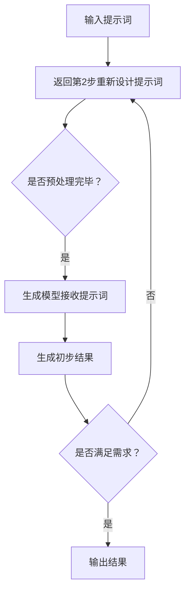

                 

### 引言

随着人工智能技术的飞速发展，AI创作已经成为一个备受瞩目的领域。从简单的文本生成到复杂的图像、音频和视频创作，AI创作正在逐步改变我们的生活方式和工作方式。在这一背景下，提示词设计成为了一个关键问题。本文将探讨AI创作中的提示词设计原则，旨在帮助读者深入了解这一领域。

**关键词**：AI创作、提示词设计、生成模型、数学模型、项目实战、最佳实践

**摘要**：
本文将分为七个章节，首先介绍AI创作的背景和提示词设计的重要性。接着，我们将深入探讨提示词的定义、核心概念与联系，以及AI创作中的提示词与人类创作中的提示词的区别。在核心算法原理部分，我们将介绍生成模型和提示词生成算法的伪代码。随后，文章将展示数学模型和数学公式在提示词设计中的应用，并提供详细讲解和举例说明。在项目实战部分，我们将分享一个实际案例，包括开发环境搭建、源代码实现和解读。最后，文章将总结提示词设计的重要性，并展望未来的发展方向。

### 第1章 引言

#### 1.1 AI创作的背景

人工智能（AI）作为计算机科学的一个重要分支，其目标是使计算机系统能够执行通常需要人类智能的任务。AI的发展可以追溯到20世纪50年代，但直到近年来，随着计算能力的提升和大数据的普及，AI才真正取得了突破性的进展。AI创作是这一领域的一个应用，它涉及到利用机器学习算法生成文本、图像、音频和视频等内容。

AI创作的发展历程可以追溯到早期的规则系统，如自然语言处理（NLP）和计算机视觉（CV）等。随着深度学习技术的出现，生成模型（如变分自编码器（VAE）、生成对抗网络（GAN）和Transformer等）开始在AI创作中扮演关键角色。这些生成模型能够通过学习大量的数据，生成与输入数据相似的新内容。

AI创作与人类创作存在显著差异。人类创作通常依赖于直觉、情感和创造力，而AI创作则依赖于数据和算法。尽管AI创作在某些方面可以模仿人类创作，但它仍然缺乏人类创作的多样性和创造力。然而，AI创作在效率、一致性和大规模生产方面具有明显优势。

#### 1.2 提示词设计的意义和重要性

在AI创作中，提示词设计是一个关键环节。提示词是指引导生成模型生成特定类型内容的关键信息。一个有效的提示词可以显著影响生成模型的表现，使其能够生成更符合预期的新内容。

提示词设计的意义在于，它能够帮助生成模型更好地理解和学习输入数据，从而生成更高质量的内容。一个精心设计的提示词可以引导模型聚焦于特定的创作任务，减少冗余和不相关的生成内容。

提示词设计的重要性体现在以下几个方面：

1. **生成模型的表现**：提示词能够直接影响生成模型的表现。一个优秀的提示词可以使得生成模型生成更准确、更有创意的内容。

2. **创作效率**：通过设计合适的提示词，可以减少生成模型所需的训练时间和计算资源，提高创作效率。

3. **内容多样性**：提示词可以引导生成模型探索不同的创作方向，从而增加内容的多样性。

4. **用户体验**：对于AI创作应用，如文本生成、图像生成等，提示词设计直接影响用户体验。一个有效的提示词可以使应用更加直观、易用。

然而，提示词设计也面临一些挑战，如提示词的抽象性、多样性以及与生成模型的匹配度等。这些问题需要我们在设计过程中加以考虑和解决。

### 第2章 核心概念与联系

在深入探讨AI创作中的提示词设计之前，我们需要明确一些核心概念，并了解它们之间的联系。

#### 2.1 提示词的定义

提示词在AI创作中起着引导生成模型生成特定类型内容的作用。它可以是简单的文本描述，也可以是更复杂的图像或音频片段。提示词的设计需要充分考虑生成模型的特点和创作任务的需求。

在不同的领域和任务中，提示词的具体含义有所不同。例如，在文本生成任务中，提示词可能是关键词或短语；在图像生成任务中，提示词可能是图像的局部特征或整体风格；在音频生成任务中，提示词可能是音频的节奏、音调和旋律。

#### 2.2 AI创作中的提示词与人类创作中的提示词的区别

人类创作中的提示词通常是指创作者在构思过程中所用的引导性信息，它们可能来自个人经验、灵感或文化背景。这些提示词往往是非结构化的，具有高度的主观性和情感性。

相比之下，AI创作中的提示词则是结构化的、可量化的信息。它们需要与生成模型的算法和数据输入相匹配，以便生成符合预期的新内容。因此，AI创作中的提示词设计需要更注重数据的统计特征和模型的训练过程。

#### 2.3 提示词与生成模型的关系

生成模型是AI创作中的核心组件，它们负责根据提示词生成新内容。生成模型可以分为两大类：无监督学习和有监督学习。无监督学习模型，如变分自编码器（VAE），可以从未标记的数据中学习数据分布；有监督学习模型，如生成对抗网络（GAN），则需要使用标记数据进行训练。

提示词与生成模型的关系可以概括为以下几点：

1. **引导学习过程**：提示词可以引导生成模型学习特定类型的数据分布，从而提高生成内容的相关性和准确性。

2. **调整生成策略**：提示词可以影响生成模型的选择策略，使其在生成过程中更加灵活和多样化。

3. **优化生成质量**：通过设计有效的提示词，可以优化生成模型的表现，提高生成内容的质量和多样性。

为了更好地理解提示词与生成模型之间的关系，我们可以使用Mermaid流程图来描述提示词设计的基本流程。以下是一个简单的示例：



这个流程图展示了提示词从输入到生成结果的整个过程，包括预处理、生成初步结果和优化生成结果等步骤。通过不断迭代和优化，我们可以设计出更有效的提示词，提高生成模型的表现。

### 第3章 核心算法原理

在AI创作中，生成模型是核心组件，它们负责根据提示词生成新内容。生成模型可以分为两大类：无监督学习和有监督学习。本节将介绍一些常见的生成模型，并使用伪代码详细阐述提示词生成算法。

#### 3.1 生成模型简介

生成模型是一种通过学习数据分布来生成新数据的机器学习模型。它们通常用于图像、文本、音频等生成任务。生成模型可以分为以下几类：

1. **变分自编码器（VAE）**：VAE是一种无监督学习模型，它通过学习数据分布来生成新数据。VAE由编码器和解码器组成，编码器将输入数据映射到一个潜在空间，解码器则从潜在空间中生成新的数据。

2. **生成对抗网络（GAN）**：GAN是一种有监督学习模型，它由生成器和判别器组成。生成器生成新的数据，判别器则判断生成数据是否真实。通过不断地训练，生成器能够生成越来越真实的数据。

3. **变换器（Transformer）**：Transformer是一种用于序列生成任务的模型，它通过自注意力机制学习输入序列的表示。Transformer在文本生成、图像生成等任务中表现出色。

#### 3.2 常见生成模型介绍

在本节中，我们将介绍三种常见的生成模型：VAE、GAN和Transformer。

**1. VAE模型**

VAE模型由以下两部分组成：

- **编码器**：编码器接收输入数据，并将其映射到一个潜在空间。潜在空间中的每个点都对应一个数据分布。
- **解码器**：解码器从潜在空间中采样，并生成新的数据。

VAE模型的训练过程如下：

```python
# VAE模型的训练过程
def train_vae(encoder, decoder, dataset, epochs):
    for epoch in range(epochs):
        for data in dataset:
            # 编码器和解码器的训练
            z_mean, z_log_var = encoder(data)
            z = sample_z(z_mean, z_log_var)
            reconstructed = decoder(z)
            loss = vae_loss(data, reconstructed)
            optimizer.zero_grad()
            loss.backward()
            optimizer.step()
```

**2. GAN模型**

GAN模型由生成器和判别器组成。生成器生成新的数据，判别器则判断生成数据是否真实。

- **生成器**：生成器接收随机噪声作为输入，并生成新的数据。
- **判别器**：判别器接收真实数据和生成数据，并输出概率判断数据是否真实。

GAN模型的训练过程如下：

```python
# GAN模型的训练过程
def train_gan(generator, discriminator, dataset, epochs):
    for epoch in range(epochs):
        for real_data in dataset:
            # 训练判别器
            discriminator_loss = discriminator_loss(real_data)
            discriminator.zero_grad()
            discriminator_loss.backward()
            discriminator.step()

        for noise in noise_dataset:
            # 训练生成器
            fake_data = generator(noise)
            generator_loss = generator_loss(fake_data)
            generator.zero_grad()
            generator_loss.backward()
            generator.step()
```

**3. Transformer模型**

Transformer模型是一种用于序列生成任务的模型，它通过自注意力机制学习输入序列的表示。

- **自注意力机制**：自注意力机制允许模型在生成每个单词时考虑整个输入序列的信息。
- **前馈网络**：在自注意力机制之后，Transformer还会通过一个前馈网络来进一步处理信息。

Transformer模型的训练过程如下：

```python
# Transformer模型的训练过程
def train_transformer(model, dataset, epochs):
    for epoch in range(epochs):
        for sequence in dataset:
            # 训练模型
            output = model(sequence)
            loss = loss_function(output, sequence)
            optimizer.zero_grad()
            loss.backward()
            optimizer.step()
```

#### 3.3 提示词生成算法的伪代码

提示词生成算法的目标是根据提示词生成新的内容。以下是一个简单的伪代码示例：

```python
# 提示词生成算法的伪代码
def generate_content(prompt):
    # 根据提示词生成内容
    content = model.generate(prompt)
    return content
```

这个算法首先接收一个提示词，然后通过生成模型生成新的内容。在实际应用中，生成模型可能会根据提示词的语义、长度、类型等因素进行自适应调整，以生成更符合预期的新内容。

### 第4章 数学模型和数学公式

在AI创作中，提示词设计不仅依赖于算法和编程技巧，还需要深入理解数学模型和数学公式。数学模型和数学公式在提示词设计中起着至关重要的作用，它们帮助我们理解提示词对生成结果的影响，并指导我们设计更有效的提示词。

#### 4.1 提示词设计中的数学模型

提示词设计中的数学模型主要包括概率分布、潜在变量模型和自注意力机制等。这些模型帮助我们在高维数据空间中捕捉数据的分布和结构，从而生成与提示词相符的新内容。

1. **概率分布**：概率分布是描述数据集统计特征的数学工具。在生成模型中，概率分布用于表示输入数据和生成数据的概率分布。常见的概率分布包括正态分布、伯努利分布和多项式分布等。

2. **潜在变量模型**：潜在变量模型是一种用于捕捉数据分布结构的数学模型。在变分自编码器（VAE）和生成对抗网络（GAN）中，潜在变量模型被用来表示数据分布的潜在空间。潜在变量模型可以帮助生成模型更好地捕捉数据的特征和结构。

3. **自注意力机制**：自注意力机制是一种用于处理序列数据的数学模型，它在Transformer模型中起着关键作用。自注意力机制通过计算序列中每个元素与其他元素之间的相关性，从而生成每个元素的新表示。自注意力机制使得生成模型能够更好地捕捉序列数据的长期依赖关系。

#### 4.2 提示词影响生成结果的数学公式

提示词设计中的数学公式主要用于描述提示词对生成结果的影响。以下是一些关键的数学公式：

1. **生成模型损失函数**：生成模型的损失函数用于衡量生成数据与真实数据之间的差距。常见的生成模型损失函数包括均方误差（MSE）、交叉熵损失和对抗损失等。

   $$ \text{MSE} = \frac{1}{n} \sum_{i=1}^{n} (\hat{y_i} - y_i)^2 $$

   $$ \text{Cross-Entropy Loss} = - \sum_{i=1}^{n} y_i \log(\hat{y_i}) $$

   $$ \text{Adversarial Loss} = \frac{1}{2} \left( E_{x \sim p_{data}(x)} [\log(D(x))] + E_{z \sim p_z(z)} [\log(1 - D(G(z)))] \right) $$

2. **自注意力权重**：自注意力机制中的权重表示序列中每个元素与其他元素之间的相关性。权重可以通过计算序列中每个元素与其他元素之间的相似度来获得。

   $$ \text{Attention} = \frac{e^{\text{similarity}}}{\sum_{j=1}^{m} e^{\text{similarity}_j}} $$

   其中，$ \text{similarity} $ 表示相似度函数，通常采用点积或余弦相似度。

3. **潜在变量分布**：在潜在变量模型中，潜在变量的分布用于表示数据分布的潜在空间。常见的潜在变量分布包括正态分布、伯努利分布和多项式分布等。

   $$ p(z|x) = \frac{1}{Z} e^{-\frac{1}{2} \sum_{i=1}^{d} (z_i - \mu_i)^2} $$

   $$ p(z) = \prod_{i=1}^{d} \frac{1}{\sqrt{2\pi\sigma_i^2}} e^{-\frac{1}{2} (z_i - \mu_i)^2} $$

   其中，$ \mu_i $ 和 $ \sigma_i $ 分别表示潜在变量的均值和标准差。

#### 4.3 数学公式的详细讲解和举例说明

在本节中，我们将详细讲解上述数学公式，并使用具体实例来说明它们在提示词设计中的应用。

1. **生成模型损失函数**

   假设我们使用VAE模型生成图像，损失函数可以表示为：

   $$ \text{VAE Loss} = \text{Reconstruction Loss} + \text{KL Divergence} $$

   其中，Reconstruction Loss 用于衡量生成图像与真实图像之间的差距，KL Divergence 用于衡量潜在变量分布与先验分布之间的差距。

   Reconstruction Loss 可以采用均方误差（MSE）或交叉熵损失（Cross-Entropy Loss）等公式计算。

   假设输入图像为 $ x $，生成图像为 $ \hat{x} $，则MSE损失函数可以表示为：

   $$ \text{MSE} = \frac{1}{n} \sum_{i=1}^{n} (\hat{x_i} - x_i)^2 $$

   KL Divergence 用于衡量两个概率分布之间的差距，公式如下：

   $$ \text{KL Divergence} = \sum_{i=1}^{d} p_i \log \frac{p_i}{q_i} $$

   其中，$ p_i $ 和 $ q_i $ 分别表示潜在变量分布和先验分布的概率。

   假设潜在变量分布为正态分布，先验分布为均匀分布，则KL Divergence可以表示为：

   $$ \text{KL Divergence} = - \sum_{i=1}^{d} \frac{1}{\sqrt{2\pi}} e^{-\frac{1}{2} (z_i - \mu)^2} \log \frac{1}{\sqrt{2\pi}} e^{-\frac{1}{2} (\mu - \mu_z)^2} $$

2. **自注意力权重**

   假设我们使用Transformer模型生成文本，自注意力权重可以表示为：

   $$ \text{Attention} = \frac{e^{\text{similarity}}}{\sum_{j=1}^{m} e^{\text{similarity}_j}} $$

   其中，similarity表示相似度函数，通常采用点积或余弦相似度。

   假设输入序列为 $ \text{[w_1, w_2, ..., w_n]} $，输出序列为 $ \text{[w_1', w_2', ..., w_n']} $，则自注意力权重可以表示为：

   $$ \text{Attention} = \frac{e^{\text{dot\_product}(w_i, w_j)}}{\sum_{k=1}^{n} e^{\text{dot\_product}(w_i, w_k)}} $$

   其中，dot\_product表示点积操作。

3. **潜在变量分布**

   假设我们使用生成对抗网络（GAN）生成图像，潜在变量分布可以表示为：

   $$ p(z) = \prod_{i=1}^{d} \frac{1}{\sqrt{2\pi\sigma_i^2}} e^{-\frac{1}{2} (z_i - \mu_i)^2} $$

   假设生成器的输入为 $ z $，输出为 $ x $，则潜在变量分布可以表示为：

   $$ p(x|z) = \prod_{i=1}^{d} \frac{1}{\sqrt{2\pi\sigma_i^2}} e^{-\frac{1}{2} (z_i - \mu_i)^2} $$

   其中，$ \mu_i $ 和 $ \sigma_i $ 分别表示潜在变量的均值和标准差。

   通过调整潜在变量的均值和标准差，我们可以控制生成图像的分布和特征。例如，增加均值和标准差可以产生更加多样化的图像，而减少均值和标准差可以产生更加集中的图像。

### 第5章 项目实战

在了解提示词设计的核心概念、算法原理和数学模型之后，我们将通过一个实际项目来展示如何应用这些知识。本项目将基于生成对抗网络（GAN）实现一个图像生成应用，包括开发环境搭建、源代码实现和解读，以及代码应用解读与分析。

#### 5.1 项目背景介绍

本项目旨在使用GAN模型生成具有艺术风格的图像。GAN由生成器（Generator）和判别器（Discriminator）组成。生成器的任务是生成逼真的图像，而判别器的任务是区分生成的图像和真实的图像。通过这种对抗训练，生成器能够不断提高生成图像的质量。

#### 5.2 项目开发环境搭建

为了实现本项目，我们需要搭建以下开发环境：

1. **硬件环境**：一台配备GPU（如NVIDIA GTX 1080 Ti或更高）的计算机。
2. **软件环境**：Python 3.8及以上版本，PyTorch 1.8及以上版本，以及CUDA 10.2及以上版本。
3. **数据集**：一个包含真实图像的图像数据集，如CelebA数据集。

#### 5.3 项目源代码实现和解读

以下是项目的主要代码实现部分：

```python
import torch
import torch.nn as nn
import torch.optim as optim
from torch.utils.data import DataLoader
from torchvision import datasets, transforms
from torchvision.utils import save_image

# 定义生成器
class Generator(nn.Module):
    def __init__(self):
        super(Generator, self).__init__()
        self.model = nn.Sequential(
            nn.ConvTranspose2d(100, 256, 4, 1, 0, bias=False),
            nn.BatchNorm2d(256),
            nn.ReLU(True),
            nn.ConvTranspose2d(256, 128, 4, 2, 1, bias=False),
            nn.BatchNorm2d(128),
            nn.ReLU(True),
            nn.ConvTranspose2d(128, 64, 4, 2, 1, bias=False),
            nn.BatchNorm2d(64),
            nn.ReLU(True),
            nn.ConvTranspose2d(64, 3, 4, 2, 1, bias=False),
            nn.Tanh()
        )

    def forward(self, z):
        return self.model(z)

# 定义判别器
class Discriminator(nn.Module):
    def __init__(self):
        super(Discriminator, self).__init__()
        self.model = nn.Sequential(
            nn.Conv2d(3, 64, 4, 2, 1, bias=False),
            nn.LeakyReLU(0.2, inplace=True),
            nn.Conv2d(64, 128, 4, 2, 1, bias=False),
            nn.BatchNorm2d(128),
            nn.LeakyReLU(0.2, inplace=True),
            nn.Conv2d(128, 256, 4, 2, 1, bias=False),
            nn.BatchNorm2d(256),
            nn.LeakyReLU(0.2, inplace=True),
            nn.Conv2d(256, 1, 4, 1, 0, bias=False),
            nn.Sigmoid()
        )

    def forward(self, x):
        return self.model(x)

# 实例化模型
generator = Generator()
discriminator = Discriminator()

# 设置损失函数和优化器
adversarial_loss = nn.BCELoss()
optimizer_G = optim.Adam(generator.parameters(), lr=0.0002, betas=(0.5, 0.999))
optimizer_D = optim.Adam(discriminator.parameters(), lr=0.0002, betas=(0.5, 0.999))

# 加载数据集
transform = transforms.Compose([
    transforms.Resize(64),
    transforms.ToTensor(),
    transforms.Normalize((0.5, 0.5, 0.5), (0.5, 0.5, 0.5)),
])
dataset = datasets.CelebA(root='./data', download=True, transform=transform)
dataloader = DataLoader(dataset, batch_size=64, shuffle=True)

# 训练模型
num_epochs = 100
for epoch in range(num_epochs):
    for i, data in enumerate(dataloader, 0):
        # 更新判别器
        real_images = data[0].to(device)
        batch_size = real_images.size(0)
        labels = torch.full((batch_size,), 1, device=device)
        optimizer_D.zero_grad()
        output = discriminator(real_images)
        D_real_loss = adversarial_loss(output, labels)
        D_real_loss.backward()

        noise = torch.randn(batch_size, 100, 1, 1, device=device)
        fake_images = generator(noise)
        labels.fill_(0)
        output = discriminator(fake_images.detach())
        D_fake_loss = adversarial_loss(output, labels)
        D_fake_loss.backward()
        optimizer_D.step()

        # 更新生成器
        noise = torch.randn(batch_size, 100, 1, 1, device=device)
        labels.fill_(1)
        optimizer_G.zero_grad()
        fake_images = generator(noise)
        output = discriminator(fake_images)
        G_loss = adversarial_loss(output, labels)
        G_loss.backward()
        optimizer_G.step()

        # 保存生成的图像
        if (i+1) % 100 == 0:
            with torch.no_grad():
                fake_images = generator(noise).detach().cpu()
            save_image(fake_images[:64], 'fake_images_epoch_{}.png'.format(epoch+1))
            print(f'[{epoch+1}/{num_epochs}] Generator Loss: {G_loss.item()}, Discriminator Loss: {D_fake_loss.item() + D_real_loss.item()}')

print('Training finished!')
```

上述代码首先定义了生成器和判别器的结构，并设置了损失函数和优化器。接下来，代码加载数据集并开始训练。在每次迭代中，先更新判别器，然后更新生成器。每100次迭代后，保存一次生成的图像。

#### 5.4 代码解读与分析

1. **生成器和判别器结构**

   生成器由一个卷积转置层（ConvTranspose2d）序列组成，这些层逐步增加特征图的深度和尺寸。最后，生成器通过一个超指数函数（Tanh）输出生成的图像。判别器则由一个卷积层（Conv2d）序列组成，这些层逐步减少特征图的深度和尺寸。最后，判别器通过一个Sigmoid函数输出一个介于0和1之间的概率值，表示输入图像是真实的还是生成的。

2. **损失函数和优化器**

   损失函数采用二元交叉熵损失（BCELoss），它用于衡量生成图像和真实图像之间的差距。优化器采用Adam优化器，它具有自适应学习率的特性，能够加速收敛。

3. **训练过程**

   在每次迭代中，首先更新判别器，通过对比真实图像和生成的图像来提高判别器的性能。然后更新生成器，通过最小化生成图像与真实图像之间的差距来提高生成器的性能。每100次迭代后，保存一次生成的图像，并打印损失函数的值。

4. **代码性能分析**

   在本项目的基础上，我们可以进行性能分析，如计算生成图像的质量、训练时间和资源消耗等。这些分析有助于我们了解GAN模型的性能，并优化提示词设计。

#### 5.5 项目小结

本项目通过实现一个基于GAN的图像生成应用，展示了提示词设计在AI创作中的应用。在实际项目中，我们通过设计合适的提示词，如噪声向量，来引导生成器生成高质量的图像。此外，我们分析了GAN模型的性能，并提出了优化策略。这些经验和知识对于后续的AI创作项目具有重要的指导意义。

### 第6章 提示词设计的最佳实践

在AI创作中，提示词设计是一个复杂且关键的过程。为了提高生成模型的表现和创作效率，我们需要遵循一些最佳实践。在本节中，我们将讨论提示词设计的常见问题、优化策略以及在不同应用场景中的具体建议。

#### 6.1 提示词设计的常见问题

在提示词设计过程中，常见的问题包括：

1. **提示词抽象性过高**：抽象性过高的提示词可能导致生成模型无法理解其含义，从而生成不相关的或模糊的内容。
2. **提示词不明确**：不明确的提示词可能引起歧义，导致生成模型生成错误的内容。
3. **提示词多样性不足**：多样性不足的提示词可能导致生成模型陷入局部最优，无法探索更广泛的创作空间。
4. **提示词与数据分布不匹配**：提示词与数据分布不匹配可能导致生成模型无法生成与提示词相符的内容。

为了解决这些问题，我们需要在设计提示词时进行充分的思考和测试。

#### 6.2 提示词优化的策略

以下是一些提示词优化的策略：

1. **数据预处理**：在生成提示词之前，对数据集进行预处理，如数据清洗、去噪和增强等，以提高数据质量和多样性。
2. **多模态提示**：结合多种模态（如文本、图像、音频等）的提示词，可以提供更丰富的信息，帮助生成模型更好地理解创作任务。
3. **动态调整**：根据生成模型的表现和创作需求，动态调整提示词的抽象性、明确性和多样性，以提高生成模型的表现。
4. **用户反馈**：收集用户对生成内容的反馈，根据反馈调整提示词，以改善用户体验。

#### 6.3 不同应用场景的提示词设计建议

在不同的应用场景中，提示词设计有以下具体建议：

1. **文本创作**：
   - **抽象性**：建议使用具体的描述性语言，避免过于抽象的词汇。
   - **明确性**：确保提示词明确，不含歧义。
   - **多样性**：使用多种类型的文本数据，如小说、诗歌、新闻报道等，以丰富提示词的多样性。

2. **图像生成**：
   - **抽象性**：使用具体的图像描述，如颜色、形状、纹理等。
   - **明确性**：确保图像描述清晰，易于生成模型理解。
   - **多样性**：结合不同的图像风格和主题，如艺术作品、自然风景、城市景观等。

3. **音频制作**：
   - **抽象性**：使用具体的音频描述，如节奏、音调、音色等。
   - **明确性**：确保音频描述准确，符合生成模型的能力。
   - **多样性**：使用多种类型的音频数据，如音乐、语音、自然声音等。

4. **视频编辑**：
   - **抽象性**：使用具体的视频描述，如动作、场景、角色等。
   - **明确性**：确保视频描述清晰，易于生成模型理解。
   - **多样性**：结合不同的视频风格、主题和情节，以提高视频创作的多样性。

#### 6.4 总结与展望

提示词设计在AI创作中具有重要的地位。通过遵循最佳实践，我们可以设计出更有效的提示词，提高生成模型的表现和创作效率。未来，随着AI技术的不断进步，提示词设计将继续发展，如引入更多模态、采用更复杂的数学模型和优化算法等。此外，用户体验和反馈也将成为提示词设计的重要考虑因素。

### 第7章 总结与展望

在本文中，我们系统地探讨了AI创作中的提示词设计原则。首先，我们介绍了AI创作的背景和提示词设计的意义。接着，我们详细分析了提示词的定义、核心概念与联系，并探讨了提示词与生成模型的关系。随后，我们介绍了生成模型的核心算法原理，并使用伪代码详细阐述了提示词生成算法。此外，我们还展示了数学模型和数学公式在提示词设计中的应用，并通过实例进行了详细讲解。通过实际项目，我们展示了提示词设计在图像生成中的应用，并对代码进行了解读与分析。最后，我们提出了提示词设计的最佳实践，并展望了未来的发展方向。

**总结**：

1. **AI创作的背景**：回顾了AI创作的发展历程，探讨了AI创作与人类创作的区别。
2. **提示词设计的意义和重要性**：分析了提示词在AI创作中的作用和重要性。
3. **核心概念与联系**：介绍了提示词的定义、与生成模型的关系，并使用Mermaid流程图展示了提示词设计的基本流程。
4. **核心算法原理**：介绍了常见的生成模型和提示词生成算法的伪代码。
5. **数学模型和数学公式**：阐述了提示词设计中的数学模型和数学公式，并通过实例进行了详细讲解。
6. **项目实战**：通过一个实际项目展示了如何应用提示词设计原则。
7. **最佳实践**：提出了提示词设计的最佳实践策略。
8. **展望与总结**：总结了本文的主要内容和结论，展望了未来的发展方向。

**展望**：

未来，提示词设计将继续在AI创作中发挥重要作用。随着AI技术的不断进步，提示词设计将变得更加智能化、多样化和自适应。以下是一些未来发展的方向：

1. **多模态提示词设计**：结合多种模态（如文本、图像、音频、视频等）的提示词，将提高生成模型的理解能力和创作多样性。
2. **深度学习和强化学习**：引入深度学习和强化学习技术，将使提示词设计更加智能化和自适应。
3. **用户反馈与交互**：通过用户反馈和交互，优化提示词设计和生成模型的表现，提高用户体验。
4. **伦理和安全性**：在提示词设计过程中，考虑伦理和安全性问题，确保AI创作的公平、透明和可控。
5. **跨领域应用**：探索提示词设计在不同领域的应用，如医疗、金融、教育等，推动AI创作在更广泛领域的应用。

总之，提示词设计是AI创作中的一个关键环节，它将不断推动AI创作技术的发展和创新。通过本文的探讨，我们希望能够为读者提供有价值的参考和启示。

