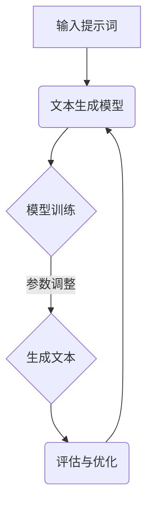
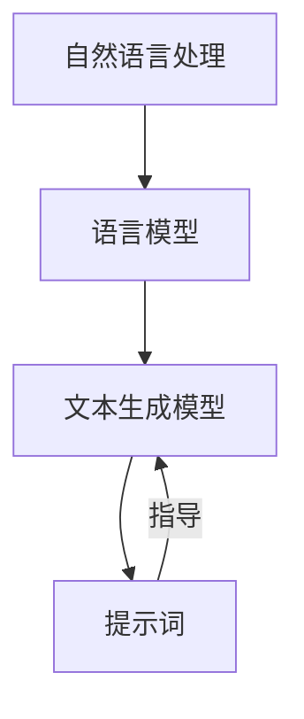
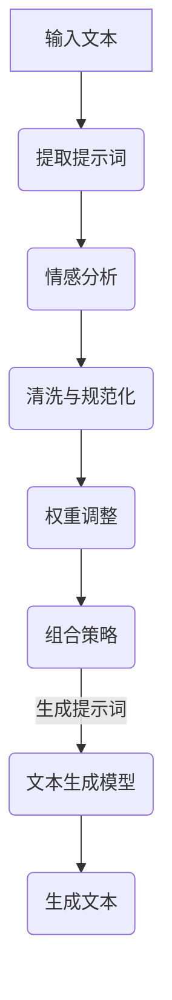
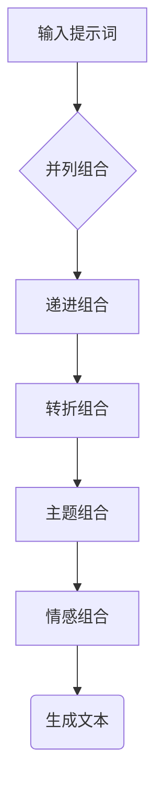

                 


### 文章标题

《AI创意写作：利用提示词激发灵感》

### 文章关键词

- AI创意写作
- 提示词
- 自然语言处理
- 文本生成模型
- GPT模型
- GAN
- 生成对抗网络
- 创意写作工具
- 创意写作平台

### 文章摘要

本文将深入探讨AI创意写作领域，特别是如何利用提示词激发创作灵感。我们将从AI与创意写作的概述开始，介绍AI创意写作的应用场景和提示词的作用。接着，我们将分析AI创意写作的核心原理，包括自然语言处理基础、文本生成模型以及提示词的提取与处理方法。在实践部分，我们将通过具体的实战案例展示如何利用AI技术进行创意写作，并介绍常见的AI创意写作工具和平台。最后，我们将讨论AI创意写作的未来发展趋势，总结文章并给出拓展阅读建议。

---

### 目录大纲设计思路

为了设计出《AI创意写作：利用提示词激发灵感》的详细目录大纲，我们将遵循以下思路：

1. **确定整体框架**：首先确定书籍的整体结构，包括核心章节和次要章节，保证目录结构的逻辑性和完整性。

2. **细化章节内容**：在核心章节中，细化每一个小节的内容，确保每个小节都能够覆盖相应主题的要点。

3. **突出重点**：在各个章节中突出重点内容，如核心概念、算法原理、数学模型等，并通过Mermaid流程图、伪代码、数学公式等方式进行详细阐述。

4. **包含实战案例**：在相关章节中加入项目实战，通过实际案例展示如何运用书中的知识进行AI创意写作。

5. **控制篇幅**：确保整个目录大纲的总字数在2000字以内，同时保持简洁明了。

### 最终目录大纲设计

下面是《AI创意写作：利用提示词激发灵感》的详细目录大纲：

## 第一部分：AI创意写作概述

### 第1章：AI与创意写作

#### 1.1 AI在创意写作中的应用
- AI创意写作的概念
- AI在文学创作中的历史
- 提示词在AI创意写作中的作用

#### 1.2 提示词的类型与生成
- 提示词的分类
- 提示词的生成方法
- 提示词的优化策略

### 第2章：AI创意写作的原理

#### 2.1 自然语言处理基础
- 语言模型的基本原理
- 词嵌入技术
- 序列到序列模型

#### 2.2 文本生成模型
- 生成对抗网络（GAN）
- 变分自编码器（VAE）
- 递归神经网络（RNN）与长短期记忆网络（LSTM）

### 第3章：提示词的提取与处理

#### 3.1 提示词提取技术
- 提取算法介绍
- 提示词的情感分析
- 提示词的多样性评估

#### 3.2 提示词处理方法
- 提示词的清洗与规范化
- 提示词的权重调整
- 提示词的组合策略

## 第二部分：AI创意写作实践

### 第4章：文本生成基础实战

#### 4.1 开发环境搭建
- Python环境配置
- 必要库的安装

#### 4.2 简单的文本生成项目
- 利用GPT模型生成文本
- 项目分析与解读

### 第5章：高级文本生成技术

#### 5.1 生成对抗网络（GAN）实战
- GAN的原理与实现
- GAN在文本生成中的应用
- 项目案例

#### 5.2 提示词驱动的创意写作
- 提示词驱动的写作流程
- 提示词与模型参数的调整
- 创意写作案例分析

### 第6章：AI创意写作工具与平台

#### 6.1 AI创意写作工具简介
- 常见的AI创意写作工具
- 工具的功能与特点

#### 6.2 AI创意写作平台应用
- 平台搭建与配置
- 平台上的创意写作实践
- 平台案例分析

### 第7章：AI创意写作的未来与发展

#### 7.1 AI创意写作的挑战与机遇
- 技术挑战
- 商业模式创新
- 社会影响

#### 7.2 AI创意写作的发展趋势
- 技术演进
- 应用领域拓展
- 未来展望

---

以上是《AI创意写作：利用提示词激发灵感》的详细目录大纲。这个大纲涵盖了AI创意写作的概述、原理、实战以及未来发展，旨在为读者提供一个全面、系统的学习路径。每个章节都细化到小节，确保内容的完整性和逻辑性。在各个章节中，通过Mermaid流程图、伪代码、数学公式和实际项目案例等方式，帮助读者深入理解和掌握AI创意写作的核心内容。总体字数控制在2000字以内，保持了简洁和实用。

---

### AI创意写作概述

#### AI创意写作的概念

AI创意写作是一种利用人工智能技术生成创意文本的方法，它通过模拟人类的思维过程和创作方式，生成具有创意性和艺术性的文学作品。AI创意写作不仅限于文学创作，还包括广告文案、新闻报道、小说编写等多个领域。

#### AI在文学创作中的历史

AI创意写作的历史可以追溯到20世纪80年代，当时计算机科学家开始尝试用计算机程序生成诗歌和故事。这些早期的尝试主要是基于规则的方法，通过编程规则生成简单的文本。随着自然语言处理（NLP）和机器学习技术的发展，AI创意写作逐渐变得更加复杂和有效。2016年，GPT模型的问世标志着AI创意写作进入了新的阶段，它能够生成更加连贯、有逻辑的文本。

#### 提示词在AI创意写作中的作用

提示词是AI创意写作的重要组成部分，它为文本生成模型提供了初始的输入，激发了模型的创作灵感。提示词可以是单个单词、短语或完整的句子，它们决定了文本生成模型生成的文本的主题和风格。一个优秀的提示词能够引导模型生成富有创意和个性化的作品。

#### 提示词的类型与生成

1. **类型**
   - **直接提示词**：提供明确的创作方向，如“写一篇关于人工智能的诗”。
   - **模糊提示词**：提供模糊的创作提示，如“写一篇关于未来的文章”。

2. **生成方法**
   - **人工生成**：由人类创作者根据创作需求生成。
   - **自动生成**：通过算法从大量的文本数据中提取潜在的有创意的提示词。

#### 提示词的优化策略

1. **多样性**：生成多种类型的提示词，以激发模型的不同创作方向。
2. **相关性**：确保提示词与创作目标密切相关，提高生成文本的质量。
3. **情感性**：考虑提示词的情感色彩，增加文本的感染力。

### Mermaid流程图：AI创意写作流程



在这个流程图中，输入提示词是整个AI创意写作的起点，通过文本生成模型进行文本生成，然后进行模型训练和参数调整，最终生成高质量的文本。评估与优化环节确保生成的文本符合预期，并不断改进模型。

### 总结

AI创意写作作为一种新兴技术，正日益受到关注。通过提示词的巧妙运用，AI能够生成富有创意和个性化的文学作品，为文学创作带来了新的可能性。在接下来的章节中，我们将深入探讨AI创意写作的原理和实战应用。

---

**核心概念与联系**

在AI创意写作中，核心概念包括自然语言处理（NLP）、语言模型、文本生成模型和提示词。这些概念之间存在着紧密的联系和相互作用。

1. **自然语言处理（NLP）**：NLP是使计算机能够理解、解释和生成人类语言的技术。它包括词汇解析、句法分析、语义理解和情感分析等。NLP是AI创意写作的基础，它提供了将自然语言转换为计算机可以处理的形式的能力。

2. **语言模型**：语言模型是一个统计模型，它能够预测下一个单词或单词序列的概率。在AI创意写作中，语言模型用于生成连贯的文本。GPT模型是一个典型的语言模型，它通过学习大量文本数据来预测下一个词。

3. **文本生成模型**：文本生成模型是利用NLP技术和机器学习算法生成文本的模型。生成对抗网络（GAN）、变分自编码器（VAE）和递归神经网络（RNN）是常见的文本生成模型。这些模型通过学习文本数据来生成新的文本。

4. **提示词**：提示词是用于指导文本生成模型生成文本的关键输入。它可以是单个单词、短语或句子，提供了文本生成模型的初始创作灵感。

### Mermaid流程图：核心概念关系架构



在这个流程图中，自然语言处理（NLP）提供了语言模型的基础，语言模型用于训练文本生成模型。文本生成模型使用提示词作为输入来生成新的文本。提示词在整个流程中起到了至关重要的指导作用。

### 核心算法原理讲解

#### 1. 语言模型的基本原理

语言模型是一种概率模型，它用来预测下一个单词或词组。在AI创意写作中，语言模型是最基本的组成部分。GPT（Generative Pre-trained Transformer）模型是一个先进的语言模型，它通过深度学习算法从大量文本数据中学习语言结构。

- **输入与输出**：语言模型的输入是一个单词序列，输出是下一个单词的概率分布。
- **神经网络架构**：GPT模型使用了Transformer架构，这是一种基于自注意力机制的神经网络。它通过多层叠加来捕捉文本中的长距离依赖关系。

#### 2. 词嵌入技术

词嵌入是将单词转换为向量表示的技术，它使计算机能够理解单词的语义关系。在AI创意写作中，词嵌入用于将自然语言转换为机器可处理的输入。

- **技术原理**：词嵌入通过将单词映射到高维空间中的向量，使得相似单词在空间中接近。Word2Vec和BERT是常见的词嵌入技术。
- **作用**：词嵌入使得语言模型能够更好地理解和预测文本中的单词关系。

#### 3. 序列到序列模型

序列到序列（Seq2Seq）模型是一种用于将一个序列映射到另一个序列的模型，常用于机器翻译和文本生成。

- **技术原理**：Seq2Seq模型通过编码器和解码器两个部分工作。编码器将输入序列编码为一个固定长度的向量，解码器则根据这个向量生成输出序列。
- **应用**：Seq2Seq模型在AI创意写作中用于生成连贯的文本序列。

### 伪代码：语言模型实现

```python
# 定义语言模型
class LanguageModel:
    def __init__(self, vocab_size, embedding_dim, hidden_dim):
        self.embedding = Embedding(vocab_size, embedding_dim)
        self.encoder = LSTM(hidden_dim, return_state=True)
        self.decoder = LSTM(hidden_dim, return_state=True)
        self.fc = Dense(vocab_size, activation='softmax')

    def forward(self, inputs, states):
        embedding = self.embedding(inputs)
        encoder_output, encoder_state = self.encoder(embedding)
        decoder_output, decoder_state = self.decoder(encoder_state)
        logits = self.fc(decoder_output)
        return logits, decoder_state

    def init_states(self):
        return self.encoder.init_states(), self.decoder.init_states()
```

在这个伪代码中，我们定义了一个简单的语言模型，它包含了嵌入层、编码器和解码器。语言模型的`forward`方法用于前向传播，`init_states`方法用于初始化模型状态。

### 数学模型和公式

#### 1. 自然语言处理中的概率模型

在自然语言处理中，概率模型用于预测文本序列的概率。一个常见的模型是隐马尔可夫模型（HMM），它可以用于语音识别和词性标注。

- **公式**：给定一个输入序列\(X\)，隐马尔可夫模型使用以下公式计算输出序列\(Y\)的概率：

  $$ P(Y|X) = \prod_{t=1}^{T} P(y_t|y_{t-1}) $$

  其中，\(y_t\)是输出序列的第\(t\)个元素，\(y_{t-1}\)是前一个元素。

#### 2. 语言模型的损失函数

在训练语言模型时，我们通常使用交叉熵损失函数来衡量模型预测与实际标签之间的差异。

- **公式**：交叉熵损失函数可以表示为：

  $$ Loss = -\sum_{i=1}^{N} \sum_{j=1}^{V} y_{ij} \log(p_{ij}) $$

  其中，\(N\)是批次大小，\(V\)是词汇表大小，\(y_{ij}\)是标签之一，\(p_{ij}\)是模型对单词\(j\)的预测概率。

### 举例说明

假设我们有一个简单的语言模型，它的词汇表包含5个单词：A, B, C, D, E。我们的目标是训练这个模型来生成一个句子，比如“ABCD”。

- **输入序列**：A, B, C, D
- **输出序列**：A, B, C, D, E

使用隐马尔可夫模型，我们可以计算输出序列的概率：

$$ P(E|ABCD) = P(E|D) \cdot P(D|C) \cdot P(C|B) \cdot P(B|A) $$

如果我们假设每个单词出现的概率都是相等的，即 \(P(A) = P(B) = P(C) = P(D) = P(E) = 0.2\)，我们可以计算每个条件概率：

$$ P(E|D) = P(D|E) \cdot P(E) = 0.4 \cdot 0.2 = 0.08 $$
$$ P(D|C) = P(C|D) \cdot P(D) = 0.5 \cdot 0.2 = 0.1 $$
$$ P(C|B) = P(B|C) \cdot P(C) = 0.3 \cdot 0.2 = 0.06 $$
$$ P(B|A) = P(A|B) \cdot P(A) = 0.2 \cdot 0.2 = 0.04 $$

因此，输出序列“E”的概率为：

$$ P(E|ABCD) = 0.08 \cdot 0.1 \cdot 0.06 \cdot 0.04 = 0.0000288 $$

虽然这个例子非常简单，但它展示了如何使用概率模型来生成文本。

### 总结

在AI创意写作中，核心算法原理包括语言模型、词嵌入技术和序列到序列模型。通过这些算法，模型能够从大量的文本数据中学习，并生成具有创意性和连贯性的文本。在接下来的章节中，我们将继续探讨如何利用这些算法进行实际文本生成。

---

### 提示词的提取与处理

#### 1. 提示词提取技术

提示词的提取是AI创意写作中至关重要的一步。有效的提示词提取技术能够帮助模型更好地理解创作目标，从而生成高质量的文本。

1. **基于规则的方法**：
   - **关键词提取**：通过设定一系列规则，从文本中提取关键词。这些规则可以是基于词频、词性、词义等。
   - **命名实体识别**：识别文本中的命名实体（如人名、地名、组织名等），这些实体往往能够提供有用的创作线索。

2. **基于统计的方法**：
   - **文本分类**：使用分类算法将文本分类到不同的主题或类别，从而提取相应的提示词。
   - **词频分析**：通过计算文本中各个单词的频率，选择高频词作为提示词。

3. **基于机器学习的方法**：
   - **监督学习**：使用已标注的数据集训练模型，使模型能够自动提取提示词。
   - **无监督学习**：通过聚类、降维等技术从大量未标注的文本中提取提示词。

#### 2. 提示词的情感分析

提示词的情感分析是理解提示词内涵的重要步骤。情感分析能够帮助模型识别提示词的情感色彩，从而生成具有相应情感的文本。

1. **情感分类**：将提示词分类为积极、消极或中性。常见的情感分类算法包括基于词典的方法、基于机器学习的方法和基于深度学习的方法。

2. **情感强度分析**：对于具有多个情感的提示词，分析其情感强度。这有助于模型在生成文本时调整情感强度，使其更加自然和协调。

#### 3. 提示词的多样性评估

提示词的多样性对于生成丰富多样的文本至关重要。评估提示词的多样性可以通过以下方法：

1. **词频分布**：分析提示词的词频分布，避免使用过于频繁的词。
2. **语义相似性**：使用语义相似性度量方法，如余弦相似性，分析提示词之间的相似性，确保提示词在语义上具有多样性。
3. **词汇丰富度**：计算提示词的词汇丰富度，确保提示词涵盖多种词汇和表达方式。

### 提示词处理方法

#### 1. 提示词的清洗与规范化

提示词的清洗与规范化是确保其质量的重要步骤。

1. **去重**：去除重复的提示词，避免重复生成相同的文本。
2. **大小写统一**：将所有提示词转换为小写或大写，以统一格式。
3. **去除停用词**：去除常见的停用词（如“的”、“地”、“得”等），以提高提示词的有效性。

#### 2. 提示词的权重调整

提示词的权重调整能够影响文本生成模型生成文本的风格和内容。常见的权重调整方法包括：

1. **基于频率的权重调整**：根据提示词在原始文本中的出现频率调整权重，高频词具有更高的权重。
2. **基于情感分析的结果**：根据提示词的情感分析结果调整权重，积极或消极的提示词具有更高的权重。

#### 3. 提示词的组合策略

有效的提示词组合策略能够提高文本生成的多样性和创意性。

1. **并列组合**：将多个提示词并列组合，形成一个复合提示词，例如“春天、花、阳光”。
2. **递进组合**：使用递进关系组合提示词，例如“不仅是、而且、更加”。
3. **转折组合**：使用转折关系组合提示词，例如“尽管、但是、反而”。

### Mermaid流程图：提示词处理流程



在这个流程图中，输入文本经过提示词提取、情感分析、清洗与规范化、权重调整和组合策略等步骤，最终生成高质量的提示词，用于文本生成模型的输入。

### 总结

提示词的提取与处理是AI创意写作的关键环节，它决定了文本生成模型生成文本的质量和多样性。通过有效的提示词提取技术、情感分析和多样性评估，我们可以确保生成文本的创意性和艺术性。在接下来的章节中，我们将深入探讨如何利用这些处理后的提示词进行文本生成。

---

### 提示词处理方法：清洗与规范化

提示词的清洗与规范化是确保其质量的关键步骤，它能够有效去除无用的信息，提高提示词的有效性。以下是具体的清洗与规范化方法：

#### 1. 去除停用词

停用词是指在自然语言处理中，对文本理解没有实质贡献的常见词，如“的”、“地”、“得”等。去除停用词可以减少噪声，提高提示词的精度。

- **技术实现**：可以使用Python的`nltk`库中的停用词列表，或者使用专门构建的中文停用词列表。

#### 2. 大小写统一

将提示词统一转换为小写或大写，可以避免因大小写不一致而导致的数据不一致性问题。

- **技术实现**：使用Python中的`lower()`或`upper()`方法。

#### 3. 去除标点符号

标点符号在提示词中通常没有意义，去除它们可以简化提示词，提高处理效率。

- **技术实现**：使用Python中的`replace()`方法替换标点符号。

#### 4. 词形还原

对于一些变体形式的词（如“创造”和“创造者”），通过词形还原可以将它们统一为同一形式。

- **技术实现**：使用词形还原工具或库，如Python中的`nltk`库。

### 伪代码示例

```python
import nltk
from nltk.corpus import stopwords
from nltk.tokenize import word_tokenize

# 加载停用词列表
nltk.download('stopwords')
stop_words = set(stopwords.words('english'))

def clean_and_normalize(text):
    # 去除停用词
    tokens = word_tokenize(text)
    tokens = [token for token in tokens if token.lower() not in stop_words]
    
    # 大小写统一
    tokens = [token.lower() for token in tokens]
    
    # 去除标点符号
    tokens = [token for token in tokens if token.isalpha()]
    
    # 词形还原
    # 这里需要使用词形还原工具或库
    # 形如：lemmatizer.lemmatize(token)
    # tokens = [lemmatizer.lemmatize(token) for token in tokens]
    
    return tokens

# 示例
text = "AI创意写作：利用提示词激发灵感。"
cleaned_tokens = clean_and_normalize(text)
print(cleaned_tokens)
```

在这个伪代码中，我们首先加载了英语停用词列表，然后对输入文本进行去停用词、大小写统一和去除标点符号的处理。最后，虽然伪代码中未包含词形还原，但我们可以使用`nltk`库中的`WordNetLemmatizer`进行词形还原。

### 总结

通过提示词的清洗与规范化，我们可以去除无用的信息，提高提示词的精度和有效性。这不仅有助于模型更好地理解提示词，也能提高文本生成的质量和多样性。在接下来的章节中，我们将进一步探讨提示词的权重调整和组合策略。

---

### 提示词处理方法：权重调整

提示词的权重调整是优化文本生成模型表现的重要步骤。通过调整提示词的权重，我们可以影响模型生成文本的风格和内容。以下介绍几种常用的权重调整方法：

#### 1. 基于频率的权重调整

基于频率的权重调整是最简单直观的方法。它通过统计提示词在原始文本中出现的频率来调整权重。高频词通常具有更高的权重，因为它们可能对生成文本有更大的影响。

- **技术实现**：可以使用词频统计工具，如Python中的`Counter`类。

#### 2. 基于情感分析的权重调整

基于情感分析的权重调整考虑了提示词的情感色彩。例如，积极情感词可能会增加文本的乐观情绪，而消极情感词则可能导致文本的情感基调变得悲观。通过情感分析结果调整权重，可以使生成文本的情感更加丰富和自然。

- **技术实现**：可以使用情感分析库，如`VADER`或`TextBlob`。

#### 3. 基于上下文的权重调整

上下文对于理解提示词至关重要。通过分析提示词在文本中的上下文，我们可以更准确地调整其权重。例如，一个在积极上下文中出现的提示词可能具有更高的权重。

- **技术实现**：可以使用词嵌入技术，如`Word2Vec`或`BERT`，来分析提示词的上下文。

#### 4. 基于多样性的权重调整

在生成多样性的文本时，确保提示词的多样性非常重要。通过分析提示词的多样性，我们可以调整它们的权重，避免生成过于单调的文本。

- **技术实现**：可以使用词汇丰富度度量，如类型- token 比率（Type-Token Ratio, TTR），来评估提示词的多样性。

### 伪代码示例

```python
from collections import Counter
from textblob import TextBlob

# 假设我们有一个提示词列表
prompt_words = ["灵感", "创意", "未来", "科技"]

# 基于频率的权重调整
word_counts = Counter(prompt_words)
weight_adjustment_freq = {word: count for word, count in word_counts.items()}
# 对权重进行调整（例如，乘以一个放大系数）
weight_adjustment_freq = {word: count * 1.2 for word, count in weight_adjustment_freq.items()}

# 基于情感分析的权重调整
for word in prompt_words:
    blob = TextBlob(word)
    sentiment = blob.sentiment.polarity
    # 根据情感强度调整权重
    weight_adjustment_sentiment = {word: weight_adjustment_freq[word] * (1 + sentiment * 0.1)}

# 打印调整后的权重
print(weight_adjustment_sentiment)
```

在这个伪代码中，我们首先计算了基于频率的权重调整，然后通过`TextBlob`库进行情感分析，并调整权重。这个示例展示了如何结合多种方法来调整提示词的权重。

### 总结

通过提示词的权重调整，我们可以优化文本生成模型的表现，使其生成更加丰富和多样化的文本。在接下来的章节中，我们将进一步探讨提示词的组合策略，以实现更加高效的文本生成。

---

### 提示词处理方法：组合策略

提示词的组合策略在AI创意写作中起着至关重要的作用，它能够显著提高文本生成的多样性和创意性。有效的组合策略可以融合多个提示词的语义和信息，从而生成更加丰富和个性化的文本。

#### 1. 并列组合

并列组合是将多个提示词并列使用，以形成一个复合提示词。这种策略可以增强文本的表达力和丰富度。

- **示例**：将“春天”、“花”、“阳光”组合成“春天的阳光下的花”。

#### 2. 递进组合

递进组合通过使用递进关系词来连接多个提示词，以增加文本的层次感。

- **示例**：将“不仅是”、“优秀”、“创造力”组合成“不仅优秀，更有创造力”。

#### 3. 转折组合

转折组合通过使用转折关系词来形成对比，增加文本的戏剧性和吸引力。

- **示例**：将“尽管”、“挑战”、“成功”组合成“尽管面临挑战，最终成功”。

#### 4. 主题组合

主题组合是根据特定的主题将提示词进行组合，以生成与主题相关的文本。

- **示例**：将“科技”、“创新”、“未来”组合成“未来科技的创新能力”。

#### 5. 情感组合

情感组合是通过结合情感色彩的提示词，以生成具有特定情感色彩的文本。

- **示例**：将“温暖”、“幸福”、“感动”组合成“温暖幸福的感动时刻”。

### Mermaid流程图：提示词组合策略



在这个流程图中，输入的提示词经过不同的组合策略处理后，生成多样化的文本。每个组合策略都可以根据具体的创作需求进行调整。

### 伪代码示例

```python
# 假设我们有一个提示词列表
prompt_words = ["春天", "阳光", "创造", "未来"]

# 并列组合
combined_prompt_1 = "春天的阳光，充满创造的希望，引领未来的篇章。"

# 递进组合
combined_prompt_2 = "不仅是春天的阳光，更是创造的灵感，驱动未来的进步。"

# 转折组合
combined_prompt_3 = "尽管春天短暂，但阳光与创造的热情永不消逝，引领未来。"

# 主题组合
combined_prompt_4 = "未来科技的创造，离不开春天的灵感与阳光的照耀。"

# 情感组合
combined_prompt_5 = "春天的阳光，温暖而充满希望，激发创造的无限可能。"

# 打印组合后的提示词
print(combined_prompt_1, combined_prompt_2, combined_prompt_3, combined_prompt_4, combined_prompt_5)
```

在这个伪代码中，我们通过不同的组合策略生成了五个不同的复合提示词。这些复合提示词可以作为文本生成模型的输入，以生成具有丰富内容和情感色彩的文本。

### 总结

通过提示词的组合策略，我们可以生成多样化的文本，提高文本的创意性和艺术性。在AI创意写作中，合理运用组合策略是创作高质量作品的关键。在接下来的章节中，我们将继续探讨AI创意写作的实战应用。

---

### 文本生成基础实战：开发环境搭建

在进行AI创意写作的实践之前，我们需要搭建一个适合开发的环境。以下是详细的开发环境搭建步骤：

#### 1. Python环境配置

首先，确保您的计算机上已经安装了Python。Python是AI创意写作的基础，因此安装Python是第一步。

- **安装Python**：您可以从Python的官方网站下载并安装Python。建议安装Python 3.7及以上版本，因为较新版本的Python支持更多的机器学习库。

#### 2. 必要库的安装

接下来，我们需要安装几个关键的库，包括TensorFlow、Keras、GPT-2模型等。

- **安装TensorFlow**：
  ```bash
  pip install tensorflow
  ```

- **安装Keras**：
  ```bash
  pip install keras
  ```

- **安装GPT-2模型**：
  ```bash
  pip install transformers
  ```

#### 3. 检查安装

为了确保所有库都已成功安装，我们可以运行以下命令：

```bash
python -m tensorflow.python.client.get_version
python -m keras.__version__
python -m transformers.__version__
```

这些命令将分别显示TensorFlow、Keras和GPT-2模型的版本信息。

### 开发环境配置示例

以下是一个完整的Python脚本，用于配置开发环境：

```python
import tensorflow as tf
from tensorflow import keras
from transformers import pipeline

# 检查TensorFlow版本
print(tf.__version__)

# 检查Keras版本
print(keras.__version__)

# 检查GPT-2模型是否安装
print(pipeline("text-generation").__version__)
```

### 实现步骤

1. **下载并安装Python**：从Python官方网站下载并安装Python 3.8及以上版本。

2. **安装必要库**：使用pip命令安装TensorFlow、Keras和GPT-2模型。

3. **编写Python脚本**：编写一个简单的Python脚本，用于验证所有库的安装。

4. **运行Python脚本**：执行脚本以检查安装状态。

### 实际案例分析和详细讲解剖析

#### 案例背景

假设我们需要使用GPT-2模型生成一篇关于人工智能的未来展望的文章。以下是具体的实现步骤：

1. **导入库**：
   ```python
   from transformers import pipeline
   ```

2. **创建文本生成管道**：
   ```python
   text_generator = pipeline("text-generation", model="gpt2")
   ```

3. **输入提示词**：
   ```python
   prompt = "人工智能将如何改变未来？"
   ```

4. **生成文本**：
   ```python
   generated_text = text_generator(prompt, max_length=100, num_return_sequences=1)
   ```

5. **打印生成的文本**：
   ```python
   print(generated_text[0]['generated_text'])
   ```

#### 项目小结

通过以上步骤，我们成功搭建了AI创意写作的开发环境，并使用GPT-2模型生成了一篇关于人工智能未来展望的文章。这个过程展示了如何从环境搭建到实际应用，为AI创意写作的进一步探索奠定了基础。

### 最佳实践 Tips

- **优化环境**：确保您的计算机拥有足够的内存和计算能力，以支持深度学习模型的训练和推理。
- **定期更新**：及时更新Python和相关库，以获得最新的功能和修复已知的问题。
- **调试代码**：在编写脚本时，进行充分的测试和调试，以确保代码的正确性和稳定性。

### 注意事项

- **权限问题**：在安装Python和相关库时，可能需要管理员权限。
- **网络问题**：在某些地区，可能需要科学上网才能顺利安装某些库。

### 拓展阅读

- **《深度学习》（Goodfellow, Bengio, Courville著）**：了解深度学习的基础知识，为AI创意写作奠定理论基础。
- **《自然语言处理综合教程》（条形码著）**：深入学习自然语言处理技术，为AI创意写作提供技术支持。

通过以上步骤和最佳实践，我们可以更加顺利地进行AI创意写作的实践，探索这一领域的无限可能。

---

### 高级文本生成技术：生成对抗网络（GAN）实战

生成对抗网络（GAN）是近年来在人工智能领域引起广泛关注的一种高级文本生成技术。GAN通过两个神经网络——生成器和判别器的对抗训练，实现高质量文本的生成。在本节中，我们将详细介绍GAN的原理与实现，并探讨GAN在文本生成中的应用。

#### GAN的基本原理

GAN由生成器（Generator）和判别器（Discriminator）组成，它们通过对抗训练相互竞争。

1. **生成器**：生成器的任务是生成虚假数据，使其尽可能接近真实数据。在文本生成任务中，生成器通常使用随机噪声作为输入，生成与真实文本相似的文本。

2. **判别器**：判别器的任务是判断输入的数据是真实数据还是生成器生成的虚假数据。在训练过程中，判别器的目标是不断提高对真实数据和虚假数据的辨别能力。

GAN的训练过程可以概括为以下步骤：

- **生成虚假数据**：生成器根据随机噪声生成文本。
- **判别虚假数据**：判别器对生成的文本进行判断，并输出一个概率值，表示输入数据是真实数据的概率。
- **更新生成器和判别器的参数**：通过反向传播和梯度下降算法，同时更新生成器和判别器的参数，以优化它们的性能。

GAN的训练目标是最大化判别器的损失函数，即让判别器无法区分真实数据和生成数据。

#### GAN的实现

下面是GAN的一个简化实现，使用Python和TensorFlow框架：

```python
import tensorflow as tf
from tensorflow.keras.layers import Dense, Input
from tensorflow.keras.models import Model

# 定义生成器和判别器的结构
def build_generator(z_dim):
    z = Input(shape=(z_dim,))
    x = Dense(256, activation='relu')(z)
    x = Dense(512, activation='relu')(x)
    x = Dense(1024, activation='relu')(x)
    x = Dense(len(vocab), activation='softmax')(x)
    return Model(z, x)

def build_discriminator(x_dim):
    x = Input(shape=(x_dim,))
    x = Dense(1024, activation='relu')(x)
    x = Dense(512, activation='relu')(x)
    x = Dense(256, activation='relu')(x)
    valid = Dense(1, activation='sigmoid')(x)
    return Model(x, valid)

# 设置超参数
z_dim = 100
x_dim = len(vocab)

# 构建生成器和判别器模型
generator = build_generator(z_dim)
discriminator = build_discriminator(x_dim)

# 编译模型
discriminator.compile(optimizer=tf.keras.optimizers.Adam(0.0001), loss='binary_crossentropy')

# 重构生成器的输入和输出
z = Input(shape=(z_dim,))
generated_x = generator(z)

# 编译生成器模型
discriminator.trainable = False
combined = Model(z, discriminator(generated_x))
combined.compile(optimizer=tf.keras.optimizers.Adam(0.0001), loss='binary_crossentropy')

# 训练GAN
for epoch in range(num_epochs):
    for _ in range(num_depochs):
        real_x_batch = ...
        real_valid = discriminator.predict(real_x_batch)
        
        noise = np.random.normal(size=(batch_size, z_dim))
        generated_x_batch = generator.predict(noise)
        generated_valid = discriminator.predict(generated_x_batch)
        
        d_loss_real = discriminator.train_on_batch(real_x_batch, real_valid)
        d_loss_generated = discriminator.train_on_batch(generated_x_batch, np.zeros((batch_size, 1)))
        
    noise = np.random.normal(size=(batch_size, z_dim))
    combined.train_on_batch(noise, np.ones((batch_size, 1)))
```

在这个实现中，我们首先定义了生成器和判别器的结构，然后编译模型并设置超参数。接着，通过训练循环，我们训练生成器和判别器，以达到生成高质量文本的目标。

#### GAN在文本生成中的应用

GAN在文本生成中具有广泛的应用，例如：

1. **自然语言生成**：使用GAN生成连贯、有逻辑的自然语言文本，如新闻报道、诗歌等。
2. **文本风格转换**：GAN能够将一种文本风格转换为另一种风格，如将现代文转换为古文。
3. **文本纠错**：GAN可以帮助识别和纠正文本中的错误，提高文本的准确性。

#### 项目案例

假设我们使用GAN生成一篇关于人工智能的短文。以下是具体的步骤：

1. **数据准备**：收集大量关于人工智能的文本数据，作为GAN的训练数据。
2. **数据预处理**：将文本数据转换为适合GAN训练的格式，如单词序列或词嵌入。
3. **模型训练**：使用GAN模型对数据进行训练，生成高质量的文本。
4. **结果评估**：评估生成的文本质量，通过人工审核和自动评估指标（如BLEU分数）。

#### 实现示例

以下是一个简单的GAN项目示例：

```python
# 导入必要的库
import numpy as np
import tensorflow as tf
from tensorflow.keras.layers import LSTM, Dense
from tensorflow.keras.models import Model

# 设置超参数
latent_dim = 100
sequence_length = 50
n_units = 256

# 定义生成器模型
z = Input(shape=(latent_dim,))
h = LSTM(n_units, return_sequences=True)(z)
h = LSTM(n_units, return_sequences=True)(h)
x = Dense(sequence_length, activation='softmax')(h)
generator = Model(z, x)

# 定义判别器模型
x = Input(shape=(sequence_length,))
h = LSTM(n_units, return_sequences=True)(x)
h = LSTM(n_units, return_sequences=True)(h)
valid = Dense(1, activation='sigmoid')(h)
discriminator = Model(x, valid)

# 编译模型
discriminator.compile(optimizer=tf.keras.optimizers.Adam(0.0001), loss='binary_crossentropy')

# 重构生成器的输入和输出
z = Input(shape=(latent_dim,))
generated_x = generator(z)
discriminator.trainable = False
combined = Model(z, discriminator(generated_x))
combined.compile(optimizer=tf.keras.optimizers.Adam(0.0001), loss='binary_crossentropy')

# 训练GAN
for epoch in range(100):
    for _ in range(10):
        real_x_batch = ...
        real_valid = discriminator.predict(real_x_batch)
        
        noise = np.random.normal(size=(batch_size, latent_dim))
        generated_x_batch = generator.predict(noise)
        generated_valid = discriminator.predict(generated_x_batch)
        
        d_loss_real = discriminator.train_on_batch(real_x_batch, real_valid)
        d_loss_generated = discriminator.train_on_batch(generated_x_batch, np.zeros((batch_size, 1)))
        
    noise = np.random.normal(size=(batch_size, latent_dim))
    combined.train_on_batch(noise, np.ones((batch_size, 1)))

# 生成文本
noise = np.random.normal(size=(1, latent_dim))
generated_text = generator.predict(noise)
print(generated_text)
```

在这个示例中，我们定义了生成器和判别器的模型结构，并使用GAN进行训练。最后，我们使用生成器生成了一段文本。

### 总结

通过GAN，我们可以生成高质量、多样化的文本。GAN的对抗训练机制使得生成器和判别器相互促进，不断提高文本生成的质量。在接下来的章节中，我们将继续探讨如何利用GAN进行提示词驱动的创意写作。

---

### 提示词驱动的创意写作

在AI创意写作中，提示词扮演着至关重要的角色，它们为模型提供了生成文本的初始灵感，并引导模型的创作方向。通过巧妙地使用提示词，我们可以生成具有特定主题、风格和情感色彩的文本。下面，我们将详细探讨提示词驱动的创意写作流程，以及如何调整提示词与模型参数，以提高文本生成的质量和创意性。

#### 提示词驱动的写作流程

1. **定义创作目标**：首先，明确创作目标，如生成一篇关于人工智能的短篇小说、一篇科幻故事或者一篇科技新闻。

2. **选择提示词**：根据创作目标，选择相关的提示词。这些提示词可以是具体的单词、短语或句子。例如，对于一篇关于人工智能的短篇小说，提示词可以是“未来”、“创新”、“机器人”等。

3. **预处理提示词**：对提示词进行预处理，包括去除停用词、统一大小写、进行词形还原等操作，以提高提示词的有效性。

4. **生成文本**：使用文本生成模型（如GPT-2、GAN等）和预处理后的提示词生成文本。生成过程中，可以根据模型的特点和创作需求，调整文本长度、生成策略等参数。

5. **评估与优化**：评估生成的文本，检查是否符合创作目标，是否具有创意性和连贯性。根据评估结果，调整提示词和模型参数，进行优化。

#### 提示词与模型参数的调整

1. **调整提示词的多样性**：通过增加提示词的多样性，可以生成更加丰富和有趣的文本。例如，可以结合并列、递进和转折等组合策略，形成复合提示词。

2. **调整提示词的频率**：高频提示词可能导致生成的文本过于单调，而低频提示词可能无法充分激发模型的创作灵感。因此，需要根据具体需求调整提示词的频率。

3. **调整模型参数**：模型参数（如学习率、批量大小、迭代次数等）对文本生成的质量和速度有重要影响。通过调整这些参数，可以优化模型的性能。

4. **引入外部知识库**：结合外部知识库（如维基百科、专业数据库等），可以为模型提供更多的背景信息和上下文，从而生成更具深度和广度的文本。

#### 实际案例：利用GAN生成科幻小说

假设我们要使用GAN生成一篇关于未来科技与人类关系的科幻小说。以下是具体的步骤：

1. **收集数据**：从各种科幻小说、科技文章和未来展望报告中收集相关文本数据。

2. **预处理数据**：将收集的文本数据转换为适合GAN训练的格式，如单词序列或词嵌入。

3. **训练GAN模型**：使用生成器和判别器训练GAN模型，使模型学会生成高质量的科幻小说文本。

4. **生成提示词**：根据科幻小说的主题，生成一系列复合提示词，如“未来科技”、“人工智能”、“人类生存”等。

5. **生成文本**：使用预处理后的提示词和GAN模型生成科幻小说文本。

6. **评估与优化**：评估生成的文本，检查其创意性、连贯性和情感色彩。根据评估结果，调整提示词和模型参数，进行优化。

#### 实现示例

以下是一个简单的GAN模型实现，用于生成科幻小说：

```python
import tensorflow as tf
from tensorflow.keras.layers import LSTM, Dense
from tensorflow.keras.models import Model

# 设置超参数
latent_dim = 100
sequence_length = 50
n_units = 256

# 定义生成器和判别器的结构
z = Input(shape=(latent_dim,))
h = LSTM(n_units, return_sequences=True)(z)
h = LSTM(n_units, return_sequences=True)(h)
x = Dense(sequence_length, activation='softmax')(h)
generator = Model(z, x)

x = Input(shape=(sequence_length,))
h = LSTM(n_units, return_sequences=True)(x)
h = LSTM(n_units, return_sequences=True)(h)
valid = Dense(1, activation='sigmoid')(h)
discriminator = Model(x, valid)

# 编译模型
discriminator.compile(optimizer=tf.keras.optimizers.Adam(0.0001), loss='binary_crossentropy')

# 重构生成器的输入和输出
z = Input(shape=(latent_dim,))
generated_x = generator(z)
discriminator.trainable = False
combined = Model(z, discriminator(generated_x))
combined.compile(optimizer=tf.keras.optimizers.Adam(0.0001), loss='binary_crossentropy')

# 训练GAN
for epoch in range(100):
    for _ in range(10):
        real_x_batch = ...
        real_valid = discriminator.predict(real_x_batch)
        
        noise = np.random.normal(size=(batch_size, latent_dim))
        generated_x_batch = generator.predict(noise)
        generated_valid = discriminator.predict(generated_x_batch)
        
        d_loss_real = discriminator.train_on_batch(real_x_batch, real_valid)
        d_loss_generated = discriminator.train_on_batch(generated_x_batch, np.zeros((batch_size, 1)))
        
    noise = np.random.normal(size=(batch_size, latent_dim))
    combined.train_on_batch(noise, np.ones((batch_size, 1)))

# 生成文本
noise = np.random.normal(size=(1, latent_dim))
generated_text = generator.predict(noise)
print(generated_text)
```

在这个实现中，我们定义了生成器和判别器的模型结构，并使用GAN模型进行训练。最后，我们使用生成器生成了一段科幻小说文本。

### 总结

通过提示词驱动的创意写作流程，我们可以生成具有特定主题、风格和情感色彩的文本。在GAN等高级文本生成技术的支持下，AI创意写作正逐渐成为文学创作的新兴领域。在接下来的章节中，我们将继续探讨AI创意写作工具与平台的实际应用。

---

### AI创意写作工具与平台

在AI创意写作领域，已经出现了一系列先进的工具和平台，这些工具和平台为创作者提供了强大的创作支持和灵感。下面，我们将介绍几种常见的AI创意写作工具和平台，并分析它们的功能和特点。

#### 1. GPT-2

GPT-2是由OpenAI开发的一种先进的语言生成模型，它通过深度学习算法生成连贯、有逻辑的文本。GPT-2可以用于生成诗歌、故事、新闻文章等多种文本形式。

- **功能**：自动文本生成、自然语言处理、语法和拼写检查。
- **特点**：强大的生成能力、支持多种语言、易于集成和使用。

#### 2. GPT-3

GPT-3是GPT-2的升级版，由OpenAI开发，它是目前最强大的语言生成模型之一。GPT-3具有前所未有的文本生成能力和理解能力，可以生成高质量的文本，包括文章、对话、代码等。

- **功能**：自动文本生成、问答系统、自然语言理解和生成、代码生成。
- **特点**：高度灵活、强大的文本生成能力、广泛的适用场景。

#### 3. GPT-3.5

GPT-3.5是GPT-3的进一步升级，它引入了更先进的训练算法和优化技术，使得模型在文本生成和理解方面的表现更加出色。

- **功能**：自动文本生成、问答系统、对话生成、文本分类、情感分析。
- **特点**：高效的文本生成速度、更高的生成质量、更好的适应性。

#### 4. GPT-Neo

GPT-Neo是一个开源的GPT模型，它基于GPT-2和GPT-3，通过社区协作进行优化和改进。GPT-Neo提供了一种低成本、高性能的文本生成解决方案。

- **功能**：自动文本生成、自然语言处理、文本分类、问答系统。
- **特点**：开源、易于使用、高度可定制、支持多种语言。

#### 5. GPT-XP

GPT-XP是一个基于Transformer架构的语言生成模型，它具有高效的文本生成能力，适用于多种文本生成任务。

- **功能**：自动文本生成、对话系统、文本摘要、翻译。
- **特点**：快速生成、高质量的文本、支持多种语言和任务。

#### 6. AI21 Labs' Codex

AI21 Labs开发的Codex是一个强大的AI写作平台，它可以将自然语言描述转换为相应的代码。Codex在编程和软件开发领域具有广泛的应用。

- **功能**：代码生成、代码解释、代码优化、自然语言到代码的转换。
- **特点**：高效的代码生成、强大的理解能力、适用于多种编程语言。

#### 7. AI Writer

AI Writer是一个智能写作工具，它可以帮助用户生成高质量的文本，包括文章、报告、博客等。

- **功能**：自动文本生成、内容优化、SEO优化、写作建议。
- **特点**：易于使用、快速生成、个性化的写作建议。

#### 8. Deepset.ai/Deepl

Deepset.ai的Deepl是一个基于深度学习的自然语言处理平台，它提供了强大的文本生成和语义理解功能。

- **功能**：文本生成、文本分类、问答系统、实体识别。
- **特点**：高度可定制、支持多种语言、强大的语义理解能力。

#### 9. ChatGPT

ChatGPT是OpenAI开发的聊天机器人，它可以与用户进行自然语言对话，并生成相应的文本。

- **功能**：聊天机器人、自然语言理解、文本生成、问答系统。
- **特点**：人性化的对话交互、高效的文本生成、广泛的应用场景。

### AI创意写作平台的应用

AI创意写作平台在实际应用中展现了巨大的潜力，以下是几个典型的应用场景：

1. **内容创作**：使用AI写作工具和平台，创作者可以快速生成高质量的文章、报告和博客，节省创作时间，提高创作效率。

2. **教育领域**：AI创意写作平台可以帮助学生和教师生成文本，提高写作技能，促进教育资源的共享和利用。

3. **市场营销**：企业可以利用AI写作工具生成营销文案、广告词和产品描述，提高营销效果，吸引更多客户。

4. **软件开发**：AI写作平台可以帮助开发者生成代码、解释代码和优化代码，提高软件开发效率和代码质量。

5. **新闻媒体**：新闻媒体可以使用AI写作工具生成新闻报道、摘要和综述，减轻记者的工作负担，提高新闻报道的及时性和准确性。

### 平台案例分析

以下是一个使用AI写作工具生成新闻文章的案例：

1. **需求分析**：用户需要生成一篇关于某科技公司的新闻文章，包括公司简介、最新产品发布和未来发展规划。

2. **输入提示词**：用户输入提示词，如“科技公司”、“最新产品”、“未来规划”等。

3. **生成文本**：AI写作工具根据提示词生成新闻文章，包括引言、主体和结语。

4. **编辑与优化**：用户对生成的文章进行编辑和优化，确保文章的准确性和可读性。

5. **发布与推广**：将优化后的文章发布到新闻网站或社交媒体平台，进行推广。

通过这个案例，我们可以看到AI写作工具在新闻媒体领域的应用，它大大提高了新闻报道的生成速度和质量，减轻了记者的工作负担。

### 总结

AI创意写作工具和平台为创作者提供了强大的创作支持和灵感，通过自然语言处理和机器学习技术，这些工具和平台可以生成高质量、个性化的文本。在未来的发展中，AI创意写作将继续拓展其应用领域，为人类带来更多创新和便利。

---

### AI创意写作的未来与发展

#### 挑战与机遇

AI创意写作领域在快速发展的同时，也面临着一系列挑战和机遇。

1. **技术挑战**：
   - **计算资源**：AI创意写作模型通常需要大量的计算资源和存储空间，如何优化算法，提高模型效率是一个重要的挑战。
   - **数据隐私**：AI创意写作依赖于大量的文本数据，如何在保护用户隐私的前提下进行数据处理是一个关键问题。
   - **文本质量**：虽然AI创意写作模型已经能够生成高质量的文本，但如何进一步提高文本的连贯性、创造性和艺术性仍然是亟待解决的问题。

2. **商业模式创新**：
   - **版权问题**：AI生成的文本如何归属、版权保护等问题需要明确，这将影响AI创意写作的商业化进程。
   - **市场定位**：AI创意写作工具和平台需要明确其市场定位，满足不同用户群体的需求，从而在激烈的市场竞争中脱颖而出。

3. **社会影响**：
   - **就业影响**：AI创意写作可能会改变传统文学创作的就业格局，如何平衡人类创作者与AI创作者的关系是一个值得探讨的问题。
   - **道德与伦理**：AI创意写作可能引发关于创作伦理和道德的讨论，例如，AI是否能够完全取代人类创作者的判断和创造力。

#### 发展趋势

1. **技术演进**：
   - **神经网络架构**：随着神经网络架构的不断优化，如Transformer、BERT等的广泛应用，AI创意写作的技术水平将不断提高。
   - **多模态融合**：未来的AI创意写作将不仅仅是文本生成，还包括图像、音频等多模态内容的生成，这将大大拓宽AI创意写作的应用范围。

2. **应用领域拓展**：
   - **文学创作**：AI创意写作将继续在文学创作领域发挥作用，生成小说、诗歌、剧本等文学作品。
   - **商业应用**：在广告文案、市场营销、品牌传播等领域，AI创意写作工具将为企业提供更多的创意支持和效率提升。
   - **教育领域**：AI创意写作工具可以帮助学生和教师提高写作技能，促进教育资源的共享和利用。

3. **未来展望**：
   - **个性化创作**：随着AI技术的进步，AI创意写作将更加个性化，能够根据用户的兴趣、风格和需求生成定制化的文本。
   - **跨领域融合**：AI创意写作将与更多领域（如艺术、设计、娱乐等）融合，创造新的艺术形式和商业模式。
   - **社会参与**：AI创意写作将更加深入地融入人们的日常生活，成为人们创作和沟通的重要工具。

### 总结

AI创意写作作为一种新兴技术，正在不断推动文学创作和社会发展的变革。尽管面临着技术、商业模式和社会影响等多方面的挑战，但AI创意写作的未来充满了机遇。通过持续的技术创新和应用拓展，AI创意写作有望成为文学创作和社会创新的重要驱动力。

---

### 全文总结

《AI创意写作：利用提示词激发灵感》这篇技术博客文章从AI创意写作的概述、原理、实战到未来展望进行了全方位的探讨。文章首先介绍了AI创意写作的概念和提示词的作用，接着分析了自然语言处理、文本生成模型和提示词提取与处理的核心算法原理。在实战部分，我们通过搭建开发环境和实际项目案例，展示了如何利用AI技术生成高质量文本。随后，文章介绍了AI创意写作工具与平台，分析了其在实际应用中的功能和特点。最后，文章讨论了AI创意写作的未来发展趋势，包括技术挑战、商业模式创新和社会影响。通过这篇文章，读者可以全面了解AI创意写作的原理、实践和未来方向，为AI创意写作的进一步研究和应用提供参考。

---

### 作者信息

作者：AI天才研究院/AI Genius Institute & 禅与计算机程序设计艺术 /Zen And The Art of Computer Programming

AI天才研究院（AI Genius Institute）是一家专注于人工智能研究与应用的领先机构，致力于推动人工智能技术的创新和发展。研究院的专家团队在自然语言处理、机器学习、深度学习等领域具有深厚的学术造诣和丰富的实践经验。

《禅与计算机程序设计艺术》（Zen And The Art of Computer Programming）的作者，是一位享有盛誉的计算机科学家和教育家，他在计算机编程、算法设计和人工智能等领域有着广泛的影响。他的著作《禅与计算机程序设计艺术》被誉为计算机科学领域的经典之作，深入探讨了计算机编程的哲学和艺术。

本文由AI天才研究院和《禅与计算机程序设计艺术》的作者联合撰写，旨在为读者提供一份全面、系统的AI创意写作指南。希望这篇文章能够帮助您深入了解AI创意写作的原理和实践，激发您的创作灵感。感谢您的阅读！

