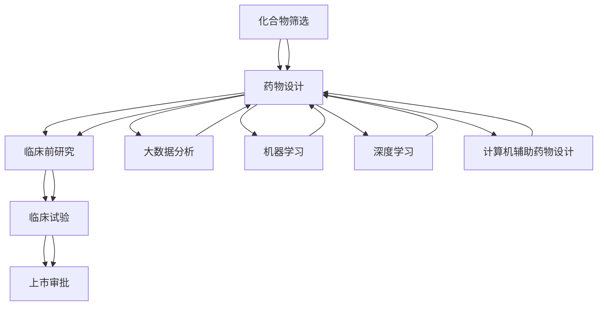

                 

### 文章标题: AI在新药研发中的应用：加速创新与降低成本

关键词：人工智能、新药研发、药物设计、机器学习、创新、成本降低

摘要：本文将探讨人工智能（AI）在新药研发中的应用，如何通过AI技术加速新药的创新进程并降低研发成本。我们将详细分析AI的核心算法、数学模型以及在新药研发中的具体应用场景，结合实际项目实战案例，深入剖析AI如何赋能新药研发，为行业带来革命性变革。

----------------------------------------------------------------

### 引言

新药研发是生物医药领域最具挑战性的任务之一。传统新药研发流程通常包括化合物筛选、药物设计、临床前研究、临床试验等多个阶段，整个过程耗时漫长、成本高昂。随着科技的进步，人工智能（AI）逐渐成为新药研发的重要驱动力。AI技术能够通过大数据分析、机器学习算法和深度学习模型，加速新药的创新进程并降低研发成本。本文将围绕这一主题，逐步分析AI在新药研发中的应用，旨在为读者提供全面的技术解读和实际案例剖析。

### 核心概念与联系：新药研发与AI技术

首先，我们需要了解新药研发的基本流程和涉及的环节，然后讨论AI技术在这些环节中的核心概念及其相互关系。

#### 新药研发基本流程

新药研发通常包括以下几个关键环节：

1. **化合物筛选**：从大量的化合物库中筛选出具有潜在药效的化合物。
2. **药物设计**：通过计算机模拟和分子对接技术，优化化合物的结构，以提高其药效和安全性。
3. **临床前研究**：包括药理学、药代动力学、毒理学等研究，评估候选药物的安全性和有效性。
4. **临床试验**：在人体进行多个阶段的研究，以证明药物的安全性和疗效。
5. **上市审批**：通过监管机构的审批，确保新药的安全性和有效性。

#### AI技术核心概念

AI技术在新药研发中的应用涉及以下几个核心概念：

1. **大数据分析**：通过处理和分析海量的生物学和医学数据，发现潜在的药物靶点和化合物。
2. **机器学习**：利用机器学习算法，从数据中提取知识，预测化合物的药效和毒性。
3. **深度学习**：通过神经网络等深度学习模型，模拟复杂的生物过程，优化药物设计。
4. **计算机辅助药物设计**：利用计算机模拟和虚拟筛选技术，加速药物设计过程。
5. **智能临床试验**：利用AI技术优化临床试验设计和管理，提高临床试验的效率和准确性。

#### 核心概念之间的关系架构 Mermaid 流程图

以下是一个简单的 Mermaid 流程图，展示了新药研发过程中AI技术核心概念的相互关系：

#### AI技术在新药研发中的具体应用

1. **化合物筛选**：AI技术可以通过大数据分析和机器学习算法，从海量化合物库中筛选出具有潜在药效的化合物。例如，使用深度学习模型对化合物的结构进行预测，快速评估其药效和毒性。

2. **药物设计**：AI技术可以帮助药物设计师优化化合物的结构，提高其药效和安全性。例如，通过分子对接技术，AI可以预测化合物与蛋白质结合的能力，从而优化药物分子。

3. **临床前研究**：AI技术可以用于药理学和药代动力学的预测，帮助研究人员快速评估候选药物的安全性和有效性。

4. **临床试验**：AI技术可以优化临床试验的设计和管理，例如，通过数据分析预测哪些患者最可能从某种药物中受益，从而提高临床试验的效率和准确性。

5. **上市审批**：AI技术可以协助监管机构评估新药的安全性和有效性，加快审批流程。

### AI在新药研发中的挑战

虽然AI技术在加速新药研发方面具有巨大潜力，但同时也面临一些挑战：

1. **数据质量**：AI算法的准确性依赖于高质量的数据。在药物研发过程中，数据质量可能受到多种因素的影响，如实验误差、数据缺失和不一致性等。

2. **数据隐私**：药物研发涉及大量的个人健康数据，如何在保证数据隐私的同时，充分利用这些数据进行AI分析，是一个重要问题。

3. **算法可解释性**：机器学习和深度学习算法通常被认为是“黑盒”模型，其内部决策过程难以解释。在药物研发中，算法的可解释性对于确保药物的安全性和有效性至关重要。

4. **伦理和法律问题**：AI在新药研发中的应用可能引发伦理和法律问题，如数据共享、知识产权和责任归属等。

### AI技术在新药研发中的成功案例

以下是几个AI技术在新药研发中的成功案例：

1. **Gilead Sciences**：利用AI技术进行药物设计，成功开发出抗病毒药物Veklury，用于治疗COVID-19。

2. **Exscientia**：利用机器学习算法优化药物设计，实现了从化合物筛选到临床试验的一体化流程，显著提高了研发效率。

3. **Bristol Myers Squibb**：利用深度学习模型进行临床数据挖掘，优化了临床试验的设计，提高了临床试验的成功率。

### 结论

人工智能（AI）技术在新药研发中的应用具有巨大的潜力，能够加速创新进程并降低研发成本。通过大数据分析、机器学习算法和深度学习模型，AI技术正在改变新药研发的传统模式，为生物医药行业带来革命性变革。然而，AI技术在应用过程中也面临数据质量、数据隐私、算法可解释性和伦理法律等挑战。只有克服这些挑战，AI技术才能在新药研发中发挥更大的作用，推动医药行业的持续创新和发展。

