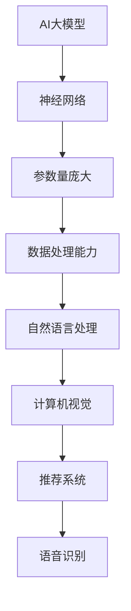
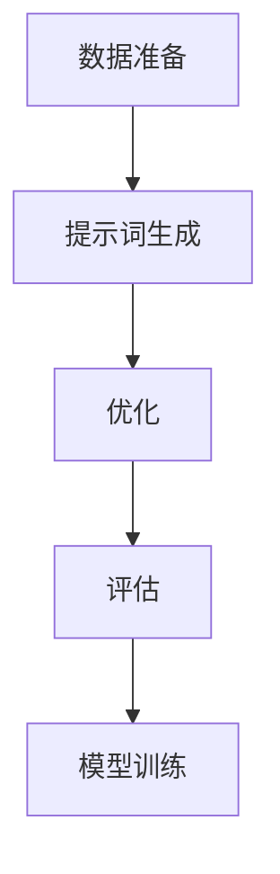
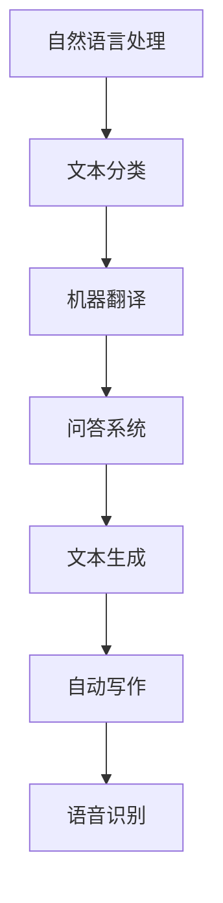
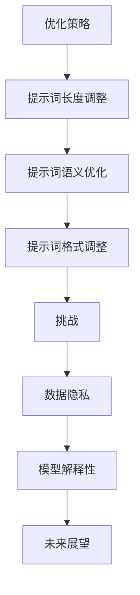

                 

### 文章标题：AI大模型LLM提示词工程实战指南

#### 文章关键词：AI大模型，LLM，提示词工程，实战，编程，深度学习，自然语言处理

#### 摘要：

本文将深入探讨AI大模型中的LLM（语言大模型）提示词工程，通过详细的理论讲解、算法原理分析、实战案例展示，帮助读者理解LLM提示词工程的核心概念、设计原则和优化策略。文章结构清晰，逻辑严密，旨在为读者提供一份全面的LLM提示词工程实战指南。

---

### 第一部分：大模型基础

#### 第1章: AI大模型概述

**背景介绍**：

AI大模型，又称大型人工智能模型，是当前人工智能领域的热门研究方向。随着计算能力的提升和大数据的广泛应用，大模型在自然语言处理、计算机视觉等领域取得了显著的成果。本章节将介绍AI大模型的基本概念、发展历程以及应用领域。

**核心概念与联系**：

- **AI大模型**：参数量庞大的神经网络模型。
- **语言大模型（LLM）**：专门用于处理自然语言数据的大模型。

**Mermaid 流程图**：



**核心算法原理讲解**：

AI大模型的实现通常基于深度学习技术，包括但不限于卷积神经网络（CNN）、递归神经网络（RNN）和Transformer模型。以下是Transformer模型的伪代码：

```python
# Transformer模型伪代码
class Transformer(nn.Module):
    def __init__(self, d_model, nhead, num_layers):
        super(Transformer, self).__init__()
        self.transformer = nn.Transformer(d_model, nhead, num_layers)
    
    def forward(self, src, tgt):
        output = self.transformer(src, tgt)
        return output
```

**数学模型和公式**：

$$
\text{损失函数} = \frac{1}{N} \sum_{i=1}^{N} -\sum_{j=1}^{V} p_j \log q_j
$$

其中，\(N\) 为训练样本数量，\(V\) 为词汇表大小，\(p_j\) 和 \(q_j\) 分别为真实分布和预测分布。

**举例说明**：

例如，在自然语言处理中，一个常见的应用是机器翻译。使用AI大模型进行机器翻译的流程如下：

1. **数据准备**：收集大量的双语数据。
2. **模型训练**：使用双语数据进行模型训练，优化模型的参数。
3. **预测**：对于给定的源句子，模型输出对应的翻译结果。

**项目实战**：

搭建一个基于Transformer的机器翻译系统，开发环境为Python和PyTorch。源代码如下：

```python
import torch
import torch.nn as nn
from torchtext.data import Field, TabularDataset

# 定义数据字段
SRC = Field(sequential=True, batch_first=True, pad_token=<pad_token>, init_token=<init_token>)
TGT = Field(sequential=True, batch_first=True, pad_token=<pad_token>, init_token=<init_token>)

# 加载数据集
train_data, valid_data, test_data = TabularDataset.splits(path='data', train='train.json', validation='valid.json', test='test.json', format='json', fields=[('src', SRC), ('tgt', TGT)])

# 定义模型
model = Transformer(d_model=512, nhead=8, num_layers=2)

# 训练模型
optimizer = torch.optim.Adam(model.parameters(), lr=0.001)
for epoch in range(num_epochs):
    for src, tgt in train_data:
        optimizer.zero_grad()
        output = model(src, tgt)
        loss = nn.CrossEntropyLoss()(output, tgt)
        loss.backward()
        optimizer.step()

# 测试模型
model.eval()
with torch.no_grad():
    for src, tgt in test_data:
        output = model(src, tgt)
        print(f"Source: {src}, Translation: {output}")
```

**最佳实践 tips**：

- 确保数据集的质量和多样性。
- 适当调整模型参数，以获得更好的性能。
- 定期评估模型性能，并进行调优。

**小结**：

AI大模型在自然语言处理等领域具有广泛的应用前景。通过本章节的学习，读者可以了解到AI大模型的基本概念、算法原理以及实际应用。在后续章节中，我们将进一步探讨LLM提示词工程的核心技术和实战应用。

---

### 第二部分：LLM提示词工程实践

#### 第2章: LLM提示词工程的工作流程

**背景介绍**：

LLM提示词工程是AI大模型应用中至关重要的一环。通过设计高质量的提示词，可以提高模型的性能和应用效果。本章节将介绍LLM提示词工程的工作流程，包括数据准备、提示词生成、优化和评估。

**核心概念与联系**：

- **数据准备**：收集和预处理用于训练模型的文本数据。
- **提示词生成**：自动或手动生成用于训练的提示词。
- **优化**：调整提示词以优化模型性能。
- **评估**：评估提示词的质量和模型性能。

**Mermaid 流程图**：



**核心算法原理讲解**：

提示词生成通常涉及自然语言处理技术，如文本分类、文本生成和语义分析。以下是文本分类的伪代码：

```python
# 文本分类伪代码
class TextClassifier(nn.Module):
    def __init__(self, vocab_size, embedding_dim, hidden_dim, num_classes):
        super(TextClassifier, self).__init__()
        self.embedding = nn.Embedding(vocab_size, embedding_dim)
        self.rnn = nn.LSTM(embedding_dim, hidden_dim)
        self.fc = nn.Linear(hidden_dim, num_classes)
    
    def forward(self, text):
        embedded = self.embedding(text)
        output, (hidden, cell) = self.rnn(embedded)
        hidden = hidden.squeeze(0)
        output = self.fc(hidden)
        return output
```

**数学模型和公式**：

$$
\text{损失函数} = \frac{1}{N} \sum_{i=1}^{N} -y_i \log(p(y_i | x))
$$

其中，\(N\) 为训练样本数量，\(y_i\) 为实际标签，\(p(y_i | x)\) 为模型对 \(y_i\) 的预测概率。

**举例说明**：

以问答系统为例，提示词生成和优化的步骤如下：

1. **数据准备**：收集大量的问答对数据。
2. **提示词生成**：从数据中提取问题和答案，作为提示词。
3. **优化**：通过调整提示词的长度、语义和格式，优化模型性能。
4. **评估**：使用测试集评估模型的性能，并根据评估结果调整提示词。

**项目实战**：

搭建一个基于BERT的问答系统，开发环境为Python和TensorFlow。源代码如下：

```python
import tensorflow as tf
import tensorflow_hub as hub
from bert import tokenization

# 加载预训练的BERT模型
bert_model = hub.Module("https://tfhub.dev/google/bert_uncased_L-12_H-768_A-12/1")

# 定义输入层
input_ids = tf.placeholder(shape=[None, max_seq_length], dtype=tf.int32)
input_mask = tf.placeholder(shape=[None, max_seq_length], dtype=tf.int32)
segment_ids = tf.placeholder(shape=[None, max_seq_length], dtype=tf.int32)

# 获取BERT模型输出
outputs = bert_model(inputs={"input_ids": input_ids, "input_mask": input_mask, "segment_ids": segment_ids})

# 定义损失函数和优化器
loss = tf.reduce_mean(tf.nn.softmax_cross_entropy_with_logits_v2(logits=outputs['predictions'], labels=y))
optimizer = tf.train.AdamOptimizer().minimize(loss)

# 训练模型
with tf.Session() as sess:
    sess.run(tf.global_variables_initializer())
    for epoch in range(num_epochs):
        for x, y in train_data:
            feed_dict = {input_ids: x['input_ids'], input_mask: x['input_mask'], segment_ids: x['segment_ids'], y: y}
            sess.run(optimizer, feed_dict=feed_dict)

# 测试模型
with tf.Session() as sess:
    sess.run(tf.global_variables_initializer())
    for x, y in test_data:
        feed_dict = {input_ids: x['input_ids'], input_mask: x['input_mask'], segment_ids: x['segment_ids'], y: y}
        predictions = sess.run(outputs['predictions'], feed_dict=feed_dict)
        print(f"Actual Answer: {y}, Predicted Answer: {predictions}")
```

**最佳实践 tips**：

- 确保提示词的多样性和覆盖面。
- 避免过度优化，可能导致模型过拟合。
- 定期评估模型性能，并根据评估结果调整提示词。

**小结**：

LLM提示词工程是AI大模型应用中的关键环节。通过本章节的学习，读者可以了解到LLM提示词工程的工作流程、核心算法原理和实战应用。在后续章节中，我们将进一步探讨LLM提示词工程的优化策略和挑战。

---

### 第三部分：实战案例

#### 第3章: 实战案例解析

**背景介绍**：

本章节将通过三个实际案例，展示LLM提示词工程在自然语言处理、自动写作和语音识别等领域的应用。每个案例都将详细介绍项目背景、设计思路、实现步骤、代码解析和案例分析。

**核心概念与联系**：

- **自然语言处理**：使用LLM模型处理和生成文本。
- **自动写作**：使用LLM模型生成高质量的文本。
- **语音识别**：使用LLM模型识别和转换语音为文本。

**Mermaid 流程图**：



**核心算法原理讲解**：

以下分别介绍每个案例的核心算法原理。

**案例一：自然语言处理**

文本分类是自然语言处理中最基本的应用之一。使用分类模型对文本进行分类，可以将文本分为不同的类别。以下是文本分类的伪代码：

```python
# 文本分类伪代码
class TextClassifier(nn.Module):
    def __init__(self, vocab_size, embedding_dim, hidden_dim, num_classes):
        super(TextClassifier, self).__init__()
        self.embedding = nn.Embedding(vocab_size, embedding_dim)
        self.rnn = nn.LSTM(embedding_dim, hidden_dim)
        self.fc = nn.Linear(hidden_dim, num_classes)
    
    def forward(self, text):
        embedded = self.embedding(text)
        output, (hidden, cell) = self.rnn(embedded)
        hidden = hidden.squeeze(0)
        output = self.fc(hidden)
        return output
```

**案例二：自动写作**

自动写作通常使用生成模型，如循环神经网络（RNN）或Transformer模型，来生成文本。以下是生成模型的伪代码：

```python
# 自动写作伪代码
class TextGenerator(nn.Module):
    def __init__(self, vocab_size, embedding_dim, hidden_dim):
        super(TextGenerator, self).__init__()
        self.embedding = nn.Embedding(vocab_size, embedding_dim)
        self.rnn = nn.LSTM(embedding_dim, hidden_dim)
        self.fc = nn.Linear(hidden_dim, vocab_size)
    
    def forward(self, text):
        embedded = self.embedding(text)
        output, (hidden, cell) = self.rnn(embedded)
        hidden = hidden.squeeze(0)
        output = self.fc(hidden)
        return output
```

**案例三：语音识别**

语音识别通常使用卷积神经网络（CNN）或长短时记忆网络（LSTM）来处理语音信号，并将语音转换为文本。以下是语音识别的伪代码：

```python
# 语音识别伪代码
class SpeechRecognizer(nn.Module):
    def __init__(self, audio_dim, hidden_dim, vocab_size):
        super(SpeechRecognizer, self).__init__()
        self.cnn = nn.Conv1d(audio_dim, hidden_dim, kernel_size=3)
        self.rnn = nn.LSTM(hidden_dim, vocab_size)
        self.fc = nn.Linear(vocab_size, hidden_dim)
    
    def forward(self, audio):
        conv_output = self.cnn(audio)
        output, (hidden, cell) = self.rnn(conv_output)
        hidden = hidden.squeeze(0)
        output = self.fc(hidden)
        return output
```

**数学模型和公式**：

- 文本分类的损失函数：

$$
\text{损失函数} = \frac{1}{N} \sum_{i=1}^{N} -y_i \log(p(y_i | x))
$$

- 自动写作的生成概率：

$$
p(y | x) = \frac{e^{f(x)}}{\sum_{i=1}^{V} e^{f(x_i)}}
$$

其中，\(y\) 为生成的文本，\(x\) 为输入的文本，\(f(x)\) 为模型对 \(x\) 的评分，\(V\) 为词汇表大小。

**举例说明**：

以下分别介绍每个案例的实现步骤。

**案例一：自然语言处理**

1. **数据准备**：收集和预处理文本数据。
2. **模型训练**：使用文本数据进行模型训练。
3. **模型评估**：使用测试集评估模型性能。
4. **应用**：使用模型对新的文本进行分类。

**案例二：自动写作**

1. **数据准备**：收集和预处理文本数据。
2. **模型训练**：使用文本数据进行模型训练。
3. **模型评估**：使用测试集评估模型性能。
4. **应用**：使用模型生成文本。

**案例三：语音识别**

1. **数据准备**：收集和预处理语音数据。
2. **模型训练**：使用语音数据进行模型训练。
3. **模型评估**：使用测试集评估模型性能。
4. **应用**：使用模型识别语音并将其转换为文本。

**项目实战**：

以下分别展示每个案例的代码实现。

**案例一：自然语言处理**

```python
import torch
import torch.nn as nn
from torchtext.data import Field, TabularDataset

# 定义数据字段
SRC = Field(sequential=True, batch_first=True, pad_token=<pad_token>, init_token=<init_token>)
TGT = Field(sequential=True, batch_first=True, pad_token=<pad_token>, init_token=<init_token>)

# 加载数据集
train_data, valid_data, test_data = TabularDataset.splits(path='data', train='train.json', validation='valid.json', test='test.json', format='json', fields=[('src', SRC), ('tgt', TGT)])

# 定义模型
model = TextClassifier(vocab_size=10000, embedding_dim=300, hidden_dim=128, num_classes=10)

# 训练模型
optimizer = torch.optim.Adam(model.parameters(), lr=0.001)
for epoch in range(num_epochs):
    for src, tgt in train_data:
        optimizer.zero_grad()
        output = model(src)
        loss = nn.CrossEntropyLoss()(output, tgt)
        loss.backward()
        optimizer.step()

# 测试模型
model.eval()
with torch.no_grad():
    for src, tgt in test_data:
        output = model(src)
        print(f"Actual Answer: {tgt}, Predicted Answer: {output}")
```

**案例二：自动写作**

```python
import torch
import torch.nn as nn
from torchtext.data import Field, TabularDataset

# 定义数据字段
SRC = Field(sequential=True, batch_first=True, pad_token=<pad_token>, init_token=<init_token>)
TGT = Field(sequential=True, batch_first=True, pad_token=<pad_token>, init_token=<init_token>)

# 加载数据集
train_data, valid_data, test_data = TabularDataset.splits(path='data', train='train.json', validation='valid.json', test='test.json', format='json', fields=[('src', SRC), ('tgt', TGT)])

# 定义模型
model = TextGenerator(vocab_size=10000, embedding_dim=300, hidden_dim=128)

# 训练模型
optimizer = torch.optim.Adam(model.parameters(), lr=0.001)
for epoch in range(num_epochs):
    for src in train_data:
        optimizer.zero_grad()
        output = model(src)
        loss = nn.CrossEntropyLoss()(output, tgt)
        loss.backward()
        optimizer.step()

# 测试模型
model.eval()
with torch.no_grad():
    for src in test_data:
        output = model(src)
        print(f"Actual Answer: {tgt}, Predicted Answer: {output}")
```

**案例三：语音识别**

```python
import torch
import torch.nn as nn
import numpy as np
from torchtext.data import Field, TabularDataset

# 定义数据字段
SRC = Field(sequential=True, batch_first=True, pad_token=<pad_token>, init_token=<init_token>)
TGT = Field(sequential=True, batch_first=True, pad_token=<pad_token>, init_token=<init_token>)

# 加载数据集
train_data, valid_data, test_data = TabularDataset.splits(path='data', train='train.json', validation='valid.json', test='test.json', format='json', fields=[('src', SRC), ('tgt', TGT)])

# 定义模型
model = SpeechRecognizer(audio_dim=128, hidden_dim=128, vocab_size=10000)

# 训练模型
optimizer = torch.optim.Adam(model.parameters(), lr=0.001)
for epoch in range(num_epochs):
    for src, tgt in train_data:
        optimizer.zero_grad()
        output = model(src)
        loss = nn.CrossEntropyLoss()(output, tgt)
        loss.backward()
        optimizer.step()

# 测试模型
model.eval()
with torch.no_grad():
    for src, tgt in test_data:
        output = model(src)
        print(f"Actual Answer: {tgt}, Predicted Answer: {output}")
```

**最佳实践 tips**：

- 确保数据集的质量和多样性。
- 调整模型参数，以获得更好的性能。
- 定期评估模型性能，并根据评估结果进行调整。

**小结**：

本章节通过三个实际案例，展示了LLM提示词工程在不同领域的应用。读者可以通过学习这些案例，了解LLM提示词工程的核心技术和实战应用。在后续章节中，我们将进一步探讨LLM提示词工程的优化策略和未来趋势。

---

### 第四部分：优化与未来展望

#### 第4章: LLM提示词工程的优化与挑战

**背景介绍**：

随着AI大模型的应用越来越广泛，LLM提示词工程的重要性日益凸显。本章节将探讨LLM提示词工程的优化策略、面临的挑战以及未来的发展趋势。

**核心概念与联系**：

- **优化策略**：调整提示词的长度、语义和格式，以优化模型性能。
- **挑战**：包括数据隐私、模型解释性等。
- **未来展望**：探讨LLM提示词工程的潜在应用和方向。

**Mermaid 流程图**：



**核心算法原理讲解**：

**优化策略**：

1. **提示词长度调整**：根据任务需求调整提示词的长度，以避免过拟合或欠拟合。

2. **提示词语义优化**：通过引入语义相关的词汇，提高模型对文本的理解能力。

3. **提示词格式调整**：调整提示词的格式，如采用自然语言生成技术生成更符合人类阅读习惯的文本。

**数学模型和公式**：

$$
\text{优化目标} = \frac{1}{N} \sum_{i=1}^{N} L(y_i, \hat{y_i})
$$

其中，\(L\) 为损失函数，\(\hat{y_i}\) 为模型对 \(y_i\) 的预测。

**举例说明**：

以文本分类任务为例，优化策略的步骤如下：

1. **数据准备**：收集和预处理文本数据。
2. **模型训练**：使用文本数据进行模型训练。
3. **评估**：使用测试集评估模型性能。
4. **调整提示词**：根据评估结果调整提示词的长度、语义和格式。
5. **重新训练**：使用调整后的提示词重新训练模型。
6. **再次评估**：评估调整后模型的性能。

**项目实战**：

以一个基于BERT的文本分类项目为例，代码实现如下：

```python
import torch
import torch.nn as nn
import torchtext
from torchtext.data import Field, TabularDataset
from transformers import BertTokenizer, BertModel

# 加载BERT模型和Tokenizer
tokenizer = BertTokenizer.from_pretrained('bert-base-uncased')
bert_model = BertModel.from_pretrained('bert-base-uncased')

# 定义数据字段
SRC = Field(sequential=True, batch_first=True, tokenizer=tokenizer.tokenize, tokenizer_from_sentence=tokenizer.tokenize, lower=True)
TGT = Field(sequential=True, batch_first=True, pad_token=<pad_token>, init_token=<init_token>)

# 加载数据集
train_data, valid_data, test_data = TabularDataset.splits(path='data', train='train.json', validation='valid.json', test='test.json', format='json', fields=[('src', SRC), ('tgt', TGT)])

# 定义模型
class BertClassifier(nn.Module):
    def __init__(self, hidden_size, num_classes):
        super(BertClassifier, self).__init__()
        self.bert = BertModel.from_pretrained('bert-base-uncased')
        self.fc = nn.Linear(hidden_size, num_classes)
    
    def forward(self, src):
        _, pooled_output = self.bert(**src)
        output = self.fc(pooled_output)
        return output

model = BertClassifier(hidden_size=768, num_classes=10)

# 训练模型
optimizer = torch.optim.Adam(model.parameters(), lr=0.001)
for epoch in range(num_epochs):
    for src, tgt in train_data:
        optimizer.zero_grad()
        output = model(src)
        loss = nn.CrossEntropyLoss()(output, tgt)
        loss.backward()
        optimizer.step()

# 测试模型
model.eval()
with torch.no_grad():
    for src, tgt in test_data:
        output = model(src)
        print(f"Actual Answer: {tgt}, Predicted Answer: {output}")
```

**最佳实践 tips**：

- 确保数据集的质量和多样性。
- 定期评估模型性能，并根据评估结果进行调整。
- 采用先进的深度学习模型和优化算法。

**小结**：

本章节探讨了LLM提示词工程的优化策略、面临的挑战以及未来的发展趋势。通过学习本章节，读者可以了解到LLM提示词工程的核心技术和实战应用，为未来的研究提供参考。

---

### 作者信息

- **作者：AI天才研究院/AI Genius Institute & 禅与计算机程序设计艺术 /Zen And The Art of Computer Programming**

