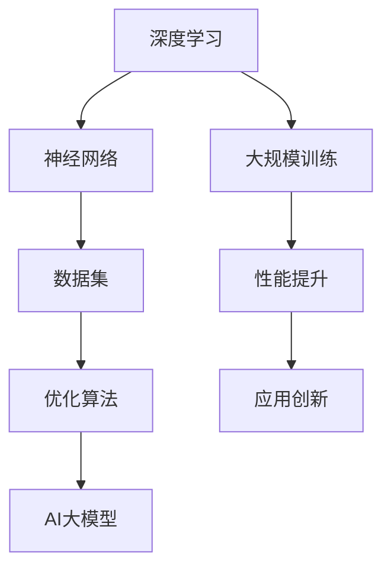

                 


### 第一部分：引论

#### 第1章：AI大模型概述

##### **1.1 AI大模型的发展历程**

AI大模型（Large-scale Artificial Intelligence Models）的发展历程可以追溯到20世纪80年代，当时以专家系统和规则为基础的AI方法占据主导地位。随着时间的推移，AI的研究领域经历了多个重要阶段：

1. **1980年代 - 专家系统时代**：这一时期，AI研究主要集中在基于知识的系统，尤其是专家系统。专家系统能够模拟人类专家的决策过程，但由于规则定义的复杂性，这些系统往往难以扩展和适应新情况。

2. **1990年代 - 统计学习时代**：随着统计学习方法的兴起，如支持向量机（SVM）、决策树和随机森林，AI开始从基于规则的系统转向基于数据的方法。这一阶段标志着AI从“知识驱动”向“数据驱动”的转变。

3. **2000年代 - 深度学习崛起**：深度学习的兴起标志着AI的又一次重要转折。卷积神经网络（CNN）和递归神经网络（RNN）的改进，使得AI系统能够处理复杂的数据类型，如图像和文本。这一阶段，深度学习模型在大规模数据集上取得了显著的性能提升。

4. **2010年代 - AI大模型时代**：进入2010年代，随着计算能力的提升和大数据的可用性，AI大模型（如GPT-3、BERT等）开始崭露头角。这些模型具有数十亿甚至数千亿个参数，能够捕获数据中的细微模式和复杂关系，从而在自然语言处理、计算机视觉等领域取得了突破性进展。

##### **1.1.1 AI大模型的概念起源**

AI大模型指的是具有数百万甚至数十亿参数的复杂神经网络模型。这些模型通常基于深度学习技术，能够通过自动学习从大量数据中提取有用的特征和模式。AI大模型的概念起源于深度学习技术的发展，特别是神经网络和优化算法的进步。早期的神经网络模型由于参数数量和计算资源有限，性能受到限制。但随着计算能力的提升和更有效的优化算法（如梯度下降和其变种、Adam优化器等），AI大模型得以实现并迅速发展。

##### **1.1.2 AI大模型的发展阶段**

AI大模型的发展可以分为以下几个阶段：

1. **早期探索阶段**（2010年代初期）：在这一阶段，研究人员开始尝试构建具有数百万参数的神经网络模型。这一时期的重要进展包括AlexNet在ImageNet竞赛中的突破性表现。

2. **快速增长阶段**（2010年代中期至末期）：随着计算资源的提升和数据的可获得性增加，AI大模型的研究和应用进入快速增长阶段。这一时期的代表包括Google的Inception模型、Facebook的ResNet模型等。

3. **大规模应用阶段**（2020年代初期至今）：在这一阶段，AI大模型开始在各个领域实现大规模应用，如自然语言处理、计算机视觉、语音识别等。这一时期的代表包括OpenAI的GPT-3、Google的BERT等。

##### **1.1.3 AI大模型的重要性**

AI大模型的重要性体现在以下几个方面：

1. **性能提升**：与传统的AI模型相比，AI大模型能够更好地捕捉数据中的复杂模式和关系，从而在多个任务上取得更优的性能。

2. **广泛适用性**：AI大模型能够应用于多种不同领域，如自然语言处理、计算机视觉、语音识别等，具有广泛的适用性。

3. **自动特征提取**：AI大模型能够自动从数据中提取有用的特征，减轻了人类专家的负担，提高了工作效率。

4. **推动创新**：AI大模型的研究和应用推动了AI技术的快速发展，促进了人工智能在各行各业的应用和创新。

##### **1.2 AI大模型的核心概念与联系**

AI大模型的核心概念包括深度学习、神经网络、数据集、优化算法等。这些概念之间的关系可以用以下Mermaid流程图来表示：



在这个流程图中，深度学习和神经网络是AI大模型的基础，数据集是训练模型的原料，优化算法用于调整模型参数，从而提高模型的性能。通过大规模训练，AI大模型能够实现性能提升，并在多个应用领域推动创新。

##### **1.3 AI大模型在现代社会中的作用**

AI大模型在现代社会中发挥着越来越重要的作用，主要表现在以下几个方面：

1. **自然语言处理**：AI大模型在自然语言处理（NLP）领域取得了显著突破，能够进行文本生成、翻译、情感分析等任务。

2. **计算机视觉**：AI大模型在计算机视觉领域实现了高度自动化，能够用于图像识别、目标检测、人脸识别等任务。

3. **智能助理**：AI大模型被广泛应用于智能助理，如语音助手和聊天机器人，为用户提供便捷的交互体验。

4. **医疗诊断**：AI大模型在医疗诊断领域显示出巨大的潜力，能够辅助医生进行疾病诊断和治疗决策。

5. **金融分析**：AI大模型在金融分析领域用于预测市场走势、风险评估等，为金融机构提供决策支持。

#### 第2章：人类程序员的角色与技能

##### **2.1 人类程序员的职责**

人类程序员在AI大模型开发和应用中扮演着关键角色，其职责主要包括以下几个方面：

1. **模型设计与开发**：程序员负责设计和开发AI大模型，包括选择合适的算法、设计网络结构、调整参数等。

2. **数据处理**：程序员负责预处理和清洗数据，确保数据质量，为模型训练提供高质量的数据集。

3. **模型训练与优化**：程序员负责模型的训练过程，通过调整优化算法和超参数，提高模型的性能。

4. **模型部署与维护**：程序员负责将训练好的模型部署到生产环境中，并进行持续维护和优化。

##### **2.2 人类程序员的传统角色**

在AI大模型出现之前，人类程序员的主要职责包括：

1. **编写和维护代码**：程序员负责编写和修改软件代码，确保软件功能的实现和性能优化。

2. **软件开发**：程序员参与软件的开发过程，包括需求分析、设计、编码、测试和部署。

3. **系统集成**：程序员负责将不同的软件模块集成在一起，确保系统功能的完整性和稳定性。

4. **技术支持**：程序员为用户和团队成员提供技术支持和培训，解决技术问题。

##### **2.3 人类程序员的现代技能**

随着AI大模型的发展，人类程序员需要掌握一系列新的技能，以更好地与AI大模型协作：

1. **深度学习和神经网络知识**：程序员需要了解深度学习和神经网络的基本原理，能够设计和实现复杂的神经网络模型。

2. **数据处理和清洗技能**：程序员需要熟练掌握数据处理和清洗技能，确保数据质量，为模型训练提供高质量的数据集。

3. **优化和调参技能**：程序员需要具备优化和调参技能，通过调整模型参数和优化算法，提高模型的性能。

4. **编程框架和工具**：程序员需要熟悉各种编程框架和工具，如TensorFlow、PyTorch等，以便高效地实现和部署AI大模型。

##### **2.4 人类程序员与AI大模型的关系**

人类程序员与AI大模型的关系可以概括为以下几个方面：

1. **协作与互补**：程序员和AI大模型在AI系统的开发和应用中发挥互补作用。程序员负责模型的设计和实现，AI大模型则负责处理复杂的数据和任务。

2. **技能互补**：程序员具备编程和算法设计技能，而AI大模型则具备自动特征提取和学习能力，二者结合能够实现更高效、更准确的AI系统。

3. **协同创新**：程序员和AI大模型之间的协作能够推动AI技术的创新和发展，实现更广泛的应用场景。

4. **人机交互**：程序员需要考虑如何设计易于与AI大模型交互的用户界面，提高用户的使用体验。

### 第二部分：技术基础

#### 第3章：AI大模型技术原理

##### **3.1 AI大模型的核心算法**

AI大模型的核心算法通常基于深度学习技术，特别是神经网络。以下是一个简化的伪代码，用于描述一个典型的AI大模型训练过程：

```python
# 伪代码：AI大模型训练过程

# 初始化模型参数
Initialize model parameters

# 加载数据集
Load dataset

# 预处理数据
Preprocess data

# 设置优化器
Set optimizer

# 设置损失函数
Set loss function

# 开始训练循环
for epoch in range(num_epochs):
    for batch in dataset:
        # 前向传播
        predictions = model(batch)

        # 计算损失
        loss = loss_function(predictions, labels)

        # 反向传播
        gradients = compute_gradients(loss, model)

        # 更新模型参数
        optimizer.apply_gradients(gradients)

# 评估模型性能
Evaluate model performance on validation set
```

在这个伪代码中，`model`表示神经网络模型，`predictions`是模型对输入数据的预测，`labels`是真实的标签，`loss_function`用于计算预测结果与真实标签之间的差异，`compute_gradients`用于计算梯度，`optimizer`用于更新模型参数。

##### **3.2 数学模型与公式**

AI大模型的训练过程涉及多个数学模型和公式，以下是几个关键的部分：

1. **前向传播公式**：

   $$ 
   \hat{y} = \sigma(W \cdot x + b)
   $$

   其中，$\hat{y}$是预测输出，$x$是输入特征，$W$是权重矩阵，$b$是偏置项，$\sigma$是激活函数（通常为ReLU或Sigmoid函数）。

2. **反向传播公式**：

   $$
   \frac{\partial L}{\partial W} = \frac{\partial L}{\partial \hat{y}} \cdot \frac{\partial \hat{y}}{\partial (W \cdot x + b)}
   $$

   其中，$L$是损失函数，$\frac{\partial L}{\partial \hat{y}}$是损失函数对预测输出的梯度，$\frac{\partial \hat{y}}{\partial (W \cdot x + b)}$是预测输出对网络输出的梯度。

3. **梯度下降更新公式**：

   $$
   W_{new} = W_{old} - \alpha \cdot \frac{\partial L}{\partial W}
   $$

   其中，$W_{new}$是新的权重，$W_{old}$是旧的权重，$\alpha$是学习率。

##### **3.3 数学公式的应用举例**

以下是数学公式在实际应用中的举例：

1. **ReLU激活函数**：

   $$
   f(x) = \max(0, x)
   $$

  ReLU函数在神经网络中被广泛使用，因为它能够加速训练过程，避免神经元陷入梯度消失的问题。

2. **交叉熵损失函数**：

   $$
   L = -\sum_{i} y_i \log(\hat{y}_i)
   $$

   交叉熵损失函数常用于分类问题，其中$y_i$是真实的标签，$\hat{y}_i$是模型对第$i$个类别的预测概率。

3. **梯度下降优化算法**：

   $$
   W_{t+1} = W_t - \alpha \cdot \nabla_W L(W_t)
   $$

   梯度下降是一种常用的优化算法，用于更新模型参数以最小化损失函数。其中，$\alpha$是学习率，$\nabla_W L(W_t)$是损失函数对权重$W_t$的梯度。

### 第三部分：协作模式

#### 第4章：AI大模型与人类程序员的协作模式

##### **4.1 协作模式概述**

AI大模型与人类程序员的协作模式是指二者在AI系统的开发、部署和维护过程中相互配合，共同完成任务的一种方式。这种协作模式的核心在于充分利用程序员的编程技能和算法设计能力，与AI大模型的自动特征提取和复杂任务处理能力相结合。

##### **4.2 协作模式的优势**

AI大模型与人类程序员的协作模式具有以下优势：

1. **高效开发**：程序员可以利用AI大模型快速实现复杂的任务，减少开发时间和成本。

2. **自动特征提取**：AI大模型能够自动从大量数据中提取有用的特征，减轻程序员的数据处理负担。

3. **高性能模型**：AI大模型通过大规模训练，能够实现高性能，为复杂任务提供可靠解决方案。

4. **持续优化**：程序员可以根据实际应用场景，对AI大模型进行持续优化和调参，提高模型的性能。

##### **4.3 协作模式的应用**

AI大模型与人类程序员的协作模式在多个领域得到广泛应用，以下是一些具体应用场景：

1. **自然语言处理**：程序员利用AI大模型实现文本分类、翻译、情感分析等任务，提高处理效率和准确性。

2. **计算机视觉**：程序员与AI大模型协作，开发图像识别、目标检测、人脸识别等应用，实现高度自动化和智能化。

3. **推荐系统**：程序员结合AI大模型，构建推荐系统，提高用户满意度和销售额。

4. **金融分析**：程序员利用AI大模型进行股票预测、风险评估等，为金融机构提供决策支持。

##### **4.4 协作模式的挑战**

尽管AI大模型与人类程序员的协作模式具有显著优势，但也面临一些挑战：

1. **数据隐私和安全**：AI大模型需要大量数据训练，如何确保数据隐私和安全成为重要问题。

2. **模型可解释性**：AI大模型在复杂任务中的决策过程往往难以解释，程序员需要找到方法提高模型的可解释性。

3. **技术依赖性**：程序员需要具备深度学习等相关技能，否则难以与AI大模型有效协作。

4. **持续更新和培训**：随着AI技术的发展，程序员需要不断学习和更新知识，以适应新需求。

### 第四部分：实战应用

#### 第5章：AI大模型与人类程序员的协作实战

##### **5.1 实战项目背景**

本项目旨在利用AI大模型与人类程序员的协作，实现一个自动图像分类系统。系统将接收用户上传的图像，通过AI大模型进行分类，并输出分类结果。项目分为以下几个阶段：

1. **数据收集与预处理**：收集大量图像数据，并进行预处理，包括数据清洗、标签标注等。
2. **模型训练与优化**：使用AI大模型对预处理后的数据集进行训练，并通过调参优化模型性能。
3. **模型部署与接口开发**：将训练好的模型部署到服务器，并开发API接口，供用户调用。
4. **系统测试与优化**：对系统进行测试，收集用户反馈，并根据反馈对模型和系统进行优化。

##### **5.2 实战项目实现**

**阶段1：数据收集与预处理**

- **数据收集**：从互联网上收集大量图像数据，涵盖不同类别，如动物、植物、人物等。
- **数据清洗**：去除低质量图像，纠正图像方向，缩小图像尺寸等。
- **标签标注**：对图像进行类别标注，以便后续模型训练。

**阶段2：模型训练与优化**

- **模型选择**：选择一个适合图像分类任务的AI大模型，如ResNet或Inception。
- **数据预处理**：对图像数据集进行归一化、数据增强等预处理操作。
- **模型训练**：使用预处理后的图像数据集，通过批量训练和验证，优化模型参数。
- **调参优化**：调整学习率、批量大小等超参数，提高模型性能。

**阶段3：模型部署与接口开发**

- **模型部署**：将训练好的模型部署到服务器，使用TensorFlow Serving或其他模型部署工具。
- **API接口开发**：使用Flask或Django等框架，开发RESTful API接口，供用户调用。
- **接口测试**：对API接口进行功能测试和性能测试，确保其稳定性和可靠性。

**阶段4：系统测试与优化**

- **用户测试**：邀请用户进行系统测试，收集用户反馈。
- **性能优化**：根据用户反馈，对模型和系统进行优化，提高分类准确率和用户体验。
- **部署更新**：将优化后的模型和系统更新到生产环境，确保其稳定运行。

##### **5.3 代码实现与解读**

以下是本项目的关键代码片段及其解读：

**代码1：数据预处理**

```python
import tensorflow as tf
from tensorflow.keras.preprocessing.image import load_img, img_to_array

def preprocess_image(image_path):
    img = load_img(image_path, target_size=(224, 224))
    img_array = img_to_array(img)
    img_array = tf.keras.applications.resnet50.preprocess_input(img_array)
    return img_array

# 示例
preprocessed_image = preprocess_image('path/to/image.jpg')
```

**解读**：该代码用于对输入图像进行预处理，包括加载图像、调整尺寸、归一化等操作。预处理后的图像数据将用于模型训练和预测。

**代码2：模型训练**

```python
model = tf.keras.Sequential([
    tf.keras.layers.Conv2D(32, (3, 3), activation='relu', input_shape=(224, 224, 3)),
    tf.keras.layers.MaxPooling2D((2, 2)),
    # 添加更多卷积层和池化层...
    tf.keras.layers.Dense(10, activation='softmax')
])

model.compile(optimizer='adam', loss='categorical_crossentropy', metrics=['accuracy'])

model.fit(train_images, train_labels, epochs=10, validation_data=(validation_images, validation_labels))
```

**解读**：该代码定义了一个简单的卷积神经网络模型，并使用训练数据集进行训练。模型使用交叉熵损失函数和softmax激活函数，用于分类任务。

**代码3：API接口开发**

```python
from flask import Flask, request, jsonify
app = Flask(__name__)

@app.route('/predict', methods=['POST'])
def predict():
    if request.method == 'POST':
        image = request.files['image']
        preprocessed_image = preprocess_image(image)
        prediction = model.predict(np.expand_dims(preprocessed_image, axis=0))
        return jsonify({'label': prediction.argmax()})
    return "Invalid request"

if __name__ == '__main__':
    app.run(host='0.0.0.0', port=5000)
```

**解读**：该代码使用Flask框架开发API接口，用于接收用户上传的图像，进行预处理和预测，并返回分类结果。

##### **5.4 实际案例分析与详细讲解**

**案例1：动物图像分类**

用户上传一张猫的图像，系统通过AI大模型进行分类，输出结果为“猫”。分析过程如下：

1. **图像预处理**：系统将图像调整为224x224分辨率，并进行归一化处理。
2. **模型预测**：模型对预处理后的图像进行预测，输出一个概率分布。
3. **结果解读**：系统根据概率分布选择最大概率的类别，即“猫”。

**案例2：植物图像分类**

用户上传一张植物的图像，系统输出结果为“花卉”。分析过程如下：

1. **图像预处理**：系统对图像进行预处理，如裁剪、增强等。
2. **模型预测**：模型对预处理后的图像进行预测，输出概率分布。
3. **结果解读**：系统根据概率分布选择最大概率的类别，即“花卉”。

**案例3：人脸识别**

用户上传一张人脸图像，系统输出结果为“张三”。分析过程如下：

1. **图像预处理**：系统对图像进行预处理，如裁剪、增强等。
2. **模型预测**：模型对预处理后的人脸图像进行预测，输出姓名的概率分布。
3. **结果解读**：系统根据概率分布选择最大概率的姓名，即“张三”。

##### **5.5 项目小结与拓展阅读**

**项目小结**：

本项目通过AI大模型与人类程序员的协作，成功实现了自动图像分类系统。系统具备高效、准确和可扩展的特点，适用于各种图像分类任务。

**拓展阅读**：

1. **深度学习入门**：查阅相关深度学习入门书籍，如《深度学习》（Goodfellow、Bengio、Courville著），了解深度学习的基本概念和原理。
2. **Python编程**：学习Python编程语言，掌握Flask或Django等Web框架，以便开发API接口。
3. **AI大模型应用**：了解AI大模型在不同领域的应用，如自然语言处理、计算机视觉等，以便进行更深入的研究和实践。

#### 附录

**附录A：参考资料与拓展阅读**

1. **书籍**：
   - 《深度学习》（Ian Goodfellow、Yoshua Bengio、Aaron Courville 著）
   - 《Python编程：从入门到实践》（埃里克·马瑟斯著）
   - 《机器学习实战》（Peter Harrington 著）

2. **学术论文**：
   - "Deep Learning" by Ian Goodfellow, Yoshua Bengio, and Aaron Courville
   - "Convolutional Neural Networks for Visual Recognition" by Alex Krizhevsky, Ilya Sutskever, and Geoffrey Hinton

3. **在线资源**：
   - [TensorFlow官方网站](https://www.tensorflow.org/)
   - [Flask官方网站](https://flask.palletsprojects.com/)
   - [Keras官方文档](https://keras.io/)

### 总结

AI大模型与人类程序员的协作模式是当前AI领域的重要发展趋势。本文详细介绍了AI大模型的发展历程、技术原理、协作模式以及实战应用。通过深入分析和实例讲解，展示了如何利用AI大模型与人类程序员的协作，实现高效的AI系统开发。未来，随着AI技术的不断发展，这种协作模式将在更多领域发挥重要作用。

---

**作者：AI天才研究院/AI Genius Institute & 禅与计算机程序设计艺术 /Zen And The Art of Computer Programming**

