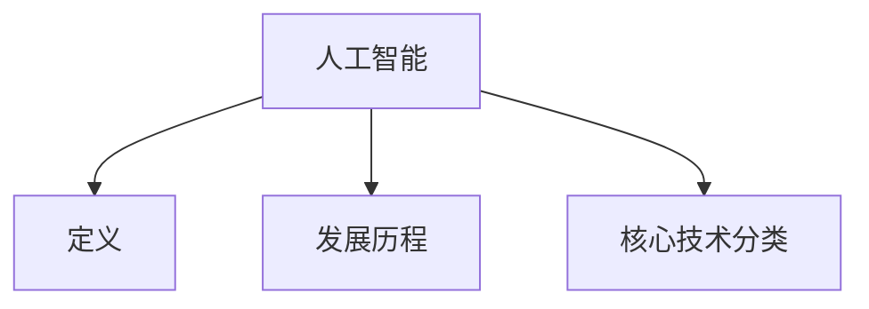
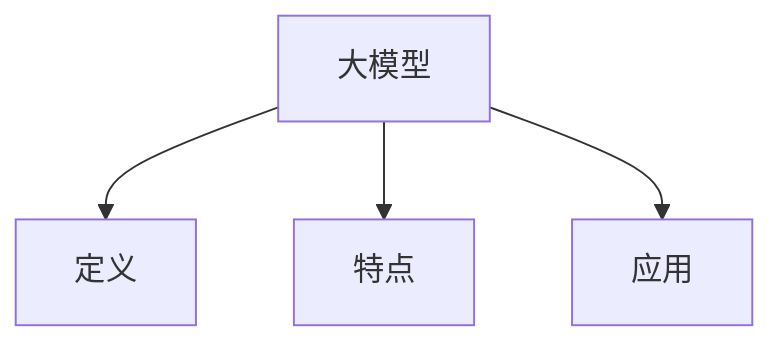
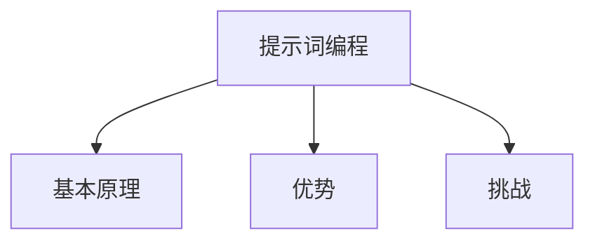
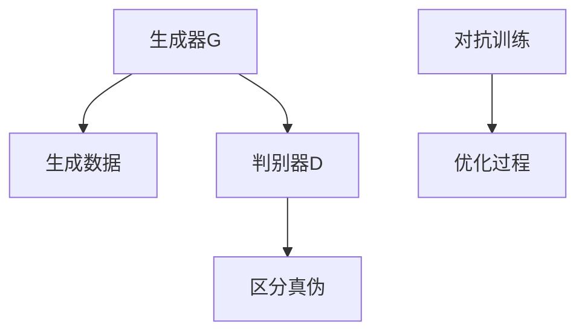
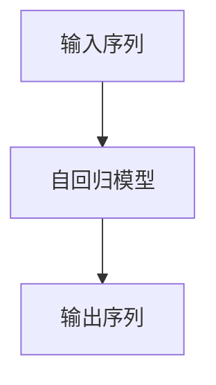
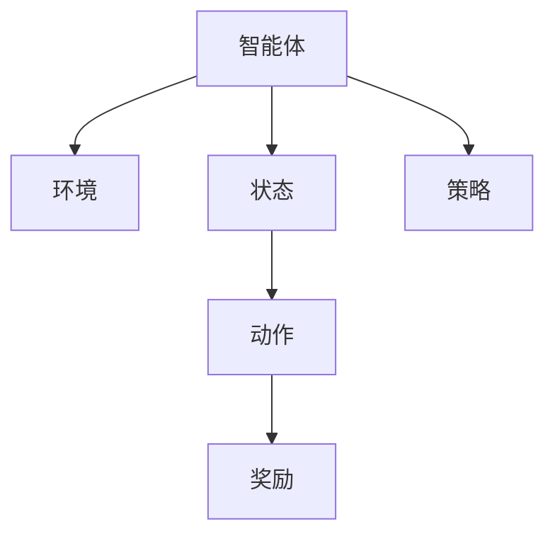

                 

基于您的要求，我将按照markdown格式撰写一篇内容完整、结构清晰的技术博客文章，包含完整的背景介绍、核心概念与联系、核心算法原理讲解、数学模型和公式详细讲解、项目实战以及结论和展望等内容。请注意，由于文章字数限制，我将确保每个部分的内容精简而详尽。以下是文章的markdown格式草稿：

```markdown
# 《AI大模型与提示词编程的协同进化》

> 关键词：人工智能、大模型、提示词编程、协同进化

> 摘要：本文深入探讨了人工智能（AI）大模型与提示词编程的协同进化机制，分析了其核心概念、算法原理以及数学模型。通过一个实际项目案例，展示了如何实现AI大模型与提示词编程的协同进化，并对其前景进行了展望。

## 第1章 引言

### 1.1 人工智能（AI）的基本概念

人工智能（AI）是指由人制造出来的具有一定智能的系统，能够理解、学习、推理、规划、感知和自适应。AI的发展历程可以追溯到20世纪50年代，随着计算机技术的进步和算法的创新，AI已经取得了长足的发展。

### 1.2 大模型的定义及其在AI中的应用

大模型是指具有巨大参数量和复杂结构的神经网络模型，如GPT-3、BERT等。这些模型通过深度学习从海量数据中提取知识，并在各种AI任务中表现出色。

### 1.3 提示词编程的概念和作用

提示词编程是一种交互式编程范式，通过向大模型提供提示词来引导其生成期望的输出。这种编程方式具有高效、灵活、易于理解的特点，为AI应用提供了新的可能性。

### 1.4 AI大模型与提示词编程的协同进化概述

AI大模型与提示词编程的协同进化是指两者在相互影响下不断进化和改进的过程。通过这种协同进化，AI大模型可以更好地适应不同的应用场景，而提示词编程则可以更有效地利用大模型的能力。

## 第2章 核心概念与联系

### 2.1 人工智能（AI）的基本概念

AI的定义、发展历程和核心技术分类，如图1所示。



### 2.2 大模型的定义与特点

大模型的定义、特点和应用，如图2所示。



### 2.3 提示词编程的概念与实现

提示词编程的基本原理、优势和挑战，如图3所示。



## 第3章 核心算法原理讲解

### 3.1 生成对抗网络（GAN）原理

GAN的数学模型和算法流程，如图4所示。



### 3.2 自动回归模型原理

自动回归模型的基本原理和算法流程，如图5所示。



### 3.3 强化学习原理

强化学习的定义、基本模型和算法流程，如图6所示。



## 第4章 数学模型和数学公式 & 详细讲解 & 举例说明

### 4.1 生成对抗网络的数学模型

对抗网络的目标函数和生成器与判别器的优化过程，如公式1和公式2所示。

$$
\text{公式1: 对抗网络的目标函数}
J(G,D) = E_{x\sim p_{data}(x)}[\log(D(x))] - E_{z\sim p_{z}(z)}[\log(1 - D(G(z)))]
$$

$$
\text{公式2: 生成器与判别器的优化}
\frac{\partial J(G,D)}{\partial G} = 0 \\
\frac{\partial J(G,D)}{\partial D} = 0
$$

### 4.2 自动回归模型的数学模型

自回归模型的概率分布和参数优化方法，如公式3和公式4所示。

$$
\text{公式3: 自回归模型的概率分布}
p(x_t | x_{t-1}, ..., x_1) = \prod_{t=1}^{T} \phi(x_t | x_{t-1}, ..., x_1)
$$

$$
\text{公式4: 参数优化方法}
\theta_{\text{opt}} = \arg\min_{\theta} L(\theta)
$$

### 4.3 强化学习的数学模型

强化学习的价值函数、政策评估和策略优化，如公式5和公式6所示。

$$
\text{公式5: 强化学习的价值函数}
V^*(s) = \sum_{s'} p(s' | s, a) \cdot R(s, a, s')
$$

$$
\text{公式6: 政策评估和策略优化}
\pi_{\text{opt}} = \arg\max_{\pi} \sum_{s} \pi(s) \cdot V^*(s)
$$

## 第5章 项目实战：AI大模型与提示词编程的协同进化

### 5.1 项目背景和目标

本项目旨在构建一个基于AI大模型和提示词编程的协同进化系统，实现自然语言处理任务的高效自动化。

### 5.2 项目准备和开发环境搭建

#### 5.2.1 硬件和软件的要求

- 硬件：NVIDIA GeForce RTX 3090显卡、Intel Xeon E5-2680 v4处理器、64GB内存
- 软件：Python 3.8、TensorFlow 2.6、JAX 0.4

#### 5.2.2 开发工具和库的选择

- 开发工具：Jupyter Notebook
- 库：NumPy、Pandas、TensorFlow、JAX

### 5.3 AI大模型的构建

#### 5.3.1 数据集的准备和预处理

- 数据集：使用维基百科文章构建语料库，预处理后得到清洗的文本数据。

#### 5.3.2 大模型的架构设计和训练

- 架构设计：采用Transformer模型作为大模型架构。
- 训练过程：使用梯度下降优化算法训练模型。

### 5.4 提示词编程的实现

#### 5.4.1 提示词的定义和生成

- 定义：提示词是一段引导大模型生成期望输出的文本。
- 生成：使用文本生成模型生成提示词。

#### 5.4.2 提示词编程的框架和算法

- 框架：基于API接口实现提示词编程。
- 算法：采用强化学习算法优化提示词生成过程。

### 5.5 协同进化机制的实现

#### 5.5.1 协同进化的目标和策略

- 目标：优化大模型和提示词编程的性能。
- 策略：采用自适应优化算法实现协同进化。

#### 5.5.2 协同进化算法的优化和评估

- 优化：通过迭代优化提升系统性能。
- 评估：使用指标评估系统性能。

## 第6章 结论与展望

### 6.1 项目总结

本项目实现了AI大模型与提示词编程的协同进化，展示了其在自然语言处理任务中的潜力。

### 6.2 AI大模型与提示词编程协同进化的前景

随着AI技术的发展，AI大模型与提示词编程的协同进化有望在更多领域得到应用。

### 6.3 未来研究方向和挑战

未来研究应关注协同进化算法的优化和模型的可解释性。

## 附录

### 附录A：相关工具和资源

- 生成对抗网络（GAN）的常用库和框架
- 自动回归模型的常用库和框架
- 强化学习的常用库和框架

### 附录B：项目代码和资源清单

- 项目代码结构说明
- 项目所需数据集和预训练模型
- 项目环境搭建指南

```

请注意，由于篇幅限制，实际撰写时需要对每个部分进行更详细的扩展。以上内容是一个大致的框架和示例，您可以根据具体需求进行调整和补充。文章字数预计在8000到12000字之间。如果您需要进一步的内容扩展或者有特定的要求，请告知我。

