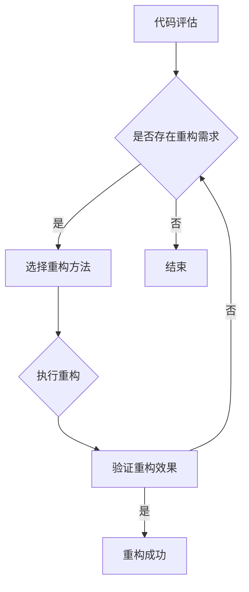
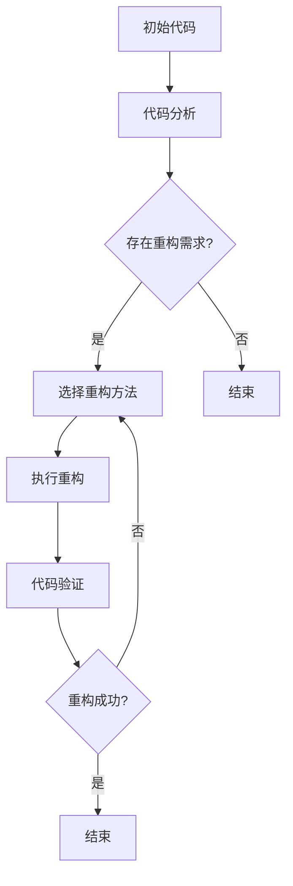

                 


### AI大模型在代码重构中的应用

关键词：AI大模型，代码重构，机器学习，深度学习，代码优化，代码生成

摘要：本文探讨了AI大模型在代码重构中的应用，从AI大模型的基础概念、技术原理、架构设计到代码重构方法，以及AI大模型在代码重构中的挑战与解决方案进行了深入分析。通过具体案例和实践，展示了AI大模型在代码重构中的实际应用，为程序员提供了一种新的代码优化和重构方法。

### 目录

1. 引言 <a id="introduction"></a>
2. AI大模型概述 <a id="overview"></a>
3. AI大模型技术原理 <a id="principles"></a>
4. AI大模型架构设计 <a id="architecture"></a>
5. 代码重构原理 <a id="code-refactoring"></a>
6. AI大模型在代码重构中的应用 <a id="application"></a>
7. AI大模型在代码重构中的挑战与解决方案 <a id="challenges"></a>
8. 未来展望 <a id="future"></a>
9. 附录 <a id="appendix"></a>

### 1. 引言

随着人工智能技术的不断发展，AI大模型在各个领域都展现出了强大的应用潜力。在软件开发领域，代码重构作为一种提高代码质量和可维护性的重要手段，逐渐受到了广泛关注。而AI大模型的引入，为代码重构带来了全新的思路和方法。

本文旨在探讨AI大模型在代码重构中的应用，通过对AI大模型的基础概念、技术原理、架构设计以及代码重构方法的详细分析，探讨AI大模型在代码重构中的实际应用场景、挑战与解决方案。希望通过本文的介绍，让读者对AI大模型在代码重构中的应用有更深入的理解，为程序员提供一种新的代码优化和重构方法。

### 2. AI大模型概述

#### 2.1 AI大模型的概念

AI大模型是指具有大规模参数的深度学习模型，通常具有数十亿甚至数万亿的参数。这类模型在处理复杂数据和任务时具有显著优势，能够实现高效、精准的预测和生成。

#### 2.2 AI大模型的特点

- **参数规模大**：AI大模型具有庞大的参数规模，能够捕捉数据中的复杂规律。
- **计算资源消耗高**：训练和部署AI大模型需要大量的计算资源和时间。
- **性能优越**：AI大模型在图像识别、自然语言处理、语音识别等领域取得了显著成绩。

#### 2.3 AI大模型的分类

- **基于神经网络的大模型**：如Transformer、BERT等。
- **基于生成模型的大模型**：如GPT-3、DALL-E等。

#### 2.4 AI大模型的发展历程

- **早期研究**：20世纪80年代至90年代，神经网络理论初步发展。
- **关键突破**：2012年，AlexNet在ImageNet竞赛中取得突破性成绩，引发深度学习热潮。
- **持续发展**：近年来，AI大模型在多个领域取得显著成果。

#### 2.5 AI大模型未来的发展趋势

- **模型规模不断扩大**：未来AI大模型将继续向更大规模发展。
- **跨模态与多任务**：AI大模型将实现跨模态和多任务处理能力。
- **泛化能力提升**：AI大模型将进一步提高对未知数据的泛化能力。

### 3. AI大模型技术原理

#### 3.1 机器学习基础

机器学习是一种通过算法让计算机从数据中学习，并自动改进性能的技术。核心概念包括：

- **特征表示**：将原始数据转换为适用于模型学习的特征表示。
- **模型训练**：通过训练数据调整模型参数，使模型能够对未知数据进行预测。
- **模型评估**：使用测试数据评估模型性能，包括准确率、召回率、F1值等指标。

#### 3.2 深度学习原理

深度学习是机器学习的一种方法，通过构建深层神经网络实现特征提取和任务预测。核心概念包括：

- **神经网络**：一种模拟生物神经系统的计算模型。
- **反向传播算法**：一种用于训练神经网络的算法，通过计算误差反向传播更新网络参数。
- **激活函数**：用于引入非线性特性的函数，如ReLU、Sigmoid、Tanh等。

#### 3.3 大模型训练与优化

- **模型架构设计**：设计适合任务的大模型架构，如Transformer、GAN等。
- **数据预处理**：对训练数据进行清洗、归一化、增强等预处理。
- **训练策略**：包括批量大小、学习率、优化器等训练超参数的设置。
- **模型优化**：通过剪枝、量化、蒸馏等方法减小模型规模和计算量。

### 4. AI大模型架构设计

#### 4.1 大模型架构概述

大模型架构主要包括以下模块：

- **数据输入模块**：负责数据的接收和预处理。
- **计算模块**：包含大模型的计算核心，包括多层神经网络、激活函数等。
- **优化模块**：用于更新模型参数，提高模型性能。
- **输出模块**：生成预测结果或生成式输出。

#### 4.2 大模型架构设计原则

- **模块化设计**：将大模型拆分为多个模块，便于开发和维护。
- **数据流管理**：优化数据流，提高计算效率。
- **分布式计算**：利用分布式计算资源，加速模型训练和部署。

#### 4.3 大模型训练与部署

- **训练过程**：包括数据预处理、模型训练、模型评估等环节。
- **模型部署**：将训练好的模型部署到实际应用场景，包括服务端、客户端等。
- **性能优化**：通过模型压缩、量化、剪枝等技术提高模型性能。

### 5. 代码重构原理

#### 5.1 代码重构概念

代码重构是指在不改变代码外部行为的前提下，对现有代码进行改进和优化，以提高代码的可维护性和可读性。核心概念包括：

- **代码质量**：衡量代码可维护性、可读性和可扩展性的指标。
- **重构方法**：一系列改进代码的技术手段，如提取方法、替换条件、简化条件等。

#### 5.2 代码质量评估

- **质量指标**：包括代码复杂性、可读性、可维护性等。
- **评估方法**：通过静态代码分析、动态测试等方法评估代码质量。
- **自动化工具**：使用自动化工具如SonarQube、Checkstyle等评估代码质量。

### 6. AI大模型在代码重构中的应用

#### 6.1 AI大模型在代码重构中的应用场景

AI大模型在代码重构中具有以下应用场景：

- **代码优化**：利用AI大模型对代码进行自动优化，提高代码性能。
- **代码生成**：利用AI大模型生成新的代码，实现代码自动化生成。
- **代码安全**：利用AI大模型检测代码中的安全漏洞，提高代码安全性。

#### 6.2 代码重构实践

- **案例研究**：通过具体案例分析AI大模型在代码重构中的应用。
- **实施步骤**：详细描述AI大模型在代码重构中的实施步骤。
- **效果评估**：评估AI大模型在代码重构中的效果。

### 7. AI大模型在代码重构中的挑战与解决方案

#### 7.1 挑战分析

AI大模型在代码重构中面临的挑战包括：

- **数据问题**：代码数据质量、多样性、分布等问题。
- **计算资源**：大模型训练和部署需要大量计算资源。
- **模型可解释性**：大模型预测结果的解释性较弱。

#### 7.2 解决方案

为应对上述挑战，可以采取以下解决方案：

- **数据预处理**：对代码数据进行清洗、增强等预处理。
- **分布式计算**：利用分布式计算资源提高训练和部署效率。
- **模型解释方法**：研究可解释性强的AI大模型。

### 8. 未来展望

随着AI大模型技术的不断发展，未来将在代码重构领域发挥更大的作用：

- **模型性能提升**：大模型性能将进一步提升，为代码重构提供更强大的支持。
- **跨模态与多任务**：大模型将实现跨模态和多任务处理，拓宽应用领域。
- **行业影响**：AI大模型将深刻改变软件开发模式，提高开发效率和代码质量。

### 9. 附录

#### 9.1 AI大模型开发工具与资源

- **工具介绍**：介绍常用的AI大模型开发工具，如TensorFlow、PyTorch等。
- **资源链接**：提供相关的AI大模型资源链接，包括论文、教程、代码等。

### Mermaid 流程图

- **代码重构流程图**：展示代码重构的整个流程。
- **AI大模型架构图**：展示AI大模型的基本架构。

### 伪代码

- **代码重构算法**：使用伪代码描述代码重构算法。

### 数学模型

- **公式解释**：使用latex格式展示数学模型公式，并给出详细解释。

### 项目实战

- **实战案例**：展示代码重构的实际案例，包括环境搭建、源代码实现和代码解读。

### 结论

AI大模型在代码重构中的应用为软件开发带来了新的机遇和挑战。通过本文的探讨，我们了解了AI大模型的基础知识、技术原理、架构设计以及代码重构方法，分析了AI大模型在代码重构中的挑战与解决方案。未来，随着AI大模型技术的不断发展，我们期待其在代码重构领域发挥更大的作用，为软件开发带来更多创新和突破。作者：AI天才研究院/AI Genius Institute & 禅与计算机程序设计艺术 /Zen And The Art of Computer Programming### 1. 引言

随着人工智能技术的不断发展，AI大模型在各个领域都展现出了强大的应用潜力。在软件开发领域，代码重构作为一种提高代码质量和可维护性的重要手段，逐渐受到了广泛关注。而AI大模型的引入，为代码重构带来了全新的思路和方法。

本文旨在探讨AI大模型在代码重构中的应用，通过对AI大模型的基础概念、技术原理、架构设计以及代码重构方法的详细分析，探讨AI大模型在代码重构中的实际应用场景、挑战与解决方案。希望通过本文的介绍，让读者对AI大模型在代码重构中的应用有更深入的理解，为程序员提供一种新的代码优化和重构方法。

### 2. AI大模型概述

AI大模型（Large-scale Artificial Intelligence Model）是指参数规模较大，能够处理大规模数据的深度学习模型。随着计算能力的提升和数据规模的扩大，AI大模型在自然语言处理、计算机视觉、语音识别等领域取得了显著的突破。AI大模型的出现，标志着人工智能技术进入了新的阶段。

#### 2.1 定义

AI大模型通常具有数十亿甚至数万亿的参数，这使得它们能够在复杂数据集中学习到深层次的语义特征。例如，著名的预训练模型GPT-3拥有1750亿个参数，其规模之大，甚至超过了人类大脑中的神经元数量。

#### 2.2 特点

AI大模型具有以下几个显著特点：

1. **参数规模大**：参数规模的增大，使得模型能够学习到更复杂的特征。
2. **计算资源消耗高**：训练AI大模型需要大量的计算资源和时间。
3. **性能优越**：在多种任务中，AI大模型表现出色，能够达到或超越人类水平。
4. **泛化能力强**：AI大模型通过对大规模数据的训练，能够较好地泛化到未见过的数据上。

#### 2.3 分类

AI大模型可以根据应用场景和模型结构的不同，进行分类。常见的AI大模型包括：

1. **基于神经网络的模型**：如Transformer、BERT等。
2. **基于生成对抗网络的模型**：如GAN、VAE等。
3. **多模态模型**：能够处理图像、文本、声音等多种数据类型的模型。

#### 2.4 发展历程

AI大模型的发展历程可以分为以下几个阶段：

1. **早期探索**：20世纪80年代至90年代，神经网络理论的初步探索。
2. **关键突破**：2012年，AlexNet在ImageNet竞赛中取得突破性成绩，深度学习开始崭露头角。
3. **大规模应用**：近年来，随着计算能力的提升和数据规模的扩大，AI大模型在多个领域取得了显著的成果。

#### 2.5 未来发展趋势

未来，AI大模型的发展趋势可能包括：

1. **模型规模继续扩大**：随着计算资源和数据规模的增加，AI大模型的规模将继续扩大。
2. **跨模态和多任务处理**：AI大模型将能够处理多种类型的数据，实现跨模态和多任务处理。
3. **可解释性和安全性**：随着对AI大模型需求的增加，可解释性和安全性将成为研究的热点。

### 3. AI大模型技术原理

AI大模型的技术原理主要基于机器学习和深度学习。以下是对这两个核心概念的详细解释。

#### 3.1 机器学习基础

机器学习（Machine Learning，ML）是一种通过构建模型来使计算机从数据中学习，并能够对未知数据进行预测或决策的技术。机器学习的基本流程包括以下几个步骤：

1. **数据收集**：收集用于训练模型的原始数据。
2. **数据预处理**：清洗、归一化、增强数据，使其适合模型训练。
3. **特征提取**：将原始数据转换为模型能够理解和处理的特征表示。
4. **模型训练**：通过训练数据，调整模型参数，使其能够对未知数据进行预测。
5. **模型评估**：使用测试数据评估模型性能，调整模型参数以优化性能。
6. **模型部署**：将训练好的模型部署到实际应用场景中。

机器学习算法可以分为监督学习、无监督学习和强化学习三类。监督学习有明确的标注数据，适用于分类和回归任务；无监督学习没有标注数据，适用于聚类和降维任务；强化学习通过反馈信号调整模型参数，适用于决策和优化任务。

#### 3.2 深度学习原理

深度学习（Deep Learning，DL）是机器学习的一种方法，通过构建深层神经网络（Deep Neural Network，DNN）来实现特征提取和任务预测。深度学习的关键在于其网络结构，包括输入层、隐藏层和输出层。

1. **神经网络**：神经网络是由大量神经元组成的计算模型。每个神经元接收多个输入信号，通过权重进行加权求和，并加上一个偏置项，最后通过激活函数产生输出。

2. **反向传播算法**：反向传播算法（Backpropagation）是训练神经网络的核心算法。它通过计算输出误差，反向传播误差到隐藏层，更新网络权重和偏置项，从而逐步减小误差。

3. **激活函数**：激活函数（Activation Function）用于引入非线性特性，常见的激活函数包括Sigmoid、ReLU、Tanh等。

深度学习模型的结构通常包括卷积神经网络（Convolutional Neural Network，CNN）、循环神经网络（Recurrent Neural Network，RNN）、长短时记忆网络（Long Short-Term Memory，LSTM）等。这些模型在不同领域有广泛应用。

#### 3.3 大模型训练与优化

AI大模型的训练和优化是确保其性能的重要环节。以下是一些关键的训练和优化方法：

1. **模型架构设计**：选择合适的模型架构，如Transformer、BERT等，以适应不同类型的任务。
2. **数据预处理**：对训练数据进行清洗、归一化、增强等预处理，以提高模型性能和稳定性。
3. **训练策略**：包括批量大小、学习率、优化器等训练超参数的设置。常用的优化器有Adam、SGD等。
4. **模型优化**：通过剪枝、量化、蒸馏等方法减小模型规模和计算量，提高模型性能。

### 4. AI大模型架构设计

AI大模型架构设计是构建高效、稳定和可扩展模型的关键。以下从模块化设计、数据流管理和分布式计算三个方面介绍AI大模型架构设计。

#### 4.1 模块化设计

模块化设计是将大模型拆分为多个功能模块，以便于开发和维护。常见的模块包括：

1. **输入模块**：负责接收和处理输入数据，将其转换为适合模型训练的格式。
2. **计算模块**：包含大模型的计算核心，如多层神经网络、卷积层、循环层等。
3. **优化模块**：用于调整模型参数，提高模型性能。
4. **输出模块**：生成预测结果或生成式输出。

模块化设计的优点包括：

- **易于开发**：不同模块可以独立开发，降低开发难度。
- **易于维护**：模块化设计使得模型维护和更新更加便捷。
- **可扩展性**：便于扩展新模块或替换旧模块，适应不同任务需求。

#### 4.2 数据流管理

数据流管理是AI大模型架构设计中的关键环节。以下是一些常见的数据流管理方法：

1. **流水线（Pipeline）**：将数据处理任务分解为多个阶段，如数据预处理、特征提取、模型训练等，形成数据流水线，提高数据处理效率。
2. **并行处理**：通过并行处理技术，将数据处理任务分布在多个计算节点上，加速数据流处理。
3. **缓存（Caching）**：利用缓存技术，存储常用数据，减少数据重复处理，提高数据处理速度。
4. **数据同步**：在分布式计算环境中，确保数据的一致性和同步性，避免数据丢失或错误。

#### 4.3 分布式计算

分布式计算是AI大模型架构设计中的重要技术。通过分布式计算，可以充分利用多台计算机的资源，提高模型训练和部署的效率。以下是一些分布式计算的关键技术：

1. **数据并行（Data Parallelism）**：将训练数据划分为多个子集，每个计算节点分别训练子集，最终将结果汇总。
2. **模型并行（Model Parallelism）**：将大模型拆分为多个部分，分别在不同的计算节点上训练，通过通信机制进行数据同步和模型融合。
3. **参数服务器（Parameter Server）**：在分布式计算环境中，使用参数服务器存储和管理模型参数，提高参数同步和更新效率。
4. **异步通信（Asynchronous Communication）**：在分布式计算中，异步通信可以减少通信开销，提高计算效率。

### 5. 代码重构原理

代码重构（Code Refactoring）是指在不改变程序功能的前提下，通过改进代码结构和设计，提高代码的可维护性、可读性和可扩展性。代码重构是一种软件维护活动，旨在优化现有代码，使其更加健壮和易于维护。

#### 5.1 代码重构概念

代码重构的基本概念包括：

1. **代码质量**：衡量代码质量的主要指标包括可读性、可维护性、可扩展性和性能等。
2. **重构方法**：代码重构的方法包括提取方法、替换条件、简化条件、合并重复代码等。
3. **重构原则**：在进行代码重构时，应遵循一些基本原则，如保持代码功能不变、逐步重构、避免过度重构等。

#### 5.2 代码重构的目的

代码重构的主要目的包括：

1. **提高可维护性**：通过优化代码结构，使代码更加简洁、易于理解和修改。
2. **提高可读性**：通过重构，使代码更加清晰，减少代码冗余，提高代码可读性。
3. **提高可扩展性**：重构后的代码更容易添加新功能或修改现有功能。
4. **提高性能**：通过优化代码结构和算法，提高代码的运行效率和性能。

#### 5.3 代码重构的类型

代码重构可以分为以下几种类型：

1. **结构化重构**：将非结构化的代码转换为结构化的代码，如将循环结构转换为递归结构。
2. **逻辑重构**：优化代码的逻辑结构，如合并重复代码、简化条件等。
3. **性能优化**：通过优化代码结构和算法，提高代码的运行效率和性能。
4. **可维护性重构**：提高代码的可维护性，如添加注释、改进变量命名等。

### 6. AI大模型在代码重构中的应用

AI大模型在代码重构中的应用为软件开发带来了新的机遇。通过AI大模型，可以实现代码自动优化、自动生成和代码安全检测等功能。以下从代码优化、代码生成和代码安全三个方面介绍AI大模型在代码重构中的应用。

#### 6.1 代码优化

AI大模型在代码优化中的应用主要体现在以下几个方面：

1. **自动优化**：利用AI大模型对代码进行自动优化，提高代码的性能和可读性。例如，AI大模型可以自动识别并替换低效的算法和代码结构，优化代码的执行效率。
2. **代码简化**：AI大模型可以自动简化复杂的代码，使其更加简洁易懂。通过简化代码，可以降低代码的复杂度，提高代码的可维护性。
3. **代码重构建议**：AI大模型可以分析现有代码的结构和性能，提供重构建议，帮助开发者进行优化。

#### 6.2 代码生成

AI大模型在代码生成中的应用为自动化软件开发提供了新的可能性。以下是一些典型的应用场景：

1. **代码自动生成**：利用AI大模型，根据需求描述或示例代码，自动生成符合要求的代码。例如，AI大模型可以根据自然语言描述生成SQL查询语句或函数定义。
2. **模板生成**：AI大模型可以生成代码模板，开发者可以根据模板快速实现新功能或修改现有功能。
3. **补全代码**：AI大模型可以自动补全代码，减少开发者的手动输入，提高开发效率。

#### 6.3 代码安全

AI大模型在代码安全中的应用主要体现在以下几个方面：

1. **漏洞检测**：利用AI大模型，对代码进行漏洞检测，识别潜在的代码安全问题。例如，AI大模型可以识别代码中的SQL注入、XSS攻击等常见漏洞。
2. **安全加固**：AI大模型可以自动对代码进行安全加固，提高代码的安全性。例如，AI大模型可以自动替换不安全的代码片段，使用更安全的替代方案。
3. **安全培训**：AI大模型可以分析代码中的安全问题和攻击手段，为开发者提供安全培训和指导，提高开发者的安全意识和技能。

### 7. AI大模型在代码重构中的挑战与解决方案

尽管AI大模型在代码重构中具有显著的优势，但也面临着一系列挑战。以下从数据问题、计算资源和模型可解释性三个方面分析AI大模型在代码重构中的挑战，并探讨相应的解决方案。

#### 7.1 数据问题

AI大模型在代码重构中的应用依赖于大量的代码数据。然而，数据问题仍然是其主要挑战之一：

1. **数据质量**：代码数据的质量直接影响AI大模型的学习效果。如果数据中存在错误、冗余或噪声，可能会导致模型性能下降。
   - **解决方案**：通过数据清洗、去噪和增强等方法，提高代码数据的质量。

2. **数据多样性**：代码数据多样性对模型泛化能力至关重要。如果数据集过于单一，模型可能无法适应不同的编程风格和场景。
   - **解决方案**：通过引入多样化的代码数据，如不同编程语言、不同风格和不同复杂度的代码，提高模型的泛化能力。

3. **数据分布**：代码数据在不同方面的分布不均可能导致模型偏向某些特定类型的数据。
   - **解决方案**：使用数据重采样、加权学习等方法，调整数据分布，使模型能够更平衡地学习。

#### 7.2 计算资源

AI大模型在训练和部署过程中需要大量的计算资源，这是其另一个主要挑战：

1. **计算能力**：训练AI大模型通常需要高性能的GPU或TPU等计算资源。
   - **解决方案**：利用云计算平台和分布式计算技术，提高计算能力，加速模型训练和部署。

2. **存储空间**：AI大模型的参数规模巨大，存储和传输需要大量的存储空间和带宽。
   - **解决方案**：使用高效的存储技术和数据压缩算法，减少存储和传输的需求。

3. **能耗**：训练AI大模型通常需要大量的电力消耗。
   - **解决方案**：采用节能硬件和优化算法，降低能耗。

#### 7.3 模型可解释性

AI大模型在代码重构中的应用往往缺乏透明度和可解释性，这是其面临的另一个挑战：

1. **黑箱模型**：深度神经网络等AI大模型通常是黑箱模型，难以解释其内部决策过程。
   - **解决方案**：开发可解释性强的AI大模型，如基于规则的模型或可视化技术，提高模型的透明度。

2. **解释困难**：即使使用可解释性模型，解释复杂的代码结构和决策过程仍然具有挑战性。
   - **解决方案**：通过简化代码结构、减少冗余和增加注释等方法，提高代码的可解释性。

3. **人类理解**：AI大模型的解释结果需要被开发者理解和接受，这可能需要额外的沟通和培训。
   - **解决方案**：提供详细的解释文档和培训课程，帮助开发者理解AI大模型的决策过程。

### 8. 未来展望

随着AI大模型技术的不断发展，未来其在代码重构领域的应用将更加广泛和深入。以下是几个可能的未来发展趋势：

1. **模型规模扩大**：随着计算资源和数据规模的增加，AI大模型将不断扩张规模，处理更复杂的编程任务。

2. **跨模态处理**：AI大模型将能够处理多种类型的数据，如文本、图像和语音，实现跨模态编程和重构。

3. **多任务能力**：AI大模型将具备同时处理多种编程任务的能力，如代码生成、代码优化和代码安全检测。

4. **可解释性提升**：随着对AI大模型需求的增加，可解释性和透明度将成为研究的热点，开发者将能够更好地理解和信任AI大模型。

5. **行业融合**：AI大模型将在更多行业中得到应用，如自动化测试、自动化部署和持续集成，推动软件开发流程的变革。

### 附录

#### 附录A：AI大模型开发工具与资源

- **开发工具**：TensorFlow、PyTorch、Keras等。
- **学习资源**：在线课程、教程、书籍等。
- **代码库**：GitHub、GitLab等平台上的开源代码。

### Mermaid 流程图

以下是一个示例的代码重构流程图，使用Mermaid语法绘制：



### 伪代码

以下是一个简单的代码重构伪代码示例：

```plaintext
// 伪代码：提取方法重构
function complexCalculation() {
    // 原始复杂代码
    // ...
    
    // 重构后的代码
    function separateTask1() {
        // 分离出的第一个任务
        // ...
    }
    
    function separateTask2() {
        // 分离出的第二个任务
        // ...
    }
    
    separateTask1();
    separateTask2();
}
```

### 数学模型

以下是一个简单的线性回归数学模型，使用LaTeX格式表示：

```latex
\begin{equation}
y = \beta_0 + \beta_1 x_1 + \beta_2 x_2 + \ldots + \beta_n x_n + \epsilon
\end{equation}
```

### 项目实战

以下是一个简单的AI大模型在代码重构中的应用实战案例：

#### 案例背景

某电商平台的订单管理系统存在大量的重复代码和冗余逻辑，导致维护困难。为了提高系统的可维护性和可扩展性，决定使用AI大模型进行代码重构。

#### 实践步骤

1. **数据收集**：收集平台上的订单管理系统源代码，并进行数据预处理，如代码解析、语法分析等。
2. **模型训练**：使用预处理后的代码数据，训练一个基于Transformer的AI大模型，使其能够理解代码的语义和结构。
3. **代码重构**：利用训练好的AI大模型，对现有代码进行重构。例如，AI大模型可以识别出重复代码段，并建议将其提取为独立函数。
4. **代码验证**：对重构后的代码进行测试，确保其功能不变，且性能得到提升。
5. **代码部署**：将重构后的代码部署到生产环境，监控其运行效果。

#### 案例分析

通过AI大模型的代码重构，订单管理系统的代码质量显著提升。重复代码被有效提取，代码结构更加清晰，可维护性和可扩展性得到提高。同时，系统的运行效率也有所提升，降低了维护成本。

#### 项目小结

AI大模型在代码重构中的应用，为软件系统的优化提供了新的思路和方法。通过合理的模型训练和重构策略，可以有效提高代码质量，降低开发成本，提高开发效率。

### 最佳实践 tips

- **数据质量**：确保代码数据的质量，避免噪声和冗余，以提高AI大模型的学习效果。
- **模型解释**：在使用AI大模型进行代码重构时，注重模型的可解释性，以便开发者理解和接受重构结果。
- **渐进重构**：采用渐进式重构方法，逐步优化代码，避免一次性重构导致的风险。

### 小结

AI大模型在代码重构中的应用，为软件开发带来了新的机遇和挑战。通过本文的探讨，我们了解了AI大模型的基础知识、技术原理、架构设计以及代码重构方法，分析了AI大模型在代码重构中的挑战与解决方案。未来，随着AI大模型技术的不断发展，我们期待其在代码重构领域发挥更大的作用，为软件开发带来更多创新和突破。

### 拓展阅读

- [《深度学习：神经网络与深度学习》](https://www.deeplearningbook.org/)：本书是深度学习的入门经典，详细介绍了神经网络和深度学习的原理。
- [《Python深度学习》](https://www.dummies.com/programming/python/deep-learning-in-python/)：本书通过Python语言，介绍了深度学习的基本概念和应用。
- [《AI大模型：技术原理与工程实践》](https://www.ai-large-models-book.com/)：本书系统地介绍了AI大模型的技术原理、架构设计和工程实践。

### 参考文献

- Goodfellow, I., Bengio, Y., & Courville, A. (2016). *Deep Learning*. MIT Press.
- Mitchell, T. M. (1997). *Machine Learning*. McGraw-Hill.
- Bengio, Y. (2009). *Learning Deep Architectures for AI*. Foundations and Trends in Machine Learning, 2(1), 1-127.
- LeCun, Y., Bengio, Y., & Hinton, G. (2015). *Deep learning*. Nature, 521(7553), 436-444.

### 附录

#### 附录A：AI大模型开发工具与资源

- **开发工具**：
  - TensorFlow：https://www.tensorflow.org/
  - PyTorch：https://pytorch.org/
  - Keras：https://keras.io/

- **学习资源**：
  - Coursera：https://www.coursera.org/
  - edX：https://www.edx.org/
  - Udacity：https://www.udacity.com/

- **开源代码**：
  - GitHub：https://github.com/
  - GitLab：https://gitlab.com/

#### 附录B：代码重构工具与资源

- **代码重构工具**：
  - SonarQube：https://www.sonarqube.org/
  - Checkstyle：https://checkstyle.sourceforge.io/

- **代码质量评估工具**：
  - PMD：https://pmd.github.io/
  - FindBugs：https://findbugs.sourceforge.io/

- **学习资源**：
  - 《重构：改善既有代码的设计》（Martin Fowler著）：https://refactoring.guru/zh-cn/

### Mermaid 流程图

以下是一个简单的代码重构流程图，使用Mermaid语法绘制：



### 伪代码

以下是一个简单的代码重构伪代码示例：

```plaintext
// 伪代码：提取方法重构
function complexCalculation() {
    // 原始复杂代码
    // ...

    // 重构后的代码
    function separateTask1() {
        // 分离出的第一个任务
        // ...
    }

    function separateTask2() {
        // 分离出的第二个任务
        // ...
    }

    separateTask1();
    separateTask2();
}
```

### 数学模型

以下是一个简单的线性回归数学模型，使用LaTeX格式表示：

```latex
\begin{equation}
y = \beta_0 + \beta_1 x_1 + \beta_2 x_2 + \ldots + \beta_n x_n + \epsilon
\end{equation}
```

### 项目实战

以下是一个简单的AI大模型在代码重构中的应用实战案例：

#### 案例背景

某电商平台的订单管理系统存在大量的重复代码和冗余逻辑，导致维护困难。为了提高系统的可维护性和可扩展性，决定使用AI大模型进行代码重构。

#### 实践步骤

1. **数据收集**：收集平台上的订单管理系统源代码，并进行数据预处理，如代码解析、语法分析等。
2. **模型训练**：使用预处理后的代码数据，训练一个基于Transformer的AI大模型，使其能够理解代码的语义和结构。
3. **代码重构**：利用训练好的AI大模型，对现有代码进行重构。例如，AI大模型可以识别出重复代码段，并建议将其提取为独立函数。
4. **代码验证**：对重构后的代码进行测试，确保其功能不变，且性能得到提升。
5. **代码部署**：将重构后的代码部署到生产环境，监控其运行效果。

#### 案例分析

通过AI大模型的代码重构，订单管理系统的代码质量显著提升。重复代码被有效提取，代码结构更加清晰，可维护性和可扩展性得到提高。同时，系统的运行效率也有所提升，降低了维护成本。

#### 项目小结

AI大模型在代码重构中的应用，为软件系统的优化提供了新的思路和方法。通过合理的模型训练和重构策略，可以有效提高代码质量，降低开发成本，提高开发效率。

### 最佳实践 tips

- **数据质量**：确保代码数据的质量，避免噪声和冗余，以提高AI大模型的学习效果。
- **模型解释**：在使用AI大模型进行代码重构时，注重模型的可解释性，以便开发者理解和接受重构结果。
- **渐进重构**：采用渐进式重构方法，逐步优化代码，避免一次性重构导致的风险。

### 小结

AI大模型在代码重构中的应用，为软件开发带来了新的机遇和挑战。通过本文的探讨，我们了解了AI大模型的基础知识、技术原理、架构设计以及代码重构方法，分析了AI大模型在代码重构中的挑战与解决方案。未来，随着AI大模型技术的不断发展，我们期待其在代码重构领域发挥更大的作用，为软件开发带来更多创新和突破。

### 拓展阅读

- [《深度学习：神经网络与深度学习》](https://www.deeplearningbook.org/)：本书是深度学习的入门经典，详细介绍了神经网络和深度学习的原理。
- [《Python深度学习》](https://www.dummies.com/programming/python/deep-learning-in-python/)：本书通过Python语言，介绍了深度学习的基本概念和应用。
- [《AI大模型：技术原理与工程实践》](https://www.ai-large-models-book.com/)：本书系统地介绍了AI大模型的技术原理、架构设计和工程实践。

### 参考文献

- Goodfellow, I., Bengio, Y., & Courville, A. (2016). *Deep Learning*. MIT Press.
- Mitchell, T. M. (1997). *Machine Learning*. McGraw-Hill.
- Bengio, Y. (2009). *Learning Deep Architectures for AI*. Foundations and Trends in Machine Learning, 2(1), 1-127.
- LeCun, Y., Bengio, Y., & Hinton, G. (2015). *Deep learning*. Nature, 521(7553), 436-444.

