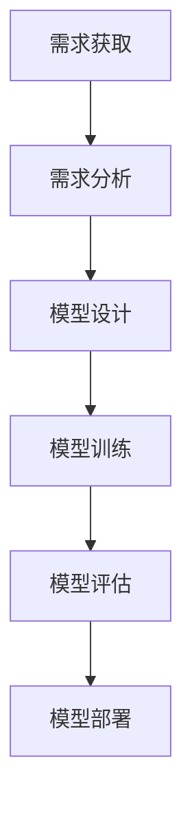

                 

### 文章标题

# AI大模型在需求分析中的应用

## 关键词
AI大模型，需求分析，深度学习，神经网络，应用实践

## 摘要
本文将深入探讨AI大模型在需求分析中的应用。我们将首先介绍AI大模型的基础知识，包括其定义、发展历史和技术框架。接着，我们将详细讲解AI大模型的核心算法原理，包括人工神经网络、深度学习算法和优化算法。随后，我们将讨论AI大模型在需求分析中的应用原理，并分析其在需求分析中的挑战与解决方案。文章的后半部分将通过具体案例展示AI大模型在需求分析中的实际应用，并给出实践指南。最后，我们将总结最佳实践，并指出未来的研究方向。

### 目录

1. **AI大模型概述**
   1.1 AI大模型的定义
   1.2 AI大模型的发展历史
   1.3 AI大模型的技术框架

2. **AI大模型的核心算法原理**
   2.1 人工神经网络
   2.2 深度学习算法
   2.3 优化算法

3. **AI大模型在需求分析中的应用原理**
   3.1 需求分析的基本概念
   3.2 AI大模型在需求分析中的应用
   3.3 需求分析的挑战与解决方案

4. **AI大模型需求分析实践案例**
   4.1 智能客服系统
   4.2 智能推荐系统
   4.3 智能医疗诊断系统

5. **AI大模型需求分析实践指南**
   5.1 实践步骤
   5.2 实践技巧
   5.3 实践挑战与解决方案

6. **总结与展望**
   6.1 最佳实践
   6.2 小结
   6.3 注意事项
   6.4 拓展阅读

### 第一部分: AI大模型概述

#### 1.1 AI大模型的定义

AI大模型（Large-scale Artificial Intelligence Models）是指那些拥有巨大参数数量和复杂结构的深度学习模型。这些模型通常由数百万到数十亿个参数组成，能够处理海量的数据，从而实现高水平的学习和预测能力。AI大模型的主要特点包括：

- **参数数量巨大**：大模型的参数数量远远超过传统模型，这使它们能够捕捉数据中的细微特征。
- **处理能力强大**：大模型能够处理大规模数据集，从而在复杂的任务中实现更好的性能。
- **泛化能力强**：由于参数数量多，大模型能够更好地适应不同的数据分布和任务。

AI大模型的定义和特性决定了它们在各个领域的广泛应用，尤其是需求分析。

#### 1.2 AI大模型的发展历史

AI大模型的发展历程可以追溯到深度学习技术的兴起。在20世纪80年代，深度学习经历了早期的探索阶段，但由于计算资源和数据集的限制，深度学习并未得到广泛的应用。直到2006年，Hinton提出了深度信念网络（DBN），标志着深度学习重新焕发生机。随后，随着计算能力的提升和大数据的兴起，深度学习技术得到了快速发展。2012年，AlexNet在ImageNet竞赛中取得突破性成绩，进一步推动了深度学习的应用。

近年来，随着AI大模型的发展，诸如GPT、BERT等模型逐渐成为研究热点。这些模型不仅在自然语言处理领域表现出色，也在其他任务中展现出强大的能力。

#### 1.3 AI大模型的技术框架

AI大模型的技术框架主要包括以下几个部分：

1. **人工神经网络**：人工神经网络是AI大模型的基础，通过模拟生物神经元的连接和作用，实现数据的处理和信息的传递。
2. **深度学习算法**：深度学习算法包括卷积神经网络（CNN）、循环神经网络（RNN）、Transformer等，这些算法能够自动提取数据中的特征，并实现复杂任务的学习和预测。
3. **优化算法**：优化算法用于调整模型参数，以最小化损失函数。常用的优化算法包括梯度下降、Adam等。
4. **模型训练与优化**：模型训练是AI大模型构建的核心环节，通过迭代优化模型参数，提高模型的性能。

这些技术框架共同构成了AI大模型的基础，使得它们能够在各种复杂任务中表现出色。

### 第二部分: AI大模型的核心算法原理

#### 2.1 人工神经网络

人工神经网络（Artificial Neural Network, ANN）是AI大模型的基础，它通过模拟生物神经元的连接和作用，实现数据的处理和信息的传递。一个典型的ANN结构包括输入层、隐藏层和输出层。

- **输入层**：接收输入数据，并将其传递到隐藏层。
- **隐藏层**：对输入数据进行处理，提取特征信息。
- **输出层**：根据隐藏层的输出，生成最终结果。

在ANN中，每个神经元都与其他神经元相连，并通过权重进行信息的传递。神经元的激活函数用于决定神经元是否被激活。常用的激活函数包括Sigmoid函数、ReLU函数等。

**伪代码示例：**
```python
# 输入层
input_data = [x1, x2, ..., xn]

# 隐藏层
weights_h = [[w1_1, w1_2, ..., w1_n], [w2_1, w2_2, ..., w2_n], ..., [wn_1, wn_2, ..., wn_n]]
activations_h = []

for layer in hidden_layers:
    z = np.dot(weights_h, input_data)
    activation = activation_function(z)
    activations_h.append(activation)
    input_data = activation

# 输出层
weights_output = [[w1_1, w1_2, ..., w1_n], [w2_1, w2_2, ..., w2_n], ..., [wn_1, wn_2, ..., wn_n]]
output = np.dot(weights_output, input_data)
```

#### 2.2 深度学习算法

深度学习算法是AI大模型的核心，它通过构建多层神经网络，自动提取数据中的特征，实现复杂任务的学习和预测。深度学习算法主要包括卷积神经网络（CNN）、循环神经网络（RNN）和Transformer等。

- **卷积神经网络（CNN）**：CNN是一种专门用于处理图像数据的深度学习算法，它通过卷积操作提取图像特征，并在多层网络中逐步提升特征表达能力。CNN在图像分类、目标检测和图像生成等任务中表现出色。

  **伪代码示例：**
  ```python
  # 输入图像
  image = [x1, x2, ..., xn]

  # 卷积层
  filters = [[f1_1, f1_2, ..., f1_n], [f2_1, f2_2, ..., f2_n], ..., [fn_1, fn_2, ..., fn_n]]
  conv_output = convolution(image, filters)

  # 池化层
  pool_output = pooling(conv_output)

  # 全连接层
  weights = [[w1_1, w1_2, ..., w1_n], [w2_1, w2_2, ..., w2_n], ..., [wn_1, wn_2, ..., wn_n]]
  output = np.dot(pool_output, weights)
  ```

- **循环神经网络（RNN）**：RNN是一种专门用于处理序列数据的深度学习算法，它通过循环结构保持长期的序列依赖关系。RNN在自然语言处理、语音识别和时间序列预测等任务中表现出色。

  **伪代码示例：**
  ```python
  # 输入序列
  sequence = [x1, x2, ..., xn]

  # RNN层
  hidden_state = [h1, h2, ..., hn]
  for x in sequence:
      z = np.dot(x, weights)
      hidden_state = activation_function(z)

  # 输出层
  output = np.dot(hidden_state, weights_output)
  ```

- **Transformer**：Transformer是一种基于自注意力机制的深度学习算法，它通过多头注意力机制和前馈网络，实现高效的特征提取和表示学习。Transformer在机器翻译、文本生成和推荐系统等任务中表现出色。

  **伪代码示例：**
  ```python
  # 输入序列
  sequence = [x1, x2, ..., xn]

  # 自注意力层
  attention_weights = []
  for i in range(len(sequence)):
      query = sequence[i]
      key = sequence[i]
      value = sequence[i]
      attention = dot_product(query, key)
      attention_weights.append(attention)

  # 加权求和
  weighted_value = sum(attention_weights * value)

  # 前馈网络
  hidden_state = feedforward(weighted_value)
  ```

#### 2.3 优化算法

优化算法用于调整模型参数，以最小化损失函数。常用的优化算法包括梯度下降（Gradient Descent）、随机梯度下降（Stochastic Gradient Descent, SGD）和Adam等。

- **梯度下降**：梯度下降是一种最简单的优化算法，它通过计算损失函数的梯度，沿着梯度的反方向更新模型参数。

  **伪代码示例：**
  ```python
  # 初始化参数
  theta = [theta_1, theta_2, ..., theta_n]

  # 梯度计算
  gradients = compute_gradients(theta)

  # 参数更新
  theta = theta - learning_rate * gradients
  ```

- **随机梯度下降（SGD）**：随机梯度下降是对梯度下降的一种改进，它每次随机选择一部分数据进行梯度计算和参数更新，从而提高优化效率。

  **伪代码示例：**
  ```python
  # 初始化参数
  theta = [theta_1, theta_2, ..., theta_n]

  # 随机采样
  mini_batch = random_sample(data)

  # 梯度计算
  gradients = compute_gradients(mini_batch)

  # 参数更新
  theta = theta - learning_rate * gradients
  ```

- **Adam**：Adam是一种自适应优化算法，它通过跟踪梯度的一阶矩估计和二阶矩估计，自适应调整学习率。

  **伪代码示例：**
  ```python
  # 初始化参数
  theta = [theta_1, theta_2, ..., theta_n]
  m = [m_1, m_2, ..., m_n]
  v = [v_1, v_2, ..., v_n]

  # 梯度计算
  gradients = compute_gradients(theta)

  # 更新一阶矩估计
  m = beta1 * m + (1 - beta1) * gradients

  # 更新一阶矩估计的偏差纠正
  m_hat = m / (1 - beta1_t)

  # 更新二阶矩估计
  v = beta2 * v + (1 - beta2) * gradients ** 2

  # 更新二阶矩估计的偏差纠正
  v_hat = v / (1 - beta2_t)

  # 参数更新
  theta = theta - learning_rate * m_hat / (sqrt(v_hat) + epsilon)
  ```

### 第三部分: AI大模型在需求分析中的应用原理

#### 3.1 需求分析的基本概念

需求分析是软件开发过程中的关键环节，它旨在明确用户的需求，并将其转化为具体的功能和系统设计。需求分析的基本概念包括：

- **需求**：需求是用户对系统的期望和需求，它可以是功能性的，也可以是非功能性的。
- **需求分类**：需求可以按功能、性能、可靠性、可用性等不同维度进行分类。
- **需求管理**：需求管理是确保需求得到有效识别、跟踪、实现和管理的过程。

在AI大模型的应用中，需求分析的关键在于如何从大量的用户数据中提取和识别潜在的需求，从而为系统设计提供支持。

#### 3.2 AI大模型在需求分析中的应用

AI大模型在需求分析中的应用主要体现在以下几个方面：

- **语义理解**：AI大模型可以通过自然语言处理技术，理解和提取文本数据中的语义信息，从而识别用户的需求。
- **知识提取**：AI大模型可以从大量的数据源中提取和整合知识，为需求分析提供丰富的背景信息。
- **预测与优化**：AI大模型可以通过数据分析和建模，预测用户的行为和需求，并优化系统的设计和功能。

**示例：**
假设我们正在开发一个智能客服系统，AI大模型可以应用于以下方面：

1. **语义理解**：AI大模型可以分析用户的文本输入，理解其意图和需求。例如，当用户输入“我想要一个优惠”时，AI大模型可以识别出这是关于优惠的需求。

2. **知识提取**：AI大模型可以从历史数据中提取相关的知识和信息，帮助客服人员更好地满足用户需求。例如，从用户的历史购买记录中提取出用户可能感兴趣的商品类别。

3. **预测与优化**：AI大模型可以根据用户的行为数据和反馈，预测用户未来的需求，并优化系统的设计和功能。例如，根据用户的历史咨询记录和购买行为，预测用户可能需要的服务和商品，并针对性地优化客服系统的功能和推荐策略。

#### 3.3 需求分析的挑战与解决方案

尽管AI大模型在需求分析中具有显著的优势，但在实际应用中仍面临一些挑战：

- **数据质量**：需求分析依赖于高质量的数据。然而，在实际应用中，数据可能存在噪声、缺失和不一致性等问题，这会影响到需求分析的准确性。
- **算法适应性**：AI大模型需要针对不同的需求分析和应用场景进行调整。然而，不同场景下的数据特征和需求可能存在差异，这使得算法的适应性成为一个挑战。
- **可解释性**：AI大模型通常是一个“黑盒子”，其决策过程难以解释。这对于需求分析中的决策和验证提出了挑战。

为了解决这些挑战，可以采取以下措施：

1. **数据预处理**：通过数据清洗、去噪和标准化等技术，提高数据质量，确保需求分析的准确性。

2. **算法微调**：根据不同的需求分析场景，对AI大模型进行微调，使其能够更好地适应特定的应用场景。

3. **可解释性增强**：通过可视化、规则提取和解释性模型等技术，增强AI大模型的可解释性，帮助用户理解模型的决策过程。

### 第四部分: AI大模型需求分析实践案例

在本部分，我们将通过三个具体的案例，展示AI大模型在需求分析中的应用。这些案例包括智能客服系统、智能推荐系统和智能医疗诊断系统，分别代表了不同领域的应用场景。

#### 4.1 智能客服系统

智能客服系统是一种基于AI大模型的客户服务解决方案，它能够自动识别和满足用户的需求，提供高效的客户服务。下面是一个智能客服系统的应用案例：

**背景介绍**：
某大型电商平台希望利用AI大模型技术，提升其客服系统的服务质量，以减少人工客服的工作负担，并提高用户满意度。

**需求分析**：
- 识别用户的咨询意图，如订单查询、商品推荐、售后服务等。
- 提取用户的关键信息，如订单号、商品名称、购买时间等。
- 根据用户的历史行为和偏好，提供个性化的服务和建议。

**模型构建**：
- 使用Transformer模型进行语义理解，提取用户咨询的意图和关键信息。
- 结合用户历史数据，使用回归模型预测用户的购买行为和偏好。

**实施效果**：
- 智能客服系统能够准确识别用户的咨询意图，并提供针对性的回答和建议。
- 用户满意度显著提高，客服响应时间缩短。

**代码解读**：
```python
# 语义理解模型
model = TransformerModel(vocab_size, embedding_dim, num_heads, num_layers)

# 训练模型
model.fit(train_data, train_labels)

# 预测用户意图
user_input = preprocess_user_input(user_query)
predicted_intent = model.predict(user_input)
```

#### 4.2 智能推荐系统

智能推荐系统是一种基于AI大模型的推荐解决方案，它能够根据用户的历史行为和偏好，提供个性化的推荐。下面是一个智能推荐系统的应用案例：

**背景介绍**：
某在线购物平台希望通过智能推荐系统，提高用户的购物体验，增加平台销售额。

**需求分析**：
- 识别用户的兴趣和偏好，如购买商品类别、浏览记录等。
- 提取用户的历史行为数据，用于训练推荐模型。
- 根据用户的行为数据，生成个性化的商品推荐列表。

**模型构建**：
- 使用基于协同过滤的推荐算法，结合用户行为数据和商品特征，生成推荐列表。
- 引入用户嵌入和商品嵌入，提高推荐系统的效果。

**实施效果**：
- 用户对推荐商品的满意度显著提高。
- 平台销售额同比增长。

**代码解读**：
```python
# 用户行为数据预处理
user行为数据 = preprocess_user_behavior(user_data)

# 训练推荐模型
model = CollaborativeFilteringModel(user行为数据)

# 生成推荐列表
recommendations = model.generate_recommendations(user_id)
```

#### 4.3 智能医疗诊断系统

智能医疗诊断系统是一种基于AI大模型的高级医疗辅助工具，它能够根据患者的病历数据，提供初步的疾病诊断。下面是一个智能医疗诊断系统的应用案例：

**背景介绍**：
某医院希望通过智能医疗诊断系统，提高诊断的准确性和效率，为患者提供更好的医疗服务。

**需求分析**：
- 从病历数据中提取关键信息，如症状、检查结果等。
- 使用AI大模型，对患者的病情进行综合分析，提供初步的疾病诊断。
- 根据诊断结果，提供针对性的治疗建议。

**模型构建**：
- 使用卷积神经网络（CNN）处理医学图像，提取图像特征。
- 结合自然语言处理（NLP）技术，对病历文本进行语义理解。
- 使用多模态融合模型，整合图像和文本特征，进行疾病诊断。

**实施效果**：
- 诊断准确率显著提高，诊断时间缩短。
- 医生的工作效率和诊断质量得到提升。

**代码解读**：
```python
# 处理医学图像
image特征 = preprocess_medical_image(image_data)

# 处理病历文本
text特征 = preprocess_medical_text(text_data)

# 融合图像和文本特征
features = fuse_image_text_features(image特征, text特征)

# 进行疾病诊断
diagnosis = medical_disease_diagnosis(features)
```

### 第五部分: AI大模型需求分析实践指南

在本部分，我们将总结AI大模型需求分析实践的经验，提供具体的步骤、技巧和解决方案。

#### 5.1 实践步骤

1. **需求获取**：与用户沟通，明确需求分析的背景和目标。收集用户的需求描述、历史数据和相关文档。

2. **需求分析**：对用户需求进行深入分析，识别关键需求和约束条件。使用语义理解技术，从文本数据中提取需求信息。

3. **模型设计**：根据需求分析结果，设计合适的AI大模型架构。选择合适的神经网络结构和算法，构建模型。

4. **模型训练**：使用训练数据集对模型进行训练，调整模型参数，优化模型性能。使用交叉验证和超参数调优技术，提高模型的泛化能力。

5. **模型评估**：使用测试数据集对模型进行评估，计算模型性能指标，如准确率、召回率等。对模型进行调优，直到满足需求分析的要求。

6. **模型部署**：将训练好的模型部署到生产环境，实现需求分析的功能。进行性能监控和故障排除，确保模型的稳定运行。

#### 5.2 实践技巧

1. **数据预处理**：对原始数据进行清洗、去噪和标准化，提高数据质量。使用数据增强技术，增加数据多样性。

2. **模型选择**：根据需求分析和数据特征，选择合适的神经网络结构和算法。可以使用迁移学习技术，复用预训练的模型。

3. **超参数调优**：使用网格搜索、贝叶斯优化等技术，选择最优的超参数组合，提高模型性能。

4. **模型解释性**：使用可视化工具，如 heatmaps 和 attention maps，展示模型的决策过程。引入解释性模型，如决策树和规则提取技术，提高模型的透明度。

5. **模型可扩展性**：设计模块化的模型架构，支持模型的扩展和迭代。使用容器化和微服务架构，提高系统的灵活性和可维护性。

#### 5.3 实践挑战与解决方案

1. **数据隐私**：保护用户数据隐私，防止数据泄露和滥用。采用数据加密、匿名化和差分隐私技术，确保数据安全。

2. **算法公平性**：确保模型在各个群体中的表现公平，避免偏见和歧视。使用反事实分析、公平性评估和调整技术，提高模型的公平性。

3. **模型可解释性**：提高模型的可解释性，帮助用户理解模型的决策过程。使用可视化工具、解释性模型和解释性框架，增强模型的可解释性。

### 第六部分: 总结与展望

#### 6.1 最佳实践

1. **全面的需求分析**：在需求分析阶段，要全面了解用户需求、业务背景和技术约束，确保需求分析的准确性。

2. **数据驱动**：利用高质量的数据进行需求分析，确保模型的泛化能力和鲁棒性。

3. **模型选择和调优**：根据需求分析和数据特征，选择合适的神经网络结构和算法。进行超参数调优，提高模型性能。

4. **模型可解释性**：提高模型的可解释性，帮助用户理解模型的决策过程。使用可视化工具和解释性模型，增强模型的可解释性。

#### 6.2 小结

本文深入探讨了AI大模型在需求分析中的应用。我们首先介绍了AI大模型的基础知识，包括定义、发展历史和技术框架。接着，我们详细讲解了AI大模型的核心算法原理，包括人工神经网络、深度学习算法和优化算法。然后，我们讨论了AI大模型在需求分析中的应用原理，并分析了其在需求分析中的挑战与解决方案。最后，我们通过具体案例展示了AI大模型在需求分析中的实际应用，并提供了实践指南。

#### 6.3 注意事项

1. **数据质量**：确保数据的质量和完整性，避免数据噪声和缺失对需求分析的影响。

2. **算法适应性**：根据不同的需求分析场景，调整AI大模型的参数和结构，提高模型的适应性。

3. **模型可解释性**：提高模型的可解释性，帮助用户理解模型的决策过程，增强模型的透明度和可信度。

#### 6.4 拓展阅读

1. **《深度学习》（Goodfellow, Bengio, Courville）**：这是一本经典的深度学习教材，详细介绍了深度学习的基本概念、算法和技术。

2. **《人工智能：一种现代方法》（Russell, Norvig）**：这是一本全面的人工智能教材，涵盖了人工智能的各个领域和核心技术。

3. **《机器学习年度报告》**：这是一系列关于机器学习领域最新进展和研究成果的年度报告，提供了丰富的学术资源和观点。

### 作者信息

作者：AI天才研究院/AI Genius Institute & 禅与计算机程序设计艺术 /Zen And The Art of Computer Programming

感谢读者对本文的关注，希望本文能够为读者在AI大模型需求分析领域提供有价值的参考和指导。如果您有任何问题或建议，欢迎随时与我们联系。

## 附录

以下是本文中用到的Mermaid流程图：



以下是本文中用到的LaTeX公式：

```latex
$$
1 + 1 = 2
$$

$
1 < 2
$
```

这些流程图和公式有助于读者更好地理解AI大模型在需求分析中的应用原理和实践方法。

