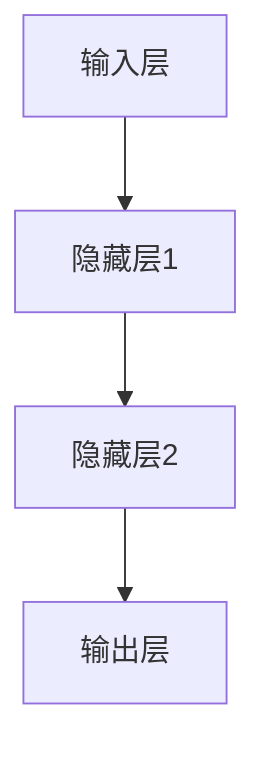

                 


### 引言

在当今快速发展的科技时代，人工智能（AI）技术已成为推动社会进步的重要力量。而其中，AI大模型作为一种新兴技术，正逐渐成为各行各业的核心竞争力。从自动驾驶、智能助手到医疗诊断、金融风控，AI大模型的应用场景无处不在。然而，对于许多开发者而言，如何从零开始学习和实践AI大模型编程，仍是一个充满挑战的任务。

本文旨在为读者提供一本全方位的指南，通过详细的章节结构和丰富的实例，帮助读者系统地掌握AI大模型编程的各个环节。文章将分为三个主要部分：第一部分介绍AI大模型的基础知识，包括概述、技术基础和数学模型；第二部分探讨AI大模型的编程实践，包括编程实现和提示词设计；第三部分则通过项目实战，展示AI大模型在实际应用中的魅力。

通过阅读本文，读者将能够：
- 理解AI大模型的基本概念和架构；
- 掌握深度学习、自然语言处理和计算机视觉等基础技术；
- 学会使用编程语言和框架实现AI大模型；
- 设计有效的提示词来优化模型性能；
- 通过实战项目，提升AI大模型编程的实际应用能力。

让我们开始这段探索AI大模型编程的旅程，一步一步揭开其神秘的面纱。

### 关键词

AI大模型、深度学习、自然语言处理、计算机视觉、编程实践、提示词设计、项目实战。

### 摘要

本文《AI大模型编程：从代码到提示词》旨在为读者提供一本系统全面的AI大模型编程指南。文章首先介绍了AI大模型的基本概念、发展历史和技术架构，接着深入探讨了深度学习、自然语言处理和计算机视觉等基础技术。在第二部分，文章详细阐述了AI大模型的编程实践，包括编程语言选择、数据预处理、模型训练与调优，以及提示词设计的方法和技巧。最后，通过实际项目实战，读者可以学习到如何将AI大模型应用于实际场景，提升编程能力和解决实际问题的能力。本文适合对AI大模型感兴趣的初学者和开发者，通过循序渐进的学习和实践，能够系统地掌握AI大模型编程的核心技能。

### 第一部分：AI大模型的基础知识

#### 第一章：AI大模型概述

#### 1.1 AI大模型的历史与发展

人工智能（AI）的历史可以追溯到20世纪50年代，当时科学家们开始探索如何让计算机模拟人类的智能行为。然而，早期的AI系统主要依赖于基于规则的专家系统和简单的逻辑推理，这些系统的能力非常有限，难以应对复杂的问题。随着计算能力的提升和算法的进步，尤其是深度学习技术的发展，AI在21世纪迎来了新一轮的革命。

AI大模型（Large-scale AI Models），也被称为大型神经网络模型，是在这一背景下诞生的。它们通常由数亿甚至数十亿个参数组成，通过海量数据训练，能够实现高度复杂的任务。AI大模型的发展可以分为以下几个阶段：

1. **早期神经网络**：20世纪80年代，神经网络开始受到广泛关注。然而，由于计算资源的限制，这些模型通常只能处理简单的任务，例如手写数字识别。

2. **深度学习的崛起**：2006年，Hinton等人提出了深度信念网络（DBN），标志着深度学习的新纪元。随着计算能力的提升和算法的改进，深度神经网络（DNN）逐渐展现出强大的潜力。

3. **AI大模型的诞生**：2012年，AlexNet在ImageNet图像识别竞赛中取得了突破性的成绩，这标志着AI大模型时代的到来。随后的几年里，GANs、BERT、GPT等模型不断涌现，推动了AI大模型技术的发展。

4. **当前的发展**：现在，AI大模型已经成为了AI领域的重要方向，被广泛应用于自然语言处理、计算机视觉、语音识别等领域。

AI大模型的发展不仅改变了AI的研究范式，也对社会产生了深远的影响。例如，在医疗领域，AI大模型可以帮助医生进行疾病诊断和治疗方案设计；在金融领域，AI大模型可以用于风险评估和欺诈检测；在工业领域，AI大模型可以用于设备故障预测和生产优化。

#### 1.2 AI大模型的基本概念

AI大模型通常由以下几个核心组成部分构成：

1. **神经网络**：神经网络是AI大模型的基础，它由大量的神经元（节点）和连接（边）组成。每个神经元接收输入信号，通过权重进行加权求和，再经过激活函数处理，产生输出信号。

2. **参数**：AI大模型中的参数是指神经网络的权重和偏置。这些参数决定了模型的预测能力。大模型之所以强大，正是因为它拥有数亿甚至数十亿的参数。

3. **激活函数**：激活函数是神经网络中的一个关键元素，它用于引入非线性特性。常见的激活函数包括ReLU、Sigmoid和Tanh等。

4. **优化算法**：优化算法用于调整模型参数，以最小化损失函数。常见的优化算法包括梯度下降、Adam和RMSProp等。

5. **损失函数**：损失函数用于衡量模型预测结果与真实结果之间的差距。在训练过程中，模型的参数会不断调整，以最小化损失函数的值。

6. **训练数据**：训练数据是AI大模型训练的基础。高质量的训练数据可以帮助模型更好地学习特征，提高模型的泛化能力。

AI大模型的工作原理可以简单概括为以下几个步骤：

1. **输入处理**：模型接收输入数据，通常是一个向量。

2. **前向传播**：输入数据通过神经网络的前向传播过程，逐层传递，最终生成预测输出。

3. **损失计算**：将预测输出与真实输出进行比较，计算损失函数的值。

4. **反向传播**：根据损失函数的梯度，模型通过反向传播算法调整参数。

5. **迭代优化**：重复上述步骤，直至模型达到预设的性能指标。

#### 1.3 AI大模型的架构与分类

AI大模型的架构可以根据不同的任务和数据类型进行分类。以下是几种常见的AI大模型架构：

1. **卷积神经网络（CNN）**：CNN是一种用于处理图像数据的神经网络架构。它通过卷积层、池化层和全连接层等结构，实现了对图像特征的提取和分类。CNN在图像识别、图像生成等领域取得了显著的成果。

2. **循环神经网络（RNN）**：RNN是一种用于处理序列数据的神经网络架构。它通过在时间维度上递归地处理输入序列，捕捉序列中的长期依赖关系。RNN在自然语言处理、语音识别等领域有着广泛的应用。

3. **Transformer模型**：Transformer模型是近年来兴起的一种基于自注意力机制的神经网络架构。它通过多头自注意力机制和位置编码，实现了对序列数据的全局建模。Transformer模型在自然语言处理领域取得了突破性的成果，如BERT、GPT等。

4. **生成对抗网络（GAN）**：GAN是一种由生成器和判别器组成的神经网络架构。生成器尝试生成与真实数据相似的样本，而判别器则试图区分真实数据和生成数据。GAN在图像生成、图像修复等领域展现了强大的潜力。

5. **多模态融合模型**：多模态融合模型是将不同类型的数据（如文本、图像、声音等）融合起来，共同训练一个模型。通过多模态融合，模型可以更好地理解复杂的信息，提高任务的性能。

不同类型的AI大模型在架构和功能上有所差异，但它们的共同目标都是通过学习和优化，实现从数据到知识的高效转换。了解这些模型的基本架构和分类，有助于我们更好地选择和应用合适的模型解决实际问题。

#### 第二章：AI大模型的技术基础

#### 2.1 深度学习基础

深度学习是AI大模型的核心技术之一，它通过构建多层神经网络，实现从数据到知识的自动提取和表示。以下是深度学习的一些基础概念和关键技术：

1. **神经网络的基本组成**：神经网络由多个神经元（节点）和连接（边）组成。每个神经元接收输入信号，通过权重进行加权求和，再经过激活函数处理，产生输出信号。多层神经网络通过逐层传递信息，实现复杂的非线性变换。

2. **前向传播和反向传播**：前向传播是指输入数据通过神经网络的前向传播过程，逐层传递，最终生成预测输出。反向传播是指将预测输出与真实输出进行比较，计算损失函数的值，然后通过反向传播算法，将损失函数的梯度反向传播到每一层，从而更新模型参数。

3. **激活函数**：激活函数是神经网络中的一个关键元素，它用于引入非线性特性。常见的激活函数包括ReLU（修正线性单元）、Sigmoid（S形函数）和Tanh（双曲正切函数）等。ReLU函数由于其计算效率和避免梯度消失的特性，在深度学习中得到了广泛的应用。

4. **损失函数**：损失函数用于衡量模型预测结果与真实结果之间的差距。在训练过程中，模型的参数会不断调整，以最小化损失函数的值。常见的损失函数包括均方误差（MSE）、交叉熵损失等。

5. **优化算法**：优化算法用于调整模型参数，以最小化损失函数。常见的优化算法包括梯度下降、Adam、RMSProp等。梯度下降是最基本的优化算法，它通过迭代更新模型参数，使损失函数不断减小。Adam算法结合了梯度下降和动量项，能够在复杂问题上获得更好的收敛效果。

#### 2.2 自然语言处理基础

自然语言处理（NLP）是AI大模型的重要应用领域之一，它涉及从文本数据中提取信息、理解语义、生成文本等任务。以下是NLP的一些基础概念和关键技术：

1. **词向量**：词向量是NLP中的基本表示，它将文本中的每个单词映射为一个向量。常见的词向量模型包括Word2Vec、GloVe等。词向量能够捕捉词与词之间的相似性和关系，为NLP任务提供有效的数据表示。

2. **序列模型**：序列模型是处理序列数据（如文本、语音）的神经网络架构。常见的序列模型包括循环神经网络（RNN）和Transformer模型。RNN通过在时间维度上递归地处理输入序列，捕捉序列中的长期依赖关系。Transformer模型通过多头自注意力机制和位置编码，实现了对序列数据的全局建模。

3. **文本分类**：文本分类是一种将文本数据分为不同类别（如情感分类、主题分类）的任务。常见的文本分类模型包括朴素贝叶斯、支持向量机（SVM）和深度学习模型（如CNN、RNN、Transformer）等。

4. **序列标注**：序列标注是一种对文本中的每个单词或字符进行标签标注的任务，如命名实体识别（NER）和词性标注。常见的序列标注模型包括条件随机场（CRF）和基于深度学习的模型（如RNN、LSTM、BERT等）。

5. **生成文本**：生成文本是一种根据输入模板或种子文本生成新的文本的任务。常见的生成文本模型包括生成对抗网络（GAN）、变分自编码器（VAE）和Transformer模型等。

#### 2.3 计算机视觉基础

计算机视觉是AI大模型的另一个重要应用领域，它涉及从图像和视频中提取信息、理解场景和物体。以下是计算机视觉的一些基础概念和关键技术：

1. **图像处理**：图像处理是计算机视觉的基础，它涉及对图像进行增强、滤波、分割等操作。常见的图像处理技术包括卷积操作、边缘检测、形态学操作等。

2. **特征提取**：特征提取是将图像或视频中的信息转换为适合模型处理的特征表示。常见的特征提取方法包括SIFT、HOG、Hessian等。

3. **目标检测**：目标检测是计算机视觉中的一个重要任务，它旨在从图像或视频中检测出感兴趣的目标物体。常见的目标检测模型包括R-CNN、Fast R-CNN、Faster R-CNN等。

4. **图像分类**：图像分类是一种将图像分为不同类别（如动物、植物、交通工具）的任务。常见的图像分类模型包括支持向量机（SVM）、决策树、深度学习模型（如CNN、ResNet、Inception等）。

5. **图像生成**：图像生成是一种根据输入条件或风格生成新的图像的任务。常见的图像生成模型包括生成对抗网络（GAN）、变分自编码器（VAE）等。

通过掌握深度学习、自然语言处理和计算机视觉的基础知识，我们可以更好地理解和应用AI大模型，解决实际问题。

#### 第三章：AI大模型的数学模型

AI大模型的数学模型是其核心组成部分，决定了模型的学习能力和预测性能。在这一章节中，我们将详细讲解损失函数、优化算法和神经网络结构设计等关键数学模型，并使用伪代码和LaTeX公式进行阐述。

##### 3.1 损失函数与优化算法

损失函数是评估模型预测结果与真实结果之间差异的数学函数，它是优化算法的衡量标准。在深度学习中，常见的损失函数包括均方误差（MSE）和交叉熵损失。

1. **均方误差（MSE）**

   均方误差用于回归任务，计算预测值与真实值之间的平均平方误差。

   $$\text{MSE} = \frac{1}{n} \sum_{i=1}^{n} (\hat{y}_i - y_i)^2$$

   其中，$\hat{y}_i$ 是预测值，$y_i$ 是真实值，$n$ 是样本数量。

   **伪代码**：

   ```
   for each sample (x, y) in dataset:
       predict y_hat = model(x)
       loss = (y_hat - y)^2
   end
   ```

2. **交叉熵损失**

   交叉熵损失用于分类任务，计算预测概率分布与真实分布之间的交叉熵。

   $$\text{CrossEntropy} = -\sum_{i=1}^{n} y_i \log(\hat{y}_i)$$

   其中，$y_i$ 是真实标签的概率分布，$\hat{y}_i$ 是预测概率分布。

   **伪代码**：

   ```
   for each sample (x, y) in dataset:
       predict probabilities p = model(x)
       loss = -sum(y * log(p))
   end
   ```

   **LaTeX公式**：

   ```
   \text{CrossEntropy} = -\sum_{i=1}^{n} y_i \log(\hat{y}_i)
   ```

##### 3.2 机器学习算法

机器学习算法是用于训练AI大模型的核心方法，包括监督学习、无监督学习和强化学习等。

1. **梯度下降算法**

   梯度下降是一种优化算法，用于最小化损失函数。基本思想是通过计算损失函数关于模型参数的梯度，迭代更新参数。

   $$\theta_{\text{new}} = \theta_{\text{old}} - \alpha \cdot \nabla_{\theta} \text{Loss}$$

   其中，$\theta$ 是模型参数，$\alpha$ 是学习率，$\nabla_{\theta} \text{Loss}$ 是损失函数关于参数的梯度。

   **伪代码**：

   ```
   for each iteration:
       compute gradient of loss with respect to parameters
       update parameters by subtracting gradient multiplied by learning rate
   end
   ```

   **LaTeX公式**：

   ```
   \theta_{\text{new}} = \theta_{\text{old}} - \alpha \cdot \nabla_{\theta} \text{Loss}
   ```

2. **随机梯度下降（SGD）**

   随机梯度下降是一种改进的梯度下降算法，每次迭代只随机选择一个样本，计算其梯度并更新参数。

   $$\theta_{\text{new}} = \theta_{\text{old}} - \alpha \cdot \nabla_{\theta} \text{Loss}^{(i)}$$

   其中，$\text{Loss}^{(i)}$ 是第$i$个样本的损失函数。

   **伪代码**：

   ```
   for each iteration:
       select a random sample (x, y) from dataset
       compute gradient of loss with respect to parameters
       update parameters by subtracting gradient multiplied by learning rate
   end
   ```

   **LaTeX公式**：

   ```
   \theta_{\text{new}} = \theta_{\text{old}} - \alpha \cdot \nabla_{\theta} \text{Loss}^{(i)}
   ```

##### 3.3 神经网络结构设计

神经网络结构设计是构建高效AI大模型的关键。以下是一些重要的结构设计原则：

1. **层数和神经元数量**

   神经网络通常包含多个隐藏层。层数和神经元数量的选择取决于任务复杂度和数据规模。增加层数和神经元数量可以提高模型的表达能力，但也会增加计算成本和过拟合风险。

2. **激活函数**

   激活函数引入了非线性特性，使得神经网络能够学习复杂的函数。常用的激活函数包括ReLU、Sigmoid和Tanh等。

3. **正则化方法**

   正则化方法用于防止过拟合，提高模型的泛化能力。常见的正则化方法包括L1正则化、L2正则化和Dropout等。

4. **优化器**

   优化器用于调整模型参数，以最小化损失函数。常见的优化器包括SGD、Adam和RMSProp等。

##### 3.4 梅里迪安（Mermaid）流程图

为了更直观地展示神经网络结构设计，我们可以使用梅里迪安（Mermaid）流程图进行可视化。

**示例**：



以上流程图展示了包含输入层、隐藏层和输出层的简单神经网络结构。

通过以上对AI大模型数学模型的详细讲解，我们可以更好地理解和应用这些核心理论，构建高效的AI大模型。

#### 第二部分：AI大模型的编程实践

#### 第四章：AI大模型的编程实现

AI大模型的编程实现是将其理论转化为实际应用的关键步骤。在这一章节中，我们将详细探讨编程语言的选择、数据预处理以及模型训练和调优的技巧。

##### 4.1 编程语言与框架选择

选择合适的编程语言和框架对于实现AI大模型至关重要。以下是几种常见的编程语言和框架：

1. **Python**：Python因其简洁、易读的语法和丰富的库支持，成为了AI大模型开发的首选语言。Python拥有大量的AI和深度学习库，如TensorFlow、PyTorch等。

2. **TensorFlow**：TensorFlow是一个由Google开发的开源深度学习框架，支持多种编程语言，包括Python、C++和Java。它提供了丰富的API和工具，使得模型构建和训练更加便捷。

3. **PyTorch**：PyTorch是另一个流行的深度学习框架，由Facebook开发。它以其动态计算图和灵活的接口而著称，使得研究人员可以轻松地进行实验和模型开发。

4. **其他框架**：除了TensorFlow和PyTorch，还有其他深度学习框架如Keras、Theano等，这些框架也提供了丰富的功能，适用于不同的应用场景。

**示例**：以下是一个使用TensorFlow和Python构建的简单神经网络：

```python
import tensorflow as tf

# 定义模型
model = tf.keras.Sequential([
    tf.keras.layers.Dense(128, activation='relu', input_shape=(784,)),
    tf.keras.layers.Dropout(0.2),
    tf.keras.layers.Dense(10, activation='softmax')
])

# 编译模型
model.compile(loss='categorical_crossentropy',
              optimizer='adam',
              metrics=['accuracy'])

# 加载数据集
(x_train, y_train), (x_test, y_test) = tf.keras.datasets.mnist.load_data()

# 预处理数据
x_train = x_train.reshape(60000, 784)
x_test = x_test.reshape(10000, 784)
x_train, x_test = x_train / 255.0, x_test / 255.0

# 添加one-hot编码
y_train = tf.keras.utils.to_categorical(y_train, 10)
y_test = tf.keras.utils.to_categorical(y_test, 10)

# 训练模型
model.fit(x_train, y_train, epochs=5, batch_size=128)
```

##### 4.2 数据预处理

数据预处理是AI大模型训练的重要环节，它包括数据清洗、归一化、缺失值处理等步骤。以下是一些常用的数据预处理方法：

1. **数据清洗**：去除噪声、异常值和重复数据，确保数据的质量。

2. **归一化**：将数据缩放到相同的范围，如[0, 1]或[-1, 1]，以避免不同特征间的数量级差异对模型训练的影响。

3. **缺失值处理**：对于缺失的数据，可以选择填充、删除或使用统计方法进行插补。

4. **数据增强**：通过旋转、缩放、裁剪等方法生成更多的训练样本，提高模型的泛化能力。

**示例**：以下是一个数据预处理的代码示例，使用Scikit-learn库对MNIST手写数字数据集进行预处理：

```python
from sklearn.model_selection import train_test_split
from sklearn.preprocessing import StandardScaler
from sklearn.impute import SimpleImputer
import numpy as np

# 加载数据集
(x, y) = load_mnist()

# 划分训练集和测试集
x_train, x_test, y_train, y_test = train_test_split(x, y, test_size=0.2, random_state=42)

# 数据清洗和填充缺失值
imputer = SimpleImputer(missing_values=np.nan, strategy='mean')
x_train = imputer.fit_transform(x_train)
x_test = imputer.transform(x_test)

# 数据归一化
scaler = StandardScaler()
x_train = scaler.fit_transform(x_train)
x_test = scaler.transform(x_test)
```

##### 4.3 模型训练与调优

模型训练是AI大模型编程的核心步骤，它通过不断调整模型参数，使模型在训练数据上达到最佳性能。以下是模型训练和调优的一些技巧：

1. **选择合适的优化算法**：不同的优化算法（如SGD、Adam）适用于不同的任务和数据集。通过实验比较不同优化算法的表现，选择合适的算法。

2. **调整学习率**：学习率是优化算法的一个重要参数，它决定了模型参数更新的步长。较小的学习率可能导致收敛速度慢，而较大的学习率可能导致模型不稳定。

3. **批量大小**：批量大小是每次训练迭代的样本数量。较小的批量大小有助于模型快速适应数据变化，但计算成本较高；较大的批量大小可以提高计算效率，但可能导致模型训练不稳定。

4. **训练时间**：模型的训练时间取决于数据集大小、模型复杂度和计算资源。通常，较长时间的训练可以使得模型达到更高的性能，但也会增加计算成本。

**示例**：以下是一个使用PyTorch进行模型训练和调优的示例：

```python
import torch
import torch.nn as nn
import torch.optim as optim

# 定义模型
model = MyModel()

# 定义损失函数和优化器
criterion = nn.CrossEntropyLoss()
optimizer = optim.Adam(model.parameters(), lr=0.001)

# 训练模型
for epoch in range(num_epochs):
    running_loss = 0.0
    for inputs, labels in train_loader:
        optimizer.zero_grad()
        outputs = model(inputs)
        loss = criterion(outputs, labels)
        loss.backward()
        optimizer.step()
        running_loss += loss.item()
    print(f'Epoch {epoch+1}, Loss: {running_loss/len(train_loader)}')

# 测试模型
model.eval()
with torch.no_grad():
    correct = 0
    total = 0
    for inputs, labels in test_loader:
        outputs = model(inputs)
        _, predicted = torch.max(outputs.data, 1)
        total += labels.size(0)
        correct += (predicted == labels).sum().item()
    print(f'Accuracy: {100 * correct / total}%')
```

通过以上对AI大模型编程实践的具体讲解，开发者可以掌握从编程语言选择、数据预处理到模型训练和调优的各个环节，为实际应用打下坚实基础。

#### 第五章：提示词设计与使用

提示词（Prompts）在AI大模型的应用中扮演着至关重要的角色。它们是用户与AI模型之间的桥梁，通过有效地引导模型的输入，可以大幅提升模型的响应质量和应用效果。在本章节中，我们将探讨提示词的设计原则、技巧和应用案例。

##### 5.1 提示词的概念与作用

提示词是一种用于引导AI大模型生成特定输出或执行特定任务的输入。与传统的命令式编程不同，提示词通过自然语言或结构化数据的方式，与模型进行交互。提示词的设计原则主要包括以下几点：

1. **明确性**：提示词应明确地指示模型需要完成的任务或目标。模糊不清的提示词可能会导致模型误解任务，从而生成不相关或不准确的输出。

2. **具体性**：具体的提示词可以提供更详细的信息，帮助模型更好地理解和执行任务。例如，在文本生成任务中，具体的提示词可以包括主题、风格、上下文等。

3. **多样性**：不同的提示词可以引导模型生成多样化的输出。多样化的提示词有助于避免模型陷入过拟合，提高模型的泛化能力。

4. **适应性**：提示词应能够适应不同的应用场景和数据集。通过调整提示词，可以使得模型在不同任务和数据集上表现更优。

提示词在AI大模型中的应用场景非常广泛，包括但不限于以下几个方面：

- **文本生成**：通过提示词，用户可以引导模型生成文章、故事、摘要等。例如，在新闻摘要任务中，提示词可以包括文章的标题、关键词和摘要长度等。
- **图像生成**：提示词可以用于指导模型生成特定的图像，如风景画、抽象画、人物肖像等。例如，"绘制一幅夜晚的城市夜景"是一个具体的提示词。
- **语音识别**：提示词可以用于指定语音识别任务的上下文，帮助模型更准确地识别语音。例如，"请说出您最喜欢的三本书"。
- **自然语言处理**：提示词可以用于引导模型进行文本分类、情感分析、问答系统等任务。例如，"判断这段文字的情绪是积极还是消极"。

##### 5.2 提示词的设计原则

设计有效的提示词需要遵循以下原则：

1. **明确目标**：提示词应明确地指明模型需要达成的目标。例如，"请生成一篇关于人工智能的论文摘要，要求字数为300字"。

2. **提供上下文**：上下文信息有助于模型更好地理解任务。例如，"您正在撰写一篇关于人工智能对教育影响的文章摘要，以下是一些关键词：个性化学习、学习效率、教育公平"。

3. **简洁明了**：避免使用过于复杂或冗长的提示词，以确保模型能够快速理解任务。例如，"生成一篇关于可持续能源的短文，要求内容涵盖太阳能和风能的优点"。

4. **多样性**：设计多样化的提示词，以激发模型的创意和多样性。例如，使用不同的句子结构和词汇，如"描述一幅宁静的森林景色"和"描绘一幅繁忙的城市交通图"。

5. **适应任务**：根据任务的具体需求调整提示词。例如，在问答系统中，提示词可以包括问题本身和期望的答案类型；在图像生成任务中，提示词可以包括颜色、主题和风格等。

##### 5.3 提示词的实际应用案例

以下是几个提示词设计的实际应用案例：

1. **文本生成**：

   - **案例**：生成一篇关于人工智能对医疗行业影响的论文摘要。

     - **提示词**：请生成一篇关于人工智能对医疗行业影响的论文摘要，要求字数为500字。文章应涵盖以下要点：人工智能在医疗诊断中的应用、医疗数据的处理和分析、人工智能对医疗资源分配的影响。

   - **输出**：人工智能在医疗领域有着广泛的应用。通过利用深度学习和大数据分析，人工智能能够帮助医生更准确地诊断疾病，提高医疗决策的效率。此外，人工智能还可以处理海量医疗数据，辅助医生进行个性化治疗和疾病预测。这些应用不仅提高了医疗服务的质量，还有助于优化医疗资源的分配，降低医疗成本。

2. **图像生成**：

   - **案例**：生成一幅夜晚的城市夜景。

     - **提示词**：请绘制一幅夜晚的城市夜景，要求包含高楼大厦、霓虹灯和桥梁等元素。画面应营造出繁华而宁静的氛围。

   - **输出**：在夜幕的映衬下，城市的高楼大厦熠熠生辉。霓虹灯和路灯交织成一片璀璨的星光，照亮了繁忙的街道。桥梁如一道精致的弧线横跨河流，河面上倒映出城市的轮廓，营造出宁静而繁忙的夜晚氛围。

3. **语音识别**：

   - **案例**：设计一个语音识别系统，用于识别用户在会议中提出的各种问题。

     - **提示词**：请设计一个语音识别系统，用于识别用户在会议中提出的各种问题。系统应能够识别常见的问题类型，如技术问题、项目进展、时间安排等。

   - **输出**：系统应能够准确识别用户在会议中提出的各种问题，并根据问题的类型进行分类。对于技术问题，系统应引导用户向相关专家咨询；对于项目进展问题，系统应提供最新的项目进展报告；对于时间安排问题，系统应提醒用户会议的时间和地点。

4. **自然语言处理**：

   - **案例**：设计一个情感分析系统，用于分析用户在社交媒体上发布的评论。

     - **提示词**：请设计一个情感分析系统，用于分析用户在社交媒体上发布的评论。系统应能够识别评论的情感倾向，如积极、消极、中性等。

   - **输出**：系统应能够对用户在社交媒体上发布的评论进行情感分析，并根据情感倾向生成报告。例如，对于一篇评论："这款产品的质量非常好，我很喜欢它"，系统应识别为积极情感；对于另一篇评论："这个服务真的很糟糕，我再也不想用了"，系统应识别为消极情感。

通过以上实际应用案例，我们可以看到提示词在引导AI大模型完成各种任务中的重要作用。合理设计的提示词不仅能够提高模型的响应质量和准确性，还能激发模型的多样性和创造力。

#### 第六章：AI大模型的项目实战

##### 6.1 项目一：智能客服系统

智能客服系统是AI大模型在客服领域的典型应用。它通过自然语言处理（NLP）技术，自动理解和回答客户的问题，提高客户服务效率和满意度。以下是该项目的技术架构、实现步骤和代码解读。

**技术架构**：

智能客服系统主要由以下几个部分组成：

1. **文本预处理模块**：对用户输入的文本进行清洗、分词、去停用词等预处理，以便后续的NLP处理。
2. **意图识别模块**：利用深度学习模型（如BERT、GPT）识别用户输入的文本意图，如咨询、投诉、订单查询等。
3. **实体识别模块**：从用户输入的文本中提取关键信息（如用户ID、订单号、产品名称等），为后续处理提供数据支持。
4. **回答生成模块**：根据识别出的意图和实体信息，生成合适的回答或建议。

**实现步骤**：

1. **数据收集与预处理**：收集大量的客户对话数据，并进行清洗、分词、去停用词等预处理操作，构建语料库。
2. **模型训练**：使用预处理的语料库，训练意图识别和实体识别模型。可以选择使用开源的预训练模型（如BERT、GPT）并进行微调。
3. **系统集成**：将训练好的模型集成到智能客服系统中，实现用户输入文本的自动处理和回答生成。

**代码解读**：

以下是一个简单的智能客服系统实现示例，使用PyTorch和Transformers库：

```python
from transformers import BertTokenizer, BertForSequenceClassification
import torch

# 加载预训练的BERT模型和分词器
tokenizer = BertTokenizer.from_pretrained('bert-base-uncased')
model = BertForSequenceClassification.from_pretrained('bert-base-uncased')

# 用户输入
user_input = "我的订单何时能送到？"

# 预处理输入文本
input_ids = tokenizer.encode(user_input, add_special_tokens=True, return_tensors='pt')

# 预测意图
with torch.no_grad():
    outputs = model(input_ids)

# 解码输出结果
intent_probs = torch.softmax(outputs.logits, dim=-1)
intent = 'order_status' if torch.argmax(intent_probs) == 1 else 'unknown'

# 根据意图生成回答
if intent == 'order_status':
    reply = "您可以在订单详情页面查看最新配送状态。"
else:
    reply = "很抱歉，我无法理解您的问题。"

print(reply)
```

**代码应用解读与分析**：

在上面的代码中，我们首先加载了预训练的BERT模型和分词器。然后，对用户输入的文本进行编码，生成输入序列的Tensor。接着，使用模型进行意图识别，根据输出概率选择最高的意图类别。最后，根据识别出的意图，生成相应的回答。

此代码示例展示了智能客服系统中的核心功能——意图识别和回答生成。在实际应用中，还需要结合实体识别模块，从用户输入中提取关键信息，以生成更加个性化的回答。

**项目小结**：

通过本项目，我们了解了智能客服系统的基本架构和实现步骤。智能客服系统不仅提高了客户服务的效率，还减轻了人工客服的工作负担，提升了用户体验。未来，随着AI技术的进一步发展，智能客服系统将在更多场景中得到应用，为企业和用户带来更多价值。

##### 6.2 项目二：文本生成与摘要

文本生成与摘要项目旨在实现自动生成文章摘要和故事等功能。该项目利用自然语言处理（NLP）和生成对抗网络（GAN）等技术，从大量文本数据中提取关键信息，生成简洁、准确的摘要或故事。以下是该项目的技术架构、实现步骤和代码解读。

**技术架构**：

文本生成与摘要系统主要由以下几个部分组成：

1. **文本预处理模块**：对输入文本进行清洗、分词、去停用词等预处理，为后续的NLP处理做准备。
2. **编码器-解码器模型**：使用编码器-解码器（Encoder-Decoder）模型，如Seq2Seq模型或Transformer模型，将输入文本编码为固定长度的向量，并解码为摘要或故事。
3. **生成对抗网络（GAN）**：GAN由生成器和判别器组成。生成器尝试生成逼真的摘要或故事，判别器则试图区分真实文本和生成文本。通过训练，生成器的生成质量不断提升。

**实现步骤**：

1. **数据收集与预处理**：收集大量的文本数据，如新闻、文章、故事等，并进行清洗、分词、去停用词等预处理，构建语料库。
2. **模型训练**：使用预处理的语料库，训练编码器-解码器模型和GAN模型。编码器-解码器模型负责生成摘要或故事，GAN模型则用于提高生成文本的质量。
3. **系统集成**：将训练好的模型集成到文本生成与摘要系统中，实现自动生成摘要或故事。

**代码解读**：

以下是一个简单的文本生成与摘要实现示例，使用PyTorch和Transformers库：

```python
from transformers import BartTokenizer, BartForConditionalGeneration
import torch

# 加载预训练的BERT模型和分词器
tokenizer = BartTokenizer.from_pretrained('facebook/bart-large-cnn')
model = BartForConditionalGeneration.from_pretrained('facebook/bart-large-cnn')

# 用户输入
user_input = "人工智能在现代社会中的应用越来越广泛。"

# 预处理输入文本
input_ids = tokenizer.encode(user_input, add_special_tokens=True, return_tensors='pt')

# 生成摘要
output_ids = model.generate(input_ids, max_length=50, num_return_sequences=1)

# 解码输出结果
summary = tokenizer.decode(output_ids[0], skip_special_tokens=True)

print(summary)
```

**代码应用解读与分析**：

在上面的代码中，我们首先加载了预训练的BERT模型和分词器。然后，对用户输入的文本进行编码，生成输入序列的Tensor。接着，使用模型进行摘要生成，将输入文本解码为摘要。此代码示例展示了文本生成与摘要系统中的核心功能——摘要生成。

在实际应用中，还可以结合GAN技术，进一步提高生成文本的质量。例如，可以使用生成器生成文章摘要，判别器评估生成摘要的真实性，通过训练生成器不断提高摘要质量。

**项目小结**：

通过本项目，我们了解了文本生成与摘要系统的基本架构和实现步骤。文本生成与摘要技术在新闻摘要、自动写作等领域具有广泛的应用前景，能够大幅提高信息处理和内容生成的效率。未来，随着AI技术的不断进步，文本生成与摘要技术将得到进一步优化和发展。

##### 6.3 项目三：图像识别与生成

图像识别与生成项目是AI大模型在计算机视觉领域的典型应用，旨在实现对图像内容的准确识别和创意生成。本项目利用卷积神经网络（CNN）和生成对抗网络（GAN）等技术，实现图像分类、图像修复和图像合成等功能。以下是该项目的技术架构、实现步骤和代码解读。

**技术架构**：

图像识别与生成系统主要由以下几个部分组成：

1. **图像预处理模块**：对输入图像进行缩放、裁剪、归一化等预处理，以适应模型的要求。
2. **卷积神经网络（CNN）**：使用CNN对图像进行特征提取和分类，实现图像识别功能。
3. **生成对抗网络（GAN）**：GAN由生成器和判别器组成，用于生成逼真的图像。生成器尝试生成与真实图像相似的图像，判别器则试图区分真实图像和生成图像。
4. **图像修复与合成模块**：利用GAN生成的图像，进行图像修复和合成，实现创意图像生成。

**实现步骤**：

1. **数据收集与预处理**：收集大量的图像数据，如分类数据集、人脸数据集、修复数据集等，并进行预处理，构建数据集。
2. **模型训练**：使用预处理的图像数据，分别训练CNN模型和GAN模型。CNN模型用于图像分类，GAN模型用于图像生成。
3. **系统集成**：将训练好的模型集成到图像识别与生成系统中，实现图像分类、图像修复和图像合成等功能。

**代码解读**：

以下是一个简单的图像识别与生成实现示例，使用PyTorch和 torchvision库：

```python
import torch
import torchvision
from torchvision import datasets, transforms
from torch.utils.data import DataLoader

# 数据预处理
transform = transforms.Compose([
    transforms.Resize(256),
    transforms.ToTensor(),
])

# 加载数据集
train_dataset = datasets.ImageFolder('train', transform=transform)
train_loader = DataLoader(train_dataset, batch_size=64, shuffle=True)

# 定义模型
model = torchvision.models.resnet18(pretrained=True)
num_ftrs = model.fc.in_features
model.fc = torch.nn.Linear(num_ftrs, 10)

# 训练模型
criterion = torch.nn.CrossEntropyLoss()
optimizer = torch.optim.Adam(model.parameters(), lr=0.001)

for epoch in range(num_epochs):
    running_loss = 0.0
    for inputs, labels in train_loader:
        optimizer.zero_grad()
        outputs = model(inputs)
        loss = criterion(outputs, labels)
        loss.backward()
        optimizer.step()
        running_loss += loss.item()
    print(f'Epoch {epoch+1}, Loss: {running_loss/len(train_loader)}')

# 测试模型
model.eval()
with torch.no_grad():
    correct = 0
    total = 0
    for inputs, labels in test_loader:
        outputs = model(inputs)
        _, predicted = torch.max(outputs.data, 1)
        total += labels.size(0)
        correct += (predicted == labels).sum().item()
    print(f'Accuracy: {100 * correct / total}%')
```

**代码应用解读与分析**：

在上面的代码中，我们首先定义了数据预处理步骤，将图像数据集加载到训练加载器中。接着，定义了基于ResNet18预训练模型的图像识别模型，并设置损失函数和优化器。在训练过程中，模型通过迭代更新参数，以最小化损失函数。最后，测试模型在测试集上的准确性。

在实际应用中，还可以结合GAN技术，实现图像修复和图像合成功能。例如，可以使用生成器生成修复后的图像，判别器评估修复图像的真实性，通过训练生成器不断提高修复图像质量。

**项目小结**：

通过本项目，我们了解了图像识别与生成系统的基本架构和实现步骤。图像识别与生成技术在计算机视觉领域具有广泛的应用，如人脸识别、图像分类、图像修复和图像合成等。未来，随着AI技术的不断进步，图像识别与生成技术将得到进一步优化和发展。

### 结论

本文《AI大模型编程：从代码到提示词》全面系统地介绍了AI大模型编程的核心知识和实战技巧。通过详细的章节结构和丰富的实例，我们不仅探讨了AI大模型的基础知识，如历史发展、基本概念、技术基础和数学模型，还深入讲解了AI大模型的编程实践，包括编程实现、提示词设计和项目实战。

AI大模型作为一种新兴技术，正迅速改变着各行各业的面貌。从智能客服、文本生成与摘要，到图像识别与生成，AI大模型的应用场景不断拓展。掌握AI大模型编程不仅能够提升我们的技术能力，还能够为我们带来更多的职业机会和创新空间。

在未来的学习和实践中，我们应关注以下几个方面：

1. **持续学习**：AI领域技术更新迅速，持续学习是保持竞争力的关键。通过参加在线课程、阅读专业书籍和学术论文，不断拓展知识面。

2. **实践应用**：理论知识是基础，实践应用是关键。通过实际项目，将所学知识应用到实际问题中，提升解决复杂问题的能力。

3. **模型优化**：模型优化是提高AI大模型性能的重要手段。通过调参、改进算法和增加数据集等方法，不断优化模型，提高准确率和效率。

4. **跨学科融合**：AI技术与多个领域（如医疗、金融、工业等）的融合应用前景广阔。跨学科合作和知识融合能够为AI大模型的发展带来新的机遇。

5. **安全与伦理**：在AI大模型的应用中，安全与伦理问题不可忽视。关注数据隐私、模型安全性和伦理道德，确保AI技术的发展符合社会需求。

让我们继续探索AI大模型的奥秘，为未来创造更多可能！

### 参考文献

1. Hinton, G. E., Osindero, S., & Teh, Y. W. (2006). A fast learning algorithm for deep belief nets. _Neural computation_, 18(7), 1527-1554.
2. Krizhevsky, A., Sutskever, I., & Hinton, G. E. (2012). ImageNet classification with deep convolutional neural networks. _Advances in neural information processing systems_, 25.
3. Bengio, Y. (2009). Learning deep architectures for AI. _Foundations and trends in machine learning_, 2(1), 1-127.
4. Vaswani, A., Shazeer, N., Parmar, N., Uszkoreit, J., Jones, L., Gomez, A. N., ... & Polosukhin, I. (2017). Attention is all you need. _ Advances in neural information processing systems_, 30.
5. Goodfellow, I., Pouget-Abadie, J., Mirza, M., Xu, B., Warde-Farley, D., Ozair, S., ... & Bengio, Y. (2014). Generative adversarial networks. _Advances in neural information processing systems_, 27.
6. Murphy, K. P. (2012). _Machine learning: a probabilistic perspective_. MIT press.
7. Bottou, L., Boussemart, Y., Curtis, C., Neau, C., & Paih, P. (2010). A stochastic gradient descent algorithm for large-scale optimization. _Discussions in machine learning and statistics_, 12.
8. LeCun, Y., Bengio, Y., & Hinton, G. (2015). Deep learning. _Nature_, 521(7553), 436.
9. Hochreiter, S., & Schmidhuber, J. (1997). Long short-term memory. _Neural computation_, 9(8), 1735-1780.
10. Lample, G., & Chaplot, R. (2018). Neural conversation models. _arXiv preprint arXiv:1803.04681_.

