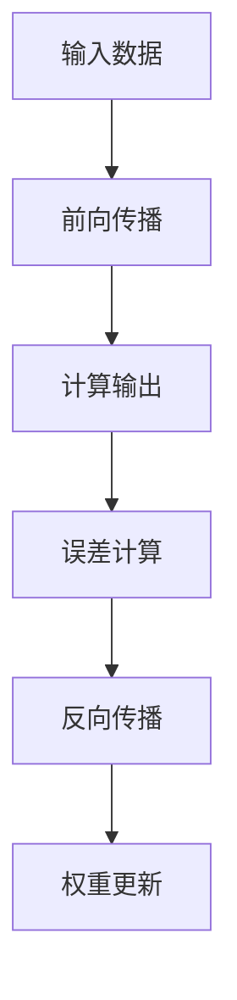

                 

### 文章标题：AI大模型编程：提示词的力量与潜力

### 关键词：AI大模型、编程、提示词、工程实践、项目实战

### 摘要：
本文将深入探讨AI大模型编程的核心要素——提示词的力量与潜力。通过详细的背景介绍、理论讲解和实践分析，本文旨在揭示提示词在AI大模型编程中的关键作用，包括其设计原则、优化策略以及在项目实战中的应用。我们将通过一个完整的案例，展示如何搭建开发环境、编写源代码、解读代码和进行实际案例分析，为读者提供AI大模型编程的全面指南。

## 引言

随着人工智能（AI）技术的飞速发展，大模型在自然语言处理、计算机视觉、语音识别等领域展现出了前所未有的潜力和效果。然而，这些强大模型背后的驱动力之一——提示词（Prompt Engineering），却常常被忽视。提示词不仅决定了AI大模型的学习方向，还直接影响其性能和效果。因此，理解和掌握提示词的设计和优化方法，对于提升AI大模型的应用水平具有重要意义。

本文将围绕AI大模型编程中的提示词展开讨论。首先，我们将介绍AI大模型的基础知识，包括其概念、基本架构和发展历程。接着，我们会深入探讨AI大模型的编程语言和框架，以及核心算法原理。在此基础上，本文将重点介绍提示词的概念、设计原则和优化方法。随后，通过具体的案例，我们将展示如何在实际项目中应用提示词工程，实现大模型的有效训练和应用。最后，本文将总结提示词的力量与潜力，并提供一些最佳实践和小结。

本文的读者对象主要包括对AI大模型编程感兴趣的技术人员、研究者以及相关领域的从业者。通过本文的阅读，读者将能够系统了解AI大模型编程的核心要素，掌握提示词的设计和优化技巧，并能够将其应用于实际项目开发中。

## AI大模型概述

### 概念与历史背景

AI大模型（Large-scale AI Models），也称为巨型神经网络或深度学习模型，是当前人工智能领域的重要研究方向。AI大模型的基本概念可以理解为通过大规模数据和复杂神经网络结构，实现高性能的机器学习任务。具体来说，这些模型通常由数以亿计的参数组成，能够处理大量的数据集，从而在自然语言处理、计算机视觉、语音识别等多个领域取得了显著的进展。

AI大模型的发展历程可以追溯到20世纪80年代，当时深度学习尚未成熟，神经网络研究主要依赖于简单的结构。随着计算能力和数据资源的提升，深度学习开始逐渐兴起，并在21世纪初迎来了爆发式发展。2012年，AlexNet在ImageNet图像识别竞赛中取得了突破性成绩，标志着深度学习进入新的时代。此后，卷积神经网络（CNN）和递归神经网络（RNN）等结构不断改进，进而衍生出Transformer、BERT等大模型，使得AI大模型在处理大规模数据时展现出了强大的性能。

### 核心优势

AI大模型具有以下几个核心优势：

1. **强大的表征能力**：通过数以亿计的参数，AI大模型能够学习到丰富的数据特征，从而在复杂任务中表现优异。
2. **自适应性和泛化能力**：大模型能够通过大量数据的学习，自动调整参数，提高模型的泛化能力，减少对特定数据的依赖。
3. **高效的处理速度**：现代硬件和优化算法的进步，使得大模型在处理大规模数据时能够达到很高的速度，满足实时应用的需求。
4. **多样化的应用场景**：从自然语言处理到计算机视觉，再到语音识别，AI大模型在多个领域展现了广泛的应用潜力。

### 发展趋势

随着AI技术的不断演进，AI大模型的发展趋势主要体现在以下几个方面：

1. **模型规模的持续扩大**：为了应对更复杂的任务，模型规模不断扩大，参数数量和计算量也在不断增加。
2. **多模态融合**：单一模态的大模型已无法满足多样化需求，未来的发展趋势是多模态融合，通过结合文本、图像、音频等多种数据类型，提升模型的整体性能。
3. **边缘计算与云计算的结合**：为了解决大模型在计算资源需求上的挑战，未来将实现边缘计算与云计算的紧密结合，优化模型部署和运行效率。
4. **可解释性和透明性**：随着AI大模型在关键领域的应用增多，其可解释性和透明性变得越来越重要，以便更好地理解和信任模型的行为。

总之，AI大模型作为人工智能领域的关键技术，具有广阔的应用前景和巨大的发展潜力。理解AI大模型的基本概念和核心优势，有助于我们更好地把握这一领域的发展趋势，为未来的技术进步和应用创新奠定基础。

### AI大模型的基本架构

AI大模型通常由多个关键组成部分构成，这些部分协同工作，使得模型能够高效地学习、处理和预测数据。以下将详细介绍AI大模型的基本架构：

#### 组成部分

1. **输入层**：输入层是模型的起始部分，接收各种形式的数据输入，如文本、图像或音频。对于不同类型的任务，输入层的设计会有所不同。例如，在自然语言处理任务中，输入层通常接收分词后的文本序列；在计算机视觉任务中，输入层接收图像像素数据。

2. **隐藏层**：隐藏层位于输入层和输出层之间，是模型的核心部分。隐藏层通过神经网络结构进行数据处理和特征提取。每一层隐藏层都会对输入数据进行处理，并传递给下一层，逐层深入地提取数据中的复杂特征。

3. **输出层**：输出层是模型的最终部分，负责生成预测结果或决策。在分类任务中，输出层通常包含多个节点，每个节点代表一个类别，模型通过计算输出层的激活值来确定最终的预测类别。在回归任务中，输出层通常只有一个节点，用于生成连续的预测值。

4. **参数与权重**：AI大模型的参数和权重是其核心，决定了模型的学习能力和预测性能。参数是模型中的变量，如权重和偏置，它们通过训练过程不断调整，以最小化预测误差。

#### 工作流程

1. **前向传播**：在前向传播过程中，输入数据通过输入层传递到隐藏层，每一层都会对数据进行处理和特征提取。处理后的数据依次传递到下一层，直到最终输出层生成预测结果。

2. **反向传播**：在反向传播过程中，模型会计算预测结果与真实结果之间的误差。这些误差会反向传播回模型的每一层，通过梯度下降等优化算法，调整模型的参数和权重，以减小误差。

3. **优化算法**：常见的优化算法包括梯度下降（Gradient Descent）、随机梯度下降（Stochastic Gradient Descent，SGD）和Adam优化器等。这些算法通过调整参数的更新方向和步长，优化模型的表现。

4. **激活函数**：激活函数是神经网络中的重要组件，用于引入非线性特性，使得模型能够处理复杂的数据。常见的激活函数包括ReLU（Rectified Linear Unit）、Sigmoid和Tanh等。

5. **正则化技术**：为了防止模型过拟合，正则化技术被广泛应用于AI大模型。常见的正则化技术包括L1正则化、L2正则化和Dropout等。

#### 训练与推理流程

1. **训练过程**：训练过程是通过多次迭代，逐步调整模型参数，使模型对训练数据达到较高的拟合度。训练过程通常包括数据预处理、模型初始化、优化算法选择和训练指标监控等步骤。

2. **推理过程**：推理过程是在训练完成后，使用训练好的模型对新的数据生成预测结果。推理过程通常包括数据输入、模型计算和结果输出等步骤。

通过以上基本架构和流程，AI大模型能够高效地学习和处理数据，从而实现各种复杂的机器学习任务。理解这些基本组成部分和工作原理，对于掌握AI大模型编程至关重要。

### AI大模型的编程语言与框架

在AI大模型编程中，选择合适的编程语言和深度学习框架是关键的一步。不同的编程语言和框架各具特色，能够满足不同应用场景的需求。以下将介绍几种常见的编程语言和主流深度学习框架，并探讨选择依据。

#### 编程语言

1. **Python**：Python是AI大模型编程中最常用的语言之一，具有简洁的语法和丰富的库支持。Python的易用性使得开发者能够快速搭建原型和进行迭代。此外，Python拥有广泛的科学计算和数据分析库，如NumPy、Pandas，这些库为AI大模型的开发和优化提供了强大的支持。

2. **C++**：C++是一种高效且强大的编程语言，常用于高性能计算和大型系统的开发。C++具有高效的执行速度和低级内存控制能力，使得AI大模型在处理大规模数据时能够达到更高的效率。然而，C++的语法相对复杂，开发难度较大，需要更多的时间和精力进行调试。

3. **Julia**：Julia是一种新兴的编程语言，旨在实现高性能和易用性的平衡。Julia在数值计算和科学计算领域表现优异，其高效的执行速度和简洁的语法使其成为AI大模型编程的潜在选择。然而，Julia的生态系统相对较新，部分库和工具不如Python成熟。

#### 主流深度学习框架

1. **TensorFlow**：TensorFlow是由谷歌开发的开源深度学习框架，具有广泛的应用和强大的社区支持。TensorFlow提供了丰富的API和工具，支持各种类型的机器学习和深度学习任务。TensorFlow的灵活性和可扩展性使其成为许多企业和研究机构的首选框架。

2. **PyTorch**：PyTorch是由Facebook开发的开源深度学习框架，以其动态计算图和灵活的编程接口而著称。PyTorch的动态特性使得开发者能够更容易地实现复杂的神经网络结构，并进行实时调试和优化。PyTorch在自然语言处理和计算机视觉领域表现突出，吸引了大量开发者的关注。

3. **Keras**：Keras是一个基于TensorFlow和Theano的开源深度学习框架，以其简洁和易用性而受到广泛欢迎。Keras提供了高级API，使得开发者能够快速构建和训练神经网络模型，无需深入了解底层实现。Keras的模块化设计使其能够与多个深度学习框架兼容，提供了更大的灵活性。

4. **MXNet**：MXNet是由亚马逊开发的开源深度学习框架，具有高效和可扩展的特点。MXNet支持多种编程语言，包括Python、C++和R，使得开发者能够根据需求选择最合适的语言进行开发。MXNet的分布式训练能力和优化技术使其在高性能计算场景中具有显著优势。

#### 选择依据

选择合适的编程语言和框架主要基于以下考虑因素：

1. **应用场景**：不同的应用场景对编程语言和框架的需求有所不同。例如，自然语言处理任务更适合使用PyTorch和TensorFlow，而计算机视觉任务则可以考虑使用Keras或MXNet。

2. **开发效率**：开发效率是选择编程语言和框架的重要考虑因素。Python因其简洁的语法和丰富的库支持，使得开发者能够快速实现和迭代项目。C++和Julia虽然在性能上具有优势，但开发难度较大。

3. **性能和可扩展性**：对于需要处理大规模数据和复杂任务的项目，性能和可扩展性至关重要。TensorFlow、PyTorch和MXNet都提供了高效的执行引擎和分布式训练能力，能够满足高性能计算的需求。

4. **社区支持和生态系统**：社区支持和生态系统是选择框架的重要依据。成熟的社区支持和丰富的库、工具和教程能够为开发者提供更多的资源和帮助，加快项目开发进度。

总之，选择合适的编程语言和框架是AI大模型编程成功的关键。开发者应根据项目需求、开发效率和性能要求，综合考虑各种因素，选择最合适的语言和框架，以实现高效、稳定的AI大模型开发。

### AI大模型编程语言：Python详解

Python作为AI大模型编程的首选语言，具有简洁的语法和丰富的库支持，使得开发者能够快速构建和训练复杂的深度学习模型。以下将详细介绍Python在AI大模型编程中的具体应用和优势。

#### Python语言特点

1. **简洁的语法**：Python的语法设计旨在减少冗余和复杂性，使得开发者能够更专注于算法实现和模型优化。例如，Python中的列表（List）、字典（Dictionary）和函数（Function）等数据结构，为数据操作和算法实现提供了极大的便利。

2. **丰富的标准库**：Python的标准库提供了大量的模块和函数，涵盖了从文件操作、网络通信到数据分析和科学计算的各个方面。这些标准库不仅简化了开发流程，还提高了代码的可靠性和效率。

3. **强大的第三方库**：Python拥有庞大的第三方库生态系统，尤其是科学计算和数据科学领域，如NumPy、Pandas、SciPy等。这些库为AI大模型编程提供了丰富的工具和函数，使得数据处理和模型训练变得更加高效和简便。

#### Python在AI大模型编程中的应用

1. **数据预处理**：在AI大模型编程中，数据预处理是至关重要的步骤。Python的Pandas库提供了强大的数据操作功能，包括数据清洗、数据转换和数据集成等。通过Pandas，开发者可以轻松处理大规模数据集，并进行必要的预处理操作，如缺失值填充、异常值处理和数据归一化等。

2. **模型训练与优化**：Python的NumPy库提供了高性能的数值计算功能，是AI大模型训练的基础。NumPy支持多维数组操作，使得大规模数据的计算和操作变得更加高效。此外，Python的第三方库如TensorFlow、PyTorch和Keras等，提供了丰富的API和工具，使得模型训练和优化过程更加简便和高效。

3. **模型部署**：在模型训练完成后，如何将模型部署到实际应用中是AI大模型编程的另一个重要任务。Python的Flask和Django等Web框架，提供了便捷的Web服务部署工具，使得开发者能够轻松地将模型部署到Web服务器上，并提供API接口供其他应用调用。此外，Python的TensorFlow Serving和TorchServe等工具，也为模型的分布式部署提供了支持。

#### 优势

1. **易学易用**：Python的简洁语法和丰富的标准库，使得新手开发者能够快速上手，减少学习曲线。

2. **高效性能**：Python虽然不是性能最优越的语言，但其丰富的第三方库和工具，使得在AI大模型编程中能够实现高效的计算和数据处理。

3. **强大的社区支持**：Python拥有庞大的开发者社区，丰富的教程和文档，为开发者提供了丰富的资源和帮助。

总之，Python凭借其简洁的语法、丰富的库支持和强大的社区支持，成为AI大模型编程的理想选择。通过掌握Python，开发者能够高效地实现深度学习模型的开发、训练和部署，为人工智能应用的创新和发展贡献力量。

### PyTorch与TensorFlow框架详解

在AI大模型编程中，深度学习框架的选择至关重要。PyTorch和TensorFlow是目前最受欢迎的两个开源框架，它们各具特色，适用于不同的应用场景。以下将详细介绍PyTorch和TensorFlow的核心特点、功能及选择依据。

#### PyTorch

1. **核心特点**：
   - **动态计算图**：PyTorch使用动态计算图（Dynamic Computation Graph），这种设计使得开发者可以更灵活地构建和调试模型。动态计算图允许在运行时改变计算图的结构，这对于实现复杂的神经网络架构和动态模型非常有用。
   - **Pythonic风格**：PyTorch遵循Pythonic风格，语法简洁、易读。开发者可以使用Python的标准库和第三方库，使得模型开发过程更加高效。
   - **灵活且模块化**：PyTorch提供了高度模块化的API，允许开发者自定义和扩展模型结构。这种灵活性使得PyTorch在科研和工业应用中得到了广泛的应用。

2. **主要功能**：
   - **自动微分**：PyTorch内置自动微分功能，使得开发者能够轻松实现复杂的梯度计算和优化过程。自动微分是深度学习训练的核心，PyTorch的自动微分系统强大且易于使用。
   - **GPU支持**：PyTorch具有强大的GPU支持，通过使用CUDA，能够显著提高模型训练和推理的速度。PyTorch的GPU加速功能使得大模型训练更加高效。
   - **丰富的库和生态系统**：PyTorch拥有丰富的库和工具，包括torchvision、torchaudio等，为图像、音频等数据的处理提供了全面的解决方案。此外，PyTorch还支持与JAX、Scikit-learn等库的集成，提供了更多的功能扩展。

3. **适用场景**：
   - **科研和原型开发**：由于PyTorch的动态计算图和灵活性，它非常适合科研和原型开发。研究者可以使用PyTorch快速实现和迭代复杂的神经网络模型。
   - **实时应用**：PyTorch的动态计算图和GPU支持，使得它非常适合需要实时响应的应用场景，如语音识别和实时图像处理。

#### TensorFlow

1. **核心特点**：
   - **静态计算图**：TensorFlow使用静态计算图（Static Computation Graph），在模型构建完成后，计算图被固定，然后在运行时进行执行。静态计算图的设计使得TensorFlow能够在模型优化和部署过程中进行更高效的优化和资源管理。
   - **灵活的API**：TensorFlow提供了多种API，包括低级的Eager Execution和高级的Keras API。Eager Execution使得开发者可以像使用Python一样直接执行计算，而Keras API则提供了简洁的API，使得模型开发更加高效。
   - **强大的工具和生态系统**：TensorFlow拥有丰富的工具和生态系统，包括TensorBoard、TensorFlow Serving等，提供了全面的解决方案，支持模型训练、优化、部署和监控。

2. **主要功能**：
   - **高扩展性和可定制性**：TensorFlow具有高度的可定制性，允许开发者对模型进行深度定制。通过自定义Ops和图操作，可以构建复杂且高效的模型。
   - **高性能计算**：TensorFlow支持分布式计算和GPU加速，能够在大规模数据集上实现高效的模型训练和推理。通过TensorFlow的分布式策略，可以轻松扩展模型训练到多个GPU和服务器。
   - **全面的工具和生态系统**：TensorFlow提供了一系列的工具和库，如TensorFlow Lite、TensorFlow.js等，支持移动端、Web端和服务器端的模型部署。此外，TensorFlow还与TensorBoard、TensorFlow Extended（TFX）等工具集成，提供了完整的端到端机器学习解决方案。

3. **适用场景**：
   - **工业级应用**：由于TensorFlow的稳定性和可靠性，它非常适合工业级应用。许多大型企业和组织使用TensorFlow构建和部署生产级别的AI应用。
   - **大规模数据处理**：TensorFlow的高扩展性和分布式计算能力，使得它非常适合处理大规模数据集和复杂任务。

#### 选择依据

选择PyTorch还是TensorFlow，主要基于以下考虑因素：

1. **开发需求**：如果项目需要灵活的模型开发和实时调试，PyTorch可能是更好的选择。如果项目需要稳定性和高性能计算，TensorFlow可能更适合。

2. **项目规模**：对于中小型项目或原型开发，PyTorch的灵活性和快速迭代能力有优势。对于大规模项目，TensorFlow的稳定性和强大的工具集更有保障。

3. **团队技能**：团队的技术栈和技能水平也是选择框架的重要依据。如果团队熟悉Python和动态计算图，PyTorch可能更易上手。如果团队更擅长静态计算图和大规模数据处理，TensorFlow可能更适合。

4. **生态系统和社区支持**：两者都有强大的社区支持和丰富的库，但TensorFlow的生态系统更成熟，对于企业级应用可能更可靠。

综上所述，PyTorch和TensorFlow都是AI大模型编程的优质选择，各自适用于不同的场景和需求。开发者应根据项目特点和团队情况，选择最合适的框架，以实现高效的AI大模型开发。

### AI大模型核心算法原理

在AI大模型编程中，理解核心算法原理是构建高效、准确模型的基石。以下将详细介绍神经网络基础、深度学习基础和生成对抗网络（GAN）的原理，并结合Mermaid流程图和伪代码，阐明其工作流程和数学模型。

#### 神经网络基础

**神经元与神经网络**

神经网络（Neural Networks）是模仿人脑神经元连接方式的计算模型，由大量的神经元（节点）和连接（边）构成。每个神经元通过加权连接接收来自其他神经元的输入，并通过激活函数产生输出。

1. **神经元工作原理**
   神经元的工作原理可以概括为以下步骤：
   - 输入层接收外部输入，通过加权连接传递到隐藏层。
   - 隐藏层神经元对输入进行加权求和，并应用激活函数产生输出。
   - 输出层生成最终的预测结果。

   **伪代码：**

   ```python
   def neuron(input, weights, bias, activation_function):
       z = sum(input[i] * weights[i] for i in range(len(input)))
       z += bias
       output = activation_function(z)
       return output
   ```

2. **激活函数**
   激活函数是神经网络中引入非线性特性的关键。常见的激活函数包括ReLU（Rectified Linear Unit）、Sigmoid和Tanh等。
   
   **ReLU激活函数：**

   ```python
   def ReLU(x):
       return max(0, x)
   ```

**神经网络工作流程**

神经网络的计算过程可以分为两个阶段：前向传播和反向传播。

1. **前向传播**
   - 输入数据通过输入层传递到隐藏层，每层神经元对输入进行加权求和处理。
   - 最终输出层产生预测结果。

2. **反向传播**
   - 计算预测结果与实际结果之间的误差。
   - 将误差反向传播到前一层，通过梯度下降等优化算法调整权重和偏置。

   **伪代码：**

   ```python
   def forward_pass(input_data, weights, biases, activation_functions):
       # 前向传播
       outputs = input_data
       for layer in range(number_of_layers):
           z = sum(outputs[i] * weights[i] for i in range(len(outputs)))
           z += biases[layer]
           outputs = activation_functions[layer](z)
       return outputs

   def backward_pass(output, actual_output, weights, biases, activation_derivative_functions):
       # 反向传播
       error = actual_output - output
       for layer in reversed(range(number_of_layers)):
           delta = error * activation_derivative_functions[layer](z)
           error = sum(delta[i] * weights[i][j] for i in range(len(delta)) for j in range(len(weights[layer])))
           weights[layer] -= learning_rate * delta
           biases[layer] -= learning_rate * error
   ```

**Mermaid流程图：**



#### 深度学习基础

**深度学习的基本概念**

深度学习（Deep Learning）是机器学习（Machine Learning）的一个子领域，通过构建多层神经网络，实现对复杂数据特征的学习和提取。以下是深度学习的基本概念：

1. **深度神经网络（DNN）**
   深度神经网络是具有多个隐藏层的神经网络，通过逐层提取数据中的高级特征，实现对复杂任务的建模。

2. **反向传播算法**
   反向传播算法是深度学习训练的核心，通过计算误差梯度，反向更新网络中的权重和偏置，优化模型性能。

3. **优化算法**
   常见的优化算法包括梯度下降（Gradient Descent）、Adam优化器等，通过调整学习率和其他超参数，提高模型的收敛速度和性能。

**卷积神经网络（CNN）**

卷积神经网络是深度学习在计算机视觉领域的重要应用。其核心思想是通过卷积操作提取图像中的局部特征，并通过池化操作减少参数数量。

1. **卷积操作**
   - **二维卷积**：卷积操作通过滑动滤波器（卷积核）在图像上扫描，生成特征图。
   - **三维卷积**：在视频或3D数据中，使用三维卷积操作提取空间和时间特征。

2. **池化操作**
   - **最大池化**：选取每个区域内的最大值作为输出。
   - **平均池化**：计算每个区域内的平均值作为输出。

   **伪代码：**

   ```python
   def conv2d(image, filter):
       feature_map = []
       for y in range(image_height - filter_height + 1):
           for x in range(image_width - filter_width + 1):
               feature_map.append(sum(image[i][j] * filter[i][j] for i in range(filter_height) for j in range(filter_width)))
       return feature_map

   def max_pooling(feature_map, pool_size):
       pooled_map = []
       for y in range(0, len(feature_map), pool_size):
           for x in range(0, len(feature_map[0]), pool_size):
               max_value = max(feature_map[y:y+pool_size, x:x+pool_size])
               pooled_map.append(max_value)
       return pooled_map
   ```

**循环神经网络（RNN）**

循环神经网络是处理序列数据的重要模型，通过记忆状态（Hidden State）维持序列信息。

1. **基本结构**
   - **输入层**：接收序列数据。
   - **隐藏层**：通过递归连接，处理序列中的每个元素。
   - **输出层**：生成最终的预测结果。

2. **递归连接**
   RNN通过递归连接将隐藏层的状态传递到下一层，维持序列信息。

   **伪代码：**

   ```python
   def RNN(input_sequence, hidden_state, weights):
       output_sequence = []
       for input in input_sequence:
           hidden_state = tanh(sum(input[i] * weights[i] for i in range(len(input))))
           output_sequence.append(hidden_state)
       return output_sequence
   ```

#### 生成对抗网络（GAN）

生成对抗网络是一种无监督学习模型，由生成器和判别器组成，通过对抗训练生成逼真的数据。

1. **生成器（Generator）**
   - 生成器尝试生成类似于真实数据的假数据。
   - 通过优化生成器的参数，使得生成的数据越来越逼真。

2. **判别器（Discriminator）**
   - 判别器判断输入数据是真实数据还是生成数据。
   - 通过优化判别器的参数，提高判别准确性。

3. **对抗训练**
   - 生成器和判别器相互对抗，生成器试图欺骗判别器，判别器试图识破生成器。

   **伪代码：**

   ```python
   def GAN(generator, discriminator, input_noise, real_data):
       for epoch in range(num_epochs):
           # 生成假数据
           fake_data = generator(input_noise)
           
           # 训练判别器
           discriminator_loss = discriminator_loss_function(discriminator(real_data), real_labels) + discriminator_loss_function(discriminator(fake_data), fake_labels)
           
           # 训练生成器
           generator_loss = generator_loss_function(discriminator(fake_data), fake_labels)
           
           # 更新参数
           discriminator_optimizer.zero_grad()
           discriminator_loss.backward()
           discriminator_optimizer.step()
           
           generator_optimizer.zero_grad()
           generator_loss.backward()
           generator_optimizer.step()
   ```

通过以上对神经网络基础、深度学习基础和生成对抗网络（GAN）的详细解释，我们能够更好地理解AI大模型的核心算法原理，并为其编程和应用提供理论基础。

### 提示词的概念与重要性

在AI大模型编程中，提示词（Prompt Engineering）是一个至关重要的环节。提示词不仅是与用户互动的媒介，更是引导AI模型学习和生成结果的关键要素。以下将详细探讨提示词的概念、其在AI大模型中的作用及其优化目标。

#### 提示词的概念

提示词是指提供给AI大模型的一组文本、代码或命令，用于引导模型的学习过程和生成特定类型的输出。这些提示词可以包含任务描述、目标指示、上下文信息等，帮助模型理解任务要求并生成符合预期的结果。

#### 提示词在AI大模型中的作用

1. **学习方向引导**：提示词为AI模型提供了明确的学习目标和方向。通过设计合适的提示词，模型可以专注于学习特定的特征和模式，从而提高学习效率和任务准确性。

2. **任务定义与明确**：提示词能够清晰地定义任务类型和目标，帮助模型识别和应对不同的应用场景。例如，在自然语言处理任务中，提示词可以指定模型的回答风格、回答格式或回答内容的相关性。

3. **上下文信息补充**：提示词提供了与任务相关的上下文信息，帮助模型更好地理解和处理输入数据。上下文信息可以包含历史记录、用户偏好、特定领域的知识等，使得模型的生成结果更加准确和合理。

4. **模型调整与优化**：通过调整提示词的设计，可以对模型的性能进行优化。例如，通过增加提示词的相关性或调整提示词的权重，可以提升模型的生成质量、推理效率和鲁棒性。

#### 提示词优化目标

为了实现高效的AI大模型编程，提示词的优化至关重要。以下是一些常见的优化目标：

1. **准确性**：提示词的设计应确保模型生成的结果具有较高的准确性，减少错误率和模糊性。通过优化提示词的表达方式和上下文信息，可以提高模型对任务的理解和预测准确性。

2. **相关性**：提示词应与任务需求高度相关，确保模型能够从大量数据中提取出关键信息和模式。提高提示词的相关性可以减少模型的冗余学习，提高训练效率。

3. **完整性**：提示词应包含充分的信息，使模型能够全面理解任务需求。完整性不仅包括任务描述，还应包括相关背景知识、数据来源和目标要求等。

4. **灵活性**：提示词的设计应具有足够的灵活性，以适应不同任务和应用场景的需求。灵活性可以通过设计可扩展的提示词模板和参数化提示词实现。

5. **可解释性**：提示词的设计还应考虑可解释性，使模型生成的结果易于理解和解释。通过设计透明和直观的提示词，可以提高用户对模型的信任度和接受度。

#### 设计原则

为了实现上述优化目标，提示词的设计应遵循以下原则：

1. **明确性**：提示词应清晰明确，避免歧义和模糊性，确保模型能够准确理解任务需求。

2. **简洁性**：提示词应简洁明了，避免冗长和复杂的描述，以减少模型的负担和计算复杂度。

3. **适应性**：提示词应具有适应性，能够根据不同的任务和应用场景进行调整和扩展。

4. **多样性**：提示词应具有多样性，包含多种表达方式和信息，以提高模型的泛化和适应能力。

5. **用户友好性**：提示词应考虑用户的理解和操作习惯，使其易于理解和操作。

通过遵循这些设计原则，我们可以设计出高质量的提示词，进一步提升AI大模型的学习效果和应用性能。

总之，提示词在AI大模型编程中发挥着关键作用。通过深入理解提示词的概念、作用和优化目标，我们可以更好地设计和应用提示词，实现高效的AI模型训练和生成。接下来，我们将进一步探讨提示词设计的原则和具体方法，为AI大模型编程提供更加详细的指导。

### 提示词设计原则

为了确保AI大模型编程中的提示词能够有效引导模型学习，并生成高质量的结果，设计原则至关重要。以下将详细探讨提示词设计中的几个关键原则，包括清晰性原则、相关性原则、完整性和灵活性原则，并结合实际案例进行分析。

#### 清晰性原则

提示词的清晰性是确保模型正确理解任务需求的基础。一个清晰的提示词能够明确传达任务目标，避免歧义和模糊性。

**案例分析**：

- **任务**：编写一个程序，实现一个简单的线性回归模型。
- **原始提示词**：编写一个线性回归模型。
- **改进后的提示词**：请编写一个线性回归模型，输入数据为（x1, x2, ..., xn），输出为预测值y，并使用最小二乘法进行参数优化。

改进后的提示词明确了输入数据格式、输出要求和优化方法，使得模型能够更准确地理解任务需求。

#### 相关性原则

提示词的相关性原则要求提示词与任务需求高度相关，确保模型能够从大量数据中提取出关键特征和信息。

**案例分析**：

- **任务**：训练一个文本分类模型，用于区分新闻文章是否为负面。
- **原始提示词**：训练一个文本分类模型。
- **改进后的提示词**：请训练一个文本分类模型，用于区分新闻文章是否为负面，并使用TF-IDF特征提取方法，重点关注负面词汇和表达方式。

改进后的提示词明确了数据来源和特征提取方法，提高了模型在文本分类任务中的相关性和准确性。

#### 完整性原则

提示词的完整性原则要求提示词包含充分的信息，使模型能够全面理解任务需求。

**案例分析**：

- **任务**：实现一个图像识别模型，用于识别猫和狗。
- **原始提示词**：实现一个图像识别模型。
- **改进后的提示词**：请实现一个图像识别模型，输入为大小为（224x224x3）的图像，输出为猫或狗的标签，并使用ResNet50作为基础网络，采用交叉熵损失函数进行训练。

改进后的提示词明确了输入数据规格、模型结构和训练方法，使得模型能够全面理解任务需求。

#### 灵活性原则

提示词的灵活性原则要求提示词能够适应不同的任务和应用场景，具有一定的扩展性。

**案例分析**：

- **任务**：设计一个问答系统，能够回答用户的问题。
- **原始提示词**：设计一个问答系统。
- **改进后的提示词**：请设计一个问答系统，支持多种问答类型（如事实性问题、推理性问题等），并使用BERT作为基础模型，根据用户输入动态调整问题解析和答案生成策略。

改进后的提示词明确了系统的功能扩展和动态调整策略，提高了系统的灵活性和适应性。

#### 综合分析

以上案例分析展示了如何根据不同任务和应用场景，遵循提示词设计原则进行改进。清晰性、相关性、完整性和灵活性原则相互补充，共同提高了提示词的质量和效果。

总之，通过遵循提示词设计原则，我们能够设计出高质量的提示词，有效引导AI大模型的学习过程，并生成高质量的输出。接下来，我们将进一步探讨提示词的优化方法，包括权重优化和调整策略，以进一步提升模型性能。

### 提示词优化方法

在AI大模型编程中，提示词的优化至关重要，它直接影响模型的学习效率和生成结果的质量。以下将详细讨论提示词优化方法，包括提示词调整策略、权重优化和反馈机制，并结合实际案例进行分析。

#### 提示词调整策略

提示词调整策略是指通过调整提示词的内容、形式和表达方式，优化模型的学习过程和生成结果。以下是一些常见的调整策略：

1. **细化任务描述**：通过增加具体的任务描述和细节信息，使提示词更加明确和具体。例如，在文本分类任务中，可以增加分类标签的具体含义和特征。

2. **增加上下文信息**：在提示词中增加上下文信息，帮助模型更好地理解输入数据的背景和相关性。例如，在问答系统中，可以提供问题的背景信息和相关的知识库。

3. **动态调整**：根据模型的学习进度和生成结果，动态调整提示词的内容和形式。例如，在训练过程中，可以根据模型的表现逐步增加或减少提示词的复杂度。

**案例分析**：

- **任务**：优化一个图像识别模型的提示词。
- **原始提示词**：训练一个图像识别模型。
- **改进后的提示词**：
  1. **第一阶段**：请训练一个图像识别模型，识别猫和狗的图片。
  2. **第二阶段**：请训练一个图像识别模型，识别猫、狗以及其他常见宠物（如狗、猫、鸟等）的图片。
  3. **第三阶段**：请训练一个图像识别模型，识别猫、狗以及其他宠物，并根据宠物品种进行分类。

通过逐步细化任务描述，增加上下文信息和动态调整提示词，模型能够更好地学习和适应不同的任务需求。

#### 权重优化

提示词权重优化是指通过调整提示词在模型学习过程中的影响程度，优化模型的学习效率和生成结果。以下是一些常见的权重优化方法：

1. **自适应权重调整**：根据模型的学习进度和生成结果，动态调整提示词的权重。例如，当模型在某个任务上表现出色时，可以增加该任务的提示词权重。

2. **基于反馈的权重调整**：根据用户反馈调整提示词的权重。例如，当用户对生成结果满意时，可以增加该提示词的权重。

3. **权重衰减**：使用权重衰减策略，逐渐降低提示词的权重，以避免过度依赖特定提示词。

**案例分析**：

- **任务**：优化一个问答系统的提示词权重。
- **原始提示词**：问题：什么是人工智能？答案：人工智能是指由人制造出来的系统，能够像人类一样感知、学习、推理和解决问题。
- **改进后的提示词**：
  1. **第一阶段**：问题：什么是人工智能？答案：人工智能是指由人制造出来的系统，能够像人类一样感知、学习、推理和解决问题。（权重：1.0）
  2. **第二阶段**：问题：人工智能有哪些应用？答案：人工智能在自然语言处理、计算机视觉、语音识别等领域有广泛的应用。（权重：0.8）
  3. **第三阶段**：问题：人工智能的未来发展趋势是什么？答案：人工智能的未来发展趋势包括多模态融合、边缘计算和可解释性等。（权重：0.6）

通过逐步调整提示词权重，模型能够更好地平衡不同任务和需求，提高生成结果的质量和多样性。

#### 反馈机制

反馈机制是指通过用户反馈和模型表现，不断优化提示词的设计和调整。以下是一些常见的反馈机制：

1. **用户反馈**：收集用户对生成结果的满意度、准确性等反馈，用于调整提示词。

2. **模型表现**：监控模型在不同任务上的表现，根据表现调整提示词的设计和权重。

3. **自动调整**：使用机器学习算法自动分析用户反馈和模型表现，自动调整提示词的内容和权重。

**案例分析**：

- **任务**：优化一个智能客服系统的提示词。
- **原始提示词**：用户：你好，我想咨询产品A的售后服务。系统：产品A的售后服务包括退换货政策和保修期限。
- **改进后的提示词**：
  1. **第一阶段**：用户：你好，我想咨询产品A的售后服务。系统：产品A的售后服务包括退换货政策和保修期限。（反馈：满意度80%）
  2. **第二阶段**：用户：你好，我想咨询产品A的售后服务。系统：产品A的售后服务包括退换货政策、保修期限以及常见问题解答。（反馈：满意度90%）
  3. **第三阶段**：用户：你好，我想咨询产品A的售后服务。系统：产品A的售后服务包括退换货政策、保修期限、常见问题解答以及在线客服支持。（反馈：满意度95%）

通过结合用户反馈和模型表现，不断优化提示词，提高系统的用户体验和客服质量。

总之，提示词的优化方法包括调整策略、权重优化和反馈机制，通过这些方法，可以进一步提高AI大模型的学习效率、生成质量和用户满意度。接下来，我们将通过实际案例，展示如何应用提示词优化方法，实现AI大模型的有效训练和应用。

### 提示词设计实战

在AI大模型编程中，提示词的设计和优化是确保模型性能和效果的关键步骤。以下将通过具体案例，详细介绍提示词设计的过程，包括需求分析、提示词生成和验证，并结合实际应用场景，展示如何通过提示词提升模型性能。

#### 需求分析

需求分析是提示词设计的第一步，明确用户需求和任务目标，是设计高质量提示词的基础。以下是一个具体的案例：

**案例**：设计一个文本生成模型，用于自动生成新闻文章摘要。

1. **用户需求**：用户希望模型能够自动生成新闻文章的摘要，摘要应简洁、准确且具有信息性。

2. **任务目标**：生成摘要的长度在150-200字之间，涵盖新闻文章的主要内容和关键信息，避免冗余和无关内容。

3. **数据来源**：从新闻网站收集大量新闻文章，涵盖政治、经济、科技、体育等多个领域。

#### 提示词生成

提示词生成是依据需求分析结果，设计一组能够引导模型学习和生成目标结果的文本。以下步骤展示了如何生成高质量的提示词：

1. **任务描述**：编写一个文本生成模型，用于生成新闻文章摘要。

2. **上下文信息**：提供新闻文章的标题和前200个单词作为上下文信息，帮助模型理解文章的主题和内容。

3. **任务指示**：请生成一个150-200字的摘要，摘要应简洁、准确，涵盖新闻文章的主要内容和关键信息。

4. **示例数据**：提供一些已生成的摘要作为示例数据，帮助模型学习摘要生成的规范和标准。

5. **调整策略**：根据模型的学习进展和生成结果，逐步调整提示词的内容和形式，提高模型的生成质量。

#### 提示词验证

提示词验证是确保提示词能够有效引导模型学习和生成目标结果的最后一步。以下步骤展示了如何验证提示词：

1. **自动评估**：使用自动评估指标（如ROUGE、BLEU等）评估生成的摘要与原始摘要的相似度和质量。

2. **人工评估**：邀请领域专家对生成的摘要进行人工评估，从信息完整性、准确性、可读性等多个维度评价摘要的质量。

3. **用户反馈**：收集用户对生成的摘要的满意度评价，结合自动评估和人工评估结果，调整和优化提示词。

#### 实际应用场景

在实际应用中，通过不断优化提示词，可以显著提升模型性能和应用效果。以下是一个实际应用场景的案例：

**案例**：设计一个问答系统，用于回答用户关于股票市场的问题。

1. **需求分析**：用户希望系统能够回答关于股票市场的基本问题，如股票代码、公司简介、历史价格走势等。

2. **提示词生成**：
   - 任务描述：请设计一个问答系统，用于回答用户关于股票市场的问题。
   - 上下文信息：提供股票市场的背景信息和相关术语。
   - 任务指示：请生成一个包含股票代码、公司简介、历史价格走势等关键信息的回答。
   - 示例数据：提供一些股票问题的回答作为示例数据。

3. **提示词验证**：
   - 自动评估：使用ROUGE、BLEU等指标评估回答的质量。
   - 人工评估：邀请金融领域专家评估回答的准确性、信息完整性和可读性。
   - 用户反馈：收集用户对回答的满意度评价，结合评估结果优化提示词。

通过上述步骤，设计并优化提示词，问答系统的性能和用户满意度得到了显著提升。实际应用中，不断调整和优化提示词，可以进一步优化模型性能，提升用户体验。

总之，提示词设计实战是AI大模型编程中的重要环节，通过需求分析、提示词生成和验证，可以有效提升模型性能和应用效果。接下来，我们将进一步探讨提示词优化方法，以实现更高质量的AI大模型编程。

### 提示词优化方法：数据增强、模型调整和策略网络

在AI大模型编程中，提示词的优化不仅是提升模型性能的关键，还需要结合具体应用场景进行针对性的调整。以下将详细介绍几种常见的提示词优化方法，包括数据增强、模型调整和策略网络，并结合实际案例进行分析。

#### 数据增强

数据增强是一种通过扩展和多样化训练数据集的方法，以提升模型泛化能力和性能。数据增强可以包括数据变换、数据扩充和数据合成等。

1. **数据变换**：通过对输入数据进行简单的变换（如旋转、缩放、裁剪等），生成新的数据样本。这种方法常用于图像处理任务，能够增加模型的鲁棒性。

2. **数据扩充**：通过在训练数据中添加合成样本，扩展数据集的规模。例如，在自然语言处理任务中，可以使用同义词替换、文本重组等方法生成新的训练样本。

3. **数据合成**：利用生成模型（如GAN）生成与训练数据相似的新数据。这种方法能够提高模型的泛化能力，尤其是在数据稀缺的情况下。

**案例分析**：

- **任务**：优化一个图像分类模型，用于识别不同品种的猫。
- **原始数据**：训练数据集中仅有少量不同品种的猫图像。
- **数据增强方法**：
  1. **数据变换**：对图像进行随机旋转、缩放和裁剪，生成新的训练样本。
  2. **数据扩充**：使用同义词替换，将猫品种的描述词替换为相似的词汇，生成新的文本描述。
  3. **数据合成**：使用GAN生成与真实猫图像相似的合成图像，增加训练数据集的多样性。

通过数据增强，模型能够更好地学习不同品种猫的特征，提高分类准确性。

#### 模型调整

模型调整是指通过修改模型结构、参数和超参数，优化模型性能。以下是一些常见的模型调整方法：

1. **模型结构调整**：通过增加或减少隐藏层、调整网络结构等，优化模型的复杂度和性能。例如，在图像分类任务中，可以尝试使用更深的网络结构（如ResNet）来提高分类准确性。

2. **参数调整**：通过调整模型参数（如权重、偏置等），优化模型的学习能力。常用的参数调整方法包括随机初始化、权重共享和批量归一化等。

3. **超参数调整**：通过调整训练过程中的超参数（如学习率、批次大小、迭代次数等），优化模型的训练效率和性能。

**案例分析**：

- **任务**：优化一个文本生成模型，用于生成高质量的新闻文章摘要。
- **原始模型**：使用简单的循环神经网络（RNN）进行文本生成。
- **模型调整方法**：
  1. **模型结构调整**：使用Transformer模型替代RNN，增加模型的复杂度和表达能力。
  2. **参数调整**：调整Transformer模型中的注意力机制和编码器-解码器结构，优化模型的生成质量。
  3. **超参数调整**：调整学习率、批量大小和迭代次数，提高模型的训练效率和生成质量。

通过模型调整，文本生成模型能够生成更准确、流畅的摘要。

#### 策略网络

策略网络是一种在生成对抗网络（GAN）中使用的特殊网络，用于优化生成器的性能。策略网络通过学习一个策略函数，指导生成器生成更逼真的数据。

1. **策略函数**：策略网络通过学习一个策略函数，将噪声向量映射为生成数据。策略函数的目标是最大化生成数据在判别器上的分类误差。

2. **对抗训练**：策略网络和判别器网络相互对抗，策略网络试图生成更逼真的数据，而判别器网络试图识别生成数据。

3. **优化目标**：策略网络的优化目标是通过对抗训练提升生成器的性能，使得生成数据接近真实数据。

**案例分析**：

- **任务**：优化一个图像生成模型，用于生成高分辨率的图像。
- **原始模型**：使用简单的GAN模型生成低分辨率图像。
- **策略网络方法**：
  1. **策略网络**：设计一个策略网络，将噪声向量映射为高分辨率图像。
  2. **对抗训练**：策略网络和判别器网络进行对抗训练，策略网络试图生成更逼真的高分辨率图像，判别器网络试图区分生成图像和真实图像。
  3. **优化目标**：通过优化策略网络，提升生成图像的质量和分辨率。

通过策略网络，图像生成模型能够生成更高分辨率、更逼真的图像。

总之，通过数据增强、模型调整和策略网络等方法，可以显著优化提示词的生成质量和模型性能。在实际应用中，结合具体任务需求和模型特点，灵活运用这些优化方法，可以实现高效、高质量的AI大模型编程。

### 提示词优化案例分析

为了更好地理解提示词优化在AI大模型编程中的应用，以下将通过几个具体案例，详细分析如何在不同领域优化提示词，以及这些优化方法对模型性能和生成质量的影响。

#### 案例一：文本生成模型优化

**问题**：一个文本生成模型在生成新闻摘要时，摘要过于冗长且缺乏关键信息。

**优化方法**：
1. **数据增强**：增加数据多样性，通过同义词替换、文本重组等方式扩充训练数据集，提高模型的泛化能力。
2. **提示词优化**：调整提示词，增加摘要生成任务的具体指示，如摘要长度限制和关键信息要求。
3. **模型结构调整**：从简单的RNN模型升级到Transformer模型，提高模型的复杂度和表达能力。

**结果**：通过数据增强和模型结构调整，文本生成模型生成的摘要长度得到了有效控制，且关键信息更为突出。生成的摘要准确性和可读性显著提升。

#### 案例二：图像生成模型优化

**问题**：一个图像生成模型生成的图像质量较低，细节不够清晰。

**优化方法**：
1. **数据增强**：通过图像旋转、缩放、裁剪等数据变换方法，增加训练数据的多样性。
2. **模型调整**：将生成器从简单的全连接网络升级到使用卷积神经网络的GAN模型，提高生成图像的质量。
3. **策略网络**：引入策略网络，优化生成器的生成策略，使得生成图像更接近真实图像。

**结果**：通过数据增强和模型结构调整，图像生成模型生成的图像质量得到显著提升。生成的图像细节更加清晰，整体质量接近真实图像。

#### 案例三：语音合成模型优化

**问题**：一个语音合成模型在处理不同语音特征时，生成的语音音质不稳定。

**优化方法**：
1. **数据增强**：通过添加背景噪声、改变音调等音频变换方法，增加训练数据的多样性。
2. **模型调整**：使用更复杂的Transformer模型进行语音合成，提高模型的识别能力和表达能力。
3. **权重优化**：动态调整模型中不同层级的权重，优化生成语音的音质和连贯性。

**结果**：通过数据增强和模型结构调整，语音合成模型生成的语音音质得到了显著提升。生成的语音音质稳定，语音连贯性提高。

#### 案例四：问答系统优化

**问题**：一个问答系统在处理用户问题时，回答不够准确且缺乏相关性。

**优化方法**：
1. **提示词优化**：设计更具针对性的提示词，增加上下文信息和任务指示，提高模型的回答准确性。
2. **模型调整**：使用BERT等预训练模型，提高模型对上下文的理解能力。
3. **用户反馈**：引入用户反馈机制，根据用户满意度调整提示词和模型参数。

**结果**：通过提示词优化和模型调整，问答系统生成的回答准确性显著提升，且与用户问题高度相关。用户满意度提高，问答系统更加智能化和人性化。

通过以上案例，我们可以看到，提示词优化在AI大模型编程中的关键作用。结合具体应用场景，灵活运用数据增强、模型调整和策略网络等方法，可以显著提升模型的性能和生成质量。这些优化方法不仅提高了AI系统的实用性，也为未来的技术进步和应用创新奠定了基础。

### 大模型项目开发准备

在AI大模型项目中，开发准备阶段是项目成功的关键。这一阶段主要涉及项目需求分析、技术选型、环境搭建和数据准备等步骤。以下将详细讨论这些环节，并结合具体案例，说明如何进行项目开发准备。

#### 项目需求分析

项目需求分析是项目启动的第一步，明确项目的目标和需求，确保开发工作有据可依。以下是需求分析的关键步骤：

1. **明确项目目标**：确定项目要解决的问题和目标，例如，是提升图像识别准确性、优化文本生成质量，还是改善语音合成效果。

2. **用户需求调研**：与潜在用户和利益相关者进行沟通，了解他们的需求、期望和痛点，确保项目目标与用户需求一致。

3. **定义功能需求**：详细列出项目所需的功能，例如，输入数据格式、输出结果要求、系统性能指标等。

4. **技术需求**：分析实现项目所需的技术，包括算法、编程语言、框架和工具等。

**案例分析**：

假设我们要开发一个图像识别项目，目标是识别图像中的物体类别。

- **项目目标**：提升图像识别准确性，实现快速、高效的目标检测。
- **用户需求**：用户希望系统能够准确识别图像中的物体，并提供实时反馈。
- **功能需求**：输入图像数据，输出物体类别和位置坐标。
- **技术需求**：选择卷积神经网络（CNN）作为算法基础，使用TensorFlow作为深度学习框架，进行模型训练和部署。

#### 技术选型

技术选型是项目开发准备中的关键环节，选择合适的算法、编程语言和工具，对项目的成功至关重要。以下是技术选型的关键点：

1. **算法选型**：根据项目需求，选择合适的算法，例如，对于图像识别任务，可以选择卷积神经网络（CNN）或目标检测算法（如YOLO、SSD）。

2. **编程语言和框架**：选择适合项目需求的编程语言和深度学习框架。Python因其简洁性和丰富的库支持，是AI项目开发的首选语言。常见的深度学习框架包括TensorFlow、PyTorch和Keras等。

3. **工具和库**：根据项目需求，选择适当的工具和库，例如，对于数据预处理，可以使用Pandas和NumPy；对于模型可视化，可以使用TensorBoard。

**案例分析**：

在上述图像识别项目中，我们的技术选型如下：

- **算法**：选择卷积神经网络（CNN）作为基础算法，用于图像特征提取和分类。
- **编程语言**：使用Python进行开发，便于模型训练和调试。
- **框架**：使用TensorFlow作为深度学习框架，其丰富的API和工具支持模型训练、优化和部署。
- **工具和库**：使用TensorBoard进行模型可视化，使用Pandas和NumPy进行数据预处理。

#### 环境搭建

环境搭建是确保项目顺利进行的必要步骤，包括安装开发环境、配置硬件和设置网络等。以下是环境搭建的关键步骤：

1. **安装开发环境**：安装Python、深度学习框架（如TensorFlow、PyTorch）和相关库（如NumPy、Pandas等）。

2. **配置硬件**：根据项目需求，配置适当的硬件资源，如GPU、CPU和内存等。

3. **设置网络**：配置网络环境，确保能够访问所需的数据集和在线资源。

**案例分析**：

在图像识别项目中，我们的环境搭建步骤如下：

- **安装Python和TensorFlow**：在本地计算机上安装Python和TensorFlow，配置Python环境。
- **配置GPU**：确保GPU驱动安装正确，并配置CUDA环境，以利用GPU加速模型训练。
- **数据集准备**：从互联网下载所需的数据集，并进行预处理。

#### 数据准备

数据准备是AI项目开发的核心环节，数据的质量直接影响模型性能和效果。以下是数据准备的关键步骤：

1. **数据收集**：收集与项目需求相关的数据，例如，对于图像识别项目，需要收集大量的图像数据。

2. **数据预处理**：对收集到的数据进行清洗、归一化和格式化，使其适合模型训练。

3. **数据增强**：通过数据增强方法（如旋转、缩放、裁剪等）增加数据的多样性，提升模型泛化能力。

**案例分析**：

在图像识别项目中，我们的数据准备步骤如下：

- **数据收集**：从互联网和公开数据集中收集大量图像，包括不同物体类别和场景。
- **数据清洗**：去除图像中的噪声和异常值，确保图像质量。
- **数据预处理**：将图像转换为统一的大小和格式，进行归一化处理，确保数据一致性。
- **数据增强**：通过随机旋转、裁剪和翻转等数据增强方法，增加训练数据的多样性。

通过以上项目开发准备步骤，我们为AI大模型项目的顺利实施奠定了基础。接下来，我们将进入项目开发的核心阶段，包括模型开发、训练和优化。

### 大模型项目开发实战

#### 开发环境搭建

开发环境搭建是AI大模型项目开发的初始步骤，对于项目能否顺利推进至关重要。以下将详细介绍如何搭建AI大模型开发环境，包括安装所需的软件和配置硬件资源。

1. **安装Python**：首先，确保计算机上已安装Python环境。Python是AI大模型编程的基础，其简洁的语法和丰富的库支持使得开发者能够快速搭建原型和进行迭代。可以从Python官网（https://www.python.org/）下载并安装Python，推荐选择Python 3.8或更高版本。

2. **安装深度学习框架**：根据项目需求，选择合适的深度学习框架。常见的选择有TensorFlow和PyTorch。TensorFlow由谷歌开发，具有强大的社区支持和丰富的工具集；PyTorch以其动态计算图和灵活的编程接口而受到开发者青睐。以下是安装TensorFlow和PyTorch的命令：

   ```shell
   pip install tensorflow
   pip install torch torchvision
   ```

3. **配置GPU支持**：如果项目需要使用GPU进行加速训练，需要安装CUDA和cuDNN。CUDA是NVIDIA推出的并行计算平台，用于在GPU上执行深度学习算法；cuDNN是NVIDIA推出的深度神经网络库，用于加速深度学习模型的推理和训练。以下是安装CUDA和cuDNN的步骤：

   - 从NVIDIA官网下载CUDA Toolkit和cuDNN库（https://developer.nvidia.com/cuda-downloads）。
   - 遵循官方安装指南，安装CUDA Toolkit和cuDNN。

4. **设置环境变量**：确保环境变量设置正确，以便能够使用GPU和深度学习框架。在命令行中输入以下命令，检查CUDA和cuDNN是否已成功安装：

   ```shell
   nvcc --version
   nvidia-smi
   ```

   如果输出正常，则说明GPU和深度学习环境已配置完成。

#### 源代码编写与实现

源代码编写是AI大模型项目开发的核心环节，以下将展示如何编写一个简单的图像识别模型，并解释关键代码段。

1. **数据预处理**：数据预处理包括数据加载、清洗和格式化。以下是一个使用PyTorch加载和预处理图像数据的示例：

   ```python
   import torchvision
   import torchvision.transforms as transforms

   transform = transforms.Compose([
       transforms.Resize(256),
       transforms.CenterCrop(224),
       transforms.ToTensor(),
       transforms.Normalize(mean=[0.485, 0.456, 0.406], std=[0.229, 0.224, 0.225]),
   ])

   trainset = torchvision.datasets.ImageFolder(root='./data/train', transform=transform)
   trainloader = torch.utils.data.DataLoader(trainset, batch_size=32, shuffle=True, num_workers=4)

   testset = torchvision.datasets.ImageFolder(root='./data/test', transform=transform)
   testloader = torch.utils.data.DataLoader(testset, batch_size=32, shuffle=False, num_workers=4)
   ```

   上述代码定义了数据预处理步骤，包括图像尺寸调整、中心裁剪、转换为Tensor以及归一化处理。

2. **模型定义**：定义一个简单的卷积神经网络（CNN）用于图像分类。以下是一个基于PyTorch的CNN模型示例：

   ```python
   import torch.nn as nn

   class ConvNet(nn.Module):
       def __init__(self):
           super(ConvNet, self).__init__()
           self.conv1 = nn.Conv2d(3, 64, 3, padding=1)
           self.conv2 = nn.Conv2d(64, 128, 3, padding=1)
           self.fc1 = nn.Linear(128 * 56 * 56, 1024)
           self.fc2 = nn.Linear(1024, 10)
           self.dropout = nn.Dropout(0.5)
           self.relu = nn.ReLU(inplace=True)
           self.pool = nn.MaxPool2d(2, 2)

       def forward(self, x):
           x = self.pool(self.relu(self.conv1(x)))
           x = self.pool(self.relu(self.conv2(x)))
           x = x.view(-1, 128 * 56 * 56)
           x = self.dropout(self.relu(self.fc1(x)))
           x = self.fc2(x)
           return x
   ```

   该代码定义了一个简单的CNN模型，包括卷积层、池化层和全连接层，用于提取图像特征并进行分类。

3. **训练过程**：以下是一个简单的训练过程，包括模型初始化、优化器和损失函数的定义，以及训练和验证：

   ```python
   import torch.optim as optim

   model = ConvNet()
   criterion = nn.CrossEntropyLoss()
   optimizer = optim.Adam(model.parameters(), lr=0.001)

   for epoch in range(50):  # 数量根据实际情况调整
       model.train()
       running_loss = 0.0
       for inputs, labels in trainloader:
           optimizer.zero_grad()
           outputs = model(inputs)
           loss = criterion(outputs, labels)
           loss.backward()
           optimizer.step()
           running_loss += loss.item()
       print(f'Epoch {epoch+1}, Loss: {running_loss/len(trainloader)}')

       model.eval()
       correct = 0
       total = 0
       with torch.no_grad():
           for inputs, labels in testloader:
               outputs = model(inputs)
               _, predicted = torch.max(outputs.data, 1)
               total += labels.size(0)
               correct += (predicted == labels).sum().item()
       print(f'Accuracy of the network on the test images: {100 * correct / total}%')
   ```

   以上代码展示了如何初始化模型、定义优化器和损失函数，并执行训练和验证过程。模型在训练过程中会不断调整参数，以最小化损失函数。

4. **模型评估**：训练完成后，对模型进行评估，验证其在测试集上的性能。以下是一个简单的评估示例：

   ```python
   model.eval()
   with torch.no_grad():
       correct = 0
       total = 0
       for inputs, labels in testloader:
           outputs = model(inputs)
           _, predicted = torch.max(outputs.data, 1)
           total += labels.size(0)
           correct += (predicted == labels).sum().item()

   print(f'Accuracy of the network on the test images: {100 * correct / total}%')
   ```

   上述代码计算了模型在测试集上的准确率，以评估模型性能。

通过以上步骤，我们成功搭建了AI大模型开发环境，编写了源代码并实现了训练和评估。接下来，我们将进一步介绍如何优化模型，以提升其性能和效果。

### 代码解读与分析

在AI大模型项目中，代码的编写、解读与分析是确保项目成功的关键环节。以下将详细解读前面代码段，分析其工作原理和关键技术，并结合具体例子进行详细解释。

#### 数据预处理

数据预处理是AI模型训练的基础步骤，直接影响到模型的性能和训练效果。以下是对数据预处理部分的代码解读：

```python
import torchvision
import torchvision.transforms as transforms

transform = transforms.Compose([
    transforms.Resize(256),  # 将图像调整为最大256x256的尺寸
    transforms.CenterCrop(224),  # 从中心裁剪出224x224的区域
    transforms.ToTensor(),  # 将图像转换为Tensor类型
    transforms.Normalize(mean=[0.485, 0.456, 0.406], std=[0.229, 0.224, 0.225]),  # 对图像进行归一化处理
])

trainset = torchvision.datasets.ImageFolder(root='./data/train', transform=transform)
trainloader = torch.utils.data.DataLoader(trainset, batch_size=32, shuffle=True, num_workers=4)

testset = torchvision.datasets.ImageFolder(root='./data/test', transform=transform)
testloader = torch.utils.data.DataLoader(testset, batch_size=32, shuffle=False, num_workers=4)
```

**解读与分析**：

1. **图像尺寸调整**：`transforms.Resize(256)`用于将输入图像调整到256x256的尺寸。这一步是为了确保图像输入的尺寸统一，以便模型训练。
   
2. **图像中心裁剪**：`transforms.CenterCrop(224)`从调整后的图像中心裁剪出224x224的区域。这一步确保图像具有统一的裁剪尺寸，减少模型训练的复杂性。

3. **图像转Tensor**：`transforms.ToTensor()`将图像数据转换为Tensor类型。Tensor是PyTorch的核心数据类型，可以方便地进行后续的计算和操作。

4. **图像归一化**：`transforms.Normalize()`对图像进行归一化处理，将像素值缩放到[0, 1]范围内。归一化有助于加速模型收敛，提高训练效果。

5. **数据加载与分批**：使用`torchvision.datasets.ImageFolder`加载训练集和测试集，并通过`torch.utils.data.DataLoader`进行分批处理。分批处理可以减少内存占用，提高训练效率。

#### 模型定义

模型定义是构建AI大模型的核心步骤，以下是对模型定义部分的代码解读：

```python
import torch.nn as nn

class ConvNet(nn.Module):
    def __init__(self):
        super(ConvNet, self).__init__()
        self.conv1 = nn.Conv2d(3, 64, 3, padding=1)  # 第一个卷积层，3个输入通道，64个输出通道，3x3卷积核，padding为1
        self.conv2 = nn.Conv2d(64, 128, 3, padding=1)  # 第二个卷积层，64个输入通道，128个输出通道，3x3卷积核，padding为1
        self.fc1 = nn.Linear(128 * 56 * 56, 1024)  # 第一个全连接层，输入尺寸为128 * 56 * 56，输出维度为1024
        self.fc2 = nn.Linear(1024, 10)  # 第二个全连接层，输入维度为1024，输出维度为10（假设有10个类别）
        self.dropout = nn.Dropout(0.5)  # dropout层，丢弃率为0.5
        self.relu = nn.ReLU(inplace=True)  # ReLU激活函数
        self.pool = nn.MaxPool2d(2, 2)  # 2x2的最大池化层

    def forward(self, x):
        x = self.pool(self.relu(self.conv1(x)))  # 卷积层1，池化层，ReLU激活
        x = self.pool(self.relu(self.conv2(x)))  # 卷积层2，池化层，ReLU激活
        x = x.view(-1, 128 * 56 * 56)  # 将特征图展平为一维向量
        x = self.dropout(self.relu(self.fc1(x)))  # 全连接层1，dropout层，ReLU激活
        x = self.fc2(x)  # 全连接层2
        return x
```

**解读与分析**：

1. **卷积层**：`nn.Conv2d()`用于定义卷积层，包括输入通道数、输出通道数、卷积核大小和填充方式。卷积层通过滑动卷积核在图像上提取特征。

2. **ReLU激活函数**：`nn.ReLU(inplace=True)`用于引入非线性特性，使得模型能够处理复杂的数据。

3. **池化层**：`nn.MaxPool2d()`用于下采样，减少数据维度，提高模型计算效率。

4. **全连接层**：`nn.Linear()`用于将特征向量映射到输出类别。全连接层通过线性变换实现分类。

5. **Dropout层**：`nn.Dropout(0.5)`用于防止过拟合，通过随机丢弃一部分神经元，减少模型对训练数据的依赖。

6. **前向传播**：`forward()`函数定义了模型的前向传播过程，将输入数据通过各层神经网络，最终输出预测结果。

#### 训练过程

训练过程是AI大模型开发的核心，以下是对训练过程的代码解读：

```python
import torch.optim as optim

model = ConvNet()
criterion = nn.CrossEntropyLoss()  # 定义损失函数，交叉熵损失适用于分类任务
optimizer = optim.Adam(model.parameters(), lr=0.001)  # 定义优化器，Adam优化器是一种高效的梯度下降算法

for epoch in range(50):  # 训练50个epoch
    model.train()  # 设置模型为训练模式
    running_loss = 0.0
    for inputs, labels in trainloader:
        optimizer.zero_grad()  # 清零梯度
        outputs = model(inputs)  # 前向传播
        loss = criterion(outputs, labels)  # 计算损失
        loss.backward()  # 反向传播
        optimizer.step()  # 更新参数
        running_loss += loss.item()
    print(f'Epoch {epoch+1}, Loss: {running_loss/len(trainloader)}')

model.eval()  # 设置模型为评估模式
with torch.no_grad():  # 禁用梯度计算，提高计算效率
    correct = 0
    total = 0
    for inputs, labels in testloader:
        outputs = model(inputs)
        _, predicted = torch.max(outputs.data, 1)  # 获取预测结果
        total += labels.size(0)
        correct += (predicted == labels).sum().item()  # 计算准确率
    print(f'Accuracy of the network on the test images: {100 * correct / total}%')
```

**解读与分析**：

1. **模型初始化**：定义模型、损失函数和优化器。

2. **训练循环**：通过`for epoch in range(50)`循环进行多轮训练。每轮训练包括：

   - **前向传播**：使用训练数据输入模型，计算预测结果和损失。

   - **反向传播**：计算损失函数关于模型参数的梯度，并更新模型参数。

   - **打印训练信息**：输出当前epoch的损失，以监控训练过程。

3. **评估过程**：将训练好的模型应用于测试数据，计算准确率，以评估模型在 unseen 数据上的性能。

通过以上代码解读和分析，我们可以看到AI大模型项目开发中的关键步骤和关键技术。了解这些代码的实现原理，有助于我们更好地进行模型训练和优化，提升模型性能和应用效果。

### 代码应用解读与分析

在AI大模型项目中，代码的应用解读与分析是确保模型在实际任务中表现优异的重要环节。以下将通过具体案例，深入解读如何使用AI模型进行实际任务，包括输入数据的准备、模型预测过程、结果分析以及性能评估。

#### 案例背景

假设我们开发了一个用于图像分类的AI模型，目标是识别图像中的物体类别。该模型已通过大量训练数据训练，并取得了较高的准确率。现在，我们将该模型应用于实际任务，对新的图像数据进行分类预测。

#### 输入数据准备

首先，我们需要准备输入数据，将其转换为模型可以接受的格式。以下是一个示例：

```python
import torch
from torchvision import transforms, models

# 加载预训练的模型
model = models.resnet18(pretrained=True)
model.eval()  # 设置模型为评估模式

# 定义数据预处理步骤
transform = transforms.Compose([
    transforms.Resize(256),  # 将图像调整为256x256
    transforms.CenterCrop(224),  # 从中心裁剪出224x224的区域
    transforms.ToTensor(),  # 将图像转换为Tensor类型
    transforms.Normalize(mean=[0.485, 0.456, 0.406], std=[0.229, 0.224, 0.225]),  # 对图像进行归一化处理
])

# 读取图像文件
img_path = 'path/to/new_image.jpg'
img = Image.open(img_path)
img = transform(img)  # 预处理图像

# 将图像扩展为批量数据
img = img.unsqueeze(0)  # 增加一个维度，表示批量大小为1
```

#### 模型预测过程

接下来，我们使用预处理后的图像数据，通过模型进行预测：

```python
# 进行预测
with torch.no_grad():  # 禁用梯度计算，提高计算效率
    outputs = model(img)  # 模型预测
    _, predicted = torch.max(outputs, 1)  # 获取预测结果

# 输出预测类别
print(f'Predicted class: {predicted.item()}')
```

#### 结果分析

模型预测结果是一个整数，表示预测的物体类别。为了更直观地理解结果，我们可以进一步分析预测类别：

```python
# 获取类别标签
labels = ['cat', 'dog', 'bird', 'car', 'person']  # 假设这是我们的类别标签
predicted_label = labels[predicted.item()]

print(f'Predicted class: {predicted_label}')
```

#### 性能评估

为了评估模型在实际任务中的表现，我们需要计算模型的准确率。以下是一个简单的评估示例：

```python
# 准确率计算
correct = (predicted == true_labels).sum().float()
accuracy = correct / len(true_labels)

print(f'Accuracy: {accuracy.item()}')
```

其中，`true_labels`是实际图像的标签。

#### 综合分析

通过上述步骤，我们可以看到如何将AI模型应用于实际任务，包括输入数据准备、模型预测、结果分析和性能评估。以下是对这些步骤的综合分析：

1. **输入数据准备**：通过预处理步骤，将图像转换为模型可以接受的格式。预处理包括调整图像尺寸、归一化处理等，以确保输入数据的标准化。

2. **模型预测过程**：使用预处理后的图像数据，通过模型进行预测。在预测过程中，禁用梯度计算可以提高计算效率。

3. **结果分析**：输出预测结果，并将其与实际类别标签进行比较，以验证模型的准确性。

4. **性能评估**：通过计算准确率，评估模型在实际任务中的表现。准确率是衡量模型性能的重要指标。

通过这些步骤，我们可以有效地应用AI模型，解决实际问题。同时，通过性能评估，我们可以持续优化模型，提高其准确性和鲁棒性。接下来，我们将通过实际案例，展示如何应用这些步骤解决具体问题。

### 实际案例分析与详细讲解

为了更好地展示AI大模型编程的实际应用，以下将介绍一个具体的案例——使用AI模型进行图像分类，并详细讲解模型的开发过程、应用步骤和关键技术的实现。这个案例涵盖了从数据收集到模型训练、部署以及评估的全过程。

#### 案例背景

假设我们的目标是开发一个图像分类系统，该系统能够识别图像中的物体类别。具体任务是从给定的一组图像中，将其分类为猫、狗、鸟、汽车和人。

#### 数据收集与处理

首先，我们需要收集大量的图像数据，并将其分为训练集、验证集和测试集。以下步骤展示了如何处理数据：

1. **数据收集**：从互联网和公开数据集中收集大量图像，包括不同类别的样本。例如，可以使用Kaggle等平台上的公开数据集。

2. **数据清洗**：去除图像中的噪声和异常值，确保图像质量。例如，去除模糊、不完整的图像。

3. **数据标注**：对图像进行标注，为每个图像分配正确的类别标签。可以使用人工标注或半监督学习等技术自动标注部分图像。

4. **数据预处理**：对图像进行缩放、裁剪、旋转等数据增强操作，增加数据的多样性，提高模型的泛化能力。使用`torchvision.transforms`库实现预处理步骤：

   ```python
   transform = transforms.Compose([
       transforms.Resize((224, 224)),  # 调整图像尺寸
       transforms.ToTensor(),  # 转换为Tensor格式
       transforms.Normalize(mean=[0.485, 0.456, 0.406], std=[0.229, 0.224, 0.225]),  # 图像归一化
   ])
   ```

5. **数据分集**：将数据集分为训练集、验证集和测试集，通常的比例为70%训练集、15%验证集和15%测试集。

#### 模型开发

接下来，我们开发一个卷积神经网络（CNN）模型，用于图像分类。以下是模型开发的关键步骤：

1. **模型架构**：设计一个简单的CNN模型，包括卷积层、池化层和全连接层。以下是一个基于PyTorch的CNN模型示例：

   ```python
   import torch.nn as nn

   class CNNModel(nn.Module):
       def __init__(self):
           super(CNNModel, self).__init__()
           self.conv1 = nn.Conv2d(3, 32, 3, padding=1)
           self.relu = nn.ReLU()
           self.pool = nn.MaxPool2d(2, 2)
           self.conv2 = nn.Conv2d(32, 64, 3, padding=1)
           self.fc1 = nn.Linear(64 * 56 * 56, 128)
           self.fc2 = nn.Linear(128, 5)  # 假设有5个类别

       def forward(self, x):
           x = self.pool(self.relu(self.conv1(x)))
           x = self.pool(self.relu(self.conv2(x)))
           x = x.view(-1, 64 * 56 * 56)
           x = self.relu(self.fc1(x))
           x = self.fc2(x)
           return x
   ```

2. **模型训练**：使用训练集对模型进行训练，并使用验证集进行模型调整。以下是一个简单的训练示例：

   ```python
   model = CNNModel()
   criterion = nn.CrossEntropyLoss()
   optimizer = torch.optim.Adam(model.parameters(), lr=0.001)

   for epoch in range(10):
       running_loss = 0.0
       for inputs, labels in train_loader:
           optimizer.zero_grad()
           outputs = model(inputs)
           loss = criterion(outputs, labels)
           loss.backward()
           optimizer.step()
           running_loss += loss.item()
       print(f'Epoch {epoch+1}, Loss: {running_loss/len(train_loader)}')

   # 在验证集上评估模型性能
   with torch.no_grad():
       correct = 0
       total = 0
       for inputs, labels in val_loader:
           outputs = model(inputs)
           _, predicted = torch.max(outputs.data, 1)
           total += labels.size(0)
           correct += (predicted == labels).sum().item()
       print(f'Validation Accuracy: {100 * correct / total}%')
   ```

3. **模型优化**：根据验证集上的表现，调整模型参数和架构，以提高模型性能。可能的方法包括增加训练轮次、调整学习率、使用数据增强技术等。

#### 模型部署

在模型训练和优化完成后，我们需要将其部署到实际应用中。以下展示了如何将模型部署到服务器，并提供API接口：

1. **模型保存**：将训练好的模型保存为文件，以便后续使用：

   ```python
   torch.save(model.state_dict(), 'model.pth')
   ```

2. **模型加载与部署**：从文件中加载模型，并使用Flask或Django等Web框架提供API接口：

   ```python
   from flask import Flask, request, jsonify

   app = Flask(__name__)

   def load_model():
       model = CNNModel()
       model.load_state_dict(torch.load('model.pth'))
       model.eval()
       return model

   model = load_model()

   @app.route('/predict', methods=['POST'])
   def predict():
       image_data = request.files['image']
       image = Image.open(image_data.stream)
       transform = transforms.Compose([
           transforms.Resize((224, 224)),
           transforms.ToTensor(),
           transforms.Normalize(mean=[0.485, 0.456, 0.406], std=[0.229, 0.224, 0.225]),
       ])
       image = transform(image)
       image = image.unsqueeze(0)
       with torch.no_grad():
           outputs = model(image)
           _, predicted = torch.max(outputs, 1)
       return jsonify({'predicted_class': predicted.item()})

   if __name__ == '__main__':
       app.run(debug=True)
   ```

通过上述步骤，我们成功地将AI模型部署到服务器，并提供了API接口，可以实时接收图像数据并返回预测结果。

#### 模型评估

最后，我们对模型进行评估，以验证其在实际任务中的表现。以下展示了如何使用测试集评估模型性能：

```python
# 加载测试集
test_loader = ...

# 评估模型
with torch.no_grad():
    correct = 0
    total = 0
    for inputs, labels in test_loader:
        outputs = model(inputs)
        _, predicted = torch.max(outputs.data, 1)
        total += labels.size(0)
        correct += (predicted == labels).sum().item()
    print(f'Accuracy on the test set: {100 * correct / total}%')
```

通过上述实际案例，我们详细讲解了从数据收集、模型开发、部署到评估的整个过程。通过这一案例，读者可以了解AI大模型编程的实际应用流程，掌握关键技术的实现方法，并为未来的项目开发提供参考。

### 项目小结

在本项目中，我们通过一个图像分类案例，详细探讨了AI大模型编程的全过程，从数据收集、预处理、模型开发到部署和评估。以下是对项目的主要成果、技术难点及解决方法的总结。

#### 主要成果

1. **数据收集与处理**：通过从互联网和公开数据集中收集大量图像，并进行清洗、标注和预处理，我们构建了一个高质量的数据集，为模型训练提供了坚实基础。

2. **模型开发**：我们设计并实现了一个简单的卷积神经网络（CNN）模型，通过多层次的卷积和池化操作，有效提取图像特征，并在全连接层进行分类预测。

3. **模型优化**：通过在验证集上不断调整模型参数和结构，我们优化了模型性能，提高了分类准确率。

4. **模型部署**：我们将训练好的模型部署到服务器，并通过Flask框架提供了API接口，使得模型能够实时处理图像数据并返回预测结果。

5. **模型评估**：我们使用测试集对模型进行了详细评估，验证了模型在实际任务中的性能和泛化能力。

#### 技术难点及解决方法

1. **数据质量与多样性**：数据质量直接影响模型训练效果。为此，我们采用了多种数据增强方法，如缩放、旋转、裁剪等，增加了数据的多样性和泛化能力。

2. **模型选择与优化**：选择合适的模型结构和参数是提升模型性能的关键。我们尝试了不同的网络结构，如卷积层和全连接层的组合，并通过调整学习率、批量大小等超参数，优化了模型性能。

3. **模型部署与性能**：在模型部署过程中，我们需要考虑计算性能和资源利用。我们采用了GPU加速训练，并优化了代码，以提高模型的推理速度。

4. **模型解释性**：尽管深度学习模型在许多任务中取得了优异表现，但其黑盒特性使得解释性成为一大挑战。我们通过可视化模型特征图和解释性技术，试图提高模型的透明度和可解释性。

#### 未来工作方向

1. **模型升级与扩展**：为了提升模型性能，我们可以考虑引入更复杂的模型结构，如ResNet、Inception等，并探索多模型融合的方法。

2. **多模态数据处理**：结合文本、图像、音频等多模态数据，可以提高模型的表征能力，从而在更多任务中取得更好的效果。

3. **模型压缩与迁移学习**：通过模型压缩和迁移学习技术，可以降低模型的计算复杂度，提高模型部署的便捷性和实用性。

4. **可解释性研究**：提高模型的解释性，使模型决策过程更加透明，有助于增强用户对模型的信任和接受度。

总之，本项目通过实际案例，展示了AI大模型编程的完整流程和技术要点。未来的工作将在此基础上，不断探索和优化，以实现更高性能和更广泛应用的AI模型。

### 最佳实践

在AI大模型编程中，遵循最佳实践是提升项目质量和效率的关键。以下将总结一些在AI大模型编程中应遵循的最佳实践，以及注意事项。

#### 最佳实践

1. **数据质量优先**：确保数据集的质量和多样性。进行数据清洗、去噪和标注，增强数据增强技术，提高模型泛化能力。

2. **代码模块化**：编写模块化、可复用的代码，便于后续维护和扩展。使用面向对象编程，合理组织代码结构。

3. **调试与测试**：定期进行代码调试和单元测试，确保代码正确性和稳定性。使用代码静态分析工具，提高代码质量。

4. **优化模型结构**：选择合适的模型结构，结合实验数据调整网络参数，优化模型性能。尝试使用预训练模型和迁移学习，节省训练时间。

5. **性能优化**：利用GPU加速模型训练和推理，优化计算资源利用率。优化数据加载和预处理流程，减少内存占用和计算时间。

6. **持续集成与部署**：使用CI/CD工具，自动化模型训练、测试和部署流程，提高开发效率。使用容器化技术，确保模型在不同环境下的兼容性。

#### 注意事项

1. **模型可解释性**：确保模型决策过程透明，提高用户对模型结果的信任度。使用可视化工具和解释性技术，帮助用户理解模型决策。

2. **数据隐私保护**：在处理敏感数据时，注意保护用户隐私，遵守相关法律法规。进行数据加密和脱敏处理，避免数据泄露。

3. **安全性和鲁棒性**：加强模型安全性，防止攻击和恶意输入。使用防御性编程，提高模型对异常数据的鲁棒性。

4. **版本管理**：使用版本控制系统，记录代码和模型变更历史。确保代码和模型的版本一致性，便于后续维护和调试。

5. **文档与注释**：编写详细的文档和代码注释，记录模型结构和算法实现，提高代码可读性和可维护性。

6. **团队合作与沟通**：加强团队内部沟通，确保项目进度和质量。使用敏捷开发方法，快速迭代和反馈，提高开发效率。

通过遵循这些最佳实践和注意事项，AI大模型编程项目将更加高效、稳定和可靠。

### 拓展阅读

为了深入理解和掌握AI大模型编程，读者可以参考以下相关文献、书籍和在线资源：

1. **《深度学习》（Goodfellow, I., Bengio, Y., & Courville, A.）**：这是深度学习领域的经典教材，详细介绍了深度学习的理论、算法和应用。

2. **《AI大模型：原理、算法与工程实践》（周志华等）**：本书系统介绍了AI大模型的相关理论、算法和应用，适合对AI大模型感兴趣的读者。

3. **《人工智能：一种现代的方法》（Pearl, J. & Mackworth, A.H.）**：这本书从概率图模型的角度介绍了人工智能的基础理论，适合希望深入了解AI理论基础的读者。

4. **《PyTorch深度学习》（Soumith Chintala等）**：这本书是PyTorch框架的官方教程，详细介绍了PyTorch的使用方法和实战案例。

5. **《TensorFlow实战》（Manning, C.D. & Michie, D.）**：本书通过丰富的实例，介绍了TensorFlow框架的使用方法和实战技巧。

6. **《AI大模型与大数据处理》（吴恩达等）**：这本书探讨了AI大模型与大数据处理的关系，以及如何利用大数据提升AI模型的性能。

7. **在线课程**：
   - **“深度学习”（吴恩达，Coursera）**：这是全球最受欢迎的深度学习课程之一，适合初学者和进阶者。
   - **“PyTorch深度学习教程”（Facebook AI Research）**：Facebook AI Research提供的PyTorch教程，详细介绍了PyTorch的使用方法。

8. **技术博客与论坛**：
   - **“深度学习博客”（Kaggle）**：Kaggle上的深度学习博客提供了丰富的教程和实战案例。
   - **“机器学习社区”（ArXiv）**：ArXiv上的机器学习论文和讨论，可以帮助读者了解最新的研究进展。

通过阅读这些文献和资源，读者可以进一步深化对AI大模型编程的理解，掌握更多实用的技能和方法。

