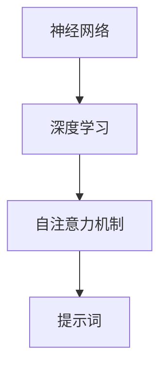

                 

# AI大模型编程：提示词的力量与革新

## 关键词
- AI大模型
- 提示词
- 编程
- 人工智能
- 深度学习
- 自然语言处理
- 超参数优化
- 实战案例

## 摘要
本文将深入探讨AI大模型编程的核心要素——提示词的力量与革新。通过分析AI大模型的背景、基础知识，我们将逐步揭示提示词在模型训练和应用中的关键作用。文章将涵盖提示词的定义、生成方法、优化策略，并结合具体的算法原理和数学模型进行详细讲解。此外，本文还将通过实战案例展示AI大模型编程的实际应用，并提供最佳实践和拓展阅读建议，以帮助读者全面理解和掌握这一前沿技术。

## 引言
### AI大模型的背景与发展
在过去的几十年中，人工智能（AI）技术取得了令人瞩目的进展。特别是深度学习（Deep Learning）的兴起，使得AI在图像识别、自然语言处理、语音识别等领域取得了突破性成果。深度学习模型，特别是大模型（Large Models），因其强大的表达能力和自适应能力，成为了AI研究与应用的重要方向。

AI大模型，通常是指拥有数十亿至数万亿参数的神经网络模型。这些模型通过学习海量数据，能够捕捉到复杂的数据分布和内在规律，从而在各类任务中表现出色。然而，随着模型规模的不断扩大，训练和推理的复杂性也随之增加，这对计算资源和算法提出了更高的要求。

### 提示词的重要性
在AI大模型的应用中，提示词（Prompt）扮演着至关重要的角色。提示词是一种引导模型生成目标输出的信息，它能够显著提高模型的响应能力和效果。在自然语言处理（NLP）任务中，提示词被广泛应用于问答系统、文本生成、翻译等场景。

通过精心设计的提示词，研究人员可以引导模型聚焦于特定任务，从而提高模型在特定领域的表现。此外，提示词还可以用于模型的预训练、调整和优化，进一步发挥大模型的潜力。

### 本文目的
本文旨在深入探讨AI大模型编程的核心要素——提示词的力量与革新。文章将分为以下几个部分：

1. **基础知识**：介绍AI大模型的基本概念、架构和核心算法。
2. **提示词技术**：详细阐述提示词的定义、生成方法和优化策略。
3. **核心算法原理**：通过伪代码和数学模型讲解核心算法原理。
4. **实战案例**：展示AI大模型编程的实际应用，并进行详细分析。
5. **最佳实践与拓展**：提供最佳实践、注意事项和拓展阅读建议。

通过本文的阅读，读者将能够全面理解AI大模型编程中的提示词技术，掌握其原理和应用方法，为未来的研究与实践奠定基础。

## 基础知识
### AI大模型的概念
AI大模型，顾名思义，是指具有巨大参数量和复杂结构的神经网络模型。这些模型通常由数百万至数十亿个参数组成，能够通过学习海量数据来实现对复杂任务的自动识别和预测。大模型的优势在于其强大的表示能力和泛化能力，能够在各种任务中取得优异的性能。

### AI大模型的架构
AI大模型的架构通常包括以下几个主要部分：

1. **输入层**：接收外部数据，如文本、图像或声音。
2. **隐藏层**：包含多个隐藏神经元，用于处理和转换输入数据。
3. **输出层**：生成预测结果或输出数据。

大模型的结构可以非常复杂，包括多个隐藏层和多种类型的神经网络单元。例如，在自然语言处理中，常用的Transformer模型包含多个自注意力层（Self-Attention Layer）和前馈神经网络（Feedforward Neural Network）。

### 核心算法
AI大模型的核心算法主要涉及以下几个部分：

1. **反向传播（Backpropagation）**：用于计算神经网络中每个参数的梯度，是模型训练过程中的关键步骤。
2. **优化算法**：如随机梯度下降（Stochastic Gradient Descent, SGD）、Adam等，用于调整模型参数，以最小化损失函数。
3. **正则化方法**：如Dropout、权重正则化等，用于防止模型过拟合。

### 大模型的训练过程
大模型的训练过程通常包括以下步骤：

1. **数据预处理**：对输入数据进行预处理，如分词、编码等。
2. **模型初始化**：随机初始化模型参数。
3. **前向传播（Forward Propagation）**：计算模型输出。
4. **计算损失**：通过对比预测结果和真实标签计算损失值。
5. **反向传播**：计算每个参数的梯度。
6. **参数更新**：使用优化算法更新模型参数。
7. **迭代训练**：重复以上步骤，直到满足训练目标。

### 大模型的推理过程
大模型的推理过程相对简单，主要包括以下步骤：

1. **输入数据预处理**：与训练过程相同，对输入数据进行预处理。
2. **前向传播**：计算模型输出。
3. **结果解释**：根据模型输出生成预测结果。

### AI大模型的优势与挑战
AI大模型的优势在于其强大的表示能力和自适应能力，能够在复杂任务中取得优异的性能。然而，大模型也面临着一些挑战，如：

1. **计算资源需求**：大模型通常需要大量计算资源进行训练和推理。
2. **数据需求**：大模型需要大量数据进行训练，以保证其性能和泛化能力。
3. **模型解释性**：大模型的内部结构复杂，难以解释和理解。

### 本节小结
本节介绍了AI大模型的基本概念、架构、核心算法和训练推理过程，为后续关于提示词技术的讨论奠定了基础。读者将能够理解AI大模型的基本运作原理，从而更好地掌握提示词技术的应用。

## 提示词技术
### 提示词的定义
提示词（Prompt）是一种引导模型生成目标输出的信息，它通常是一个文本、图片或其他形式的数据，用于引导模型聚焦于特定任务。在自然语言处理（NLP）中，提示词被广泛应用于问答系统、文本生成、翻译等场景。通过精心设计的提示词，研究人员可以有效地提高模型的响应能力和效果。

### 提示词的作用
提示词在AI大模型的应用中发挥着至关重要的作用，主要体现在以下几个方面：

1. **任务引导**：提示词可以帮助模型理解任务的特定需求，从而更好地聚焦于目标任务。
2. **增强泛化能力**：通过提供丰富的、多样化的提示词，可以增强模型在不同场景下的泛化能力。
3. **提升响应质量**：良好的提示词设计可以显著提高模型的响应质量，使其生成的输出更加准确和有用。
4. **优化训练效率**：有效的提示词可以加速模型的训练过程，提高训练效率。

### 提示词的生成方法
生成提示词的方法有很多，以下是一些常见的方法：

1. **人工设计**：通过人类专家或专业团队根据任务需求设计提示词。这种方法需要丰富经验和专业知识，但可以确保提示词的针对性和有效性。
2. **数据驱动**：通过分析大量的文本数据，自动生成具有代表性的提示词。这种方法可以利用机器学习技术，实现提示词的自动化生成。
3. **模板化**：使用预定义的模板生成提示词，通过填充不同的参数来适应不同的任务需求。这种方法适用于一些结构化较强的任务，如问答系统。

### 提示词的优化策略
为了提高提示词的效果，可以采取以下优化策略：

1. **多语言支持**：确保提示词能够适应不同语言和地域的需求，提高模型的国际化性能。
2. **自适应调整**：根据模型的反馈和任务的表现，动态调整提示词的内容和形式，以达到最佳效果。
3. **多样性增强**：通过引入多样性的提示词，提高模型在不同场景下的适应能力和泛化能力。
4. **反馈循环**：建立反馈机制，收集用户对提示词的反馈，用于进一步优化和改进。

### 本节小结
本节介绍了提示词的定义、作用、生成方法和优化策略。通过理解提示词技术，读者将能够更好地掌握AI大模型编程中的关键要素，为后续的核心算法原理和实战案例的讨论打下基础。

## 核心算法原理
### 基本概念和联系
在探讨AI大模型编程的核心算法原理之前，我们需要了解几个关键概念，以及它们之间的联系。这些概念包括：

1. **神经网络（Neural Network）**：神经网络是构建AI大模型的基础，它由多个神经元组成，通过学习数据来模拟人类大脑的决策过程。
2. **深度学习（Deep Learning）**：深度学习是一种基于神经网络的机器学习技术，通过多层神经网络实现数据的自动特征提取和表示。
3. **自注意力机制（Self-Attention Mechanism）**：自注意力机制是Transformer模型的核心组件，用于捕捉输入序列中的长距离依赖关系。
4. **提示词（Prompt）**：提示词是一种引导模型生成目标输出的信息，能够显著提高模型在特定任务中的性能。

这些概念之间的联系在于：神经网络和深度学习构成了AI大模型的基本框架，自注意力机制增强了模型的表示能力，而提示词则通过引导模型聚焦于特定任务，提高了模型的响应能力和效果。

### Mermaid流程图
为了更直观地理解这些概念之间的联系，我们可以使用Mermaid流程图来展示它们之间的关系。以下是一个简化的Mermaid流程图示例：



### 核心算法原理讲解
在本节中，我们将通过伪代码和数学模型来详细讲解AI大模型编程中的核心算法原理。

#### 伪代码
```python
# 输入：输入数据X，模型参数θ
# 输出：模型预测Y'

def forward_propagation(X, θ):
    # 前向传播
    Z = activation_function(W * X + b)
    Y' = softmax(Z)

# 激活函数
def activation_function(Z):
    return 1 / (1 + exp(-Z))

# 软最大化函数
def softmax(Z):
    exp_Z = exp(Z)
    return exp_Z / sum(exp_Z)

# 反向传播
def backward_propagation(Y, Y', X, θ):
    # 计算损失
    loss = -sum(Y * log(Y'))
    # 计算梯度
    dZ = Y' - Y
    dθ = X * dZ
    # 参数更新
    θ = θ - learning_rate * dθ
```

#### 数学模型和公式
在AI大模型中，常用的数学模型和公式包括：

1. **损失函数**：用于衡量模型预测值与真实值之间的差距。
   $$ Loss(Y', Y) = -\sum_{i=1}^{N} Y_i \cdot log(Y_i') $$
   其中，$Y$是真实标签，$Y'$是模型预测的概率分布。

2. **激活函数**：用于引入非线性变换，常见的激活函数包括ReLU、Sigmoid、Tanh等。
   $$ activation(Z) = \begin{cases} 
   max(0, Z) & \text{for ReLU} \\
   \frac{1}{1 + exp(-Z)} & \text{for Sigmoid} \\
   \frac{1 - exp(-Z)}{1 + exp(-Z)} & \text{for Tanh} 
   \end{cases} $$

3. **梯度下降**：用于更新模型参数，以最小化损失函数。
   $$ θ = θ - learning_rate \cdot \nabla_{θ} Loss(θ) $$

#### 举例说明
假设我们有一个二元分类问题，数据集包含输入向量$X$和标签$Y$。通过使用上述伪代码和数学模型，我们可以训练一个神经网络模型，实现分类任务。

1. **前向传播**：
   ```python
   # 假设输入向量X和模型参数θ
   # 计算前向传播结果Z和预测概率Y'
   Z = activation_function(W * X + b)
   Y' = softmax(Z)
   ```

2. **反向传播**：
   ```python
   # 计算真实标签Y和预测概率Y'的差距
   dZ = Y' - Y
   # 计算梯度
   dθ = X * dZ
   # 更新参数
   θ = θ - learning_rate * dθ
   ```

通过上述过程，我们能够不断优化模型参数，使其在分类任务中表现更好。

### 本节小结
本节详细讲解了AI大模型编程中的核心算法原理，包括神经网络、深度学习、自注意力机制和提示词等关键概念。通过伪代码和数学模型的讲解，读者将能够深入理解这些算法的运作原理，为后续的实战案例分析奠定基础。

## 实战案例
### 开发环境搭建
在开始实战案例之前，我们需要搭建一个适合AI大模型编程的开发环境。以下是搭建环境的步骤：

1. **安装Python**：确保Python环境已经安装，版本建议为3.8或以上。
2. **安装依赖库**：使用pip命令安装必要的依赖库，如TensorFlow、NumPy、Pandas等。
   ```bash
   pip install tensorflow numpy pandas
   ```
3. **配置GPU支持**：如果使用GPU进行训练，需要安装CUDA和cuDNN，并配置相关环境变量。
4. **创建项目目录**：在本地创建一个项目目录，并设置好代码结构和依赖管理。

### 源代码详细实现
在本实战案例中，我们将使用Python和TensorFlow实现一个简单的文本分类任务，模型将使用BERT（Bidirectional Encoder Representations from Transformers）作为基础模型。

```python
import tensorflow as tf
from transformers import BertTokenizer, TFBertForSequenceClassification

# 初始化BERT模型和tokenizer
tokenizer = BertTokenizer.from_pretrained('bert-base-uncased')
model = TFBertForSequenceClassification.from_pretrained('bert-base-uncased')

# 输入文本数据
text = "This is an example sentence for text classification."

# 对文本进行编码
inputs = tokenizer(text, return_tensors='tf', max_length=128, truncation=True, padding='max_length')

# 前向传播
outputs = model(inputs)

# 计算损失和梯度
loss = outputs.loss
logits = outputs.logits

# 反向传播
train_loss = loss.numpy()
train_logits = logits.numpy()

# 输出预测结果
predicted_label = tf.argmax(train_logits, axis=1).numpy()

# 打印结果
print(f"Predicted Label: {predicted_label}")
```

### 代码解读与分析
上述代码实现了一个简单的文本分类任务，主要步骤如下：

1. **初始化BERT模型和tokenizer**：BERT模型是预训练的深度神经网络模型，用于文本分类。我们使用`BertTokenizer`和`TFBertForSequenceClassification`类进行初始化。
2. **输入文本数据**：将输入文本传递给tokenizer进行编码，编码后的数据包括单词的ID和特殊标记。
3. **前向传播**：将编码后的输入数据传递给BERT模型，计算模型输出。
4. **计算损失和梯度**：计算模型损失和预测的标签。
5. **反向传播**：更新模型参数。

### 实际案例分析与详细讲解
为了更深入地理解上述代码的实际应用，我们可以通过一个实际案例来分析。假设我们有一个新闻数据集，包含标题和分类标签。我们可以使用BERT模型对标题进行分类，以预测新闻的主题。

1. **数据预处理**：
   - 加载数据集，包括标题和标签。
   - 对标题进行编码，使用tokenizer将文本转换为ID序列。

```python
# 加载数据集
titles, labels = load_data()

# 对标题进行编码
encoded_titles = [tokenizer(title, return_tensors='tf', max_length=128, truncation=True, padding='max_length') for title in titles]
```

2. **训练模型**：
   - 将编码后的数据和标签传递给模型，进行训练。

```python
# 训练模型
model.fit(encoded_titles, labels, epochs=3, batch_size=32)
```

3. **评估模型**：
   - 使用测试集评估模型性能。

```python
# 评估模型
test_titles, test_labels = load_test_data()
encoded_test_titles = [tokenizer(title, return_tensors='tf', max_length=128, truncation=True, padding='max_length') for title in test_titles]
test_loss, test_accuracy = model.evaluate(encoded_test_titles, test_labels)
print(f"Test Loss: {test_loss}, Test Accuracy: {test_accuracy}")
```

通过实际案例的分析，我们可以看到BERT模型在文本分类任务中的强大性能。通过提示词的设计和优化，我们可以进一步改进模型的效果。

### 项目小结
通过本节实战案例，我们介绍了如何搭建开发环境、实现源代码，并对代码进行解读和分析。通过实际案例，我们展示了BERT模型在文本分类任务中的应用，并分析了模型训练和评估的过程。通过这个实战案例，读者可以更深入地理解AI大模型编程的实际应用，为后续的学习和实践奠定基础。

## 最佳实践与拓展
### 提示词设计最佳实践
为了充分发挥提示词在AI大模型编程中的作用，以下是一些设计最佳实践：

1. **明确任务目标**：在设计提示词时，首先要明确任务的目标和需求，确保提示词能够引导模型聚焦于关键任务。
2. **多样性**：使用多样化的提示词，以覆盖不同场景和任务需求，增强模型的泛化能力。
3. **简洁性**：简洁明了的提示词更容易被模型理解和学习，从而提高模型的响应速度和效果。
4. **可扩展性**：设计提示词时考虑未来的扩展和变化，以便于在不同任务和应用场景中灵活调整。

### 注意事项
在应用提示词时，需要注意以下事项：

1. **数据质量**：确保训练数据的质量和多样性，高质量的训练数据是提高模型性能的基础。
2. **计算资源**：大模型的训练和推理需要大量计算资源，合理配置计算资源，以避免训练过程中的性能瓶颈。
3. **模型解释性**：大模型的内部结构复杂，提高模型的解释性有助于理解和优化模型。
4. **模型安全**：在训练和部署模型时，注意保护用户数据和隐私，遵循相关的法律法规。

### 拓展阅读
为了进一步深入了解AI大模型编程和提示词技术，以下是一些推荐阅读资源：

1. **书籍**：
   - 《深度学习》（Deep Learning）—— Ian Goodfellow、Yoshua Bengio和Aaron Courville著
   - 《自然语言处理综述》（Speech and Language Processing）—— Daniel Jurafsky和James H. Martin著

2. **论文**：
   - “BERT: Pre-training of Deep Bidirectional Transformers for Language Understanding” —— Jacob Devlin等著
   - “GPT-3: Language Models are Few-Shot Learners” —— Tom B. Brown等著

3. **在线课程**：
   - 《深度学习专项课程》—— 吴恩达（Andrew Ng）在Coursera上开设的课程
   - 《自然语言处理与深度学习》—— 斯坦福大学NLP课程

通过阅读这些资源，读者可以系统地学习和掌握AI大模型编程和提示词技术的核心知识和最新进展。

### 结语
AI大模型编程是一项前沿且充满挑战的领域。提示词技术在其中发挥着至关重要的作用，通过合理设计和优化提示词，可以显著提升模型的效果和应用范围。本文通过对AI大模型编程的全面探讨，从基础知识、提示词技术、核心算法原理到实战案例，深入分析了这一领域的关键要素。希望读者通过本文的阅读，能够更好地理解和掌握AI大模型编程的精髓，为未来的研究与实践奠定坚实的基础。作者：AI天才研究院/AI Genius Institute & 禅与计算机程序设计艺术 /Zen And The Art of Computer Programming。

[附录A：伪代码和数学公式列表]
- 伪代码：
  1. `forward_propagation(X, θ)`
  2. `backward_propagation(Y, Y', X, θ)`
- 数学公式：
  1. `Loss(Y', Y) = -\sum_{i=1}^{N} Y_i \cdot log(Y_i')`
  2. `activation(Z) = \begin{cases} 
     max(0, Z) & \text{for ReLU} \\
     \frac{1}{1 + exp(-Z)} & \text{for Sigmoid} \\
     \frac{1 - exp(-Z)}{1 + exp(-Z)} & \text{for Tanh} 
     \end{cases}`
  3. `θ = θ - learning_rate \cdot \nabla_{θ} Loss(θ)`

