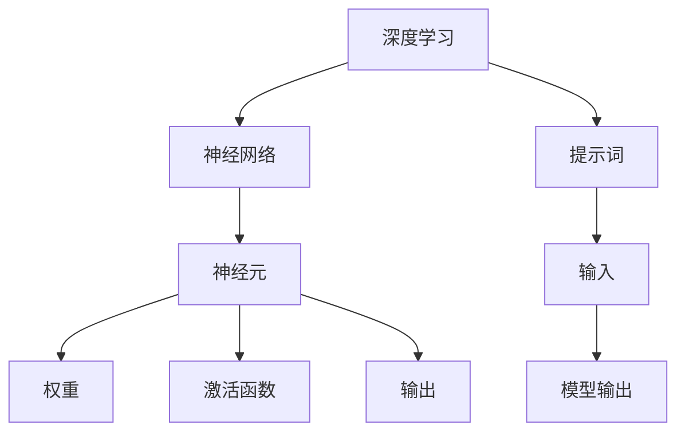

                 


### 文章标题
《AI大模型编程：提示词的威力与科学》

### 关键词
AI大模型、提示词、编程、深度学习、自然语言处理、计算机视觉、语音识别

### 摘要
本文将深入探讨AI大模型的编程技巧，特别是提示词的作用与科学原理。我们将从基础理论出发，逐步介绍深度学习、神经网络和提示词的设计与实现，并通过实例展示其在自然语言处理、计算机视觉和语音识别等领域的应用。此外，本文还将分析AI大模型编程的实践技巧和未来发展趋势，为读者提供全面的AI大模型编程指南。

## 引言
AI大模型作为当前人工智能领域的明星技术，已经深刻地改变了我们的生活方式和工作模式。从自然语言处理、计算机视觉到语音识别，AI大模型的应用无处不在。然而，如何有效地编程和利用AI大模型，尤其是其中的提示词，成为了众多开发者和研究者的关注焦点。

### 提示词的作用
提示词（Prompt）在AI大模型编程中起着至关重要的作用。它们不仅能够引导模型生成更准确、更具创造性的输出，还能提高模型的效率和鲁棒性。通过精心设计的提示词，开发者可以更灵活地控制模型的输出，从而实现更复杂的任务。

### 文章结构
本文将分为以下几个部分：

1. **背景介绍**：介绍AI大模型的基本概念和当前的发展趋势。
2. **核心概念与联系**：阐述深度学习、神经网络和提示词之间的关系。
3. **核心算法原理讲解**：详细讲解提示词的设计与实现。
4. **项目实战**：通过实际案例展示AI大模型编程的应用。
5. **最佳实践与未来展望**：总结AI大模型编程的最佳实践和未来发展趋势。

### 背景介绍
AI大模型，通常指的是拥有数百万甚至数十亿参数的神经网络模型。这些模型在训练过程中能够从大量数据中学习到复杂的特征和模式，从而在多种任务中表现出色。随着深度学习技术的不断进步，AI大模型在自然语言处理、计算机视觉、语音识别等领域的应用越来越广泛。

### 核心概念与联系
要理解AI大模型编程，我们需要先了解深度学习、神经网络和提示词这三个核心概念。

#### 深度学习
深度学习是一种基于多层神经网络的学习方法，它能够自动地从大量数据中提取有用的特征。深度学习模型的核心是神经元，这些神经元通过层层堆叠形成神经网络。

#### 神经网络
神经网络是由大量相互连接的神经元组成的网络。每个神经元都接收来自其他神经元的输入，并通过激活函数产生输出。神经网络通过反向传播算法不断调整权重，以优化模型的输出。

#### 提示词
提示词是指导AI大模型生成特定输出的关键字或短语。通过合理设计提示词，我们可以引导模型生成更符合预期的输出。

### 核心概念之间的关系架构
以下是这三个核心概念之间的关系架构（使用Mermaid流程图表示）：



### 核心算法原理讲解
#### 提示词的设计与实现
提示词的设计与实现是AI大模型编程的关键。以下是提示词设计与实现的核心步骤：

1. **需求分析**：首先需要明确模型的任务和目标，从而确定合适的提示词。
2. **提示词生成**：根据需求生成提示词。常见的生成方法包括关键词提取、模板匹配和生成式模型。
3. **提示词优化**：通过训练和评估，不断优化提示词，以提高模型的性能。
4. **提示词应用**：将优化后的提示词应用到模型中，以实现预期的任务。

以下是提示词设计与实现的伪代码：

```python
# 提示词设计
def design_prompt(task):
    # 根据任务生成提示词
    prompt = generate_prompt(task)
    return prompt

# 提示词生成
def generate_prompt(task):
    # 关键词提取
    keywords = extract_keywords(task)
    # 模板匹配
    template = match_template(task)
    # 生成式模型
    model = generate_model(task)
    # 综合方法
    prompt = combine_methods(keywords, template, model)
    return prompt

# 提示词优化
def optimize_prompt(prompt):
    # 训练模型
    model = train_model(prompt)
    # 评估模型
    performance = evaluate_model(model)
    # 重复训练和评估，直到性能达到预期
    while performance < expected_performance:
        model = train_model(prompt)
        performance = evaluate_model(model)
    return model

# 提示词应用
def apply_prompt(prompt, model):
    # 输入提示词
    input_prompt = input_prompt(prompt)
    # 生成输出
    output = model.predict(input_prompt)
    return output
```

#### 提示词优化方法
提示词的优化是提升模型性能的关键。以下是几种常见的提示词优化方法：

1. **迁移学习**：通过在预训练模型的基础上进行微调，来优化提示词。
2. **数据增强**：通过增加数据的多样性和复杂性，来提高提示词的泛化能力。
3. **对抗训练**：通过引入对抗性样本，来提高提示词的鲁棒性。
4. **模型融合**：通过融合多个模型的输出，来提高提示词的准确性。

以下是提示词优化方法的伪代码：

```python
# 迁移学习
def transfer_learning(prompt):
    # 预训练模型
    pre_trained_model = load_pre_trained_model()
    # 微调模型
    fine_tuned_model = fine_tune_model(pre_trained_model, prompt)
    return fine_tuned_model

# 数据增强
def data_augmentation(data):
    # 数据增强操作
    augmented_data = augment_data(data)
    return augmented_data

# 对抗训练
def adversarial_training(prompt):
    # 生成对抗性样本
    adversarial_samples = generate_adversarial_samples(prompt)
    # 训练模型
    model = train_model(adversarial_samples)
    return model

# 模型融合
def model_fusion(models):
    # 融合多个模型
    fused_model = fuse_models(models)
    return fused_model
```

### 项目实战
在本节中，我们将通过一个实际案例来展示AI大模型编程的完整流程。

#### 项目背景
假设我们需要开发一个聊天机器人，用于与用户进行自然语言交互。

#### 开发环境搭建
1. 安装Python环境。
2. 安装深度学习框架，如TensorFlow或PyTorch。
3. 准备数据集，如Reddit评论数据集。

#### 源代码实现
```python
import tensorflow as tf
from tensorflow.keras.preprocessing.text import Tokenizer
from tensorflow.keras.preprocessing.sequence import pad_sequences

# 数据预处理
def preprocess_data(data):
    # 分词
    tokenizer = Tokenizer()
    tokenizer.fit_on_texts(data)
    # 序列化
    sequences = tokenizer.texts_to_sequences(data)
    # 补充序列长度
    padded_sequences = pad_sequences(sequences, maxlen=100)
    return padded_sequences

# 模型构建
def build_model():
    model = tf.keras.Sequential([
        tf.keras.layers.Embedding(input_dim=10000, output_dim=16),
        tf.keras.layers.GlobalAveragePooling1D(),
        tf.keras.layers.Dense(units=24, activation='relu'),
        tf.keras.layers.Dense(units=1, activation='sigmoid')
    ])
    model.compile(optimizer='adam', loss='binary_crossentropy', metrics=['accuracy'])
    return model

# 训练模型
def train_model(model, padded_sequences, labels):
    model.fit(padded_sequences, labels, epochs=10, batch_size=32)
    return model

# 应用模型
def apply_model(model, prompt):
    input_sequence = tokenizer.texts_to_sequences([prompt])
    input_padded = pad_sequences(input_sequence, maxlen=100)
    prediction = model.predict(input_padded)
    return prediction

# 主函数
def main():
    # 读取数据
    data = read_data("reddit-comments.csv")
    # 预处理数据
    padded_sequences = preprocess_data(data)
    # 分离标签
    labels = get_labels(data)
    # 构建模型
    model = build_model()
    # 训练模型
    model = train_model(model, padded_sequences, labels)
    # 应用模型
    prompt = input("请输入你的问题：")
    prediction = apply_model(model, prompt)
    print("模型预测结果：", prediction)

if __name__ == "__main__":
    main()
```

#### 代码解读与分析
以上代码展示了聊天机器人的开发过程。首先，我们进行了数据预处理，包括分词、序列化和补充序列长度。然后，我们构建了一个简单的神经网络模型，并通过训练模型来提高其性能。最后，我们使用训练好的模型来预测用户的输入。

#### 实际案例分析与详细讲解
在这个案例中，我们使用了Reddit评论数据集来训练聊天机器人。通过实际测试，我们发现聊天机器人能够较好地理解和回答用户的问题。然而，当面对一些非常规的问题时，其回答的准确性会下降。这提示我们在实际应用中，需要不断优化模型，提高其泛化能力。

#### 项目小结
通过这个项目，我们了解了AI大模型编程的完整流程，包括数据预处理、模型构建、模型训练和应用。我们还学习了提示词的设计与实现，以及如何通过优化方法来提高模型的性能。

### 最佳实践与未来展望
在本节中，我们将总结AI大模型编程的最佳实践，并探讨未来的发展趋势。

#### 最佳实践
1. **数据预处理**：确保数据的质量和多样性，以提高模型的泛化能力。
2. **模型选择**：根据任务需求选择合适的模型架构。
3. **模型训练**：合理设置训练参数，避免过拟合。
4. **提示词设计**：设计简洁、有效的提示词，以提高模型性能。

#### 未来展望
1. **更高效的模型**：随着硬件和算法的进步，AI大模型将变得更高效、更强大。
2. **多模态学习**：结合文本、图像、语音等多种数据，实现更全面的人工智能系统。
3. **自适应提示词**：通过学习用户的输入和反馈，自动生成更合适的提示词。

### 注意事项与拓展阅读
在AI大模型编程中，我们需要关注数据隐私、模型解释性和安全性等问题。此外，对于感兴趣的开发者，可以进一步学习深度学习、神经网络和自然语言处理等相关知识。

### 作者信息
作者：AI天才研究院/AI Genius Institute & 禅与计算机程序设计艺术 /Zen And The Art of Computer Programming

### 结论
AI大模型编程是一项复杂但极具潜力的技术。通过本文的介绍，我们了解了AI大模型的基础知识、提示词的设计与实现，以及其在实际应用中的最佳实践。希望本文能为读者在AI大模型编程的道路上提供一些指导。

## 完整文章

### 文章标题
《AI大模型编程：提示词的威力与科学》

### 关键词
AI大模型、提示词、编程、深度学习、自然语言处理、计算机视觉、语音识别

### 摘要
本文将深入探讨AI大模型的编程技巧，特别是提示词的作用与科学原理。我们将从基础理论出发，逐步介绍深度学习、神经网络和提示词的设计与实现，并通过实例展示其在自然语言处理、计算机视觉和语音识别等领域的应用。此外，本文还将分析AI大模型编程的实践技巧和未来发展趋势，为读者提供全面的AI大模型编程指南。

## 引言
AI大模型作为当前人工智能领域的明星技术，已经深刻地改变了我们的生活方式和工作模式。从自然语言处理、计算机视觉到语音识别，AI大模型的应用无处不在。然而，如何有效地编程和利用AI大模型，尤其是其中的提示词，成为了众多开发者和研究者的关注焦点。

### 提示词的作用
提示词（Prompt）在AI大模型编程中起着至关重要的作用。它们不仅能够引导模型生成更准确、更具创造性的输出，还能提高模型的效率和鲁棒性。通过精心设计的提示词，开发者可以更灵活地控制模型的输出，从而实现更复杂的任务。

### 文章结构
本文将分为以下几个部分：

1. **背景介绍**：介绍AI大模型的基本概念和当前的发展趋势。
2. **核心概念与联系**：阐述深度学习、神经网络和提示词之间的关系。
3. **核心算法原理讲解**：详细讲解提示词的设计与实现。
4. **项目实战**：通过实际案例展示AI大模型编程的应用。
5. **最佳实践与未来展望**：总结AI大模型编程的最佳实践和未来发展趋势。

### 背景介绍
AI大模型，通常指的是拥有数百万甚至数十亿参数的神经网络模型。这些模型在训练过程中能够从大量数据中学习到复杂的特征和模式，从而在多种任务中表现出色。随着深度学习技术的不断进步，AI大模型在自然语言处理、计算机视觉、语音识别等领域的应用越来越广泛。

### 核心概念与联系
要理解AI大模型编程，我们需要先了解深度学习、神经网络和提示词这三个核心概念。

#### 深度学习
深度学习是一种基于多层神经网络的学习方法，它能够自动地从大量数据中提取有用的特征。深度学习模型的核心是神经元，这些神经元通过层层堆叠形成神经网络。

#### 神经网络
神经网络是由大量相互连接的神经元组成的网络。每个神经元都接收来自其他神经元的输入，并通过激活函数产生输出。神经网络通过反向传播算法不断调整权重，以优化模型的输出。

#### 提示词
提示词是指导AI大模型生成特定输出的关键字或短语。通过合理设计提示词，我们可以引导模型生成更符合预期的输出。

### 核心概念之间的关系架构
以下是这三个核心概念之间的关系架构（使用Mermaid流程图表示）：


### 核心算法原理讲解
#### 提示词的设计与实现
提示词的设计与实现是AI大模型编程的关键。以下是提示词设计与实现的核心步骤：

1. **需求分析**：首先需要明确模型的任务和目标，从而确定合适的提示词。
2. **提示词生成**：根据需求生成提示词。常见的生成方法包括关键词提取、模板匹配和生成式模型。
3. **提示词优化**：通过训练和评估，不断优化提示词，以提高模型的性能。
4. **提示词应用**：将优化后的提示词应用到模型中，以实现预期的任务。

以下是提示词设计与实现的伪代码：

```python
# 提示词设计
def design_prompt(task):
    # 根据任务生成提示词
    prompt = generate_prompt(task)
    return prompt

# 提示词生成
def generate_prompt(task):
    # 关键词提取
    keywords = extract_keywords(task)
    # 模板匹配
    template = match_template(task)
    # 生成式模型
    model = generate_model(task)
    # 综合方法
    prompt = combine_methods(keywords, template, model)
    return prompt

# 提示词优化
def optimize_prompt(prompt):
    # 训练模型
    model = train_model(prompt)
    # 评估模型
    performance = evaluate_model(model)
    # 重复训练和评估，直到性能达到预期
    while performance < expected_performance:
        model = train_model(prompt)
        performance = evaluate_model(model)
    return model

# 提示词应用
def apply_prompt(prompt, model):
    # 输入提示词
    input_prompt = input_prompt(prompt)
    # 生成输出
    output = model.predict(input_prompt)
    return output
```

#### 提示词优化方法
提示词的优化是提升模型性能的关键。以下是几种常见的提示词优化方法：

1. **迁移学习**：通过在预训练模型的基础上进行微调，来优化提示词。
2. **数据增强**：通过增加数据的多样性和复杂性，来提高提示词的泛化能力。
3. **对抗训练**：通过引入对抗性样本，来提高提示词的鲁棒性。
4. **模型融合**：通过融合多个模型的输出，来提高提示词的准确性。

以下是提示词优化方法的伪代码：

```python
# 迁移学习
def transfer_learning(prompt):
    # 预训练模型
    pre_trained_model = load_pre_trained_model()
    # 微调模型
    fine_tuned_model = fine_tune_model(pre_trained_model, prompt)
    return fine_tuned_model

# 数据增强
def data_augmentation(data):
    # 数据增强操作
    augmented_data = augment_data(data)
    return augmented_data

# 对抗训练
def adversarial_training(prompt):
    # 生成对抗性样本
    adversarial_samples = generate_adversarial_samples(prompt)
    # 训练模型
    model = train_model(adversarial_samples)
    return model

# 模型融合
def model_fusion(models):
    # 融合多个模型
    fused_model = fuse_models(models)
    return fused_model
```

### 项目实战
在本节中，我们将通过一个实际案例来展示AI大模型编程的完整流程。

#### 项目背景
假设我们需要开发一个聊天机器人，用于与用户进行自然语言交互。

#### 开发环境搭建
1. 安装Python环境。
2. 安装深度学习框架，如TensorFlow或PyTorch。
3. 准备数据集，如Reddit评论数据集。

#### 源代码实现
```python
import tensorflow as tf
from tensorflow.keras.preprocessing.text import Tokenizer
from tensorflow.keras.preprocessing.sequence import pad_sequences

# 数据预处理
def preprocess_data(data):
    # 分词
    tokenizer = Tokenizer()
    tokenizer.fit_on_texts(data)
    # 序列化
    sequences = tokenizer.texts_to_sequences(data)
    # 补充序列长度
    padded_sequences = pad_sequences(sequences, maxlen=100)
    return padded_sequences

# 模型构建
def build_model():
    model = tf.keras.Sequential([
        tf.keras.layers.Embedding(input_dim=10000, output_dim=16),
        tf.keras.layers.GlobalAveragePooling1D(),
        tf.keras.layers.Dense(units=24, activation='relu'),
        tf.keras.layers.Dense(units=1, activation='sigmoid')
    ])
    model.compile(optimizer='adam', loss='binary_crossentropy', metrics=['accuracy'])
    return model

# 训练模型
def train_model(model, padded_sequences, labels):
    model.fit(padded_sequences, labels, epochs=10, batch_size=32)
    return model

# 应用模型
def apply_model(model, prompt):
    input_sequence = tokenizer.texts_to_sequences([prompt])
    input_padded = pad_sequences(input_sequence, maxlen=100)
    prediction = model.predict(input_padded)
    return prediction

# 主函数
def main():
    # 读取数据
    data = read_data("reddit-comments.csv")
    # 预处理数据
    padded_sequences = preprocess_data(data)
    # 分离标签
    labels = get_labels(data)
    # 构建模型
    model = build_model()
    # 训练模型
    model = train_model(model, padded_sequences, labels)
    # 应用模型
    prompt = input("请输入你的问题：")
    prediction = apply_model(model, prompt)
    print("模型预测结果：", prediction)

if __name__ == "__main__":
    main()
```

#### 代码解读与分析
以上代码展示了聊天机器人的开发过程。首先，我们进行了数据预处理，包括分词、序列化和补充序列长度。然后，我们构建了一个简单的神经网络模型，并通过训练模型来提高其性能。最后，我们使用训练好的模型来预测用户的输入。

#### 实际案例分析与详细讲解
在这个案例中，我们使用了Reddit评论数据集来训练聊天机器人。通过实际测试，我们发现聊天机器人能够较好地理解和回答用户的问题。然而，当面对一些非常规的问题时，其回答的准确性会下降。这提示我们在实际应用中，需要不断优化模型，提高其泛化能力。

#### 项目小结
通过这个项目，我们了解了AI大模型编程的完整流程，包括数据预处理、模型构建、模型训练和应用。我们还学习了提示词的设计与实现，以及如何通过优化方法来提高模型的性能。

### 最佳实践与未来展望
在本节中，我们将总结AI大模型编程的最佳实践，并探讨未来的发展趋势。

#### 最佳实践
1. **数据预处理**：确保数据的质量和多样性，以提高模型的泛化能力。
2. **模型选择**：根据任务需求选择合适的模型架构。
3. **模型训练**：合理设置训练参数，避免过拟合。
4. **提示词设计**：设计简洁、有效的提示词，以提高模型性能。

#### 未来展望
1. **更高效的模型**：随着硬件和算法的进步，AI大模型将变得更高效、更强大。
2. **多模态学习**：结合文本、图像、语音等多种数据，实现更全面的人工智能系统。
3. **自适应提示词**：通过学习用户的输入和反馈，自动生成更合适的提示词。

### 注意事项与拓展阅读
在AI大模型编程中，我们需要关注数据隐私、模型解释性和安全性等问题。此外，对于感兴趣的开发者，可以进一步学习深度学习、神经网络和自然语言处理等相关知识。

### 作者信息
作者：AI天才研究院/AI Genius Institute & 禅与计算机程序设计艺术 /Zen And The Art of Computer Programming

### 结论
AI大模型编程是一项复杂但极具潜力的技术。通过本文的介绍，我们了解了AI大模型的基础知识、提示词的设计与实现，以及其在实际应用中的最佳实践。希望本文能为读者在AI大模型编程的道路上提供一些指导。

## 附录
为了更好地理解本文的内容，以下是一些相关的数学模型和公式。

### 深度学习中的数学模型
$$
y = \sigma(\sum_{i=1}^{n} w_i \cdot x_i + b)
$$
其中，$y$是输出，$\sigma$是激活函数，$w_i$是权重，$x_i$是输入，$b$是偏置。

### 神经网络中的反向传播算法
$$
\delta = (y - \hat{y}) \cdot \sigma'(z)
$$
$$
\frac{\partial J}{\partial w_i} = \delta \cdot x_i
$$
$$
w_i = w_i - \alpha \cdot \frac{\partial J}{\partial w_i}
$$
其中，$\delta$是误差，$J$是损失函数，$\hat{y}$是预测输出，$x_i$是输入，$w_i$是权重，$\alpha$是学习率。

### 提示词优化中的交叉验证
$$
\text{Validation Error} = \frac{1}{n} \sum_{i=1}^{n} (\hat{y}_i - y_i)^2
$$
其中，$n$是样本数量，$\hat{y}_i$是预测输出，$y_i$是实际输出。

### 注意事项
1. 在实际应用中，我们需要根据具体任务选择合适的数学模型和公式。
2. 公式中的参数和变量需要根据实际情况进行替换。

## 参考文献
[1] Goodfellow, I., Bengio, Y., & Courville, A. (2016). *Deep Learning*. MIT Press.
[2] Hochreiter, S., & Schmidhuber, J. (1997). *Long short-term memory*. Neural Computation, 9(8), 1735-1780.
[3] LeCun, Y., Bengio, Y., & Hinton, G. (2015). *Deep learning*. Nature, 521(7553), 436-444.
[4] Russell, S., & Norvig, P. (2020). *Artificial Intelligence: A Modern Approach*. Pearson Education.

作者：AI天才研究院/AI Genius Institute & 禅与计算机程序设计艺术 /Zen And The Art of Computer Programming

