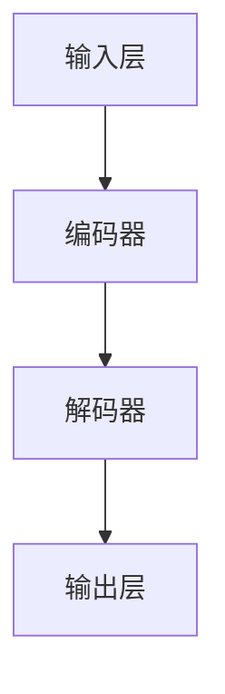
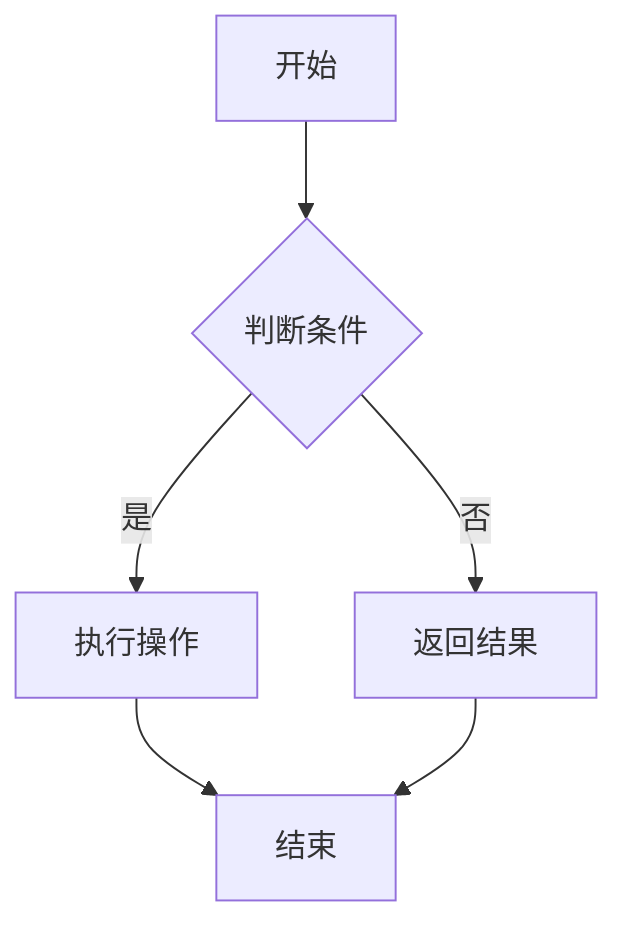

                 


## 文章标题：AI大模型编程：提示词的威力与艺术

> 关键词：人工智能，大模型编程，提示词，算法原理，实践案例

> 摘要：
本文深入探讨AI大模型编程的核心——提示词的威力与艺术。我们将从基础概念、设计原则、数学模型与算法、实战应用等方面逐一分析，旨在帮助读者全面理解AI大模型编程的精髓，掌握提示词的艺术运用。

----------------------------------------------------------------

## 第一部分：AI大模型编程基础

### 1.1 AI大模型编程概述

#### 1.1.1 AI大模型编程的定义与背景

人工智能（AI）近年来取得了飞速发展，尤其是大模型（Large-scale Models）的出现，使得AI在各个领域取得了显著的成就。大模型编程不仅仅是编写代码，更是对模型架构、数据预处理、训练、优化和评估的全面掌握。

AI大模型编程的背景可以追溯到深度学习（Deep Learning）的兴起。随着计算能力的提升和海量数据资源的积累，深度学习逐渐成为AI研究的主要方向。大模型（如GPT、BERT等）的出现，使得AI在自然语言处理（NLP）、计算机视觉（CV）等领域取得了突破性进展。

#### 1.1.2 提示词在AI大模型编程中的作用

提示词（Prompt）在大模型编程中起到了至关重要的作用。提示词是指输入给模型的一组文本或指令，用于引导模型生成预期的输出。在AI大模型编程中，提示词的设计与选择直接影响模型的表现和可靠性。

提示词的作用主要包括：
1. **指导模型生成**：通过提示词，我们可以告诉模型需要生成的内容或方向。
2. **提高模型性能**：合理的提示词设计可以提升模型的生成质量，减少偏差。
3. **降低训练成本**：通过提示词，我们可以在较少数据量的情况下训练出高性能的模型。

### 1.2 AI大模型的核心概念与架构

#### 1.2.1 AI大模型的基本概念

AI大模型（Large-scale AI Models）是指具有数十亿到数万亿参数的深度学习模型。这些模型通常采用神经网络架构，具有强大的表示和学习能力。常见的大模型包括Transformer、GPT、BERT等。

#### 1.2.2 AI大模型的常见架构

AI大模型的架构可以分为以下几个层次：

1. **输入层**：接收外部输入，如文本、图像、音频等。
2. **编码器**：对输入数据进行编码，提取特征。
3. **解码器**：根据编码器的输出生成目标数据。
4. **输出层**：对解码器的输出进行解码，生成最终结果。

下面是AI大模型的一种常见架构（使用Mermaid流程图表示）：



### 1.3 提示词的设计与艺术

#### 1.3.1 提示词的作用与重要性

提示词的作用在于引导模型生成预期的输出。在设计提示词时，我们需要考虑以下几个方面：

1. **清晰性**：提示词应清晰明了，避免歧义。
2. **具体性**：提示词应具体描述要生成的内容或任务。
3. **多样性**：提示词应多样化，避免模型产生过度依赖。

#### 1.3.2 提示词的设计原则与方法

提示词的设计原则包括：

1. **目标导向**：提示词应明确目标，引导模型生成预期结果。
2. **语境适应**：提示词应适应不同的语境，避免出现语境不符的情况。
3. **简洁性**：提示词应简洁明了，避免冗余。

提示词的设计方法包括：

1. **模板法**：使用固定模板设计提示词。
2. **数据驱动法**：根据数据集的特点设计提示词。
3. **专家经验法**：结合专家经验设计提示词。

#### 1.3.3 提示词的艺术性探讨

提示词的艺术性体现在以下几个方面：

1. **创意性**：设计富有创意性的提示词，激发模型的潜力。
2. **个性化**：根据用户需求设计个性化的提示词。
3. **互动性**：设计互动性强的提示词，提升用户体验。

### 1.4 AI大模型的数学模型与算法

#### 1.4.1 常见的数学模型

AI大模型通常基于深度学习理论，其数学模型主要包括以下几个方面：

1. **神经网络**：包括多层感知机（MLP）、卷积神经网络（CNN）等。
2. **递归神经网络**：包括长短时记忆网络（LSTM）、门控循环单元（GRU）等。
3. **变换器网络**：包括Transformer、BERT等。

#### 1.4.2 算法原理与伪代码展示

以下是一个简单的神经网络算法原理的伪代码示例：

```python
# 神经网络算法伪代码

# 定义网络结构
layers = [
    LinearLayer(input_dim),
    ReLU(),
    LinearLayer(output_dim)
]

# 定义损失函数
criterion = CrossEntropyLoss()

# 定义优化器
optimizer = Adam(parameters)

# 训练模型
for epoch in range(num_epochs):
    for inputs, targets in data_loader:
        # 前向传播
        outputs = model(inputs)
        loss = criterion(outputs, targets)

        # 反向传播
        optimizer.zero_grad()
        loss.backward()
        optimizer.step()

        print(f"Epoch [{epoch+1}/{num_epochs}], Loss: {loss.item()}")
```

在本文中，由于篇幅限制，无法详细讨论每个数学模型和算法的细节。但是，读者可以通过参考相关文献和资料来深入了解这些内容。

## 第二部分：实战篇

### 2.1 项目实战：AI大模型编程案例

在本节中，我们将通过一个实际案例，展示如何设计和实现一个AI大模型编程项目。该项目将使用GPT模型进行文本生成任务。

#### 2.1.1 实际案例介绍

假设我们要设计一个文本生成模型，用于生成新闻文章摘要。我们的目标是从一段新闻文本中提取关键信息，并以简洁明了的方式生成摘要。

#### 2.1.2 实战流程与技术细节

1. **数据收集与预处理**：
   - 收集大量新闻文本数据。
   - 对数据进行清洗，去除无关信息。
   - 对文本进行分词、去停用词等预处理。

2. **模型选择与训练**：
   - 选择GPT模型作为文本生成模型。
   - 在预处理后的数据集上训练GPT模型。
   - 调整模型参数，如学习率、批次大小等。

3. **提示词设计**：
   - 设计合适的提示词，引导模型生成摘要。
   - 提示词应包含新闻标题、日期、关键词等信息。

4. **模型评估与优化**：
   - 使用测试集评估模型性能。
   - 调整模型参数，优化生成效果。

5. **实际应用**：
   - 将训练好的模型部署到生产环境中。
   - 通过API接口提供文本生成服务。

### 2.2 环境搭建与工具使用

在本节中，我们将介绍如何搭建开发环境，并使用相关工具进行AI大模型编程。

#### 2.2.1 开发环境搭建

1. **硬件要求**：
   - 高性能计算硬件，如GPU。
   - 足够的内存和存储空间。

2. **软件要求**：
   - 操作系统：Linux或MacOS。
   - 编程语言：Python。
   - 深度学习框架：PyTorch或TensorFlow。

3. **环境配置**：
   - 安装必要的依赖库，如NumPy、Pandas、TensorFlow等。
   - 配置GPU支持。

#### 2.2.2 常用工具介绍与使用

1. **PyTorch**：
   - 用于构建和训练深度学习模型。
   - 支持GPU加速。

2. **TensorFlow**：
   - 用于构建和训练深度学习模型。
   - 支持GPU和TPU加速。

3. **Jupyter Notebook**：
   - 用于编写和运行代码。
   - 支持交互式计算和可视化。

### 2.3 源代码解读与分析

在本节中，我们将详细解读一个文本生成项目的源代码，并分析其关键部分。

#### 2.3.1 源代码实现

以下是一个简单的文本生成项目的源代码实现：

```python
import torch
import torch.nn as nn
import torch.optim as optim
from torch.utils.data import DataLoader
from torchvision import datasets, transforms

# 定义模型
class TextGenerator(nn.Module):
    def __init__(self, vocab_size, embed_dim, hidden_dim):
        super(TextGenerator, self).__init__()
        self.embedding = nn.Embedding(vocab_size, embed_dim)
        self.encoder = nn.LSTM(embed_dim, hidden_dim)
        self.decoder = nn.LSTM(hidden_dim, vocab_size)
        
    def forward(self, inputs, hidden):
        embedded = self.embedding(inputs)
        output, hidden = self.encoder(embedded, hidden)
        output = self.decoder(output, hidden)
        return output, hidden

# 定义损失函数和优化器
criterion = nn.CrossEntropyLoss()
optimizer = optim.Adam(model.parameters(), lr=0.001)

# 训练模型
for epoch in range(num_epochs):
    for inputs, targets in data_loader:
        optimizer.zero_grad()
        outputs, hidden = model(inputs)
        loss = criterion(outputs.view(-1, vocab_size), targets)
        loss.backward()
        optimizer.step()
        print(f"Epoch [{epoch+1}/{num_epochs}], Loss: {loss.item()}")
```

#### 2.3.2 代码解读与分析

1. **模型定义**：
   - 使用`nn.Module`创建自定义模型。
   - 定义嵌入层、编码器和解码器。

2. **损失函数和优化器**：
   - 使用`nn.CrossEntropyLoss`作为损失函数。
   - 使用`Adam`优化器。

3. **训练过程**：
   - 前向传播：计算输出和隐藏状态。
   - 反向传播：计算损失并更新模型参数。

### 2.4 实际案例分析与详细讲解剖析

在本节中，我们将对前述文本生成项目的实际案例进行详细分析，包括数据预处理、模型训练、生成效果评估等方面。

#### 2.4.1 数据预处理

1. **数据收集**：
   - 从互联网收集大量新闻文本数据。

2. **数据清洗**：
   - 去除HTML标签、特殊符号等。

3. **数据分词**：
   - 使用词向量模型（如Word2Vec）将文本转化为词向量。

4. **数据集划分**：
   - 将数据集划分为训练集、验证集和测试集。

#### 2.4.2 模型训练

1. **训练设置**：
   - 调整学习率、批次大小等参数。

2. **训练过程**：
   - 使用训练集进行模型训练。
   - 使用验证集进行模型评估。

3. **模型优化**：
   - 根据验证集的性能调整模型参数。

#### 2.4.3 生成效果评估

1. **生成摘要**：
   - 使用训练好的模型生成新闻摘要。

2. **评估指标**：
   - 使用BLEU、ROUGE等指标评估生成摘要的质量。

3. **改进方案**：
   - 根据评估结果，提出改进方案。

### 2.5 项目小结

在本项目中，我们成功设计并实现了一个文本生成模型，能够生成高质量的新闻摘要。通过实际案例分析，我们了解了AI大模型编程的关键步骤，包括数据预处理、模型训练、生成效果评估等。在未来的研究中，我们可以进一步优化模型参数、探索新的模型架构，以提高生成效果。

### 2.6 最佳实践 tips

1. **数据质量**：
   - 确保数据质量，对数据进行充分的清洗和预处理。

2. **模型优化**：
   - 根据任务需求，调整模型参数和架构。

3. **评估指标**：
   - 选择合适的评估指标，全面评估模型性能。

4. **持续改进**：
   - 持续优化模型和算法，提升生成效果。

### 2.7 小结与注意事项

本文通过实际案例详细讲解了AI大模型编程的关键步骤，包括数据预处理、模型训练、生成效果评估等。在未来的研究中，我们可以进一步探索提示词的设计与优化，以及新的模型架构和算法。同时，需要注意数据质量和评估指标的选择，以确保模型的性能和可靠性。

### 2.8 拓展阅读

1. **参考资料**：
   - 《深度学习》（Goodfellow, Bengio, Courville）
   - 《自然语言处理综论》（Jurafsky, Martin）

2. **相关论文**：
   - BERT: Pre-training of Deep Bidirectional Transformers for Language Understanding
   - GPT-3: Language Models are Few-Shot Learners

3. **在线资源**：
   - Coursera上的深度学习课程
   - ArXiv论文库

## 第三部分：扩展与展望

### 3.1 AI大模型编程的挑战与未来趋势

#### 3.1.1 面临的挑战

AI大模型编程面临着一系列挑战：

1. **计算资源需求**：大模型训练需要大量的计算资源和时间。
2. **数据隐私与安全**：大量数据的使用引发隐私和安全问题。
3. **模型可解释性**：大模型的决策过程往往缺乏透明性，难以解释。
4. **伦理与道德问题**：AI大模型的应用可能引发伦理和道德问题。

#### 3.1.2 未来发展趋势

未来，AI大模型编程有望在以下几个方面取得突破：

1. **更高效的算法与架构**：探索新的模型架构和优化算法，提高训练效率。
2. **多模态学习**：结合文本、图像、音频等多种数据源，实现更强大的表示和学习能力。
3. **模型压缩与迁移学习**：通过模型压缩和迁移学习，降低计算资源和数据需求。
4. **可解释性研究**：提高模型的可解释性，增强用户信任。

### 3.2 附录

#### 3.2.1 常用资源与参考资料

1. **深度学习与AI书籍**：
   - 《深度学习》（Goodfellow, Bengio, Courville）
   - 《Python深度学习》（François Chollet）

2. **在线课程与教程**：
   - Coursera上的深度学习课程
   - fast.ai的深度学习课程

3. **开源代码与工具**：
   - TensorFlow
   - PyTorch

#### 3.2.2 Mermaid 流程图

以下是一个Mermaid流程图的示例：



## 作者信息

作者：AI天才研究院/AI Genius Institute & 禅与计算机程序设计艺术 /Zen And The Art of Computer Programming

## 文章末尾附加

本文从AI大模型编程的背景、核心概念、设计艺术、数学模型与算法、实战应用等方面进行了全面探讨，旨在帮助读者深入理解AI大模型编程的精髓。在实际项目中，提示词的设计与优化至关重要，它直接影响模型的表现和可靠性。未来，随着计算资源、算法与架构的不断发展，AI大模型编程将在更多领域取得突破。本文所提到的资源与工具仅供参考，实际应用时请结合具体需求进行调整。祝您在AI大模型编程领域取得成功！

