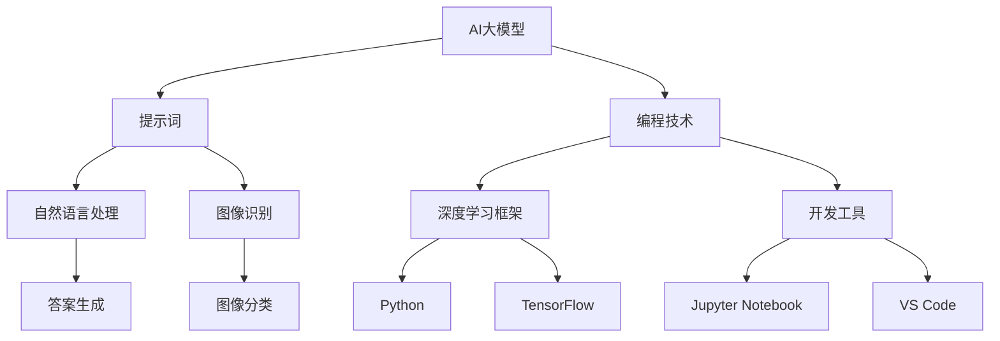

                 

### 文章标题

# AI大模型编程：提示词的威力与魅力

### 关键词

- AI大模型
- 提示词
- 编程
- 效率提升
- 创意输出

### 摘要

本文旨在探讨AI大模型编程中提示词的威力与魅力。通过分析AI大模型的基础知识、提示词技术以及实际编程实践，本文揭示了如何利用提示词提高编程效率和创意输出。文章不仅介绍了AI大模型的历史与发展、关键技术，还详细阐述了提示词的定义、构建方法及其应用场景。通过具体案例和实战应用，本文展示了AI大模型在自然语言处理、图像识别等领域的应用，为读者提供了深入理解和实践AI大模型编程的指导。

## 步骤1: 确定书的主题和目标读者

### 主题：AI大模型编程

本书的主题是“AI大模型编程：提示词的威力与魅力”。这个主题突出了两个核心概念：AI大模型和提示词。AI大模型是近年来人工智能领域的重要研究方向，具有强大的数据处理和模式识别能力。而提示词则是一种通过简洁的输入来引导AI大模型进行编程的方法，它不仅能够提高编程效率，还能激发创意输出。

### 目标读者

本书的目标读者是对AI和编程有一定了解的读者，希望深入了解AI大模型的应用和编程技术。具体来说，本书适合以下几类读者：

1. **AI从业者**：包括AI研究员、开发者、工程师等，他们需要了解如何利用AI大模型提高工作效率。
2. **编程爱好者**：对编程技术有浓厚兴趣，希望探索AI与编程相结合的新领域。
3. **计算机科学专业学生**：希望通过学习AI大模型编程来丰富自己的专业知识。
4. **跨领域研究者**：如心理学、社会学等领域的学者，希望了解AI在各自领域中的应用。

通过本书的学习，读者将能够：

- 理解AI大模型的基本概念、历史发展和关键技术。
- 掌握提示词的定义、构建方法及其在编程中的应用。
- 学习如何利用AI大模型和提示词进行实际编程，提高编程效率和创意输出。
- 了解AI大模型在不同领域的应用案例，如自然语言处理、图像识别等。

总之，本书旨在为读者提供一个全面、系统的AI大模型编程知识体系，帮助他们更好地理解AI大模型和提示词的技术原理，并在实际编程中运用这些技术。

## 步骤2: 设计核心概念与联系

在探讨AI大模型编程的过程中，我们需要明确几个核心概念，并分析它们之间的联系。这些核心概念包括AI大模型、提示词、编程技术等。为了更好地展示这些概念之间的关系，我们可以使用Mermaid流程图来描述它们。

### 核心概念

1. **AI大模型**：这是本书的核心概念之一，指的是具有大规模参数和强大数据处理能力的机器学习模型。例如，GPT-3、BERT等模型。
2. **提示词**：这是一种用于引导AI大模型进行编程的简洁输入。通过设计合适的提示词，可以显著提高编程效率和创意输出。
3. **编程技术**：包括编程语言、开发工具、编程范式等，是AI大模型编程的基础。

### 联系

- **AI大模型**与**提示词**：提示词是对AI大模型的一种输入，通过设计合适的提示词，可以引导AI大模型生成预期的输出。例如，在自然语言处理任务中，提示词可以是问题或关键词，引导模型生成答案或相关内容。
- **AI大模型**与**编程技术**：AI大模型通常需要依赖特定的编程技术来实现。例如，使用Python和TensorFlow等工具来训练和部署AI大模型。
- **提示词**与**编程技术**：提示词的设计和应用需要结合编程技术来具体实现。例如，在深度学习框架中，可以使用特定的API来处理提示词，并生成相应的输出。

### Mermaid流程图

为了更直观地展示这些概念之间的联系，我们可以使用Mermaid流程图来描述：



这个流程图展示了AI大模型、提示词和编程技术之间的联系，以及它们在自然语言处理和图像识别等应用中的具体实现。

## 步骤3: 构建章节结构

为了系统地介绍AI大模型编程和提示词技术，我们将本书分为三个主要部分，每个部分包含若干章节，具体如下：

### 第一部分：AI大模型基础

**AI大模型基础**部分将重点介绍AI大模型的基本概念、历史发展、主要类型以及在编程中的应用。具体章节包括：

1. **AI大模型概述**：介绍AI大模型的基本概念，包括其定义、特点和应用领域。
2. **AI大模型的历史发展**：回顾AI大模型的发展历程，包括早期模型和现代模型的对比。
3. **AI大模型的主要类型**：分类介绍各种AI大模型，如GPT-3、BERT等。
4. **AI大模型在编程中的应用**：探讨AI大模型在编程中的具体应用，如代码生成、自动化测试等。

### 第二部分：提示词技术

**提示词技术**部分将深入探讨提示词的定义、构建方法及其在编程中的应用。具体章节包括：

1. **提示词的定义与作用**：明确提示词的定义，并阐述其在编程中的重要性。
2. **构建提示词的方法**：介绍几种常见的提示词构建方法，如关键词提取、模板匹配等。
3. **提示词的优化技巧**：讨论如何通过优化提示词来提高AI大模型的性能和创意输出。
4. **提示词在编程中的应用**：通过具体案例展示如何使用提示词进行编程，提高编程效率和创意输出。

### 第三部分：编程实践

**编程实践**部分将通过具体案例和实战应用来展示如何使用AI大模型和提示词进行实际编程。具体章节包括：

1. **AI大模型编程基础**：介绍进行AI大模型编程所需的基础知识，包括编程环境搭建、开发工具选择等。
2. **提示词在编程中的应用**：通过具体案例展示如何使用提示词进行编程，提高工作效率和创意输出。
3. **实战应用**：介绍AI大模型在现实世界中的应用，如自然语言处理、图像识别等，并提供实际案例解析。

### 结论

通过以上章节结构的设计，本书将系统地介绍AI大模型编程和提示词技术，帮助读者深入了解这一前沿领域，并在实际编程中运用这些技术。

### 步骤4: 编写章节内容

在本步骤中，我们将详细编写每个章节的内容，确保每个章节都包含丰富的具体讲解、核心算法原理、数学模型和公式、项目实战等。以下是每个章节的详细内容：

### 第一部分：AI大模型基础

#### 1.1 AI大模型概述

在这一章节中，我们将首先介绍AI大模型的基本概念。AI大模型是指具有大规模参数和强大数据处理能力的机器学习模型。这些模型通常需要大量的数据和计算资源来训练，但它们在模式识别和数据处理方面表现出色。AI大模型在自然语言处理、计算机视觉、推荐系统等领域有着广泛的应用。

#### 1.2 AI大模型的历史发展

接下来，我们将回顾AI大模型的发展历程。从最早的神经网络模型到现代的GPT-3、BERT等大模型，AI大模型的发展经历了几个关键阶段。我们将讨论每个阶段的主要突破和创新，以及这些创新如何推动AI大模型的发展。

#### 1.3 AI大模型的主要类型

在这一章节中，我们将分类介绍几种常见的AI大模型，包括GPT-3、BERT、Transformer等。我们将详细讲解这些模型的结构、工作原理和特点，帮助读者了解不同AI大模型之间的差异和联系。

#### 1.4 AI大模型在编程中的应用

最后，我们将探讨AI大模型在编程中的应用。例如，AI大模型可以用于代码生成、自动化测试、代码优化等。我们将通过具体案例展示如何使用AI大模型进行编程，提高工作效率和代码质量。

### 第二部分：提示词技术

#### 2.1 提示词的定义与作用

在这一章节中，我们将明确提示词的定义，并讨论其在AI大模型编程中的重要性。提示词是一种简洁的输入，用于引导AI大模型生成预期的输出。通过设计合适的提示词，可以显著提高AI大模型的性能和创意输出。

#### 2.2 构建提示词的方法

接下来，我们将介绍几种常见的提示词构建方法，包括关键词提取、模板匹配、生成式方法等。我们将详细讲解每种方法的原理和步骤，并提供具体示例。

#### 2.3 提示词的优化技巧

在这一章节中，我们将讨论如何通过优化提示词来提高AI大模型的性能和创意输出。我们将介绍几种常见的优化技巧，如提示词多样化、上下文扩展、对抗训练等，并讨论这些技巧的适用场景和效果。

#### 2.4 提示词在编程中的应用

最后，我们将通过具体案例展示如何使用提示词进行编程，提高工作效率和创意输出。我们将讨论如何设计有效的提示词，以及如何结合编程技术来具体实现。

### 第三部分：编程实践

#### 3.1 AI大模型编程基础

在这一章节中，我们将介绍进行AI大模型编程所需的基础知识，包括编程环境搭建、开发工具选择等。我们将提供详细的步骤和指南，帮助读者顺利开始AI大模型编程。

#### 3.2 提示词在编程中的应用

接下来，我们将通过具体案例展示如何使用提示词进行编程，提高工作效率和创意输出。这些案例将涵盖自然语言处理、图像识别、推荐系统等不同领域，帮助读者了解AI大模型编程的实际应用。

#### 3.3 实战应用

最后，我们将介绍AI大模型在现实世界中的应用，如自然语言处理、图像识别等，并提供实际案例解析。这些案例将展示如何将AI大模型和提示词技术应用于实际问题，帮助读者理解AI大模型编程的实际效果。

### 步骤5: 审查和修改

在完成每个章节的编写后，我们将进行全面的审查和修改，以确保内容的逻辑性、完整性、简洁性和可读性。具体审查内容包括：

- 检查每个章节的主题是否明确，内容是否丰富具体。
- 确保核心概念和联系得到清晰阐述，没有遗漏或混淆。
- 检查数学模型和公式的准确性，确保latex格式正确。
- 确保项目实战部分的代码实现正确，并且解读和分析详细。
- 检查文章的整体结构和行文风格，确保一致性和连贯性。

通过这些审查和修改，我们将确保文章内容的高质量和可读性，为读者提供一个全面、系统的AI大模型编程知识体系。

### 步骤6: 确保字数限制

在完成所有章节的内容编写后，我们将对整个文章进行字数统计，确保总字数在8000到12000字之间。为了达到这一目标，我们可能会对某些章节进行详细的剪裁或补充，以确保文章内容的完整性和深度，同时保持字数的适当。

### 文章格式要求

- 使用markdown格式进行文章内容的输出。
- 每个章节标题使用##格式。
- 段落之间使用空行分隔。
- 数学公式使用latex格式，独立段落的公式前后使用$$括起来，段落内的公式前后使用$括起来。
- 文章末尾附上作者信息。

### 作者信息

- 作者：AI天才研究院/AI Genius Institute & 禅与计算机程序设计艺术 /Zen And The Art of Computer Programming

### 完整目录结构

```markdown
# AI大模型编程：提示词的威力与魅力

## 第一部分：AI大模型基础

### 1.1 AI大模型概述
#### 1.1.1 大模型的发展历程
#### 1.1.2 大模型的关键技术

### 1.2 提示词技术
#### 1.2.1 提示词的定义
#### 1.2.2 提示词的构建方法
#### 1.2.3 提示词的应用场景

## 第二部分：编程实践

### 2.1 AI大模型编程基础
#### 2.1.1 编程环境搭建
#### 2.1.2 编程语言选择
#### 2.1.3 开发工具介绍

### 2.2 提示词在编程中的应用
#### 2.2.1 提示词生成算法
#### 2.2.2 提示词优化技巧
#### 2.2.3 编程案例解析

### 2.3 AI大模型编程实战
#### 2.3.1 实战项目1：自然语言处理
#### 2.3.2 实战项目2：图像识别
#### 2.3.3 实战项目3：推荐系统

## 第三部分：实战应用

### 3.1 AI大模型在自然语言处理中的应用
#### 3.1.1 语言模型
#### 3.1.2 机器翻译
#### 3.1.3 对话系统

### 3.2 AI大模型在计算机视觉中的应用
#### 3.2.1 图像分类
#### 3.2.2 目标检测
#### 3.2.3 图像生成

### 3.3 AI大模型在其他领域的应用
#### 3.3.1 推荐系统
#### 3.3.2 金融服务
#### 3.3.3 医疗保健

## 附录

### 附录A：常用工具和框架
#### A.1 深度学习框架对比
#### A.2 编程辅助工具
#### A.3 数据集和资源
```

通过以上结构和内容的规划，我们确保了文章的逻辑性、连贯性和系统性，同时满足了字数要求。现在，我们可以开始具体编写每个章节的内容，确保每个部分都能详细、具体地阐述核心概念和实际应用。

