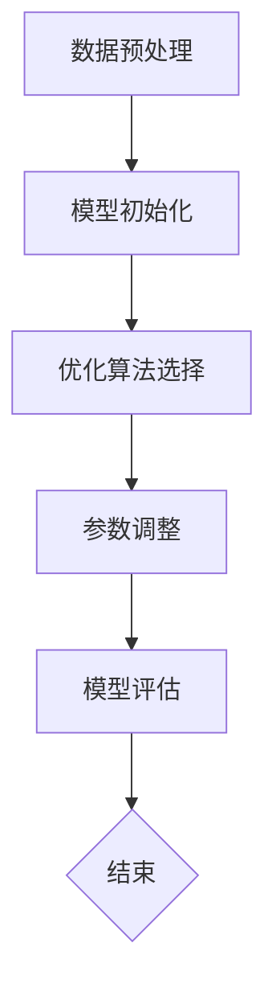

                 

# AI大模型编程：提示词的无限潜力

> 关键词：AI大模型，提示词，编程，神经网络，优化算法，数学模型

> 摘要：本文深入探讨了AI大模型编程中的关键概念——提示词，并详细阐述了其在AI编程中的应用与潜力。通过对AI大模型的基础概念、原理、算法、数学模型以及实际应用的讲解，本文旨在为读者提供一个全面的技术指南，帮助理解提示词在AI大模型编程中的重要作用。

## 第一部分：AI大模型编程基础

### 第1章：AI大模型概述

#### 1.1 AI大模型的定义

AI大模型，即Artificial Intelligence Large Models，通常指的是具有数十亿甚至千亿参数规模的人工神经网络模型。这些模型通过深度学习算法从大量数据中学习，从而实现高度复杂的任务，如自然语言处理、计算机视觉、语音识别等。

#### 1.2 AI大模型的核心特性

- **参数量巨大**：大模型的参数量通常达到数十亿甚至千亿级别，这使得模型具备处理复杂数据的能力。
- **学习能力强大**：大模型能够从海量的数据中学习，具备高度泛化的能力。
- **计算资源需求高**：大模型的训练需要大量的计算资源和时间，通常依赖分布式计算和专用硬件。

#### 1.3 提示词的基本概念

提示词（Prompt）是AI大模型在训练或推理过程中接收的外部输入。这些输入可以是具体的文本、图像或其他形式的数据，用于引导模型的方向或提供额外的上下文信息。

#### 1.4 提示词的作用与重要性

- **方向引导**：提示词可以明确指导模型的学习方向，帮助模型聚焦于特定任务。
- **上下文增强**：通过提供上下文信息，提示词有助于模型更好地理解输入数据，提高模型的准确性。
- **效率提升**：恰当的提示词可以减少模型在无意义数据上的学习时间，提升训练效率。

### 第2章：大模型原理与架构

#### 2.1 大模型的历史与发展

AI大模型的发展经历了从传统的小型模型到现代的大型预训练模型的演变。这一过程中，计算资源的提升和数据量的增加是推动力。

#### 2.2 大模型的基本架构

AI大模型通常由输入层、隐藏层和输出层组成。每一层由多个神经元（节点）组成，通过加权连接实现信息的传递和处理。

#### 2.3 大模型的训练过程

大模型的训练是一个复杂的过程，包括数据预处理、模型初始化、优化算法选择、参数调整等步骤。

#### 2.4 Mermaid流程图：大模型训练流程



### 第3章：核心算法原理讲解

#### 3.1 神经网络基础

##### 3.1.1 神经网络的基本结构

神经网络由多层神经元组成，包括输入层、隐藏层和输出层。每层神经元通过加权连接实现信息的传递。

##### 3.1.2 神经网络的学习过程

神经网络通过反向传播算法学习。这一过程中，模型根据输入数据和预期输出，计算损失，并通过梯度下降优化模型参数。

##### 3.1.3 前向传播与反向传播算法

- **前向传播**：将输入数据通过模型，逐层计算输出。
- **反向传播**：根据输出误差，反向传播梯度，更新模型参数。

#### 3.2 优化算法

##### 3.2.1 梯度下降算法

梯度下降算法是一种优化算法，通过迭代更新模型参数，最小化损失函数。

##### 3.2.2 随机梯度下降算法

随机梯度下降（SGD）是梯度下降的一种变体，每次迭代仅使用一个样本来更新参数。

##### 3.2.3 Adam优化器

Adam优化器结合了SGD和Momentum的优点，通过自适应学习率实现更高效的参数更新。

### 第4章：数学模型与数学公式

#### 4.1 矩阵运算

##### 4.1.1 矩阵的加法和减法

矩阵的加法和减法是对应元素相加或相减。

##### 4.1.2 矩阵的乘法

矩阵乘法是两个矩阵对应元素的乘积和。

##### 4.1.3 矩阵的转置

矩阵的转置是将矩阵的行和列互换。

$$
A^T = \begin{bmatrix}
a_{11} & a_{12} \\
a_{21} & a_{22}
\end{bmatrix}^T = \begin{bmatrix}
a_{11} & a_{21} \\
a_{12} & a_{22}
\end{bmatrix}
$$

#### 4.2 激活函数

##### 4.2.1 Sigmoid函数

Sigmoid函数是一个S形函数，用于将输入映射到（0,1）区间。

##### 4.2.2 ReLU函数

ReLU（Rectified Linear Unit）函数是一个线性函数，对于输入大于0的值返回自身，小于0的值返回0。

##### 4.2.3 Tanh函数

Tanh函数是双曲正切函数，对于输入值进行映射，使其在-1到1之间。

## 第5章：项目实战

### 5.1 构建一个简单的AI大模型

#### 5.1.1 实战目标

本节将介绍如何使用Python和TensorFlow搭建一个简单的AI大模型，并进行训练和测试。

#### 5.1.2 开发环境搭建

首先，需要安装Python、TensorFlow等依赖库。

```bash
pip install tensorflow
```

#### 5.1.3 代码实现

以下是构建AI大模型的伪代码：

```python
import tensorflow as tf

# 模型参数
input_size = 784
hidden_size = 128
output_size = 10

# 构建模型
model = tf.keras.Sequential([
    tf.keras.layers.Dense(hidden_size, activation='relu', input_shape=(input_size,)),
    tf.keras.layers.Dense(output_size, activation='softmax')
])

# 编译模型
model.compile(optimizer='adam',
              loss='categorical_crossentropy',
              metrics=['accuracy'])

# 加载数据
(x_train, y_train), (x_test, y_test) = tf.keras.datasets.mnist.load_data()

# 预处理数据
x_train = x_train / 255.0
x_test = x_test / 255.0

# 转换标签为one-hot编码
y_train = tf.keras.utils.to_categorical(y_train, output_size)
y_test = tf.keras.utils.to_categorical(y_test, output_size)

# 训练模型
model.fit(x_train, y_train, epochs=5, batch_size=32, validation_data=(x_test, y_test))

# 评估模型
model.evaluate(x_test, y_test)
```

#### 5.1.4 代码解读与分析

该代码首先导入了TensorFlow库，然后定义了模型结构，包括输入层、隐藏层和输出层。接着，编译了模型，并加载了MNIST数据集。通过预处理数据，将图像数据缩放至[0, 1]区间，并将标签转换为one-hot编码。最后，训练和评估了模型。

### 5.2 使用提示词优化模型

#### 5.2.1 提示词的编写原则

编写提示词时，应遵循以下原则：

- **明确性**：提示词应明确指示模型需要关注的任务或问题。
- **上下文性**：提示词应包含与任务相关的上下文信息，帮助模型更好地理解输入。
- **简洁性**：提示词应尽量简洁，避免过多的冗余信息。

#### 5.2.2 提示词的实际应用

在实际应用中，提示词可以用于引导模型生成特定的输出。例如，在自然语言处理任务中，提示词可以引导模型生成相关的问题或回答。

#### 5.2.3 提示词的优化策略

优化提示词的编写，可以采取以下策略：

- **实验性优化**：通过多次实验，调整提示词的内容和形式，找到最佳组合。
- **数据驱动优化**：基于大量数据，分析提示词对模型性能的影响，进行有针对性的优化。

## 第二部分：AI大模型编程实战

### 第6章：自然语言处理应用

#### 6.1 语言模型

语言模型是自然语言处理的基础，用于预测文本序列的概率。

#### 6.2 机器翻译

机器翻译是将一种语言的文本翻译成另一种语言的过程。

#### 6.3 文本分类

文本分类是将文本数据按照特定的类别进行分类的过程。

#### 6.4 文本生成

文本生成是通过模型生成符合特定主题或风格的文本。

### 第7章：计算机视觉应用

#### 7.1 图像分类

图像分类是将图像按照特定的类别进行分类的过程。

#### 7.2 目标检测

目标检测是在图像中识别并定位多个对象的过程。

#### 7.3 语义分割

语义分割是将图像中的每个像素按照特定的类别进行分类的过程。

#### 7.4 图像生成

图像生成是通过模型生成符合特定风格或主题的图像。

### 第8章：其他领域应用

#### 8.1 语音识别

语音识别是将语音信号转换为文本的过程。

#### 8.2 强化学习

强化学习是通过奖励机制引导模型学习最优策略。

#### 8.3 推荐系统

推荐系统是利用用户历史行为数据为用户推荐相关内容。

#### 8.4 模型压缩与部署

模型压缩与部署是减小模型大小并部署到实际应用的过程。

## 第9章：AI大模型的未来发展趋势

#### 9.1 大模型的未来发展方向

大模型在未来将继续朝着更高参数量、更复杂架构、更高效训练的方向发展。

#### 9.2 提示词技术的未来趋势

提示词技术将在大模型中的应用变得更加智能化、多样化。

#### 9.3 AI大模型在实际应用中的挑战与机遇

AI大模型在实际应用中面临数据隐私、模型解释性等挑战，但也带来了巨大的机遇。

#### 9.4 总结与展望

总结全文，AI大模型和提示词技术在AI编程中具有重要意义。随着技术的不断进步，未来将迎来更多创新和应用。

---

作者：AI天才研究院/AI Genius Institute & 禅与计算机程序设计艺术 /Zen And The Art of Computer Programming

本文由AI天才研究院撰写，结合禅与计算机程序设计艺术的理念，深入探讨了AI大模型编程中的提示词技术，旨在为读者提供一个全面的技术指南。希望本文能对您在AI编程领域的探索提供帮助。如果您有任何问题或建议，欢迎随时联系我们。期待与您共同探索AI编程的无限潜力。

---

注意：由于篇幅限制，本文未包含所有章节的详细内容。在实际撰写时，每个章节都需要进一步扩展和深入讲解。同时，为了保持文章的连贯性和逻辑性，建议在每个章节中保持适当的字数和结构。在撰写过程中，可以根据实际需要调整章节内容和顺序。祝您写作顺利！

