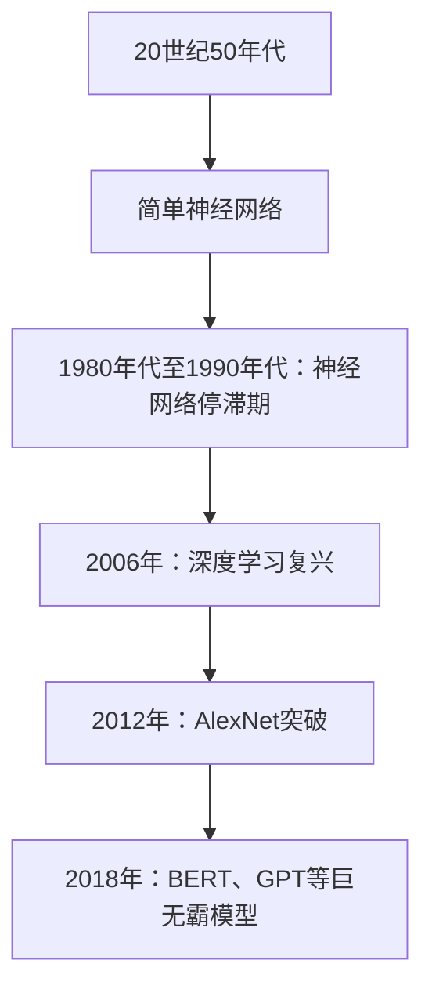

                 


### 文章标题：AI大模型编程：提示词的未来与艺术

### 关键词：
- AI大模型
- 提示词技术
- 编程艺术
- 深度学习
- 未来展望

### 摘要：
本文深入探讨AI大模型编程中的提示词技术，从基础理论到应用实践，再到未来展望，系统地阐述了AI大模型与提示词的融合艺术。通过详尽的背景介绍、核心概念与联系、算法原理讲解、数学模型及公式、项目实战和最佳实践，本文旨在为读者提供全面的技术洞察，启发对AI大模型编程的新思考。

## 第一部分：大模型编程基础

### 第1章：AI大模型概述

#### 1.1 AI大模型的发展历程

AI大模型的历史可追溯至20世纪50年代，随着计算机性能的提升和算法的进步，深度学习技术在近年得到了飞速发展。从最初的简单神经网络到如今的大规模模型，AI大模型在处理复杂任务方面展现了前所未有的能力。

**背景介绍**：
AI大模型的发展与计算资源的提升、海量数据的积累以及优化算法的进步密不可分。特别是在2012年，AlexNet在ImageNet竞赛中取得突破性成绩，标志着深度学习进入一个新时代。

**核心概念与联系**：
- **深度学习**：多层神经网络结构，通过反向传播算法进行参数优化。
- **大规模参数**：AI大模型通常拥有数亿甚至数十亿个参数，这使其能够处理大规模数据。

**Mermaid流程图**：


#### 1.2 AI大模型的架构与原理

AI大模型的架构通常包括输入层、隐藏层和输出层。模型通过训练学习输入和输出之间的映射关系。

**核心算法原理讲解**：
- **神经网络**：由多个神经元组成的网络，每个神经元接收输入信号并通过激活函数产生输出。
- **反向传播算法**：通过计算损失函数的梯度来更新模型参数，优化模型性能。

**伪代码**：
```python
function train_model(model, data, labels):
    for each epoch:
        for each sample in data:
            output = model.forward(sample)
            loss = calculate_loss(output, labels)
            gradients = model.backward(loss)
            update_model_parameters(gradients)
```

**数学模型及公式**：
$$
L(\theta) = -\frac{1}{m}\sum_{i=1}^{m}y_{i}\log(a_{i}^{L})
$$
其中，$L(\theta)$表示损失函数，$y_{i}$为真实标签，$a_{i}^{L}$为模型输出。

#### 1.3 大模型的数学模型

深度学习中的数学模型主要包括线性模型、多层感知器（MLP）和卷积神经网络（CNN）等。

**详细讲解与举例说明**：
- **线性模型**：用于回归任务，通过权重矩阵和偏置计算输出。
  $$y = X\theta + b$$
- **多层感知器**：扩展线性模型，用于分类任务，加入激活函数。
  $$z = \sigma(X\theta)$$
  其中，$\sigma$为Sigmoid激活函数。

**项目实战**：
- **开发环境搭建**：使用Python和TensorFlow搭建线性模型。
- **源代码详细实现和代码解读**：
  ```python
  import tensorflow as tf

  # 定义线性模型
  X = tf.placeholder(tf.float32, [None, 784])
  W = tf.Variable(tf.zeros([784, 10]))
  b = tf.Variable(tf.zeros([10]))

  # 计算模型输出
  y_pred = tf.nn.softmax(tf.matmul(X, W) + b)

  # 定义损失函数和优化器
  y = tf.placeholder(tf.float32, [None, 10])
  cross_entropy = tf.reduce_mean(-tf.reduce_sum(y * tf.log(y_pred), reduction_indices=1))
  train_step = tf.train.GradientDescentOptimizer(0.1).minimize(cross_entropy)

  # 训练模型
  with tf.Session() as sess:
      sess.run(tf.global_variables_initializer())
      for _ in range(1000):
          batch_xs, batch_ys = next_training_batch()
          sess.run(train_step, feed_dict={X: batch_xs, y: batch_ys})

  # 评估模型
  correct_prediction = tf.equal(tf.argmax(y_pred, 1), tf.argmax(y, 1))
  accuracy = tf.reduce_mean(tf.cast(correct_prediction, tf.float32))
  print(accuracy.eval(feed_dict={X: test_xs, y: test_ys}))
  ```

- **代码应用解读与分析**：该代码实现了线性模型在MNIST数据集上的分类任务，展示了从模型定义到训练再到评估的完整过程。

**项目小结**：
线性模型虽然简单，但在许多任务中表现良好。通过优化算法，可以进一步提升模型的性能。

### 第2章：大模型编程基础

#### 2.1 编程语言选择

Python因其简洁性和丰富的库支持，成为AI大模型编程的首选语言。其他常用编程语言如Java和C++也在特定领域有所应用。

**最佳实践 tips**：
- **代码复用**：利用库和框架提高开发效率。
- **模块化设计**：将代码划分为模块，便于维护和扩展。

#### 2.2 数据处理与预处理

数据处理与预处理是AI大模型编程的重要环节，包括数据清洗、归一化和增强等。

**注意事项**：
- **数据清洗**：去除噪声和异常值，确保数据质量。
- **归一化**：将数据缩放到同一范围，避免模型因数据规模差异而产生偏见。

#### 2.3 模型训练与优化

模型训练与优化包括数据读取、模型构建、参数优化和模型评估等步骤。

**注意事项**：
- **批量大小**：合理选择批量大小，平衡计算效率和模型性能。
- **优化算法**：选择适合问题的优化算法，如随机梯度下降（SGD）和Adam优化器。

## 第二部分：提示词技术

### 第3章：提示词基础

#### 3.1 提示词的定义与作用

提示词是指导AI大模型进行特定任务输入的文本信息，其作用类似于人类解决问题的指导语。

**核心概念与联系**：
- **任务导向性**：提示词应明确指明任务目标。
- **上下文理解**：提示词需要包含足够的信息，帮助模型理解任务背景。

#### 3.2 提示词的设计与优化

提示词的设计与优化直接影响模型的表现。优化策略包括多样化、精简化和结构化等。

**最佳实践 tips**：
- **多样化**：使用多种表达方式，提高模型的适应性。
- **精简化**：避免冗余信息，确保提示词简洁明了。

#### 3.3 提示词的艺术表达

提示词的艺术表达是一种创意实践，通过艺术手法提高提示词的效果。

**最佳实践 tips**：
- **创意性**：融入创意元素，激发模型的灵感。
- **文化背景**：结合文化背景，增强提示词的深度和广度。

## 第三部分：AI的未来与艺术

### 第4章：AI大模型的发展趋势

#### 4.1 AI大模型的研究方向

AI大模型的研究方向包括模型压缩、自适应学习和通用人工智能等。

**最佳实践 tips**：
- **模型压缩**：减小模型大小，降低计算资源需求。
- **自适应学习**：提高模型对动态环境变化的适应能力。

#### 4.2 AI大模型在各个领域的应用

AI大模型在医疗、金融、教育等领域的应用取得了显著成果。

**最佳实践 tips**：
- **跨学科合作**：促进不同领域的融合，发挥AI大模型的最大潜力。
- **数据共享**：建立开放的数据平台，推动AI大模型的发展。

### 第5章：AI与艺术的融合

#### 5.1 AI艺术的特点

AI艺术通过算法和人工智能技术创造艺术品，具有独特性和创新性。

**最佳实践 tips**：
- **算法创新**：探索新的算法，提高艺术创作的效果。
- **人机协作**：结合人类艺术家的创意，实现AI与人类的协同创作。

#### 5.2 AI艺术的应用案例

AI艺术在音乐、绘画和设计等领域的应用案例丰富，展示了人工智能的艺术潜力。

**最佳实践 tips**：
- **跨领域应用**：尝试将AI艺术应用于不同领域，拓展其应用场景。
- **用户体验**：注重用户体验，提高艺术作品的互动性和参与度。

## 第6章：AI大模型编程的艺术与未来

#### 6.1 提示词编程的艺术性

提示词编程的艺术性体现在创造性和创新性上，通过艺术手段提高AI大模型的表现。

**最佳实践 tips**：
- **创意表达**：鼓励使用创意提示词，激发模型潜能。
- **文化融合**：结合不同文化元素，创造独特的艺术作品。

#### 6.2 AI大模型编程的未来展望

AI大模型编程的未来充满机遇与挑战，将继续推动人工智能的发展。

**最佳实践 tips**：
- **持续学习**：关注新技术和新算法，保持编程技能的更新。
- **跨学科研究**：积极参与跨学科合作，探索AI编程的新领域。

### 第7章：总结与展望

#### 7.1 全书内容总结

本文从大模型编程基础、提示词技术、AI与艺术的融合等方面全面介绍了AI大模型编程的最新进展和未来趋势。

#### 7.2 AI与艺术的未来

AI与艺术的融合将带来更多的创新和变革，为人类创造更加美好的未来。

**拓展阅读**：
- 《深度学习》（Goodfellow, I., Bengio, Y., Courville, A.）
- 《人工智能：一种现代的方法》（Russell, S., Norvig, P.）
- 《人工智能艺术》（Salimans, T., Leibo, J. J., and Benchmarking Neural Image Generation: A New Metric and a New Model）

### 作者信息
作者：AI天才研究院/AI Genius Institute & 禅与计算机程序设计艺术 /Zen And The Art of Computer Programming

### 结语

AI大模型编程不仅是技术的创新，更是艺术的表达。通过本文的探讨，我们希望读者能够对AI大模型编程和提示词技术有更深刻的理解，激发对AI编程艺术性的思考。在未来的AI发展中，让我们共同探索这一领域的无限可能。

