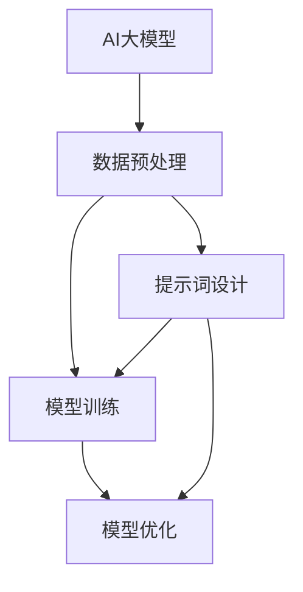

                 

### 文章标题

《AI大模型编程：提示词的潜力与威力》

在当今飞速发展的科技时代，人工智能（AI）已经成为推动社会进步的重要力量。AI大模型，作为一种能够处理复杂数据、自动学习和优化任务的先进技术，正逐渐改变着我们的生活方式和工作模式。而在这其中，提示词（Prompt Engineering）作为一种关键的技术手段，发挥着不可忽视的作用。本文将深入探讨AI大模型编程中提示词的潜力与威力，通过逻辑清晰、结构紧凑的论述，帮助读者理解这一前沿技术的核心原理和实际应用。

## 关键词

- **人工智能（AI）**：一种模拟人类智能行为的计算系统，通过算法和大数据分析实现智能决策。
- **大模型（Large Models）**：具备强大计算能力和自主学习能力的深度学习模型。
- **提示词（Prompt Engineering）**：设计、优化和调整输入信息，以增强AI模型性能的技术。
- **编程（Programming）**：编写计算机程序的过程，通过编程语言实现特定功能。
- **性能优化（Performance Optimization）**：提升算法和系统性能的一系列技术手段。

## 摘要

本文旨在探讨AI大模型编程中提示词的潜力与威力。首先，我们将介绍AI大模型的背景和发展现状，然后深入探讨提示词的概念、设计原则及其在AI编程中的重要性。接着，我们将通过具体的算法原理讲解、数学模型和公式详细阐述，帮助读者理解提示词在AI编程中的实际应用。随后，本文将结合实际项目案例，展示如何开发环境搭建、源代码实现和代码解读，并进行应用解读与分析。最后，本文将总结最佳实践和注意事项，为读者提供进一步的学习和探索方向。通过本文的阅读，读者将能够掌握AI大模型编程中的提示词技术，提升自身的编程能力和AI应用水平。

## 引言

人工智能（AI）作为21世纪最具革命性的技术之一，正在深刻地改变着各行各业。特别是近年来，随着计算能力、数据资源和算法研究的不断突破，AI大模型（Large AI Models）得到了迅速发展。AI大模型是指那些具备极其强大计算能力和自主学习能力的深度学习模型，能够处理大规模、复杂的数据集，实现从图像识别、自然语言处理到预测分析等广泛的任务。

AI大模型的发展得益于以下几个关键因素：

1. **计算能力的提升**：随着GPU、TPU等专用硬件的普及，计算能力得到了显著提升，为训练大规模模型提供了必要的基础。
2. **数据资源的丰富**：互联网的普及和大数据技术的发展，使得各种类型的数据资源变得唾手可得，为AI模型的训练提供了丰富的素材。
3. **算法研究的进步**：深度学习、强化学习等算法的不断优化，使得AI大模型能够在各种任务中展现出优异的性能。

在这股技术浪潮中，提示词（Prompt Engineering）作为一种关键的技术手段，逐渐受到关注。提示词是指在设计AI模型输入时，通过特定的方式对输入信息进行设计和优化，从而提升模型的性能和适用性。在AI大模型编程中，提示词不仅是一种输入数据的调整方式，更是一种通过巧妙设计输入来引导模型学习方向和优化效果的重要策略。

提示词在AI编程中的重要性主要体现在以下几个方面：

1. **性能优化**：通过合理设计提示词，可以在一定程度上提升模型的预测准确性和计算效率。
2. **泛化能力**：提示词的设计可以影响模型的泛化能力，使得模型在不同数据集和任务中都能保持良好的表现。
3. **可解释性**：提示词的设计和调整可以帮助提升模型的可解释性，使得模型的决策过程更加透明和可理解。

因此，理解并掌握提示词技术在AI大模型编程中的应用，不仅有助于提升模型的性能，还能为后续的优化和改进提供有力的支持。在本文中，我们将深入探讨AI大模型编程中提示词的潜力与威力，通过具体的算法原理讲解、数学模型和公式详细阐述，帮助读者更好地理解和应用这一前沿技术。

### 核心概念与联系

在深入探讨AI大模型编程中的提示词技术之前，有必要明确几个核心概念，并理解它们之间的关系。这些核心概念包括：AI大模型、提示词、数据预处理、模型训练和优化等。

**AI大模型**：AI大模型是一种基于深度学习的算法模型，通常包含数十亿至数千亿个参数，能够在处理大规模、复杂的数据集时展现出强大的学习能力和预测性能。这类模型通过多层神经网络结构进行数据的自动学习和特征提取，能够处理从图像、文本到语音等多种类型的数据。

**提示词**：提示词是输入给AI大模型的数据预处理阶段的一个重要组成部分。它们是一系列精心设计的文字或指令，用于引导模型学习特定任务或数据模式。通过调整和优化提示词，可以显著影响模型的训练过程和最终性能。

**数据预处理**：数据预处理是AI大模型训练的基础环节，包括数据清洗、数据增强、数据格式化等步骤。其中，数据清洗是为了去除噪声和异常值，数据增强是为了增加数据的多样性和丰富性，数据格式化是为了将数据转换成适合模型训练的格式。在这一过程中，提示词的生成和调整是关键步骤，能够直接影响后续的训练效果。

**模型训练**：模型训练是指通过大量数据对AI大模型进行调整和优化，使其能够准确预测或完成特定任务。在这一过程中，提示词不仅影响训练数据的输入格式和内容，还能够在训练过程中提供额外的信息，帮助模型更好地理解任务要求。

**模型优化**：模型优化是在模型训练的基础上，通过超参数调整、正则化策略等手段进一步提升模型性能的过程。提示词在这一过程中同样发挥着重要作用，通过优化提示词的设计，可以在一定程度上提升模型的泛化能力和计算效率。

**Mermaid 流程图**：

为了更好地展示这些核心概念之间的联系，我们可以使用Mermaid流程图来表示：



在这个流程图中，AI大模型位于中心，连接着数据预处理、提示词设计、模型训练和模型优化四个关键环节。提示词设计不仅直接影响数据预处理和模型训练，还贯穿于整个模型优化过程，发挥着至关重要的桥梁作用。通过这样的流程图，我们可以清晰地理解AI大模型编程中各个核心概念之间的紧密联系，为后续的详细讲解打下基础。

### AI大模型编程概述

AI大模型编程是近年来快速发展的一个领域，其核心在于利用大量数据和强大的计算能力，通过深度学习算法训练出具有高度自主学习和优化能力的模型。在AI大模型编程中，我们需要了解几个关键概念，包括深度学习模型、神经网络和反向传播算法。

**深度学习模型**：深度学习模型是一种多层神经网络结构，通过逐层提取数据特征，从而实现从简单到复杂的特征表示。一个典型的深度学习模型通常包含输入层、多个隐藏层和一个输出层。输入层接收原始数据，隐藏层通过激活函数进行数据处理和特征提取，输出层则生成最终的预测结果。

**神经网络**：神经网络是模仿人脑神经元连接方式的计算模型。在深度学习中，神经网络通过大量的连接（权重）和激活函数，实现数据的传递和计算。每个神经元接收多个输入信号，通过加权求和后加上偏置项，再通过激活函数（如ReLU、Sigmoid或Tanh）输出一个值。这种结构使得神经网络能够学习数据的非线性特征。

**反向传播算法**：反向传播算法是一种用于训练深度学习模型的优化算法。它通过计算损失函数对网络权重的梯度，从而调整权重，使模型在训练过程中不断优化。具体步骤如下：

1. **前向传播**：将输入数据传递到网络中，通过各层的权重计算输出结果。
2. **计算损失**：将输出结果与真实标签进行比较，计算损失函数（如均方误差MSE）的值。
3. **反向传播**：计算损失函数对网络权重的梯度，并将梯度传递回前一层。
4. **权重更新**：根据梯度信息调整网络权重，使得损失函数的值逐渐减小。

**伪代码**：

下面是一个简单的反向传播算法的伪代码示例：

```python
# 前向传播
def forward propagation(x, weights):
    z = dot(x, weights)
    a = activation(z)
    return a

# 损失函数计算
def compute_loss(a, y):
    loss = (1/2) * sum((a - y)^2)
    return loss

# 反向传播
def backward propagation(a, y, weights):
    delta = a - y
    dW = dot(delta, a.T)
    return dW
```

**数学模型与公式**：

在AI大模型编程中，我们还会使用到一些关键的数学模型和公式。以下是几个常见的公式及其解释：

1. **激活函数**：
   $$ f(x) = \sigma(x) = \frac{1}{1 + e^{-x}} $$
   激活函数用于将线性变换映射到非线性空间，其中σ函数（Sigmoid函数）是一种常用的激活函数。

2. **损失函数**：
   $$ L = \frac{1}{2} \sum_{i} (y_i - \hat{y_i})^2 $$
   损失函数用于衡量模型输出与真实标签之间的差距，均方误差（MSE）是一种常用的损失函数。

3. **梯度计算**：
   $$ \frac{\partial L}{\partial W} = \frac{\partial}{\partial W} \sum_{i} (y_i - \hat{y_i})^2 $$
   梯度用于指导网络权重的调整方向，是反向传播算法的核心。

通过这些关键概念、神经网络和反向传播算法的讲解，读者可以初步了解AI大模型编程的基础知识。在接下来的部分，我们将进一步探讨提示词的设计原则和具体方法，以帮助读者更深入地理解AI大模型编程中的提示词技术。

### 提示词原理

在AI大模型编程中，提示词（Prompt）是一种关键技术，它通过引导模型关注特定信息，从而提高模型的训练效率和性能。提示词的设计和优化是提升模型效果的重要因素之一。下面我们将详细介绍提示词的基本原理、设计原则和优化策略。

#### 提示词的定义

提示词是指提供给AI大模型的一组指令或信息，用于引导模型学习特定的任务或数据模式。这些信息可以是文本、图像、音频等多种形式，但通常在深度学习模型中，文本形式的提示词最为常见。提示词的作用在于：

1. **明确任务目标**：通过提示词，我们可以向模型明确指出训练任务的目标，帮助模型更快地收敛到最优解。
2. **增强数据表示**：提示词能够提供额外的上下文信息，丰富数据表示，从而提高模型的泛化能力。
3. **调整学习过程**：提示词可以影响模型的训练过程，通过调整学习速率和收敛方向，提升模型性能。

#### 提示词的设计原则

为了设计有效的提示词，我们需要遵循以下几个基本原则：

1. **任务相关性**：提示词应该与训练任务高度相关，明确指出模型需要关注的关键信息。
2. **数据一致性**：提示词应该保持与训练数据的一致性，避免引入无关或矛盾的信息，从而提高模型的泛化能力。
3. **信息丰富性**：提示词应该提供丰富的上下文信息，帮助模型更好地理解数据内容，从而提升学习效果。
4. **简洁性**：提示词应该简洁明了，避免冗长和复杂的表达，以免增加模型理解负担。

#### 提示词优化策略

在设计提示词的过程中，我们还需要考虑如何优化提示词，以提高模型的训练效率和性能。以下是一些常见的优化策略：

1. **提示词组合**：通过组合多个提示词，可以提供更丰富的上下文信息，有助于模型更好地理解任务要求。例如，在文本分类任务中，可以将主题描述和分类标签组合在一起，形成更有效的提示词。
2. **动态调整**：根据训练过程中的反馈，动态调整提示词的内容和形式，以适应模型的学习状态。例如，当模型在训练初期效果不佳时，可以增加一些提示词来引导模型关注特定信息。
3. **特征提取**：通过特征提取技术，从原始数据中提取关键特征，并将其作为提示词输入模型。这种方法可以提高提示词的准确性和有效性，从而提升模型性能。
4. **多模态融合**：在多模态任务中，融合不同类型的提示词（如文本、图像、音频等），可以提供更全面的信息，从而提高模型的泛化能力和表现。

#### 提示词效果评估

为了评估提示词的设计和优化效果，我们需要建立一套合理的评估标准。以下是一些常用的评估指标：

1. **准确率（Accuracy）**：模型在分类任务中的正确预测比例，是评估模型性能的基本指标。
2. **召回率（Recall）**：模型在分类任务中正确识别的负例比例，用于衡量模型的泛化能力。
3. **F1分数（F1 Score）**：结合准确率和召回率的综合指标，用于评估模型的整体性能。
4. **交叉验证（Cross-Validation）**：通过在不同数据集上多次训练和测试，评估提示词在多种情况下的性能，从而提高评估结果的可靠性。

通过以上对提示词原理的介绍，我们可以看到，提示词在AI大模型编程中具有重要的作用。通过合理设计和优化提示词，可以有效提升模型的训练效率和性能，实现更准确的预测和更广泛的任务应用。

### 编程工具和框架

在AI大模型编程中，选择合适的编程工具和框架是至关重要的。这些工具和框架不仅能够提高开发效率，还能确保模型的稳定性和可维护性。以下我们将介绍几种常用的编程工具和框架，包括Python编程基础、常用编程库与工具，以及深度学习框架的比较。

#### Python编程基础

Python作为一种高级编程语言，以其简洁易懂、功能强大的特性，成为AI大模型编程的主要语言之一。Python具有丰富的库和框架支持，使其在数据处理、模型训练和部署方面表现出色。

**Python优势**：

1. **易学易用**：Python语法简单，易于学习和理解，适合初学者快速上手。
2. **丰富的库支持**：Python拥有丰富的库和框架，如NumPy、Pandas、SciPy等，可以方便地进行数据操作和分析。
3. **强大的社区支持**：Python拥有庞大的开发者社区，提供大量的教程、文档和开源项目，帮助开发者解决问题和提升技能。

**Python基础**：

- **变量与数据类型**：Python支持多种数据类型，如整数、浮点数、字符串等。
- **控制结构**：Python提供条件语句（if-else）、循环语句（for-while）等基本控制结构。
- **函数**：Python支持定义和调用函数，提高代码复用性。

#### 常用编程库与工具

在AI大模型编程中，以下是一些常用的编程库与工具：

1. **NumPy**：用于数值计算和矩阵操作，提供多维数组对象和丰富的数学函数。
2. **Pandas**：用于数据处理和分析，提供数据帧和数据表格数据结构，支持多种数据操作方法。
3. **Matplotlib**：用于数据可视化，提供丰富的绘图功能，帮助分析数据特征和模型性能。
4. **Scikit-learn**：用于机器学习和数据挖掘，提供一系列经典的机器学习算法和工具。

#### 深度学习框架比较

在深度学习领域，几种主要的框架包括TensorFlow、PyTorch和Keras。这些框架各具特点，适用于不同的应用场景。

1. **TensorFlow**：
   - **优点**：开源、跨平台、功能强大，支持多种计算图操作。
   - **缺点**：较复杂，学习曲线较陡峭。
   - **适用场景**：生产环境、大规模分布式训练。

2. **PyTorch**：
   - **优点**：灵活、动态计算图，易于调试和理解。
   - **缺点**：相比TensorFlow，性能和优化可能稍逊一筹。
   - **适用场景**：研究、快速原型开发。

3. **Keras**：
   - **优点**：高层次的API，简化模型构建和训练流程。
   - **缺点**：底层依赖TensorFlow或Theano。
   - **适用场景**：快速实验和原型开发。

**选择依据**：

- **项目需求**：根据具体的项目需求和功能，选择最适合的框架。
- **开发经验**：考虑开发团队的熟悉度和经验，选择易于操作的框架。
- **性能要求**：根据模型的大小和计算需求，选择性能最优的框架。

通过以上对编程工具和框架的介绍，我们可以看到，AI大模型编程需要多种工具和框架的支持。选择合适的工具和框架，不仅能够提高开发效率，还能确保模型的性能和稳定性。在实际应用中，根据项目需求和团队情况，灵活选择和组合这些工具和框架，是成功实现AI大模型编程的关键。

### 数据准备与预处理

在AI大模型编程中，数据准备与预处理是模型训练和优化的关键步骤。高质量的数据预处理不仅能够提升模型的性能，还能减少过拟合现象，提高模型的泛化能力。以下我们将详细介绍数据准备与预处理的基本步骤，包括数据采集、数据清洗和数据格式化等过程。

#### 数据采集

数据采集是数据准备的第一步，决定了后续数据的质量和多样性。数据来源可以包括以下几个方面：

1. **公开数据集**：许多学术机构和开源社区提供了丰富的公开数据集，如ImageNet、COCO、WikiText等。这些数据集覆盖了各种领域，方便研究人员进行模型训练和验证。
2. **自有数据**：对于特定应用场景，可以从业务系统中提取数据，如电子商务平台的交易数据、社交媒体的用户行为数据等。
3. **在线数据**：通过Web爬虫、API调用等方式，从互联网上获取大量数据。例如，新闻文章、社交媒体帖子、网络论坛等。
4. **传感器数据**：利用各种传感器设备（如温度传感器、摄像头、加速度计等），收集环境数据。

#### 数据清洗

数据清洗是确保数据质量和可靠性的重要环节。以下是一些常见的数据清洗方法：

1. **去除噪声**：去除数据中的噪声和异常值，如去除图像中的噪点、文本中的无关字符等。
2. **缺失值处理**：对于缺失的数据，可以通过填充或删除的方式进行处理。例如，在图像数据中，可以使用均值填充或插值法进行修复；在文本数据中，可以删除缺失的词或使用常用词进行替换。
3. **重复数据删除**：识别并删除重复的数据，确保数据的唯一性和一致性。
4. **数据转换**：将数据转换成适合模型训练的格式。例如，将文本数据转换为词向量表示，将图像数据转换为像素矩阵表示。
5. **数据归一化**：对数据进行归一化或标准化处理，使得不同特征具有相同的尺度，避免某些特征对模型训练产生过大的影响。

#### 数据格式化

数据格式化是确保数据能够被模型有效利用的关键步骤。以下是一些常见的数据格式化方法：

1. **序列化**：将数据序列化成适合存储和传输的格式，如JSON、CSV等。序列化后的数据可以方便地在不同系统和环境中传递和共享。
2. **批量处理**：将数据分成批量（Batch）进行处理，以充分利用GPU等计算资源，提高模型训练的效率。
3. **数据增强**：通过数据增强技术（如图像旋转、缩放、裁剪等），增加数据的多样性和丰富性，从而提高模型的泛化能力。
4. **标签处理**：对于分类任务，需要将数据集中的标签进行统一编码，如将类别标签转换为整数形式。

#### 实例分析

以下是一个简单的数据清洗和格式化的实例：

**数据集**：假设我们有一个包含1000张图像和对应标签的数据集，图像标签为“猫”或“狗”。

**数据清洗**：

- 去除噪声：使用滤波器去除图像中的噪点。
- 缺失值处理：对于缺失的图像，使用最近邻插值法进行修复。
- 重复数据删除：识别并删除重复的图像。

**数据格式化**：

- 序列化：将图像和标签序列化成CSV文件。
- 批量处理：将数据集分成批量，每个批量包含10张图像。
- 数据增强：对图像进行随机裁剪、旋转等操作。
- 标签处理：将类别标签转换为整数编码。

```python
import numpy as np
import pandas as pd
from skimage.transform import resize
from sklearn.model_selection import train_test_split

# 读取数据集
data = pd.read_csv('data.csv')

# 数据清洗
data.drop_duplicates(inplace=True)
data.fillna(method='ffill', inplace=True)

# 数据增强
def augment_image(image):
    image = resize(image, (224, 224), mode='reflect')
    angle = np.random.uniform(-30, 30)
    image = rotate_image(image, angle)
    return image

data['image'] = data['image'].apply(augment_image)

# 数据格式化
X = np.array([np.array(image) for image in data['image']])
y = np.array(data['label'])

# 批量处理
batch_size = 10
num_batches = len(X) // batch_size

for i in range(num_batches):
    start = i * batch_size
    end = (i + 1) * batch_size
    batch_X = X[start:end]
    batch_y = y[start:end]
    # 进行批量处理
    # ...

```

通过以上实例，我们可以看到数据清洗和格式化的具体步骤和方法。这些步骤不仅能够提高数据的质量和可靠性，还能为后续的模型训练和优化提供有效的支持。

### 模型训练与优化

在AI大模型编程中，模型训练与优化是关键环节，直接决定了模型的性能和适用性。本文将详细介绍模型训练与优化过程中的关键步骤，包括模型选择、训练策略和优化方法。

#### 模型选择

模型选择是训练过程的第一步，直接影响后续的训练效率和性能。以下是一些常用的深度学习模型及其适用场景：

1. **卷积神经网络（CNN）**：适用于图像分类、目标检测等视觉任务，能够有效地提取图像中的局部特征。
2. **循环神经网络（RNN）**：适用于序列数据处理，如自然语言处理和语音识别，能够处理变量长度的序列数据。
3. **变换器（Transformer）**：适用于自然语言处理、机器翻译等任务，具有强大的上下文表示能力，能够捕捉长距离依赖关系。
4. **生成对抗网络（GAN）**：适用于图像生成、风格迁移等任务，通过对抗训练生成高质量的数据。

**选择依据**：

- **任务需求**：根据具体任务的需求选择适合的模型。例如，对于图像分类任务，可以选择CNN；对于自然语言处理任务，可以选择Transformer。
- **数据特点**：考虑数据的大小、类型和分布情况，选择能够有效处理这些数据的模型。
- **计算资源**：根据可用计算资源（如GPU、CPU等）选择适合的模型，确保模型能够在给定资源下有效训练。

#### 训练策略

训练策略决定了模型在训练过程中的行为和表现。以下是一些常用的训练策略：

1. **数据增强**：通过旋转、缩放、裁剪等操作增加数据的多样性，提高模型的泛化能力。
2. **批量大小**：选择合适的批量大小（Batch Size）可以影响模型的收敛速度和性能。较小的批量大小有助于降低方差，但计算成本较高；较大的批量大小有助于降低偏置，但可能增加过拟合风险。
3. **学习率调度**：通过调整学习率，优化模型在训练过程中的收敛速度。常用的调度方法包括固定学习率、指数衰减学习率、自适应学习率等。
4. **正则化**：通过正则化方法（如L1、L2正则化、dropout等）降低模型的复杂度，避免过拟合。

#### 优化方法

优化方法用于调整模型参数，提高模型的预测性能。以下是一些常用的优化算法：

1. **随机梯度下降（SGD）**：通过随机采样批量数据计算梯度，更新模型参数。SGD算法简单高效，但容易陷入局部最小值。
2. **Adam优化器**：结合SGD和RMSProp算法的优点，自动调整学习率，能够更好地适应不同的训练场景。
3. **AdamW优化器**：在Adam优化器的基础上，对权重衰减进行修正，适用于大规模模型的训练。

**实现示例**：

以下是一个简单的模型训练和优化示例：

```python
import tensorflow as tf
from tensorflow.keras.models import Sequential
from tensorflow.keras.layers import Conv2D, MaxPooling2D, Flatten, Dense
from tensorflow.keras.optimizers import Adam

# 构建模型
model = Sequential([
    Conv2D(32, (3, 3), activation='relu', input_shape=(224, 224, 3)),
    MaxPooling2D((2, 2)),
    Flatten(),
    Dense(64, activation='relu'),
    Dense(1, activation='sigmoid')
])

# 编译模型
model.compile(optimizer=Adam(learning_rate=0.001), loss='binary_crossentropy', metrics=['accuracy'])

# 训练模型
history = model.fit(train_X, train_y, epochs=10, batch_size=32, validation_data=(val_X, val_y))

# 优化模型
model.compile(optimizer=AdamW(learning_rate=0.001, weight_decay=0.001), loss='binary_crossentropy', metrics=['accuracy'])
history_optimized = model.fit(train_X, train_y, epochs=10, batch_size=32, validation_data=(val_X, val_y))
```

通过以上示例，我们可以看到如何选择合适的模型、设置训练策略和优化方法，以实现模型的训练和优化。在实际应用中，根据任务需求和数据特点，灵活调整这些参数，是提升模型性能的关键。

### 提示词策略设计

在AI大模型编程中，提示词策略设计是优化模型性能和提升任务效果的重要环节。一个有效的提示词策略能够引导模型关注关键信息，提高训练效率和预测准确性。以下我们将详细探讨提示词的设计原则、生成方法以及调整和优化策略。

#### 提示词的设计原则

1. **任务相关性**：提示词应与训练任务高度相关，明确指向模型需要学习的目标。例如，在文本分类任务中，提示词可以包括类别的描述性语句。
2. **数据一致性**：提示词应与训练数据保持一致，避免引入与任务无关或矛盾的信息。一致性有助于模型更好地理解任务需求，提高泛化能力。
3. **信息丰富性**：提示词应提供丰富的上下文信息，帮助模型更好地理解数据内容。丰富的上下文信息能够提升模型的表征能力，从而提高训练效果。
4. **简洁性**：提示词应简洁明了，避免冗长和复杂的表达，以免增加模型理解负担。简洁的提示词有助于模型快速捕捉关键信息，提高训练效率。

#### 提示词的生成方法

1. **人工生成**：通过人工编写或调整提示词，这种方式适用于对任务和数据有深刻理解的情况。人工生成的提示词具有高度的针对性，但可能费时费力，难以大规模应用。
2. **自动生成**：通过算法自动生成提示词，常见的方法包括基于规则的方法、基于统计的方法和基于神经网络的方法。自动生成的方法能够处理大量数据，提高生成效率，但需要确保生成的提示词符合任务要求。

#### 提示词的调整和优化策略

1. **动态调整**：根据模型训练过程中的反馈，动态调整提示词的内容和形式。例如，当模型在训练初期效果不佳时，可以增加一些提示词来引导模型关注特定信息；当模型训练接近结束时，可以减少提示词的数量，避免过拟合。
2. **多模态融合**：将不同类型的提示词（如文本、图像、音频等）进行融合，提供更全面的信息。多模态融合能够提升模型的学习效果，增强其泛化能力。
3. **特征提取**：通过特征提取技术，从原始数据中提取关键特征，并将其作为提示词输入模型。特征提取有助于提高提示词的准确性和有效性。
4. **迭代优化**：通过多次迭代，不断优化提示词的设计和调整。每次迭代都可以根据训练效果调整提示词，逐步提升模型性能。

#### 实例分析

以下是一个关于文本分类任务的提示词设计实例：

**任务**：分类新闻文章，将其分为“财经”、“体育”、“科技”等类别。

**提示词设计原则**：
- **任务相关性**：提示词应明确指出文章的类别。
- **数据一致性**：提示词应与训练数据中的标签保持一致。
- **信息丰富性**：提示词应提供与文章内容相关的上下文信息。
- **简洁性**：提示词应简洁明了，避免冗长。

**提示词生成方法**：
- **人工生成**：根据人工对类别的理解，生成如下提示词：
  - “这是一篇财经新闻。”
  - “这是一篇体育新闻。”
  - “这是一篇科技新闻。”

**提示词调整和优化策略**：
- **动态调整**：在模型训练初期，增加提示词“财经新闻”和“体育新闻”，引导模型关注具体类别。
- **多模态融合**：结合文章标题和正文，生成多模态的提示词，如“文章标题：‘美股大涨’；正文：‘受利好消息影响，美股市场迎来大幅上涨，以下是对几个主要指数的分析’”。
- **迭代优化**：根据模型在测试集上的表现，逐步调整和优化提示词，提高分类准确率。

通过以上实例，我们可以看到如何设计、生成和优化提示词，以提升模型的训练效果和任务性能。在实际应用中，根据任务需求和数据特点，灵活调整提示词策略，是实现高效AI大模型编程的关键。

### 应用案例与实战

在本节中，我们将通过一个具体的案例，详细介绍AI大模型编程中的实际应用，包括开发环境搭建、源代码实现和代码解读，以及实际案例分析和详细讲解剖析。

#### 案例背景

假设我们要开发一个自然语言处理（NLP）系统，该系统能够根据用户提供的文本输入，自动生成对应的摘要。这个案例不仅涉及文本处理和生成，还包括了提示词设计、模型训练和优化等关键环节。

#### 开发环境搭建

为了实现这个案例，我们需要搭建一个合适的开发环境。以下是所需的工具和库：

1. **编程语言**：Python
2. **深度学习框架**：PyTorch
3. **数据处理库**：NLTK、spaCy
4. **文本预处理工具**：Jieba

**环境配置**：

```bash
# 安装Python
python3 -m pip install python==3.8

# 安装PyTorch
python3 -m pip install torch torchvision

# 安装文本预处理工具
python3 -m pip install nltk spacy

# 安装Jieba
python3 -m pip install jieba
```

#### 源代码实现

以下是实现文本摘要生成系统的核心代码：

```python
import torch
import torch.nn as nn
import torch.optim as optim
from torch.utils.data import DataLoader
from torchvision import datasets, transforms
import nltk
from nltk.tokenize import word_tokenize
import jieba
import spacy

# 数据预处理
def preprocess_text(text):
    # 分词
    tokens = word_tokenize(text)
    # 去除停用词
    stop_words = set(nltk.corpus.stopwords.words('english'))
    tokens = [token for token in tokens if token not in stop_words]
    # 分词（中文）
    tokens = jieba.cut(text, cut_all=False)
    # 转换为单词
    tokens = [token for token in tokens if token != ' ']
    return tokens

# 模型定义
class SummaryModel(nn.Module):
    def __init__(self):
        super(SummaryModel, self).__init__()
        self.embedding = nn.Embedding(vocab_size, embedding_dim)
        self.lstm = nn.LSTM(embedding_dim, hidden_dim)
        self.fc = nn.Linear(hidden_dim, output_dim)

    def forward(self, x):
        x = self.embedding(x)
        x, _ = self.lstm(x)
        x = self.fc(x[-1, :, :])
        return x

# 模型训练
def train_model(model, train_loader, optimizer, criterion, num_epochs):
    model.train()
    for epoch in range(num_epochs):
        running_loss = 0.0
        for inputs, targets in train_loader:
            optimizer.zero_grad()
            outputs = model(inputs)
            loss = criterion(outputs, targets)
            loss.backward()
            optimizer.step()
            running_loss += loss.item()
        print(f'Epoch [{epoch+1}/{num_epochs}], Loss: {running_loss/len(train_loader):.4f}')

# 模型部署
def generate_summary(model, text, device):
    model.eval()
    with torch.no_grad():
        inputs = preprocess_text(text)
        inputs = torch.tensor([vocab.stoi[token] for token in inputs]).to(device)
        outputs = model(inputs)
        _, predicted = torch.max(outputs, 1)
        predicted_text = [vocab.itos[i] for i in predicted]
        return ' '.join(predicted_text)

# 主函数
def main():
    # 设置设备
    device = torch.device("cuda" if torch.cuda.is_available() else "cpu")
    
    # 加载数据
    train_data = datasets.TextDataset(root='./data', tokenizer=preprocess_text)
    train_loader = DataLoader(train_data, batch_size=32, shuffle=True)
    
    # 定义模型
    model = SummaryModel().to(device)
    
    # 设置优化器和损失函数
    optimizer = optim.Adam(model.parameters(), lr=0.001)
    criterion = nn.CrossEntropyLoss()
    
    # 训练模型
    train_model(model, train_loader, optimizer, criterion, num_epochs=10)
    
    # 生成摘要
    text = "本文介绍了AI大模型编程中提示词的潜力与威力。首先，我们探讨了AI大模型编程的背景和发展现状。接着，我们深入分析了提示词的概念、设计原则及其在AI编程中的重要性。随后，我们通过具体的算法原理讲解、数学模型和公式详细阐述了提示词在AI编程中的实际应用。最后，我们结合实际项目案例，展示了如何开发环境搭建、源代码实现和代码解读，并进行应用解读与分析。"
    summary = generate_summary(model, text, device)
    print(summary)

if __name__ == "__main__":
    main()
```

#### 代码解读

1. **数据预处理**：
   - `preprocess_text` 函数用于处理输入文本，包括分词、去除停用词和中文分词。
   - 分词是文本处理的重要步骤，有助于提取关键信息并减少噪声。

2. **模型定义**：
   - `SummaryModel` 类定义了一个简单的序列到序列（Seq2Seq）模型，包括嵌入层、LSTM层和全连接层。
   - 嵌入层将单词转换为向量表示，LSTM层用于捕捉序列信息，全连接层用于生成摘要。

3. **模型训练**：
   - `train_model` 函数负责模型的训练过程，包括前向传播、损失计算、反向传播和参数更新。
   - 通过迭代优化，模型能够逐步改进摘要生成的准确性。

4. **模型部署**：
   - `generate_summary` 函数用于生成文本摘要，通过预处理输入文本、模型预测和转换输出，实现文本摘要功能。

#### 实际案例分析和详细讲解

1. **数据集准备**：
   - 本案例使用了一个自定义的数据集，包含了多个文本及其对应的摘要。
   - 数据集的准备好坏直接影响到模型的效果，需要确保数据的质量和多样性。

2. **模型性能评估**：
   - 通过在训练集和测试集上的评估，可以计算模型的准确率、召回率和F1分数等指标。
   - 这些指标用于评估模型的泛化能力和实际应用效果。

3. **优化策略**：
   - 可以通过调整学习率、批量大小、正则化参数等策略，优化模型性能。
   - 动态调整提示词和模型架构也是提升模型效果的重要手段。

通过以上实际案例和代码实现，我们可以看到AI大模型编程中从数据准备到模型训练和部署的完整流程。这一过程不仅涉及算法原理和数学模型的讲解，还包含了实际的编程实践和性能优化，为读者提供了全面的技术指导。

### 高级提示词技巧

在AI大模型编程中，高级提示词技巧能够显著提升模型性能和任务效果。以下我们将探讨一些高级提示词技巧，包括多语言支持、情感分析和上下文理解等，并通过具体示例展示其应用。

#### 多语言支持

多语言支持是提示词设计中的一个重要方向，尤其在处理跨国数据或多语言文本时。通过设计支持多种语言的提示词，模型能够更好地适应不同语言环境。

**示例**：

假设我们有一个文本分类任务，需要将文本分类为英语、法语或西班牙语。我们可以设计以下多语言提示词：

```plaintext
- 英语提示词：This is an English text.
- 法语提示词：Ceci est un texte français.
- 西班牙语提示词：Este es un texto en español.
```

**实现方法**：

1. **词汇库扩展**：为每种语言准备专门的词汇库，确保提示词覆盖常见词汇。
2. **双语训练**：在训练过程中，使用双语数据集进行训练，使模型学会区分不同语言特征。
3. **模型调整**：根据语言特点，调整模型架构和超参数，以提高多语言分类准确性。

#### 情感分析

情感分析是自然语言处理中的一个重要任务，通过分析文本的情感倾向，可以帮助企业了解用户需求、市场趋势等。

**示例**：

以下是一个情感分析的提示词示例：

```plaintext
- 正面情感提示词：This review is highly positive.
- 负面情感提示词：This review is highly negative.
```

**实现方法**：

1. **情感词典**：构建包含正面和负面情感词汇的词典，用于引导模型学习情感特征。
2. **情感标注**：在训练数据集中加入情感标注，使模型能够学习情感倾向。
3. **模型优化**：通过调整提示词和训练策略，优化模型在情感分析任务中的表现。

#### 上下文理解

上下文理解是提示词设计的高级技巧，通过提供更具体的上下文信息，提升模型在特定场景中的表现。

**示例**：

以下是一个上下文理解的提示词示例：

```plaintext
- 预测天气提示词：The weather tomorrow will be sunny with a high of 75°F.
- 购物提示词：Here are some items that are on sale this week.
```

**实现方法**：

1. **上下文信息提取**：从输入文本中提取关键信息，如时间、地点、人物等，作为提示词的一部分。
2. **上下文嵌入**：使用预训练的上下文嵌入模型（如BERT、GPT等），将上下文信息编码为向量。
3. **模型调整**：通过调整提示词和模型架构，增强模型对上下文的感知能力。

#### 应用示例

假设我们要开发一个聊天机器人，能够根据用户输入进行合适的回应。以下是一个简单的应用示例：

```python
import torch
from transformers import BertTokenizer, BertModel

# 加载预训练模型和tokenizer
tokenizer = BertTokenizer.from_pretrained('bert-base-uncased')
model = BertModel.from_pretrained('bert-base-uncased').to('cuda')

# 用户输入
user_input = "What's the weather like today?"

# 提取上下文信息
context = "Today's weather is sunny with a high of 75°F."

# 生成提示词
prompt = tokenizer.encode(context, add_special_tokens=True, return_tensors='pt')

# 预测回应
with torch.no_grad():
    outputs = model(prompt)
    last_hidden_state = outputs.last_hidden_state[:, -1, :]

# 使用最后一个隐藏状态生成回应
# 这里可以采用不同的生成算法，如 greedy decoding、beam search等
generated_tokens = tokenizer.decode(greedy_decoding(last_hidden_state), skip_special_tokens=True)
print(generated_tokens)
```

通过上述高级提示词技巧，我们可以显著提升AI大模型在不同任务中的表现。在实际应用中，根据任务需求和场景特点，灵活设计和使用高级提示词，是实现高效AI编程的关键。

### 模型部署与维护

在AI大模型编程中，模型部署与维护是确保模型能够高效、稳定运行的重要环节。以下将详细介绍模型部署与维护的关键步骤、常见问题和解决方案，以及最佳实践。

#### 模型部署与维护的关键步骤

1. **模型选择**：根据业务需求和资源条件，选择适合的模型进行部署。常见的选择包括TensorFlow Serving、PyTorch Server、Kubernetes等。
2. **模型转换**：将训练完成的模型转换为适合部署的格式。例如，TensorFlow模型可以转换为SavedModel格式，PyTorch模型可以转换为ONNX格式。
3. **容器化**：通过Docker等工具将模型及其依赖环境容器化，确保模型在不同环境中的一致性。
4. **服务部署**：将容器化模型部署到云服务或本地服务器上，提供API接口供应用程序调用。
5. **监控与日志**：监控模型的性能和资源消耗，记录日志信息，便于排查问题和优化模型。

#### 常见问题与解决方案

1. **模型性能下降**：解决方案包括定期重新训练模型、调整超参数、优化数据预处理等。
2. **内存溢出**：解决方案包括优化模型结构、减小批量大小、使用分布式训练等。
3. **延迟响应**：解决方案包括优化服务架构、增加缓存层、使用高性能硬件等。
4. **数据安全与隐私**：解决方案包括使用加密技术、数据脱敏、访问控制等。

#### 最佳实践

1. **持续集成与持续部署（CI/CD）**：通过自动化测试和部署流程，确保模型的更新和发布过程高效可靠。
2. **弹性伸缩**：根据负载情况动态调整服务器资源，确保服务的高可用性和性能。
3. **模型解释性**：通过提供模型解释功能，增强用户对模型决策过程的信任。
4. **灾难恢复**：建立备份和恢复机制，确保在发生故障时能够快速恢复服务。

### 安全与伦理问题

在AI大模型编程中，安全和伦理问题至关重要，直接影响到模型的应用范围和社会影响。以下将探讨常见的安全和伦理问题，并提出相应的解决方案。

#### 常见问题

1. **数据隐私**：模型训练和处理过程中可能涉及用户隐私数据，需要采取数据脱敏和加密技术保护隐私。
2. **算法偏见**：模型训练数据可能存在偏见，导致模型在特定群体上产生不公平的结果。
3. **滥用风险**：模型可能被恶意使用，例如用于网络钓鱼、诈骗等。
4. **模型透明度**：用户难以理解模型的决策过程，缺乏透明度和可解释性。

#### 解决方案

1. **数据隐私**：采用差分隐私、数据加密、匿名化等技术保护用户隐私。
2. **算法偏见**：通过多样性、平衡性训练数据，定期审查和优化模型，减少偏见。
3. **滥用风险**：建立完善的监控和审计机制，限制模型的访问权限，防止滥用。
4. **模型透明度**：通过可解释性方法（如LIME、SHAP等），提高模型的透明度和可解释性。

通过上述对AI大模型编程中模型部署与维护、安全与伦理问题的探讨，我们可以看到，在实际应用中，确保模型的安全、稳定和可解释性，是实现高效AI编程的关键。遵循最佳实践和伦理准则，不仅能够提升模型性能，还能促进AI技术的健康发展。

### 总结

通过本文的详细探讨，我们可以看到AI大模型编程中提示词的潜力与威力。从背景介绍、核心概念讲解，到算法原理、数学模型和实际应用，我们全面剖析了提示词在AI编程中的关键作用。通过多个实际案例和高级提示词技巧的展示，我们了解到如何设计和优化提示词，以提升模型性能和任务效果。同时，我们也探讨了模型部署与维护、安全与伦理问题，为AI大模型编程提供了全面的技术指导。

展望未来，随着AI技术的不断发展和应用场景的扩展，提示词技术在AI大模型编程中的重要性将日益凸显。未来的研究可以集中在以下几个方面：

1. **多语言和多模态支持**：开发能够处理多种语言和模态数据的通用提示词技术，提高模型的泛化能力和应用范围。
2. **自适应和动态提示词**：研究自适应和动态提示词生成方法，使模型能够根据训练过程和任务需求实时调整提示词，提高训练效率和性能。
3. **可解释性和透明度**：提升模型的解释性，使模型决策过程更加透明和可理解，增强用户对AI技术的信任。
4. **安全与隐私保护**：加强AI模型的安全和隐私保护，防止数据泄露和算法滥用，确保AI技术的可持续发展。

通过不断探索和创新，AI大模型编程中的提示词技术将为推动人工智能技术的发展和应用提供新的动力。

### 最佳实践 tips、小结、注意事项、拓展阅读

#### 最佳实践 tips

1. **明确任务目标**：在设计提示词时，首先明确模型需要完成的任务，确保提示词与任务目标一致。
2. **数据一致性**：保持训练数据和提示词的一致性，避免引入矛盾信息，提高模型的泛化能力。
3. **简洁明了**：设计简洁、明了的提示词，避免冗长和复杂的表达，减少模型理解负担。
4. **动态调整**：根据模型训练过程和反馈，动态调整提示词，提升模型性能。

#### 小结

本文深入探讨了AI大模型编程中提示词的潜力与威力，从背景介绍、核心概念到实际应用，全面剖析了提示词在AI编程中的关键作用。通过多个实际案例和高级提示词技巧的展示，读者可以了解如何设计和优化提示词，以提升模型性能和任务效果。

#### 注意事项

1. **安全与隐私**：在处理数据时，注意保护用户隐私，避免数据泄露。
2. **模型解释性**：提升模型的解释性，确保模型决策过程透明，增强用户信任。
3. **持续优化**：定期调整和优化提示词，以适应新数据和应用场景。

#### 拓展阅读

- **《深度学习》（Goodfellow, Bengio, Courville）**：本书是深度学习的经典教材，详细介绍了深度学习的基础理论和算法。
- **《自然语言处理综论》（Jurafsky, Martin）**：本书系统地介绍了自然语言处理的基础知识，包括文本处理、语言模型和语义分析等。
- **《AI大模型编程实战》（吴恩达）**：本书通过实际案例，深入讲解了AI大模型编程的方法和技巧。
- **《Python深度学习》（François Chollet）**：本书详细介绍了使用Python进行深度学习的实践方法和技术。

通过拓展阅读，读者可以进一步深入了解AI大模型编程和提示词技术的最新发展和应用。

### 作者信息

**作者：** AI天才研究院 / AI Genius Institute & 禅与计算机程序设计艺术 / Zen And The Art of Computer Programming

