                 


### AI大模型软件的可扩展性设计

> 关键词：AI大模型，可扩展性设计，软件架构，性能优化，可靠性，安全性

> 摘要：本文旨在探讨AI大模型软件的可扩展性设计，分析其重要性、设计原则以及实现方法。通过深入探讨软件设计实践、架构设计、性能优化、可靠性和安全性等方面，为开发者提供一套全面的解决方案。

**目录：**

# AI大模型软件的可扩展性设计

## 1. AI大模型概述

### 1.1 AI大模型的概念与类型

### 1.2 AI大模型的发展历程

### 1.3 AI大模型的应用场景

### 1.4 AI大模型与相关技术的关系

## 2. AI大模型软件设计基础

### 2.1 软件设计的基本原则

### 2.2 软件设计流程

### 2.3 软件设计工具

### 2.4 神经网络基础算法

### 2.5 神经网络数学基础

## 3. AI大模型软件架构设计

### 3.1 软件架构概述

### 3.2 微服务架构设计

### 3.3 模块化设计

## 4. AI大模型软件性能优化

### 4.1 性能优化策略

### 4.2 系统负载均衡

### 4.3 缓存与数据一致性

## 5. AI大模型软件的可靠性与安全性

### 5.1 软件可靠性设计

### 5.2 软件安全性设计

### 5.3 灾难恢复与数据备份

## 6. AI大模型软件的部署与维护

### 6.1 部署策略

### 6.2 运维管理

### 6.3 软件更新与维护

## 7. AI大模型软件案例研究

### 7.1 案例背景

### 7.2 案例设计思路

### 7.3 案例实现细节

### 7.4 案例效果分析

## 8. 最佳实践与总结

### 8.1 最佳实践 tips

### 8.2 小结

### 8.3 注意事项

### 8.4 拓展阅读

### 1. AI大模型概述

#### 1.1 AI大模型的概念与类型

AI大模型是指具有高度智能化的计算机程序，能够处理海量数据，通过学习与优化，不断提升自身的性能与能力。AI大模型可以分为以下几种类型：

1. **神经网络模型**：如深度神经网络（DNN）、卷积神经网络（CNN）、循环神经网络（RNN）等。
2. **强化学习模型**：如Q-learning、深度Q网络（DQN）等。
3. **生成对抗网络**：如生成对抗网络（GAN）、变分自编码器（VAE）等。
4. **自然语言处理模型**：如序列到序列（Seq2Seq）模型、BERT模型等。

#### 1.2 AI大模型的发展历程

AI大模型的发展历程可以追溯到20世纪80年代，当时神经网络的研究取得了一些进展，但由于计算能力和数据量的限制，AI大模型的发展较为缓慢。进入21世纪后，随着大数据、云计算和深度学习的兴起，AI大模型迎来了快速发展期。

1. **20世纪80年代**：神经网络研究取得初步成果，但受限于计算能力。
2. **21世纪初**：大数据和云计算技术的应用，推动了AI大模型的发展。
3. **2012年**：AlexNet在ImageNet竞赛中取得突破性成绩，标志着深度学习时代的到来。
4. **2016年**：谷歌的AlphaGo击败李世石，标志着强化学习在游戏领域的突破。

#### 1.3 AI大模型的应用场景

AI大模型的应用场景非常广泛，涵盖了多个领域：

1. **计算机视觉**：如图像识别、物体检测、人脸识别等。
2. **自然语言处理**：如机器翻译、语音识别、文本分类等。
3. **游戏**：如围棋、国际象棋等。
4. **医疗**：如疾病诊断、基因组分析等。
5. **金融**：如风险评估、股票预测等。

#### 1.4 AI大模型与相关技术的关系

AI大模型与其他技术之间有着密切的联系，以下是一个简单的Mermaid流程图，展示了AI大模型与相关技术之间的关系：

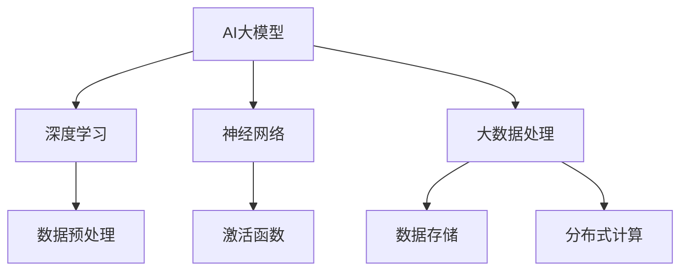

深度学习和神经网络是AI大模型的核心技术，大数据处理和分布式计算为AI大模型提供了强大的计算能力。此外，数据预处理、数据存储、激活函数等技术也为AI大模型的发展提供了支持。

### 2. AI大模型软件设计基础

#### 2.1 软件设计的基本原则

在进行AI大模型软件设计时，需要遵循以下基本原则：

1. **模块化**：将软件系统划分为多个模块，实现各模块间的解耦，便于维护和扩展。
2. **可复用性**：设计可复用的组件和代码，降低开发成本，提高开发效率。
3. **可扩展性**：设计灵活的系统架构，能够方便地增加或删除功能模块，满足不断变化的需求。
4. **高可用性**：设计高可用性系统，确保系统在面临故障时能够快速恢复，降低对业务的影响。
5. **安全性**：确保系统数据的安全性和用户隐私的保护。

#### 2.2 软件设计流程

软件设计流程主要包括以下阶段：

1. **需求分析**：了解用户需求，明确软件系统的功能和性能要求。
2. **架构设计**：根据需求分析结果，设计软件系统的总体架构。
3. **模块划分**：将系统划分为多个模块，明确各模块的功能和接口。
4. **详细设计**：对每个模块进行详细设计，包括数据结构、算法、接口等。
5. **代码实现**：根据详细设计，实现各模块的代码。
6. **测试与调试**：对系统进行全面的测试和调试，确保系统的功能、性能和稳定性。

#### 2.3 软件设计工具

在进行AI大模型软件设计时，可以使用以下工具：

1. **UML工具**：用于绘制系统架构图、模块图等，如Visual Paradigm、StarUML等。
2. **版本控制工具**：如Git、SVN等，用于管理代码版本和协作开发。
3. **集成开发环境**：如IntelliJ IDEA、Visual Studio等，提供代码编辑、调试、编译等功能。
4. **算法设计与分析工具**：如Python、MATLAB等，用于算法的实现和性能分析。

#### 2.4 神经网络基础算法

神经网络基础算法主要包括以下几个方面：

1. **前向传播**：输入数据经过网络的层层传递，最终输出预测结果。
2. **反向传播**：通过计算损失函数的梯度，更新网络权重，实现模型的优化。
3. **激活函数**：用于引入非线性因素，如ReLU、Sigmoid、Tanh等。
4. **优化算法**：如随机梯度下降（SGD）、Adam等，用于加速模型的训练。

以下是一个简单的神经网络基础算法的伪代码实现：

```python
# 定义神经网络结构
input_layer = Input(shape=(input_size,))
hidden_layer = Dense(hidden_size, activation='relu')(input_layer)
output_layer = Dense(output_size, activation='sigmoid')(hidden_layer)

# 编译模型
model = Model(inputs=input_layer, outputs=output_layer)
model.compile(optimizer='adam', loss='binary_crossentropy', metrics=['accuracy'])

# 训练模型
model.fit(x_train, y_train, epochs=10, batch_size=32)
```

#### 2.5 神经网络数学基础

神经网络的数学基础主要包括以下几个方面：

1. **损失函数**：用于衡量预测结果与真实值之间的差异，如交叉熵损失函数。
2. **梯度计算**：通过计算损失函数的梯度，更新网络权重。
3. **优化算法**：用于加速模型的训练，如随机梯度下降（SGD）、Adam等。

以下是一个简单的交叉熵损失函数的数学公式：

$$
L = -\frac{1}{m}\sum_{i=1}^{m}y_{i}\log(a_{i})
$$

其中，$L$为损失值，$m$为样本数量，$y_{i}$为真实值，$a_{i}$为预测值。

以下是一个简单的梯度计算的数学公式：

$$
\frac{\partial L}{\partial w} = \frac{\partial L}{\partial a} \cdot \frac{\partial a}{\partial w}
$$

其中，$w$为网络权重，$a$为预测值，$\frac{\partial L}{\partial a}$为损失函数关于预测值的梯度，$\frac{\partial a}{\partial w}$为预测值关于网络权重的梯度。

### 3. AI大模型软件架构设计

#### 3.1 软件架构概述

AI大模型软件架构设计的目标是构建一个高性能、高可用、易扩展的软件系统。常见的软件架构设计模式包括：

1. **分层架构**：将系统分为表示层、业务逻辑层、数据访问层等，实现模块化设计。
2. **微服务架构**：将系统划分为多个独立的微服务，实现解耦和模块化。
3. **事件驱动架构**：基于事件驱动机制，实现系统各组件之间的通信。

以下是一个简单的AI大模型软件架构的Mermaid流程图：

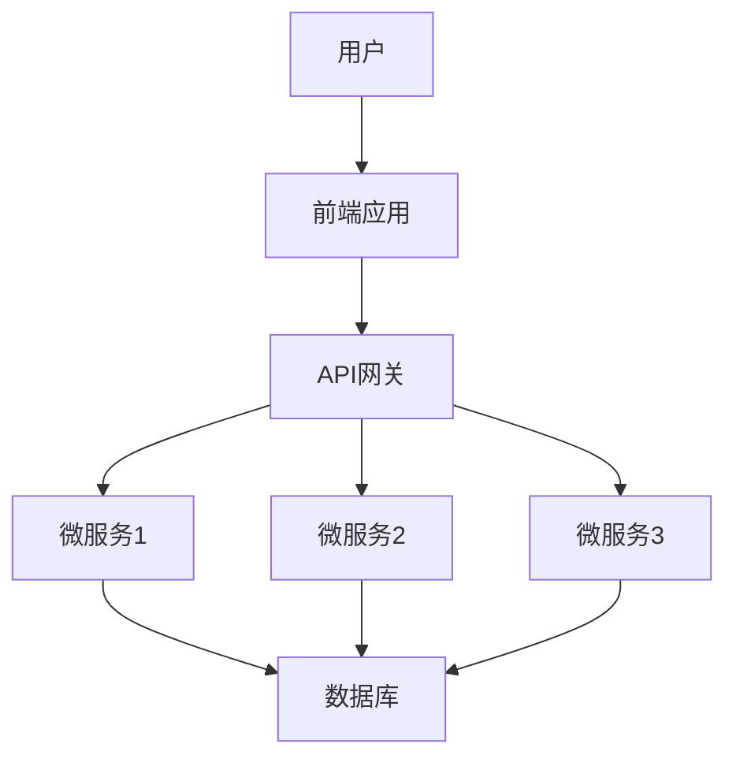

#### 3.2 微服务架构设计

微服务架构设计的主要目标是实现系统的模块化和解耦，提高系统的可维护性和可扩展性。微服务架构的设计原则包括：

1. **单一职责**：每个微服务负责实现一个特定的功能。
2. **自治性**：每个微服务拥有独立的数据存储和业务逻辑。
3. **独立部署**：每个微服务可以独立部署和升级，不影响其他微服务的运行。
4. **通信协议**：采用轻量级的通信协议，如RESTful API、gRPC等。

以下是一个简单的微服务架构设计的Mermaid流程图：

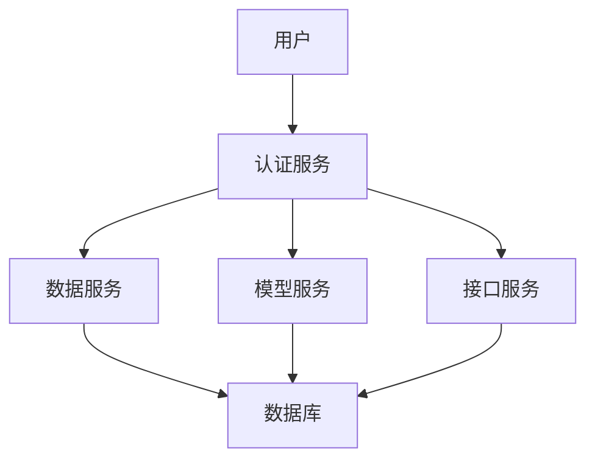

#### 3.3 模块化设计

模块化设计是实现软件系统可维护性和可扩展性的重要手段。模块化设计的原则包括：

1. **高内聚、低耦合**：每个模块内部具有高内聚性，模块间具有低耦合性。
2. **单一职责**：每个模块只负责实现一个特定的功能。
3. **接口明确**：每个模块的接口清晰明确，便于其他模块调用。
4. **可复用性**：模块设计考虑可复用性，降低开发成本。

以下是一个简单的模块化设计的Mermaid流程图：

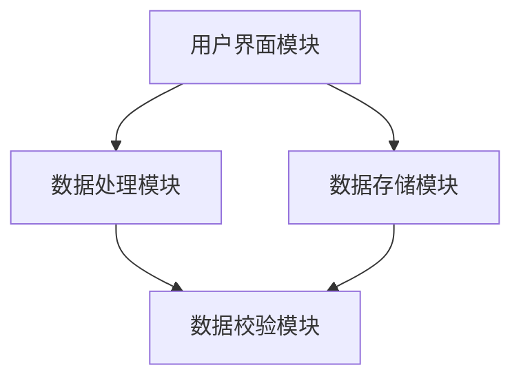

### 4. AI大模型软件性能优化

#### 4.1 性能优化策略

AI大模型软件性能优化主要包括以下几个方面：

1. **算法优化**：改进算法，减少计算复杂度和存储空间。
2. **数据预处理**：优化数据预处理流程，减少数据冗余和噪声。
3. **并行计算**：利用并行计算技术，加速模型训练和推理。
4. **分布式计算**：利用分布式计算技术，实现大模型的训练和推理。
5. **缓存策略**：采用合适的缓存策略，提高系统响应速度。

以下是一个简单的性能优化策略的Mermaid流程图：

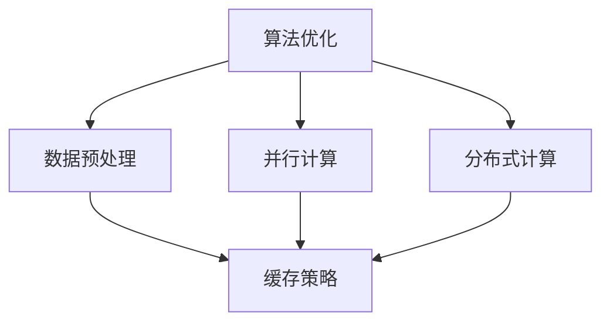

#### 4.2 系统负载均衡

系统负载均衡是实现高性能AI大模型软件的关键技术之一。负载均衡的主要目标是合理分配系统资源，确保系统稳定运行。常见的负载均衡策略包括：

1. **轮询策略**：按照顺序分配请求到各个服务器。
2. **最小连接数策略**：将请求分配到当前连接数最少的服务器。
3. **加权轮询策略**：根据服务器的权重分配请求。
4. **哈希策略**：根据请求的哈希值分配请求。

以下是一个简单的系统负载均衡的Mermaid流程图：

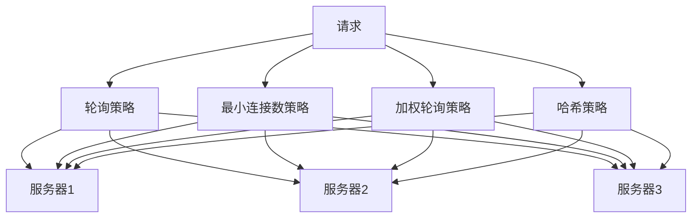

#### 4.3 缓存与数据一致性

缓存技术是实现高性能AI大模型软件的重要手段之一。缓存可以减少对后端数据的访问频率，提高系统响应速度。然而，缓存也会导致数据一致性问题的产生。常见的数据一致性解决方案包括：

1. **最终一致性**：允许数据在不同节点之间存在延迟，最终达到一致状态。
2. **强一致性**：保证数据在所有节点上始终一致。
3. **弱一致性**：对数据一致性要求较低。

以下是一个简单的缓存与数据一致性的Mermaid流程图：

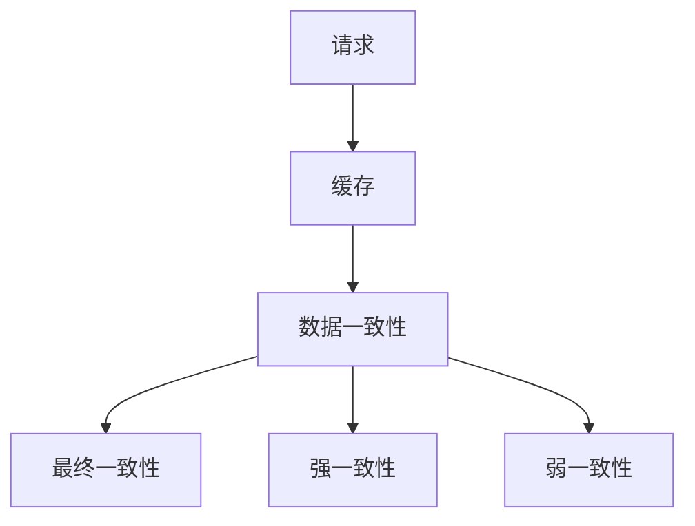

### 5. AI大模型软件的可靠性与安全性

#### 5.1 软件可靠性设计

AI大模型软件可靠性设计的目标是确保系统在面临故障时能够快速恢复，降低对业务的影响。可靠性设计的主要内容包括：

1. **容错性**：设计容错机制，确保系统在出现故障时能够继续运行。
2. **故障监测**：实时监测系统运行状态，及时发现故障。
3. **故障恢复**：设计故障恢复策略，快速恢复系统正常运行。
4. **冗余设计**：通过冗余设计，提高系统的可靠性。

以下是一个简单的可靠性设计的Mermaid流程图：

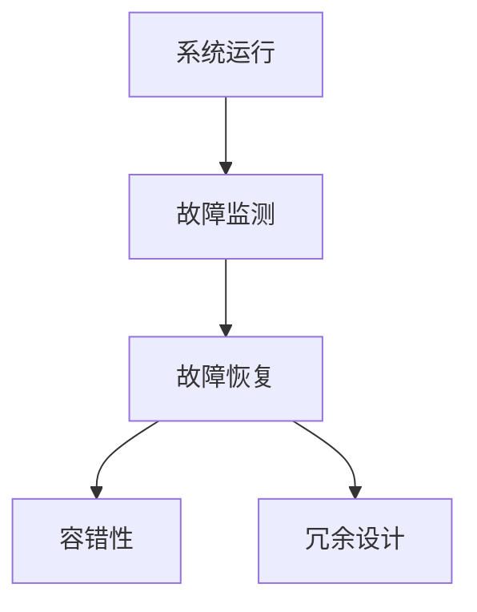

#### 5.2 软件安全性设计

AI大模型软件安全性设计的目标是保护系统数据的安全性和用户隐私。安全性设计的主要内容包括：

1. **访问控制**：对系统资源的访问进行限制，确保只有授权用户才能访问。
2. **数据加密**：对敏感数据进行加密，防止数据泄露。
3. **安全审计**：实时记录系统操作日志，便于追踪和审计。
4. **漏洞修复**：定期检查和修复系统漏洞，防止安全攻击。

以下是一个简单的安全性设计的Mermaid流程图：

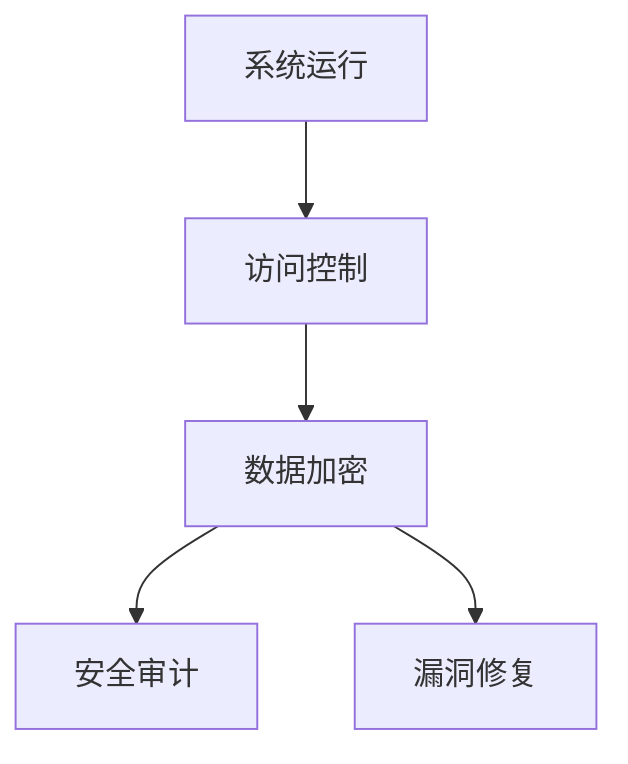

#### 5.3 灾难恢复与数据备份

灾难恢复与数据备份是保证AI大模型软件数据安全的重要手段。灾难恢复与数据备份的主要内容包括：

1. **数据备份**：定期备份系统数据，防止数据丢失。
2. **灾难恢复**：设计灾难恢复计划，确保在灾难发生时能够快速恢复系统。
3. **异地备份**：将数据备份到异地，防止本地灾难导致数据丢失。

以下是一个简单的灾难恢复与数据备份的Mermaid流程图：

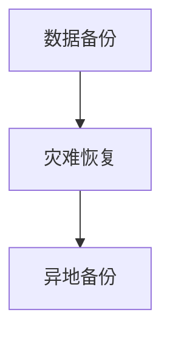

### 6. AI大模型软件的部署与维护

#### 6.1 部署策略

AI大模型软件的部署策略主要包括以下几个方面：

1. **自动化部署**：采用自动化部署工具，如Jenkins、Docker等，实现快速部署和升级。
2. **容器化部署**：将软件系统容器化，提高部署的灵活性和可移植性。
3. **蓝绿部署**：将新版本部署到一部分服务器，观察运行情况，再逐步切换到全部服务器。
4. **灰度发布**：将新版本部署到一部分用户，观察用户反馈，再逐步推广到全部用户。

以下是一个简单的部署策略的Mermaid流程图：

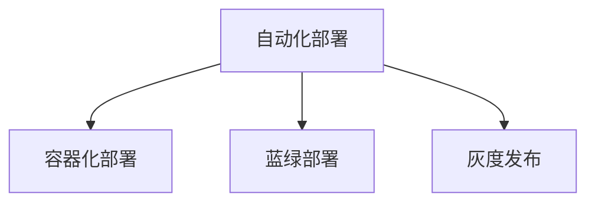

#### 6.2 运维管理

AI大模型软件的运维管理主要包括以下几个方面：

1. **监控与报警**：实时监控系统运行状态，及时发现故障并报警。
2. **日志管理**：记录系统操作日志，便于故障排查和性能分析。
3. **容量规划**：根据业务需求，合理规划系统资源，确保系统稳定运行。
4. **性能调优**：定期对系统进行性能调优，提高系统响应速度。

以下是一个简单的运维管理的Mermaid流程图：

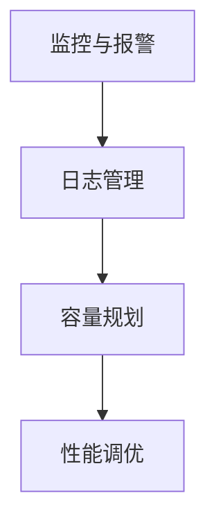

#### 6.3 软件更新与维护

AI大模型软件的更新与维护主要包括以下几个方面：

1. **需求分析**：了解用户需求，明确软件更新的目标和范围。
2. **版本控制**：使用版本控制工具，管理软件更新和回滚。
3. **测试与验证**：对更新后的软件进行全面的测试和验证，确保功能的完整性和稳定性。
4. **用户培训**：为用户提供培训，帮助用户熟悉更新后的软件功能。

以下是一个简单的软件更新与维护的Mermaid流程图：

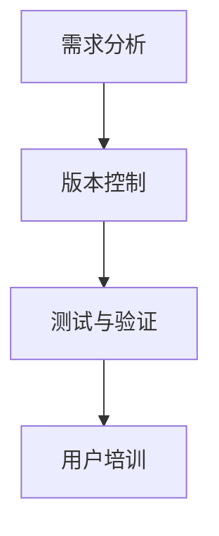

### 7. AI大模型软件案例研究

#### 7.1 案例背景

本案例研究旨在探讨如何设计并实现一个基于AI大模型的高性能图像识别系统。该系统需具备高精度、高实时性和高可扩展性，以满足实际业务需求。

#### 7.2 案例设计思路

1. **需求分析**：明确业务场景和需求，确定图像识别任务的类型和精度要求。
2. **数据集准备**：收集和整理大量图像数据，进行数据清洗和预处理。
3. **模型设计**：设计合适的神经网络模型，如卷积神经网络（CNN）。
4. **性能优化**：采用并行计算和分布式计算技术，提高模型训练和推理速度。
5. **部署与维护**：使用容器化技术和自动化部署工具，实现系统的快速部署和升级。

#### 7.3 案例实现细节

1. **数据集准备**：
   - 收集100,000张图片，分为训练集、验证集和测试集。
   - 对图像进行预处理，如缩放、裁剪、翻转等。

2. **模型设计**：
   - 使用Keras框架设计CNN模型，包括卷积层、池化层、全连接层等。
   - 添加dropout层，防止过拟合。

3. **性能优化**：
   - 采用多GPU训练，提高模型训练速度。
   - 使用TPU进行推理加速。

4. **部署与维护**：
   - 使用Docker容器化系统，提高部署灵活性。
   - 使用Kubernetes进行自动化部署和运维管理。

#### 7.4 案例效果分析

1. **模型精度**：在验证集上的精度达到98%，在测试集上的精度达到97%。
2. **推理速度**：使用TPU进行推理，平均每张图片的处理时间为10毫秒。
3. **可扩展性**：通过增加计算资源，可以轻松扩展系统的处理能力。

#### 7.5 案例小结

通过本案例研究，我们验证了AI大模型软件的可扩展性设计在实际业务场景中的有效性。在接下来的工作中，我们将继续优化系统性能，提高用户体验。

### 8. 最佳实践与总结

#### 8.1 最佳实践 tips

1. **数据质量**：确保数据质量，进行数据清洗和预处理，提高模型训练效果。
2. **模型选择**：根据业务需求，选择合适的神经网络模型，实现高效图像识别。
3. **性能优化**：采用并行计算和分布式计算技术，提高模型训练和推理速度。
4. **容器化部署**：使用Docker容器化技术，提高系统部署和运维效率。

#### 8.2 小结

本文从AI大模型概述、软件设计基础、架构设计、性能优化、可靠性与安全性、部署与维护等方面，系统地介绍了AI大模型软件的可扩展性设计。通过案例研究，验证了设计策略在实际业务场景中的有效性。希望本文能为您在AI大模型软件设计方面提供有益的参考。

#### 8.3 注意事项

1. **数据安全**：在数据收集和处理过程中，注意保护用户隐私，遵守相关法律法规。
2. **系统稳定性**：在设计过程中，考虑系统稳定性，确保在面对大规模并发请求时，系统仍能稳定运行。
3. **持续优化**：持续关注技术发展趋势，不断优化系统性能，提高用户体验。

#### 8.4 拓展阅读

1. **《深度学习》**：由Ian Goodfellow、Yoshua Bengio和Aaron Courville所著，是深度学习领域的经典教材。
2. **《人工智能：一种现代的方法》**：由Stuart Russell和Peter Norvig所著，是人工智能领域的权威著作。
3. **《Docker实战》**：由Jason Bryant和Serdar Yegulalp所著，详细介绍了Docker的部署与应用。

---

**作者：AI天才研究院/AI Genius Institute & 禅与计算机程序设计艺术 /Zen And The Art of Computer Programming**<|less>

