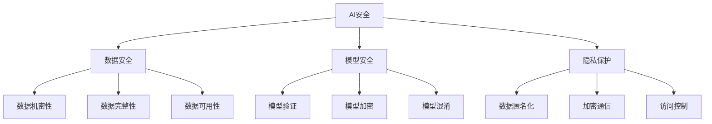
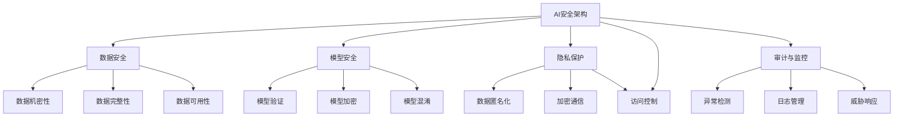
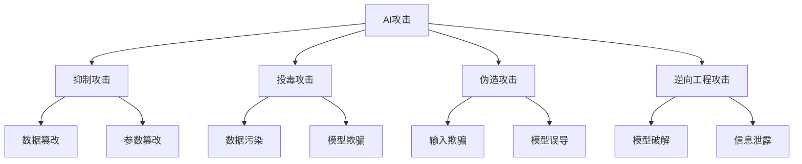
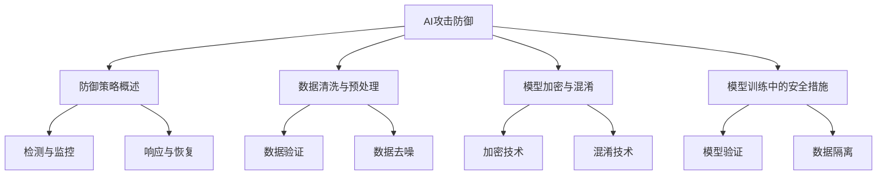

                 


### 第一部分：AI安全概述

#### 第1章：AI安全的重要性

**背景介绍**

随着人工智能（AI）技术的迅猛发展，AI在各个领域的应用日益广泛，从自动化、医疗诊断、金融分析到自动驾驶等。然而，AI技术的广泛应用也带来了新的安全挑战。AI安全的重要性在于确保AI系统在提供便利和效率的同时，不会泄露敏感信息、被恶意利用或被攻击。本文将深入探讨AI安全的核心概念、关键挑战及其历史与发展。

**核心概念与联系**

AI安全涉及多个核心概念，包括数据安全、模型安全、隐私保护等。数据安全主要关注如何保护训练数据和输入数据的机密性、完整性和可用性。模型安全则关注如何防止AI模型被篡改、逆向工程或遭受攻击。隐私保护是确保用户数据在使用AI系统过程中不被泄露或滥用。

这些核心概念之间有着紧密的联系。数据安全是AI安全的基础，因为训练数据的质量直接影响AI模型的性能和可靠性。模型安全是数据安全的延伸，因为一个不安全的模型可能会泄露敏感信息或被恶意利用。隐私保护则是在数据安全和模型安全的基础上，确保用户数据不被滥用。

**Mermaid 流程图**



**核心算法原理讲解**

数据安全、模型安全和隐私保护的实施通常需要一系列核心算法和技术的支持。例如，数据加密、访问控制、模型混淆等。以下是一个简单的伪代码示例，展示了如何使用加密技术来保护数据：

```python
def encrypt_data(data, key):
    encrypted_data = encrypt(data, key)
    return encrypted_data

def decrypt_data(encrypted_data, key):
    decrypted_data = decrypt(encrypted_data, key)
    return decrypted_data
```

这里，`encrypt` 和 `decrypt` 函数是加密和解密的核心算法。它们通过使用加密密钥来确保数据的机密性。

**数学模型和公式**

在AI安全中，一些数学模型和公式也非常重要。例如，加密算法的复杂度分析通常使用Big O符号来表示。以下是一个简单的示例：

$$
\text{Time Complexity} = O(n^2)
$$

这个公式表示，加密和解密算法的时间复杂度与输入数据的长度n的平方成正比。

**详细讲解和举例说明**

以数据加密为例，假设我们有一个包含100个字符的敏感数据集。我们可以使用AES加密算法来加密这个数据集。AES算法的加密过程如下：

1. 初始化加密密钥。
2. 将数据分成若干个块，每个块的大小为128位。
3. 对每个块进行加密，生成加密块。
4. 将所有加密块拼接起来，得到加密后的数据。

以下是一个简化的伪代码示例：

```python
def aes_encrypt(data, key):
    blocks = divide_into_blocks(data, block_size=128)
    encrypted_blocks = []
    for block in blocks:
        encrypted_block = aes_encrypt_block(block, key)
        encrypted_blocks.append(encrypted_block)
    encrypted_data = concatenate(encrypted_blocks)
    return encrypted_data
```

在这个示例中，`divide_into_blocks` 函数将数据分成多个128位的块，`aes_encrypt_block` 函数对每个块进行加密，`concatenate` 函数将加密后的块拼接起来。

**数学公式**

在AI安全中，一些数学公式和定理也是至关重要的。例如，在密码学中，线性方程组求解是一个基本问题。以下是一个简化的线性方程组：

$$
\begin{cases}
a_1x + b_1y = c_1 \\
a_2x + b_2y = c_2 \\
\end{cases}
$$

我们可以使用高斯消元法来求解这个方程组。以下是一个简化的伪代码示例：

```python
def solve_linear_equation_system(A, B):
    # A是系数矩阵，B是常数向量
    # 返回解向量X
    X = gauss_elimination(A, B)
    return X
```

在这个示例中，`gauss_elimination` 函数实现高斯消元法的求解过程。

**项目实战**

以一个简单的数据加密项目为例，我们可以使用Python来实现一个AES加密工具。以下是一个简单的项目描述：

**项目名称**：AES加密工具

**开发环境**：Python 3.8

**源代码实现**：

```python
from Crypto.Cipher import AES
from Crypto.Util.Padding import pad, unpad
from Crypto.Random import get_random_bytes

def encrypt_data(data, key):
    cipher = AES.new(key, AES.MODE_CBC)
    ct_bytes = cipher.encrypt(pad(data, AES.block_size))
    iv = cipher.iv
    return iv + ct_bytes

def decrypt_data(ct, key, iv):
    ct = ct[iv_len:]  # 去除iv
    cipher = AES.new(key, AES.MODE_CBC, iv)
    pt = unpad(cipher.decrypt(ct), AES.block_size)
    return pt

if __name__ == '__main__':
    key = get_random_bytes(16)
    data = b'This is a secret message'
    iv = get_random_bytes(16)

    encrypted_data = encrypt_data(data, key)
    print(f'Encrypted Data: {encrypted_data.hex()}')

    decrypted_data = decrypt_data(encrypted_data, key, iv)
    print(f'Decrypted Data: {decrypted_data.hex()}')
```

**代码解读与分析**

在这个项目中，我们首先导入了AES加密库和辅助函数库。`encrypt_data` 函数负责加密数据，它首先创建一个AES加密对象，然后使用填充函数`pad`将数据进行填充，以确保数据块的大小符合AES算法的要求。接着，加密对象对填充后的数据进行加密，并将加密后的数据和初始化向量（IV）拼接在一起返回。

`decrypt_data` 函数负责解密数据，它首先从加密数据中提取出初始化向量，然后创建一个AES解密对象，并使用解密函数`decrypt`来解密数据。最后，使用辅助函数`unpad`来去除填充的数据。

**实际案例分析和详细讲解剖析**

假设我们有一个包含敏感信息的文件，我们需要对这个文件进行加密以保护其安全性。以下是一个实际案例的步骤：

1. 生成一个随机密钥和初始化向量。
2. 使用加密函数对文件数据进行加密。
3. 将加密后的数据和初始化向量保存到文件中。
4. 当需要解密数据时，从文件中读取加密数据和初始化向量。
5. 使用解密函数对数据解密，并恢复原始数据。

**项目小结**

通过这个简单的项目，我们可以看到如何使用Python和AES加密算法来实现数据加密。在实际应用中，加密过程需要考虑到更多的安全性和性能优化，例如使用更复杂的加密模式和更高效的算法。

**最佳实践 Tips**

- 在选择加密算法时，应考虑其安全性和性能。
- 确保密钥和初始化向量是随机生成的，并且足够复杂，以防止被猜测。
- 定期更换密钥和初始化向量，以提高安全性。
- 对加密算法的参数进行优化，以减少加密和解密的时间。

#### 第2章：AI安全架构与体系

**背景介绍**

AI安全架构与体系是确保AI系统安全的关键组成部分。随着AI技术的不断发展，AI系统面临着越来越多的安全威胁，包括数据泄露、模型篡改和恶意攻击等。因此，设计一个全面、灵活且可扩展的AI安全架构至关重要。本章将介绍AI安全架构的概述，重点讨论数据安全、模型安全和边缘安全。

**核心概念与联系**

AI安全架构包括多个层次，每个层次都有特定的安全需求和解决方案。核心概念与联系如下：

1. **数据安全**：数据是AI系统的核心资产，必须确保其机密性、完整性和可用性。
2. **模型安全**：AI模型需要保护免受篡改、逆向工程和恶意攻击。
3. **隐私保护**：在处理用户数据时，需要确保数据隐私不被泄露。
4. **访问控制**：确保只有授权用户可以访问AI系统的资源和数据。
5. **审计与监控**：实时监控AI系统的活动，确保异常行为能够被及时发现和处理。

这些核心概念相互关联，共同构成一个完整的AI安全体系。例如，数据安全和模型安全共同保护AI系统的核心资产，而隐私保护和访问控制则确保用户数据的安全和合规性。

**Mermaid 流程图**



**核心算法原理讲解**

AI安全架构的实施通常需要依赖一系列核心算法和技术。以下是一个简化的伪代码示例，展示了如何使用加密算法和访问控制来保护数据：

```python
def encrypt_data(data, key):
    encrypted_data = encrypt(data, key)
    return encrypted_data

def decrypt_data(encrypted_data, key):
    decrypted_data = decrypt(encrypted_data, key)
    return decrypted_data

def check_permission(user, resource):
    if user in authorized_users(resource):
        return True
    return False
```

在这里，`encrypt` 和 `decrypt` 函数是加密和解密的核心算法。它们通过使用加密密钥来确保数据的机密性。`check_permission` 函数则实现了访问控制，它检查用户是否具有对特定资源的访问权限。

**数学模型和公式**

在AI安全中，一些数学模型和公式也非常重要。例如，在密码学中，线性方程组求解是一个基本问题。以下是一个简化的线性方程组：

$$
\begin{cases}
a_1x + b_1y = c_1 \\
a_2x + b_2y = c_2 \\
\end{cases}
$$

我们可以使用高斯消元法来求解这个方程组。以下是一个简化的伪代码示例：

```python
def solve_linear_equation_system(A, B):
    # A是系数矩阵，B是常数向量
    # 返回解向量X
    X = gauss_elimination(A, B)
    return X
```

在这个示例中，`gauss_elimination` 函数实现高斯消元法的求解过程。

**详细讲解和举例说明**

以数据加密为例，假设我们有一个包含100个字符的敏感数据集。我们可以使用AES加密算法来加密这个数据集。AES算法的加密过程如下：

1. 初始化加密密钥。
2. 将数据分成若干个块，每个块的大小为128位。
3. 对每个块进行加密，生成加密块。
4. 将所有加密块拼接起来，得到加密后的数据。

以下是一个简化的伪代码示例：

```python
def aes_encrypt(data, key):
    blocks = divide_into_blocks(data, block_size=128)
    encrypted_blocks = []
    for block in blocks:
        encrypted_block = aes_encrypt_block(block, key)
        encrypted_blocks.append(encrypted_block)
    encrypted_data = concatenate(encrypted_blocks)
    return encrypted_data
```

在这个示例中，`divide_into_blocks` 函数将数据分成多个128位的块，`aes_encrypt_block` 函数对每个块进行加密，`concatenate` 函数将加密后的块拼接起来。

**数学公式**

在AI安全中，一些数学公式和定理也是至关重要的。例如，在密码学中，线性方程组求解是一个基本问题。以下是一个简化的线性方程组：

$$
\begin{cases}
a_1x + b_1y = c_1 \\
a_2x + b_2y = c_2 \\
\end{cases}
$$

我们可以使用高斯消元法来求解这个方程组。以下是一个简化的伪代码示例：

```python
def solve_linear_equation_system(A, B):
    # A是系数矩阵，B是常数向量
    # 返回解向量X
    X = gauss_elimination(A, B)
    return X
```

在这个示例中，`gauss_elimination` 函数实现高斯消元法的求解过程。

**项目实战**

以一个简单的数据加密项目为例，我们可以使用Python来实现一个AES加密工具。以下是一个简单的项目描述：

**项目名称**：AES加密工具

**开发环境**：Python 3.8

**源代码实现**：

```python
from Crypto.Cipher import AES
from Crypto.Util.Padding import pad, unpad
from Crypto.Random import get_random_bytes

def encrypt_data(data, key):
    cipher = AES.new(key, AES.MODE_CBC)
    ct_bytes = cipher.encrypt(pad(data, AES.block_size))
    iv = cipher.iv
    return iv + ct_bytes

def decrypt_data(ct, key, iv):
    ct = ct[iv_len:]  # 去除iv
    cipher = AES.new(key, AES.MODE_CBC, iv)
    pt = unpad(cipher.decrypt(ct), AES.block_size)
    return pt

if __name__ == '__main__':
    key = get_random_bytes(16)
    data = b'This is a secret message'
    iv = get_random_bytes(16)

    encrypted_data = encrypt_data(data, key)
    print(f'Encrypted Data: {encrypted_data.hex()}')

    decrypted_data = decrypt_data(encrypted_data, key, iv)
    print(f'Decrypted Data: {decrypted_data.hex()}')
```

**代码解读与分析**

在这个项目中，我们首先导入了AES加密库和辅助函数库。`encrypt_data` 函数负责加密数据，它首先创建一个AES加密对象，然后使用填充函数`pad`将数据进行填充，以确保数据块的大小符合AES算法的要求。接着，加密对象对填充后的数据进行加密，并将加密后的数据和初始化向量（IV）拼接在一起返回。

`decrypt_data` 函数负责解密数据，它首先从加密数据中提取出初始化向量，然后创建一个AES解密对象，并使用解密函数`decrypt`来解密数据。最后，使用辅助函数`unpad`来去除填充的数据。

**实际案例分析和详细讲解剖析**

假设我们有一个包含敏感信息的文件，我们需要对这个文件进行加密以保护其安全性。以下是一个实际案例的步骤：

1. 生成一个随机密钥和初始化向量。
2. 使用加密函数对文件数据进行加密。
3. 将加密后的数据和初始化向量保存到文件中。
4. 当需要解密数据时，从文件中读取加密数据和初始化向量。
5. 使用解密函数对数据解密，并恢复原始数据。

**项目小结**

通过这个简单的项目，我们可以看到如何使用Python和AES加密算法来实现数据加密。在实际应用中，加密过程需要考虑到更多的安全性和性能优化，例如使用更复杂的加密模式和更高效的算法。

**最佳实践 Tips**

- 在选择加密算法时，应考虑其安全性和性能。
- 确保密钥和初始化向量是随机生成的，并且足够复杂，以防止被猜测。
- 定期更换密钥和初始化向量，以提高安全性。
- 对加密算法的参数进行优化，以减少加密和解密的时间。

#### 第3章：常见AI攻击手段

**背景介绍**

随着人工智能（AI）技术的广泛应用，AI系统面临着越来越多的安全威胁。了解常见的AI攻击手段对于设计有效的防御策略至关重要。本章将介绍几种常见的AI攻击手段，包括抑制攻击、投毒攻击、伪造攻击和逆向工程攻击。

**核心概念与联系**

这些攻击手段的核心概念和联系如下：

1. **抑制攻击**：通过修改训练数据或模型参数来降低AI系统的性能。
2. **投毒攻击**：在训练数据中插入恶意数据，以影响模型的预测结果。
3. **伪造攻击**：通过伪造输入数据欺骗AI系统，使其执行非预期的操作。
4. **逆向工程攻击**：通过分析AI模型的内部结构和参数来窃取敏感信息或篡改模型。

这些攻击手段之间存在一定的关联。例如，投毒攻击和抑制攻击都可能影响模型的性能，而伪造攻击和逆向工程攻击则更关注于欺骗和窃取信息。

**Mermaid 流程图**



**核心算法原理讲解**

为了更好地理解这些攻击手段，我们可以通过伪代码和数学模型来讲解其核心算法原理。

**抑制攻击**

抑制攻击的核心在于修改训练数据或模型参数，以降低模型的性能。以下是一个简化的伪代码示例：

```python
def suppress_training_data(data, target_performance):
    # 修改训练数据，以降低模型性能
    modified_data = modify_data(data, target_performance)
    return modified_data

def suppress_model_params(model, target_performance):
    # 修改模型参数，以降低模型性能
    modified_model = modify_params(model, target_performance)
    return modified_model
```

在这个示例中，`modify_data` 和 `modify_params` 函数是抑制攻击的核心算法。它们通过调整数据或参数来降低模型的性能。

**投毒攻击**

投毒攻击的核心在于在训练数据中插入恶意数据，以影响模型的预测结果。以下是一个简化的伪代码示例：

```python
def poison_training_data(data, poison_data, poison_rate):
    # 在训练数据中插入恶意数据
    poisoned_data = insert_poison(data, poison_data, poison_rate)
    return poisoned_data

def poison_model_output(model, poison_input, poison_output):
    # 利用恶意输入欺骗模型输出
    poisoned_output = model(poison_input)
    return poisoned_output
```

在这个示例中，`insert_poison` 和 `poison_model_output` 函数是投毒攻击的核心算法。它们通过在数据中插入恶意数据和欺骗模型输出来实现攻击。

**伪造攻击**

伪造攻击的核心在于通过伪造输入数据欺骗AI系统，使其执行非预期的操作。以下是一个简化的伪代码示例：

```python
def forge_input_data(model, expected_output, attack_target):
    # 伪造输入数据，以欺骗模型输出
    forged_input = generate_forged_input(model, expected_output, attack_target)
    return forged_input

def perform_unexpected_action(model, forged_input):
    # 执行非预期的操作
    action = model(forged_input)
    return action
```

在这个示例中，`generate_forged_input` 和 `perform_unexpected_action` 函数是伪造攻击的核心算法。它们通过伪造输入数据和欺骗模型输出来实现攻击。

**逆向工程攻击**

逆向工程攻击的核心在于通过分析AI模型的内部结构和参数来窃取敏感信息或篡改模型。以下是一个简化的伪代码示例：

```python
def reverse_engineer_model(model):
    # 分析模型内部结构
    internal_structure = analyze_model_structure(model)
    return internal_structure

def extract_sensitive_info(model, internal_structure):
    # 从模型中提取敏感信息
    sensitive_info = extract_info(internal_structure)
    return sensitive_info

def modify_model_params(model, new_params):
    # 修改模型参数
    modified_model = apply_params(model, new_params)
    return modified_model
```

在这个示例中，`analyze_model_structure`、`extract_info` 和 `apply_params` 函数是逆向工程攻击的核心算法。它们通过分析模型结构、提取敏感信息和修改模型参数来实现攻击。

**数学模型和公式**

在AI攻击中，一些数学模型和公式也非常重要。例如，在投毒攻击中，可以使用概率分布模型来描述恶意数据的插入方式。以下是一个简化的概率分布模型：

$$
P(\text{malicious\_data}) = \alpha P(\text{original\_data}) + (1 - \alpha) P(\text{clean\_data})
$$

在这个模型中，$\alpha$ 是恶意数据在总数据中的比例，$P(\text{malicious\_data})$ 是恶意数据的概率分布，$P(\text{original\_data})$ 是原始数据的概率分布，$P(\text{clean\_data})$ 是干净数据的概率分布。

**详细讲解和举例说明**

以投毒攻击为例，假设我们有一个包含100个样本的训练数据集。我们可以使用以下策略来实施投毒攻击：

1. 选择20个样本作为恶意数据。
2. 将这些恶意数据插入到原始数据集中，使恶意数据占总数据集的20%。
3. 使用受污染的数据集训练模型。

以下是一个简化的伪代码示例：

```python
def poison_training_data(data, poison_samples, poison_rate):
    # 插入恶意数据到训练数据集
    poisoned_data = data.copy()
    for sample in poison_samples:
        poisoned_data.append(sample)
    poisoned_data = shuffle(poisoned_data)
    return poisoned_data

# 假设我们有20个恶意样本
malicious_samples = generate_malicious_samples(20)

# 插入恶意样本到原始数据集
poisoned_data = poison_training_data(original_data, malicious_samples, poison_rate=0.2)
```

**数学公式**

在AI攻击中，一些数学公式和定理也非常重要。例如，在抑制攻击中，可以使用线性回归模型来描述模型性能的降低。以下是一个简化的线性回归模型：

$$
\text{performance} = \beta_0 + \beta_1 \times \text{data\_modification} + \epsilon
$$

在这个模型中，$\beta_0$ 是模型的初始性能，$\beta_1$ 是数据修改对性能的影响，$\epsilon$ 是随机误差。

**项目实战**

以一个简单的抑制攻击项目为例，我们可以使用Python来实现一个抑制训练数据的工具。以下是一个简单的项目描述：

**项目名称**：抑制攻击工具

**开发环境**：Python 3.8

**源代码实现**：

```python
import numpy as np
import pandas as pd
from sklearn.linear_model import LinearRegression

def suppress_training_data(data, target_performance):
    # 修改训练数据，以降低模型性能
    modified_data = data.copy()
    for column in modified_data.columns:
        mean_value = modified_data[column].mean()
        std_value = modified_data[column].std()
        modified_data[column] = mean_value - target_performance * std_value
    return modified_data

def train_model(data):
    # 训练线性回归模型
    model = LinearRegression()
    model.fit(data.iloc[:, :-1], data.iloc[:, -1])
    return model

if __name__ == '__main__':
    # 加载示例数据集
    data = pd.read_csv('example_dataset.csv')

    # 抑制训练数据
    suppressed_data = suppress_training_data(data, target_performance=0.1)

    # 训练模型
    model = train_model(suppressed_data)

    # 预测结果
    predictions = model.predict(suppressed_data.iloc[:, :-1])
    print(f'Predictions: {predictions}')
```

**代码解读与分析**

在这个项目中，我们首先导入了NumPy、Pandas和线性回归库。`suppress_training_data` 函数负责抑制训练数据，它通过调整数据列的值来降低模型性能。`train_model` 函数负责训练线性回归模型。

**实际案例分析和详细讲解剖析**

假设我们有一个包含销售数据的示例数据集。我们的目标是训练一个线性回归模型来预测销售额。然而，我们希望通过抑制攻击来降低模型的性能。以下是一个实际案例的步骤：

1. 加载示例数据集。
2. 使用抑制攻击工具抑制训练数据。
3. 训练线性回归模型。
4. 预测结果并比较抑制前后的性能。

**项目小结**

通过这个简单的项目，我们可以看到如何使用Python和线性回归模型来实施抑制攻击。在实际应用中，抑制攻击可能需要更复杂的算法和技术，例如神经网络和优化算法。

**最佳实践 Tips**

- 在设计AI系统时，应考虑到潜在的安全威胁，并采取相应的防御措施。
- 定期对训练数据和模型进行审查，以检测和防止潜在的攻击。
- 使用复杂的加密算法和密钥管理策略来保护数据。
- 定期更新和升级AI系统的安全措施，以应对新的攻击手段。

#### 第4章：AI攻击防御方法

**背景介绍**

随着AI技术的快速发展，AI系统面临的安全威胁日益增加。为了保护AI系统免受攻击，需要采取一系列有效的防御方法。本章将介绍几种常见的AI攻击防御方法，包括防御策略概述、数据清洗与预处理、模型加密与混淆以及模型训练中的安全措施。

**核心概念与联系**

AI攻击防御方法的核心概念与联系如下：

1. **防御策略概述**：确定防御策略是AI安全的第一步，包括检测、响应和恢复。
2. **数据清洗与预处理**：通过清洗和预处理数据来提高模型的鲁棒性和安全性。
3. **模型加密与混淆**：使用加密和混淆技术来保护模型免受攻击。
4. **模型训练中的安全措施**：在模型训练过程中采取安全措施，以防止恶意数据的影响。

这些防御方法相互补充，共同构成了一个全面的AI安全防御体系。

**Mermaid 流程图**



**核心算法原理讲解**

为了更好地理解这些防御方法，我们可以通过伪代码和数学模型来讲解其核心算法原理。

**防御策略概述**

防御策略概述的核心在于制定一个全面的防御计划，包括检测、响应和恢复。以下是一个简化的伪代码示例：

```python
def defense_strategy(data, model):
    # 检测异常行为
    anomalies = detect_anomalies(data)
    
    # 如果检测到异常行为，进行响应
    if anomalies:
        respond_to_anomaly(data, model)
    
    # 恢复系统
    recover_system(model)
```

在这个示例中，`detect_anomalies`、`respond_to_anomaly` 和 `recover_system` 函数是防御策略的核心算法。它们通过检测异常行为、响应异常情况和恢复系统来保护AI系统。

**数据清洗与预处理**

数据清洗与预处理的核心在于提高数据的可靠性和模型的鲁棒性。以下是一个简化的伪代码示例：

```python
def clean_data(data):
    # 填补缺失值
    data = fill_missing_values(data)
    
    # 去除异常值
    data = remove_outliers(data)
    
    return data

def preprocess_data(data):
    # 标准化或归一化数据
    data = normalize_data(data)
    
    return data
```

在这个示例中，`fill_missing_values`、`remove_outliers` 和 `normalize_data` 函数是数据清洗与预处理的核

