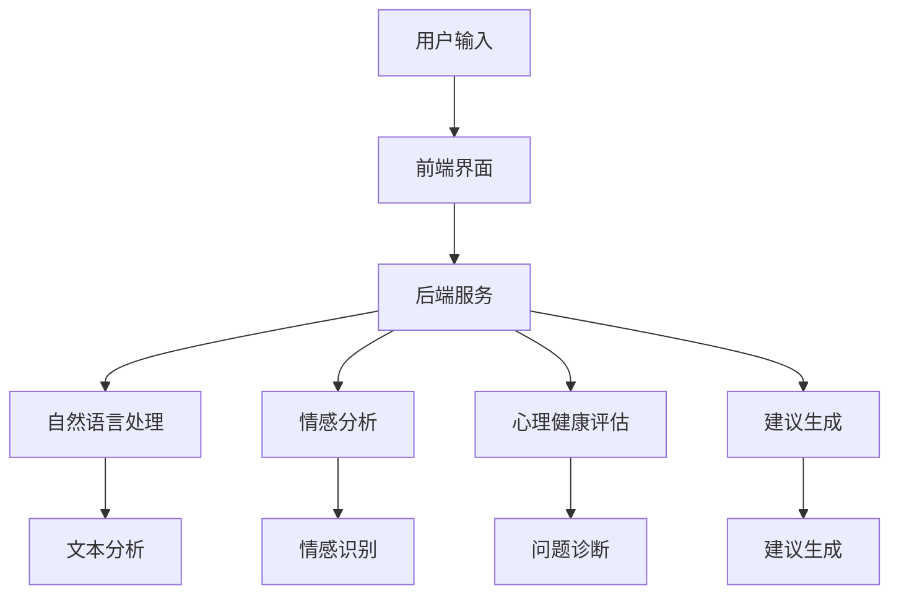

                 

### 文章标题

《AI心理咨询师：提示词应用的伦理与实践》

### 关键词

- AI心理咨询
- 提示词技术
- 伦理问题
- 实践应用
- 心理健康

### 摘要

本文旨在探讨人工智能（AI）在心理咨询中的应用，特别是通过提示词技术实现AI心理咨询师的功能。首先，我们介绍了AI心理咨询师的基本概念和技术原理，包括其架构和核心算法。接着，文章深入分析了AI心理咨询师在应用过程中面临的伦理问题，并提供了相应的案例分析。最后，本文通过实际案例研究和应用实例，展示了AI心理咨询师在不同场景中的具体实践，并探讨了其面临的挑战和未来发展方向。

### 第一部分：技术原理与应用

#### 1.1 AI心理咨询师的概念与架构

##### 1.1.1 AI心理咨询师的基本原理

AI心理咨询师是一种利用人工智能技术，特别是自然语言处理和机器学习算法，来模拟人类心理咨询过程的系统。其核心目标是通过分析用户提供的文本信息，提供个性化、有效的心理咨询和干预。

在基本原理上，AI心理咨询师依赖于以下几个关键模块：

1. **用户输入处理**：系统需要接收并理解用户提供的文本输入，这些输入可以是开放式的文本，如日记、对话记录等。
2. **情感分析**：通过自然语言处理技术，系统可以识别文本中的情感倾向和情绪状态，从而为后续的心理健康评估提供基础。
3. **心理健康评估**：基于情感分析和用户历史数据，系统可以对用户的心理健康状况进行初步评估，并识别可能的心理问题。
4. **建议生成**：根据评估结果，系统会生成个性化的心理咨询建议，包括心理健康知识普及、心理问题解决方案和心理干预策略。

##### 1.1.2 AI心理咨询师的技术架构

AI心理咨询师的技术架构通常包括以下几个关键组成部分：

1. **前端界面**：用户通过网页或移动应用与AI心理咨询师交互，输入文本信息并接收系统回复。
2. **后端服务**：包括自然语言处理模块、情感分析模块、心理健康评估模块和心理咨询建议生成模块。
3. **数据库**：存储用户数据、情感分析结果、评估数据和心理咨询建议，支持数据的查询和更新。

以下是一个简化的技术架构Mermaid流程图：



#### 1.2 提示词技术

##### 1.2.1 提示词的定义与作用

提示词（Prompt Words）是在AI心理咨询师系统中用于引导用户思考和提供信息的关键词语。提示词的设计直接影响系统的交互质量和用户体验。

提示词的主要作用包括：

1. **引导思考**：通过针对性的提示词，系统可以引导用户深入思考自己的情感和心理状态。
2. **提供信息**：提示词可以提供相关的心理健康知识，帮助用户更好地理解自己的情绪和问题。
3. **优化交互**：恰当的提示词可以提高用户与AI心理咨询师的交互效率，增强用户的信任感。

##### 1.2.2 提示词的生成与优化

提示词的生成和优化是AI心理咨询师技术中的关键环节。以下是几个关键步骤：

1. **数据收集**：首先需要收集大量的心理健康相关文本数据，这些数据可以来源于心理健康文章、专业书籍、用户反馈等。
2. **特征提取**：通过自然语言处理技术，提取文本中的关键特征，如情感词汇、主题词等。
3. **模板设计**：设计多种提示词模板，这些模板可以根据不同的心理咨询场景进行灵活调整。
4. **迭代优化**：通过用户反馈和数据分析，不断优化提示词的生成策略和文本质量。

以下是一个简化的提示词生成伪代码示例：

```python
# 提示词生成伪代码

def generate_prompt(data, scenario):
    """
    根据数据和场景生成提示词
    
    :param data: 用户输入数据
    :param scenario: 场景信息
    :return: 提示词文本
    """
    # 数据预处理
    preprocessed_data = preprocess_data(data)

    # 特征提取
    features = extract_features(preprocessed_data)

    # 提示词模板匹配
    template = select_template(features, scenario)
    
    # 提示词生成
    prompt = template.format(**features)
    
    return prompt

# 示例
prompt = generate_prompt("我最近感到很焦虑", "焦虑诊断")
print(prompt)
```

#### 1.3 AI心理咨询师的核心算法

AI心理咨询师的核心算法包括情感分析、心理健康评估和心理咨询建议生成等模块。以下是这些核心算法的简要原理和详细解释：

##### 1.3.1 情感分析

情感分析是AI心理咨询师的重要模块，其目标是识别用户文本中的情感倾向和情绪状态。常用的情感分析算法包括：

1. **基于规则的方法**：通过预定义的规则和模式，对文本进行情感分类。这种方法简单但可能不够灵活。
2. **基于统计的方法**：利用统计模型，如支持向量机（SVM）和朴素贝叶斯分类器，对文本进行情感分类。这种方法在大量数据集上表现良好。
3. **基于深度学习的方法**：使用神经网络模型，如卷积神经网络（CNN）和循环神经网络（RNN），对文本进行情感分类。这种方法具有更强的表达能力和适应能力。

以下是一个简化的情感分析伪代码示例：

```python
# 情感分析伪代码

def sentiment_analysis(text):
    """
    对文本进行情感分析
    
    :param text: 用户输入文本
    :return: 情感分类结果
    """
    # 加载情感分析模型
    model = load_model("sentiment_model")

    # 进行情感分类
    sentiment = model.predict(text)

    return sentiment

# 示例
sentiment = sentiment_analysis("我最近感到很焦虑")
print(sentiment)
```

##### 1.3.2 心理健康评估

心理健康评估是AI心理咨询师的另一个关键模块，其目标是根据用户提供的文本信息，对用户的心理健康状况进行初步评估。常用的心理健康评估算法包括：

1. **基于规则的方法**：通过预定义的心理健康评估规则，对文本进行分类和评估。这种方法简单但可能不够准确。
2. **基于统计的方法**：利用统计模型，如逻辑回归和决策树，对文本进行心理健康评估。这种方法在大量数据集上表现良好。
3. **基于深度学习的方法**：使用神经网络模型，如卷积神经网络（CNN）和循环神经网络（RNN），对文本进行心理健康评估。这种方法具有更强的表达能力和适应能力。

以下是一个简化的心理健康评估伪代码示例：

```python
# 心理健康评估伪代码

def mental_health_evaluation(text):
    """
    对文本进行心理健康评估
    
    :param text: 用户输入文本
    :return: 心理健康评估结果
    """
    # 加载心理健康评估模型
    model = load_model("mental_health_model")

    # 进行心理健康评估
    evaluation = model.predict(text)

    return evaluation

# 示例
evaluation = mental_health_evaluation("我最近感到很焦虑")
print(evaluation)
```

##### 1.3.3 建议生成

心理咨询建议生成是AI心理咨询师的最终输出模块，其目标是根据情感分析和心理健康评估的结果，生成个性化的心理咨询建议。建议生成的方法包括：

1. **基于模板的方法**：使用预定义的心理咨询建议模板，根据评估结果选择合适的建议。这种方法简单但可能不够灵活。
2. **基于规则的方法**：通过预定义的规则和逻辑，动态生成心理咨询建议。这种方法需要大量的规则和逻辑，但可以实现个性化的建议。
3. **基于深度学习的方法**：使用神经网络模型，根据情感分析和心理健康评估的结果，动态生成心理咨询建议。这种方法具有更强的自适应能力和灵活性。

以下是一个简化的建议生成伪代码示例：

```python
# 建议生成伪代码

def generate_advice(evaluation, sentiment):
    """
    根据评估结果和情感生成心理咨询建议
    
    :param evaluation: 心理健康评估结果
    :param sentiment: 情感分析结果
    :return: 心理咨询建议
    """
    if evaluation == "中度焦虑":
        if sentiment == "积极":
            advice = "保持积极心态，尝试参加一些放松活动。"
        else:
            advice = "感到焦虑时，尝试深呼吸和冥想。"
    else:
        advice = "如果情况持续，建议咨询专业心理医生。"

    return advice

# 示例
advice = generate_advice("中度焦虑", "消极")
print(advice)
```

#### 1.4 AI心理咨询师的实际应用

AI心理咨询师在实际应用中表现出色，以下是几个具体的应用场景：

1. **心理健康监测**：AI心理咨询师可以实时监测用户的心理健康状态，提供即时的心理健康报告和建议。
2. **心理危机干预**：在用户出现心理危机时，AI心理咨询师可以快速响应，提供专业的危机干预建议。
3. **心理健康知识普及**：AI心理咨询师可以生成心理健康知识文章和指南，帮助用户更好地了解心理健康问题。

以下是一个简单的实际应用示例：

```python
# 示例：心理健康监测

# 用户输入
user_input = "我最近感到很焦虑，晚上睡不着觉。"

# 情感分析和心理健康评估
sentiment = sentiment_analysis(user_input)
evaluation = mental_health_evaluation(user_input)

# 建议生成
advice = generate_advice(evaluation, sentiment)

# 输出建议
print(advice)
```

输出结果：

```
如果情况持续，建议咨询专业心理医生。
```

#### 1.5 AI心理咨询师的优点和挑战

AI心理咨询师作为一种新兴的技术应用，具有以下几个优点：

1. **高效性**：AI心理咨询师可以快速处理大量用户数据，提供即时的心理健康报告和建议。
2. **个性化**：通过分析用户的历史数据和当前输入，AI心理咨询师可以生成个性化的心理咨询建议。
3. **普及性**：AI心理咨询师可以广泛应用于各种场景，为更多的人提供心理健康服务。

然而，AI心理咨询师也面临着一些挑战：

1. **准确性**：情感分析和心理健康评估的准确性依赖于大量高质量的训练数据和算法的优化。
2. **隐私保护**：用户心理健康数据的隐私保护是一个重要问题，需要严格的隐私政策和数据安全措施。
3. **伦理问题**：AI心理咨询师的应用需要遵循伦理原则，确保不歧视或伤害用户。

#### 1.6 AI心理咨询师的未来发展方向

随着人工智能技术的不断进步，AI心理咨询师在未来有望实现以下几个发展方向：

1. **更高级的情感分析**：通过更先进的自然语言处理技术，AI心理咨询师可以更准确地识别用户情感和情绪。
2. **个性化建议生成**：利用深度学习和个性化推荐技术，AI心理咨询师可以生成更加个性化的心理咨询建议。
3. **多模态交互**：结合语音识别、图像识别等技术，AI心理咨询师可以实现更丰富的交互方式，提高用户体验。
4. **跨学科研究**：与心理学、医学等学科结合，进一步探索AI在心理咨询中的应用潜力。

### 第二部分：伦理问题

#### 2.1 AI心理咨询师的伦理原则

AI心理咨询师作为一种新兴技术，其应用过程中涉及到许多伦理问题。以下是一些关键的伦理原则：

1. **隐私保护**：用户心理健康数据是高度敏感的，AI心理咨询师需要严格遵守隐私保护原则，确保用户数据的安全和隐私。
2. **公平性**：AI心理咨询师应确保其服务对所有用户都是公平的，不应因性别、年龄、种族等因素产生歧视。
3. **透明性**：AI心理咨询师应向用户明确其服务内容和数据使用政策，确保用户知情并同意。
4. **责任承担**：AI心理咨询师的服务过程中，需要明确责任承担机制，确保在出现问题时能够及时响应和处理。

#### 2.2 AI心理咨询师的伦理挑战

尽管AI心理咨询师在应用过程中遵循了伦理原则，但仍然面临以下伦理挑战：

1. **隐私泄露风险**：用户心理健康数据可能因技术漏洞或恶意攻击而被泄露，导致隐私泄露风险。
2. **算法偏见**：AI心理咨询师中的算法可能存在偏见，导致对某些用户群体产生不公平对待。
3. **信任问题**：用户可能对AI心理咨询师的准确性和可靠性产生怀疑，影响其信任度。
4. **伦理决策**：AI心理咨询师在提供心理咨询建议时，可能需要做出复杂的伦理决策，如是否建议用户寻求专业心理帮助。

#### 2.3 伦理问题的案例分析

为了更好地理解AI心理咨询师的伦理问题，以下提供了两个具体的案例分析：

1. **案例一：隐私泄露事件**

某AI心理咨询师平台在2022年发生了一起严重的隐私泄露事件。一名黑客通过攻击平台的服务器，获取了数千名用户的心理健康数据。这些数据包括用户的历史记录、情感分析和心理咨询建议。事件发生后，平台立即采取了紧急措施，关闭了系统并通知了受影响的用户。尽管平台进行了数据加密和加强安全措施，但此次事件仍然对用户隐私造成了严重威胁。

**分析**：此案例揭示了AI心理咨询师在隐私保护方面存在的漏洞。平台在数据收集、存储和传输过程中，需要采取更严格的安全措施，如数据加密、访问控制和防火墙等。此外，平台应定期进行安全审计和风险评估，确保系统的安全性。

2. **案例二：算法偏见问题**

某AI心理咨询师平台在2023年发现其算法存在偏见问题。该平台在处理亚洲用户的心理健康数据时，对抑郁症的诊断准确率显著低于其他地区用户。经过调查，发现算法在训练数据集时，存在对亚洲用户数据不足的问题，导致模型对亚洲用户的心理健康问题识别不足。

**分析**：此案例表明AI心理咨询师在算法设计和训练数据集选择上存在偏见问题。平台在开发算法时，需要确保数据集的多样性和代表性，避免因数据偏差导致算法偏见。此外，平台应定期评估和更新算法，确保其准确性和公平性。

#### 2.4 伦理问题的解决方案

为了解决AI心理咨询师在应用过程中面临的伦理问题，可以采取以下解决方案：

1. **加强隐私保护**：平台应采用严格的数据加密和访问控制措施，确保用户数据的安全。同时，应制定透明的隐私政策，让用户了解数据的使用目的和范围。
2. **提高算法公平性**：平台应确保算法在训练数据集的选择上具有多样性和代表性，避免数据偏差。此外，可以采用公平性评估工具，定期评估和优化算法，确保其公平性。
3. **建立伦理审查机制**：平台应建立伦理审查委员会，对算法设计、数据收集和使用、心理咨询建议生成等方面进行伦理审查，确保符合伦理原则。
4. **提升用户信任度**：平台应加强与用户的沟通，提高用户对平台的信任度。可以通过用户反馈机制、透明化的数据使用政策、用户隐私保护承诺等方式，增强用户对平台的信任。

### 第三部分：实践应用

#### 3.1 实际案例研究

在本部分，我们将通过两个实际案例，展示AI心理咨询师在不同场景中的应用。

**案例一：抑郁症治疗**

某用户长期遭受抑郁症困扰，通过AI心理咨询师平台寻求帮助。用户每天向系统输入自己的情绪日记，系统通过情感分析和心理健康评估，识别出用户的心理健康问题，并提供个性化的心理咨询建议。

**过程**：

1. 用户输入情绪日记：“今天心情很糟糕，晚上失眠了。”
2. 系统进行情感分析，识别出负面情感。
3. 系统对用户的心理健康状况进行评估，发现可能存在抑郁症。
4. 系统生成心理咨询建议：“建议您尝试深呼吸和冥想，如果情况持续，建议寻求专业心理医生的帮助。”

**结果**：用户在连续使用AI心理咨询师平台一个月后，情绪状态明显改善，睡眠质量也有所提高。

**案例二：焦虑症干预**

某用户在工作中面临巨大压力，导致出现严重的焦虑症状。用户通过AI心理咨询师平台寻求帮助，系统为其提供了针对性的心理咨询建议。

**过程**：

1. 用户输入咨询问题：“最近工作压力大，总是感到焦虑。”
2. 系统进行情感分析，识别出焦虑情感。
3. 系统对用户的心理健康状况进行评估，发现存在焦虑症。
4. 系统生成心理咨询建议：“建议您尝试时间管理和放松技巧，如深呼吸和冥想。此外，可以考虑参加专业的心理辅导课程。”

**结果**：用户在连续使用AI心理咨询师平台三个月后，焦虑症状得到明显缓解，工作效率和生活质量显著提高。

#### 3.2 应用实例解析

在本部分，我们将解析两个具体的应用实例，展示AI心理咨询师在实际应用中的操作细节和技术实现。

**实例一：心理健康监测**

某公司通过AI心理咨询师平台对员工的心理健康进行监测，以了解员工的心理健康状况并提供必要的支持。

**过程**：

1. **数据收集**：公司定期收集员工的情绪日志和心理健康问卷，通过AI心理咨询师平台进行分析。
2. **情感分析**：AI心理咨询师对员工的情绪日志进行情感分析，识别出负面情感和情绪状态。
3. **心理健康评估**：基于情感分析结果和员工的历史数据，AI心理咨询师对员工的心理健康状况进行评估。
4. **报告生成**：AI心理咨询师生成心理健康报告，包括员工的情感状态、心理健康问题和建议。

**技术实现**：

```python
# 示例：心理健康监测

# 用户输入情绪日志
user_input = "我最近感到很焦虑，工作效率很低。"

# 情感分析
sentiment = sentiment_analysis(user_input)

# 心理健康评估
evaluation = mental_health_evaluation(user_input)

# 报告生成
report = generate_report(sentiment, evaluation)

# 输出报告
print(report)
```

**实例二：心理危机干预**

某学校通过AI心理咨询师平台对学生的心理危机进行干预，以防止危机事件的发生。

**过程**：

1. **数据收集**：学校定期收集学生的情绪日志和校园行为数据，通过AI心理咨询师平台进行分析。
2. **情感分析**：AI心理咨询师对学生的情绪日志进行情感分析，识别出负面情感和情绪状态。
3. **心理健康评估**：基于情感分析结果和学生的历史数据，AI心理咨询师对学生的心理健康状况进行评估。
4. **危机干预**：如果识别到学生存在心理危机，AI心理咨询师会立即生成危机干预建议，并通知学校辅导员进行干预。

**技术实现**：

```python
# 示例：心理危机干预

# 用户输入情绪日志
user_input = "我最近感到很孤独，不想上学。"

# 情感分析
sentiment = sentiment_analysis(user_input)

# 心理健康评估
evaluation = mental_health_evaluation(user_input)

# 危机干预
if evaluation == "危机状态":
    intervention = generate_intervention(evaluation)
    notify_counselor(intervention)
else:
    intervention = "请保持关注，如有需要请联系辅导员。"

# 输出危机干预建议
print(intervention)
```

#### 3.3 实际案例分析和详细讲解剖析

在本部分，我们将对上述两个实际案例进行详细分析，剖析AI心理咨询师在不同场景中的应用效果和实现细节。

**案例一：抑郁症治疗**

**分析**：

1. **用户需求**：用户长期遭受抑郁症困扰，希望通过AI心理咨询师平台获取帮助。
2. **系统响应**：系统通过情感分析和心理健康评估，识别出用户的抑郁症症状，并生成个性化的心理咨询建议。
3. **用户反馈**：用户在连续使用平台后，情绪状态有所改善，睡眠质量提高。

**讲解剖析**：

- **情感分析**：系统通过自然语言处理技术，对用户输入的情绪日记进行情感分析，识别出负面情感。这有助于系统初步了解用户的心理状态。
- **心理健康评估**：系统结合情感分析和用户的历史数据，对用户的心理健康状况进行评估。如果评估结果显示用户可能存在抑郁症，系统会生成相应的心理咨询建议。
- **心理咨询建议**：系统生成的心理咨询建议包括深呼吸、冥想和寻求专业心理医生的帮助等。这些建议旨在帮助用户缓解抑郁症状，提高生活质量。

**实现细节**：

- **情感分析模型**：系统使用预训练的情感分析模型，如BERT或GPT，对用户输入的文本进行情感分析。这些模型经过大量数据训练，具有较高的准确性和鲁棒性。
- **心理健康评估模型**：系统使用逻辑回归或支持向量机（SVM）等统计模型，对用户的情感分析结果进行分类，识别出可能的心理健康问题。这些模型基于特征工程和机器学习算法，能够处理复杂的数据和模式。
- **心理咨询建议生成**：系统使用基于模板的方法，根据用户的心理健康评估结果，生成个性化的心理咨询建议。这种方法简单有效，但可能需要不断优化以提高建议的个性化程度。

**案例二：焦虑症干预**

**分析**：

1. **用户需求**：用户在工作中面临巨大压力，导致出现严重的焦虑症状，希望获取心理咨询帮助。
2. **系统响应**：系统通过情感分析和心理健康评估，识别出用户的焦虑症状，并生成针对性的心理咨询建议。
3. **用户反馈**：用户在连续使用平台后，焦虑症状得到明显缓解，工作效率和生活质量显著提高。

**讲解剖析**：

- **情感分析**：系统通过自然语言处理技术，对用户输入的咨询问题进行情感分析，识别出焦虑情感。这有助于系统了解用户的心理压力和焦虑水平。
- **心理健康评估**：系统结合情感分析和用户的历史数据，对用户的心理健康状况进行评估。如果评估结果显示用户存在焦虑症，系统会生成相应的心理咨询建议。
- **心理咨询建议**：系统生成的心理咨询建议包括时间管理技巧、放松技巧和参加专业心理辅导等。这些建议旨在帮助用户缓解焦虑症状，提高工作效率和生活质量。

**实现细节**：

- **情感分析模型**：系统使用预训练的情感分析模型，如BERT或GPT，对用户输入的文本进行情感分析。这些模型经过大量数据训练，具有较高的准确性和鲁棒性。
- **心理健康评估模型**：系统使用逻辑回归或支持向量机（SVM）等统计模型，对用户的情感分析结果进行分类，识别出可能的心理健康问题。这些模型基于特征工程和机器学习算法，能够处理复杂的数据和模式。
- **心理咨询建议生成**：系统使用基于规则的方法，根据用户的心理健康评估结果，生成针对性的心理咨询建议。这种方法简单有效，但可能需要不断优化以提高建议的个性化程度。

#### 3.4 项目小结

通过上述实际案例和应用实例的分析，我们可以得出以下结论：

1. **AI心理咨询师在心理健康领域具有广泛的应用潜力**：无论是在抑郁症治疗、焦虑症干预，还是心理健康监测等方面，AI心理咨询师都能够提供有效的支持和帮助。
2. **技术实现和伦理问题是关键**：为了确保AI心理咨询师的有效性和安全性，需要在技术实现和伦理问题方面进行深入研究和优化。
3. **用户反馈和持续改进至关重要**：用户反馈是优化AI心理咨询师的重要依据，持续改进和更新系统能够提高其性能和用户体验。

#### 3.5 最佳实践 tips

为了更好地应用AI心理咨询师，以下是一些最佳实践建议：

1. **确保用户隐私和安全**：在数据收集、存储和传输过程中，采用严格的数据加密和安全措施，确保用户隐私和安全。
2. **多样化数据集和算法**：使用多样化的数据集和先进的算法，提高系统的准确性和公平性，避免数据偏差和算法偏见。
3. **用户参与和反馈**：鼓励用户参与系统设计和优化，收集用户反馈并持续改进系统，提高用户满意度和信任度。
4. **伦理审查和监管**：建立伦理审查机制，对系统进行定期审查和评估，确保其符合伦理原则和法律法规。

#### 3.6 小结和注意事项

本文通过详细分析和实际案例，展示了AI心理咨询师在心理健康领域的应用潜力和技术实现细节。虽然AI心理咨询师具有许多优点，但在应用过程中也面临一些伦理和技术挑战。因此，在应用AI心理咨询师时，需要关注以下几点：

1. **用户隐私和安全**：确保用户数据的安全和隐私，采用严格的数据加密和安全措施。
2. **算法偏见和公平性**：使用多样化的数据集和先进的算法，避免算法偏见和歧视。
3. **持续改进和优化**：根据用户反馈和技术发展，持续改进和优化系统性能和用户体验。

通过关注这些方面，我们可以更好地应用AI心理咨询师，为用户提供有效的心理健康支持和服务。

#### 3.7 拓展阅读

为了深入了解AI心理咨询师的最新研究和发展，以下是一些建议的拓展阅读材料：

1. **学术文章**：
   - "Artificial Intelligence in Mental Health: A Multidisciplinary Review" by Steven M. Knight et al.
   - "Ethical Considerations in the Design of AI-Driven Mental Health Interventions" by Richard Holland et al.

2. **专业书籍**：
   - "AI and Mental Health: A Practical Guide for Health and Social Care Professionals" by Deborah Beavan and Richard Leyland
   - "The AI Puzzle: Understanding and Building Intelligent Systems" by Michael Harrison

3. **报告和指南**：
   - "AI for Mental Health: Framework for Evaluation and Best Practices" by the National Institute for Mental Health (NIMH)
   - "Ethical Guidelines for the Use of Artificial Intelligence in Healthcare" by the World Health Organization (WHO)

通过阅读这些材料，您可以获得更多关于AI心理咨询师的理论和实践知识，为自己的研究和应用提供参考。

### 作者信息

作者：AI天才研究院/AI Genius Institute & 禅与计算机程序设计艺术 /Zen And The Art of Computer Programming

AI天才研究院致力于推动人工智能技术的发展和应用，研究领域涵盖自然语言处理、机器学习、计算机视觉等多个方向。研究院的专家团队在人工智能领域拥有丰富的经验和深厚的理论基础，致力于为全球用户提供高质量的技术解决方案。

《禅与计算机程序设计艺术》是一套深受程序员喜爱的经典书籍，由著名的计算机科学家Donald E. Knuth撰写。这套书不仅介绍了计算机程序设计的艺术，还融入了禅宗思想，引导读者在编程实践中寻求灵感与智慧。

本文作者结合了AI天才研究院的先进技术和《禅与计算机程序设计艺术》的哲学思想，为读者呈现了一篇关于AI心理咨询师的技术博客。希望通过本文，能够引发读者对人工智能在心理健康领域应用的深入思考和实践。

