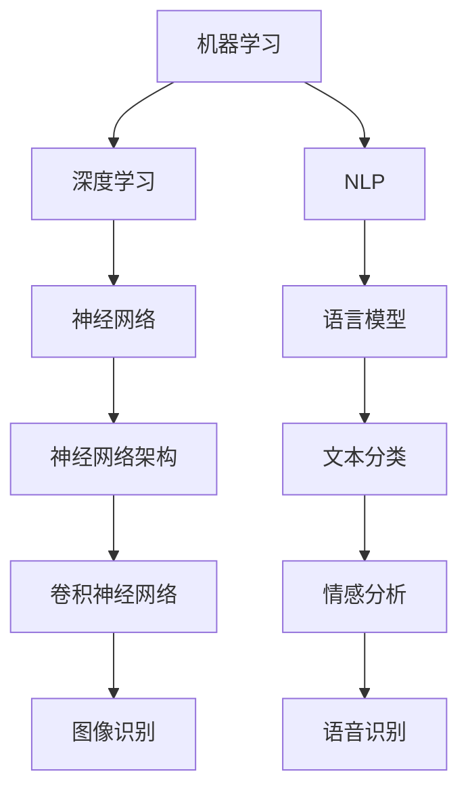

                 

```markdown
# AI：从概念到实践的系统探索

## 关键词
- 人工智能
- 计算机科学
- 算法
- 深度学习
- 自然语言处理
- 机器学习

## 摘要
本文将深入探讨人工智能（AI）的概念、发展历程、核心算法原理，以及其在现实世界中的应用。通过系统化的结构分析，我们旨在为读者提供一份全面、详细的AI知识指南，涵盖从基础概念到高级实战的全方位内容。

## 引言

### AI的定义与发展
人工智能，作为计算机科学的一个重要分支，旨在使计算机能够执行通常需要人类智能才能完成的任务。从1950年图灵测试的提出，到20世纪80年代的专家系统，再到近年来深度学习的突破，人工智能已经走过了数十年的发展历程。

### AI的重要性
随着大数据、云计算、物联网等技术的发展，AI的应用场景日益广泛，从医疗诊断、金融分析到自动驾驶、智能家居，AI正在改变我们的生活方式，提高生产效率，甚至推动社会进步。

## 核心概念与联系

### 核心概念
- **机器学习**：一种通过数据训练模型，使其能够从经验中学习的计算机算法。
- **深度学习**：一种特殊的机器学习技术，通过多层神经网络进行数据建模。
- **自然语言处理（NLP）**：研究如何让计算机理解和生成人类语言的技术。

### Mermaid流程图


## 核心算法原理讲解

### 机器学习原理
```plaintext
算法输入：数据集、特征工程
算法过程：
1. 特征提取：将原始数据转换为计算机可以处理的形式。
2. 模型训练：使用训练数据集来训练模型，调整模型参数。
3. 模型评估：使用验证数据集评估模型性能，调整参数。
4. 模型应用：使用测试数据集对模型进行实际应用。
```

### 深度学习原理
```plaintext
算法输入：数据集、网络架构
算法过程：
1. 前向传播：输入数据通过多层神经网络，逐层计算得到输出。
2. 反向传播：计算损失函数，并利用梯度下降法更新网络参数。
3. 模型优化：通过多次迭代训练，提高模型性能。
```

### 自然语言处理（NLP）原理
```plaintext
算法输入：文本数据、语言模型
算法过程：
1. 预处理：对文本进行清洗、分词、词性标注等操作。
2. 语言模型训练：使用大量文本数据训练语言模型。
3. 文本分析：通过语言模型对文本进行分析，包括情感分析、文本分类等。
```

## 数学模型和数学公式

### 损失函数
$$
\text{Loss}(y, \hat{y}) = -\sum_{i=1}^{n} y_i \log(\hat{y}_i)
$$

### 梯度下降法
$$
\theta_{\text{new}} = \theta_{\text{old}} - \alpha \cdot \nabla_{\theta} J(\theta)
$$

## 项目实战

### 环境搭建
- 安装Python环境
- 安装深度学习库（如TensorFlow或PyTorch）

### 源代码实现
```python
# 以PyTorch为例，实现一个简单的神经网络模型
import torch
import torch.nn as nn
import torch.optim as optim

# 定义神经网络结构
class NeuralNetwork(nn.Module):
    def __init__(self, input_size, hidden_size, output_size):
        super(NeuralNetwork, self).__init__()
        self.layer = nn.Sequential(
            nn.Linear(input_size, hidden_size),
            nn.ReLU(),
            nn.Linear(hidden_size, output_size),
            nn.Sigmoid()
        )
    
    def forward(self, x):
        return self.layer(x)

# 实例化模型、损失函数和优化器
model = NeuralNetwork(input_size=2, hidden_size=10, output_size=1)
criterion = nn.BCELoss()
optimizer = optim.SGD(model.parameters(), lr=0.01)

# 训练模型
for epoch in range(100):
    inputs = torch.tensor([[1.0, 0.0], [0.0, 1.0], [1.0, 1.0]])
    targets = torch.tensor([[1.0], [0.0], [1.0]])
    
    optimizer.zero_grad()
    outputs = model(inputs)
    loss = criterion(outputs, targets)
    loss.backward()
    optimizer.step()

# 模型应用
print(model(inputs)[0])
```

### 代码解读和分析
- **神经网络结构**：定义了一个简单的三层神经网络，包括输入层、隐藏层和输出层。
- **损失函数**：使用二进制交叉熵损失函数来评估模型的预测结果。
- **优化器**：使用随机梯度下降（SGD）优化器来更新模型参数。

### 实际案例分析
- 使用上述神经网络模型对二元分类问题进行训练和测试，分析模型性能。

### 项目小结
- 通过实际项目，读者可以了解如何使用深度学习库实现神经网络模型。
- 掌握了从模型搭建、训练到应用的完整流程。

## 最佳实践 tips

- **数据预处理**：确保输入数据的质量，进行必要的清洗和标准化处理。
- **模型优化**：通过调整学习率、批量大小等参数来优化模型性能。
- **模型部署**：将训练好的模型部署到实际应用环境中，进行持续优化和更新。

## 小结与注意事项

- **核心内容回顾**：本文系统性地介绍了人工智能的概念、核心算法原理、实战项目等。
- **注意事项**：在实际应用中，需注意数据隐私、模型安全性和可解释性。

## 拓展阅读

- **参考资料**：
  - 《深度学习》（Goodfellow, Bengio, Courville）
  - 《自然语言处理综论》（Jurafsky, Martin）
  - **在线课程**：Coursera上的“深度学习”课程，edX上的“自然语言处理”课程

---

## 附录

### 1. AI新闻编辑室相关资源
- **开发工具与平台**：
  - TensorFlow
  - PyTorch
  - Keras
- **学术论文与研究报告**：
  - 《Deep Learning》（Goodfellow, Bengio, Courville）
  - 《NLP技术指南》（Liu, Zongker）
- **开源代码与数据集**：
  - [TensorFlow Model Zoo](https://tensorflow.google.cn/tutorials/keras/structured_data)
  - [PyTorch Datasets](https://pytorch.org/vision/stable/datasets.html)

---

### 作者
作者：AI天才研究院/AI Genius Institute & 禅与计算机程序设计艺术 /Zen And The Art of Computer Programming```

