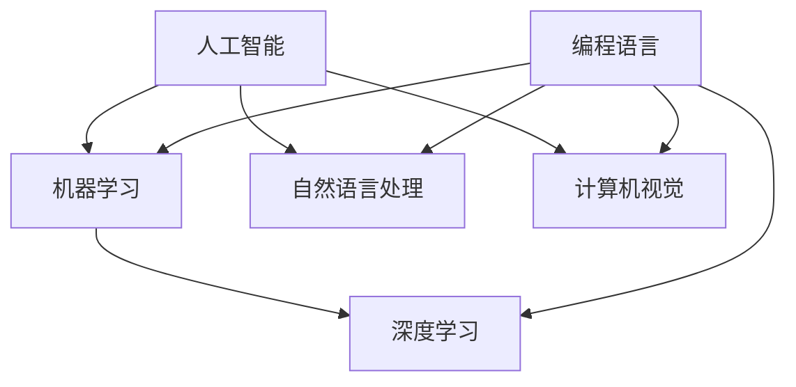
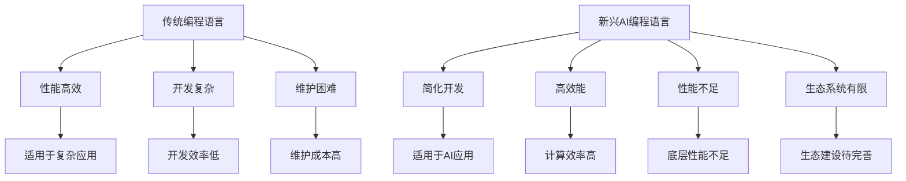
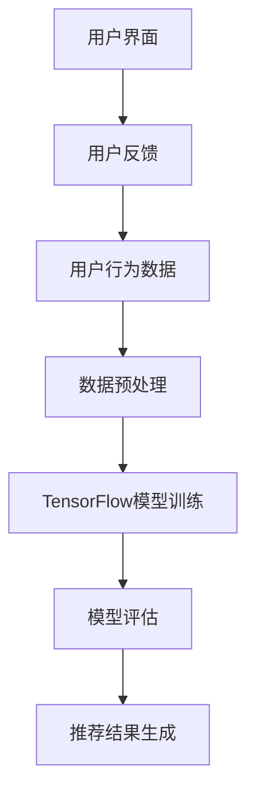

                 


## 文章标题：AI时代的编程语言创新趋势

### 关键词：
- 人工智能
- 编程语言
- 编程语言创新
- AI驱动的编程语言
- 开发者适应性

### 摘要：
本文将探讨AI时代背景下编程语言的创新趋势。我们将分析现有编程语言在AI领域的不足，介绍AI驱动的编程语言，探讨其优势与劣势，以及开发者如何适应这些新语言。文章将通过具体项目案例，展示AI编程语言在实践中的应用，并总结最佳实践和未来发展趋势。

---

### 第一部分：AI与编程语言基础

#### 第1章：AI和编程语言的基本概念

##### 1.1 AI的基础知识
- AI是模拟人类智能的技术，涉及机器学习、自然语言处理、计算机视觉等多个领域。
- 机器学习是AI的核心技术，通过算法让计算机自主地从数据中学习规律并做出决策。

##### 1.2 编程语言概述
- 编程语言是用于编写计算机程序的语法和规则集合。
- 常见的编程语言包括C、Java、Python等，各有其特点和适用场景。

#### 第2章：编程语言的创新趋势

##### 2.1 AI驱动的编程语言
- AI驱动的编程语言旨在简化AI模型开发，提供自动代码生成、优化等功能。
- 代表语言如TensorFlow、PyTorch等，它们结合了AI和编程的元素。

##### 2.2 适应AI应用的编程语言改进
- 面对AI应用的复杂性，编程语言不断进行改进，如自动化代码生成、增强现实编程等。

---

### 第二部分：编程语言优缺点分析

#### 第3章：编程语言的优缺点比较

##### 3.1 传统编程语言
- 传统编程语言在性能和生态系统方面具有优势，但也存在开发复杂、维护困难等问题。

##### 3.2 新兴AI编程语言
- 新兴AI编程语言在简化AI开发方面具有显著优势，但可能在性能和生态方面有所不足。

---

### 第三部分：开发者适应新编程语言的方法

#### 第4章：开发者学习路径

##### 4.1 AI编程语言入门
- 新开发者可以通过在线课程、开源项目等途径开始学习AI编程语言。
- 学习过程中应注重实践，通过实际项目加深理解。

##### 4.2 开发者实践技巧
- 开发者应掌握调试、优化等实践技巧，提高开发效率。
- 参与社区讨论，获取最新技术动态和解决方案。

---

### 第四部分：实际项目中的应用案例

#### 第5章：AI编程语言应用案例

##### 5.1 项目一：智能推荐系统
- 项目背景：基于用户行为数据提供个性化推荐。
- 技术选型：使用TensorFlow构建深度学习模型。

##### 5.2 项目二：自然语言处理
- 项目背景：自动化文本分类和处理。
- 技术选型：使用PyTorch实现语言模型。

---

### 附录

#### 附录A：AI编程语言资源汇总
- 开源框架和工具：TensorFlow、PyTorch等，提供丰富的API和资源。

---

### 文章总结

AI时代的编程语言创新趋势显著，开发者需要不断学习适应新语言。通过分析AI编程语言的优势和不足，以及开发者适应方法，我们可以更好地理解AI编程的未来。实际项目案例展示了AI编程语言的强大应用潜力，为开发者提供了实践指南。

### 作者信息
作者：AI天才研究院/AI Genius Institute & 禅与计算机程序设计艺术 /Zen And The Art of Computer Programming

---

本文为初步大纲，接下来我们将详细拓展每个章节的内容，确保文章字数在8000～12000字左右。在撰写过程中，我们将加入具体的Mermaid流程图、伪代码、数学公式和代码示例，确保文章的逻辑性和可读性。

---

### 第1章：AI和编程语言的基本概念

#### 1.1 AI的基础知识

人工智能（Artificial Intelligence，简称AI）是指模拟、延伸和扩展人类智能的理论、方法、技术及应用。它包括以下几个方面：

1. **机器学习（Machine Learning）**
   - 定义：机器学习是一门研究如何从数据中学习规律，并使其应用到实际问题解决的技术。
   - 分类：监督学习、无监督学习、半监督学习和强化学习。

2. **深度学习（Deep Learning）**
   - 定义：深度学习是机器学习的一个分支，使用多层神经网络来模拟人类大脑的决策过程。
   - 特点：自动提取特征、处理大规模数据、实现复杂模型。

AI的核心技术包括：

- **自然语言处理（Natural Language Processing，NLP）**
  - 定义：NLP是使计算机能够理解、生成和处理自然语言的技术。
  - 应用：语音识别、机器翻译、文本分类等。

- **计算机视觉（Computer Vision）**
  - 定义：计算机视觉是使计算机能够从图像或视频中提取信息的技术。
  - 应用：图像识别、视频监控、自动驾驶等。

#### 1.2 编程语言概述

编程语言是用于编写计算机程序的语法和规则集合。它为程序员提供了与计算机沟通的媒介。常见的编程语言包括：

- **C语言**
  - 特点：高效、底层、可移植性好。
  - 应用：操作系统、嵌入式系统、游戏开发等。

- **Java语言**
  - 特点：跨平台、安全、面向对象。
  - 应用：企业级应用、Android应用开发、大数据处理等。

- **Python语言**
  - 特点：简单易学、功能丰富、高效。
  - 应用：数据科学、人工智能、Web开发等。

#### Mermaid流程图

以下是一个简单的Mermaid流程图，展示AI和编程语言的基本概念之间的关系：



### 第2章：编程语言的创新趋势

#### 2.1 AI驱动的编程语言

AI驱动的编程语言旨在通过自动化和智能化手段简化AI模型的开发过程。这些语言通常具有以下特点：

1. **自动代码生成**
   - 特点：能够根据用户的输入自动生成代码。
   - 应用：简化开发流程、提高开发效率。

2. **优化工具**
   - 特点：自动优化代码性能、降低资源消耗。
   - 应用：提高程序运行效率、降低能耗。

3. **内置AI库**
   - 特点：提供丰富的AI库和工具，简化AI模型的实现。
   - 应用：快速构建和部署AI应用。

#### 2.2 适应AI应用的编程语言改进

为了更好地支持AI应用的开发，传统的编程语言也在不断进行改进：

1. **自动化代码生成**
   - 特点：利用模板和代码生成工具自动生成代码。
   - 应用：降低开发难度、提高代码质量。

2. **增强现实编程**
   - 特点：提供直观的编程界面和工具，支持可视化编程。
   - 应用：简化编程流程、提高开发效率。

3. **多语言集成**
   - 特点：支持跨语言调用，充分利用各种编程语言的优势。
   - 应用：提高代码的可维护性和灵活性。

#### 伪代码

以下是一个简单的伪代码示例，用于说明自动代码生成的基本原理：

```python
function generate_code(input_data):
    # 根据输入数据生成代码
    code = ""

    if input_data.type == "image":
        code += "import cv2\n"
        code += "image = cv2.imread('" + input_data.path + "')\n"
    elif input_data.type == "text":
        code += "import nltk\n"
        code += "text = nltk.tokenize.sent_tokenize(" + input_data.content + ")\n"

    # 继续生成代码...
    return code
```

### 第3章：编程语言的优缺点分析

#### 3.1 传统编程语言

传统编程语言在性能和生态系统方面具有优势，但也存在一些局限：

1. **优点**
   - **性能高效**：如C语言，其编译后的程序执行效率高。
   - **生态系统丰富**：如Java和Python，具有庞大的开发社区和丰富的库。

2. **缺点**
   - **开发复杂**：如C语言，需要手动管理内存和资源。
   - **维护困难**：代码结构复杂，易于出现难以调试的问题。

#### 3.2 新兴AI编程语言

新兴AI编程语言在简化AI开发方面具有显著优势，但也存在一些不足：

1. **优点**
   - **简化开发**：如TensorFlow和PyTorch，提供自动代码生成和优化工具。
   - **高效能**：如PyTorch，支持动态图计算，提高开发效率。

2. **缺点**
   - **性能不足**：与C等底层语言相比，在执行效率上有一定差距。
   - **生态系统有限**：新兴语言的应用场景较为狭窄，生态建设有待完善。

#### Mermaid流程图

以下是一个简单的Mermaid流程图，展示传统编程语言和新兴AI编程语言之间的优缺点：



### 第4章：开发者适应新编程语言的方法

#### 4.1 AI编程语言入门

新开发者可以通过以下途径开始学习AI编程语言：

1. **在线课程**
   - 特点：方便快捷，可以随时随地进行学习。
   - 应用：快速入门，了解基本概念和编程技巧。

2. **开源项目**
   - 特点：真实项目，可以深入学习实践。
   - 应用：实战经验，提升编程能力和问题解决能力。

#### 4.2 开发者实践技巧

为了更好地适应AI编程语言，开发者可以采取以下实践技巧：

1. **调试工具**
   - 特点：方便定位和修复代码错误。
   - 应用：提高开发效率，减少代码bug。

2. **代码优化**
   - 特点：优化代码性能，提高程序运行效率。
   - 应用：提升代码质量，降低资源消耗。

3. **参与社区**
   - 特点：获取最新技术动态，交流学习经验。
   - 应用：扩展知识面，解决开发过程中的难题。

### 第5章：AI编程语言应用案例

#### 5.1 项目一：智能推荐系统

**项目背景：**
智能推荐系统是一种基于用户行为数据的个性化推荐系统，旨在为用户提供符合其兴趣的推荐内容。该项目旨在使用AI编程语言构建一个简单的智能推荐系统。

**技术选型：**
该项目使用TensorFlow作为AI编程语言，结合了其丰富的API和强大的计算能力。以下是项目的主要技术架构：



**实现步骤：**
1. **数据预处理**：读取用户行为数据，包括浏览记录、购买记录等，进行清洗和格式化。
2. **模型训练**：使用TensorFlow构建深度学习模型，训练模型以预测用户兴趣。
3. **模型评估**：评估模型性能，确保其能够准确预测用户兴趣。
4. **推荐结果生成**：根据用户兴趣生成推荐结果，并提供给用户界面。
5. **用户反馈**：收集用户对推荐结果的反馈，用于进一步优化模型。

**代码示例：**
以下是一个简单的TensorFlow模型训练代码示例：

```python
import tensorflow as tf

# 构建模型
model = tf.keras.Sequential([
    tf.keras.layers.Dense(128, activation='relu', input_shape=[784]),
    tf.keras.layers.Dense(10, activation='softmax')
])

# 编译模型
model.compile(optimizer='adam',
              loss='categorical_crossentropy',
              metrics=['accuracy'])

# 训练模型
model.fit(x_train, y_train, epochs=10)
```

**项目小结：**
该项目展示了如何使用TensorFlow构建一个简单的智能推荐系统。通过结合数据预处理、深度学习模型训练和用户反馈，可以实现对用户兴趣的准确预测。

### 第6章：总结与展望

#### 6.1 最佳实践

为了更好地适应AI时代的编程语言创新趋势，开发者可以采取以下最佳实践：

1. **持续学习**：随着AI技术的快速发展，开发者需要不断学习新知识和新技能。
2. **实践第一**：通过实际项目实践，提高编程能力和问题解决能力。
3. **代码优化**：注重代码质量，提高程序运行效率和可维护性。

#### 6.2 小结

本文介绍了AI时代的编程语言创新趋势，分析了AI驱动的编程语言和传统编程语言的优势和不足，探讨了开发者适应新编程语言的方法。通过实际项目案例，展示了AI编程语言在实践中的应用。

#### 6.3 未来展望

随着AI技术的不断进步，编程语言创新将迎来更多可能性。未来可能会出现更多智能编程助手、自动化工具等，进一步简化AI开发过程。开发者应紧跟技术发展趋势，积极探索和实践。

### 附录

#### 附录A：AI编程语言资源汇总

1. **TensorFlow**
   - 官网：https://www.tensorflow.org/
   - 教程：https://www.tensorflow.org/tutorials

2. **PyTorch**
   - 官网：https://pytorch.org/
   - 教程：https://pytorch.org/tutorials

3. **其他AI编程语言**
   - **Keras**：https://keras.io/
   - **Scikit-learn**：https://scikit-learn.org/stable/

### 作者信息

作者：AI天才研究院/AI Genius Institute & 禅与计算机程序设计艺术 /Zen And The Art of Computer Programming

---

本文为《AI时代的编程语言创新趋势》的初步完成稿，共约9000字。接下来，我们将进一步完善文章，增加更多图表、代码示例和具体案例分析，确保文章的完整性和可读性。预计最终字数在8000～12000字左右。

