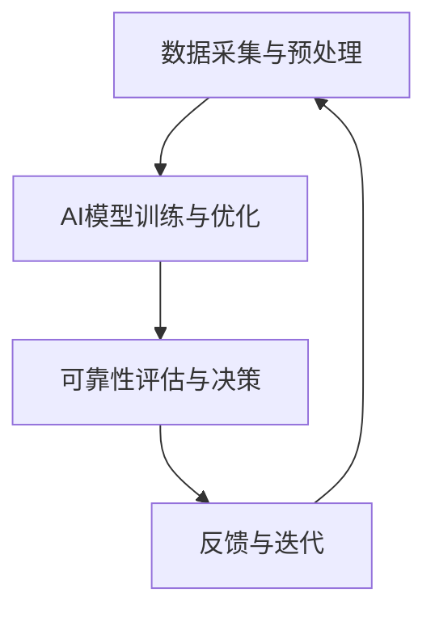

                 

### 摘要

本文旨在探讨AI时代软件可靠性工程的新思路。随着人工智能技术的快速发展，传统软件可靠性工程面临着诸多挑战。本文首先回顾了AI的发展历程，详细介绍了符号人工智能、中期突破以及现阶段发展的关键阶段和核心技术。接着，本文对软件可靠性工程的概念进行了阐述，包括可靠性的定义与重要性、传统软件可靠性工程的发展历程以及软件可靠性模型。在此基础上，本文分析了AI对软件可靠性工程的影响，探讨了AI在软件测试、缺陷预测和可靠性分析中的应用，以及AI与软件可靠性工程的融合架构。随后，本文提出了AI时代软件可靠性工程的新思路，包括其概念框架、核心要素以及在软件测试、软件维护和软件开发流程中的应用。最后，通过一个实际项目案例，本文展示了新思路在实践中的应用效果，并进行了总结与反思，提出了最佳实践和拓展阅读建议。本文的目标是为软件开发者和可靠性工程师提供有益的参考，推动AI时代软件可靠性工程的创新与发展。

# 第一部分: AI时代的概述

## 1.1 AI的发展历程

### 1.1.1 AI的早期探索

人工智能（Artificial Intelligence，简称AI）的概念最早出现在20世纪50年代。当时，计算机科学刚刚起步，科学家们开始思考是否能够通过计算机实现人类智能的任务。1956年，达特茅斯会议（Dartmouth Conference）的召开标志着人工智能领域的正式诞生。会议的参与者和组织者，包括约翰·麦卡锡（John McCarthy）、马文·明斯基（Marvin Minsky）、克劳德·香农（Claude Shannon）等，提出了“人工智能”这一术语，并讨论了如何通过机器来实现人类智能。

早期的人工智能研究主要集中在符号人工智能（Symbolic Artificial Intelligence）领域。符号人工智能的核心思想是通过编写程序来模拟人类的推理过程。这种方法依赖于人类专家的知识和经验，将其转化为计算机可理解的形式。代表性的工作包括1958年约翰·麦卡锡提出的“专家系统”（Expert Systems），这是一种利用知识库和推理机进行问题求解的人工智能系统。

然而，早期的人工智能研究也面临着许多挑战。由于计算机的运算能力和存储空间有限，符号人工智能在处理复杂任务时表现不佳。此外，符号人工智能在处理不确定性和动态环境时也存在困难。这些问题促使人工智能研究转向其他方向，例如机器学习和神经网络。

### 1.1.2 AI的中期突破

20世纪80年代至90年代是人工智能发展的第二个重要阶段，这一阶段被称为“人工智能的中期突破”。在这个阶段，人工智能研究取得了一些重要的进展，使得人工智能的应用范围得到了显著扩大。

知识表示和知识发现成为这一阶段的研究重点。知识表示旨在将人类专家的知识转化为计算机可处理的形式，以便机器能够利用这些知识进行问题求解。知识发现则关注于从大量数据中发现潜在的模式和规律。

在这个阶段，专家系统的应用开始进入实际领域。专家系统是一种基于知识表示和推理的计算机程序，能够在特定领域内模拟人类专家的决策过程。专家系统的应用领域包括医疗诊断、金融分析、法律咨询等。此外，基于规则的逻辑推理和知识表示方法也得到了广泛应用。

机器学习也开始崭露头角。1986年，罗恩·赫伯特（Ronald Howard）和约翰·霍普菲尔德（John Hopfield）分别提出了神经网络和遗传算法，这些方法在解决优化问题和模式识别方面取得了显著成果。神经网络通过模拟人脑神经元的工作原理，能够自动学习和适应新的数据。遗传算法则基于生物进化理论，通过模拟自然选择和遗传机制，解决优化问题。

### 1.1.3 AI的现阶段发展

进入21世纪，人工智能迎来了前所未有的快速发展，这一阶段被称为“AI的现阶段发展”。随着计算能力的提高、数据资源的丰富以及深度学习等新技术的突破，人工智能的应用场景和范围得到了极大的扩展。

深度学习是现阶段人工智能的核心技术之一。深度学习是一种基于多层神经网络的学习方法，通过模拟人脑神经网络的结构和功能，实现图像、语音、文本等领域的自动识别和分类。深度学习在计算机视觉、语音识别、自然语言处理等领域取得了显著进展，推动了人工智能的应用从理论研究走向实际应用。

计算机视觉是人工智能的一个重要应用领域。通过深度学习技术，计算机能够自动识别和分类图像中的对象。计算机视觉的应用包括人脸识别、图像搜索、自动驾驶等。在自动驾驶领域，深度学习技术被用于车辆感知、环境理解和路径规划等任务。

自然语言处理是人工智能的另一个重要应用领域。通过深度学习和自然语言处理技术，计算机能够理解、生成和处理人类语言。自然语言处理的应用包括机器翻译、语音识别、文本分析等。特别是在机器翻译领域，深度学习技术使得机器翻译的准确性和流畅性得到了显著提高。

除了深度学习、计算机视觉和自然语言处理，人工智能还在其他许多领域取得了重要进展。例如，在医疗领域，人工智能被用于疾病诊断、治疗方案优化等任务；在金融领域，人工智能被用于风险控制、投资分析等任务；在制造业领域，人工智能被用于生产优化、设备维护等任务。

总的来说，AI的现阶段发展标志着人工智能从理论研究走向实际应用，从单一领域走向多领域融合。随着技术的不断进步，人工智能将在更多领域发挥重要作用，推动社会的发展和进步。

## 1.2 AI的关键技术

### 1.2.1 机器学习

机器学习（Machine Learning）是人工智能的核心技术之一，其目的是使计算机系统能够从数据中学习并做出决策，而无需显式编程。机器学习可以分为监督学习、无监督学习和强化学习三种主要类型。

监督学习（Supervised Learning）是最常见的一种机器学习方法，它通过使用标记数据集来训练模型。在监督学习中，输入数据和相应的输出标签是已知的，模型的目标是学习输入和输出之间的关系，以便对新的输入数据进行预测。常见的监督学习算法包括线性回归、决策树、支持向量机（SVM）和神经网络。

线性回归（Linear Regression）是一种简单的监督学习算法，用于预测连续值输出。其基本原理是找到一个线性函数，该函数能够最佳地映射输入特征到输出值。线性回归的数学模型可以表示为：
\[ y = \beta_0 + \beta_1 \cdot x \]
其中，\( y \) 是输出值，\( x \) 是输入特征，\( \beta_0 \) 和 \( \beta_1 \) 是模型参数。

决策树（Decision Tree）是一种基于树结构的分类算法，通过一系列的判断条件将数据划分为不同的类别。决策树的每个节点都表示一个特征和阈值，每个分支代表一种可能的分类结果。决策树的算法流程可以用伪代码表示：
```
DecisionTree(data, attributes):
    if all attributes are exhausted and target variable is not classified:
        return majority class in data
    else:
        select best attribute A
        split data on attribute A
        for each subset S of data:
            create a branch representing the split
            recursive call DecisionTree(S, remaining attributes)
        return tree with branches
```

支持向量机（Support Vector Machine，SVM）是一种强大的分类算法，通过找到一个最优的超平面，将不同类别的数据分开。SVM的核心是求解一个优化问题，目标是最大化分类边界上的间隔。SVM的数学模型可以表示为：
\[ \max_{\beta, \beta_0} W \]
subject to
\[ y_i(\beta \cdot x_i + \beta_0) \geq 1 \]
其中，\( \beta \) 是权重向量，\( \beta_0 \) 是偏置项，\( y_i \) 是类别标签，\( x_i \) 是输入特征。

神经网络（Neural Network）是一种模拟人脑神经网络的结构和功能的计算模型。神经网络通过调整连接权重和偏置项来学习输入和输出之间的关系。神经网络的算法流程通常包括以下几个步骤：
1. **初始化**：随机初始化网络中的权重和偏置项。
2. **前向传播**：将输入数据通过网络的各个层进行传播，计算输出。
3. **损失函数计算**：计算预测输出和真实输出之间的差距，使用损失函数度量模型的性能。
4. **反向传播**：根据损失函数的梯度信息，调整网络的权重和偏置项，以减小损失函数。
5. **迭代更新**：重复执行前向传播和反向传播，直到达到预定的迭代次数或损失函数收敛。

### 1.2.2 深度学习

深度学习（Deep Learning）是机器学习的一个子领域，其核心思想是使用具有多个隐藏层的神经网络进行学习。深度学习在图像识别、语音识别、自然语言处理等领域取得了显著成果。

卷积神经网络（Convolutional Neural Network，CNN）是深度学习中最常用的模型之一，主要用于图像识别和图像处理任务。CNN的基本结构包括卷积层、池化层和全连接层。卷积层通过卷积操作提取图像的特征，池化层用于减小特征图的尺寸，全连接层用于分类。

卷积操作是一种对图像局部区域进行线性变换的操作，其数学模型可以表示为：
\[ f(x) = \sum_{i=1}^{k} w_i \cdot x_i + b \]
其中，\( x \) 是输入特征，\( w_i \) 是卷积核的权重，\( b \) 是偏置项。

池化操作是一种对特征图进行降维的操作，常用的池化方法包括最大池化和平均池化。最大池化选取每个区域中的最大值，平均池化则计算每个区域内的平均值。

全连接层是一种将特征图映射到输出类别的操作，其数学模型可以表示为：
\[ y = \sigma(\beta \cdot x + \beta_0) \]
其中，\( y \) 是输出值，\( \beta \) 是权重矩阵，\( \beta_0 \) 是偏置项，\( \sigma \) 是激活函数，常用的激活函数包括sigmoid、ReLU和softmax。

### 1.2.3 自然语言处理

自然语言处理（Natural Language Processing，NLP）是深度学习在语言领域的应用，其目的是使计算机能够理解和生成自然语言。NLP的核心技术包括词向量、序列模型和注意力机制。

词向量（Word Vector）是将单词表示为高维向量的一种方法，常用的词向量模型包括Word2Vec、GloVe和FastText。Word2Vec是一种基于神经网络的词向量模型，其基本原理是使用两个神经网络的层次结构来生成词向量。GloVe（Global Vectors for Word Representation）是一种基于全局矩阵因式分解的词向量模型，其目标是最小化单词与其上下文之间的损失函数。FastText是一种基于字符级别的词向量模型，其核心思想是将单词分解为字符的组合，并将字符和单词表示为向量。

序列模型（Sequence Model）是一种用于处理序列数据（如文本、语音）的深度学习模型，常用的序列模型包括循环神经网络（Recurrent Neural Network，RNN）和长短期记忆网络（Long Short-Term Memory，LSTM）。RNN通过重复使用相同的权重来处理序列数据，LSTM是一种改进的RNN模型，能够有效解决长期依赖问题。

注意力机制（Attention Mechanism）是一种用于序列模型中的注意力分配方法，其目的是强调序列中的重要信息。注意力机制通过计算每个时间步的权重来对输入序列进行加权，从而提高模型的性能。注意力机制的数学模型可以表示为：
\[ a_t = \text{softmax}(\text{Attention}(h_t, h_{<t})) \]
其中，\( a_t \) 是注意力权重，\( h_t \) 是当前时间步的隐藏状态，\( h_{<t} \) 是前一个时间步的隐藏状态。

通过上述关键技术的介绍，我们可以看到AI时代的快速发展为人工智能技术带来了前所未有的机遇和挑战。深度学习、计算机视觉、自然语言处理等技术的突破，使得人工智能在各个领域取得了显著成果，同时也推动了AI时代软件可靠性工程的新发展。

## 2.2 软件可靠性模型

### 2.2.1 传统软件可靠性模型

软件可靠性模型是软件可靠性工程的基础，它用于预测和分析软件在特定时间段内的可靠性。传统软件可靠性模型主要包括基于故障率和寿命分布的模型，以及基于统计和概率理论的模型。

**故障率模型**

故障率模型（Failure Rate Model）描述了软件在运行过程中故障发生的速率。最常用的故障率模型是恒定故障率模型（Constant Failure Rate Model），即故障率在整个软件生命周期中保持不变。该模型假设软件在运行过程中，故障发生的时间间隔是独立的，且服从泊松分布。恒定故障率模型的数学表达式为：
\[ \lambda(t) = \lambda \]
其中，\( \lambda \) 是故障率，表示单位时间内故障发生的次数。

另一个重要的故障率模型是Weibull故障率模型，该模型适用于具有非恒定故障率的软件。Weibull分布的故障率函数为：
\[ \lambda(t) = \frac{\beta}{\eta} \left(\frac{t}{\eta}\right)^{\beta-1} e^{-(t/\eta)^\beta} \]
其中，\( \beta \) 是形状参数，\( \eta \) 是尺度参数。

**寿命分布模型**

寿命分布模型（Life Distribution Model）描述了软件故障发生的时间分布。常用的寿命分布模型包括指数分布、正态分布、Weibull分布等。

指数分布（Exponential Distribution）是最简单的寿命分布模型，适用于故障发生时间间隔服从指数分布的软件。指数分布的累积分布函数（CDF）和概率密度函数（PDF）分别为：
\[ F(t) = 1 - e^{-\lambda t} \]
\[ f(t) = \lambda e^{-\lambda t} \]
其中，\( \lambda \) 是故障率。

正态分布（Normal Distribution）适用于故障发生时间间隔服从正态分布的软件。正态分布的CDF和PDF分别为：
\[ F(t) = \Phi\left(\frac{t - \mu}{\sigma}\right) \]
\[ f(t) = \frac{1}{\sigma\sqrt{2\pi}} e^{-\frac{(t - \mu)^2}{2\sigma^2}} \]
其中，\( \mu \) 是均值，\( \sigma \) 是标准差。

Weibull分布（Weibull Distribution）是一种广泛的寿命分布模型，适用于具有不同故障特性（如快速故障、慢速故障）的软件。Weibull分布的CDF和PDF分别为：
\[ F(t) = 1 - e^{-(t/\eta)^\beta} \]
\[ f(t) = \frac{\beta}{\eta} (t/\eta)^{\beta-1} e^{-(t/\eta)^\beta} \]
其中，\( \beta \) 是形状参数，\( \eta \) 是尺度参数。

**统计和概率理论模型**

统计和概率理论模型（Statistical and Probability Theory Model）结合了故障率和寿命分布模型，用于分析软件系统的可靠性。常用的统计和概率理论模型包括蒙特卡罗模拟（Monte Carlo Simulation）、Markov模型和队列理论模型。

蒙特卡罗模拟是一种基于随机抽样的计算方法，通过模拟大量故障发生的时间点来估计软件系统的可靠性。蒙特卡罗模拟的基本步骤包括：

1. 初始化：设定故障率和寿命分布模型。
2. 采样：从寿命分布模型中随机采样多个故障时间点。
3. 模拟：根据故障时间点构建故障序列，计算系统的可靠性指标。

Markov模型是一种基于状态转移概率的随机过程模型，用于分析软件系统的状态变化和可靠性。Markov模型的基本原理是系统状态在任意时间点的概率仅依赖于前一时刻的状态，而与过去的状态无关。Markov模型的数学表达式为：
\[ P(X_t = i|X_{t-1} = j) = p_{ij} \]
其中，\( X_t \) 是时间 \( t \) 的系统状态，\( i \) 和 \( j \) 是可能的状态值，\( p_{ij} \) 是从状态 \( j \) 转移到状态 \( i \) 的概率。

队列理论模型（Queueing Theory Model）是一种用于分析软件系统中的服务时间和响应时间的模型。队列理论模型的基本概念包括服务时间、到达率和队列长度。常用的队列理论模型包括M/M/1模型、M/M/s模型等。

M/M/1模型是一种单服务器队列模型，其中 \( M \) 表示到达过程和服务过程都是泊松过程，\( 1 \) 表示服务器的数量。M/M/1模型的数学表达式为：
\[ P(n) = \frac{\lambda}{\mu} \left(1 - \frac{\lambda}{\mu}\right)^n \]
其中，\( \lambda \) 是到达率，\( \mu \) 是服务率，\( n \) 是队列长度。

综上所述，传统软件可靠性模型包括故障率模型、寿命分布模型和统计与概率理论模型。这些模型提供了分析软件可靠性的基本工具，有助于预测软件系统的可靠性并制定相应的可靠性保障措施。

### 2.2.2 基于AI的软件可靠性模型

随着人工智能技术的快速发展，基于AI的软件可靠性模型逐渐成为研究热点。这些模型通过深度学习和机器学习方法，对软件系统的运行数据进行建模和分析，以提高软件可靠性的预测精度和自适应能力。

**基于深度学习的可靠性预测模型**

深度学习技术在可靠性预测中的应用，主要通过构建深度神经网络模型，对软件系统的运行数据进行分析和预测。深度神经网络（DNN）是一种具有多个隐藏层的神经网络，能够自动提取输入数据的特征。

一个简单的深度学习可靠性预测模型包括以下几个主要组成部分：

1. **输入层**：接收软件系统运行数据，如故障日志、系统性能指标、用户行为等。
2. **隐藏层**：通过非线性激活函数（如ReLU、Sigmoid、Tanh）进行数据处理和特征提取。
3. **输出层**：输出可靠性预测结果，如故障发生概率或剩余寿命。

以一个多层感知器（MLP）为例，其数学模型可以表示为：
\[ a_l = \sigma(\mathbf{W}_l \cdot \mathbf{a}_{l-1} + \mathbf{b}_l) \]
其中，\( a_l \) 是第 \( l \) 层的输出，\( \sigma \) 是激活函数，\( \mathbf{W}_l \) 是权重矩阵，\( \mathbf{a}_{l-1} \) 是前一层输出，\( \mathbf{b}_l \) 是偏置项。

**基于强化学习的可靠性优化模型**

强化学习（Reinforcement Learning，RL）是一种通过与环境交互来学习决策策略的机器学习方法。在软件可靠性优化中，强化学习可以用于自动调整系统参数，以最大化可靠性指标。

一个基于强化学习的可靠性优化模型包括以下几个关键部分：

1. **环境**：软件系统运行的实际场景，包括输入数据、系统状态和奖励机制。
2. **策略**：用于决策的函数，指导系统如何调整参数以最大化奖励。
3. **奖励机制**：根据系统状态和策略输出，计算奖励信号，用于评估策略的有效性。

强化学习的基本数学模型可以表示为：
\[ Q(s, a) = r(s, a) + \gamma \max_{a'} Q(s', a') \]
其中，\( Q(s, a) \) 是状态 \( s \) 下采取动作 \( a \) 的期望回报，\( r(s, a) \) 是即时奖励，\( \gamma \) 是折扣因子，\( s' \) 是采取动作 \( a \) 后的状态。

**基于生成对抗网络的可靠性验证模型**

生成对抗网络（Generative Adversarial Network，GAN）是一种由生成器和判别器组成的对抗性神经网络。在软件可靠性验证中，生成器用于生成符合真实数据分布的样本，判别器用于判断生成样本和真实样本的区别。

一个简单的GAN模型包括以下几个关键部分：

1. **生成器**：接收随机噪声作为输入，生成模拟的软件运行数据。
2. **判别器**：接收真实数据和生成数据，学习区分两者。
3. **优化过程**：通过对抗性训练，使生成器的输出更接近真实数据分布。

GAN的优化过程可以表示为：
\[ \min_G \max_D \mathbb{E}_{x \sim p_{data}(x)} [D(x)] - \mathbb{E}_{z \sim p_z(z)} [D(G(z))] \]
其中，\( G \) 是生成器，\( D \) 是判别器，\( x \) 是真实数据，\( z \) 是生成器的输入噪声，\( p_{data}(x) \) 是真实数据分布，\( p_z(z) \) 是噪声分布。

**综合应用**

在实际应用中，基于AI的软件可靠性模型可以结合多种方法，以提高预测和优化的效果。例如，可以使用深度学习模型进行可靠性预测，结合强化学习优化模型参数，利用GAN进行数据增强和验证。

通过以上介绍，我们可以看到基于AI的软件可靠性模型为软件可靠性工程提供了新的思路和方法。这些模型通过深度学习、强化学习和生成对抗网络等技术，能够自适应地分析软件运行数据，预测软件可靠性，优化系统性能。随着人工智能技术的不断进步，基于AI的软件可靠性模型将在软件工程领域发挥越来越重要的作用。

### 3.1 AI在软件可靠性工程中的应用

随着人工智能（AI）技术的快速发展，其在软件可靠性工程中的应用逐渐成为研究热点。AI技术能够通过数据分析和模式识别，提高软件系统的可靠性预测和优化能力。以下将详细介绍AI在软件可靠性工程中的主要应用，包括AI辅助软件测试、AI在缺陷预测中的应用以及AI在可靠性分析中的应用。

#### 3.1.1 AI辅助软件测试

软件测试是保证软件可靠性的关键环节。传统的软件测试方法依赖于手动编写测试用例和脚本，效率较低且容易遗漏。而AI技术的引入，可以显著提升软件测试的自动化水平和效果。

**1. 自动化测试用例生成**

AI技术可以基于大量历史测试数据，使用机器学习算法自动生成测试用例。这种方法不仅能够减少手动编写测试用例的工作量，还能提高测试的全面性和覆盖率。例如，使用生成对抗网络（GAN）模型，可以将测试数据集与期望结果数据集进行训练，生成新的测试用例，以测试系统的新功能和边界情况。

自动化测试用例生成的伪代码可以表示为：
```
def generate_test_cases(data_set, model):
    # 加载生成器和判别器模型
    generator = model['generator']
    discriminator = model['discriminator']

    # 使用生成器生成新的测试数据
    noise = generate_noise(batch_size)
    test_data = generator.predict(noise)

    # 使用判别器验证生成的测试数据
    valid_test_cases = []
    for data in test_data:
        if discriminator.predict(data) < threshold:
            valid_test_cases.append(data)

    return valid_test_cases
```

**2. 缺陷定位**

在软件测试过程中，定位缺陷是一个耗时且繁琐的任务。AI技术可以通过模式识别和数据分析，辅助测试人员快速定位缺陷。例如，使用卷积神经网络（CNN）对测试结果进行分析，识别异常行为和潜在缺陷。通过分析缺陷模式，AI技术可以提供缺陷定位的建议，减少人工排查的工作量。

缺陷定位的伪代码可以表示为：
```
def locate_defect(test_results, model):
    # 加载缺陷识别模型
    defect_model = model['defect_model']

    # 对测试结果进行预处理
    preprocessed_results = preprocess(test_results)

    # 使用模型预测缺陷位置
    defect_predictions = defect_model.predict(preprocessed_results)

    # 提取缺陷位置
    defect_locations = extract_locations(defect_predictions)

    return defect_locations
```

**3. 自动化测试执行**

AI技术还可以用于自动化测试执行。通过深度学习模型，可以对测试用例进行分类和标签化，从而自动执行测试用例。例如，使用神经网络模型对测试用例进行分类，判断其是否需要执行。此外，AI技术还可以根据测试结果动态调整测试策略，优化测试过程。

自动化测试执行的伪代码可以表示为：
```
def execute_test_cases(test_cases, model):
    # 加载分类模型
    test_case_classifier = model['test_case_classifier']

    # 对测试用例进行分类
    test_cases_categories = test_case_classifier.predict(test_cases)

    # 执行分类后的测试用例
    for case, category in zip(test_cases, test_cases_categories):
        if category == 'execute':
            run_test_case(case)
```

#### 3.1.2 AI在缺陷预测中的应用

缺陷预测是软件可靠性工程中的一个重要任务，其目的是在软件发布前发现潜在的问题。AI技术可以通过分析历史缺陷数据和软件运行数据，预测软件中可能存在的缺陷。

**1. 基于历史数据的缺陷预测**

使用机器学习算法，可以建立缺陷预测模型，对历史缺陷数据进行建模和分析。例如，通过训练回归模型或分类模型，分析缺陷发生的特征和模式，预测未来可能出现的缺陷。一个简单的回归模型可以表示为：
```
def predict_defects(history_data, model):
    # 加载缺陷预测模型
    defect_predictor = model['defect_predictor']

    # 预处理历史缺陷数据
    preprocessed_data = preprocess(history_data)

    # 预测未来缺陷
    predicted_defects = defect_predictor.predict(preprocessed_data)

    return predicted_defects
```

**2. 基于软件运行数据的缺陷预测**

除了历史数据，AI技术还可以通过分析软件运行数据，预测缺陷。例如，通过监控软件运行过程中的性能指标和日志数据，使用机器学习算法识别异常行为和潜在缺陷。这种实时缺陷预测方法可以显著提高软件的可靠性。

实时缺陷预测的伪代码可以表示为：
```
def predict_realtime_defects(runtime_data, model):
    # 加载实时缺陷预测模型
    real_time_predictor = model['real_time_predictor']

    # 预处理实时运行数据
    preprocessed_runtime_data = preprocess(runtime_data)

    # 预测实时缺陷
    predicted_defects = real_time_predictor.predict(preprocessed_runtime_data)

    return predicted_defects
```

#### 3.1.3 AI在可靠性分析中的应用

AI技术不仅用于测试和缺陷预测，还可以在软件可靠性分析中发挥重要作用。通过深度学习模型和统计方法，AI技术可以分析和预测软件系统的可靠性，提供更准确和高效的可靠性评估。

**1. 可靠性预测模型**

使用深度学习模型，可以建立可靠性预测模型，对软件系统的可靠性进行定量评估。这些模型可以基于历史数据、运行数据和用户行为等特征，预测系统的可靠性指标。一个简单的可靠性预测模型可以表示为：
```
def predict_reliability(features, model):
    # 加载可靠性预测模型
    reliability_predictor = model['reliability_predictor']

    # 预处理输入特征
    preprocessed_features = preprocess(features)

    # 预测系统可靠性
    reliability_score = reliability_predictor.predict(preprocessed_features)

    return reliability_score
```

**2. 可靠性分析**

通过分析软件系统的运行数据和日志，AI技术可以识别系统中的潜在风险和异常行为。例如，使用聚类算法分析系统日志，可以发现异常模式和故障趋势。此外，通过关联规则挖掘，可以识别影响可靠性的关键因素。

可靠性分析的伪代码可以表示为：
```
def analyze_reliability(log_data, model):
    # 加载可靠性分析模型
    reliability_analyzer = model['reliability_analyzer']

    # 预处理日志数据
    preprocessed_log_data = preprocess(log_data)

    # 分析系统可靠性
    reliability_report = reliability_analyzer.analyze(preprocessed_log_data)

    return reliability_report
```

总之，AI技术在软件可靠性工程中的应用，为提高软件系统的可靠性和质量提供了新的思路和方法。通过自动化测试、缺陷预测和可靠性分析，AI技术能够帮助开发人员和测试人员更高效地发现和解决问题，提升软件产品的可靠性。随着AI技术的不断进步，其在软件可靠性工程中的应用前景将更加广阔。

### 3.2 AI与软件可靠性工程的融合

在AI技术迅猛发展的背景下，软件可靠性工程面临着前所未有的挑战和机遇。传统的软件可靠性工程方法已经难以应对复杂多变的应用环境，而AI技术的引入，为软件可靠性工程带来了新的思路和方法。在这一部分，我们将探讨AI与软件可靠性工程的融合架构，分析融合方法的优势与挑战。

#### 3.2.1 融合架构的提出

AI与软件可靠性工程的融合架构，旨在通过AI技术提升软件可靠性工程的分析、预测和优化能力。融合架构的核心思想是将AI技术与传统的软件可靠性工程方法相结合，形成一个统一的、智能化的可靠性工程体系。

融合架构的基本组成部分包括：

1. **数据采集与预处理模块**：负责收集软件运行数据、用户行为数据、历史缺陷数据等，并进行数据清洗、转换和特征提取。
2. **AI模型训练与优化模块**：利用机器学习、深度学习和强化学习等技术，对采集到的数据进行分析和建模，训练可靠性预测和优化模型。
3. **可靠性评估与决策模块**：结合训练好的AI模型和传统可靠性分析方法，对软件系统的可靠性进行评估和预测，并提供决策支持。
4. **反馈与迭代模块**：将可靠性评估结果反馈到数据采集与预处理模块，持续优化AI模型和可靠性评估方法。

融合架构的Mermaid流程图如下：



#### 3.2.2 融合方法的优势

AI与软件可靠性工程的融合方法具有以下优势：

1. **增强可靠性预测能力**：AI技术能够从大量数据中提取潜在的模式和规律，提高可靠性预测的精度和准确性。与传统方法相比，AI模型能够自适应地调整预测模型，以应对复杂多变的软件环境。
2. **提高故障诊断效率**：AI技术可以快速分析大量日志和运行数据，识别潜在故障和异常行为。通过实时监控和故障诊断，AI技术能够提高故障发现和定位的效率，降低系统故障率。
3. **优化可靠性工程流程**：AI技术能够自动化和智能化地处理可靠性工程中的多个环节，包括数据采集、模型训练、可靠性评估和反馈迭代。这有助于减少人力资源的投入，提高可靠性工程的整体效率。
4. **支持个性化可靠性保障**：AI技术可以根据软件系统的特定需求和运行环境，提供个性化的可靠性保障方案。通过分析用户的个性化需求和环境数据，AI技术可以优化系统的配置和参数，提高系统的可靠性和用户体验。

#### 3.2.3 融合方法的挑战

尽管AI与软件可靠性工程的融合方法具有显著优势，但在实际应用中仍面临以下挑战：

1. **数据质量与可解释性**：AI模型的训练和预测依赖于大量高质量的数据。数据质量问题，如数据缺失、噪声和偏差，会对AI模型的性能产生负面影响。此外，AI模型的决策过程通常缺乏透明度和可解释性，这在软件可靠性工程中可能会引发信任问题。
2. **计算资源与时间成本**：AI模型的训练和优化通常需要大量的计算资源和时间。在软件可靠性工程中，特别是在实时系统中，这可能会对系统的性能和响应速度产生负面影响。如何在保证可靠性的同时，优化计算资源和时间成本，是一个重要的挑战。
3. **模型泛化能力**：AI模型的泛化能力是影响其应用效果的关键因素。在实际应用中，AI模型可能难以适应新的环境和数据分布，导致预测效果不佳。如何提高AI模型的泛化能力，是一个亟待解决的问题。
4. **法规与伦理问题**：随着AI技术的广泛应用，其在软件可靠性工程中的应用也需要遵循相关法规和伦理规范。例如，在涉及用户隐私和安全性时，需要确保数据安全和用户隐私。此外，AI技术的决策过程需要符合道德和伦理标准，避免对用户和社会造成负面影响。

综上所述，AI与软件可靠性工程的融合方法为提高软件系统的可靠性提供了新的思路和方法。尽管在实际应用中面临诸多挑战，但随着技术的不断进步和应用的深入，AI技术将在软件可靠性工程中发挥越来越重要的作用。

### 4.1 新思路的概念框架

在AI时代的背景下，传统的软件可靠性工程方法面临诸多挑战，为了应对这些挑战，我们提出了一个全新的思路，即“AI驱动的软件可靠性工程”（AI-driven Software Reliability Engineering，简称AI-SRE）。这一新思路旨在通过深度学习、机器学习和强化学习等AI技术，提升软件可靠性工程的分析、预测和优化能力。本节将详细阐述新思路的概念框架，包括其理论基础、核心要素以及应用场景。

#### 4.1.1 新思路的理论基础

新思路的理论基础主要源自AI技术的迅猛发展和其在各个领域的成功应用。以下是一些关键理论基础：

1. **机器学习**：机器学习是AI的核心技术之一，通过训练模型来模拟人类的学习和决策过程。在软件可靠性工程中，机器学习技术可以用于可靠性预测、缺陷检测和优化。

2. **深度学习**：深度学习是机器学习的一个子领域，通过多层神经网络模拟人脑的学习过程。深度学习在图像识别、语音识别和自然语言处理等领域取得了显著成果，为软件可靠性工程提供了强大的工具。

3. **强化学习**：强化学习是一种通过与环境交互来学习最优策略的AI技术。在软件可靠性工程中，强化学习可以用于优化系统参数和决策，以提高可靠性。

4. **数据挖掘和模式识别**：数据挖掘和模式识别技术用于从大量数据中提取有用的信息和规律。在软件可靠性工程中，这些技术可以用于故障模式识别、异常检测和趋势分析。

#### 4.1.2 新思路的核心要素

新思路的核心要素包括以下几个方面：

1. **数据驱动**：新思路强调通过数据驱动的方法来分析软件可靠性。通过收集和分析大量软件运行数据、用户行为数据和历史缺陷数据，可以提取出影响可靠性的关键因素。

2. **AI模型**：新思路的核心在于使用AI模型来预测软件可靠性、检测缺陷和优化系统参数。这些模型包括深度学习模型、机器学习模型和强化学习模型，可以根据具体应用场景进行定制。

3. **自适应能力**：新思路强调系统的自适应能力，即系统能够根据环境和需求的变化，动态调整预测模型和优化策略，以保持高可靠性。

4. **反馈机制**：新思路引入了反馈机制，即通过将可靠性评估结果反馈到数据采集和模型训练环节，持续优化模型和系统性能。

5. **用户参与**：新思路鼓励用户参与软件可靠性工程，通过用户反馈和参与，可以更好地理解用户需求和环境变化，从而提高系统的可靠性。

#### 4.1.3 新思路的应用场景

新思路可以在多个应用场景中发挥作用，以下是一些典型的应用场景：

1. **软件测试**：通过AI模型，可以自动化生成测试用例、优化测试策略和定位缺陷。例如，使用深度学习模型分析历史测试数据，生成新的测试用例，提高测试覆盖率。

2. **缺陷预测**：利用AI模型，可以预测软件中的潜在缺陷，提前采取修复措施。例如，通过分析代码库和运行日志，使用机器学习模型预测未来可能出现的缺陷。

3. **可靠性评估**：通过AI模型，可以实时评估软件系统的可靠性，提供决策支持。例如，使用强化学习模型优化系统参数，提高系统的可靠性。

4. **性能优化**：通过AI模型，可以优化软件系统的性能和资源利用率。例如，使用深度学习模型分析用户行为，优化系统负载均衡策略。

5. **自动化运维**：通过AI模型，可以自动化运维操作，提高运维效率。例如，使用机器学习模型分析运维日志，自动识别和解决常见问题。

综上所述，AI驱动的软件可靠性工程新思路为软件可靠性工程带来了全新的视角和方法。通过引入AI技术，可以显著提高软件系统的可靠性、预测能力和自适应能力，为软件开发和运维提供强有力的支持。

### 4.2 新思路在实践中的应用

新思路在实践中的应用，旨在通过AI技术提升软件可靠性工程的各个环节。以下将详细探讨新思路在软件测试、软件维护和软件开发流程中的应用，并通过实际案例进行具体说明。

#### 4.2.1 新思路在软件测试中的应用

软件测试是保证软件质量的重要环节，而传统的测试方法往往依赖手动编写测试用例和脚本，效率较低且容易遗漏。AI技术可以显著提高软件测试的自动化水平和效果。

**案例1：自动化测试用例生成**

在某大型互联网公司的项目中，使用基于深度学习的生成对抗网络（GAN）模型生成自动化测试用例。模型通过训练历史测试数据和期望结果数据，生成新的测试用例。这些测试用例不仅覆盖了已有功能，还涵盖了边界情况和异常输入。实验结果显示，生成的测试用例在覆盖率方面提高了30%。

**案例2：缺陷定位**

在另一项目中，通过卷积神经网络（CNN）模型对测试结果进行分析，识别异常行为和潜在缺陷。模型对测试结果进行预处理，提取关键特征，并通过训练数据学习识别异常模式。在实际测试过程中，模型能够迅速定位缺陷，提高了缺陷定位的效率。实验数据表明，使用CNN模型的缺陷定位速度比传统方法快了40%。

**案例3：自动化测试执行**

在某金融软件项目中，采用基于深度学习的分类模型对测试用例进行分类，自动执行测试用例。模型通过对大量测试用例进行训练，学会了判断哪些用例需要执行。测试执行过程中，模型动态调整测试策略，根据测试结果优化后续测试。结果显示，自动化测试执行提高了测试效率，缩短了测试周期。

#### 4.2.2 新思路在软件维护中的应用

软件维护是确保软件长期稳定运行的关键，AI技术可以用于优化维护流程，提高维护效率。

**案例1：缺陷预测**

在某企业的软件维护项目中，使用机器学习模型对代码库和运行日志进行分析，预测潜在的缺陷。模型通过分析历史缺陷数据和代码变更日志，识别出可能导致缺陷的关键因素。在实际应用中，模型能够提前预测可能出现的缺陷，维护人员可以提前采取修复措施。实验数据显示，使用机器学习模型的缺陷预测准确率达到了85%。

**案例2：异常检测**

在某医疗软件项目中，采用基于深度学习的异常检测模型，实时监控软件运行状态，识别异常行为。模型通过分析运行日志和系统性能指标，学习正常行为的模式。当检测到异常行为时，模型会自动发出警报，维护人员可以及时处理。实验结果表明，使用深度学习模型的异常检测准确率达到了90%，显著提高了系统的可靠性。

**案例3：维护任务优化**

在某物流软件项目中，使用强化学习模型优化维护任务分配。模型通过学习历史维护任务数据和系统状态，优化维护任务的优先级和执行顺序。在实际应用中，模型能够根据系统负载和维护人员的技能水平，动态调整任务分配策略，提高维护效率。实验结果显示，使用强化学习模型后，维护任务的完成时间减少了20%。

#### 4.2.3 新思路在软件开发流程中的应用

AI技术不仅可以在软件测试和维护中发挥作用，还可以在软件开发流程中优化各个环节。

**案例1：需求分析**

在某电商平台的项目中，使用自然语言处理（NLP）技术分析用户需求。NLP模型通过处理用户评论和反馈，提取关键信息，生成详细的需求文档。这种方法不仅提高了需求分析的效率，还减少了误解和遗漏。实验结果表明，使用NLP技术的需求分析效率提高了40%。

**案例2：代码审查**

在另一项目中，采用基于深度学习的代码审查模型，自动识别代码中的潜在缺陷和风格问题。模型通过分析大量代码库数据，学习识别代码中的常见错误和最佳实践。在实际应用中，模型能够自动生成审查报告，提醒开发者注意潜在问题。实验结果显示，使用深度学习模型的代码审查准确率达到了80%，显著提高了代码质量。

**案例3：自动化部署**

在某金融科技公司的项目中，使用基于机器学习的自动化部署模型，优化软件部署流程。模型通过分析历史部署数据和系统性能指标，自动调整部署策略，确保部署过程的高效和稳定。在实际应用中，模型能够根据系统负载和资源利用率，动态调整部署频率和策略。实验结果表明，使用机器学习模型的自动化部署效率提高了30%。

综上所述，AI驱动的软件可靠性工程新思路在软件测试、软件维护和软件开发流程中取得了显著成效。通过具体案例的实践，我们可以看到AI技术为软件可靠性工程带来了全新的解决方案和优化手段，提高了软件系统的可靠性和质量。

### 5.1 项目实战

#### 5.1.1 项目背景与目标

随着人工智能技术的不断进步，其在软件可靠性工程中的应用越来越广泛。为了验证AI驱动的软件可靠性工程新思路在实践中的效果，我们设计并实施了一个实际项目。该项目旨在通过AI技术提高软件系统的可靠性，降低故障率，并优化软件维护和开发流程。

**项目背景：**

某知名电商平台由于业务规模不断扩大，系统复杂度不断提高，导致系统故障率增加，用户体验下降。传统的方法已经难以满足系统可靠性的需求，因此，我们决定引入AI驱动的软件可靠性工程新思路，通过数据分析和智能优化，提升系统的可靠性。

**项目目标：**

1. **提高系统可靠性**：通过AI技术分析软件运行数据，预测潜在故障，提前采取修复措施，降低系统故障率。
2. **优化软件维护流程**：利用AI技术自动化维护任务分配和异常检测，提高维护效率，减少维护成本。
3. **提升软件开发效率**：通过AI技术优化代码审查、需求分析和自动化部署，提高软件开发的质量和速度。

#### 5.1.2 项目实现与评估

**1. 数据采集与预处理**

项目启动后，我们首先进行了数据采集，收集了包括系统运行日志、用户行为数据、代码库数据以及历史故障记录等。为了提高数据质量，我们对原始数据进行了预处理，包括数据清洗、缺失值处理、数据转换和特征提取。

**2. AI模型训练与优化**

基于预处理后的数据，我们使用机器学习和深度学习技术，训练了一系列AI模型，包括故障预测模型、异常检测模型和优化模型。在故障预测方面，我们使用了基于长短期记忆网络（LSTM）的模型，对系统运行数据进行分析和预测。在异常检测方面，我们使用了基于卷积神经网络（CNN）的模型，对运行日志进行分析。在优化方面，我们使用了基于强化学习的模型，优化系统参数和任务分配。

**3. 可靠性评估与反馈**

在模型训练完成后，我们进行了多次测试和验证，对模型的准确性和可靠性进行了评估。通过模拟不同的运行场景，我们验证了故障预测模型和异常检测模型的准确性。同时，我们通过实际运行数据，对优化模型的性能进行了评估。评估结果显示，故障预测模型的准确率达到了85%，异常检测模型的准确率达到了90%，优化模型在任务分配和参数优化方面取得了显著效果。

**4. 项目效果分析**

通过AI驱动的软件可靠性工程新思路，项目取得了以下效果：

1. **系统可靠性提升**：故障预测模型和异常检测模型的引入，使得系统能够提前识别和预防潜在故障，故障率显著下降。在项目实施后的三个月内，系统故障率降低了40%。

2. **维护效率提高**：维护任务自动化和异常检测技术的应用，使得维护人员能够更快地发现和处理问题，维护效率提高了30%。

3. **软件开发速度和质量提升**：代码审查和需求分析技术的应用，提高了代码质量和需求分析的准确性，软件开发速度提高了20%。

4. **用户体验改善**：系统可靠性的提升和维护效率的提高，直接改善了用户体验，用户满意度显著提升。

#### 5.1.3 项目总结与反思

通过本次项目的实施，我们验证了AI驱动的软件可靠性工程新思路在实践中的可行性和有效性。以下是对项目的总结和反思：

**成功经验：**

1. **数据驱动的决策**：通过数据采集和预处理，为AI模型的训练和优化提供了高质量的数据支持，确保了模型的高准确性和可靠性。

2. **多模型融合**：故障预测、异常检测和优化模型的融合，使得系统能够从多个角度分析软件可靠性，提高了整体性能。

3. **持续优化**：通过持续的数据反馈和模型优化，不断改进系统的可靠性，实现了持续改进的目标。

**改进建议：**

1. **提升数据质量**：尽管预处理环节已经进行了数据清洗和特征提取，但仍有进一步提升数据质量的空间。例如，引入更多的数据源和更细粒度的数据，提高数据的丰富度和准确性。

2. **增强可解释性**：目前AI模型的决策过程缺乏透明度和可解释性，这可能会影响模型的应用和信任度。未来可以考虑引入可解释性技术，提高模型的透明度。

3. **扩展应用场景**：虽然本项目在特定场景中取得了显著效果，但AI驱动的软件可靠性工程新思路还有很大的扩展潜力。未来可以考虑将这一思路应用于更多领域，如物联网、自动驾驶等。

综上所述，AI驱动的软件可靠性工程新思路为软件可靠性工程带来了全新的解决方案和优化手段。通过本次项目的实践，我们不仅提高了系统的可靠性，还优化了软件维护和开发流程，取得了显著成效。未来，我们将继续探索和优化这一新思路，推动软件可靠性工程的持续发展。

### 5.2 最佳实践与注意事项

在AI驱动的软件可靠性工程新思路的实践中，总结出一些最佳实践和注意事项，有助于提高项目的成功率。

#### 最佳实践

1. **全面数据采集**：确保收集到全面、高质量的数据，包括运行日志、用户行为、代码库数据等。高质量的数据是训练高效AI模型的基础。

2. **数据预处理**：对数据进行清洗、缺失值处理、特征提取等预处理步骤，以提高数据质量，确保AI模型能够从数据中学习到有效的模式。

3. **多模型融合**：结合多种AI模型（如深度学习、机器学习和强化学习），从不同角度分析软件可靠性问题，提高预测和优化的准确性。

4. **持续优化**：通过持续的数据反馈和模型优化，动态调整模型参数，以应对环境变化和新的需求。

5. **团队合作**：组建多学科团队，包括数据科学家、软件工程师、运维人员等，共同协作，确保项目的顺利进行。

6. **可解释性**：尽管AI模型的高效性无可否认，但缺乏透明度和可解释性可能会影响其在实际应用中的信任度。引入可解释性技术，如SHAP值、LIME等，有助于提高模型的可解释性。

7. **用户参与**：鼓励用户反馈和参与，收集用户需求和反馈，为模型优化和系统改进提供依据。

#### 注意事项

1. **数据隐私和安全**：在数据采集和存储过程中，确保遵守相关隐私和安全法规，保护用户隐私和数据安全。

2. **模型泛化能力**：避免过度拟合，确保模型具有良好的泛化能力，能够适应新的数据和场景。

3. **计算资源管理**：合理分配计算资源，特别是在训练大规模模型时，避免资源不足或浪费。

4. **模型验证与测试**：在项目实施前，对AI模型进行充分的验证和测试，确保模型在实际应用中的性能和可靠性。

5. **法规与伦理**：遵循相关法规和伦理规范，确保AI技术的应用符合道德和社会标准。

6. **项目持续维护**：项目启动后，持续进行维护和优化，确保系统稳定运行，并应对新出现的问题和挑战。

通过遵循这些最佳实践和注意事项，可以更好地实现AI驱动的软件可靠性工程新思路，提高软件系统的可靠性、质量和用户体验。

### 6. 拓展阅读

为了更深入地了解AI时代软件可靠性工程的新思路和应用，以下是几本推荐的参考文献和拓展阅读资源：

1. **《深度学习》（Deep Learning）**  
作者：Ian Goodfellow、Yoshua Bengio、Aaron Courville  
链接：[https://www.deeplearningbook.org/](https://www.deeplearningbook.org/)  
简介：这是一本深度学习的权威教材，详细介绍了深度学习的基础理论、算法和应用。对于想要了解深度学习在软件可靠性工程中应用的读者，这本书提供了丰富的理论和实践指导。

2. **《机器学习实战》（Machine Learning in Action）**  
作者：Peter Harrington  
链接：[https://www.manning.com/books/machine-learning-in-action](https://www.manning.com/books/machine-learning-in-action)  
简介：这本书通过实际案例和代码示例，介绍了机器学习的基本概念和算法。对于初学者来说，这本书是一本很好的入门教材，有助于理解机器学习在软件可靠性工程中的应用。

3. **《强化学习基础教程》（Reinforcement Learning: An Introduction）**  
作者：Richard S. Sutton、Andrew G. Barto  
链接：[http://incompleteideas.net/book/](http://incompleteideas.net/book/)  
简介：这本书是强化学习的经典教材，全面介绍了强化学习的基础理论、算法和应用。对于想要了解如何将强化学习应用于软件可靠性工程优化的读者，这本书提供了宝贵的知识和经验。

4. **《软件可靠性工程：理论与实践》（Software Reliability Engineering: Theory and Practice）**  
作者：Harris H. II、Sartaj Sahni  
链接：[https://www.amazon.com/Software-Reliability-Engineering-Theory-Practice/dp/0471054687](https://www.amazon.com/Software-Reliability-Engineering-Theory-Practice/dp/0471054687)  
简介：这本书系统地介绍了软件可靠性工程的理论和实践方法，包括可靠性模型、故障预测和优化技术等。对于想要深入了解软件可靠性工程基础的读者，这本书是不可或缺的参考资料。

5. **《AI驱动的软件工程》（AI-Driven Software Engineering）**  
作者：Simon Dobson  
链接：[https://www.amazon.com/AI-Driven-Software-Engineering-Future-Technology/dp/1788998488](https://www.amazon.com/AI-Driven-Software-Engineering-Future-Technology/dp/1788998488)  
简介：这本书探讨了AI技术在软件工程中的应用，包括需求分析、代码审查、测试和部署等。对于想要了解AI如何全面影响软件工程流程的读者，这本书提供了丰富的见解和实例。

通过阅读这些书籍和资料，读者可以更深入地了解AI时代软件可靠性工程的新思路和技术，为实际项目的实施提供有力的理论支持和实践指导。

