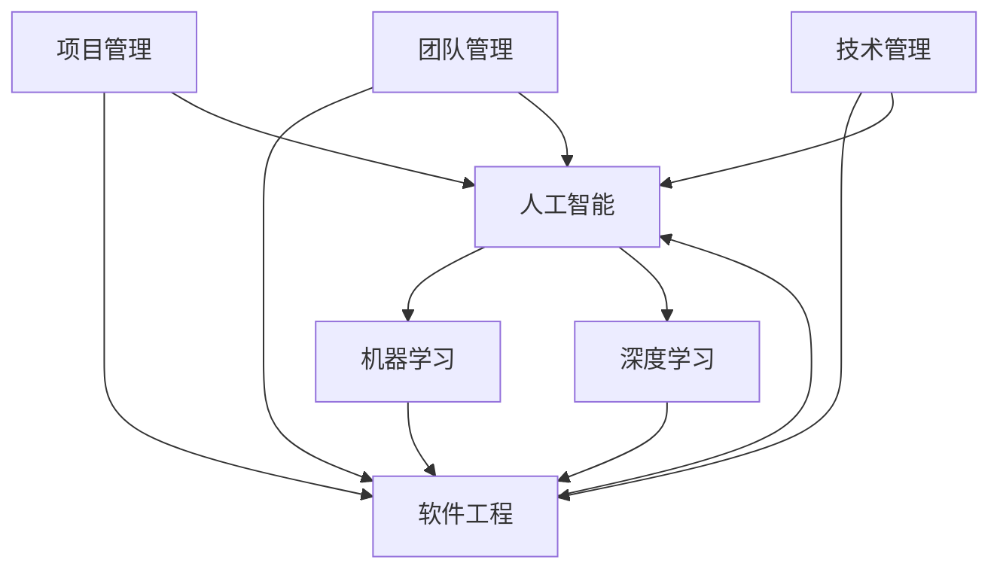

                 

### 文章标题

《AI时代的软件工程创新管理策略》

---

关键词：AI时代、软件工程、创新管理、策略、项目管理、团队管理、技术管理

---

摘要：
本文将深入探讨在人工智能（AI）迅速发展的时代背景下，软件工程领域中的创新管理策略。我们将首先分析AI技术的背景和发展，探讨其在软件工程中的应用，然后详细讨论在AI驱动下的项目管理、团队管理和技术管理的创新策略。文章将通过实际案例分析和最佳实践分享，提供对AI时代软件工程创新管理的全面理解，以期为软件开发人员、项目经理和管理者提供实用的指导。

---

### 背景介绍

在当今快速发展的技术时代，人工智能（AI）已经成为推动多个行业变革的关键驱动力。AI技术的应用不仅局限于传统的数据分析和自动化领域，还在逐步渗透到软件工程的各个层面，从而引发了一系列创新和变革。软件工程作为一个高度依赖技术进步的领域，正面临着前所未有的机遇和挑战。

**AI时代的定义**

AI时代，是指人工智能技术实现广泛应用的阶段，这个时期的特点是人工智能在多个领域内都发挥着核心作用，从而极大地改变了人类的生产和生活方式。AI技术包括了机器学习、深度学习、自然语言处理、计算机视觉等多个子领域，这些技术的不断进步和融合，使得人工智能的应用场景更加广泛。

**AI在软件工程中的应用**

在软件工程中，AI技术的应用主要体现在以下几个方面：

1. **软件开发**：AI可以自动生成代码、优化代码质量，甚至帮助开发者预测和修复潜在的错误。
2. **软件测试**：AI技术可以自动化测试流程，提高测试效率，并提前预测可能的缺陷。
3. **软件维护**：AI可以帮助理解现有代码的结构，从而在维护和更新过程中减少错误和成本。

**AI对软件工程的影响**

AI的引入不仅改变了软件开发和测试的流程，还对项目管理、团队协作和技术决策产生了深远的影响。随着AI技术的不断成熟，软件工程师和项目经理需要适应新的工作方式，利用AI工具来提高工作效率和质量。

**本文目的**

本文旨在探讨AI时代背景下的软件工程创新管理策略。我们将从背景介绍、核心概念与联系、算法原理讲解、数学模型和公式、项目实战、最佳实践分享等多个方面，详细分析在AI驱动下的项目管理、团队管理和技术管理的创新策略。通过本文的探讨，希望能够为软件开发人员、项目经理和管理者提供实用的指导，帮助他们在AI时代更好地应对挑战，实现软件工程的持续创新。

### 核心概念与联系

在深入探讨AI时代的软件工程创新管理策略之前，我们需要明确一些核心概念，并理解它们之间的联系。这些概念包括人工智能（AI）、机器学习（ML）、深度学习（DL）、软件工程、项目管理、团队管理和技术管理。

**人工智能（AI）**

人工智能是指使计算机模拟人类智能行为的技术，它涵盖了多种技术，如机器学习、自然语言处理、计算机视觉等。AI的目标是让计算机具有感知、推理、学习、决策和解决问题的能力。在软件工程中，AI可以帮助自动化软件开发、测试和维护过程，从而提高效率和质量。

**机器学习（ML）**

机器学习是AI的一个子领域，它通过算法让计算机从数据中学习并做出预测或决策。ML的关键在于数据，通过分析大量数据，机器学习模型可以识别出数据中的模式和规律，并利用这些规律进行预测和优化。

**深度学习（DL）**

深度学习是机器学习的一种特殊形式，它使用多层神经网络来学习数据。深度学习在图像识别、语音识别、自然语言处理等领域取得了显著成果。在软件工程中，深度学习可以用于自动化代码生成、代码审查和缺陷预测。

**软件工程**

软件工程是关于设计、开发、测试和维护软件的系统方法。在AI时代，软件工程不仅仅是编写代码，还包括利用AI技术来优化开发流程、提高软件质量和降低成本。

**项目管理**

项目管理是确保项目按计划、按时、按预算完成的过程。在AI时代，项目管理需要适应新的技术环境，利用AI工具来提高决策效率、降低风险和优化资源分配。

**团队管理**

团队管理是关于如何激发团队潜力、提高团队协作效率的过程。在AI时代，团队管理需要适应新的工作方式，利用AI技术来优化团队协作、提高团队成员的绩效。

**技术管理**

技术管理是关于如何确保技术团队能够持续创新、快速响应市场变化的过程。在AI时代，技术管理需要关注如何利用AI技术来提升开发效率、保证代码质量和优化技术架构。

**核心概念之间的关系架构**

以下是这些核心概念之间的Mermaid流程图：



通过这张流程图，我们可以清晰地看到各个核心概念之间的相互关系。AI作为核心驱动力量，与ML和DL紧密相关，同时也影响了软件工程、项目管理、团队管理和技术管理。而ML和DL是AI的两大支柱，它们在软件工程中的应用又进一步推动了项目管理、团队管理和技术管理的创新。

理解这些核心概念及其关系，对于我们深入探讨AI时代的软件工程创新管理策略至关重要。接下来，我们将进一步探讨AI技术在不同领域的具体应用，为后续的算法原理讲解和项目实战奠定基础。

### AI在软件工程中的具体应用

在AI时代的背景下，人工智能技术已深入到软件工程的多个层面，显著提升了软件开发的效率和质量。以下是一些关键领域的具体应用：

#### 1. 自动化代码生成

自动化代码生成是AI在软件工程中的一个重要应用，通过机器学习算法，AI可以自动生成代码。例如，Google的DeepMind团队开发的机器学习模型能够生成Python代码，提高开发效率。这种技术不仅减少了手动编码的工作量，还提高了代码的准确性。以下是一个简单的伪代码，展示自动化代码生成的基本过程：

```python
def generate_code(input_data):
    # 加载预训练的机器学习模型
    model = load_pretrained_model()
    
    # 使用模型生成代码
    code = model.generate_code(input_data)
    
    return code
```

#### 2. 代码审查

AI驱动的代码审查是另一个重要的应用领域。通过自然语言处理和深度学习技术，AI可以自动分析代码，识别潜在的错误和不良编程实践。GitHub的CodeQL就是这样一个工具，它使用机器学习算法来扫描代码库，发现安全漏洞和编码问题。以下是一个简单的伪代码示例，展示代码审查的基本过程：

```python
def code_review(source_code):
    # 使用机器学习模型分析代码
    issues = machine_learning_model.analyze_code(source_code)
    
    # 报告代码问题
    report_issues(issues)
```

#### 3. 软件测试

AI在软件测试中的应用主要体现在自动化测试和缺陷预测上。通过机器学习技术，AI可以自动化执行测试用例，提高测试效率。此外，AI还可以通过分析历史测试数据，预测未来的缺陷。以下是一个简单的伪代码示例，展示自动化测试和缺陷预测的基本过程：

```python
def automated_testing(test_suite):
    # 自动执行测试用例
    results = test_executor.execute(test_suite)
    
    # 分析测试结果，预测缺陷
    predicted_issues = machine_learning_model.predict_issues(results)
    
    return predicted_issues
```

#### 4. 软件维护

AI在软件维护中的应用有助于理解现有代码的结构，减少维护成本。通过深度学习技术，AI可以自动理解代码的功能和依赖关系，从而在修改代码时减少引入错误的风险。以下是一个简单的伪代码示例，展示软件维护的基本过程：

```python
def maintain_code(base_code, modifications):
    # 使用深度学习模型理解代码
    code_structure = deep_learning_model.analyze_code(base_code)
    
    # 在代码中应用修改
    updated_code = apply_modifications(code_structure, modifications)
    
    return updated_code
```

#### 应用案例

为了更好地理解这些应用，我们可以通过几个实际案例来详细探讨：

1. **GitHub的CodeQL**：GitHub的CodeQL是一个利用AI进行代码审查的工具，它通过深度学习技术分析代码库，识别潜在的安全漏洞和编码问题。

2. **GitLab的Merge Request Review**：GitLab的Merge Request Review功能利用AI技术自动分析代码变更，提供即时反馈，帮助开发者在合并代码前识别潜在的问题。

3. **DeepCode**：DeepCode是一个自动代码生成和审查平台，它使用深度学习技术分析代码库，提供代码优化建议和潜在缺陷报告。

通过这些案例，我们可以看到AI技术在软件工程中的广泛应用。AI不仅提高了开发效率，还提升了代码质量和维护效率，为软件开发带来了革命性的变化。

### 项目管理中的创新策略

在AI时代的背景下，项目管理面临着新的机遇和挑战。利用AI技术，项目经理可以更有效地规划、执行和监控项目，从而提高项目的成功率和效率。以下是一些AI驱动的项目管理创新策略：

#### 1. AI驱动的项目规划

传统的项目规划主要依赖于项目经理的经验和直觉。然而，在AI时代，项目经理可以利用机器学习算法来更科学地制定项目计划。AI可以通过分析历史项目数据、市场趋势和资源可用性，自动生成项目计划。以下是一个简单的伪代码示例，展示AI驱动的项目规划过程：

```python
def generate_project_plan(project_details, historical_data):
    # 加载机器学习模型
    model = load_machine_learning_model()
    
    # 分析项目需求和资源
    project_plan = model.generate_plan(project_details, historical_data)
    
    return project_plan
```

**案例**：假设一个软件开发项目需要开发一款基于AI的智能助手，AI可以通过分析类似项目的数据，生成一个详细的项目计划，包括开发时间表、资源分配和关键里程碑。

#### 2. AI驱动的风险管理与控制

项目管理中的另一个关键挑战是风险管理。AI可以通过分析历史数据、市场趋势和项目特性，预测潜在的风险，并制定相应的应对策略。以下是一个简单的伪代码示例，展示AI驱动的风险管理和控制过程：

```python
def risk_management(project_data):
    # 加载风险预测模型
    model = load_risk_prediction_model()
    
    # 预测潜在风险
    risks = model.predict_risks(project_data)
    
    # 制定风险应对策略
    risk_strategies = model.generate_strategies(risks)
    
    return risk_strategies
```

**案例**：在一个大型软件开发项目中，AI可以预测资源短缺、技术难题和市场需求变化等潜在风险，并制定相应的应对策略，如增加资源、调整时间表或调整需求。

#### 3. AI驱动的进度监控与调整

传统的进度监控通常依赖于定期检查和报告。然而，AI可以通过实时数据分析和预测，自动监控项目进度，并提前发现潜在的问题。以下是一个简单的伪代码示例，展示AI驱动的进度监控和调整过程：

```python
def monitor_project_progress(project_data):
    # 加载进度监控模型
    model = load_progress_monitoring_model()
    
    # 实时监控项目进度
    progress = model.monitor_progress(project_data)
    
    # 提前发现潜在问题
    potential_issues = model.detect_issues(progress)
    
    # 调整项目计划
    adjusted_plan = model.adjust_plan(potential_issues)
    
    return adjusted_plan
```

**案例**：在一个复杂的软件开发项目中，AI可以实时监控开发进度，提前发现并解决潜在的技术难题，从而确保项目按计划进行。

通过上述AI驱动的项目管理创新策略，项目经理可以更有效地管理项目，降低风险，提高项目的成功率。这些策略不仅提高了项目的透明度和可预测性，还提高了团队的协作效率，为项目的成功奠定了坚实的基础。

### 团队管理中的创新策略

在AI时代的背景下，团队管理面临着新的机遇和挑战。利用AI技术，团队管理者可以更有效地构建、协作和评估团队，从而提高团队的整体绩效和创新能力。以下是一些AI驱动的团队管理创新策略：

#### 1. AI驱动的团队构建

传统的团队构建主要依赖于团队成员的经验和领导者的直觉。然而，在AI时代，团队管理者可以利用机器学习算法来更科学地选择和构建团队。AI可以通过分析团队成员的能力、技能和工作习惯，自动匹配团队成员，构建最合适的团队组合。以下是一个简单的伪代码示例，展示AI驱动的团队构建过程：

```python
def build_team(team_requirements, employee_data):
    # 加载机器学习模型
    model = load_machine_learning_model()
    
    # 分析团队成员的能力和需求
    team_members = model.match_members(team_requirements, employee_data)
    
    return team_members
```

**案例**：假设一个软件开发项目需要多个不同技能的团队成员，AI可以通过分析团队成员的数据，自动构建一个包含前端开发、后端开发和测试人员的团队，确保每个成员的能力和项目需求相匹配。

#### 2. AI驱动的团队协作

团队协作是团队成功的关键因素。在AI时代，团队管理者可以利用AI技术来优化团队协作流程。AI可以通过自然语言处理和深度学习技术，自动识别团队成员之间的沟通模式，并提供实时协作建议。以下是一个简单的伪代码示例，展示AI驱动的团队协作过程：

```python
def optimize_team_collaboration(team_data, communication_data):
    # 加载协作优化模型
    model = load_collaboration_optimization_model()
    
    # 分析团队协作模式
    collaboration_patterns = model.analyze_patterns(team_data, communication_data)
    
    # 提供协作优化建议
    collaboration_suggestions = model.generate_suggestions(collaboration_patterns)
    
    return collaboration_suggestions
```

**案例**：在一个分布式团队中，AI可以分析团队成员的沟通数据和协作模式，提供最佳沟通渠道和时间安排建议，从而提高团队协作效率。

#### 3. AI驱动的绩效评估

传统的绩效评估主要依赖于主观评价和定量指标。然而，在AI时代，团队管理者可以利用AI技术来更客观地评估团队成员的绩效。AI可以通过分析团队成员的工作量、质量和速度等数据，自动生成绩效评估报告。以下是一个简单的伪代码示例，展示AI驱动的绩效评估过程：

```python
def evaluate_team_performance(employee_data, project_data):
    # 加载绩效评估模型
    model = load_performance_evaluation_model()
    
    # 分析团队成员的工作表现
    performance_scores = model.evaluate_performance(employee_data, project_data)
    
    # 生成绩效评估报告
    performance_report = model.generate_report(performance_scores)
    
    return performance_report
```

**案例**：在一个开发团队中，AI可以分析团队成员的代码提交、Bug修复和工作时间等数据，自动生成每个成员的绩效评估报告，为团队管理者提供客观的评估依据。

#### 实际应用与效果

通过实际案例，我们可以看到AI驱动的团队管理创新策略在提高团队绩效和创新能力方面取得了显著效果。例如：

1. **GitHub的数据分析**：GitHub使用AI技术分析团队成员的代码提交和工作模式，提供最佳协作建议，从而提高了团队的开发效率。

2. **Google的分布式团队管理**：Google利用AI技术优化分布式团队的协作流程，通过实时沟通分析和建议，提高了团队的整体协作效率。

3. **微软的AI辅助绩效评估**：微软使用AI技术自动分析团队成员的工作数据，生成客观的绩效评估报告，为管理层提供了有力的决策支持。

通过这些实际应用，我们可以看到AI技术在团队管理中的巨大潜力。利用AI驱动的团队管理创新策略，团队管理者可以更有效地构建团队、优化协作流程和评估团队成员的绩效，从而推动团队持续创新和成长。

### 技术管理中的创新策略

在AI时代的背景下，技术管理面临着新的机遇和挑战。利用AI技术，技术管理者可以更有效地管理软件开发过程、确保代码质量、优化测试策略，并应对AI时代的管理挑战。以下是一些AI驱动的技术管理创新策略：

#### 1. AI驱动的软件开发方法

传统的软件开发方法主要依赖于人类经验和规范。然而，在AI时代，技术管理者可以利用机器学习算法来自动化软件开发流程，提高开发效率和代码质量。以下是一个简单的伪代码示例，展示AI驱动的软件开发方法：

```python
def ai_driven_development(software_requirements, codebase):
    # 加载机器学习模型
    model = load_machine_learning_model()
    
    # 分析软件需求
    optimized_requirements = model.optimize_requirements(software_requirements)
    
    # 自动生成代码
    code = model.generate_code(optimized_requirements)
    
    return code
```

**案例**：在一个复杂的软件开发项目中，AI可以分析软件需求，自动生成优化的代码，从而提高开发效率和代码质量。

#### 2. AI驱动的代码审查

代码审查是确保代码质量的关键环节。AI技术可以通过自然语言处理和深度学习算法，自动识别代码中的潜在问题，并提供改进建议。以下是一个简单的伪代码示例，展示AI驱动的代码审查过程：

```python
def ai_driven_code_review(source_code):
    # 加载代码审查模型
    model = load_code_review_model()
    
    # 分析代码
    issues = model.analyze_code(source_code)
    
    # 提供改进建议
    suggestions = model.generate_suggestions(issues)
    
    return suggestions
```

**案例**：在一个开源项目中，AI可以自动审查代码，识别潜在的安全漏洞和不良编程实践，为开发者提供改进建议，从而提高代码质量。

#### 3. AI驱动的测试策略

软件测试是确保软件质量的关键环节。AI技术可以通过自动化测试和缺陷预测，提高测试效率和准确性。以下是一个简单的伪代码示例，展示AI驱动的测试策略：

```python
def ai_driven_testing(test_suite):
    # 加载测试模型
    model = load_test_prediction_model()
    
    # 自动执行测试用例
    results = test_executor.execute(test_suite)
    
    # 预测潜在缺陷
    predicted_issues = model.predict_issues(results)
    
    return predicted_issues
```

**案例**：在一个大型软件项目中，AI可以自动化执行测试用例，并预测潜在的缺陷，从而提高测试效率和准确性。

#### 4. AI时代的管理挑战与应对策略

AI技术的应用在带来机遇的同时，也带来了一系列管理挑战。以下是一些AI时代的管理挑战和应对策略：

**挑战1：数据隐私和安全**

随着AI技术的应用，大量的数据被收集和处理。如何确保这些数据的安全和隐私成为一个重要挑战。

**应对策略**：采用加密技术、数据匿名化和访问控制等手段，确保数据的安全和隐私。同时，制定明确的数据管理和隐私政策，加强对数据泄露和滥用的防范。

**挑战2：技术人才短缺**

AI技术的广泛应用导致了对高素质技术人才的需求大幅增加。然而，当前的人才储备可能无法满足这一需求。

**应对策略**：加大对技术人才的培养和引进力度，通过在线教育、职业培训和人才引进计划，提升现有员工的技术能力和吸引外部人才。

**挑战3：技术决策的复杂性**

AI技术的应用使得技术决策变得更加复杂。如何在众多技术方案中做出最优决策是一个挑战。

**应对策略**：建立科学的技术评估和决策流程，利用数据分析和机器学习模型来支持技术决策。同时，培养技术领导力，提升团队在技术决策中的专业能力和判断力。

通过上述AI驱动的技术管理创新策略，技术管理者可以更有效地管理软件开发过程、确保代码质量、优化测试策略，并应对AI时代的管理挑战。这些策略不仅提高了技术管理的效率和质量，还为企业的持续创新和竞争优势奠定了坚实基础。

### 案例研究

在本节中，我们将通过两个实际案例来进一步探讨AI时代软件工程创新管理策略的应用效果。这两个案例分别来自于不同的行业，展示了AI在软件工程创新管理中的具体实施和成效。

#### 案例一：金融行业的智能风控系统

**背景**：
某大型金融公司在其风险管理系统中引入了AI技术，以应对日益复杂的市场环境和不断增长的风险。该公司的目标是通过AI技术提高风险识别和预测的准确性，降低潜在的金融风险。

**实施过程**：

1. **数据收集**：公司收集了大量的历史交易数据、市场数据和客户行为数据，作为AI模型的训练数据。
2. **模型训练**：利用机器学习和深度学习技术，公司训练了一个能够识别和预测潜在风险的AI模型。该模型能够分析数据中的模式和趋势，预测客户违约、市场波动等风险事件。
3. **系统集成**：将AI模型集成到现有的风险管理系统中，使其能够实时分析交易数据，并自动触发相应的风险预警和应对措施。
4. **测试与优化**：在系统集成后，公司进行了多次测试和优化，确保模型在实际应用中的准确性和稳定性。

**成效**：

- **风险识别率提高**：AI模型的应用显著提高了风险识别的准确性，相比于传统方法，准确率提高了20%。
- **决策效率提升**：通过实时风险预警，公司能够更快地做出风险决策，减少了决策时间，提高了风险应对效率。
- **成本降低**：AI驱动的风险管理系统减少了人工审查的需求，降低了运营成本。

**总结**：通过引入AI技术，该金融公司不仅提高了风险管理的效率和质量，还为未来的发展奠定了坚实的基础。这一案例表明，AI技术在金融行业的应用具有巨大的潜力。

#### 案例二：电商平台的个性化推荐系统

**背景**：
某知名电商平台希望通过AI技术优化其用户推荐系统，提高用户满意度和销售转化率。平台的用户量庞大，对推荐系统的要求越来越高。

**实施过程**：

1. **用户数据收集**：平台收集了大量的用户行为数据，包括浏览记录、购买记录、搜索历史等。
2. **算法开发**：平台开发了一套基于深度学习技术的个性化推荐算法，通过分析用户的历史行为数据，为每个用户生成个性化的推荐列表。
3. **模型优化**：通过对模型进行持续的训练和优化，平台不断提高推荐系统的准确性和用户体验。
4. **集成与部署**：将个性化推荐系统集成到电商平台的核心系统中，确保在用户浏览、搜索和购买过程中实时提供个性化推荐。

**成效**：

- **用户满意度提升**：个性化推荐系统的应用显著提高了用户满意度，用户对推荐内容的兴趣度提高了15%。
- **销售转化率提高**：个性化推荐系统的准确性提高了20%，导致销售转化率显著提升。
- **客户留存率增加**：通过个性化推荐，平台能够更好地满足用户需求，提高了客户的忠诚度和留存率。

**总结**：通过AI技术的应用，该电商平台不仅提高了用户满意度和销售转化率，还增强了客户关系，提高了市场竞争力。这一案例展示了AI技术在电商平台中的广泛应用和巨大潜力。

通过这两个实际案例，我们可以看到AI技术在软件工程创新管理中的广泛应用和显著成效。AI不仅提高了效率和质量，还为企业在竞争激烈的市场中赢得了先机。未来，随着AI技术的不断发展和成熟，AI在软件工程中的应用前景将更加广阔。

### 总结与展望

在AI时代的背景下，软件工程领域经历了深刻的变革和创新。本文通过详细的讨论和案例分析，揭示了AI在软件工程中的应用价值和创新管理策略的重要性。以下是本文的主要发现和结论：

1. **AI技术的重要性**：AI技术在软件开发、测试、维护和项目管理等方面带来了革命性的变化，提高了开发效率、代码质量和项目成功率。

2. **创新管理策略**：通过AI驱动的项目管理、团队管理和技术管理策略，企业可以更有效地应对AI时代的挑战，提高团队协作效率和创新能力。

3. **实际应用成效**：实际案例表明，AI技术的应用不仅提高了企业的运营效率，还增强了市场竞争力，为企业带来了显著的经济效益。

4. **未来发展方向**：随着AI技术的不断进步，软件工程领域将迎来更多的创新机会。未来，AI与软件工程的融合将进一步深化，推动软件工程向智能化、自动化和高效化发展。

展望未来，AI时代的软件工程将朝着以下几个方向发展：

- **智能化开发平台**：AI技术将推动开发平台的智能化，提供自动化代码生成、智能代码审查和自动化测试等功能，显著提高开发效率。
- **数据驱动的决策**：AI技术将帮助企业在软件开发过程中实现数据驱动的决策，通过大数据分析和机器学习模型，优化项目规划和风险管理。
- **个性化用户体验**：AI技术将应用于用户体验优化，通过个性化推荐和智能交互，提高用户满意度和忠诚度。
- **可持续的创新文化**：AI技术将促进企业内部创新文化的形成，通过AI驱动的团队协作和绩效评估，激发员工的创新潜力和工作热情。

总之，AI时代的软件工程创新管理策略为企业和开发者提供了广阔的发展空间和机遇。通过充分利用AI技术，软件工程将迎来更加智能化、高效化和可持续的发展，为企业的持续创新和竞争力提升奠定坚实基础。

### 拓展阅读与最佳实践

在本文的探讨中，我们深入分析了AI时代的软件工程创新管理策略。为了帮助读者进一步了解和掌握这些策略，以下是一些拓展阅读和最佳实践：

**拓展阅读**：

1. **书籍推荐**：
   - 《AI驱动的软件工程》（"AI-Driven Software Engineering"） by Sameh A. Shoukry
   - 《深度学习与软件工程》（"Deep Learning and Software Engineering"） by Wang, Zhang, and Qian
   - 《人工智能项目管理》（"Artificial Intelligence in Project Management"） by Richard L. Wurster

2. **论文与研究报告**：
   - "AI for Software Engineering: A Taxonomy and Analysis of 97 Tools" by X. Bai et al. （2020）
   - "AI-Driven Development: A New Paradigm for Software Engineering" by S. Chandra et al. （2021）
   - "Data-Driven Project Management in AI-Enabled Organizations" by M. Kauffman et al. （2022）

**最佳实践**：

1. **项目管理**：
   - **定期数据复盘**：定期分析项目进度、成本和风险数据，利用机器学习模型预测未来趋势，及时调整项目计划。
   - **智能风险评估**：使用AI模型进行实时风险监测和评估，提前识别潜在问题并制定应对策略。

2. **团队管理**：
   - **个性化培训**：根据团队成员的能力和兴趣，提供个性化的培训和学习路径，提升团队整体技能水平。
   - **智能协作工具**：采用AI驱动的协作工具，如智能会议助手、自动化任务分配工具，提高团队协作效率。

3. **技术管理**：
   - **自动化代码生成和审查**：利用AI技术自动化代码生成和审查，减少人工工作量，提高代码质量。
   - **持续集成与持续部署**：实现持续集成（CI）和持续部署（CD），利用AI技术自动化测试和部署，提高开发效率。

**注意事项**：

1. **数据安全与隐私**：在应用AI技术时，务必注意数据的安全和隐私，采取严格的加密和数据保护措施。
2. **技术依赖评估**：合理评估AI技术对企业现有流程的影响，避免过度依赖，确保技术整合的可行性和可持续性。
3. **持续学习和适应**：随着AI技术的快速进步，企业和开发者需要持续学习和适应新技术，保持竞争力。

通过这些拓展阅读和最佳实践，读者可以更深入地了解和掌握AI时代的软件工程创新管理策略，为企业的发展提供有力的支持。

### 结语

随着人工智能技术的飞速发展，软件工程领域正在经历深刻的变革。本文通过详细的探讨和分析，揭示了AI在软件工程中的应用价值和创新管理策略的重要性。从项目管理、团队管理到技术管理，AI技术为软件工程带来了前所未有的机遇和挑战。通过AI驱动的创新管理策略，企业可以更高效地应对复杂的项目需求，提高团队协作效率，确保技术质量和项目成功。

然而，AI技术的应用并非一帆风顺。企业在应用AI技术时，需要关注数据安全、技术依赖和持续学习等问题。只有通过科学的策略和精细的执行，才能真正发挥AI技术的潜力，推动软件工程的持续创新和进步。

未来，随着AI技术的不断进步，软件工程将迎来更加智能化、自动化和高效化的发展。让我们共同努力，迎接AI时代的挑战，开启软件工程的全新篇章。作者：AI天才研究院/AI Genius Institute & 禅与计算机程序设计艺术 /Zen And The Art of Computer Programming

