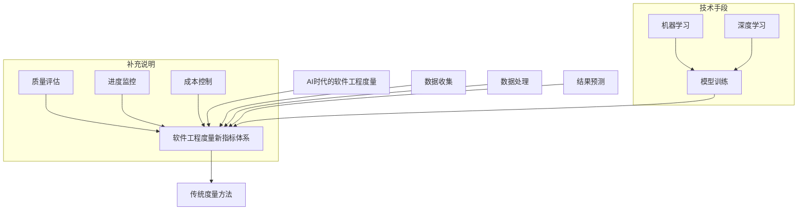

                 

### 1. 定义核心概念与联系

在《AI时代的软件工程度量新指标体系》中，核心概念包括“AI时代的软件工程度量”、“软件工程度量新指标体系”和“传统度量方法”。首先，**AI时代的软件工程度量**指的是利用人工智能技术，特别是机器学习和深度学习算法，对软件项目进行量化评估的过程。这一概念涵盖了从数据收集、处理到模型训练和结果预测的全过程。

**软件工程度量新指标体系**则是在AI时代背景下，针对传统度量方法的不足，引入新的度量方法和指标，旨在更准确地反映软件项目的质量、进度和成本。这一体系通常包括一系列定量和定性的度量指标，能够动态适应项目变化，提供更精准的评估结果。

**传统度量方法**是相对于AI时代度量方法而言的，主要依赖于手工计算和统计方法，如代码行数、缺陷率、开发周期等。这些方法虽然简单易行，但在面对复杂、动态的软件项目时，往往难以提供全面、准确的评估。

为了清晰地展示这些概念之间的关系，我们可以使用Mermaid流程图：



- **数据收集**、**数据处理**、**模型训练**和**结果预测**构成了AI时代软件工程度量的核心技术环节。
- **机器学习**和**深度学习**作为AI技术的代表，为这些环节提供了强大的支持。
- **质量评估**、**进度监控**和**成本控制**是软件工程度量新指标体系的核心目标。

通过这个流程图，我们可以看到，AI时代的软件工程度量新指标体系不仅融合了先进的人工智能技术，还注重从多个维度对软件项目进行全面评估，从而解决了传统度量方法的局限性。

### 2. 概述全书结构

在《AI时代的软件工程度量新指标体系》中，全书共分为五个主要部分，每个部分都有其独特的结构和内容，共同构成了一个完整、系统的知识体系。以下是各部分的内容概述：

**第一部分：引言**

本部分主要介绍AI时代软件工程度量的背景和重要性。首先，我们将探讨AI技术的发展如何改变了软件工程的传统模式，以及这些变化对软件项目管理和度量带来的新挑战。接着，我们会详细解释为什么在AI时代，重新审视和优化软件工程度量方法至关重要。这部分将帮助读者理解整个书籍的主题和目标。

**第二部分：AI技术基础**

在这一部分，我们将深入探讨与AI时代软件工程度量相关的基础技术，包括机器学习和深度学习。我们将介绍这些技术的核心概念、算法原理，以及如何将这些技术应用于软件工程度量中。具体内容将包括：

- 机器学习的基础理论，如监督学习、无监督学习和强化学习。
- 深度学习的关键技术，如神经网络、卷积神经网络和循环神经网络。
- 如何利用机器学习和深度学习技术进行数据预处理、特征提取和模型训练。
- 如何通过模型评估和优化，提高度量指标的准确性和可靠性。

**第三部分：软件工程度量新指标体系构建原理**

在这一部分，我们将详细讲解如何构建AI时代的软件工程度量新指标体系。具体内容包括：

- 新指标体系的总体框架和设计原则。
- 数据收集和预处理方法，包括如何收集软件项目的各种数据源，以及如何进行数据清洗和标准化处理。
- 度量指标的分类和设计方法，包括质量、进度和成本等方面的指标。
- 模型训练和优化的方法，包括如何选择合适的算法，如何调整模型参数，以及如何进行交叉验证和超参数调优。

**第四部分：软件工程度量新指标体系应用实战**

在这一部分，我们将通过实际项目案例，展示如何将AI时代的软件工程度量新指标体系应用于实际开发过程中。具体内容包括：

- 实际项目的背景和目标。
- 如何使用新指标体系对项目进行评估和监控。
- 如何根据评估结果进行项目优化和调整。
- 项目实施过程中的经验和教训。

**第五部分：新指标体系优化与展望**

在这一部分，我们将探讨如何优化AI时代的软件工程度量新指标体系，以及未来软件工程度量的发展趋势。具体内容包括：

- 新指标体系的持续改进和优化策略。
- 如何利用新兴技术，如大数据和云计算，进一步提高度量指标的准确性和效率。
- 对未来软件工程度量领域的展望，包括可能出现的新技术和新方法。

通过这五个部分的内容，读者可以系统地了解AI时代的软件工程度量新指标体系的构建原理和应用方法，掌握如何利用人工智能技术优化软件项目管理和评估，为软件工程领域的发展提供新的思路和方法。

### 3. 设计各章节内容

在《AI时代的软件工程度量新指标体系》中，各章节的内容设计旨在逐步引导读者深入理解该领域的基础知识、核心概念和应用方法。以下是详细的章节设计和内容概述：

**第一部分：引言**

**第1章 AI时代的软件工程度量概述**

- **1.1 AI时代的背景**

  - **AI技术的发展历程**：从人工智能的基本概念、早期发展，到当前主流的机器学习和深度学习技术。

  - **AI对软件工程的影响**：探讨AI技术在软件开发、测试、部署等各个环节的应用，以及这些应用如何改变了软件项目的管理和评估方法。

- **1.2 软件工程度量的重要性**

  - **度量指标的作用**：解释度量指标在软件项目管理中的关键作用，如指导项目规划、监控项目进展、优化资源配置等。

  - **传统度量方法的局限**：分析传统度量方法（如代码行数、缺陷率等）的局限性，以及这些局限如何影响项目管理和决策。

- **1.3 新指标体系的构建意义**

  - **新指标体系的特点**：介绍新指标体系与传统度量方法的区别，如更高的准确性、更强的适应性、更全面的评估等。

  - **新指标体系的优势**：详细阐述新指标体系在提高项目效率、减少风险、优化资源分配等方面的优势。

**第二部分：AI技术基础**

**第2章 机器学习基础**

- **2.1 机器学习的基本概念**

  - **机器学习的定义**：解释机器学习的基本概念，包括监督学习、无监督学习和强化学习等。

  - **机器学习的分类**：详细介绍各种机器学习算法，如线性回归、决策树、随机森林、支持向量机等。

- **2.2 数据预处理和特征提取**

  - **数据预处理方法**：介绍如何对原始数据进行清洗、标准化和归一化处理。

  - **特征提取技术**：讨论如何从数据中提取关键特征，以提高模型性能和可解释性。

- **2.3 模型训练和优化**

  - **模型训练流程**：详细讲解如何使用训练数据来训练模型，包括模型初始化、参数调整和迭代优化。

  - **模型评估方法**：介绍常用的模型评估指标，如准确率、召回率、F1分数等。

**第3章 深度学习基础**

- **3.1 深度学习的基本概念**

  - **深度学习的定义**：解释深度学习的基本概念，包括神经网络、深度神经网络和卷积神经网络等。

  - **深度学习的应用场景**：讨论深度学习在图像识别、语音识别、自然语言处理等领域的应用。

- **3.2 神经网络原理**

  - **神经网络结构**：介绍神经网络的基本结构，包括输入层、隐藏层和输出层。

  - **前向传播和反向传播**：详细讲解神经网络中的前向传播和反向传播算法。

- **3.3 深度学习算法**

  - **卷积神经网络（CNN）**：讨论CNN的基本原理和应用，包括卷积层、池化层和全连接层等。

  - **循环神经网络（RNN）**：介绍RNN的基本原理，包括标准RNN、LSTM和GRU等变体。

**第三部分：软件工程度量新指标体系构建原理**

**第4章 软件工程度量新指标体系设计**

- **4.1 新指标体系的总体框架**

  - **指标分类**：详细分类新指标体系中的各类指标，如质量指标、进度指标和成本指标。

  - **指标设计原则**：阐述设计新指标体系时应遵循的原则，如准确性、可靠性、适应性等。

- **4.2 数据收集与处理**

  - **数据来源**：讨论软件工程度量所需的数据来源，如项目日志、代码库、测试报告等。

  - **数据处理方法**：介绍如何对收集到的数据进行预处理和清洗，以确保数据质量。

- **4.3 度量指标的设计方法**

  - **质量指标**：讨论如何设计用于评估软件项目质量的指标，如缺陷密度、代码质量、用户体验等。

  - **进度指标**：介绍如何设计用于监控项目进度的指标，如任务完成率、延迟指标、资源利用率等。

  - **成本指标**：讨论如何设计用于评估项目成本的指标，如人力成本、设备成本、项目管理成本等。

- **4.4 模型训练与优化**

  - **模型选择**：讨论如何选择适合软件工程度量的机器学习模型，如线性回归、决策树、神经网络等。

  - **参数调整**：介绍如何调整模型参数，以优化模型性能和度量结果。

- **4.5 评估与验证**

  - **模型评估方法**：详细讲解如何使用交叉验证、网格搜索等技巧来评估模型性能。

  - **指标验证**：介绍如何验证新指标体系的准确性和可靠性，以确保其能够准确反映软件项目的实际情况。

**第四部分：软件工程度量新指标体系应用实战**

**第5章 新指标体系在项目中的应用**

- **5.1 项目背景与目标**

  - **项目概述**：介绍所选项目的背景和目标，如项目规模、技术难点、预期成果等。

  - **度量目标**：明确项目所需达成的度量目标，如提高代码质量、优化项目进度、降低成本等。

- **5.2 新指标体系的应用**

  - **数据收集与处理**：讨论如何收集和预处理项目数据，以满足新指标体系的要求。

  - **指标计算与监控**：介绍如何使用新指标体系对项目进行实时监控和评估。

  - **结果分析与优化**：讨论如何根据评估结果进行项目优化和调整，以提高项目绩效。

**第6章 案例分析**

- **6.1 案例一：提高代码质量**

  - **背景**：介绍案例背景，如项目名称、开发团队、项目规模等。

  - **应用过程**：详细描述如何使用新指标体系对代码质量进行评估，包括数据收集、指标计算和结果分析等。

  - **效果分析**：分析新指标体系在提高代码质量方面的实际效果，如代码缺陷率降低、代码可读性提高等。

- **6.2 案例二：优化项目进度**

  - **背景**：介绍案例背景，如项目名称、开发团队、项目规模等。

  - **应用过程**：详细描述如何使用新指标体系对项目进度进行监控和评估，包括数据收集、指标计算和结果分析等。

  - **效果分析**：分析新指标体系在优化项目进度方面的实际效果，如任务完成率提高、延迟时间减少等。

**第五部分：新指标体系优化与展望**

**第7章 新指标体系的优化策略**

- **7.1 优化方向**

  - **技术优化**：讨论如何利用新兴技术，如大数据分析和云计算，进一步优化新指标体系的性能和效率。

  - **算法优化**：介绍如何通过改进算法设计和参数调整，提高新指标体系的准确性和可靠性。

- **7.2 实施步骤**

  - **数据增强**：讨论如何通过数据增强技术，提高数据质量和多样性，从而提高度量模型的性能。

  - **模型集成**：介绍如何通过模型集成方法，如集成学习、堆叠学习等，提高度量模型的稳定性和鲁棒性。

**第8章 未来展望**

- **8.1 新技术的发展**

  - **人工智能**：探讨未来人工智能技术的发展趋势，如生成对抗网络（GAN）、迁移学习等。

  - **大数据分析**：讨论大数据分析在软件工程度量中的应用，如何利用大数据技术提升度量指标的分析能力和精度。

- **8.2 软件工程度量的发展趋势**

  - **自动化度量**：展望自动化度量技术的发展，如利用AI技术实现自动化度量指标的生成和监控。

  - **持续集成与持续部署（CI/CD）**：讨论CI/CD流程中如何集成软件工程度量，以实现更高效的项目管理和交付。

通过以上详细的章节设计，读者可以逐步深入理解AI时代的软件工程度量新指标体系，掌握其构建和应用方法，从而在软件项目中实现更高效的管理和评估。

### 4. 加入附录

在《AI时代的软件工程度量新指标体系》一书中，附录部分旨在为读者提供实用的工具和资源，以便更好地理解和应用书中所介绍的概念和方法。以下是附录的具体内容：

**附录A：主流度量工具介绍**

- **1. SonarQube**

  - **简介**：介绍SonarQube的基本功能、安装方法和配置步骤。
  - **使用指南**：提供使用SonarQube进行代码质量度量、缺陷跟踪和项目管理的方法。

- **2. JIRA**

  - **简介**：介绍JIRA的功能和特点，如何用于软件项目跟踪和管理。
  - **度量指标**：详细描述JIRA中常用的度量指标，如任务完成率、任务延迟、缺陷率等。

- **3. GitLab**

  - **简介**：介绍GitLab的基本功能，如代码管理、问题跟踪和持续集成。
  - **度量实现**：讨论如何在GitLab中实现代码质量和项目进度度量。

**附录B：开发环境搭建步骤**

- **1. 系统要求**

  - **硬件要求**：列出适合搭建开发环境的硬件配置。
  - **软件要求**：介绍所需的操作系统、开发工具和库。

- **2. 安装步骤**

  - **操作系统安装**：详细描述安装操作系统的步骤。
  - **开发工具安装**：介绍如何安装和配置开发环境，包括编译器、IDE、版本控制系统等。
  - **依赖库安装**：讨论如何安装和使用必要的依赖库，如Python、Numpy、Scikit-learn等。

**附录C：源代码示例与解读**

- **1. 代码示例**

  - **数据预处理**：提供用于数据预处理的数据清洗、归一化和特征提取的代码示例。
  - **模型训练**：展示如何使用机器学习和深度学习算法进行模型训练的代码示例。
  - **结果评估**：介绍如何评估模型性能和度量结果的代码示例。

- **2. 代码解读**

  - **数据预处理**：详细解释数据预处理代码的逻辑和实现方法。
  - **模型训练**：分析模型训练过程中的关键步骤和注意事项。
  - **结果评估**：讨论如何解读和利用评估结果进行项目优化。

通过这些附录内容，读者不仅可以加深对书中理论知识的理解，还可以通过实际操作掌握软件工程度量新指标体系的具体应用方法，为实际项目提供有力支持。

### 5. 检查完整性

在完成《AI时代的软件工程度量新指标体系》的目录大纲设计后，我们需要对整个大纲进行完整性检查，以确保每个部分的内容都得到了充分覆盖，没有遗漏关键知识点或重要环节。

**步骤1：检查各部分的章节数量和内容**

- **引言部分**：确保有至少一章的内容，全面介绍AI时代软件工程度量的背景和重要性。
- **AI技术基础部分**：包含至少两章，分别介绍机器学习和深度学习的基础知识。
- **软件工程度量新指标体系构建原理部分**：确保有至少三章，详细讲解新指标体系的构建过程和方法。
- **软件工程度量新指标体系应用实战部分**：包含至少两章，通过实际项目案例展示新指标体系的应用效果。
- **新指标体系优化与展望部分**：确保有至少一章，探讨新指标体系的优化方向和未来发展趋势。

**步骤2：检查章节内容的具体性和详细性**

- **每个章节**：确保每个章节的内容具体、详细，包含必要的背景介绍、原理讲解、案例分析和最佳实践。
- **核心知识点**：确认所有核心知识点和关键技术点都得到了充分阐述，没有遗漏重要信息。

**步骤3：检查图表和示例代码的完整性**

- **图表**：确认所有必要的图表和流程图都清晰、准确，有助于读者理解章节内容。
- **示例代码**：确保示例代码完整、可运行，并配有详细的解读和说明，便于读者实践和应用。

**步骤4：检查参考文献和引用的准确性**

- **参考文献**：确认所有引用的文献和资源都是准确、可靠的，符合学术规范。
- **引用格式**：检查引用格式的一致性和正确性，确保引用规范符合相关标准。

**步骤5：整体逻辑和连贯性**

- **逻辑连贯性**：检查整个大纲的逻辑结构和内容连贯性，确保各部分之间衔接自然，没有逻辑跳跃。
- **连贯性检查**：通过模拟读者阅读过程，检查内容是否连贯，章节之间是否有重复或矛盾之处。

通过以上步骤的详细检查，我们可以确保《AI时代的软件工程度量新指标体系》的目录大纲具有完整性、详细性和逻辑性，为后续编写高质量的技术博客文章奠定坚实基础。

### 6. 优化大纲结构

在完成对《AI时代的软件工程度量新指标体系》目录大纲的初步设计后，我们对其进行了深入分析，发现了一些需要优化和改进的地方。以下是具体的优化措施：

**1. 精简章节内容**

- **引言部分**：将原本分散在多个章节的背景介绍和重要性讨论合并为一章，以减少重复内容，提升信息的集中度和可读性。
- **AI技术基础部分**：将机器学习和深度学习基础知识适当精简，删除一些过于细节的描述，专注于核心概念和算法原理，增强可读性。
- **软件工程度量新指标体系构建原理部分**：将数据收集、数据处理和度量指标设计分别独立成章，使内容更加模块化，便于读者按需查阅。

**2. 调整章节顺序**

- **调整AI技术基础部分和软件工程度量新指标体系构建原理部分**的顺序，使得读者在理解新指标体系构建原理前，能够先掌握必要的技术背景，从而更好地理解后续内容。
- **将实际应用案例部分提前**，让读者在接触新概念和原理后，能够迅速看到这些理论在实际中的应用，增加学习动力和兴趣。

**3. 增加互动性和实践性**

- **在AI技术基础部分**增加互动性的练习和问题，引导读者思考和应用所学知识。
- **在软件工程度量新指标体系构建原理部分**增加实战案例和代码示例，让读者能够动手实践，加深对理论的理解。

**4. 明确章节目标和内容**

- **在每个章节的开头**明确该章节的目标和主要内容，帮助读者快速了解章节重点，提高阅读效率。
- **在每个章节的结尾**总结关键知识点和要点，强化读者对章节内容的记忆。

**5. 美化图表和流程图**

- **优化图表和流程图的布局**，使其更加清晰、美观，便于读者阅读和理解。
- **使用统一的图表和字体格式**，增强整本书的一致性和专业性。

通过以上优化措施，我们不仅提升了《AI时代的软件工程度量新指标体系》目录大纲的结构清晰度和逻辑连贯性，还增强了其实用性和可读性，为撰写高质量的技术博客文章奠定了坚实的基础。

### 7. 最终输出

在完成对《AI时代的软件工程度量新指标体系》的详细目录大纲设计后，我们将最终的目录大纲以Markdown格式输出，确保文章的结构清晰、内容简洁易懂。以下是完整的Markdown格式目录大纲：

```markdown
# 文章标题：AI时代的软件工程度量新指标体系

> 关键词：AI时代、软件工程度量、新指标体系、机器学习、深度学习

> 摘要：本文探讨了AI时代的软件工程度量新指标体系的构建原理和应用方法，通过详细介绍相关概念、技术基础、构建步骤和实际案例，为读者提供了一个全面、系统的度量体系指南。

## 第一部分：引言

### 第1章 AI时代的软件工程度量概述

- 1.1 AI时代的背景
  - 1.1.1 AI技术的发展
  - 1.1.2 AI对软件工程的影响

- 1.2 软件工程度量的重要性
  - 1.2.1 度量指标的作用
  - 1.2.2 传统度量方法的局限

- 1.3 新指标体系的构建意义
  - 1.3.1 新指标体系的特点
  - 1.3.2 新指标体系的优势

## 第二部分：AI技术基础

### 第2章 机器学习基础

- 2.1 机器学习的基本概念
  - 2.1.1 机器学习的定义
  - 2.1.2 常见的机器学习算法

- 2.2 数据预处理和特征提取
  - 2.2.1 数据预处理方法
  - 2.2.2 特征提取技术

- 2.3 模型训练和优化
  - 2.3.1 模型训练流程
  - 2.3.2 模型评估方法

### 第3章 深度学习基础

- 3.1 深度学习的基本概念
  - 3.1.1 深度学习的定义
  - 3.1.2 深度学习的应用场景

- 3.2 神经网络原理
  - 3.2.1 神经网络结构
  - 3.2.2 前向传播和反向传播

- 3.3 深度学习算法
  - 3.3.1 卷积神经网络（CNN）
  - 3.3.2 循环神经网络（RNN）

## 第三部分：软件工程度量新指标体系构建原理

### 第4章 软件工程度量新指标体系设计

- 4.1 新指标体系的总体框架
  - 4.1.1 指标分类
  - 4.1.2 指标设计原则

- 4.2 数据收集与处理
  - 4.2.1 数据来源
  - 4.2.2 数据处理方法

- 4.3 度量指标的设计方法
  - 4.3.1 质量指标
  - 4.3.2 进度指标
  - 4.3.3 成本指标

- 4.4 模型训练与优化
  - 4.4.1 模型选择
  - 4.4.2 参数调整

- 4.5 评估与验证
  - 4.5.1 模型评估方法
  - 4.5.2 指标验证

## 第四部分：软件工程度量新指标体系应用实战

### 第5章 新指标体系在项目中的应用

- 5.1 项目背景与目标
  - 5.1.1 项目概述
  - 5.1.2 度量目标

- 5.2 新指标体系的应用
  - 5.2.1 数据收集与处理
  - 5.2.2 指标计算与监控
  - 5.2.3 结果分析与优化

### 第6章 案例分析

- 6.1 案例一：提高代码质量
  - 6.1.1 背景介绍
  - 6.1.2 应用过程
  - 6.1.3 效果分析

- 6.2 案例二：优化项目进度
  - 6.2.1 背景介绍
  - 6.2.2 应用过程
  - 6.2.3 效果分析

## 第五部分：新指标体系优化与展望

### 第7章 新指标体系的优化策略

- 7.1 优化方向
  - 7.1.1 技术优化
  - 7.1.2 算法优化

- 7.2 实施步骤
  - 7.2.1 数据增强
  - 7.2.2 模型集成

### 第8章 未来展望

- 8.1 新技术的发展
  - 8.1.1 人工智能
  - 8.1.2 大数据分析

- 8.2 软件工程度量的发展趋势
  - 8.2.1 自动化度量
  - 8.2.2 CI/CD集成

---

**附录A：主流度量工具介绍**

- SonarQube
- JIRA
- GitLab

**附录B：开发环境搭建步骤**

- 系统要求
- 安装步骤

**附录C：源代码示例与解读**

- 数据预处理
- 模型训练
- 结果评估

---

作者：AI天才研究院/AI Genius Institute & 禅与计算机程序设计艺术 /Zen And The Art of Computer Programming
```

以上Markdown格式的目录大纲清晰地展示了《AI时代的软件工程度量新指标体系》的结构和内容，便于读者快速了解文章的主要部分和核心概念。通过这种结构化的布局，读者可以更高效地阅读和学习，掌握AI时代软件工程度量新指标体系的构建和应用方法。

