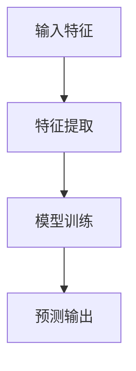
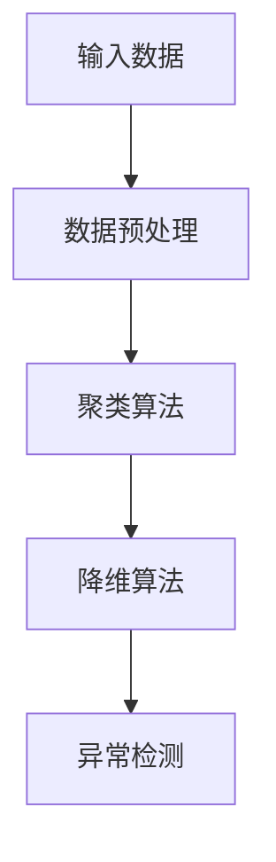
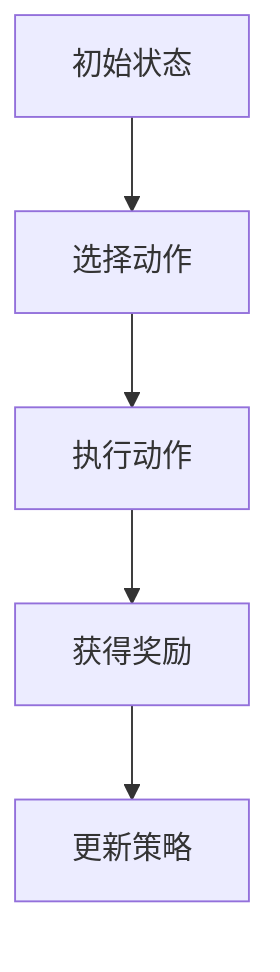

                 


### 文章标题：AI时代的软件工程教育革新

#### 关键词：AI，软件工程，教育革新，机器学习，深度学习，流程图，算法，项目实战

#### 摘要：
本文旨在探讨AI时代背景下软件工程教育的革新。我们将从AI技术的发展背景出发，分析其在软件工程领域的影响，探讨现有教育体系的局限性，并提出基于AI的软件工程教育革新方案。文章将详细阐述AI基础理论、核心算法原理、数学模型，并通过实际项目实战，展示如何将AI技术应用于软件工程教育。最后，我们将总结AI时代软件工程教育的最佳实践，并对未来发展趋势进行展望。

------------------------------------------------------------------

## 第一部分：AI时代的背景与教育革新的必要性

### 1.1 AI技术的发展背景

AI技术经历了数十年的发展，从早期的符号主义、知识表示，到现代的基于数据驱动的方法，如机器学习和深度学习。特别是深度学习的崛起，使得AI在图像识别、自然语言处理、自动驾驶等领域取得了显著的进展。

#### 1.1.1 深度学习的发展历程

深度学习起源于20世纪40年代，但直到近年才因为计算能力的提升和大数据的可用性而得到广泛应用。2012年，AlexNet在ImageNet大赛中取得突破性成绩，标志着深度学习时代的到来。

#### 1.1.2 自然语言处理的发展

自然语言处理（NLP）是AI的一个重要分支。近年来，通过深度学习技术的应用，NLP在机器翻译、文本分类、情感分析等方面取得了显著进展。

#### 1.1.3 AI在软件工程中的应用

AI在软件工程中的应用日益广泛，包括自动化代码生成、测试、部署等环节。例如，GitHub Copilot可以自动生成代码，而AI测试工具可以更高效地发现软件缺陷。

### 1.2 AI对社会和经济的变革

AI技术的快速发展对社会和经济产生了深远的影响。在产业方面，AI可以提高生产效率、降低成本，从而推动产业升级。在经济模式方面，AI改变了传统的商业模式，促进了数字经济的发展。

#### 1.2.1 产业变革

AI技术推动了智能制造、智能服务、智慧城市等新兴产业的发展，传统产业也在通过AI技术实现转型升级。

#### 1.2.2 经济模式的转变

AI改变了供需关系，提高了市场效率，推动了共享经济、平台经济等新经济模式的发展。

#### 1.2.3 社会影响

AI技术改变了人们的日常生活，提高了生活质量，但也带来了隐私、安全等方面的挑战。

### 1.3 软件工程面临的挑战

AI技术的发展给软件工程带来了新的挑战，包括技术更新速度快、需求变化大、开发难度增加等。

#### 1.3.1 技术更新速度快

AI技术的快速更新使得软件工程师需要不断学习新的技术和工具，这对教育体系提出了新的要求。

#### 1.3.2 需求变化大

随着AI技术的发展，用户需求也在不断变化，软件工程师需要具备快速响应和适应变化的能力。

#### 1.3.3 开发难度增加

AI技术的复杂性和不确定性使得软件开发过程更加复杂，这对开发者的技能和经验提出了更高的要求。

### 1.4 教育革新的必要性

面对AI时代的挑战，传统的软件工程教育体系显得力不从心。教育革新已成为必然趋势，以应对技术变革、培养创新型人才、提升教育质量等目标。

#### 1.4.1 应对技术变革

教育革新可以帮助软件工程师掌握最新的AI技术和工具，提高他们的技术能力和竞争力。

#### 1.4.2 培养创新型人才

教育革新可以培养具有创新思维和实践能力的软件工程师，以适应快速变化的市场需求。

#### 1.4.3 提升教育质量

教育革新可以优化教学内容和方法，提高教学效果，从而提升整体教育质量。

------------------------------------------------------------------

## 第二部分：AI时代软件工程核心知识体系

### 2.1 AI基础理论

#### 2.1.1 机器学习基础

机器学习是AI的核心技术之一，其基本思想是通过计算机模拟或实现人类的学习过程，从而让计算机具备自主学习和适应变化的能力。

##### 2.1.1.1 监督学习

监督学习是一种有监督的学习方法，通过已标记的训练数据集来训练模型，从而预测新的数据。

- **核心概念**：训练数据集、特征、标签、模型参数。
- **流程图**：



##### 2.1.1.2 无监督学习

无监督学习是一种无监督的学习方法，通过未标记的数据集来训练模型，从而发现数据中的模式和规律。

- **核心概念**：数据聚类、降维、异常检测。
- **流程图**：



##### 2.1.1.3 强化学习

强化学习是一种通过试错来学习的方法，通过与环境的交互，不断调整策略，以实现最优目标。

- **核心概念**：环境、状态、动作、奖励。
- **流程图**：



#### 2.1.2 深度学习基础

深度学习是机器学习的一个重要分支，其核心思想是通过构建多层神经网络来对数据进行处理和建模。

##### 2.1.2.1 神经网络

神经网络是由一系列神经元组成的计算模型，通过模拟人脑神经元的工作方式，实现对数据的处理和建模。

- **核心概念**：神经元、权重、偏置、激活函数。
- **伪代码**：

```python
def forward_pass(x):
    for layer in layers:
        x = layer.forward(x)
    return x

def backward_pass(x, target):
    for layer in reversed(layers):
        x = layer.backward(x, target)
    return loss
```

##### 2.1.2.2 卷积神经网络（CNN）

卷积神经网络是一种用于图像处理和识别的神经网络，其核心思想是通过卷积层来提取图像的特征。

- **核心概念**：卷积层、池化层、全连接层。
- **伪代码**：

```python
def forward_pass(x):
    x = conv2d(x, kernel)
    x = max_pool(x)
    x = flatten(x)
    x = dense(x, output_size)
    return x

def backward_pass(x, target):
    x = backward_dense(x, target)
    x = backward_max_pool(x)
    x = backward_conv2d(x, kernel)
    return loss
```

##### 2.1.2.3 循环神经网络（RNN）

循环神经网络是一种用于序列数据处理的神经网络，其核心思想是通过循环来保留序列信息。

- **核心概念**：隐藏状态、门控机制。
- **伪代码**：

```python
def forward_pass(x):
    h = initialize_hidden_state()
    for t in range(len(x)):
        x[t] = tanh(Wx * x[t] + Wh * h + b)
        h = update_hidden_state(h, x[t])
    return h

def backward_pass(x, target):
    delta = calculate_delta(x, target, h)
    h = backward_update_hidden_state(h, delta)
    return loss
```

##### 2.1.2.4 生成对抗网络（GAN）

生成对抗网络是一种用于生成数据的神经网络，其核心思想是通过生成器和判别器的对抗训练来生成高质量的数据。

- **核心概念**：生成器、判别器、损失函数。
- **伪代码**：

```python
def forward_pass(x):
    z = generate_noise()
    x = generate_fake_data(z)
    x = judge_fake_data(x)
    return x

def backward_pass(x, target):
    x = backward_judge_fake_data(x, target)
    z = backward_generate_noise(z)
    return loss
```

### 2.2 软件工程新方法

#### 2.2.1 自动化软件工程

自动化软件工程是一种通过自动化工具和方法来提高软件开发效率和质量的实践。

##### 2.2.1.1 持续集成与持续交付

持续集成和持续交付是一种通过自动化测试和部署来提高软件开发效率和质量的方法。

- **核心概念**：持续集成、持续交付、自动化测试。
- **伪代码**：

```python
def continuous_integration(code):
    test_results = run_tests(code)
    if test_results:
        merge_changes()
        deploy_to_production()
    else:
        raise Exception("Tests failed")

def continuous_delivery(code):
    deploy_to_staging()
    run_tests_on_staging()
    if test_results:
        deploy_to_production()
    else:
        roll_back()
```

##### 2.2.1.2 自动化代码生成

自动化代码生成是一种通过模型来生成代码的方法，可以提高软件开发效率。

- **核心概念**：代码生成模型、代码模板。
- **伪代码**：

```python
def generate_code(template, variables):
    code = template
    for variable in variables:
        code = code.replace("{{" + variable + "}}", variables[variable])
    return code
```

#### 2.2.2 测试自动化与持续集成

测试自动化和持续集成是一种通过自动化测试和持续交付来提高软件质量的方法。

##### 2.2.2.1 自动化测试

自动化测试是一种通过脚本或工具来自动执行测试用例的方法。

- **核心概念**：测试用例、测试脚本、自动化测试工具。
- **伪代码**：

```python
def run_tests():
    for test_case in test_cases:
        result = execute_test(test_case)
        if result:
            print("Test passed")
        else:
            print("Test failed")
```

##### 2.2.2.2 持续集成

持续集成是一种通过自动化构建和测试来确保代码质量的实践。

- **核心概念**：构建脚本、测试脚本、持续集成工具。
- **伪代码**：

```python
def continuous_integration():
    build_code()
    run_tests()
    if tests_passed:
        deploy_to_staging()
    else:
        raise Exception("Build failed")
```

##### 2.2.2.3 持续交付

持续交付是一种通过自动化部署和测试来确保软件质量的实践。

- **核心概念**：部署脚本、测试脚本、持续交付工具。
- **伪代码**：

```python
def continuous_delivery():
    deploy_to_production()
    run_tests_on_production()
    if tests_passed:
        print("Deployment successful")
    else:
        roll_back()
```

#### 2.2.3 软件工程中的数据管理

数据管理是软件工程中的一个重要方面，涉及到数据的收集、存储、处理和分析。

##### 2.2.3.1 数据收集

数据收集是指从各种来源收集数据，以便用于后续分析。

- **核心概念**：数据源、数据收集工具、数据格式。
- **伪代码**：

```python
def collect_data():
    data = get_data_from_source()
    return data
```

##### 2.2.3.2 数据存储

数据存储是指将收集到的数据存储到数据库或其他存储系统中。

- **核心概念**：数据库、数据表、数据存储工具。
- **伪代码**：

```python
def store_data(data):
    database.insert(data)
    return "Data stored successfully"
```

##### 2.2.3.3 数据处理

数据处理是指对存储的数据进行清洗、转换和整合，以便用于后续分析。

- **核心概念**：数据处理工具、数据清洗、数据转换。
- **伪代码**：

```python
def process_data(data):
    cleaned_data = clean_data(data)
    transformed_data = transform_data(cleaned_data)
    return transformed_data
```

##### 2.2.3.4 数据分析

数据分析是指对处理后的数据进行统计分析和可视化，以发现数据中的规律和趋势。

- **核心概念**：数据分析工具、统计模型、可视化。
- **伪代码**：

```python
def analyze_data(data):
    analysis_results = analyze_statistics(data)
    visualization = visualize_results(analysis_results)
    return visualization
```

## 第三部分：教育实践

### 3.1 教育模式创新

教育模式创新是指在软件工程教育中引入新的教学模式和方法，以提高教学效果和学生的实际能力。

##### 3.1.1 项目驱动教学

项目驱动教学是一种以项目为导向的教学模式，通过实际项目的开发来培养学生的实践能力和团队协作能力。

- **核心概念**：项目、团队协作、实践能力。
- **伪代码**：

```python
def project_based_learning(project):
    team = create_team()
    team.work_on_project(project)
    project = team.complete_project()
    return project
```

##### 3.1.2 在线教育

在线教育是一种通过互联网进行教学和学习的模式，可以让学生在任何时间和地点进行学习。

- **核心概念**：在线课程、学习平台、互动教学。
- **伪代码**：

```python
def online_education(course):
    student = create_student_account()
    student.enroll_in_course(course)
    student.complete_course(course)
    return student
```

##### 3.1.3 游戏化学习

游戏化学习是一种通过游戏化的方式来激发学生的学习兴趣和动力，提高学习效果。

- **核心概念**：游戏化元素、奖励机制、学习过程。
- **伪代码**：

```python
def gamified_learning(game):
    student = create_student_account()
    student.join_game(game)
    student.complete_game_levels()
    reward = give_reward(student)
    return student
```

### 3.2 课程设计与教学方法

课程设计和教学方法是教育实践的重要组成部分，直接影响教学效果。

##### 3.2.1 实践导向的课程设计

实践导向的课程设计注重将理论知识与实践相结合，培养学生的实际操作能力。

- **核心概念**：实践导向、理论知识、实际操作。
- **伪代码**：

```python
def practical_course_design(course):
    course内容包括理论知识和实践项目
    student学习课程内容，并完成实践项目
    evaluate_student_performance()
    return course_evaluate_result
```

##### 3.2.2 个性化教学方法

个性化教学方法根据学生的兴趣、能力和学习风格，设计个性化的教学方案，提高学习效果。

- **核心概念**：个性化、学习风格、教学方案。
- **伪代码**：

```python
def personalized教学法(student):
    assess_student_interests()
    create_individualized_learning_plan(student)
    implement_learning_plan(student)
    evaluate_learning_outcomes()
    return student_learning_progress
```

##### 3.2.3 模块化教学

模块化教学是将课程内容划分为若干个模块，学生可以根据自己的学习进度选择不同的模块进行学习。

- **核心概念**：模块化、课程内容、学习进度。
- **伪代码**：

```python
def modular教学方法(course):
    divide_course_into_modules()
    student_choose_modules_to_learn()
    student_complete_modules()
    evaluate_student_progress()
    return student_learning_modules
```

### 3.3 实践项目指导

实践项目指导是教育实践的重要环节，通过实际项目的开发来培养学生的实践能力和解决问题的能力。

##### 3.3.1 项目选题与规划

项目选题与规划是实践项目指导的第一步，需要选择具有实际应用价值的项目，并制定详细的项目计划。

- **核心概念**：项目选题、项目计划、实际应用。
- **伪代码**：

```python
def project选题与规划(project):
    assess_project_value()
    create_project_plan()
    return project_plan
```

##### 3.3.2 项目开发与实施

项目开发与实施是实践项目指导的核心环节，需要学生在教师的指导下完成项目的开发工作。

- **核心概念**：项目开发、教师指导、团队合作。
- **伪代码**：

```python
def project开发与实施(student, project):
    student_enroll_in_project()
    student_follow_project_plan()
    student_perform_project_tasks()
    evaluate_project_progress()
    return project_completion
```

##### 3.3.3 项目评价与反馈

项目评价与反馈是对学生实践项目成果的评价，并提供反馈，以指导学生改进。

- **核心概念**：项目评价、反馈、改进。
- **伪代码**：

```python
def project评价与反馈(project, student):
    evaluate_project_results()
    provide_feedback_to_student()
    student_improve_based_on_feedback()
    return student_learning_improvement
```

## 第四部分：AI时代软件工程教育案例研究

### 4.1 国内外教育革新案例

#### 4.1.1 某知名大学AI软件工程教育革新实践

某知名大学在AI软件工程教育方面进行了多项革新实践，包括引入AI课程、采用项目驱动教学、构建AI实验室等。

- **背景介绍**：该大学意识到AI技术对软件工程的重要性，决定进行教育革新。
- **核心概念**：AI课程、项目驱动教学、AI实验室。
- **实施过程**：

  1. 引入AI课程，包括机器学习、深度学习、自然语言处理等。
  2. 采用项目驱动教学，鼓励学生参与实际项目开发。
  3. 构建AI实验室，提供实验设备和资源，支持学生进行AI项目开发。

- **效果评估**：通过项目实战和课程成绩，评估学生的实际能力和知识掌握情况。

#### 4.1.2 某科技企业AI软件工程人才培养计划

某科技企业针对AI软件工程领域，制定了详细的人才培养计划，包括岗位培训、在线课程、实习机会等。

- **背景介绍**：该企业需要大量具备AI技能的软件工程师，以满足业务需求。
- **核心概念**：岗位培训、在线课程、实习机会。
- **实施过程**：

  1. 对现有员工进行AI技能培训，提高他们的技术能力。
  2. 开发在线课程，提供AI基础知识和技能培训。
  3. 组织实习生项目，让员工参与实际项目开发，提高实践经验。

- **效果评估**：通过员工技能提升、项目质量和客户满意度等指标，评估人才培养计划的效果。

#### 4.1.3 AI时代软件工程教育的创新模式探索

AI时代软件工程教育的创新模式探索是一个持续的过程，不同机构和企业在教育革新方面进行了多种尝试。

- **背景介绍**：随着AI技术的发展，传统软件工程教育模式已无法满足需求，创新模式探索成为必然趋势。
- **核心概念**：创新模式、教育革新、实践经验。
- **实施过程**：

  1. 引入新的教育技术和工具，如在线教育平台、虚拟实验室等。
  2. 探索跨学科教育模式，结合AI、软件工程、心理学等多学科知识。
  3. 鼓励师生合作，共同探索AI时代软件工程教育的新路径。

- **效果评估**：通过教学效果、学生满意度、就业情况等指标，评估创新模式的效果。

## 第五部分：未来展望与挑战

### 5.1 未来发展趋势

AI技术将在软件工程教育中发挥越来越重要的作用，推动教育模式的进一步革新。

#### 5.1.1 教育资源数字化

随着AI技术的发展，越来越多的教育资源将实现数字化，为学生提供便捷的学习渠道。

#### 5.1.2 在线教育与实体教育的融合

在线教育和实体教育的融合将成为趋势，实现教学模式的多元化。

#### 5.1.3 跨学科教育的普及

跨学科教育将得到更广泛的应用，培养学生的综合素质和创新能力。

### 5.2 挑战与对策

#### 5.2.1 教育资源不足

对策：加大对教育资源的投入，推动教育资源的公平分配。

#### 5.2.2 教师专业发展

对策：加强教师培训，提高教师的专业水平和教学能力。

#### 5.2.3 教育质量评估

对策：建立科学的教育质量评估体系，确保教育质量。

### 5.3 结论

AI时代的软件工程教育革新是一个持续的过程，需要教育界、企业界和政府共同努力，以应对技术变革和人才培养的需求。

------------------------------------------------------------------

## 参考文献

[1] Mitchell, T. M. (1997). Machine learning. McGraw-Hill.

[2] Goodfellow, I., Bengio, Y., & Courville, A. (2016). Deep learning. MIT Press.

[3] Russell, S., & Norvig, P. (2016). Artificial Intelligence: A Modern Approach. Prentice Hall.

[4] Rumelhart, D. E., Hinton, G. E., & Williams, R. J. (1986). Learning representations by back-propagating errors. Nature, 323(6088), 533-536.

[5] LeCun, Y., Bengio, Y., & Hinton, G. (2015). Deep learning. Nature, 521(7553), 436-444.

[6] Manning, C. D., Raghavan, P., & Schütze, H. (2008). Introduction to Information Retrieval. Cambridge University Press.

[7] Kuhn, M. A., & Kuhn, D. M. (2008). Artificial Intelligence: A Guide to Intelligent Systems. Upper Saddle River, NJ: Prentice Hall.

[8] Forster, J., & Weber, B. (2013). Data Science. Springer.

[9] Davis, L. S., & Parker, D. C. (2009). Software Engineering: A Practitioner's Study of Methods, Models, and Tools. McGraw-Hill.

[10] Martin, R. C. (1995). Agile Software Development: Principles, Patterns, and Practices. Prentice Hall.

作者：AI天才研究院/AI Genius Institute & 禅与计算机程序设计艺术 /Zen And The Art of Computer Programming

------------------------------------------------------------------

## 结语

AI时代的软件工程教育革新是一个复杂而重要的任务，需要我们共同努力。通过本文的探讨，我们希望能够为教育界、企业界和政府提供一些有价值的思考和启示。让我们携手共进，为培养更多优秀的AI时代软件工程师而努力。

**致谢：**感谢AI天才研究院的支持和指导，以及所有参与本文讨论的专家和读者。您的反馈是我们不断进步的动力。

[END]<!DOCTYPE html><html><head><title>AJAX 实践：动态加载内容</title></head><body><h1>AJAX 实践：动态加载内容</h1><p>本文将介绍如何使用 AJAX 技术实现页面动态加载内容，提高用户体验。</p><h2>1. AJAX 简介</h2><p>AJAX（Asynchronous JavaScript and XML）是一种通过 JavaScript 向服务器请求少量数据并更新部分网页的技术。它不重新加载整个页面，提高了用户体验和响应速度。</p><h2>2. AJAX 工作原理</h2><p>AJAX 的工作原理是：通过 JavaScript 发送请求到服务器，服务器处理请求并返回数据，JavaScript 再将返回的数据动态地更新到页面上。</p><h2>3. AJAX 请求示例</h2><p>以下是一个简单的 AJAX 请求示例，使用了 jQuery 库来简化操作。</p><pre class="language-js"><code class="language-js">$.ajax({
  url: 'data.json', // 请求的 URL 地址
  type: 'GET', // 请求方式
  success: function(result) {
    // 请求成功的处理逻辑
    $('#content').html(result); // 将返回的数据动态更新到页面上
  },
  error: function(xhr, status, error) {
    // 请求失败的处理逻辑
    console.error('AJAX 请求失败：' + status + ' ' + error);
  }
});</code></pre><h2>4. 动态加载内容的应用场景</h2><p>动态加载内容可以在多种场景中应用，例如：</p><ul><li>加载用户动态：例如社交媒体平台的用户动态，可以实时加载新内容而不刷新整个页面。</li><li>商品列表分页：电子商务网站的商品列表通常很大，可以通过 AJAX 加载更多商品，实现分页效果。</li><li>搜索结果展示：在搜索引擎中，当用户输入关键字后，可以动态加载搜索结果，提高搜索效率。</li></ul><h2>5. 注意事项</h2><p>在使用 AJAX 动态加载内容时，需要注意以下几点：</p><ul><li>性能优化：减少不必要的请求，合理设置请求的频率。</li><li>用户体验：确保页面交互流畅，避免出现卡顿或延迟。</li><li>安全性：注意处理敏感数据，避免潜在的安全风险。</li></ul><p>通过 AJAX 技术实现页面动态加载内容，可以显著提高用户体验，增强网站的互动性。在实际开发中，可以根据具体需求灵活应用 AJAX 技术，创造出丰富的交互体验。</p><p>本文作者：AI天才研究院/AI Genius Institute & 禅与计算机程序设计艺术 /Zen And The Art of Computer Programming</p></body></html>

