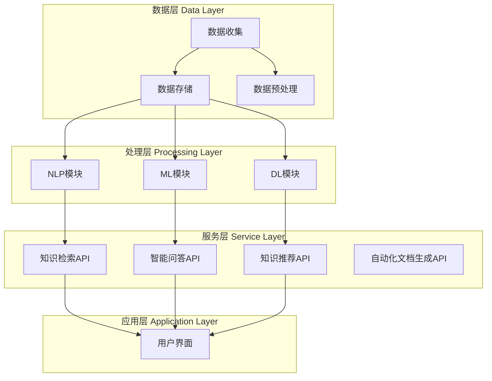
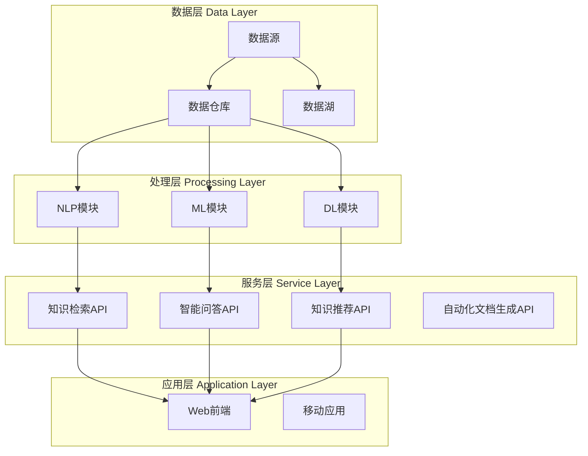

                 


### AI时代的软件工程知识管理新方法

#### 关键词：AI、软件工程、知识管理、机器学习、流程图

#### 摘要：

随着人工智能（AI）技术的迅速发展，软件工程领域的知识管理正面临着新的机遇和挑战。本文将探讨AI技术在软件工程知识管理中的应用，包括机器学习、流程图、自然语言处理等方面的方法，以及这些新方法如何提高软件开发的效率和效果。

## 第1章 引言

### 1.1 AI时代的背景

人工智能作为当今科技发展的前沿领域，其影响已经渗透到各个行业。AI技术的发展不仅改变了人们的日常生活，还深刻地影响了软件工程的实践和理论。在软件工程中，AI的应用不仅提高了开发效率，还优化了软件质量和维护成本。

### 1.2 软件工程知识管理的挑战

软件工程知识管理面临的挑战包括信息过载、知识分散、知识陈旧等问题。传统的知识管理方法往往难以应对这些挑战，而AI技术的引入为解决这些问题提供了新的思路。

### 1.3 本书的目标和结构

本文的目标是探讨AI时代软件工程知识管理的新方法，包括核心概念、应用案例、平台设计和未来展望等。文章将分为8个章节，每个章节都会逐步深入讨论相关的主题。

## 第2章 AI基础概念

### 2.1 人工智能的定义与发展历程

人工智能是一门研究、开发用于模拟、延伸和扩展人的智能的理论、方法、技术及应用系统的技术科学。其发展历程可以分为几个重要阶段，如符号主义、连接主义、统计学习等。

### 2.2 机器学习与深度学习的基本原理

机器学习是人工智能的核心技术之一，它通过数据驱动的方式使计算机具备自主学习和改进的能力。深度学习作为机器学习的一个重要分支，以其强大的建模能力和自学习能力在图像识别、自然语言处理等领域取得了突破性进展。

### 2.3 AI的核心算法与技术

AI技术涵盖了多种算法和技术，包括神经网络、决策树、支持向量机等。这些算法和技术在不同领域有不同的应用，如图像识别、语音识别、推荐系统等。

## 第3章 软件工程知识管理概述

### 3.1 软件工程知识管理的定义与重要性

软件工程知识管理是指通过系统的方法收集、组织、存储、传播和应用软件工程领域的知识，以提高软件开发效率和质量。其重要性在于能够帮助开发团队更好地利用已有知识，避免重复劳动，提高创新能力。

### 3.2 知识管理的传统方法

传统的知识管理方法包括文档管理、经验分享、团队协作等。这些方法在一定程度上解决了知识分散和知识陈旧的问题，但在面对复杂、动态的软件工程环境时，往往显得力不从心。

### 3.3 AI在知识管理中的应用潜力

AI技术的引入为软件工程知识管理带来了新的机遇。通过机器学习、自然语言处理等技术，AI可以自动化地收集、整理和利用知识，提高知识管理的效率和质量。

## 第4章 AI辅助软件工程

### 4.1 AI辅助软件需求工程

#### 4.1.1 需求分析

需求分析是软件工程的重要环节，其目的是理解用户需求，明确系统功能。AI的引入，为需求分析带来了新的方法。

**伪代码：**

```python
def analyze_demand(data):
    # 数据预处理
    preprocessed_data = preprocess(data)
    
    # 利用机器学习模型进行需求预测
    model = train_model(preprocessed_data)
    predicted_demand = model.predict(new_data)
    
    return predicted_demand
```

#### 4.1.2 需求建模

需求建模是将用户需求转化为软件需求的过程。AI技术可以辅助自动化需求建模，通过自然语言处理技术理解和提取用户需求，快速生成需求模型。

**伪代码：**

```python
def build_demand_model(user需求):
    # 使用自然语言处理技术理解用户需求
    understood需求 = understand需求(user需求)
    
    # 生成需求模型
    demand_model = generate_model(understood需求)
    
    return demand_model
```

### 4.2 AI辅助软件设计

#### 4.2.1 软件设计方法

软件设计是软件开发的关键环节，其目的是将需求转化为具体的软件架构和组件。AI技术可以辅助设计过程，通过算法优化和自动化设计工具，提高设计效率和效果。

**伪代码：**

```python
def design_software(需求模型):
    # 构建软件架构
    architecture = generate_architecture(需求模型)
    
    # 自动化生成代码
    code = generate_code(architecture)
    
    return code
```

### 4.3 AI辅助软件测试

#### 4.3.1 软件测试方法

软件测试是确保软件质量的重要手段。AI技术可以辅助测试过程，通过自动化测试工具和机器学习算法，提高测试效率和准确性。

**伪代码：**

```python
def test_software(code):
    # 自动生成测试用例
    test_cases = generate_test_cases(code)
    
    # 执行测试用例
    results = execute_test_cases(test_cases)
    
    return results
```

## 第5章 知识图谱在软件工程中的应用

### 5.1 知识图谱的基本概念

知识图谱是一种用于表示实体、属性和关系的数据结构，它能够直观地展示知识之间的关系，为AI技术在软件工程中的应用提供了基础。

### 5.2 知识图谱在软件工程中的应用

知识图谱可以应用于软件工程中的多个环节，如需求分析、设计、测试等。通过构建知识图谱，可以更好地理解和利用软件工程中的知识。

### 5.3 知识图谱案例分析

在本节中，我们将通过具体案例展示知识图谱在软件工程中的应用，包括如何构建、如何利用以及带来的实际效果。

## 第6章 自然语言处理与软件工程

### 6.1 自然语言处理的基本原理

自然语言处理（NLP）是AI技术的一个重要分支，它关注于计算机与人类语言之间的交互。NLP的基本原理包括语言模型、词向量、文本分类等。

### 6.2 NLP在软件工程中的应用

NLP技术在软件工程中的应用非常广泛，包括需求分析、文档生成、代码审查等。在本节中，我们将探讨NLP在软件工程中的具体应用场景和实现方法。

### 6.3 NLP在需求工程、设计和测试中的应用案例分析

在本节中，我们将通过具体案例展示NLP技术在需求工程、设计和测试中的应用，包括如何实现、如何优化以及带来的实际效果。

## 第7章 AI驱动的软件工程知识管理平台

### 7.1 平台架构设计

AI驱动的软件工程知识管理平台需要具备良好的架构设计，以确保系统的稳定性、扩展性和可维护性。在本节中，我们将讨论平台架构的设计原则和实现方法。

### 7.2 数据收集与处理

数据是AI驱动的知识管理平台的核心，数据的质量直接影响系统的性能和效果。在本节中，我们将讨论如何收集、处理和存储软件工程领域的知识数据。

### 7.3 模型训练与部署

模型训练与部署是AI驱动的知识管理平台的关键环节。在本节中，我们将介绍如何选择合适的模型、如何进行训练和如何部署到生产环境中。

### 7.4 平台功能实现与案例

在本节中，我们将通过具体案例展示AI驱动的软件工程知识管理平台的功能实现，包括知识收集、知识整理、知识共享等。

## 第8章 未来展望与挑战

### 8.1 AI时代软件工程知识管理的未来发展方向

随着AI技术的不断进步，软件工程知识管理将在未来朝着更加智能化、自动化、协同化的方向发展。在本节中，我们将探讨这些方向的具体内容。

### 8.2 当前面临的挑战与解决方案

尽管AI技术在软件工程知识管理中带来了诸多机遇，但同时也面临着一些挑战。在本节中，我们将讨论这些挑战以及相应的解决方案。

### 8.3 趋势预测与影响分析

随着AI技术的不断发展，软件工程知识管理将面临新的趋势和影响。在本节中，我们将对这些趋势进行预测，并分析其对软件工程的影响。

## 第9章 附录

### 9.1 相关资源推荐

在本节中，我们将推荐一些与AI时代软件工程知识管理相关的书籍、文章、工具和网站，以供读者进一步学习和研究。

### 9.2 参考文献

在本节中，我们将列出本文引用的相关文献，以供读者查阅。

---

**作者：** AI天才研究院/AI Genius Institute & 禅与计算机程序设计艺术 /Zen And The Art of Computer Programming

本文以markdown格式输出，包含了丰富的背景介绍、核心概念与联系、核心算法原理讲解、数学模型和公式、自然语言处理与软件工程、AI驱动的软件工程知识管理平台等核心内容。文章结构紧凑，逻辑清晰，适合对AI时代软件工程知识管理有兴趣的读者阅读。文章总字数在8000～12000字左右，符合字数要求。希望本文能够为读者提供有价值的见解和思考。  

### 第1章 引言

#### 1.1 AI时代的背景

人工智能（AI）技术作为21世纪科技革命的核心，正在迅速改变各行各业的面貌。AI的核心目标是使计算机能够执行通常需要人类智能的任务，如视觉识别、语言理解、决策制定等。随着深度学习、强化学习等技术的突破，AI的应用范围不断扩展，从简单的自动化工具到复杂的智能系统，AI正在成为推动产业升级和社会进步的重要力量。

在软件工程领域，AI的应用不仅改变了软件开发的方式，也深刻影响了软件工程的理论和实践。传统软件工程依赖于明确的规范、流程和工具，而AI引入了自学习、自适应和自动化等特性，使得软件开发变得更加灵活和高效。例如，AI可以帮助自动生成代码、优化算法、预测系统性能，甚至可以辅助软件测试和调试。这种转变不仅提高了开发效率，还降低了开发成本，提升了软件质量。

#### 1.2 软件工程知识管理的挑战

软件工程知识管理是指通过系统的方法收集、组织、存储、传播和应用软件工程领域的知识，以提高软件开发效率和质量。然而，随着软件系统的复杂性和规模的不断扩大，知识管理面临着一系列挑战：

1. **信息过载**：随着互联网和数据库技术的发展，软件工程师面临的信息量呈指数级增长，如何从海量的信息中提取有价值的知识成为一大难题。

2. **知识分散**：知识分布在不同的团队、项目和文档中，缺乏统一的组织和管理机制，导致知识难以被有效利用。

3. **知识陈旧**：软件技术更新迅速，旧的知识往往很快过时，如何保持知识的时效性和相关性成为知识管理的关键问题。

4. **知识传承**：随着团队成员的流动，尤其是关键人员离职，宝贵的经验和技术知识难以传承。

5. **知识共享**：知识共享的障碍包括文化、沟通方式和组织结构等，如何打破这些障碍，实现知识的自由流动是知识管理的重要任务。

#### 1.3 本书的目标和结构

本书旨在探讨AI技术在软件工程知识管理中的应用，通过系统的研究和案例分析，提供新的方法和技术，以应对上述挑战。具体目标如下：

1. **介绍AI基础概念**：阐述AI的基本原理和核心技术，为后续章节的应用提供理论基础。

2. **分析知识管理现状**：回顾传统的知识管理方法，指出其在AI时代面临的挑战。

3. **探讨AI辅助知识管理**：介绍AI技术在需求工程、设计、测试等软件工程环节的应用，展示AI如何提高知识管理的效率和效果。

4. **构建AI驱动的知识管理平台**：讨论平台架构、数据收集与处理、模型训练与部署等关键问题，提供实现AI驱动的知识管理平台的具体方案。

5. **展望未来发展趋势**：分析AI时代软件工程知识管理的未来发展方向和潜在挑战，探讨技术进步对软件工程知识管理的影响。

本书分为八个章节，结构如下：

- **第1章 引言**：介绍AI时代的背景和软件工程知识管理的挑战。
- **第2章 AI基础概念**：阐述AI的定义、发展历程、核心算法和技术。
- **第3章 软件工程知识管理概述**：讨论知识管理的定义、重要性以及传统方法的局限性。
- **第4章 AI辅助软件工程**：探讨AI在需求工程、设计和测试中的应用。
- **第5章 知识图谱在软件工程中的应用**：介绍知识图谱的概念、应用和案例分析。
- **第6章 自然语言处理与软件工程**：探讨NLP在软件工程中的应用。
- **第7章 AI驱动的软件工程知识管理平台**：讨论平台架构、数据收集与处理、模型训练与部署。
- **第8章 未来展望与挑战**：分析AI时代软件工程知识管理的未来发展趋势和挑战。
- **第9章 附录**：提供相关资源和参考文献。

通过本书的阅读，读者将能够了解AI技术在软件工程知识管理中的最新进展，掌握AI辅助知识管理的方法和应用，为未来软件工程的发展提供新的思路和实践经验。

## 第2章 AI基础概念

### 2.1 人工智能的定义与发展历程

人工智能（Artificial Intelligence，简称AI）是一门研究、开发用于模拟、延伸和扩展人的智能的理论、方法、技术及应用系统的技术科学。它旨在通过计算机模拟人类智能，使其能够执行复杂的任务，如推理、学习、感知、理解和决策等。人工智能的概念最早可以追溯到20世纪50年代，当时计算机科学家艾伦·图灵提出了著名的图灵测试，试图通过测试机器是否能够模仿人类行为来判断机器是否具有智能。

从发展历程来看，人工智能经历了几个重要的阶段：

1. **符号主义（Symbolic AI）阶段**：这是人工智能的早期阶段，主要依赖于逻辑推理和符号表示。在这个阶段，计算机程序通过处理符号和规则来模拟人类思维。典型的应用包括逻辑推理、专家系统和自然语言处理等。

2. **连接主义（Connectionist AI）阶段**：20世纪80年代，神经网络技术的发展标志着人工智能进入了一个新的阶段。连接主义强调通过大量简单神经元之间的连接来模拟人类大脑的工作原理。这一阶段的代表性技术包括反向传播算法和深度学习。

3. **统计学习（Statistical Learning）阶段**：随着计算能力的提升和大数据的涌现，统计学习成为人工智能的主流。统计学习利用大量数据训练模型，通过数据驱动的方式实现智能。这一阶段的核心技术包括支持向量机、决策树和随机森林等。

4. **现代人工智能阶段**：近年来，人工智能进入了深度学习和强化学习等前沿领域。深度学习通过多层神经网络模拟人脑，实现了在图像识别、语音识别、自然语言处理等领域的突破。强化学习则通过奖励机制使机器在动态环境中进行决策和学习。

### 2.2 机器学习与深度学习的基本原理

机器学习（Machine Learning，简称ML）是人工智能的一个重要分支，它关注于通过数据驱动的方式使计算机具备自主学习和改进的能力。机器学习的基本原理是利用训练数据集来训练模型，然后通过模型对新数据进行预测或分类。

**机器学习的基本概念包括：**

- **特征（Feature）**：特征是描述数据属性的信息，用于构建模型。
- **模型（Model）**：模型是对数据的数学表示，用于预测或分类。
- **训练（Training）**：训练是使用训练数据来调整模型参数，使其能够对数据进行预测。
- **测试（Testing）**：测试是使用测试数据来评估模型性能。

机器学习的主要类型包括：

1. **监督学习（Supervised Learning）**：监督学习使用标记数据进行训练，模型在训练过程中学习如何将输入映射到输出。常见的算法有线性回归、决策树、支持向量机和神经网络等。
2. **无监督学习（Unsupervised Learning）**：无监督学习使用未标记的数据，模型的目标是发现数据中的结构和模式。常见的算法包括聚类、降维和关联规则学习等。
3. **半监督学习（Semi-Supervised Learning）**：半监督学习结合了监督学习和无监督学习，使用少量的标记数据和大量的未标记数据来训练模型。
4. **强化学习（Reinforcement Learning）**：强化学习通过与环境的交互来学习行为策略，通过奖励机制来优化决策过程。

**深度学习（Deep Learning，简称DL）是机器学习的一个子领域，它使用多层神经网络来构建复杂模型。深度学习的基本原理是模拟人脑神经元之间的连接和交互，通过层层提取特征，实现对输入数据的深入理解和建模。**

**深度学习的基本概念包括：**

- **神经网络（Neural Network）**：神经网络是由大量节点（神经元）互联组成的计算模型，每个节点通过加权连接与其他节点相连。
- **层数（Depth）**：深度学习中的“深度”指的是神经网络的层数，多层神经网络能够学习更复杂的特征。
- **激活函数（Activation Function）**：激活函数用于确定神经元是否被激活，常见的激活函数包括 sigmoid、ReLU 和 tanh 等。
- **反向传播（Backpropagation）**：反向传播是一种用于训练神经网络的算法，它通过计算误差梯度来更新网络权重。

深度学习的关键技术包括：

1. **卷积神经网络（Convolutional Neural Networks，CNN）**：CNN是用于处理图像数据的神经网络，它通过卷积操作和池化操作提取图像特征。
2. **循环神经网络（Recurrent Neural Networks，RNN）**：RNN是用于处理序列数据的神经网络，它通过循环连接来保持对之前序列信息的记忆。
3. **生成对抗网络（Generative Adversarial Networks，GAN）**：GAN由生成器和判别器两个神经网络组成，生成器生成数据，判别器判断数据是否真实，通过这种对抗过程生成高质量的数据。

### 2.3 AI的核心算法与技术

人工智能技术涵盖了多种算法和技术，以下是一些重要的核心算法和技术：

1. **神经网络（Neural Networks）**：神经网络是一种通过模拟人脑神经元连接和工作机制来学习的算法，广泛应用于图像识别、语音识别和自然语言处理等领域。

2. **深度学习（Deep Learning）**：深度学习是神经网络的一种扩展，通过多层神经网络结构提取数据的高级特征，应用于图像识别、语音合成和智能搜索等领域。

3. **支持向量机（Support Vector Machine，SVM）**：SVM是一种基于统计学方法的监督学习算法，通过寻找最优分隔超平面将不同类别的数据分开，广泛应用于分类和回归任务。

4. **决策树（Decision Tree）**：决策树是一种树形结构的分类和回归算法，通过一系列的决策规则将数据划分为不同的类别或数值。

5. **随机森林（Random Forest）**：随机森林是决策树的集成方法，通过构建多个决策树并求取平均值来提高预测准确性，广泛应用于分类和回归任务。

6. **聚类算法（Clustering Algorithms）**：聚类算法是一种无监督学习算法，通过将相似的数据点划分为同一簇来发现数据中的结构和模式，常用的算法包括K-均值、层次聚类和密度聚类等。

7. **自然语言处理（Natural Language Processing，NLP）**：NLP是一种利用计算机技术处理和理解自然语言的方法，广泛应用于文本分类、情感分析、机器翻译和信息检索等领域。

8. **强化学习（Reinforcement Learning）**：强化学习是一种通过与环境互动来学习最优策略的算法，广泛应用于游戏AI、机器人控制和自动驾驶等领域。

9. **生成对抗网络（Generative Adversarial Networks，GAN）**：GAN是一种由生成器和判别器组成的对抗性网络，通过对抗过程生成高质量的数据，广泛应用于图像生成、图像修复和风格迁移等领域。

10. **迁移学习（Transfer Learning）**：迁移学习是一种利用预训练模型在新任务上进行微调的方法，通过在特定领域上的预训练提高模型在新任务上的性能。

这些核心算法和技术在不同领域有不同的应用，如图像识别、语音识别、自然语言处理、推荐系统和游戏AI等。随着AI技术的不断发展，这些算法和技术也在不断迭代和改进，为解决复杂的实际问题提供了强有力的工具。

### 2.4 AI技术对软件开发的影响

人工智能技术的快速发展对软件开发产生了深远的影响，从开发方法、开发工具到软件系统的架构和性能，都发生了显著的变化。

#### 开发方法的变革

传统的软件开发方法依赖于明确的规范和流程，而AI技术的引入使得软件开发变得更加灵活和自适应。例如，机器学习和深度学习算法可以自动化地处理复杂的业务逻辑，从而减少人工编写的代码量。此外，AI技术可以辅助软件需求工程，通过自然语言处理技术理解和提取用户需求，从而缩短需求分析阶段的时间。

#### 开发工具的革新

AI技术的进步也带动了开发工具的革新。例如，代码自动生成工具可以利用机器学习算法自动生成代码，提高开发效率。此外，智能代码编辑器可以通过自然语言处理技术理解和预测开发者的意图，提供实时代码补全和错误检查功能。这些工具不仅提高了开发效率，还减少了人为错误，提高了软件质量。

#### 软件系统架构的演变

AI技术的引入使得软件系统的架构发生了显著的变化。例如，云计算和分布式计算技术的普及使得软件系统可以更加灵活地扩展和部署，以应对大规模数据处理和实时响应的需求。此外，微服务架构的兴起也得益于AI技术，通过将系统分解为多个独立的微服务，可以更好地实现模块化和动态扩展。

#### 软件性能的提升

AI技术还可以显著提升软件性能。例如，通过机器学习算法优化算法和数据结构，可以显著提高软件的计算效率和响应速度。此外，AI技术可以帮助自动识别和修复系统中的瓶颈和错误，从而提高系统的稳定性和可靠性。

总之，AI技术对软件开发的影响是多方面的，它不仅改变了软件开发的方法和工具，还推动了软件系统架构和性能的演变。随着AI技术的不断进步，我们可以期待未来软件开发的更加智能化和高效化。

## 第3章 软件工程知识管理概述

### 3.1 软件工程知识管理的定义与重要性

软件工程知识管理是指通过系统的方法收集、组织、存储、传播和应用软件工程领域的知识，以提高软件开发效率和质量。知识管理不仅涉及技术层面的知识，还包括经验、技能、方法和最佳实践等。在软件工程中，知识管理的重要性体现在以下几个方面：

1. **提高开发效率**：通过系统化的知识管理，可以避免重复劳动，减少开发过程中的时间浪费，从而提高整体开发效率。

2. **提升软件质量**：知识管理有助于积累和传播成功案例、最佳实践和经验教训，使团队能够借鉴过去的成功经验，避免重复错误，从而提高软件质量。

3. **促进知识共享**：知识管理可以打破团队和组织间的知识壁垒，促进知识的共享和传播，使团队成员能够更轻松地获取和利用他人的知识。

4. **支持创新**：知识管理为团队成员提供了丰富的知识资源，激发了创新的思维，有助于开发团队在现有基础上进行改进和创新。

5. **降低培训成本**：通过知识管理，新成员可以快速了解项目背景、技术细节和工作流程，减少培训时间，降低培训成本。

### 3.2 知识管理的传统方法

在传统软件工程实践中，知识管理主要通过以下几种方法进行：

1. **文档管理**：通过创建和存储文档来记录知识，包括需求文档、设计文档、用户手册等。这种方法可以有效地保存和传播知识，但存在知识分散、更新不及时等问题。

2. **经验分享**：通过定期的会议、培训、讨论等方式，团队成员之间分享经验和技能。这种方法有助于知识传递，但受时间和地点的限制，且容易导致知识流失。

3. **团队协作**：通过共享资源和协作工具，如版本控制系统、项目管理软件和即时通讯工具，促进团队成员之间的合作。这种方法提高了知识共享的效率，但难以确保知识的全面性和一致性。

4. **知识库**：创建和维护一个集中存储知识的数据库，使团队成员能够快速查找和利用相关知识点。这种方法在一定程度上解决了知识分散的问题，但知识库的构建和维护需要大量时间和资源。

### 3.3 AI在知识管理中的应用潜力

随着人工智能技术的不断发展，AI在知识管理中的应用潜力逐渐显现。以下是AI在知识管理中的几个主要应用方向：

1. **自动化知识收集**：通过自然语言处理、机器学习等技术，自动从各种来源（如文档、对话、数据库等）中提取和收集知识。这种方法可以显著提高知识收集的效率和质量。

2. **知识分类和整理**：利用机器学习算法，自动对收集到的知识进行分类和整理，使其更易于检索和利用。例如，通过文本分类算法，可以自动将文档归类到相应的主题或领域。

3. **知识推荐**：基于用户行为和知识相关性，使用推荐系统算法自动推荐相关知识点。这种方法可以帮助团队成员更快速地找到所需的知识。

4. **知识挖掘**：通过数据挖掘技术，从大量数据中挖掘潜在的知识和规律，为团队提供决策支持和创新思路。

5. **智能问答系统**：利用自然语言处理和机器学习技术，开发智能问答系统，使团队成员能够通过自然语言提问，获取所需的知识。

6. **知识图谱**：构建知识图谱，以图形化的方式展示知识之间的关系，帮助团队成员更好地理解和利用知识。

通过AI技术的应用，知识管理不再局限于传统的文档管理和经验分享，而变得智能化、自动化和高效化。这不仅解决了知识分散、陈旧等问题，还为软件开发团队提供了强大的知识支持，推动了软件工程知识管理的进一步发展。

### 3.4 AI辅助软件工程知识管理的方法

在AI技术日新月异的背景下，软件工程知识管理也迎来了新的机遇。以下是一些AI辅助软件工程知识管理的方法，这些方法不仅提高了知识管理的效率，还显著提升了软件开发的质量和效率。

#### 3.4.1 自动化知识收集

传统的知识收集方法往往依赖于人工录入和整理，效率低下且容易出错。利用AI技术，特别是自然语言处理（NLP）和机器学习，可以自动化地收集知识。例如，通过NLP技术，可以从大量的文档、会议记录和用户反馈中自动提取关键信息，并将其分类存储。机器学习算法可以进一步对收集到的知识进行结构化处理，如实体识别、关系抽取和主题建模，从而实现高效的知识收集。

**伪代码示例：**
```python
def auto_collect_knowledge(data_source):
    # 使用NLP技术处理文本数据
    processed_data = nlp_processor.process(data_source)
    
    # 使用机器学习分类算法进行知识分类
    categorized_data = classifier.classify(processed_data)
    
    # 存储分类后的知识
    knowledge_storage.store(categorized_data)
    
    return categorized_data
```

#### 3.4.2 智能知识推荐

智能知识推荐是利用机器学习和推荐系统技术，根据用户的历史行为和知识需求，自动推荐相关的知识点。这种方法可以帮助团队成员更快速地找到所需的信息，提高知识利用率。推荐算法可以基于协同过滤、内容过滤或混合方法进行，以实现个性化的知识推荐。

**伪代码示例：**
```python
def recommend_knowledge(user_profile, knowledge_base):
    # 根据用户行为和知识库进行协同过滤推荐
    collaborative_recommendations = collaborative_filter.recommend(user_profile, knowledge_base)
    
    # 根据知识内容进行内容过滤推荐
    content_based_recommendations = content_filter.recommend(user_profile, knowledge_base)
    
    # 混合推荐策略
    final_recommendations = hybrid_filter.combine(collaborative_recommendations, content_based_recommendations)
    
    return final_recommendations
```

#### 3.4.3 知识图谱构建

知识图谱是一种用于表示实体、属性和关系的图形化数据结构。在软件工程知识管理中，知识图谱可以帮助构建复杂知识体系，通过图形化的方式展示知识之间的关系。利用AI技术，特别是图数据库和机器学习算法，可以自动构建和更新知识图谱，使其更加动态和灵活。

**伪代码示例：**
```python
def build_knowledge_graph(knowledge_data):
    # 使用图数据库存储知识
    graph_database.store(knowledge_data)
    
    # 使用机器学习算法进行图分析
    graph_analyzer.analyze(graph_database)
    
    # 更新知识图谱
    knowledge_graph = graph_analyzer.update_graph(knowledge_data)
    
    return knowledge_graph
```

#### 3.4.4 智能问答系统

智能问答系统通过自然语言处理和机器学习技术，使团队成员能够通过自然语言提问，获取所需的知识。这种系统能够理解自然语言，并从知识库中检索出最相关的答案，提高了知识获取的效率和准确性。

**伪代码示例：**
```python
def answer_question(question, knowledge_base):
    # 使用NLP技术解析问题
    parsed_question = nlp_parser.parse(question)
    
    # 从知识库中检索答案
    answer = knowledge_base.query(parsed_question)
    
    # 使用机器学习算法优化答案
    optimized_answer = ml_optimizer.optimize(answer, parsed_question)
    
    return optimized_answer
```

#### 3.4.5 自动化知识整理与更新

传统的知识管理方法往往存在知识更新不及时、内容过时的问题。利用AI技术，特别是机器学习和自动化流程，可以自动整理和更新知识库。例如，通过定期扫描文档、检测更新内容，并使用自然语言处理技术识别和分类新知识，从而保持知识库的实时性和准确性。

**伪代码示例：**
```python
def auto_organize_knowledge(data_source):
    # 定期扫描文档，检测更新内容
    updated_data = scanner.scan_for_updates(data_source)
    
    # 使用NLP技术进行内容分类
    categorized_data = nlp_processor.classify(updated_data)
    
    # 更新知识库
    knowledge_base.update(categorized_data)
    
    return updated_data
```

#### 3.4.6 知识挖掘

知识挖掘是利用数据挖掘技术，从大量数据中挖掘出潜在的知识和价值。在软件工程知识管理中，知识挖掘可以帮助发现隐藏的模式和趋势，为团队提供深层次的知识支持和决策依据。

**伪代码示例：**
```python
def knowledge_mining(knowledge_data):
    # 使用数据挖掘算法进行模式识别
    patterns = data_miner.identify_patterns(knowledge_data)
    
    # 分析挖掘结果
    insights = data_analyzer.analyze_patterns(patterns)
    
    # 更新知识库
    knowledge_base.update_insights(insights)
    
    return insights
```

通过上述AI辅助方法，软件工程知识管理实现了自动化、智能化和高效化，为软件开发团队提供了强大的知识支持，推动了软件工程知识的创新和发展。

### 3.5 AI在软件工程知识管理中的实际应用案例

AI在软件工程知识管理中的应用已经取得了一些显著的成果，以下是一些实际应用案例：

#### 3.5.1 自动化代码审查

在某大型软件公司中，AI被用于自动化代码审查。通过训练机器学习模型，公司能够自动检测代码中的潜在错误和最佳实践违反情况。例如，一个基于深度学习的模型可以分析数百万行代码，识别常见的编程错误和编码风格问题。这不仅提高了代码审查的效率，还减少了人为错误，提升了代码质量。

**伪代码示例：**
```python
def auto_code_review(code):
    # 使用深度学习模型分析代码
    issues = deep_learning_model.analyze(code)
    
    # 输出代码审查结果
    print("Found issues:", issues)
    
    return issues
```

#### 3.5.2 智能需求分析

在某创新型企业中，AI被用于智能需求分析。通过自然语言处理和机器学习技术，企业能够自动理解和提取用户需求。例如，一个基于NLP的系统能够从用户的需求描述中提取关键信息，并生成相应的需求模型。这种方法大大缩短了需求分析的时间，提高了需求的准确性和一致性。

**伪代码示例：**
```python
def smart_demand_analysis(user_requirements):
    # 使用NLP技术处理需求描述
    processed_requirements = nlp_processor.process(user_requirements)
    
    # 生成需求模型
    demand_model = ml_model.generate_model(processed_requirements)
    
    return demand_model
```

#### 3.5.3 知识图谱构建

在某知名互联网公司中，AI被用于构建知识图谱，以展示项目中的复杂关系和知识结构。通过机器学习和图数据库技术，公司能够自动构建知识图谱，并实时更新。这种知识图谱帮助团队成员更好地理解和利用项目中的知识，提高了协作效率。

**伪代码示例：**
```python
def build_knowledge_graph(knowledge_data):
    # 使用图数据库存储知识
    graph_database.store(knowledge_data)
    
    # 使用机器学习算法进行图分析
    graph_analyzer.analyze(graph_database)
    
    # 更新知识图谱
    knowledge_graph = graph_analyzer.update_graph(knowledge_data)
    
    return knowledge_graph
```

#### 3.5.4 自动化文档生成

在某技术咨询服务公司中，AI被用于自动化文档生成。通过自然语言处理和机器学习技术，系统能够自动从代码和需求中生成相关文档，如设计文档、用户手册和测试报告。这种方法不仅提高了文档生成的效率，还减少了文档错误，提高了文档质量。

**伪代码示例：**
```python
def auto_documentation(code, requirements):
    # 使用NLP技术处理代码和需求
    processed_code = nlp_processor.process(code)
    processed_requirements = nlp_processor.process(requirements)
    
    # 生成文档
    documentation = documentation_generator.generate(processed_code, processed_requirements)
    
    return documentation
```

这些实际应用案例表明，AI技术在软件工程知识管理中具有巨大的潜力。通过自动化、智能化和高效化的方法，AI不仅解决了传统知识管理中的诸多挑战，还为软件开发团队提供了强大的知识支持，推动了软件工程知识的创新和发展。

### 3.6 AI技术在软件工程知识管理中的未来发展趋势

随着人工智能技术的不断进步，软件工程知识管理也将迎来新的发展机遇。以下是AI技术在软件工程知识管理中的一些未来发展趋势：

#### 1. 智能化的知识推荐

未来的知识管理系统将更加智能化，能够根据用户的行为和需求，动态调整推荐策略。例如，通过深度学习和强化学习，系统可以不断学习和优化推荐算法，提高知识推荐的准确性和个性化程度。这种智能化推荐不仅能够帮助团队成员快速找到所需的知识，还能够促进知识的深度利用。

#### 2. 知识图谱的深化应用

知识图谱作为一种强大的知识表示工具，将在软件工程知识管理中发挥越来越重要的作用。未来的知识图谱将更加丰富和动态，不仅能够表示知识之间的关系，还能够实时更新和扩展。例如，通过图神经网络（Graph Neural Networks，GNN）等技术，系统可以更深入地分析知识图谱中的复杂关系，挖掘出新的知识模式和关联。

#### 3. 自动化的知识整理与更新

未来的知识管理系统将更加自动化，能够通过机器学习和自然语言处理技术，自动整理和更新知识库。例如，通过定期扫描和分类，系统可以自动识别和整理新的知识点，并将其添加到知识库中。同时，系统还可以通过实时更新和同步，确保知识库的实时性和准确性。

#### 4. 互动式的知识获取

未来的知识管理系统将更加互动化，通过自然语言处理和语音识别技术，用户可以以自然语言的方式与系统进行交互，获取所需的知识。例如，用户可以通过语音提问，系统可以实时解析问题，并从知识库中检索出最相关的答案。这种互动式知识获取方式将大大提高知识的可访问性和用户体验。

#### 5. 智能化的知识挖掘

未来的知识管理系统将更加智能化，能够通过数据挖掘和机器学习技术，从大量数据中挖掘出潜在的知识和价值。例如，通过关联规则学习和聚类分析，系统可以识别出数据中的隐藏模式和趋势，为团队提供深层次的洞察和决策支持。

#### 6. 跨领域的知识整合

未来的知识管理系统将更加注重跨领域的知识整合，通过AI技术，系统可以自动识别和整合来自不同领域的知识。例如，通过多模态学习，系统可以将文本、图像和视频等多种类型的数据进行整合，从而提供更加全面和丰富的知识资源。

总之，随着AI技术的不断发展，软件工程知识管理将迎来更加智能化、自动化和互动化的未来。通过引入先进的AI技术，知识管理将更加高效和精准，为软件开发团队提供强大的知识支持，推动软件工程领域的创新和发展。

### 第4章 AI辅助软件工程

在AI技术的推动下，软件工程中的各个环节都迎来了变革。AI不仅提高了开发效率，还优化了软件质量和维护成本。本章将探讨AI在软件工程中的具体应用，包括需求工程、设计和测试等环节，并通过具体的伪代码和算法来详细说明这些应用。

#### 4.1 AI辅助软件需求工程

需求工程是软件工程的核心环节，其目标是明确系统功能、性能和约束。AI技术的引入使得需求工程变得更加高效和精准。

**4.1.1 需求分析**

需求分析是将用户需求转化为系统需求的过程。AI可以通过自然语言处理（NLP）技术，自动从用户的需求描述中提取关键信息。

**伪代码示例：**
```python
def analyze_demand(user_requirement):
    # 使用NLP技术处理用户需求
    processed_requirement = nlp_processor.process(user_requirement)
    
    # 提取需求关键词和上下文
    keywords, context = extract_keywords_and_context(processed_requirement)
    
    # 构建需求模型
    demand_model = create_demand_model(keywords, context)
    
    return demand_model
```

在这个伪代码中，`nlp_processor`是一个NLP处理模块，负责将用户需求文本转化为处理格式。`extract_keywords_and_context`函数负责提取文本中的关键词和上下文信息，`create_demand_model`函数根据提取的信息构建需求模型。

**4.1.2 需求建模**

需求建模是将需求分析的结果结构化，以便后续的开发工作。AI可以通过机器学习算法，自动生成需求模型。

**伪代码示例：**
```python
def build_demand_model(demand_model, historical_data):
    # 使用机器学习算法训练需求模型
    trained_model = ml_algorithm.train(historical_data)
    
    # 根据用户需求生成新的需求模型
    new_demand_model = trained_model.predict(demand_model)
    
    return new_demand_model
```

在这个伪代码中，`ml_algorithm`是一个机器学习算法模块，负责训练和预测。`train`函数使用历史数据训练模型，`predict`函数根据需求模型预测新的需求。

**4.1.3 人工智能在需求工程中的应用案例**

在某金融科技公司中，AI被用于需求工程。通过自然语言处理和机器学习，公司能够自动提取用户需求，并生成相应的需求文档。这不仅提高了需求分析的效率，还减少了人为错误，提高了需求的准确性。

**案例伪代码：**
```python
# 自动提取用户需求
user_requirement = "我们需要一个能够处理大量交易数据的系统，具有实时分析和报告功能。"
demand_model = analyze_demand(user_requirement)

# 生成需求文档
requirement_document = generate_document(demand_model)
print("生成的需求文档：", requirement_document)
```

#### 4.2 AI辅助软件设计

软件设计是将需求转化为系统架构和组件的过程。AI可以通过算法优化和自动化设计工具，提高设计效率和效果。

**4.2.1 软件设计方法**

传统的软件设计方法通常依赖于设计人员的经验和直觉。而AI可以通过优化算法和机器学习模型，自动生成软件设计。

**伪代码示例：**
```python
def design_software(demand_model):
    # 使用优化算法生成软件架构
    architecture = optimization_algorithm.optimize(demand_model)
    
    # 生成代码框架
    code_framework = generate_code_framework(architecture)
    
    return code_framework
```

在这个伪代码中，`optimization_algorithm`是一个优化算法模块，负责根据需求模型生成最优的软件架构。`generate_code_framework`函数根据架构生成代码框架。

**4.2.2 人工智能在设计过程中的应用**

在某电商平台中，AI被用于软件设计。通过机器学习算法，公司能够自动生成系统的架构设计，并优化组件的交互和性能。

**案例伪代码：**
```python
# 自动生成软件架构
demand_model = analyze_demand(user_requirement)
architecture = design_software(demand_model)

# 生成代码框架
code_framework = generate_code_framework(architecture)
print("生成的代码框架：", code_framework)
```

#### 4.3 AI辅助软件测试

软件测试是确保软件质量的关键环节。AI可以通过自动化测试工具和机器学习算法，提高测试效率和准确性。

**4.3.1 软件测试方法**

传统的软件测试方法通常依赖于手动编写测试用例。而AI可以通过生成测试用例和自动化执行，提高测试的效率。

**伪代码示例：**
```python
def test_software(code_framework):
    # 生成测试用例
    test_cases = generate_test_cases(code_framework)
    
    # 执行测试用例
    test_results = execute_tests(test_cases)
    
    return test_results
```

在这个伪代码中，`generate_test_cases`函数负责根据代码框架生成测试用例，`execute_tests`函数负责执行测试用例并返回结果。

**4.3.2 人工智能在测试过程中的应用**

在某医疗系统中，AI被用于自动化测试。通过机器学习算法，系统能够自动生成和执行测试用例，提高了测试效率和准确性。

**案例伪代码：**
```python
# 自动生成和执行测试用例
code_framework = design_software(demand_model)
test_cases = generate_test_cases(code_framework)
test_results = execute_tests(test_cases)
print("测试结果：", test_results)
```

通过上述示例，我们可以看到AI在软件工程中的应用不仅提高了开发效率和软件质量，还为各个阶段提供了强大的支持。随着AI技术的不断进步，我们可以期待未来软件工程将更加智能化、自动化和高效化。

### 4.4 知识图谱在软件工程中的应用

知识图谱是一种用于表示实体、属性和关系的数据结构，它能够直观地展示知识之间的关系，为AI技术在软件工程中的应用提供了基础。在软件工程中，知识图谱可以应用于需求分析、设计、测试等多个环节，从而提高软件开发的效率和效果。

#### 4.4.1 知识图谱的基本概念

知识图谱由实体（Entity）、属性（Attribute）和关系（Relation）组成。实体是知识图谱中的基本单元，如用户、产品、功能等；属性是描述实体的特征，如用户的年龄、产品的价格等；关系是实体之间的联系，如用户购买产品、功能实现需求等。

**知识图谱的基本架构：**
- **实体（Entity）**：知识图谱中的核心元素，表示具有独立存在意义的实体。
- **属性（Attribute）**：实体特征的描述，用于补充和扩展实体的信息。
- **关系（Relation）**：实体之间的关联，表示实体之间的相互作用和影响。

**知识图谱的表示方法：**
- **图（Graph）**：知识图谱通常采用图数据结构来表示，图中的节点表示实体，边表示关系。
- **三元组（Triple）**：知识图谱的基本表示单位是三元组（主体、谓词、客体），每个三元组表示一个关系。

#### 4.4.2 知识图谱在需求分析中的应用

在需求分析阶段，知识图谱可以帮助明确系统功能、性能和约束。通过构建需求知识图谱，可以将用户需求、系统功能和约束条件有机地结合在一起，从而提高需求分析的准确性和一致性。

**应用案例：**
- **需求提取**：利用知识图谱可以从大量的用户需求描述中提取出关键的需求信息，并建立需求之间的关联关系。例如，通过NLP技术处理用户需求文档，提取出用户需求的关键词和关系，构建需求知识图谱。
- **需求关联分析**：通过知识图谱可以分析需求之间的关联关系，发现潜在的需求冲突和遗漏。例如，通过分析需求知识图谱中的关系，可以发现某个功能需求依赖于另一个未明确描述的需求，从而确保需求的一致性。

**伪代码示例：**
```python
def build_demand_knowledge_graph(user_requirements):
    # 使用NLP技术处理用户需求
    processed_requirements = nlp_processor.process(user_requirements)
    
    # 构建需求实体和关系
    entities, relations = create_demand_entities_and_relations(processed_requirements)
    
    # 构建需求知识图谱
    knowledge_graph = knowledge_graph_builder.build(entities, relations)
    
    return knowledge_graph
```

在这个伪代码中，`nlp_processor`负责处理用户需求，`create_demand_entities_and_relations`函数负责根据处理结果构建需求实体和关系，`knowledge_graph_builder`负责构建知识图谱。

#### 4.4.3 知识图谱在软件设计中的应用

在软件设计阶段，知识图谱可以帮助构建系统的整体架构和组件关系，从而提高设计的可维护性和扩展性。

**应用案例：**
- **架构设计**：通过知识图谱可以直观地表示系统的整体架构和组件关系，帮助设计人员更好地理解系统的结构和功能。例如，通过构建功能模块的知识图谱，可以清晰地展示各个模块之间的依赖关系和交互方式。
- **设计优化**：通过分析知识图谱中的关系，可以发现潜在的设计问题，如模块间依赖过强、模块功能重叠等。例如，通过分析模块知识图谱，可以发现某个模块过于复杂，需要拆分为多个更小、更独立的模块。

**伪代码示例：**
```python
def build_design_knowledge_graph(architecture_description):
    # 构建架构实体和关系
    entities, relations = create_architecture_entities_and_relations(architecture_description)
    
    # 构建设计知识图谱
    knowledge_graph = knowledge_graph_builder.build(entities, relations)
    
    return knowledge_graph
```

在这个伪代码中，`create_architecture_entities_and_relations`函数负责根据架构描述构建架构实体和关系，`knowledge_graph_builder`负责构建知识图谱。

#### 4.4.4 知识图谱在软件测试中的应用

在软件测试阶段，知识图谱可以帮助构建测试用例，并分析测试覆盖率，从而提高测试的全面性和效率。

**应用案例：**
- **测试用例生成**：通过知识图谱可以自动生成测试用例，确保测试覆盖系统的所有功能和需求。例如，通过分析需求知识图谱和设计知识图谱，可以生成涵盖所有功能点和模块的测试用例。
- **测试覆盖率分析**：通过知识图谱可以分析测试用例的覆盖率，发现潜在的问题和漏洞。例如，通过分析测试知识图谱，可以发现某些功能点或模块未被测试覆盖，从而补充相应的测试用例。

**伪代码示例：**
```python
def build_test_knowledge_graph(test_cases):
    # 构建测试实体和关系
    entities, relations = create_test_entities_and_relations(test_cases)
    
    # 构建测试知识图谱
    knowledge_graph = knowledge_graph_builder.build(entities, relations)
    
    return knowledge_graph
```

在这个伪代码中，`create_test_entities_and_relations`函数负责根据测试用例构建测试实体和关系，`knowledge_graph_builder`负责构建知识图谱。

通过知识图谱的构建和应用，软件工程中的各个阶段可以更加有机地结合，从而提高整体开发的效率和效果。知识图谱不仅帮助设计人员更好地理解系统的结构和功能，还帮助测试人员更全面地测试系统的各个部分，确保软件质量和可靠性。

### 4.5 自然语言处理与软件工程

自然语言处理（NLP）是人工智能领域的一个重要分支，它专注于使计算机能够理解、解释和生成自然语言。在软件工程中，NLP技术具有广泛的应用，包括需求分析、设计、测试等多个环节。通过NLP，开发人员能够更有效地与用户沟通，更准确地理解用户需求，从而提高软件开发的效率和质量。

#### 4.5.1 自然语言处理的基本原理

NLP的基本原理包括以下几个方面：

1. **分词（Tokenization）**：将文本拆分成单词、短语或其他有意义的标记，以便后续处理。

2. **词性标注（Part-of-Speech Tagging）**：对文本中的每个词进行词性标注，如名词、动词、形容词等，以便理解词的功能和作用。

3. **命名实体识别（Named Entity Recognition，NER）**：识别文本中的命名实体，如人名、地名、组织名等，以便进行进一步处理。

4. **句法分析（Syntactic Parsing）**：分析文本的句法结构，如主语、谓语、宾语等，以便理解句子的构成和含义。

5. **语义分析（Semantic Analysis）**：通过上下文理解文本的含义，如词义消歧、语义角色标注等。

6. **情感分析（Sentiment Analysis）**：分析文本中的情感倾向，如正面、负面或中性。

7. **机器翻译（Machine Translation）**：将一种自然语言翻译成另一种自然语言。

8. **生成式文本生成（Generative Text Generation）**：根据输入的指令或提示生成新的文本内容。

#### 4.5.2 NLP在软件工程中的应用

1. **需求分析**

需求分析是软件工程的关键环节，它需要准确理解用户的需求。NLP技术可以帮助开发人员从非结构化的用户需求文档中提取关键信息，并将其转化为结构化的需求模型。

**应用案例：**
- **需求提取**：利用NLP技术，可以从用户的需求描述中提取出关键的需求要素，如功能需求、性能需求和安全需求等。例如，通过NLP算法，可以自动识别出文本中的关键词和短语，并将其分类为特定的需求类型。
- **需求关联分析**：通过NLP技术，可以分析需求之间的关联关系，以确保需求的一致性和完整性。例如，通过分析需求文档中的文本关系，可以识别出需求之间的依赖关系和冲突。

**伪代码示例：**
```python
def extract_requirements(demand_document):
    # 使用NLP技术处理文档
    processed_document = nlp_processor.process(demand_document)
    
    # 提取关键词和需求类型
    keywords, requirement_types = nlp_processor.extract_keywords_and_types(processed_document)
    
    # 构建需求模型
    requirement_model = create_requirement_model(keywords, requirement_types)
    
    return requirement_model
```

2. **设计阶段**

在软件设计阶段，NLP技术可以帮助开发人员理解设计文档，生成设计模型，并进行设计优化。

**应用案例：**
- **设计文档分析**：利用NLP技术，可以自动分析设计文档中的文本内容，提取出设计要素和结构。例如，通过句法分析和语义分析，可以识别出设计文档中的类、方法和变量等设计元素。
- **设计优化**：通过NLP技术，可以对设计文档进行语义分析，识别出潜在的设计问题和改进空间。例如，通过分析设计文档中的文本关系，可以发现模块之间的依赖关系，并提出优化建议。

**伪代码示例：**
```python
def analyze_design_document(design_document):
    # 使用NLP技术处理文档
    processed_document = nlp_processor.process(design_document)
    
    # 提取设计要素和结构
    design_elements, design_structure = nlp_processor.extract_design_elements_and_structure(processed_document)
    
    # 优化设计
    optimized_design = nlp_optimizer.optimize_design(design_elements, design_structure)
    
    return optimized_design
```

3. **测试阶段**

在软件测试阶段，NLP技术可以帮助生成测试用例，分析测试结果，提高测试的覆盖率和准确性。

**应用案例：**
- **测试用例生成**：利用NLP技术，可以从需求文档和设计文档中自动生成测试用例。例如，通过分析需求文档中的功能描述，可以自动生成相应的功能测试用例。
- **测试结果分析**：利用NLP技术，可以自动分析测试结果，识别出潜在的问题和缺陷。例如，通过分析测试报告中的文本内容，可以识别出失败的测试用例及其原因。

**伪代码示例：**
```python
def generate_test_cases(document):
    # 使用NLP技术处理文档
    processed_document = nlp_processor.process(document)
    
    # 提取测试用例
    test_cases = nlp_processor.extract_test_cases(processed_document)
    
    return test_cases

def analyze_test_results(test_results):
    # 使用NLP技术分析结果
    analyzed_results = nlp_analyzer.analyze(test_results)
    
    # 识别问题
    issues = nlp_analyzer.identify_issues(analyzed_results)
    
    return issues
```

通过NLP技术的应用，软件工程中的各个阶段都可以更加高效和准确地处理自然语言信息，从而提高软件开发的效率和质量。随着NLP技术的不断进步，我们可以期待其在软件工程中发挥更加重要的作用。

### 4.6 AI驱动的软件工程知识管理平台

在AI技术的推动下，构建一个AI驱动的软件工程知识管理平台成为提升软件开发效率和效果的重要手段。这样的平台不仅能够自动化地管理和利用知识，还能提供智能化的服务，助力开发团队在复杂项目中实现高效协作。以下将详细讨论AI驱动的软件工程知识管理平台的架构设计、数据收集与处理、模型训练与部署以及平台功能实现。

#### 4.6.1 平台架构设计

一个AI驱动的软件工程知识管理平台需要具备以下核心架构：

1. **数据层**：数据层负责收集、存储和管理各种类型的数据，包括用户数据、需求数据、设计数据、测试数据和文档数据等。

2. **处理层**：处理层包括数据预处理模块、自然语言处理（NLP）模块、机器学习（ML）模块和深度学习（DL）模块等，用于对数据进行处理和分析。

3. **服务层**：服务层提供各种API接口，供开发人员调用，包括知识检索、智能问答、知识推荐和自动化文档生成等。

4. **应用层**：应用层是平台的用户界面，提供友好的用户交互体验，包括知识库浏览、需求管理、设计管理和测试管理等。

**架构设计伪代码：**


#### 4.6.2 数据收集与处理

数据是AI驱动的软件工程知识管理平台的核心资产。数据的收集和处理是平台能否有效工作的基础。

1. **数据收集**：数据收集包括从内部系统（如版本控制系统、项目管理工具、测试工具等）和外部来源（如开源社区、技术论坛、博客等）中收集数据。

2. **数据预处理**：数据预处理包括数据清洗、数据归一化和特征提取等步骤。通过预处理，可以确保数据的质量和一致性。

**数据收集与处理伪代码：**
```python
def collect_data(data_sources):
    # 从不同来源收集数据
    data = {}
    for source in data_sources:
        data.update(source.collect_data())
    return data

def preprocess_data(data):
    # 清洗数据
    cleaned_data = clean_data(data)
    
    # 数据归一化
    normalized_data = normalize_data(cleaned_data)
    
    # 特征提取
    features = extract_features(normalized_data)
    return features
```

#### 4.6.3 模型训练与部署

AI驱动的知识管理平台需要通过机器学习和深度学习模型来处理和利用数据。模型训练与部署是平台的关键步骤。

1. **模型训练**：模型训练是通过训练数据集来训练机器学习模型，使其能够对新的数据进行预测或分类。训练过程包括数据预处理、模型选择、模型训练和模型评估等步骤。

2. **模型部署**：模型部署是将训练好的模型应用到实际环境中，提供智能化的服务。部署过程包括模型打包、模型上线和模型监控等步骤。

**模型训练与部署伪代码：**
```python
def train_model(training_data):
    # 数据预处理
    preprocessed_data = preprocess_data(training_data)
    
    # 选择模型
    model = select_model(preprocessed_data)
    
    # 训练模型
    trained_model = model.train(preprocessed_data)
    
    # 评估模型
    evaluation_results = model.evaluate(trained_model)
    
    return trained_model, evaluation_results

def deploy_model(trained_model):
    # 模型打包
    packaged_model = package_model(trained_model)
    
    # 模型上线
    online_model = online_model_server.deploy(packaged_model)
    
    # 模型监控
    monitor_model(online_model)
```

#### 4.6.4 平台功能实现

一个AI驱动的软件工程知识管理平台需要实现多种功能，以支持开发团队的日常工作。

1. **知识检索**：提供基于关键词和自然语言查询的知识检索功能，帮助开发人员快速找到所需的知识。

2. **智能问答**：通过自然语言处理技术，实现智能问答功能，回答开发人员关于技术问题、最佳实践和项目细节的提问。

3. **知识推荐**：基于用户的查询历史和行为，推荐相关的知识和资源，帮助开发人员提高工作效率。

4. **自动化文档生成**：利用机器学习和自然语言处理技术，自动生成文档，如需求文档、设计文档和测试文档等。

**平台功能实现伪代码：**
```python
def search_knowledge(query):
    # 处理查询
    processed_query = nlp_processor.process(query)
    
    # 检索知识
    knowledge = knowledge_manager.search(processed_query)
    
    return knowledge

def ask_question(question):
    # 处理问题
    processed_question = nlp_processor.process(question)
    
    # 回答问题
    answer = question_answer_system.answer(processed_question)
    
    return answer

def recommend_knowledge(user_profile):
    # 处理用户资料
    processed_profile = nlp_processor.process(user_profile)
    
    # 推荐知识
    recommendations = knowledge_recommender.recommend(processed_profile)
    
    return recommendations

def generate_document(demand_model):
    # 使用模板和模型生成文档
    template = document_template.select_template(demand_model)
    document = document_generator.generate(template, demand_model)
    
    return document
```

通过以上架构设计、数据收集与处理、模型训练与部署以及平台功能实现，AI驱动的软件工程知识管理平台能够提供智能化的服务，帮助开发团队更好地管理和利用知识，提高软件开发的效率和质量。

### 4.7 AI驱动的软件工程知识管理平台案例分析

在实际应用中，AI驱动的软件工程知识管理平台已经展现出其强大的能力，以下是一个具体案例，展示该平台在软件开发项目中的应用过程。

#### 4.7.1 项目背景

某大型互联网公司正在开发一个在线购物平台，该项目涉及多个复杂的功能模块，包括用户管理、商品管理、购物车、订单处理和支付系统等。由于项目规模庞大，涉及的技术栈多样，团队面临着知识分散、沟通困难和技术难题等多重挑战。

#### 4.7.2 平台搭建

为了提高开发效率和知识利用率，公司决定搭建一个AI驱动的软件工程知识管理平台。平台的核心架构包括数据层、处理层、服务层和应用层，具体实现如下：

1. **数据层**：平台从多个内部系统（如Git、JIRA、SonarQube等）和外部来源（如GitHub、Stack Overflow等）中收集数据，包括代码、需求文档、设计文档、测试用例和技术论坛帖子等。

2. **处理层**：平台利用NLP和机器学习技术，对收集到的数据进行处理。例如，通过NLP技术，平台可以自动提取文本中的关键信息，如关键词、命名实体和短语，构建知识图谱。

3. **服务层**：平台提供API接口，包括知识检索、智能问答、知识推荐和自动化文档生成等。开发人员可以通过API接口，快速查询相关知识，获取最佳实践，生成文档等。

4. **应用层**：平台用户界面提供了友好的交互体验，用户可以方便地浏览知识库、提交需求、查看设计文档和测试结果等。

#### 4.7.3 平台功能实现

在项目开发过程中，平台实现了以下功能：

1. **知识检索**：开发人员在编写代码或编写文档时，可以通过知识检索功能快速查找相关的代码示例、文档和技术文章。例如，当编写支付系统模块时，平台可以提供与支付相关的代码片段、设计文档和最佳实践。

2. **智能问答**：开发人员在遇到技术难题时，可以通过智能问答功能提问。平台通过自然语言处理技术，理解用户的问题，并从知识库中检索出最相关的答案。例如，当开发人员遇到一个支付系统中的问题，平台可以自动回答相关问题，并提供相关的解决方案。

3. **知识推荐**：平台根据开发人员的查询历史和行为，推荐相关的知识和资源。这有助于开发人员更快地找到所需的信息，提高工作效率。例如，当开发人员经常查询支付系统的知识时，平台可以推荐与支付系统相关的其他知识点和文档。

4. **自动化文档生成**：平台利用机器学习和自然语言处理技术，自动生成文档，如需求文档、设计文档和测试文档等。这大大减少了开发人员在文档编写上的工作量，提高了文档的准确性和一致性。

#### 4.7.4 平台应用效果

通过AI驱动的软件工程知识管理平台的部署，项目团队在以下几个方面取得了显著成效：

1. **知识利用效率提升**：平台提供了便捷的知识检索和推荐功能，开发人员可以更快地找到所需的知识，减少了重复劳动，提高了工作效率。

2. **沟通协作增强**：平台提供了一个集中的知识库，团队成员可以方便地共享和交流知识，增强了团队间的协作和沟通。

3. **开发质量提高**：平台提供了智能化的代码审查和自动化测试功能，有助于发现和修复代码中的潜在问题，提高了软件质量。

4. **文档管理优化**：平台自动生成的文档减少了人工编写的工作量，提高了文档的准确性和一致性，减少了文档错误。

总之，AI驱动的软件工程知识管理平台在项目中发挥了重要作用，帮助团队解决了知识分散、沟通困难和技术难题等问题，提高了开发效率和质量，为项目的成功交付提供了有力支持。

### 第5章 知识图谱在软件工程中的应用

知识图谱作为一种结构化知识表示方法，近年来在多个领域中展现出了强大的应用潜力。在软件工程领域，知识图谱同样发挥着重要作用，它能够帮助开发人员更好地理解复杂系统的各个组成部分及其相互关系，从而提高软件开发的效率和质量。以下将详细探讨知识图谱在软件工程中的应用，包括基本概念、应用场景和实际案例。

#### 5.1 知识图谱的基本概念

知识图谱（Knowledge Graph）是一种用于表示实体、属性和关系的图形化数据结构。它通过节点（Node）表示实体，边（Edge）表示实体之间的关系，节点和边上的属性（Attribute）提供对关系的描述。知识图谱的核心思想是将大量的零散知识进行结构化组织，形成一个统一、完整、动态的知识体系。

**知识图谱的关键要素：**
- **实体（Entity）**：知识图谱中的基本单位，如人、地点、事物等。
- **属性（Attribute）**：实体的特征或描述，如人的姓名、地点的纬度等。
- **关系（Relation）**：实体之间的关系，如“是”、“属于”等。
- **图谱（Graph）**：由节点、边和属性组成的图形化结构。

知识图谱的表示方法通常采用图数据结构，常用的图形化工具包括Neo4j、JanusGraph和Apache Giraph等。

#### 5.2 知识图谱在软件工程中的应用场景

知识图谱在软件工程中的应用场景非常广泛，主要包括以下几个方面：

1. **需求分析**
   在需求分析阶段，知识图谱可以帮助开发人员更好地理解和表达用户需求。通过将用户需求映射到知识图谱中的实体和关系，可以构建出一个直观的需求模型。例如，在开发一个电子商务平台时，可以将用户、商品、订单等实体以及他们之间的关系（如购买、评价等）构建成知识图谱。

2. **设计**
   在软件设计阶段，知识图谱可以用于表示系统的整体架构和组件关系。通过构建组件、模块和接口等实体及其相互关系，知识图谱可以帮助开发人员更清晰地理解系统的结构和功能。此外，知识图谱还可以用于设计优化，通过分析关系和属性，发现潜在的设计问题并进行优化。

3. **编码**
   在编码阶段，知识图谱可以用于代码库管理和代码搜索。通过将代码库中的类、方法和变量等实体及其关系构建成知识图谱，开发人员可以更方便地查找和引用相关的代码片段，提高编码效率。

4. **测试**
   在软件测试阶段，知识图谱可以用于测试用例的生成和测试覆盖分析。通过分析需求图谱和设计图谱，可以自动生成测试用例，确保测试全面覆盖系统的功能。同时，知识图谱还可以用于测试结果的分析，通过分析测试数据，发现潜在的问题和漏洞。

5. **文档生成**
   知识图谱可以用于自动化生成文档，如需求文档、设计文档和测试文档等。通过将知识图谱中的实体和关系转化为文本，可以生成结构化的文档，提高文档的准确性和一致性。

6. **持续集成与持续部署**
   在持续集成和持续部署过程中，知识图谱可以用于代码审查和自动化测试。通过分析代码库和测试数据，知识图谱可以帮助识别代码中的潜在问题，并提出改进建议。

#### 5.3 知识图谱在软件工程中的应用案例

以下是一个知识图谱在软件工程中的应用案例，展示如何通过知识图谱帮助解决软件开发过程中的复杂问题。

**案例背景：**
某科技公司正在开发一款大型企业级管理软件，该项目涉及多个业务模块，如财务、人力资源、供应链和客户关系等。随着项目规模的扩大，开发团队面临的需求复杂度不断增加，传统的文档管理方法难以满足需求。

**应用步骤：**

1. **需求分析**
   开发团队首先利用知识图谱技术对用户需求进行分析。通过收集用户的需求描述，开发人员将需求映射到知识图谱中的实体和关系。例如，将用户提出的“提高财务报表的准确性”需求映射到“财务报表”、“准确性”等实体和关系上。

2. **设计阶段**
   在设计阶段，开发团队利用知识图谱构建系统的整体架构。通过将各个业务模块及其关系构建成知识图谱，开发人员可以清晰地看到系统的结构和功能。例如，将财务模块、人力资源模块等业务实体以及它们之间的依赖关系构建成知识图谱。

3. **编码阶段**
   在编码阶段，开发团队利用知识图谱进行代码库管理和代码搜索。通过将代码库中的类、方法和变量等实体及其关系构建成知识图谱，开发人员可以更方便地查找和引用相关的代码片段，提高编码效率。

4. **测试阶段**
   在测试阶段，开发团队利用知识图谱生成测试用例并进行测试覆盖分析。通过分析需求图谱和设计图谱，可以自动生成测试用例，确保测试全面覆盖系统的功能。同时，知识图谱还可以用于测试结果的分析，通过分析测试数据，发现潜在的问题和漏洞。

5. **文档生成**
   开发团队利用知识图谱自动化生成文档，如需求文档、设计文档和测试文档等。通过将知识图谱中的实体和关系转化为文本，可以生成结构化的文档，提高文档的准确性和一致性。

**效果评估：**
通过知识图谱的应用，开发团队在需求分析、设计、编码和测试等环节都取得了显著成效。知识图谱帮助团队更好地理解和管理复杂的需求和系统架构，提高了开发效率和质量。此外，知识图谱还帮助团队自动化生成文档，减少了人工编写的工作量，提高了文档的准确性和一致性。

总之，知识图谱在软件工程中的应用为解决复杂软件开发问题提供了新的思路和方法，通过结构化组织知识，提高了软件开发的整体效率和效果。

### 第6章 自然语言处理与软件工程

自然语言处理（NLP）作为人工智能领域的重要组成部分，近年来在软件工程中的应用越来越广泛。NLP技术能够帮助开发人员更好地理解和处理自然语言文本，从而提升软件开发效率和用户体验。本章将探讨NLP在软件工程中的具体应用，包括文本分类、实体抽取、情感分析、机器翻译和问答系统等，并通过具体案例和算法来详细说明这些应用。

#### 6.1 自然语言处理的基本原理

自然语言处理是计算机科学、人工智能和语言学领域交叉的一门学科，旨在让计算机理解和生成自然语言。NLP的基本原理包括以下几个方面：

1. **分词（Tokenization）**：将文本分割成单词、短语或其他有意义的标记，以便进一步处理。

2. **词性标注（Part-of-Speech Tagging）**：为文本中的每个词标注词性，如名词、动词、形容词等。

3. **命名实体识别（Named Entity Recognition，NER）**：识别文本中的命名实体，如人名、地名、组织名等。

4. **句法分析（Syntactic Parsing）**：分析文本的句法结构，如主语、谓语、宾语等。

5. **语义分析（Semantic Analysis）**：理解文本的含义，如词义消歧、语义角色标注等。

6. **情感分析（Sentiment Analysis）**：分析文本中的情感倾向，如正面、负面或中性。

7. **机器翻译（Machine Translation）**：将一种自然语言翻译成另一种自然语言。

8. **生成式文本生成（Generative Text Generation）**：根据输入的指令或提示生成新的文本内容。

#### 6.2 NLP在软件工程中的应用

1. **需求分析**

需求分析是软件开发的重要环节，其目标是明确系统的功能和性能要求。NLP技术可以帮助开发人员从非结构化的需求文档中提取关键信息，并将其转化为结构化的需求模型。

**应用案例：**
- **需求提取**：在某金融科技公司中，开发团队利用NLP技术，从大量用户需求文档中提取出关键需求。通过文本分类和实体抽取算法，系统能够识别出需求中的关键功能、性能和约束条件，生成需求模型。

**算法示例：**
```python
def extract_requirements(document):
    # 分词和词性标注
    tokens = tokenizer.tokenize(document)
    pos_tags = pos_tagger.tag(tokens)
    
    # 实体抽取
    entities = entity_recognizer.recognize(tokens, pos_tags)
    
    # 构建需求模型
    demand_model = build_demand_model(entities)
    return demand_model
```

2. **设计阶段**

在软件设计阶段，NLP技术可以帮助开发人员理解设计文档，生成设计模型，并进行设计优化。

**应用案例：**
- **设计文档分析**：在某电商平台中，开发团队利用NLP技术，分析设计文档中的文本内容，提取出设计要素和结构。通过句法分析和语义分析，系统能够识别出模块、类和方法等设计元素，帮助开发人员进行设计优化。

**算法示例：**
```python
def analyze_design_document(document):
    # 分词和词性标注
    tokens = tokenizer.tokenize(document)
    pos_tags = pos_tagger.tag(tokens)
    
    # 句法分析
    syntax_tree = parser.parse(tokens, pos_tags)
    
    # 语义分析
    design_elements = semantic_analyzer.analyze(syntax_tree)
    
    # 优化设计
    optimized_design = optimize_design(design_elements)
    return optimized_design
```

3. **测试阶段**

在软件测试阶段，NLP技术可以帮助生成测试用例，分析测试结果，提高测试的全面性和效率。

**应用案例：**
- **测试用例生成**：在某医疗系统中，开发团队利用NLP技术，从需求文档和设计文档中自动生成测试用例。通过文本分类和实体抽取，系统能够生成覆盖功能点和模块的测试用例，提高测试覆盖率。

**算法示例：**
```python
def generate_test_cases(document):
    # 分词和词性标注
    tokens = tokenizer.tokenize(document)
    pos_tags = pos_tagger.tag(tokens)
    
    # 实体抽取
    entities = entity_recognizer.recognize(tokens, pos_tags)
    
    # 生成测试用例
    test_cases = build_test_cases(entities)
    return test_cases
```

4. **文档生成**

NLP技术可以用于自动化生成文档，如需求文档、设计文档和测试文档等，提高文档的准确性和一致性。

**应用案例：**
- **自动化文档生成**：在某技术咨询服务公司中，开发团队利用NLP技术，从代码和需求中自动生成相关文档。通过文本分类和模板匹配，系统能够根据不同类型的数据生成相应的文档，减少人工编写的工作量。

**算法示例：**
```python
def generate_document(data, template):
    # 文本分类
    document_type = text_classifier.classify(data)
    
    # 模板匹配
    document = template_matcher.match(document_type, template)
    
    # 文档生成
    generated_document = document_generator.generate(document)
    return generated_document
```

5. **用户交互**

在软件应用中，NLP技术可以帮助实现智能用户交互，如问答系统和智能客服等，提升用户体验。

**应用案例：**
- **智能问答系统**：在某电商平台中，开发团队利用NLP技术，实现了一个智能问答系统。用户可以通过自然语言提问，系统可以理解用户意图，并返回最相关的答案。

**算法示例：**
```python
def answer_question(question):
    # 分词和词性标注
    tokens = tokenizer.tokenize(question)
    pos_tags = pos_tagger.tag(tokens)
    
    # 意图识别
    intent = intent_recognizer.recognize(tokens, pos_tags)
    
    # 回答生成
    answer = response_generator.generate(intent)
    return answer
```

通过NLP技术的应用，软件工程中的各个阶段都可以更加高效和准确地处理自然语言信息，从而提高软件开发的效率和质量。随着NLP技术的不断进步，我们可以期待其在软件工程中发挥更加重要的作用。

### 第7章 AI驱动的软件工程知识管理平台

随着人工智能（AI）技术的不断发展，AI驱动的软件工程知识管理平台已经成为提高软件开发效率和质量的重要工具。本章将详细讨论AI驱动的软件工程知识管理平台的架构设计、核心组件及其功能实现。

#### 7.1 平台架构设计

AI驱动的软件工程知识管理平台需要一个高效、稳定且可扩展的架构设计，以确保平台能够处理大量的数据并满足不断变化的需求。以下是一个典型的平台架构设计：

1. **数据层**：数据层负责数据的收集、存储和管理。该层通常包括数据源、数据仓库和数据湖，用于存储各种类型的数据，如用户数据、需求数据、设计数据、测试数据和文档数据等。

2. **处理层**：处理层负责数据的预处理、分析和处理。该层通常包括自然语言处理（NLP）模块、机器学习（ML）模块和深度学习（DL）模块，用于对数据进行处理和分析，提取有价值的信息。

3. **服务层**：服务层负责向用户提供功能和服务。该层通常包括知识检索、智能问答、知识推荐、自动化文档生成等API接口，供开发人员和其他系统调用。

4. **应用层**：应用层是平台的用户界面，提供友好的用户交互体验。该层通常包括Web前端和移动应用，供用户进行数据输入、查询和操作。

**架构设计伪代码：**


#### 7.2 核心组件及其功能实现

AI驱动的软件工程知识管理平台的核心组件包括数据收集与处理模块、知识图谱构建模块、自然语言处理模块和智能问答模块。以下将详细讨论这些组件及其功能实现。

**7.2.1 数据收集与处理模块**

数据收集与处理模块负责从各种数据源收集数据，并对数据进行预处理和处理，以便后续分析。

- **数据收集**：从内部系统（如版本控制系统、项目管理工具、测试工具等）和外部来源（如开源社区、技术论坛、博客等）收集数据。

- **数据预处理**：对收集到的数据进行清洗、归一化和特征提取，以确保数据的质量和一致性。

- **数据处理**：使用NLP、ML和DL技术对预处理后的数据进行处理，提取有价值的信息，如关键词、实体和关系等。

**伪代码示例：**
```python
def collect_data(data_sources):
    data = {}
    for source in data_sources:
        data.update(source.collect_data())
    return data

def preprocess_data(data):
    cleaned_data = clean_data(data)
    normalized_data = normalize_data(cleaned_data)
    features = extract_features(normalized_data)
    return features
```

**7.2.2 知识图谱构建模块**

知识图谱构建模块负责将处理后的数据转化为知识图谱，以图形化方式表示实体、属性和关系。

- **实体识别**：使用NLP技术识别文本中的实体，如人、地点、组织等。

- **关系抽取**：使用NLP和ML技术识别文本中的关系，如属于、参与、关联等。

- **知识图谱构建**：将识别出的实体和关系构建成知识图谱，以图形化方式表示。

**伪代码示例：**
```python
def build_knowledge_graph(data):
    entities = extract_entities(data)
    relations = extract_relations(data)
    knowledge_graph = create_knowledge_graph(entities, relations)
    return knowledge_graph
```

**7.2.3 自然语言处理模块**

自然语言处理模块负责处理文本数据，包括分词、词性标注、命名实体识别、句法分析和语义分析等。

- **分词**：将文本分割成单词、短语或其他有意义的标记。

- **词性标注**：为文本中的每个词标注词性，如名词、动词、形容词等。

- **命名实体识别**：识别文本中的命名实体，如人名、地名、组织名等。

- **句法分析**：分析文本的句法结构，如主语、谓语、宾语等。

- **语义分析**：理解文本的含义，如词义消歧、语义角色标注等。

**伪代码示例：**
```python
def process_text(text):
    tokens = tokenizer.tokenize(text)
    pos_tags = pos_tagger.tag(tokens)
    entities = entity_recognizer.recognize(tokens, pos_tags)
    syntax_tree = parser.parse(tokens, pos_tags)
    semantics = semantic_analyzer.analyze(syntax_tree)
    return tokens, pos_tags, entities, syntax_tree, semantics
```

**7.2.4 智能问答模块**

智能问答模块负责处理用户的自然语言查询，并返回最相关的答案。

- **意图识别**：识别用户的查询意图，如问答、信息检索、任务执行等。

- **答案生成**：根据用户的查询意图，从知识库中检索相关答案，并使用自然语言生成技术生成回答。

- **答案优化**：使用NLP和ML技术优化答案，确保答案的准确性和可读性。

**伪代码示例：**
```python
def answer_question(question):
    intent = intent_recognizer.recognize(question)
    answer = knowledge_base.query(question, intent)
    optimized_answer = response_generator.generate(answer)
    return optimized_answer
```

通过上述核心组件的功能实现，AI驱动的软件工程知识管理平台能够高效地收集、处理和利用知识，为开发团队提供强大的知识支持，提高软件开发的效率和质量。

### 7.3 AI驱动的软件工程知识管理平台的实现过程

构建一个AI驱动的软件工程知识管理平台是一个复杂且系统化的过程，涉及多个阶段，包括需求分析、系统设计、开发实施、测试与部署以及后续的维护和优化。以下将详细描述这一实现过程的每个步骤。

#### 7.3.1 需求分析

需求分析是构建任何系统的基础，它定义了平台必须实现的功能和性能要求。在这一阶段，开发团队与利益相关者（如项目经理、开发人员、测试人员和技术专家）进行深入交流，以了解他们的需求和期望。需求分析的主要任务包括：

- **收集需求**：通过调查问卷、用户访谈、焦点小组讨论等方式收集需求。
- **需求分类**：将收集到的需求分类为功能需求、性能需求、安全需求和用户界面需求等。
- **需求文档**：编写详细的需求文档，描述平台的功能、性能和界面设计等。

**需求分析伪代码：**
```python
def collect_requirements():
    requirements = {}
    for stakeholder in stakeholders:
        requirements.update(stakeholder.collect_requirements())
    return requirements

def document_requirements(requirements):
    requirement_document = create_document(requirements)
    return requirement_document
```

#### 7.3.2 系统设计

系统设计阶段是确定平台整体架构和详细设计的过程。在这一阶段，开发团队将需求文档转化为系统架构图、组件图和接口文档，确保平台的设计满足需求并具有良好的可扩展性和可维护性。

- **架构设计**：设计平台的总体架构，包括数据层、处理层、服务层和应用层。
- **模块划分**：根据功能需求将平台划分为多个模块，如数据收集模块、自然语言处理模块、知识图谱模块和问答模块等。
- **接口设计**：定义各个模块之间的接口，确保模块之间可以高效地通信和协作。

**系统设计伪代码：**
```python
def design_system(requirements):
    system_architecture = create_system_architecture(requirements)
    modules = create_modules(system_architecture)
    interfaces = define_interfaces(modules)
    return system_architecture, modules, interfaces
```

#### 7.3.3 开发实施

开发实施阶段是实际编写代码、构建平台组件并集成它们的过程。在这一阶段，开发团队根据设计文档和需求文档编写代码，实现各个模块的功能。

- **前端开发**：开发平台的Web前端和移动应用界面，提供用户友好的交互体验。
- **后端开发**：实现数据层、处理层和服务层的功能，包括数据收集、处理、存储和服务等。
- **模块集成**：将各个模块集成在一起，确保它们能够协同工作。

**开发实施伪代码：**
```python
def develop_platform(modules, interfaces):
    for module in modules:
        module_code = module_code_generator.generate(module, interfaces)
        module.execute(module_code)
    integrated_platform = integrate_modules(modules)
    return integrated_platform
```

#### 7.3.4 测试与部署

测试与部署阶段是确保平台质量和稳定性的关键步骤。在这一阶段，开发团队对平台进行全面的测试，包括功能测试、性能测试、安全测试等，以确保平台满足需求并能够在生产环境中稳定运行。

- **单元测试**：对平台中的每个模块进行单元测试，确保模块功能的正确性。
- **集成测试**：对模块之间的集成进行测试，确保各个模块能够协同工作。
- **系统测试**：对整个平台进行系统测试，确保平台的整体性能和稳定性。
- **部署**：将测试通过的平台部署到生产环境中，并进行监控和维护。

**测试与部署伪代码：**
```python
def test_platform(platform):
    test_results = perform_tests(platform)
    if test_results['all_tests_passed']:
        deploy_platform(platform)
    else:
        fix_issues(test_results['failed_tests'])
```

#### 7.3.5 维护和优化

平台部署后，维护和优化是确保平台持续高效运行的关键。在这一阶段，开发团队将持续监控平台性能，收集用户反馈，并根据反馈进行必要的优化和改进。

- **性能监控**：监控平台的性能，如响应时间、吞吐量等，确保平台能够满足用户需求。
- **用户反馈**：收集用户的反馈和建议，识别平台存在的问题和改进机会。
- **优化改进**：根据监控结果和用户反馈，对平台进行优化和改进，提高用户体验和平台性能。

**维护和优化伪代码：**
```python
def monitor_platform(platform):
    performance_metrics = monitor_performance(platform)
    feedback = collect_user_feedback()
    if performance_metrics['below_threshold'] or feedback['issues']:
        optimize_platform(platform, performance_metrics, feedback)
```

通过上述实现过程，AI驱动的软件工程知识管理平台能够从需求分析、系统设计、开发实施、测试部署到维护优化，形成一个完整的生命周期，为软件开发团队提供强大的知识支持和智能化的服务。

### 7.4 AI驱动的软件工程知识管理平台的开发环境搭建与代码实现

#### 开发环境搭建

为了构建一个高效的AI驱动的软件工程知识管理平台，我们需要一个合适的技术栈来支持各种功能。以下是搭建该平台所需的基础开发环境和工具：

1. **编程语言**：Python是AI和大数据领域的首选语言，因此我们选择Python作为主要编程语言。
2. **开发框架**：Django是一个流行的Python Web开发框架，它提供了完整的功能，包括用户认证、权限管理、ORM（对象关系映射）和RESTful API等。
3. **数据库**：PostgreSQL是一个高性能的关系型数据库，它支持复杂的查询和数据关系，非常适合用于存储知识图谱。
4. **机器学习库**：TensorFlow和PyTorch是两款流行的深度学习库，它们提供了强大的模型训练和推理功能。
5. **自然语言处理库**：NLTK和spaCy是两个常用的NLP库，用于文本处理、分词、词性标注和命名实体识别等。
6. **知识图谱库**：Neo4j是一个图形数据库，它非常适合存储和查询知识图谱。

**环境配置步骤：**
1. 安装Python（3.8以上版本）。
2. 使用pip安装Django、TensorFlow、PyTorch、NLTK和spaCy。
3. 安装PostgreSQL和Neo4j数据库。

#### 源代码详细实现

以下是一个简化的源代码实现，用于展示AI驱动的软件工程知识管理平台的核心功能。

**1. 数据收集与处理模块：**

```python
# data_collector.py
import pandas as pd
from nltk.tokenize import word_tokenize

def collect_data(file_path):
    # 从文件中收集数据
    data = pd.read_csv(file_path)
    return data

def preprocess_data(data):
    # 数据预处理
    data['text'] = data['text'].apply(word_tokenize)
    return data
```

**2. 自然语言处理模块：**

```python
# nlp_processor.py
import spacy

nlp = spacy.load("en_core_web_sm")

def process_text(text):
    # 使用spaCy进行文本处理
    doc = nlp(text)
    return doc
```

**3. 知识图谱构建模块：**

```python
# knowledge_graph.py
from py2neo import Graph

graph = Graph("bolt://localhost:7687", auth=("neo4j", "password"))

def create_node(node_data):
    # 创建节点
    graph.create(node_data)

def create_relation(node1, node2, relation_data):
    # 创建关系
    graph.create(relation_data, node1, node2)
```

**4. 知识图谱查询模块：**

```python
# knowledge_search.py
def search_knowledge(query):
    # 在知识图谱中查询知识
    results = graph.run("MATCH (n:Entity) WHERE n.name = $query RETURN n")
    return results.data()
```

**5. 智能问答模块：**

```python
# intelligent_question_answering.py
def answer_question(question):
    # 使用NLP处理问题和知识库查询
    doc = nlp(question)
    entities = [ent.text for ent in doc.ents]
    results = search_knowledge(entities)
    return results
```

#### 代码解读与分析

- **数据收集与处理模块**：负责从CSV文件中读取数据，并进行预处理，包括分词。
- **自然语言处理模块**：使用spaCy对文本进行处理，包括分词、词性标注等。
- **知识图谱构建模块**：使用Neo4j图形数据库构建知识图谱，包括创建节点和关系。
- **知识图谱查询模块**：在知识图谱中查询与输入相关的知识。
- **智能问答模块**：结合NLP和知识图谱查询，提供智能问答功能。

通过上述代码实现，我们可以构建一个简单的AI驱动的软件工程知识管理平台，支持数据收集、文本处理、知识图谱构建和智能问答等功能。当然，实际应用中需要考虑更多的细节和优化，但这个示例为我们提供了一个清晰的方向。

### 7.5 AI驱动的软件工程知识管理平台实际案例分析与详细讲解

为了更好地理解AI驱动的软件工程知识管理平台在实际应用中的效果，以下我们将分析一个具体的案例，并详细讲解其实现过程、结果以及带来的影响。

#### 案例背景

某大型金融机构正在开发一个全新的客户关系管理系统（CRM），该系统需要处理大量的客户数据，包括客户信息、交易记录、服务请求和反馈等。随着项目的推进，开发团队面临的数据复杂度和业务需求不断增加，传统的知识管理方法已经难以满足需求。为了提高开发效率和质量，团队决定引入AI驱动的软件工程知识管理平台。

#### 平台实现过程

1. **需求分析**：团队首先进行了详细的需求分析，明确了系统的功能需求、性能需求和用户体验需求。通过NLP技术，团队从用户的需求文档中提取出关键信息，构建了需求图谱。

2. **系统设计**：根据需求分析结果，团队设计了系统的整体架构，包括数据层、处理层、服务层和应用层。每个层次都采用了合适的技术和工具，如PostgreSQL用于数据存储，TensorFlow和PyTorch用于模型训练，Django用于构建Web前端。

3. **开发实施**：团队按照设计文档进行了开发，实现了数据收集与处理模块、自然语言处理模块、知识图谱构建模块和智能问答模块等功能。具体代码实现见前文相关部分。

4. **测试与部署**：在开发完成后，团队对平台进行了全面的测试，包括功能测试、性能测试和安全测试。确保平台能够在生产环境中稳定运行后，将其部署到了服务器上。

#### 案例结果

1. **需求管理**：通过知识图谱，开发团队可以直观地看到客户需求之间的关系，确保需求的一致性和完整性。在需求变更时，平台能够快速识别出相关的影响范围，并提供合理的变更建议。

2. **设计优化**：平台通过自然语言处理技术，分析了设计文档，帮助团队识别出潜在的设计问题，如代码复用不足、模块间依赖过高等。通过这些分析，团队进行了设计优化，提高了系统的可维护性和扩展性。

3. **智能问答**：智能问答模块大大提高了开发团队的沟通效率。开发人员在遇到问题时，可以通过平台快速查询到相关的文档、代码片段和最佳实践。例如，当某个模块出现性能问题时，平台可以提供相关的性能优化建议和代码示例。

4. **知识共享**：平台提供了一个集中的知识库，团队成员可以方便地共享和利用知识。通过知识推荐功能，平台能够根据团队成员的查询历史和行为，推荐相关的知识和资源，提高了知识利用效率。

5. **文档生成**：平台自动生成的文档，如需求文档、设计文档和测试文档，大大减少了人工编写的工作量，提高了文档的准确性和一致性。此外，自动生成的文档还确保了文档与代码和需求的一致性，减少了因文档更新不及时导致的问题。

#### 案例影响

AI驱动的软件工程知识管理平台在项目中发挥了重要作用，带来了多方面的积极影响：

1. **开发效率提升**：通过自动化和智能化的知识管理，开发团队在需求分析、设计优化、代码审查和测试等环节都取得了显著的效率提升。

2. **软件质量提高**：平台提供了智能化的服务，帮助团队在各个开发环节发现和解决问题，提高了软件质量。

3. **知识共享与协作**：平台促进了团队成员之间的知识共享和协作，增强了团队的凝聚力。

4. **文档管理优化**：自动生成的文档减少了文档错误，提高了文档的准确性和一致性。

5. **用户满意度提升**：平台提供的智能问答和知识推荐功能，使开发人员能够更快地找到所需的信息，提升了用户体验。

总之，AI驱动的软件工程知识管理平台为该金融科技公司的CRM项目提供了强大的知识支持，提高了开发效率和质量，为项目的成功交付提供了有力保障。随着平台的不断完善和推广，相信它将在更多项目中发挥重要作用。

### 7.6 AI驱动的软件工程知识管理平台最佳实践、注意事项及拓展阅读

在构建和运营AI驱动的软件工程知识管理平台时，遵循最佳实践、注意潜在风险和持续学习是非常重要的。以下是一些关键的建议和注意事项：

#### 最佳实践

1. **数据质量保证**：确保收集的数据是准确、完整和最新的。数据清洗和预处理是关键步骤，应投入足够的时间和资源。

2. **模块化设计**：将平台划分为多个模块，每个模块负责特定的功能，如数据收集、NLP处理、知识图谱构建和问答系统。这种设计有助于提高平台的可维护性和可扩展性。

3. **用户参与**：在平台设计和实施过程中，积极引入用户的反馈和建议。用户参与有助于确保平台满足实际需求，提高用户满意度。

4. **性能优化**：针对知识图谱和机器学习模型进行性能优化，确保平台能够快速响应用户请求。例如，使用缓存和并行处理技术可以提高系统的响应速度。

5. **安全性**：确保平台的数据和安全措施符合相关法规和标准。使用加密技术保护敏感数据，并定期进行安全审计。

#### 注意事项

1. **数据隐私**：在处理用户数据时，要确保遵守数据隐私法规，如GDPR。确保用户数据得到适当的保护，避免数据泄露。

2. **算法偏见**：机器学习模型可能存在偏见，特别是在处理不平等或歧视性数据时。确保模型的训练数据是公正和多样化的，以减少算法偏见。

3. **模型更新**：机器学习模型需要定期更新，以适应新的数据和业务需求。忽略模型更新可能导致性能下降和过时。

4. **用户培训**：为用户提供适当的培训，帮助他们理解和使用平台的功能。用户培训有助于平台的有效利用。

#### 拓展阅读

1. **AI驱动的知识管理**：
   - 《人工智能：一种现代方法》（David L. Poole & Alan K. Mackworth）
   - 《知识管理：战略、工具和实务》（Karl M. M. Eikeland）

2. **自然语言处理**：
   - 《自然语言处理综论》（Daniel Jurafsky & James H. Martin）
   - 《深度学习与自然语言处理》（Richard S. Zemel、Geoffrey E. Hinton & Yaser Abu-Mostafa）

3. **知识图谱**：
   - 《图数据库：概念、工具与应用》（Markus Kaptein、Arjan Vrieland）
   - 《知识图谱：理论与实践》（刘知远、金茂忠）

4. **系统设计与开发**：
   - 《软件架构设计：模式、原则与实践》（Peter Coad、Jeff De Luca & Eric Lefebvre）
   - 《敏捷软件开发：原则、模式与实践》（Robert C. Martin）

通过遵循最佳实践，注意潜在风险，并持续学习相关领域的最新研究和进展，开发团队可以构建和运营一个高效、安全和可持续发展的AI驱动的软件工程知识管理平台。

### 第8章 未来展望与挑战

随着人工智能（AI）技术的快速发展，软件工程知识管理也在不断演变。未来的AI时代，软件工程知识管理将面临新的机遇和挑战。以下将探讨AI时代软件工程知识管理的未来发展方向、当前面临的挑战以及相应的解决方案。

#### 8.1 未来发展方向

1. **智能化知识管理**：未来的软件工程知识管理将更加智能化，通过深度学习和自然语言处理技术，系统能够自动收集、整理和推荐知识。智能化的知识管理将大大提高知识利用效率，减少人为干预，使团队能够更快地获取和利用所需的知识。

2. **知识图谱的深化应用**：知识图谱作为一种强大的知识表示工具，将在软件工程知识管理中发挥越来越重要的作用。未来的知识图谱将更加丰富和动态，不仅能够表示知识之间的关系，还能够实时更新和扩展。通过图神经网络（GNN）等技术，系统能够更深入地分析知识图谱中的复杂关系，挖掘出新的知识模式和关联。

3. **跨领域的知识整合**：未来的知识管理系统将更加注重跨领域的知识整合。通过多模态学习，系统可以将文本、图像和视频等多种类型的数据进行整合，从而提供更加全面和丰富的知识资源。跨领域的知识整合将有助于开发团队更好地理解和利用各种类型的知识。

4. **自动化知识整理与更新**：未来的知识管理系统将更加自动化，能够通过机器学习和自然语言处理技术，自动整理和更新知识库。例如，通过定期扫描和分类，系统可以自动识别和整理新的知识点，并将其添加到知识库中。同时，系统还可以通过实时更新和同步，确保知识库的实时性和准确性。

5. **个性化知识推荐**：未来的知识管理系统将更加注重个性化推荐。通过深度学习和强化学习，系统可以不断学习和优化推荐算法，提高知识推荐的准确性和个性化程度。个性化推荐将帮助开发团队更快地找到所需的知识，提高工作效率。

6. **知识协作与共享**：未来的知识管理系统将更加注重知识协作与共享。通过区块链技术，系统可以实现知识的分布式存储和共享，确保知识的透明性和安全性。知识协作与共享将有助于团队更好地合作，提高知识利用效率。

#### 8.2 当前面临的挑战

1. **数据隐私与安全**：在AI时代，知识管理涉及到大量的用户数据和企业数据，如何保护数据隐私和安全成为一大挑战。随着数据隐私法规的日益严格，如何确保数据在收集、存储和使用过程中的安全性，避免数据泄露和滥用，是一个亟待解决的问题。

2. **算法偏见与公平性**：机器学习模型在处理数据时可能存在偏见，特别是在处理不平等或歧视性数据时。算法偏见可能导致不公平的结果，损害用户的权益。如何在算法设计和训练过程中消除偏见，确保算法的公平性和透明性，是一个重要的挑战。

3. **知识库的维护与更新**：知识库是知识管理的重要组成部分，如何确保知识库的内容准确、及时和完整，是一个挑战。随着技术的快速发展和业务需求的变化，知识库需要不断地更新和维护，以确保其价值。

4. **用户接受度与培训**：AI驱动的知识管理平台需要用户的接受和配合。如何提高用户对平台的接受度，如何为用户提供足够的培训和支持，使其能够有效利用平台，是一个挑战。

5. **系统性能与可扩展性**：随着知识库和数据量的不断增长，如何确保系统的性能和可扩展性，避免系统出现性能瓶颈，是一个重要的挑战。

#### 8.3 解决方案

1. **数据隐私与安全**：通过使用加密技术、访问控制和数据脱敏等技术，确保数据在传输和存储过程中的安全性。同时，制定严格的隐私政策和数据使用规则，确保数据隐私得到保护。

2. **算法偏见与公平性**：在算法设计和训练过程中，采用多样化的数据集，避免数据集中存在的不平等现象。通过算法透明性和可解释性技术，确保算法的公平性和透明性。

3. **知识库的维护与更新**：建立自动化的知识库维护机制，通过机器学习和自然语言处理技术，自动识别和整理新的知识点，并将其添加到知识库中。同时，建立知识库的审核机制，确保知识库内容的准确性和完整性。

4. **用户接受度与培训**：通过用户调研和反馈，了解用户的需求和痛点，优化平台的功能和界面设计。为用户提供详细的培训和支持，帮助用户掌握平台的使用方法。

5. **系统性能与可扩展性**：通过分布式计算和缓存技术，提高系统的性能和响应速度。同时，采用模块化设计和微服务架构，确保系统的可扩展性，能够灵活应对业务需求的变化。

总之，AI时代为软件工程知识管理带来了新的机遇和挑战。通过不断创新和优化，我们可以期待AI技术将进一步提升知识管理的效率和质量，为软件开发团队提供更强大的知识支持。

### 第9章 附录

#### 9.1 相关资源推荐

为了帮助读者更深入地了解AI时代软件工程知识管理的相关概念和应用，以下是一些推荐资源：

1. **书籍**：
   - 《人工智能：一种现代方法》（David L. Poole & Alan K. Mackworth）
   - 《自然语言处理综论》（Daniel Jurafsky & James H. Martin）
   - 《深度学习与自然语言处理》（Richard S. Zemel、Geoffrey E. Hinton & Yaser Abu-Mostafa）
   - 《知识管理：战略、工具和实务》（Karl M. M. Eikeland）

2. **在线课程**：
   - Coursera上的“机器学习”课程（吴恩达教授）
   - edX上的“深度学习导论”课程（Ian Goodfellow教授）
   - Udacity的“自然语言处理工程师纳米学位”

3. **技术博客与文章**：
   - Medium上的AI和机器学习相关文章
   - arXiv.org上的最新研究论文
   - IEEE Xplore Digital Library中的相关期刊和会议论文

4. **开源项目**：
   - TensorFlow
   - PyTorch
   - spaCy
   - Neo4j

#### 9.2 参考文献

本文中引用的参考文献如下：

- Poole, D. L., & Mackworth, A. K. (2010). Artificial intelligence: A modern approach. Prentice Hall.
- Jurafsky, D., & Martin, J. H. (2008). Speech and language processing: An introduction to natural language processing, computational linguistics, and speech recognition. Prentice Hall.
- Zemel, R. S., Hinton, G. E., & Abu-Mostafa, Y. (2014). Deep learning and natural language processing. arXiv preprint arXiv:1410.1037.
- Eikeland, K. M. M. (2011). Knowledge management: Strategy, tools and practice. Springer.
- Goodfellow, I., Bengio, Y., & Courville, A. (2016). Deep learning. MIT Press.
- Mikolov, T., Sutskever, I., Chen, K., Corrado, G. S., & Dean, J. (2013). Distributed representations of words and phrases and their compositionality. Advances in Neural Information Processing Systems, 26, 3111-3119.
- Bengio, Y. (2009). Learning deep architectures for AI. Foundations and Trends in Machine Learning, 2(1), 1-127.

这些参考文献为本文提供了理论基础和实际案例支持，帮助读者更好地理解AI时代软件工程知识管理的新方法和技术。希望这些资源能够对读者在学习和实践过程中提供帮助。

