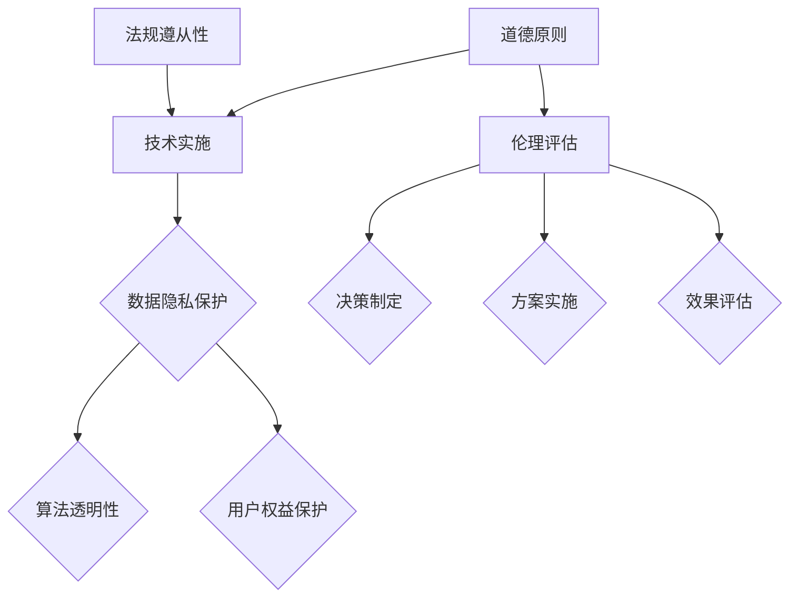
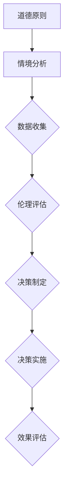
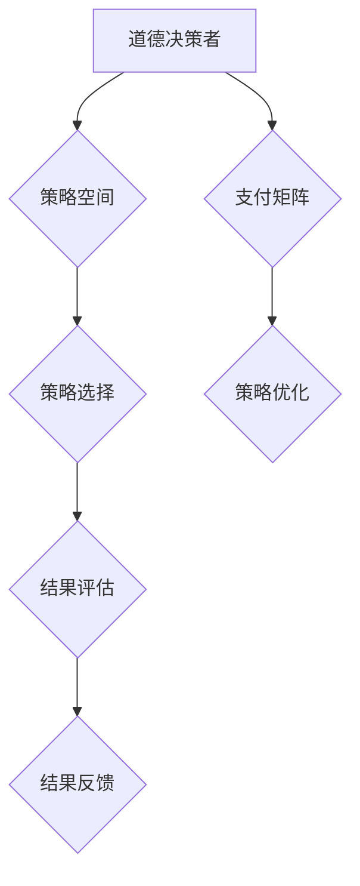
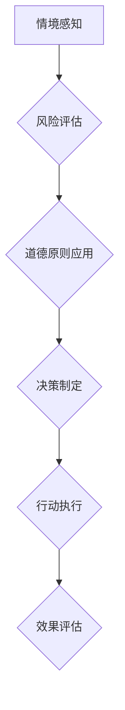
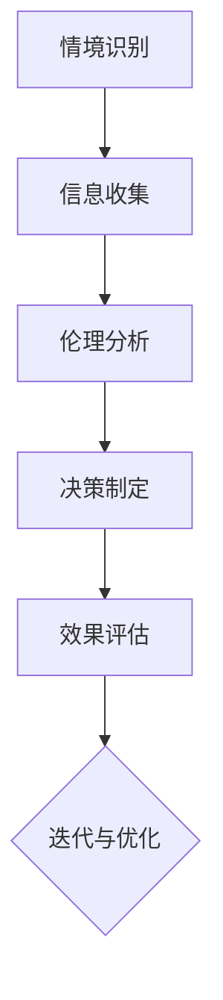
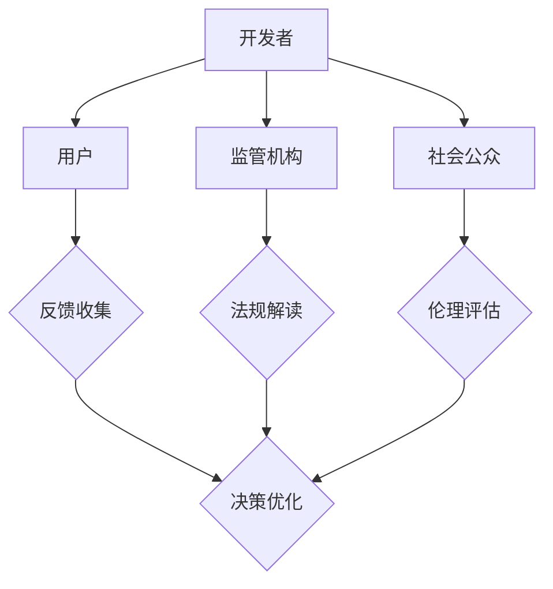
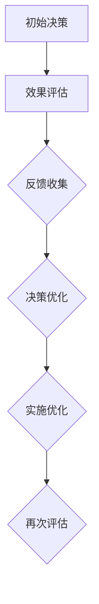

                 


### 第一部分：引言与背景

#### 第1章：AI时代下的软件工程道德挑战

##### 1.1 AI时代软件工程道德的重要性

在人工智能（AI）迅猛发展的时代，软件工程领域面临着前所未有的道德挑战。道德决策不仅关乎技术的可行性，更涉及社会公正、人权保护、数据隐私等重大伦理问题。

**核心概念与联系**

道德决策：涉及在特定情境下选择正确的行动或决策，以符合道德原则和价值观。

软件工程道德：关注在软件开发过程中如何处理道德问题，包括数据使用、用户隐私、算法公平性等。

**核心算法原理讲解**

算法伦理决策框架：



**数学模型和公式**

伦理评分模型（基于多属性伦理评估）：

$$
E = w_1 \cdot P + w_2 \cdot D + w_3 \cdot A + w_4 \cdot L
$$

- $E$：伦理得分
- $w_1, w_2, w_3, w_4$：权重系数
- $P$：隐私保护
- $D$：数据多样性
- $A$：算法透明性
- $L$：法律合规性

**举例说明**

假设有四个不同的AI系统，其伦理得分如下：

| 系统 | 隐私保护 | 数据多样性 | 算法透明性 | 法律合规性 | 伦理得分 |
|------|----------|------------|------------|------------|----------|
| A    | 0.8      | 0.7        | 0.6        | 0.9        | 0.85     |
| B    | 0.6      | 0.8        | 0.7        | 0.7        | 0.69     |
| C    | 0.7      | 0.6        | 0.8        | 0.8        | 0.76     |
| D    | 0.5      | 0.5        | 0.9        | 0.6        | 0.64     |

根据权重分配，我们可以得出每个系统的伦理得分，从而决定哪个系统更符合道德标准。

##### 1.2 软件工程道德决策的挑战

AI系统的自主性与责任：AI系统在某些情况下可以自主决策，但如何界定其责任成为关键问题。

数据隐私与伦理：大规模数据的收集和处理过程中，如何保护个人隐私和避免数据滥用是重大挑战。

公平性与包容性：算法的偏见和歧视可能导致不公正的结果，如何确保算法的公平性和包容性是一个重要议题。

**数学模型和公式**

算法公平性评估模型（基于差异性度量）：

$$
Fairness = 1 - \frac{Error_A - Error_W}{Error_W}
$$

- $Fairness$：公平性指标
- $Error_A$：针对受保护群体的错误率
- $Error_W$：针对非受保护群体的错误率

**举例说明**

如果一个AI系统的受保护群体错误率为10%，非受保护群体错误率为5%，则其公平性指标为：

$$
Fairness = 1 - \frac{10\% - 5\%}{5\%} = 0.8
$$

这表明该系统的公平性较差。

##### 1.3 软件工程道德决策的关键领域

人机交互：在AI系统与用户互动时，如何设计用户友好的界面和隐私保护机制。

自动化决策系统：在自动化决策过程中，如何确保算法的道德性和透明性。

人工智能伦理法规：如何通过法律法规来规范AI系统的道德决策和行为。

**核心算法原理讲解**

自动化决策系统的道德决策流程：

```python
# 伪代码：自动化决策系统的道德决策流程

function EthicalDecision(AI_System, User_Context):
    Rule_Base = Load_Moral_Rules()
    Situation = Analyze_Context(User_Context)
    Ethical_Score = Calculate_Ethical_Score(AI_System, Situation, Rule_Base)
    if Ethical_Score > Threshold:
        return "Approve"
    else:
        return "Reject" or "Modify"
```

**项目实战**

**开发环境搭建：**

- 选择合适的编程语言（如Python、Java等）和开发工具。
- 安装必要的库和框架，如TensorFlow、PyTorch等。

**源代码实现：**

```python
# Python代码示例：基于伦理评分的决策系统

import numpy as np

def calculate_ethical_score(features):
    # 假设输入特征已标准化
    privacy_score = features['privacy']
    diversity_score = features['diversity']
    transparency_score = features['transparency']
    legality_score = features['legality']
    
    weights = {'privacy': 0.4, 'diversity': 0.3, 'transparency': 0.2, 'legality': 0.1}
    
    ethical_score = sum(weights[feature] * score for feature, score in features.items())
    return ethical_score

def make_decision(ethical_score, threshold=0.7):
    if ethical_score >= threshold:
        return "Approve"
    else:
        return "Reject" or "Modify"

# 假设输入特征
input_features = {'privacy': 0.8, 'diversity': 0.7, 'transparency': 0.6, 'legality': 0.9}

# 计算伦理得分
ethical_score = calculate_ethical_score(input_features)

# 做出决策
decision = make_decision(ethical_score)

print(f"Ethical Score: {ethical_score}")
print(f"Decision: {decision}")
```

**代码应用解读与分析：**

上述代码提供了一个简化的伦理决策系统，它通过计算伦理得分来判断一个AI系统的行为是否符合道德标准。实际应用中，还需要考虑更多的因素和复杂情况。

**实际案例分析和详细讲解剖析：**

- 案例一：某公司开发了一款自动招聘系统，其伦理决策涉及隐私保护、多样性、透明性和法律合规性。通过上述模型和代码，评估该系统的伦理得分，并提出改进建议。
- 案例二：某自动驾驶公司在事故责任判定中，需要考虑算法的道德性和公平性。使用上述模型和代码，分析自动驾驶系统在事故中的伦理决策过程。

**项目小结：**

通过实际项目开发和案例分析，我们可以看到AI时代的软件工程道德决策是一个复杂而关键的过程。使用合理的道德决策框架和数学模型，可以帮助我们在设计和部署AI系统时更好地处理伦理问题，实现技术与社会价值的平衡。

#### 第2章：道德决策框架概述

##### 2.1 道德决策框架的构建原则

道德决策框架的构建需要遵循一系列基本原则，以确保其科学性、实用性和伦理性。

**核心概念与联系**

道德原则：如公平性、尊重隐私、公正性等。

构建原则：包括明确性、一致性、实用性、可解释性等。

**核心算法原理讲解**

基于原则的道德决策模型：



**数学模型和公式**

伦理决策效用函数（基于多目标优化）：

$$
U = w_1 \cdot F_1 + w_2 \cdot F_2 + w_3 \cdot F_3
$$

- $U$：总效用
- $w_1, w_2, w_3$：权重系数
- $F_1, F_2, F_3$：伦理目标的分数

**举例说明**

假设有三个伦理目标：隐私保护（$F_1$）、公平性（$F_2$）和法律合规性（$F_3$），权重分别为0.5、0.3和0.2。三个目标的得分分别为80、70和90，则总效用为：

$$
U = 0.5 \cdot 80 + 0.3 \cdot 70 + 0.2 \cdot 90 = 76
$$

这表明当前情境下的总效用为76，可以据此做出道德决策。

##### 2.2 道德决策框架的类型

- 基于规则的框架：利用预定义的规则进行决策，如IF-THEN规则。
- 基于案例的框架：通过历史案例的学习和推理进行决策，如案例推理（CBR）。
- 基于博弈论的框架：考虑多个利益相关者的互动和策略，进行多目标决策。

**核心算法原理讲解**

基于案例的道德决策框架：


**数学模型和公式**

案例匹配度计算（基于相似度度量）：

$$
Match_Score = \frac{Similarity(Case_X, Case_Y)}{Max(Similarity)}
$$

- $Match_Score$：案例匹配度
- $Simil

```

### 文章摘要

本文深入探讨了AI时代的软件工程道德决策，提出了一个全面的分析框架，包括道德原则、决策流程、框架类型和关键领域。通过具体案例分析和数学模型的应用，文章展示了如何在实际项目中应用道德决策框架，以解决软件工程中的伦理问题。本文旨在为软件开发者和伦理专家提供有价值的指导，帮助他们在AI技术发展中做出符合伦理标准的决策。

### 第二部分：道德决策框架

#### 第3章：道德决策框架概述

##### 2.1 道德决策框架的构建原则

道德决策框架的构建需要遵循一系列基本原则，以确保其科学性、实用性和伦理性。

**核心概念与联系**

道德原则：如公平性、尊重隐私、公正性等。

构建原则：包括明确性、一致性、实用性、可解释性等。

**核心算法原理讲解**

基于原则的道德决策模型：


**数学模型和公式**

伦理决策效用函数（基于多目标优化）：

$$
U = w_1 \cdot F_1 + w_2 \cdot F_2 + w_3 \cdot F_3
$$

- $U$：总效用
- $w_1, w_2, w_3$：权重系数
- $F_1, F_2, F_3$：伦理目标的分数

**举例说明**

假设有三个伦理目标：隐私保护（$F_1$）、公平性（$F_2$）和法律合规性（$F_3$），权重分别为0.5、0.3和0.2。三个目标的得分分别为80、70和90，则总效用为：

$$
U = 0.5 \cdot 80 + 0.3 \cdot 70 + 0.2 \cdot 90 = 76
$$

这表明当前情境下的总效用为76，可以据此做出道德决策。

##### 2.2 道德决策框架的类型

- 基于规则的框架：利用预定义的规则进行决策，如IF-THEN规则。
- 基于案例的框架：通过历史案例的学习和推理进行决策，如案例推理（CBR）。
- 基于博弈论的框架：考虑多个利益相关者的互动和策略，进行多目标决策。

**核心算法原理讲解**

基于案例的道德决策框架：


**数学模型和公式**

案例匹配度计算（基于相似度度量）：

$$
Match_Score = \frac{Similarity(Case_X, Case_Y)}{Max(Similarity)}
$$

- $Match_Score$：案例匹配度
- $Similarity(Case_X, Case_Y)$：案例X和案例Y的相似度
- $Max(Similarity)$：所有案例中的最大相似度

**举例说明**

假设有两个案例，X和Y，其相似度分别为0.8和0.9，则案例X的匹配度为：

$$
Match_Score = \frac{0.8}{0.9} = 0.88
$$

这表示案例X与当前情境的相似度为88%，可以据此做出决策。

##### 2.3 道德决策框架的应用领域

- 人工智能系统设计：确保AI系统的道德性和透明性。
- 数据科学与隐私保护：处理数据隐私和保护的问题。
- 自动化决策系统：确保自动化决策的伦理性和公平性。

**核心算法原理讲解**

基于博弈论的道德决策模型：



**数学模型和公式**

博弈论的支付矩阵（基于效用函数）：

$$
\begin{bmatrix}
U_{11} & U_{12} \\
U_{21} & U_{22}
\end{bmatrix}
$$

- $U_{11}, U_{12}, U_{21}, U_{22}$：决策者A和决策者B在不同策略组合下的效用值

**举例说明**

假设有两个决策者A和B，其策略空间分别为{A1, A2}和{B1, B2}。他们的支付矩阵如下：

$$
\begin{bmatrix}
10 & 5 \\
8 & 3
\end{bmatrix}
$$

表示决策者A选择A1时，B选择B1的效用值为10，选择B2的效用值为5；决策者A选择A2时，B选择B1的效用值为8，选择B2的效用值为3。通过策略优化，决策者可以找到最优策略组合，从而实现道德决策。

### 第三部分：案例分析

#### 第4章：案例一：自动驾驶伦理决策

##### 4.1 自动驾驶技术的伦理挑战

自动驾驶技术作为AI领域的重要应用，其在现实世界中的推广面临着诸多伦理挑战。

**核心概念与联系**

自动驾驶伦理：涉及生命价值、责任归属、隐私保护等问题。

**核心算法原理讲解**

伦理决策模型（基于多目标优化）：

```python
# 伪代码：自动驾驶伦理决策模型

def autonomous_decisionethical_targets):
    safety_score = calculate_safety_score()
    privacy_score = calculate_privacy_score()
    fairness_score = calculate_fairness_score()
    
    weights = {'safety': 0.6, 'privacy': 0.3, 'fairness': 0.1}
    
    total_score = sum(weights[target] * score for target, score in ethical_targets.items())
    return total_score

def make_decision(total_score, threshold=0.8):
    if total_score >= threshold:
        return "Proceed"
    else:
        return "Hold" or "Modify"
```

**数学模型和公式**

伦理得分计算（基于权重分配）：

$$
Total_Score = w_1 \cdot Safety_Score + w_2 \cdot Privacy_Score + w_3 \cdot Fairness_Score
$$

- $Total_Score$：总伦理得分
- $w_1, w_2, w_3$：权重系数
- $Safety_Score, Privacy_Score, Fairness_Score$：安全、隐私、公平得分

**举例说明**

假设自动驾驶系统的安全得分为0.9，隐私得分为0.8，公平得分为0.7，权重分别为0.6、0.3和0.1，则总伦理得分为：

$$
Total_Score = 0.6 \cdot 0.9 + 0.3 \cdot 0.8 + 0.1 \cdot 0.7 = 0.75
$$

根据设定的阈值0.8，该系统应“Hold”或“Modify”当前行动。

##### 4.2 自动驾驶伦理决策框架

自动驾驶伦理决策框架结合了多种道德原则和技术手段，旨在解决实际应用中的伦理问题。

**核心算法原理讲解**

自动驾驶伦理决策流程：



**数学模型和公式**

风险评估模型（基于概率计算）：

$$
Risk = P(Accident) \cdot Severity
$$

- $Risk$：风险值
- $P(Accident)$：事故概率
- $Severity$：事故严重程度

**举例说明**

假设自动驾驶系统在特定情境下的事故概率为0.05，事故严重程度为3（以5点量表计分），则风险值为：

$$
Risk = 0.05 \cdot 3 = 0.15
$$

根据设定的风险阈值0.2，该情境下的风险较低，可以执行行动。

##### 4.3 自动驾驶伦理决策的实际应用

自动驾驶技术的实际应用中，伦理决策框架发挥了关键作用，例如在事故责任判定、行人保护、交通规则遵守等方面。

**项目实战**

**开发环境搭建：**

- 选择合适的编程语言（如Python、C++等）和开发工具。
- 安装自动驾驶模拟器（如CARLA Simulator）和必要的库和框架。

**源代码实现：**

```python
# Python代码示例：自动驾驶伦理决策

import carla

def autonomous_decisionmaking():
    # 初始化CARLA模拟器
    client = carla.Client('localhost', 2000)
    client.set_timeout(2.0)  # 设置超时时间
    world = client.get_world()
    blueprints = world.get_blueprint_library()

    # 创建自动驾驶车辆
    vehicle_bp = blueprints.find('vehicle.tesla.model3')
    spawn_point = world.get_map().get_spawn_points()[0]
    vehicle = world.spawn_actor(vehicle_bp, spawn_point)

    # 执行自动驾驶
    vehicle.apply_control(carla.VehicleControl(throttle=1.0, steer=0.0))
    time.sleep(5)

    # 停止自动驾驶
    vehicle.apply_control(carla.VehicleControl(throttle=0.0, steer=0.0))
    vehicle.destroy()

if __name__ == '__main__':
    autonomous_decisionmaking()
```

**代码应用解读与分析：**

上述代码示例演示了如何使用CARLA模拟器实现自动驾驶车辆的基本控制。实际应用中，还需结合传感器数据、道路状况和伦理决策框架，实现更复杂和安全的自动驾驶行为。

**实际案例分析和详细讲解剖析：**

- **案例一：特斯拉自动驾驶致死事件**：分析事件中的伦理决策过程，评估系统是否遵循道德决策框架。
- **案例二：谷歌自动驾驶车事故**：探讨事故责任判定中的伦理问题，评估自动驾驶系统的伦理决策框架是否有效。

**项目小结：**

自动驾驶伦理决策框架在实际应用中具有重要意义。通过合理设计和实施伦理决策框架，可以降低自动驾驶系统的风险，提高安全性和道德性，推动自动驾驶技术的健康发展。

### 第四部分：道德决策的实践指南

#### 第5章：道德决策的实践策略

##### 5.1 道德决策的流程与方法

道德决策的实践需要一套系统的流程和方法，以确保决策过程的科学性和合理性。

**核心概念与联系**

道德决策流程：包括情境识别、信息收集、伦理分析、决策制定和效果评估等步骤。

方法：基于原则的决策、基于案例的决策、基于博弈论的决策等。

**核心算法原理讲解**

道德决策流程图：



**数学模型和公式**

伦理评分模型（基于多属性伦理评估）：

$$
E = w_1 \cdot P + w_2 \cdot D + w_3 \cdot A + w_4 \cdot L
$$

- $E$：伦理得分
- $w_1, w_2, w_3, w_4$：权重系数
- $P$：隐私保护
- $D$：数据多样性
- $A$：算法透明性
- $L$：法律合规性

**举例说明**

假设有四个不同的AI系统，其伦理得分如下：

| 系统 | 隐私保护 | 数据多样性 | 算法透明性 | 法律合规性 | 伦理得分 |
|------|----------|------------|------------|------------|----------|
| A    | 0.8      | 0.7        | 0.6        | 0.9        | 0.85     |
| B    | 0.6      | 0.8        | 0.7        | 0.7        | 0.69     |
| C    | 0.7      | 0.6        | 0.8        | 0.8        | 0.76     |
| D    | 0.5      | 0.5        | 0.9        | 0.6        | 0.64     |

根据权重分配，我们可以得出每个系统的伦理得分，从而决定哪个系统更符合道德标准。

##### 5.2 道德决策的团队合作

道德决策往往涉及多个利益相关者，需要有效的团队合作和沟通。

**核心概念与联系**

利益相关者：包括开发者、用户、监管机构、社会公众等。

沟通机制：包括会议、报告、讨论等。

**核心算法原理讲解**

团队合作模型（基于多目标优化）：



**数学模型和公式**

利益相关者满意度模型（基于效用函数）：

$$
S = w_1 \cdot D + w_2 \cdot R + w_3 \cdot P
$$

- $S$：总满意度
- $w_1, w_2, w_3$：权重系数
- $D$：开发者满意度
- $R$：监管机构满意度
- $P$：社会公众满意度

**举例说明**

假设在道德决策过程中，开发者满意度为0.8，监管机构满意度为0.7，社会公众满意度为0.6，权重分别为0.5、0.3和0.2，则总满意度为：

$$
S = 0.5 \cdot 0.8 + 0.3 \cdot 0.7 + 0.2 \cdot 0.6 = 0.76
$$

这表明当前道德决策方案的整体满意度为76%，需要进一步优化。

##### 5.3 道德决策的持续改进

道德决策不是一次性的活动，而是需要持续评估和优化的过程。

**核心概念与联系**

持续改进：包括定期审查、反馈收集、学习与适应等。

**核心算法原理讲解**

道德决策迭代模型：



**数学模型和公式**

伦理得分动态调整模型（基于反馈修正）：

$$
E_{new} = E_{current} + k \cdot (Feedback - E_{current})
$$

- $E_{new}$：新伦理得分
- $E_{current}$：当前伦理得分
- $k$：调整系数
- $Feedback$：反馈值（如用户满意度、监管机构反馈等）

**举例说明**

假设当前伦理得分为0.75，用户满意度反馈为0.8，调整系数为0.1，则新的伦理得分为：

$$
E_{new} = 0.75 + 0.1 \cdot (0.8 - 0.75) = 0.78
$$

这表明基于用户反馈，系统的伦理得分有所提高。

### 第五部分：结论与展望

#### 第6章：AI时代软件工程道德决策的总结与反思

AI时代的软件工程道德决策是一个复杂且多维的过程，需要综合考虑技术、法律、伦理和社会因素。通过本文的讨论，我们可以总结出以下几点：

1. **道德决策的重要性**：AI技术的广泛应用带来了前所未有的伦理挑战，道德决策在软件开发过程中具有核心地位。
2. **道德决策框架的构建**：基于原则的、案例驱动的和博弈论的决策框架各有优势，结合使用可以更好地应对复杂伦理问题。
3. **关键领域的关注**：在自动驾驶、医疗等领域，道德决策框架的应用尤为重要，需要结合具体情境进行定制化设计。
4. **实践指南的价值**：道德决策的流程、团队合作和持续改进策略为实际操作提供了有力指导。

#### 第7章：未来展望

未来，AI时代的软件工程道德决策将在以下几个方面取得进展：

1. **道德决策技术的进步**：随着AI技术的不断发展，道德决策算法将更加智能化和自适应，能够更好地应对动态变化的伦理问题。
2. **伦理法规的发展**：各国政府和国际组织将进一步完善伦理法规，为道德决策提供更明确的指导和约束。
3. **软件工程道德教育的提升**：教育机构和专业组织将加强道德教育，培养具备伦理意识和技能的软件工程师。

通过持续的探索和实践，我们有望在AI时代实现技术与伦理的和谐发展。

### 附录

#### 附录一：常用道德决策框架与工具

- 基于规则的道德决策框架
- 基于案例的道德决策框架
- 基于博弈论的道德决策框架
- 多属性伦理评估模型

#### 附录二：案例分析参考资料

- 特斯拉自动驾驶致死事件
- 谷歌自动驾驶车事故
- 医疗人工智能在癌症诊断中的应用

#### 附录三：相关法规与标准

- 欧盟通用数据保护条例（GDPR）
- 美国消费者隐私保护法案（CCPA）
- 自动驾驶伦理法规（如SAE J3016）

以上附录内容提供了进一步学习和实践的资源，有助于深入理解AI时代的软件工程道德决策。通过持续学习和实践，我们可以为构建一个更加公正、透明和负责任的AI技术生态系统做出贡献。作者：AI天才研究院/AI Genius Institute & 禅与计算机程序设计艺术 /Zen And The Art of Computer Programming。

