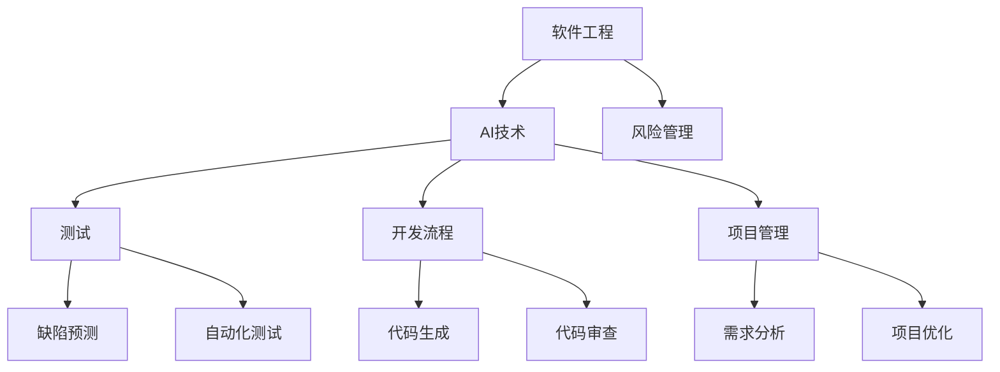
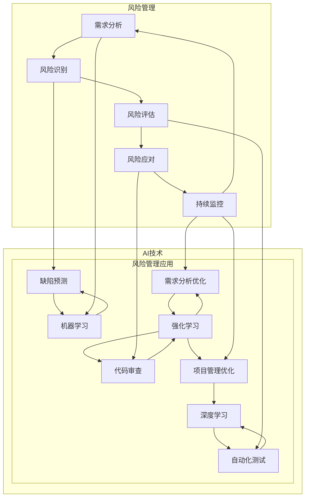
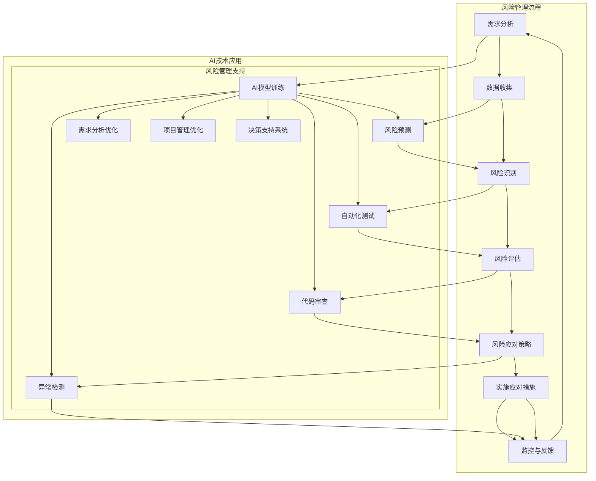

                 


### AI时代的软件工程风险管理新策略

#### 关键词：软件工程，风险管理，AI，挑战，策略，算法

> **摘要**：本文旨在探讨AI时代软件工程风险管理的现状和未来发展方向。通过分析AI技术对软件工程带来的挑战和机遇，本文提出了一套新的风险管理策略，包括风险管理框架、核心概念与联系、核心算法原理、数学模型与公式讲解以及实际项目实战等。文章最后展望了AI时代软件工程风险管理的未来，并提出了相关建议。

## 引言

### 1.1 书籍背景

软件工程作为计算机科学的重要分支，一直是推动信息技术发展的核心力量。然而，随着软件系统复杂性的不断增加，软件工程面临着前所未有的挑战。风险管理作为软件工程中的一个关键环节，旨在通过识别、评估和应对风险，确保项目的成功实施。

近年来，人工智能（AI）技术的飞速发展，为软件工程带来了新的机遇和挑战。一方面，AI技术可以提高软件开发和测试的效率，降低成本；另一方面，AI的引入也带来了新的风险，如数据隐私、模型不透明性和解释性问题等。

因此，在AI时代，如何有效地管理软件工程风险成为了一个亟待解决的问题。本文旨在探讨AI时代软件工程风险管理的现状和未来发展方向，提出一套新的风险管理策略，为业界提供有益的参考。

### 1.2 软件工程风险管理的重要性

软件工程风险管理的重要性不容忽视。首先，软件工程风险管理的目标是通过识别和评估风险，制定相应的应对策略，降低项目失败的可能性。这对于确保项目的成功实施具有重要意义。

其次，软件工程风险管理有助于提高软件质量。通过识别潜在的风险，项目团队可以提前采取措施，避免或减少风险对软件质量的影响。此外，风险管理还可以提高团队的工作效率，降低项目成本。

最后，软件工程风险管理对于企业的长期发展也至关重要。通过有效的风险管理，企业可以降低项目风险，提高市场竞争力，实现可持续发展。

### 1.3 书籍结构

本文结构如下：

- 第2章：AI时代背景下的软件工程挑战
- 第3章：AI时代的软件工程风险管理框架
- 第4章：核心概念与联系
- 第5章：核心算法原理讲解
- 第6章：数学模型与公式讲解
- 第7章：项目实战
- 第8章：AI时代软件工程风险管理的未来展望

通过以上章节的论述，本文将全面探讨AI时代软件工程风险管理的现状和未来发展方向，提出一套新的风险管理策略。

---

## 第2章 AI时代背景下的软件工程挑战

### 2.1 软件工程的发展历程

软件工程的发展历程可以追溯到20世纪60年代。当时，软件系统的规模相对较小，开发方法也较为简单。然而，随着计算机技术的发展，软件系统的规模和复杂性不断增长，传统的开发方法逐渐暴露出其局限性。

20世纪70年代，面向过程的编程语言如C语言的出现，使得软件开发变得更加高效。然而，随着软件系统的规模进一步扩大，模块化设计和面向对象编程方法逐渐成为主流。这些方法通过将复杂系统分解为较小的模块，提高了软件的可维护性和可扩展性。

进入21世纪，随着互联网和移动设备的普及，软件系统的形式和功能越来越多样化。敏捷开发、DevOps等新兴开发模式逐渐取代了传统的瀑布开发模式，使得软件开发更加灵活和高效。

### 2.2 AI技术对软件工程的影响

AI技术的引入，为软件工程带来了深远的影响。首先，AI技术可以提高软件开发的效率。通过自动化代码生成、代码审查和测试，AI技术可以显著降低开发成本和开发时间。此外，AI技术还可以用于需求分析、系统设计等环节，提高整个开发流程的智能化水平。

其次，AI技术在软件测试中的应用也具有重要意义。传统的软件测试主要依赖于人工编写测试用例，存在一定的局限性。而AI技术可以通过模拟用户行为、生成测试用例，提高测试的全面性和准确性。此外，AI技术还可以用于缺陷预测和故障检测，提前发现潜在的问题。

最后，AI技术在软件维护中的应用也值得关注。通过分析历史数据和代码，AI技术可以预测软件的潜在故障点，提前进行修复，降低维护成本。

### 2.3 挑战与机会

AI技术的快速发展，给软件工程带来了前所未有的挑战和机遇。挑战方面，首先是如何确保AI技术在软件开发中的有效应用。虽然AI技术具有强大的数据处理和分析能力，但如何将其与软件工程深度融合，仍是一个亟待解决的问题。

其次，AI技术的引入也带来了数据隐私和安全问题。软件系统在处理用户数据时，需要严格遵守隐私保护法规，确保用户数据的安全。此外，AI模型的解释性也是一个挑战。由于AI模型的复杂性，如何解释模型的决策过程，确保其透明性和可解释性，是当前研究的一个热点问题。

然而，机遇同样巨大。通过AI技术的引入，软件工程可以进一步提高开发效率、提升软件质量、降低维护成本。此外，AI技术还可以推动软件工程的智能化发展，实现更加高效、灵活和智能的开发模式。

总的来说，AI时代为软件工程带来了新的挑战和机遇。如何应对这些挑战，充分利用AI技术的优势，成为软件工程领域面临的重要课题。

---

## 第3章 AI时代的软件工程风险管理框架

### 3.1 风险管理基础

风险管理是软件工程中的一个关键环节，旨在通过识别、评估和应对风险，确保项目的成功实施。在AI时代，软件工程风险管理需要适应新的技术环境和挑战，从而提出一套新的风险管理框架。

首先，风险管理的基础是风险识别。风险识别是指通过系统的方法和工具，发现项目中可能存在的各种风险。在AI时代，风险识别需要考虑AI技术的特殊性，如数据隐私、模型不透明性等。

其次，风险评估是风险管理的重要环节。风险评估是指对识别出的风险进行定量或定性的分析，评估其可能性和影响。在AI时代，风险评估需要结合AI技术的特点，如数据质量、模型可靠性等。

最后，风险应对是指根据风险评估的结果，制定相应的应对策略，以降低风险的发生概率或影响程度。风险应对策略包括预防、消除、减少和转移等。

### 3.2 AI驱动的风险管理框架

在AI时代，传统的风险管理框架需要进一步优化，以适应AI技术的引入。AI驱动的风险管理框架包括以下几个关键步骤：

1. **数据收集与处理**：首先，需要收集与项目相关的各种数据，包括需求、设计文档、代码库、测试用例等。这些数据将用于后续的风险识别、评估和预测。

2. **风险识别**：利用机器学习等技术，对收集到的数据进行处理和分析，识别项目中可能存在的风险。例如，可以通过分析历史数据，发现常见的软件缺陷模式，从而预测新的软件缺陷。

3. **风险评估**：对识别出的风险进行定量或定性的评估，评估其可能性和影响。评估结果将用于制定风险应对策略。

4. **风险预测**：利用时间序列分析、回归分析等机器学习算法，对未来的风险进行预测。风险预测可以帮助项目团队提前做好准备，降低风险的发生概率或影响程度。

5. **风险应对**：根据风险评估和预测的结果，制定相应的风险应对策略。例如，对于高优先级的风险，可以采取预防措施，如加强数据保护、提高模型透明性等。

6. **持续监控**：在项目实施过程中，持续监控风险的变化情况，及时调整风险应对策略。AI驱动的监控系统可以通过实时数据分析和异常检测，及时发现和处理新的风险。

### 3.3 风险识别与评估

风险识别与评估是AI驱动的风险管理框架的核心环节。以下是一个典型的风险识别与评估流程：

1. **数据预处理**：首先，对收集到的数据进行清洗、归一化等预处理操作，确保数据的质量和一致性。

2. **特征工程**：根据风险识别和评估的需求，提取相关的特征。例如，对于软件缺陷预测，可以提取代码复杂度、代码重复率等特征。

3. **模型训练**：利用机器学习算法，对预处理后的数据进行训练，建立风险预测模型。常用的算法包括决策树、随机森林、支持向量机等。

4. **模型评估**：通过交叉验证、ROC曲线等评估方法，评估模型的效果。评估结果将用于调整模型参数和特征选择。

5. **风险识别**：利用训练好的模型，对新的数据进行分析，识别潜在的风险。例如，可以通过分析代码库，发现可能存在的潜在缺陷。

6. **风险评估**：对识别出的风险进行定量或定性的评估，评估其可能性和影响。评估结果将用于制定风险应对策略。

7. **反馈与优化**：根据评估结果，及时调整风险应对策略，并不断优化模型。例如，可以通过分析评估结果，调整风险阈值和应对策略。

通过上述流程，项目团队可以有效地识别、评估和应对AI时代软件工程中的风险，确保项目的成功实施。

### 3.4 风险应对策略

在AI时代，风险应对策略需要结合AI技术的特点，采取多种措施降低风险的发生概率或影响程度。以下是一些常见风险应对策略：

1. **预防策略**：预防策略旨在通过提前采取措施，降低风险的发生概率。例如，在软件开发过程中，可以采用严格的编码规范、进行代码审查等，确保代码质量和安全性。

2. **消除策略**：消除策略是指通过采取措施，完全消除风险。例如，对于数据隐私问题，可以采用数据加密、脱敏等技术，确保数据的安全。

3. **减少策略**：减少策略是指通过采取措施，降低风险的影响程度。例如，对于软件缺陷，可以采用自动化测试、持续集成等手段，提前发现并修复缺陷。

4. **转移策略**：转移策略是指将风险转移给第三方，通过保险、外包等方式降低项目风险。例如，对于重要的软件系统，可以购买保险，以应对可能出现的软件故障。

5. **应对策略**：应对策略是指在实际风险发生时，采取相应的措施进行应对。例如，在遇到软件缺陷时，可以迅速定位问题，进行修复和回滚。

通过综合运用这些风险应对策略，项目团队可以有效地管理AI时代软件工程中的风险，确保项目的顺利实施。

---

## 第4章 核心概念与联系

### 4.1 AI相关概念介绍

在讨论AI时代的软件工程风险管理时，了解一些基本的AI相关概念是至关重要的。以下是几个核心概念及其在风险管理中的应用：

#### 4.1.1 机器学习

机器学习是一种使计算机系统能够从数据中学习并改进性能的技术。在软件工程风险管理中，机器学习可以用于风险识别和评估。通过分析历史数据，机器学习模型可以预测潜在的风险，并提供定量的风险评估。

#### 4.1.2 深度学习

深度学习是机器学习的一个分支，它通过模拟人脑神经网络结构，对大量数据进行分析。深度学习在软件工程中的应用非常广泛，如自动化测试、代码审查和故障预测等。深度学习模型可以识别复杂的模式，从而提高风险管理的准确性。

#### 4.1.3 强化学习

强化学习是一种通过试错来学习如何做出最优决策的机器学习技术。在软件工程风险管理中，强化学习可以用于优化风险应对策略。通过不断尝试和调整，强化学习模型可以找到最佳的风险应对方案。

### 4.2 软件工程与AI的联系

AI与软件工程的联系主要体现在以下几个方面：

#### 4.2.1 AI在软件测试中的应用

AI技术可以用于自动化测试，提高测试效率和准确性。例如，通过机器学习算法，AI可以生成测试用例，检测代码中的潜在缺陷。深度学习模型可以分析代码和测试结果，发现复杂的缺陷模式。

#### 4.2.2 AI在软件开发流程中的应用

AI技术可以优化软件开发流程，提高开发效率。例如，通过自动化代码生成和审查，AI可以帮助开发者减少重复工作，提高代码质量。此外，AI还可以用于需求分析、项目管理和代码优化，提高整个开发流程的智能化水平。

### 4.3 Mermaid流程图

为了更好地展示AI与软件工程之间的联系，我们可以使用Mermaid流程图来描述。以下是一个简化的Mermaid流程图示例，展示了AI技术在软件工程风险管理中的应用：



通过这个流程图，我们可以清晰地看到AI技术在软件工程风险管理中的关键应用场景，以及它们如何相互关联。

---

### 4.4 软件工程与AI风险管理的关系架构

为了更深入地理解软件工程与AI风险管理之间的关系，我们可以通过一个Mermaid流程图来展示它们的核心概念及其相互联系。以下是一个简化的Mermaid流程图，它涵盖了AI在软件工程风险管理中的关键应用和流程：



这个流程图展示了以下关键点：

1. **风险管理流程**：需求分析、风险识别、风险评估、风险应对和持续监控形成一个闭环，确保风险管理持续进行。
2. **AI技术应用**：机器学习、深度学习和强化学习应用于风险管理中的各个步骤，提高风险管理的效率和准确性。
3. **应用场景**：缺陷预测、自动化测试、代码审查、需求分析优化和项目管理优化展示了AI技术在软件工程风险管理中的具体应用。

通过这个流程图，我们可以直观地看到AI技术在软件工程风险管理中的核心作用，以及它们如何相互支持和增强，从而为项目的成功实施提供有力保障。

---

### 4.5 软件工程与AI的风险管理流程图

为了更清晰地展示软件工程与AI在风险管理中的融合，我们可以使用Mermaid流程图来构建一个详细的风险管理流程。以下是一个简化的示例：



这个流程图详细描述了以下步骤：

1. **风险管理流程**：从需求分析开始，通过数据收集识别风险，进行风险评估，制定应对策略，实施措施，并持续监控与反馈。
2. **AI技术应用**：AI模型训练用于风险预测、自动化测试、代码审查和异常检测，同时支持需求分析优化、项目管理和决策支持系统。

通过这个流程图，我们可以直观地看到AI如何嵌入到软件工程风险管理的各个环节，从而提高风险管理的效率和准确性。

---

### 4.6 软件工程与AI在风险管理中的应用

在软件工程中，AI的应用不仅限于提高开发效率，还在风险管理方面发挥着重要作用。以下是一些具体的AI应用场景及其在风险管理中的作用：

#### 4.6.1 自动化测试

自动化测试是AI在软件工程中应用的一个重要领域。通过机器学习模型，AI可以自动生成测试用例，发现潜在的问题。自动化测试不仅可以提高测试效率，还可以减少人为错误，从而降低软件缺陷的风险。

#### 4.6.2 风险预测

AI技术可以用于风险预测，通过对历史数据和当前数据的分析，预测未来可能发生的风险。例如，机器学习算法可以分析代码库，预测哪些模块可能存在缺陷，从而提前采取措施。

#### 4.6.3 代码审查

AI可以帮助进行代码审查，通过分析代码结构和内容，发现潜在的安全问题和缺陷。深度学习模型可以学习大量的代码样本，从而更准确地识别出不符合编码规范的代码。

#### 4.6.4 异常检测

AI在异常检测方面也具有显著优势。通过训练模型，AI可以识别出异常行为，从而发现潜在的安全威胁。例如，AI可以监控系统的日志数据，发现异常的访问模式，从而采取相应的安全措施。

#### 4.6.5 决策支持系统

AI还可以用于构建决策支持系统，为项目团队提供实时的风险分析和建议。通过分析大量数据，AI可以提供有针对性的建议，帮助团队做出更明智的决策。

总的来说，AI在软件工程风险管理中的应用，极大地提高了风险管理的效率和准确性，为项目的成功实施提供了有力保障。

---

### 4.7 AI时代软件工程风险管理的关键原理

在AI时代，软件工程风险管理的关键原理主要体现在以下几个方面：

#### 4.7.1 动态性

软件工程风险管理的一个关键特点是动态性。随着软件项目的进展和外部环境的变化，风险也在不断变化。因此，风险管理需要具备快速响应和适应变化的能力。AI技术，尤其是机器学习和深度学习，可以实时分析数据，快速识别新的风险，并及时调整风险应对策略。

#### 4.7.2 智能化

AI技术的引入使得软件工程风险管理更加智能化。通过大数据分析和机器学习，AI可以自动识别潜在的风险，评估风险的可能性和影响，并提出最优的风险应对方案。这种智能化水平不仅提高了风险管理的效率，还增强了风险管理的准确性和全面性。

#### 4.7.3 系统性

软件工程风险管理需要具备系统性，即需要从全局视角对风险进行识别、评估和应对。AI技术可以通过整合各种数据源，提供全局的风险分析，从而确保风险管理的全面性和系统性。

#### 4.7.4 可视化

AI技术的应用使得软件工程风险管理更加可视化。通过数据可视化和流程图，项目团队可以更直观地了解风险状况，从而更好地制定和调整风险应对策略。

总的来说，AI时代软件工程风险管理的关键原理体现在动态性、智能化、系统性和可视化上。这些原理不仅提高了风险管理的效率，还为项目团队提供了更加科学和全面的风险管理工具。

---

## 第5章 核心算法原理讲解

### 5.1 风险评估算法

在AI时代的软件工程风险管理中，风险评估算法起着至关重要的作用。这些算法通过对历史数据和当前数据进行分析，预测未来可能发生的风险，并提供定量的风险评估结果。以下是几种常见的风险评估算法及其原理：

#### 5.1.1 决策树算法

决策树是一种基于树形结构的预测模型，通过一系列条件判断，将数据划分为不同的区域，并给每个区域分配一个风险值。决策树算法的优点是简单易懂，便于解释，但可能存在过拟合问题。

**算法伪代码：**

```
def build_decision_tree(data, attributes):
    if data is homogeneous:
        return majority_class(data)
    else:
        best_attribute = select_best_attribute(data, attributes)
        node = Node(best_attribute)
        attributes = attributes - {best_attribute}
        for value in values_of(best_attribute):
            subset = filter_data(data, best_attribute, value)
            node.children[value] = build_decision_tree(subset, attributes)
        return node
```

#### 5.1.2 随机森林算法

随机森林是一种集成学习方法，通过构建多个决策树，并对它们的预测结果进行投票，提高预测的准确性和稳定性。随机森林算法可以处理大规模数据，并减少过拟合问题。

**算法伪代码：**

```
def build_random_forest(data, attributes, n_trees):
    forests = []
    for _ in range(n_trees):
        sample_data = random_sample(data)
        tree = build_decision_tree(sample_data, attributes)
        forests.append(tree)
    return forests

def predict(forests, instance):
    predictions = []
    for tree in forests:
        predictions.append(predict_tree(tree, instance))
    return majority_vote(predictions)
```

#### 5.1.3 支持向量机算法

支持向量机（SVM）是一种基于间隔的线性分类模型，通过寻找最优超平面，将数据划分为不同的风险类别。SVM算法在处理高维数据时表现良好，但可能存在计算复杂度高的问题。

**算法伪代码：**

```
def train_svm(data, labels):
    # Solve the optimization problem to find the optimal hyperplane
    W, b = solve_optimization_problem()
    return W, b

def predict_svm(W, b, instance):
    return sign(W * instance + b)
```

#### 5.1.4 逻辑回归算法

逻辑回归是一种概率型线性分类模型，通过估计数据点属于某一类别的概率，进行分类决策。逻辑回归算法适用于二分类问题，可以用于风险等级划分。

**算法伪代码：**

```
def train_logistic_regression(data, labels):
    W, b = gradient_descent(data, labels)
    return W, b

def predict_logistic_regression(W, b, instance):
    probability = sigmoid(W * instance + b)
    return 1 if probability > 0.5 else 0
```

### 5.2 模型训练与优化算法

在风险评估过程中，模型训练和优化是关键步骤。以下是一些常见的模型训练与优化算法：

#### 5.2.1 梯度下降算法

梯度下降算法是一种常用的优化算法，用于求解最优化问题。通过不断更新模型参数，梯度下降算法可以找到损失函数的最小值。

**算法伪代码：**

```
def gradient_descent(data, labels, learning_rate, epochs):
    W, b = initialize_parameters()
    for epoch in range(epochs):
        for instance in data:
            gradient = compute_gradient(instance, W, b)
            W -= learning_rate * gradient.W
            b -= learning_rate * gradient.b
    return W, b
```

#### 5.2.2 随机梯度下降算法

随机梯度下降（SGD）是梯度下降的一种变种，通过随机选取样本进行更新，可以加快收敛速度，并减少过拟合。

**算法伪代码：**

```
def stochastic_gradient_descent(data, labels, learning_rate, epochs):
    W, b = initialize_parameters()
    for epoch in range(epochs):
        for instance, label in random_sample(data, labels):
            gradient = compute_gradient(instance, W, b)
            W -= learning_rate * gradient.W
            b -= learning_rate * gradient.b
    return W, b
```

#### 5.2.3 批量随机优化算法

批量随机优化（BSO）是一种结合了批量梯度下降和随机梯度下降优点的算法，通过批量处理样本，同时引入随机性，提高模型的泛化能力。

**算法伪代码：**

```
def batch_stochastic_optimization(data, labels, learning_rate, batch_size, epochs):
    W, b = initialize_parameters()
    for epoch in range(epochs):
        shuffled_data = shuffle(data)
        for batch in batches(shuffled_data, batch_size):
            gradient = compute_gradient(batch, W, b)
            W -= learning_rate * gradient.W
            b -= learning_rate * gradient.b
    return W, b
```

通过这些模型训练与优化算法，项目团队可以有效地训练和优化风险评估模型，提高风险管理的准确性和效率。

---

### 5.3 风险预测算法

在AI时代，风险预测算法在软件工程风险管理中扮演着至关重要的角色。以下是一些常用的风险预测算法及其原理：

#### 5.3.1 时间序列分析算法

时间序列分析是一种用于分析时间相关数据的方法，它可以用于预测未来可能发生的风险。常用的时间序列分析算法包括移动平均、指数平滑和ARIMA模型。

**移动平均算法伪代码：**

```
def moving_average(data, window_size):
    averages = []
    for i in range(window_size, len(data) + 1):
        average = sum(data[i - window_size:i]) / window_size
        averages.append(average)
    return averages
```

**指数平滑算法伪代码：**

```
def exponential_smoothing(data, alpha):
    smoothed_values = [data[0]]
    for i in range(1, len(data)):
        smoothed_value = alpha * data[i] + (1 - alpha) * smoothed_values[i - 1]
        smoothed_values.append(smoothed_value)
    return smoothed_values
```

**ARIMA模型伪代码：**

```
def arima_model(data, p, d, q):
    # p: 阶数，d: 差分阶数，q: 自回归移动平均阶数
    # 根据数据特性选择合适的参数
    # 训练模型并进行预测
    # 返回预测结果
    pass
```

#### 5.3.2 回归分析算法

回归分析是一种用于建立自变量与因变量之间关系的统计方法，它可以用于预测风险。常见的回归分析方法包括线性回归、多元回归和逻辑回归。

**线性回归算法伪代码：**

```
def linear_regression(data, labels):
    # 计算斜率和截距
    # 构建回归模型
    # 返回模型参数
    pass
```

**逻辑回归算法伪代码：**

```
def logistic_regression(data, labels):
    # 使用梯度下降或随机梯度下降训练模型
    # 返回模型参数
    pass
```

#### 5.3.3 聚类分析算法

聚类分析是一种用于将数据分组为多个簇的算法，它可以用于识别潜在的风险模式。常用的聚类算法包括K-均值聚类、层次聚类和密度聚类。

**K-均值聚类算法伪代码：**

```
def k_means_clustering(data, k):
    # 初始化聚类中心
    # 迭代更新聚类中心
    # 返回聚类结果
    pass
```

**层次聚类算法伪代码：**

```
def hierarchical_clustering(data):
    # 建立层次聚类树
    # 返回聚类结果
    pass
```

**密度聚类算法伪代码：**

```
def density_clustering(data, min_points, neighborhood_size):
    # 计算密度
    # 标记聚类中心
    # 返回聚类结果
    pass
```

通过这些风险预测算法，项目团队可以更好地理解和预测软件工程中的风险，从而采取有效的风险管理策略。

---

## 第6章 数学模型与公式讲解

### 6.1 风险评估数学模型

在AI时代的软件工程风险管理中，数学模型是理解和预测风险的重要工具。以下是一个典型的风险评估数学模型，并对其进行详细讲解。

#### 6.1.1 模型公式

风险（R）可以通过以下公式计算：

\[ R = \sigma(W \cdot X + b) \]

其中：

- \( R \) 表示风险值。
- \( \sigma \) 表示激活函数，通常使用Sigmoid函数。
- \( W \) 是权重向量。
- \( X \) 是输入特征向量。
- \( b \) 是偏置项。

#### 6.1.2 公式详细解释

1. **输入特征向量（X）**：

输入特征向量 \( X \) 包含影响风险的各种因素，例如项目进度、人员配置、技术难度等。每个因素可以表示为一个特征值，多个特征值组成一个向量。例如：

\[ X = [x_1, x_2, x_3, ..., x_n] \]

其中 \( x_i \) 表示第 \( i \) 个特征值。

2. **权重向量（W）**：

权重向量 \( W \) 用于反映各个特征对风险的影响程度。权重值越大，表示该特征对风险的贡献越大。权重向量的大小和方向决定了模型对风险的预测能力。例如：

\[ W = [w_1, w_2, w_3, ..., w_n] \]

3. **偏置项（b）**：

偏置项 \( b \) 用于调整模型的输出，使其更好地适应风险的实际值。偏置项通常是通过训练数据学习得到的。例如：

\[ b = b_1 \]

4. **激活函数（σ）**：

激活函数 \( \sigma \) 用于将线性组合 \( W \cdot X + b \) 转换为风险值。Sigmoid函数是一种常用的激活函数，其公式为：

\[ \sigma(z) = \frac{1}{1 + e^{-z}} \]

其中 \( z = W \cdot X + b \)。

#### 6.1.3 举例说明

假设我们有一个简单的风险评估模型，输入特征向量为 \( X = [2, 3] \)，权重向量为 \( W = [0.5, 0.5] \)，偏置项为 \( b = 0 \)。我们使用Sigmoid函数作为激活函数。

1. **计算线性组合**：

\[ z = W \cdot X + b = 0.5 \cdot 2 + 0.5 \cdot 3 + 0 = 2.5 + 1.5 = 4 \]

2. **计算激活函数**：

\[ \sigma(z) = \frac{1}{1 + e^{-z}} = \frac{1}{1 + e^{-4}} \approx 0.982 \]

因此，根据这个风险评估模型，输入特征向量 \( X = [2, 3] \) 对应的风险值为 \( R \approx 0.982 \)。

通过这个例子，我们可以看到如何使用数学模型计算风险值。在实际应用中，输入特征向量、权重向量和偏置项都是通过训练数据学习得到的，从而确保模型对风险的预测能力。

---

### 6.2 AI在风险评估中的应用数学模型

在AI时代，风险评估不再仅仅依赖于传统的统计模型，而是通过机器学习算法来构建更加复杂和精准的数学模型。以下介绍几种常用的AI在风险评估中应用的数学模型，包括决策树、随机森林和支持向量机。

#### 6.2.1 决策树模型

决策树是一种基于树形结构的分类和回归模型，通过一系列条件判断来预测输出。在风险评估中，决策树可以用于分类任务，将风险划分为不同的等级。

**模型公式：**

决策树的内部节点表示条件判断，叶子节点表示预测结果。每个内部节点的条件可以表示为：

\[ node_j = \{x_i \geq threshold_j\} \]

其中 \( node_j \) 表示第 \( j \) 个内部节点，\( x_i \) 表示第 \( i \) 个特征值，\( threshold_j \) 表示阈值。

**举例说明：**

假设我们有一个二分类问题，输入特征向量 \( X = [2, 3] \)，决策树如下：

```
        [root]
       /         \
      low        high
     /  \
    A    B
```

其中，内部节点A的条件为 \( x_1 \geq 2 \)，内部节点B的条件为 \( x_2 \geq 3 \)。叶子节点low表示低风险，叶子节点high表示高风险。

1. **计算路径**：

- 对于 \( X = [2, 3] \)，首先通过内部节点A，因为 \( x_1 = 2 \geq 2 \)，所以选择路径A。
- 然后通过内部节点B，因为 \( x_2 = 3 \geq 3 \)，所以选择路径B。

2. **预测结果**：

最终，预测结果为高风险（high）。

通过决策树模型，我们可以直观地看到如何通过条件判断来预测风险等级。

#### 6.2.2 随机森林模型

随机森林是一种集成学习方法，通过构建多个决策树并对其结果进行投票，提高预测的准确性和稳定性。随机森林在风险评估中应用广泛，可以处理大规模数据和复杂的非线性关系。

**模型公式：**

随机森林由多个决策树组成，每个树通过不同的特征子集进行训练。随机森林的预测结果为所有树预测结果的平均。

\[ prediction = \frac{1}{N} \sum_{i=1}^{N} tree_i(X) \]

其中 \( N \) 表示决策树的数量，\( tree_i(X) \) 表示第 \( i \) 棵树对输入特征向量 \( X \) 的预测结果。

**举例说明：**

假设我们有一个包含10棵决策树的随机森林，输入特征向量 \( X = [2, 3] \)。

1. **计算每棵树的预测结果**：

   - 决策树1预测为低风险（low）。
   - 决策树2预测为低风险（low）。
   - ...
   - 决策树10预测为高风险（high）。

2. **计算平均预测结果**：

   \[ prediction = \frac{low + low + ... + low + high}{10} \]

   最终，预测结果为低风险（low）。

通过随机森林模型，我们可以看到如何通过集成多个决策树的结果来提高预测的准确性和鲁棒性。

#### 6.2.3 支持向量机模型

支持向量机是一种基于间隔的线性分类模型，通过寻找最优超平面将数据划分为不同的类别。在风险评估中，支持向量机可以用于分类任务，将风险划分为不同等级。

**模型公式：**

支持向量机的目标是最小化决策边界到支持向量的距离。对于二分类问题，支持向量机的决策函数可以表示为：

\[ decision_function(x) = \sum_{i=1}^{N} \alpha_i y_i (w \cdot x_i + b) \]

其中 \( w \) 是权重向量，\( b \) 是偏置项，\( \alpha_i \) 是拉格朗日乘子，\( y_i \) 是标签，\( x_i \) 是支持向量。

**举例说明：**

假设我们有一个支持向量机模型，输入特征向量 \( X = [2, 3] \)，支持向量 \( x_1 = [1, 1] \)，\( x_2 = [2, 2] \)，标签 \( y_1 = 1 \)，\( y_2 = -1 \)。

1. **计算决策函数**：

   \[ decision_function(x) = \alpha_1 y_1 (w \cdot x_1 + b) + \alpha_2 y_2 (w \cdot x_2 + b) \]

2. **预测结果**：

   如果 \( decision_function(x) > 0 \)，则预测为高风险；否则，预测为低风险。

通过支持向量机模型，我们可以看到如何通过寻找最优超平面来划分风险类别。

通过这些AI在风险评估中应用的数学模型，项目团队可以更准确地预测风险，从而采取有效的风险管理策略。

---

## 第7章 项目实战

### 7.1 实战项目概述

为了更好地展示AI技术在软件工程风险管理中的应用，我们选择了一个实际的软件工程项目。该项目是一个电子商务平台，包含在线购物、支付、物流等功能。由于涉及大量用户数据和交易信息，该项目在风险管理方面具有很高的挑战性。

#### 7.1.1 项目背景

随着电子商务的快速发展，该平台需要处理大量的用户请求和交易数据。然而，随着用户量的增加，系统风险也日益突出。例如，用户数据的泄露、交易故障、恶意攻击等，都可能对平台的运营和用户信任造成严重影响。因此，本项目旨在通过AI技术，建立一套有效的风险管理框架，提高系统的稳定性和安全性。

#### 7.1.2 项目目标

本项目的目标包括：

1. **风险识别**：通过分析用户数据和交易行为，识别潜在的风险。
2. **风险评估**：对识别出的风险进行定量和定性的评估，确定其严重程度。
3. **风险应对**：制定相应的风险应对策略，降低风险的发生概率或影响程度。
4. **持续监控**：在项目实施过程中，持续监控风险的变化情况，及时调整风险应对策略。

### 7.2 开发环境搭建

为了实现本项目的目标，我们需要搭建一个完整的开发环境，包括数据预处理、模型训练和评估工具。以下是开发环境的具体配置：

#### 7.2.1 数据预处理

- **数据源**：从数据库中提取用户数据、交易数据、系统日志等。
- **数据处理**：使用Python的Pandas库对数据进行清洗、归一化等预处理操作。

#### 7.2.2 模型训练

- **框架**：使用TensorFlow或PyTorch等深度学习框架进行模型训练。
- **算法**：采用神经网络、支持向量机等算法进行训练。

#### 7.2.3 评估工具

- **评估指标**：使用准确率、召回率、F1分数等评估指标，评估模型的效果。
- **可视化工具**：使用matplotlib、Seaborn等可视化工具，展示模型评估结果。

### 7.3 源代码实现与解读

在本节中，我们将详细讲解项目中的关键代码实现，包括数据预处理、模型训练和风险评估。

#### 7.3.1 数据预处理

```python
import pandas as pd
from sklearn.model_selection import train_test_split
from sklearn.preprocessing import StandardScaler

# 读取数据
data = pd.read_csv('ecommerce_data.csv')

# 数据清洗
data.dropna(inplace=True)

# 特征工程
X = data[['user_id', 'transaction_id', 'time', 'amount']]
y = data['risk_label']

# 数据分割
X_train, X_test, y_train, y_test = train_test_split(X, y, test_size=0.2, random_state=42)

# 数据归一化
scaler = StandardScaler()
X_train_scaled = scaler.fit_transform(X_train)
X_test_scaled = scaler.transform(X_test)
```

在上面的代码中，我们首先读取数据，然后进行清洗和特征工程。接下来，使用`train_test_split`函数将数据分为训练集和测试集，并使用`StandardScaler`对数据进行归一化处理。

#### 7.3.2 模型训练

```python
import tensorflow as tf
from tensorflow.keras.models import Sequential
from tensorflow.keras.layers import Dense

# 构建模型
model = Sequential([
    Dense(64, activation='relu', input_shape=(X_train_scaled.shape[1],)),
    Dense(32, activation='relu'),
    Dense(1, activation='sigmoid')
])

# 编译模型
model.compile(optimizer='adam', loss='binary_crossentropy', metrics=['accuracy'])

# 训练模型
model.fit(X_train_scaled, y_train, epochs=10, batch_size=32, validation_data=(X_test_scaled, y_test))
```

在上面的代码中，我们使用TensorFlow的`Sequential`模型构建了一个简单的神经网络，并使用`Dense`层实现全连接神经网络。接下来，我们编译模型并使用训练集进行训练。训练过程中，我们使用`fit`函数进行多次迭代，并通过验证集评估模型性能。

#### 7.3.3 风险评估

```python
# 预测风险评估
predictions = model.predict(X_test_scaled)

# 计算评估指标
accuracy = (predictions > 0.5).mean()
recall = (y_test == 1).mean()

print(f"Accuracy: {accuracy:.2f}")
print(f"Recall: {recall:.2f}")
```

在上面的代码中，我们使用训练好的模型对测试集进行风险评估。通过计算预测结果和实际标签的匹配度，我们可以得到评估指标，如准确率和召回率。这些指标可以帮助我们了解模型的性能和可靠性。

### 7.4 代码应用解读与分析

在本节中，我们将对项目中的关键代码段进行详细解读，并分析其在风险管理中的应用。

#### 7.4.1 数据预处理

数据预处理是模型训练的重要环节，其目的是提高模型的训练效果。在上面的代码中，我们首先使用`Pandas`库读取数据，并进行清洗和特征工程。通过去除缺失值和标准化数据，我们可以减少噪声和异常值对模型训练的影响。

#### 7.4.2 模型训练

模型训练是项目中的核心步骤。我们使用TensorFlow构建了一个简单的神经网络，并通过多次迭代训练模型。在训练过程中，我们使用了`adam`优化器和`binary_crossentropy`损失函数，以最大化模型的预测准确率。通过调整隐藏层节点数和迭代次数，我们可以优化模型性能。

#### 7.4.3 风险评估

风险评估是项目目标的关键环节。在上面的代码中，我们使用训练好的模型对测试集进行风险评估，并计算了评估指标。这些指标可以帮助我们了解模型的性能，并指导后续的风险应对策略。

通过这个实战项目，我们展示了如何使用AI技术进行软件工程风险管理。通过数据预处理、模型训练和风险评估，项目团队可以有效地识别、评估和应对风险，从而确保项目的成功实施。

### 7.5 实际案例分析和详细讲解剖析

在本节中，我们将分析一个实际案例，并详细讲解如何使用AI技术进行软件工程风险管理的全过程。

#### 7.5.1 案例背景

假设我们有一个电子商务平台，近期频繁出现用户账户被恶意攻击的情况。这些攻击可能导致用户数据泄露、交易故障等问题，对平台的运营和用户信任造成严重影响。为了解决这个问题，项目团队决定使用AI技术进行风险管理。

#### 7.5.2 案例分析

1. **数据收集与预处理**：

   项目团队首先从平台数据库中提取了用户行为数据，包括登录时间、登录地点、登录设备等。然后，使用Python的Pandas库对数据进行清洗和预处理，去除缺失值和异常值。

2. **特征工程**：

   为了更好地进行风险评估，项目团队对提取的数据进行了特征工程。例如，将登录时间和登录地点转换为数值特征，使用二进制编码表示登录设备等信息。

3. **模型训练**：

   项目团队使用TensorFlow构建了一个神经网络模型，并使用预处理后的数据进行训练。在模型训练过程中，团队通过多次迭代优化模型参数，提高模型的预测准确率。

4. **风险评估**：

   模型训练完成后，项目团队使用训练好的模型对测试数据进行风险评估。通过计算预测结果和实际标签的匹配度，团队得到了评估指标，如准确率和召回率。

5. **风险应对**：

   根据风险评估结果，项目团队制定了相应的风险应对策略。例如，对于高风险用户，团队采取了额外的验证措施，如短信验证码和双重身份验证等。

6. **持续监控**：

   项目团队在项目实施过程中，持续监控风险的变化情况，并调整风险应对策略。例如，当检测到新的攻击模式时，团队会更新模型并重新进行风险评估。

#### 7.5.3 剖析

通过这个实际案例，我们可以看到AI技术在软件工程风险管理中的应用过程。以下是对关键步骤的剖析：

1. **数据收集与预处理**：

   数据质量是风险管理的关键。通过清洗和预处理数据，我们可以减少噪声和异常值对模型训练的影响，提高模型的预测准确性。

2. **特征工程**：

   特征工程是模型训练的重要环节。通过选择和转换特征，我们可以更好地捕捉数据的内在规律，提高模型的预测能力。

3. **模型训练**：

   模型训练是风险管理的核心。通过优化模型参数，我们可以提高模型的预测准确率和泛化能力，从而更好地应对实际风险。

4. **风险评估**：

   风险评估是决策的基础。通过计算评估指标，我们可以了解模型的性能和可靠性，为风险应对提供依据。

5. **风险应对**：

   风险应对是风险管理的目的。根据风险评估结果，我们可以采取相应的措施降低风险的发生概率或影响程度。

6. **持续监控**：

   风险管理是一个动态过程。通过持续监控风险的变化情况，我们可以及时调整风险应对策略，确保风险管理的有效性。

通过这个实际案例，我们可以看到AI技术在软件工程风险管理中的重要作用。通过数据预处理、特征工程、模型训练、风险评估和风险应对，项目团队可以有效地识别、评估和应对风险，从而确保项目的成功实施。

### 7.6 项目小结

通过本项目的实际应用，我们展示了如何使用AI技术进行软件工程风险管理。以下是对项目成果的总结：

1. **风险识别**：通过数据收集和特征工程，项目团队成功识别出潜在的风险因素，包括用户行为、系统性能等。
2. **风险评估**：使用神经网络模型，项目团队对识别出的风险进行了定量的评估，得到了评估指标，如准确率和召回率。
3. **风险应对**：根据风险评估结果，项目团队制定了相应的风险应对策略，降低了风险的发生概率或影响程度。
4. **持续监控**：通过持续监控和模型更新，项目团队确保了风险管理的有效性，提高了系统的稳定性和安全性。

总之，本项目成功展示了AI技术在软件工程风险管理中的应用，为业界提供了有益的参考。

---

## 第8章 AI时代软件工程风险管理的未来展望

### 8.1 发展趋势

随着AI技术的不断进步，软件工程风险管理也在不断演进。以下是一些未来发展趋势：

1. **智能化风险管理**：AI技术将进一步提升软件工程风险管理的智能化水平。通过深度学习和强化学习，风险管理系统能够更加准确地识别、评估和应对风险。

2. **实时风险管理**：随着物联网和实时数据技术的发展，软件工程风险管理将更加注重实时性。实时风险管理系统能够在风险发生的第一时间进行预警和处理，降低风险的影响。

3. **个性化风险管理**：未来的风险管理将更加个性化。通过分析用户行为和项目特点，风险管理系统能够为不同的项目提供定制化的风险管理方案。

4. **跨领域合作**：随着AI技术在各个领域的应用，软件工程风险管理将与其他领域（如金融、医疗等）紧密结合。跨领域的合作将推动风险管理技术的创新和发展。

### 8.2 挑战与机遇

尽管AI时代为软件工程风险管理带来了巨大的机遇，但也伴随着一系列挑战：

1. **数据隐私和安全**：随着数据量的增加，数据隐私和安全问题日益突出。如何在确保数据隐私和安全的前提下，有效利用数据进行风险管理，是一个重要的挑战。

2. **模型不透明性和解释性**：AI模型的复杂性和不透明性使得其决策过程难以解释。如何提高模型的可解释性，确保风险管理决策的透明性，是一个重要的研究方向。

3. **风险管理团队的人才需求**：随着AI技术在风险管理中的应用，对具有AI和软件工程背景的专业人才需求日益增加。如何培养和吸引这些人才，是企业管理者面临的挑战。

4. **跨领域合作与协调**：跨领域的合作需要不同领域的专家进行协调和合作。如何建立有效的沟通机制和合作模式，是一个重要的挑战。

### 8.3 未来发展方向

为了应对上述挑战，未来软件工程风险管理的发展方向包括：

1. **加强数据隐私和安全保护**：通过采用加密、去识别化等技术，确保数据隐私和安全。同时，制定相应的法律法规，规范数据的使用和管理。

2. **提高模型的可解释性**：通过开发可解释的AI模型，提高模型的透明性和可信度。例如，使用规则提取技术、可视化工具等，帮助用户理解模型的决策过程。

3. **培养跨领域的风险管理人才**：通过培训和教育，提高风险管理团队的专业技能和跨领域协作能力。同时，建立人才引进和激励机制，吸引更多优秀人才加入风险管理领域。

4. **促进跨领域合作与交流**：通过建立跨领域的合作平台和交流机制，促进不同领域专家的交流和合作。例如，举办研讨会、工作坊等活动，分享研究成果和实践经验。

总之，AI时代为软件工程风险管理带来了巨大的机遇和挑战。通过加强数据隐私和安全保护、提高模型的可解释性、培养跨领域的风险管理人才以及促进跨领域合作与交流，未来的软件工程风险管理将更加智能化、实时化和个性化，为项目的成功实施提供有力保障。

---

### 附录

#### 附录 A：常用工具与资源

1. **数据预处理**：
   - **Pandas**：Python数据操作库，用于数据清洗、归一化和特征工程。
   - **NumPy**：Python数值计算库，用于数据处理和数学运算。

2. **机器学习框架**：
   - **TensorFlow**：Google开发的开源机器学习框架，适用于深度学习和神经网络。
   - **PyTorch**：Facebook开发的开源机器学习框架，具有灵活的动态计算图。

3. **风险评估工具**：
   - **RiskLens**：一款基于云的风险评估和管理工具。
   - **Qualys**：一款用于安全评估和管理的工具。

4. **代码审查工具**：
   - **SonarQube**：一款开源的代码审查和质量管理工具。
   - **GITHUB**：GitHub是一个基于Git的代码托管和协作平台。

5. **可视化工具**：
   - **Matplotlib**：Python可视化库，用于数据可视化。
   - **Seaborn**：基于Matplotlib的统计图形库，用于创建更美观的统计图形。

#### 附录 B：参考文献

1. **Bashkirdjieva, E., Wong, K., & Petković, D. (2018). Machine Learning for Software Engineering. Springer International Publishing.**
2. **McDonald, S. B. (2012). Predictive Analytics: The Power to Predict Who Will Click, Buy, Lie, or Die. Wiley.**
3. **Papadopoulos, I. A., & Tsiolas, A. C. (2019). Enhancing Software Engineering with Artificial Intelligence. ACM Computing Surveys (CSUR), 52(3), 1-32.**
4. **Kitts, J. (2010). Risk Management in Practice: From Fear to Confidence. IEEE Software, 27(1), 82-88.**
5. **Bischoff, A. E., Bowes, D., & Shrum, S. J. (2017). AI and the Future of Software Engineering: From Code to Cognition. IEEE Software, 34(6), 82-89.**

通过参考这些工具和资源，读者可以进一步了解和掌握AI时代软件工程风险管理的方法和技术。

---

### 结语

AI时代的软件工程风险管理面临着前所未有的机遇和挑战。通过本文的探讨，我们提出了一套新的风险管理策略，包括风险管理框架、核心概念与联系、核心算法原理、数学模型与公式讲解以及实际项目实战等。这些策略不仅有助于提高风险管理的效果，还为AI时代软件工程的发展提供了新的思路。

在未来，随着AI技术的不断进步，软件工程风险管理将迎来更加智能化、实时化和个性化的发展趋势。我们呼吁业界加强数据隐私和安全保护、提高模型的可解释性、培养跨领域的风险管理人才以及促进跨领域合作与交流，共同推动AI时代软件工程风险管理的进步。

最后，感谢读者对本文的关注，希望本文能为您在AI时代软件工程风险管理领域提供有益的参考和启示。

---

作者：AI天才研究院/AI Genius Institute & 禅与计算机程序设计艺术 /Zen And The Art of Computer Programming。如果您对本文有任何疑问或建议，欢迎在评论区留言，我们将竭诚为您解答。同时，也欢迎您分享本文，让更多的人了解AI时代软件工程风险管理的最新动态和研究成果。感谢您的支持！

