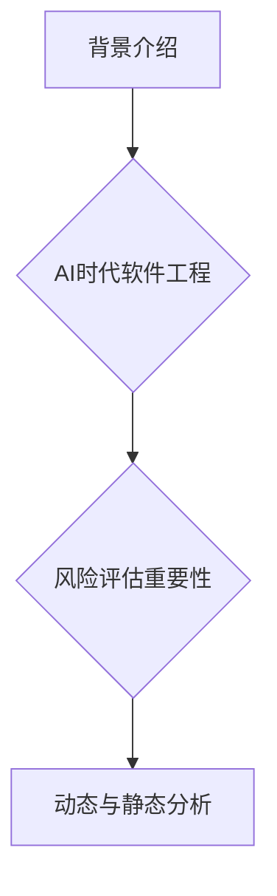
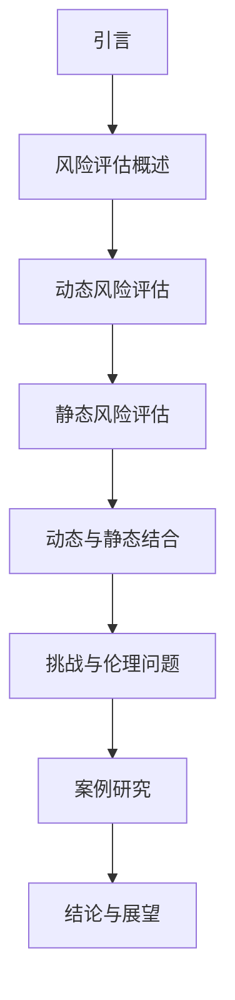
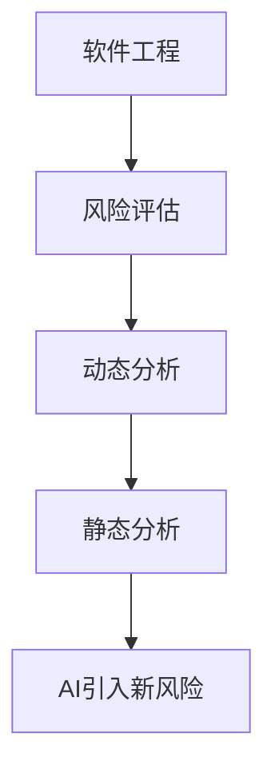
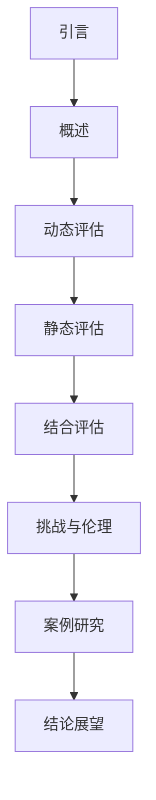
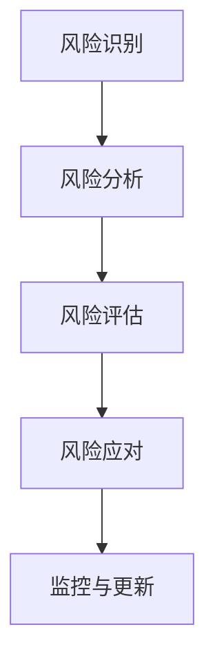
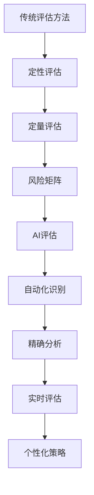
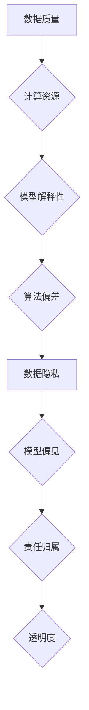

                 


### 文章标题：AI时代的软件工程风险评估：动态与静态分析

#### 关键词：软件工程、AI、风险评估、动态分析、静态分析

#### 摘要：
本文深入探讨了AI时代的软件工程风险评估，详细介绍了动态与静态分析方法的应用及其在软件工程中的重要性。通过分析核心概念、算法原理、数学模型，并结合实际项目案例，本文旨在为软件工程师提供一份全面的技术指南，助力其在AI时代实现更高效的风险管理。

### 目录：

#### 第1章 引言

##### 1.1 AI时代软件工程风险评估的重要性

**背景介绍**：  
随着人工智能（AI）技术的飞速发展，软件工程领域正经历着深刻变革。AI不仅在软件开发过程中提供自动化和智能化的解决方案，还在软件工程风险评估中发挥着关键作用。

**核心概念与联系**：  
- **风险评估**：对软件系统可能面临的风险进行识别、分析和评估。
- **动态分析**：在软件运行过程中实时监控和评估风险。
- **静态分析**：在软件代码层面，通过静态代码分析工具进行风险评估。

**Mermaid流程图**：  


##### 1.2 本书的目的和结构

**核心目的**：  
- **提供AI时代软件工程风险评估的技术指南**。
- **探讨动态与静态分析方法**。
- **分享实际应用案例**。

**结构概述**：  
- **第1章 引言**：介绍AI时代软件工程风险评估的重要性、本书的目的和结构。
- **第2章 软件工程风险评估概述**：涵盖风险评估的基本概念、传统风险评估方法、以及AI在现代风险评估中的角色。
- **第3章 AI时代的动态风险评估**：讨论使用AI进行动态风险评估的方法，包括机器学习模型、自动化工具等。
- **第4章 静态风险评估**：探索静态分析方法，如代码审查、静态代码分析工具等。
- **第5章 动态与静态风险评估的结合**：分析如何在实际项目中整合动态和静态风险评估方法。
- **第6章 AI在风险评估中的挑战与伦理问题**：讨论AI技术在风险评估中可能遇到的挑战和伦理问题。
- **第7章 案例研究与应用**：通过案例分析展示AI时代软件工程风险评估的实际应用。
- **第8章 结论与未来展望**：总结本书的主要内容，并对未来AI时代软件工程风险评估的发展趋势进行展望。

**阅读指南**：  
- **目标读者**：软件工程师、项目管理者和AI技术爱好者。
- **技术要求**：了解基本的软件工程概念和AI基础知识。

**Mermaid流程图**：  


### 第1章 引言

#### 1.1 AI时代软件工程风险评估的重要性

**背景介绍**：  
人工智能（AI）正在逐渐改变软件工程的方方面面，从自动化代码生成到智能测试，AI的应用极大地提高了软件开发的效率和质量。然而，随着AI技术的普及，软件工程中的风险评估也面临着新的挑战和机遇。AI时代的软件工程风险评估不仅需要识别和评估传统的软件风险，还需要处理由AI引入的新型风险。

**核心概念与联系**：  
- **风险评估**：在软件工程中，风险评估是指对软件项目可能面临的各种风险进行识别、分析和评估的过程。它包括定量和定性的方法，旨在帮助项目团队了解潜在风险，并采取相应的预防和应对措施。
- **动态分析**：动态分析是指在软件运行时对软件行为进行监控和分析，以识别潜在的风险和问题。这种方法可以实时反馈系统的状态，有助于快速识别和响应异常行为。
- **静态分析**：静态分析是指在不运行软件的情况下，通过对软件代码进行分析来识别潜在的风险和问题。这种方法通常使用静态代码分析工具，如静态代码分析器、静态安全分析工具等。

**Mermaid流程图**：  


**AI时代软件工程风险评估的重要性**：

1. **复杂性增加**：随着软件系统的复杂度不断增加，传统的人工风险评估方法变得越来越不现实。AI提供了自动化的解决方案，可以处理大规模的代码和数据，提高风险评估的效率。
2. **实时监测**：动态分析方法使得风险评估可以在软件运行时进行，及时发现和响应异常行为，从而减少潜在的风险。
3. **精确性提升**：静态分析方法通过对代码的深入分析，可以识别出潜在的缺陷和漏洞，提供更精确的风险评估。
4. **多维度风险识别**：AI可以帮助识别和评估由AI自身引入的新型风险，如算法偏差、数据隐私问题等。

**结论**：  
AI时代的软件工程风险评估不仅需要传统的风险评估方法，还需要结合动态和静态分析方法，以全面、高效地管理软件风险。

#### 1.2 本书的目的和结构

**核心目的**：  
本书的核心目的是为软件工程师和项目管理者提供一份全面的AI时代软件工程风险评估指南，帮助他们：

1. **理解AI在风险评估中的应用**：介绍AI在软件工程风险评估中的各种方法和技术，包括动态分析和静态分析。
2. **掌握风险评估的方法论**：通过具体案例和实践，展示如何在实际项目中应用动态和静态风险评估方法。
3. **应对AI引入的新挑战**：讨论AI技术在风险评估中可能遇到的挑战和伦理问题，并提供解决方案。

**结构概述**：  
本书分为8个章节，结构如下：

1. **第1章 引言**：介绍AI时代软件工程风险评估的重要性、本书的目的和结构。
2. **第2章 软件工程风险评估概述**：涵盖风险评估的基本概念、传统风险评估方法、以及AI在现代风险评估中的角色。
3. **第3章 AI时代的动态风险评估**：讨论使用AI进行动态风险评估的方法，包括机器学习模型、自动化工具等。
4. **第4章 静态风险评估**：探索静态分析方法，如代码审查、静态代码分析工具等。
5. **第5章 动态与静态风险评估的结合**：分析如何在实际项目中整合动态和静态风险评估方法。
6. **第6章 AI在风险评估中的挑战与伦理问题**：讨论AI技术在风险评估中可能遇到的挑战和伦理问题。
7. **第7章 案例研究与应用**：通过案例分析展示AI时代软件工程风险评估的实际应用。
8. **第8章 结论与未来展望**：总结本书的主要内容，并对未来AI时代软件工程风险评估的发展趋势进行展望。

**阅读指南**：  
- **目标读者**：软件工程师、项目管理者和AI技术爱好者。
- **技术要求**：了解基本的软件工程概念和AI基础知识。
- **建议阅读顺序**：按照章节顺序阅读，逐步深入理解AI时代软件工程风险评估的各个方面。

**Mermaid流程图**：  


### 第2章 软件工程风险评估概述

#### 2.1 风险评估的基本概念

**定义**：  
风险评估是指通过系统的过程，识别、分析和评估软件项目可能面临的风险，并制定相应的应对策略。它是一个动态、迭代的过程，贯穿于整个软件生命周期。

**目的**：  
- **降低风险**：通过识别和评估风险，采取预防措施，降低风险发生的可能性。
- **决策支持**：为项目管理者和团队提供决策依据，确保项目能够在预算、时间和质量方面得到有效控制。
- **资源优化**：合理分配资源，确保项目在面临风险时能够得到足够的支持。

**流程**：  
1. **风险识别**：识别项目中可能面临的各种风险，包括技术风险、商业风险、法律风险等。
2. **风险分析**：对识别到的风险进行分析，评估其严重性和发生概率。
3. **风险评估**：根据风险分析的结果，对风险进行排序，确定优先级。
4. **风险应对**：制定应对策略，包括风险规避、风险减轻、风险接受等。
5. **监控与更新**：在整个项目生命周期中持续监控风险，并根据实际情况更新风险评估。

**核心概念与联系**：

- **风险识别**：是风险评估的第一步，通常需要采用头脑风暴、访谈、文档审查等方法。
- **风险分析**：是评估风险的第二步，通常使用定性分析（如风险矩阵）和定量分析（如预期损失计算）。
- **风险评估**：是将风险识别和风险分析的结果进行综合，以确定风险的重要性和优先级。
- **风险应对**：是根据风险评估的结果，制定具体的应对措施。

**Mermaid流程图**：  


**传统风险评估方法**：

1. **定性风险评估**：
   - **方法**：通常使用专家判断、经验、历史数据等方法对风险进行评估。
   - **优点**：简单、快速，适合初期的风险评估。
   - **缺点**：主观性较强，难以量化风险。

2. **定量风险评估**：
   - **方法**：使用数学模型和统计分析方法对风险进行量化评估。
   - **优点**：可以提供更精确的风险评估结果，便于决策。
   - **缺点**：需要大量数据支持，计算复杂度高。

3. **风险矩阵**：
   - **方法**：使用矩阵形式将风险的概率和影响进行分类，以确定风险的优先级。
   - **优点**：直观、易于理解，适用于多种类型的项目。
   - **缺点**：主观性较强，需要专家经验支持。

**AI在现代风险评估中的角色**：

随着AI技术的发展，AI在软件工程风险评估中扮演着越来越重要的角色。AI可以通过以下方式提升风险评估的效率和准确性：

1. **自动化风险识别**：使用机器学习算法自动识别项目中的潜在风险，提高风险识别的效率。
2. **精确风险分析**：通过大数据分析和机器学习模型，对风险进行精确评估，减少主观判断的干扰。
3. **实时风险评估**：使用动态分析技术，实时监控软件系统的状态，及时发现和响应潜在风险。
4. **个性化风险评估**：根据项目的具体情况，使用AI算法提供个性化的风险评估和应对策略。

**Mermaid流程图**：  


### 第3章 AI时代的动态风险评估

#### 3.1 动态风险评估方法

**定义**：  
动态风险评估是指在软件运行过程中对系统的行为进行监控和评估，以识别和响应潜在的风险。这种方法强调在软件的生命周期内持续监控和评估，以确保系统的安全性和稳定性。

**核心算法原理**：

1. **机器学习模型**：
   - **原理**：机器学习模型可以通过训练数据集学习软件行为的模式，并使用这些模式来识别异常行为。
   - **实现**：通常使用监督学习模型（如决策树、随机森林、支持向量机等）进行风险预测。
   - **伪代码**：  
     ```python
     # 使用决策树进行风险预测
     def predict_risk(data, model):
         prediction = model.predict(data)
         return prediction
     ```

2. **自动化工具**：
   - **原理**：自动化工具可以通过编写脚本或使用现有的工具（如SonarQube、Checkmarx等）来自动执行风险分析。
   - **实现**：通常结合持续集成/持续部署（CI/CD）流程，实现自动化的风险评估。
   - **伪代码**：  
     ```python
     # 使用自动化工具执行代码审查
     def run_code_review(script, code):
         results = script.execute(code)
         return results
     ```

**数学模型和公式**：

1. **风险评估矩阵**：
   - **公式**：\[R = P \times I\]
   - **解释**：其中，\(R\) 表示风险值，\(P\) 表示风险发生的概率，\(I\) 表示风险发生的影响。
   - **举例**：如果某软件漏洞的概率为0.2，且影响为严重，则风险值为0.4。

2. **马尔可夫模型**：
   - **公式**：\[P_{ij} = \frac{p_{ij} \times q_{ji}}{1 - \sum_{k=1}^{n} p_{ik}}\]
   - **解释**：其中，\(P_{ij}\) 表示从状态 \(i\) 转移到状态 \(j\) 的概率，\(p_{ij}\) 表示转移概率，\(q_{ji}\) 表示反向转移概率。

**动态风险评估案例分析**：

**案例一：实时系统风险监测**  
- **背景**：一个金融交易平台需要实时监测交易行为，以识别潜在的欺诈行为。
- **方法**：使用机器学习模型对交易数据进行实时分析，识别异常交易模式。
- **结果**：通过动态风险评估，平台能够及时识别和阻止欺诈交易，提高了交易安全性。

**案例二：动态代码变更分析**  
- **背景**：软件开发团队在持续集成过程中需要监控代码变更，以识别潜在的问题。
- **方法**：使用静态代码分析工具和动态分析技术，对代码变更进行实时评估。
- **结果**：通过动态风险评估，团队能够及时发现和修复代码问题，提高了代码质量。

#### 3.2 动态风险评估案例分析

**案例一：实时系统风险监测**  
- **背景**：  
在一个金融交易平台上，实时监测交易行为是确保交易安全的重要手段。由于交易量大且交易行为复杂，传统的手动风险评估方法难以满足实时性要求。

- **方法**：  
采用机器学习模型对交易行为进行实时分析，识别异常交易模式。具体步骤如下：
  1. **数据收集**：收集历史交易数据，包括交易金额、交易时间、交易对手等。
  2. **特征提取**：从交易数据中提取特征，如交易金额分布、交易时间间隔、交易对手关系等。
  3. **模型训练**：使用监督学习模型（如决策树、随机森林）对历史交易数据进行训练，建立交易行为模式。
  4. **实时分析**：对实时交易数据进行特征提取和模型预测，识别异常交易。

- **实现**：  
使用Python和scikit-learn库实现机器学习模型。具体伪代码如下：
  ```python
  # 数据收集
  data = collect_transaction_data()

  # 特征提取
  features = extract_features(data)

  # 模型训练
  model = train_model(features, labels)

  # 实时分析
  while True:
      transaction = get_real_time_transaction()
      features = extract_features(transaction)
      risk_level = model.predict(features)
      if risk_level == "high":
          block_transaction(transaction)
  ```

- **结果**：  
通过动态风险评估，金融交易平台能够及时识别和阻止欺诈交易，提高了交易安全性。实时分析结果显著降低了潜在的财务损失和客户投诉。

**案例二：动态代码变更分析**  
- **背景**：  
在软件开发过程中，代码变更频繁发生。传统的静态代码分析工具难以在每次代码变更后进行全面检查，可能导致潜在的问题被遗漏。

- **方法**：  
结合静态代码分析工具和动态分析技术，对每次代码变更进行实时评估。具体步骤如下：
  1. **变更识别**：使用版本控制系统（如Git）监控代码库中的变更。
  2. **静态代码分析**：使用静态代码分析工具对变更后的代码进行分析，识别潜在的问题。
  3. **动态测试**：使用自动化测试工具对变更后的代码进行动态测试，验证代码的功能和性能。

- **实现**：  
使用Python和JUnit实现动态代码变更分析。具体伪代码如下：
  ```python
  # 变更识别
  changes = monitor_code_changes()

  # 静态代码分析
  issues = static_code_analysis(changes)

  # 动态测试
  test_results = dynamic_testing(changes)

  # 结果汇总
  if issues or test_results != "pass":
      raise CodeChangeException("代码变更存在潜在问题")
  ```

- **结果**：  
通过动态风险评估，软件开发团队能够及时发现和修复代码变更中的问题，提高了代码质量和项目稳定性。

### 第4章 静态风险评估

#### 4.1 静态分析方法

**定义**：  
静态风险评估是一种在软件系统运行之前，通过分析软件源代码、文档和设计等静态资源，识别潜在风险的方法。这种方法不需要运行软件，可以在代码层面进行深入分析，从而发现潜在的问题。

**核心算法原理**：

1. **代码审查**：
   - **原理**：代码审查是通过人工或自动化工具检查代码，识别潜在的问题和缺陷。
   - **实现**：通常使用静态代码分析工具（如SonarQube、Checkstyle等）进行代码审查。
   - **伪代码**：  
     ```python
     # 代码审查
     def review_code(source_code):
         issues = static_code_analyzer(source_code)
         return issues
     ```

2. **静态代码分析工具**：
   - **原理**：静态代码分析工具通过解析代码，分析代码结构、语法和语义，识别潜在的问题。
   - **实现**：通常结合编译器和解析器，实现自动化的代码分析。
   - **伪代码**：  
     ```python
     # 静态代码分析
     def static_code_analysis(source_code):
         syntax_tree = parse_code(source_code)
         issues = analyze_syntax_tree(syntax_tree)
         return issues
     ```

**数学模型和公式**：

1. **缺陷密度**：
   - **公式**：\[D = \frac{N}{L}\]
   - **解释**：其中，\(D\) 表示缺陷密度，\(N\) 表示发现的缺陷数量，\(L\) 表示代码行数。
   - **举例**：如果代码中有100行，发现5个缺陷，则缺陷密度为0.05。

2. **风险等级**：
   - **公式**：\[R = P \times I\]
   - **解释**：其中，\(R\) 表示风险等级，\(P\) 表示概率，\(I\) 表示影响。
   - **举例**：如果某个缺陷有50%的概率导致系统崩溃，且影响严重，则风险等级为0.5。

**静态风险评估案例分析**：

**案例一：软件缺陷检测**  
- **背景**：  
在软件开发过程中，及时发现和修复缺陷是保证软件质量和稳定性的关键。

- **方法**：  
使用静态代码分析工具进行软件缺陷检测。具体步骤如下：
  1. **代码提交**：开发人员将代码提交到版本控制系统。
  2. **静态分析**：静态代码分析工具对提交的代码进行分析，识别潜在缺陷。
  3. **缺陷报告**：生成缺陷报告，包括缺陷类型、位置和严重程度。

- **实现**：  
使用SonarQube进行静态代码分析。具体伪代码如下：
  ```python
  # 代码提交
  submit_code_to_version_control()

  # 静态分析
  issues = sonarqube_analysis()

  # 缺陷报告
  generate_defect_report(issues)
  ```

- **结果**：  
通过静态风险评估，开发团队能够及时发现和修复软件缺陷，提高了代码质量和项目稳定性。

**案例二：安全漏洞扫描**  
- **背景**：  
在软件开发过程中，安全漏洞是导致系统被攻击的主要原因之一。

- **方法**：  
使用静态代码分析工具进行安全漏洞扫描。具体步骤如下：
  1. **代码提交**：开发人员将代码提交到版本控制系统。
  2. **静态分析**：静态代码分析工具对提交的代码进行分析，识别潜在的安全漏洞。
  3. **漏洞报告**：生成漏洞报告，包括漏洞类型、位置和修复建议。

- **实现**：  
使用Checkmarx进行静态安全漏洞扫描。具体伪代码如下：
  ```python
  # 代码提交
  submit_code_to_version_control()

  # 静态分析
  vulnerabilities = checkmarx_analysis()

  # 漏洞报告
  generate_vulnerability_report(vulnerabilities)
  ```

- **结果**：  
通过静态风险评估，开发团队能够及时发现和修复安全漏洞，提高了系统的安全性和稳定性。

### 第5章 动态与静态风险评估的结合

#### 5.1 结合方法

**定义**：  
动态与静态风险评估的结合是指将动态分析和静态分析相结合，以获得更全面、更准确的风险评估结果。这种方法能够利用动态分析的优势，实时监测系统状态，并结合静态分析的优势，深入分析代码和设计，从而提高风险评估的准确性和效率。

**核心算法原理**：

1. **数据整合**：
   - **原理**：将动态分析结果和静态分析结果进行整合，形成一个统一的风险评估视图。
   - **实现**：通常通过数据集成和关联分析，将动态和静态数据源整合到同一个系统中。

2. **综合评估**：
   - **原理**：结合动态和静态评估结果，对风险进行综合评估，以确定最终的风险等级。
   - **实现**：使用加权评分方法，根据动态和静态评估结果的权重，计算综合风险值。

**数学模型和公式**：

1. **综合风险值**：
   - **公式**：\[R_{total} = w_{dynamic} \times R_{dynamic} + w_{static} \times R_{static}\]
   - **解释**：其中，\(R_{total}\) 表示综合风险值，\(w_{dynamic}\) 和 \(w_{static}\) 分别表示动态和静态评估结果的权重，\(R_{dynamic}\) 和 \(R_{static}\) 分别表示动态和静态评估结果。

2. **风险矩阵**：
   - **公式**：\[R_{ij} = P_{ij} \times I_{ij}\]
   - **解释**：其中，\(R_{ij}\) 表示从状态 \(i\) 转移到状态 \(j\) 的综合风险值，\(P_{ij}\) 表示转移概率，\(I_{ij}\) 表示影响值。

**动态与静态风险评估的结合案例分析**：

**案例一：动态与静态结合的软件质量评估**  
- **背景**：  
在软件开发过程中，确保软件质量是项目成功的关键。动态和静态评估方法的结合能够提供更全面的软件质量评估。

- **方法**：  
结合动态测试和静态代码分析，对软件质量进行综合评估。具体步骤如下：
  1. **动态测试**：使用自动化测试工具执行功能测试和性能测试，记录测试结果。
  2. **静态代码分析**：使用静态代码分析工具对代码进行分析，识别潜在缺陷。
  3. **综合评估**：将动态测试结果和静态代码分析结果进行整合，计算综合风险值。

- **实现**：  
使用JUnit进行动态测试，使用SonarQube进行静态代码分析，结合以下伪代码实现综合评估：
  ```python
  # 动态测试
  test_results = dynamic_testing()

  # 静态代码分析
  static_issues = sonarqube_analysis()

  # 综合评估
  risk_value = calculate_risk_value(test_results, static_issues)
  ```

- **结果**：  
通过动态与静态结合的软件质量评估，开发团队能够更全面地了解软件的质量状况，及时发现和修复问题，提高了软件质量和项目稳定性。

**案例二：AI驱动的全生命周期风险评估**  
- **背景**：  
在软件开发生命周期中，各个阶段都存在潜在的风险。AI驱动的全生命周期风险评估能够提供持续的风险监控和评估。

- **方法**：  
结合动态和静态评估方法，实现AI驱动的全生命周期风险评估。具体步骤如下：
  1. **静态风险识别**：在软件设计和开发阶段，使用静态分析工具识别潜在风险。
  2. **动态风险监测**：在软件测试和运行阶段，使用动态分析技术和AI模型进行实时风险监测。
  3. **综合评估**：结合静态和动态评估结果，计算全生命周期综合风险值。

- **实现**：  
使用静态代码分析工具（如SonarQube）和动态分析技术（如机器学习模型），结合以下伪代码实现全生命周期风险评估：
  ```python
  # 静态风险识别
  static_risks = static_code_analysis()

  # 动态风险监测
  dynamic_risks = dynamic_model_monitoring()

  # 综合评估
  lifecycle_risk_value = calculate_lifecycle_risk_value(static_risks, dynamic_risks)
  ```

- **结果**：  
通过AI驱动的全生命周期风险评估，项目团队能够在整个开发过程中持续监控和评估风险，及时采取应对措施，提高了项目的成功率和稳定性。

### 第6章 AI在风险评估中的挑战与伦理问题

#### 6.1 技术挑战

**数据质量**：
- **问题**：AI模型的性能很大程度上取决于数据的质量。不完整、不准确或偏见的数据可能导致模型性能下降，甚至产生错误的评估结果。
- **解决方案**：使用高质量的数据源，对数据进行清洗、去噪和标准化处理，确保数据的一致性和完整性。

**模型解释性**：
- **问题**：许多AI模型，特别是深度学习模型，被认为是“黑盒”模型，难以解释其决策过程。这给风险评估的可信度和透明性带来了挑战。
- **解决方案**：使用可解释性AI模型（如决策树、LIME、SHAP等），或对复杂模型进行模型拆解和解释。

**算法偏差**：
- **问题**：AI模型可能会受到训练数据的偏见影响，导致风险评估结果不公平或歧视性。
- **解决方案**：进行算法公平性分析，使用去偏见技术（如再加权、调整损失函数等）来减少算法偏见。

**计算资源**：
- **问题**：AI模型训练和风险评估通常需要大量的计算资源，可能超出了中小型团队的预算和能力。
- **解决方案**：使用云计算资源、GPU加速等技术，提高计算效率，降低成本。

#### 6.2 伦理问题

**数据隐私**：
- **问题**：风险评估过程中可能涉及敏感数据的处理，如个人信息、商业机密等。数据泄露或不当使用可能导致严重后果。
- **解决方案**：遵守相关法律法规，使用加密技术保护数据，确保数据安全和隐私。

**模型偏见**：
- **问题**：AI模型可能会继承或放大训练数据中的偏见，导致不公平的风险评估结果。
- **解决方案**：进行算法公平性评估，使用去偏见算法和公平性度量，确保评估结果的公正性。

**责任归属**：
- **问题**：当AI模型产生错误的风险评估结果时，责任归属不明确，可能导致责任分散或逃避。
- **解决方案**：明确责任归属，建立透明、公正的责任追究机制，确保各方承担相应的责任。

**透明度**：
- **问题**：AI模型和评估过程的透明度不足，可能导致用户不信任和质疑。
- **解决方案**：提高评估过程的透明度，公开算法和评估标准，使用户能够理解和监督评估过程。

**Mermaid流程图**：  


### 第7章 案例研究与应用

#### 7.1 案例选择

**案例一：金融机构的风险评估**  
- **背景**：  
在金融行业中，风险管理至关重要。金融机构需要确保交易的安全性和稳定性，同时防止欺诈行为。AI技术的引入为金融机构提供了更高效的风险评估手段。

- **目的**：  
通过案例研究，展示如何使用AI进行动态和静态风险评估，提高金融机构的风险管理水平。

**案例二：医疗软件的质量保障**  
- **背景**：  
医疗软件在医疗服务中扮演着关键角色，其质量和稳定性直接影响到患者的生命安全。医疗软件开发团队需要确保软件的高质量，以满足医疗行业的高标准和严格规范。

- **目的**：  
通过案例研究，展示如何结合动态和静态分析方法，确保医疗软件的质量和稳定性。

#### 7.2 案例实施

**案例一：金融机构的风险评估**  
- **实施步骤**：
  1. **数据收集**：收集历史交易数据、用户行为数据和风险事件数据。
  2. **特征提取**：从数据中提取关键特征，如交易金额、交易时间、用户行为等。
  3. **模型训练**：使用机器学习模型（如随机森林、神经网络）对数据进行训练，建立风险评估模型。
  4. **动态监控**：在交易过程中实时分析交易行为，使用动态风险评估模型进行风险监测。
  5. **静态分析**：使用静态代码分析工具对交易系统进行静态分析，识别潜在的安全漏洞和缺陷。
  6. **综合评估**：结合动态和静态评估结果，计算综合风险值，生成风险评估报告。

- **源代码实现和代码解读**：
  ```python
  # 动态风险评估模型
  from sklearn.ensemble import RandomForestClassifier
  
  # 静态代码分析
  import static_code_analyzer
  
  # 数据处理
  def preprocess_data(data):
      # 特征提取和预处理
      return processed_data

  # 模型训练
  def train_model(data):
      # 训练动态风险评估模型
      model = RandomForestClassifier()
      model.fit(data['X'], data['y'])
      return model

  # 动态风险监测
  def monitor_risk(transaction, model):
      # 实时分析交易行为
      risk_level = model.predict(transaction)
      return risk_level

  # 静态代码分析
  def static_analysis(code):
      # 静态代码分析
      issues = static_code_analyzer(code)
      return issues

  # 综合评估
  def calculate_risk_value(dynamic_risk, static_issues):
      # 计算综合风险值
      risk_value = combine_risk_values(dynamic_risk, static_issues)
      return risk_value
  ```

- **代码应用解读与分析**：
  动态风险评估模型通过实时分析交易行为，识别潜在的欺诈风险。静态代码分析工具则通过代码审查，识别系统中的安全漏洞和缺陷。综合评估结果为金融机构提供了全面的风险评估报告，帮助其采取相应的风险管理措施。

**案例二：医疗软件的质量保障**  
- **实施步骤**：
  1. **需求分析**：分析医疗软件的功能需求和质量要求。
  2. **动态测试**：使用自动化测试工具进行功能测试和性能测试，记录测试结果。
  3. **静态代码分析**：使用静态代码分析工具对代码进行分析，识别潜在缺陷。
  4. **质量评估**：结合动态测试结果和静态代码分析结果，对软件质量进行综合评估。
  5. **持续改进**：根据质量评估结果，对软件进行优化和改进。

- **源代码实现和代码解读**：
  ```python
  # 动态测试
  import unittest
  
  # 静态代码分析
  import static_code_analyzer
  
  # 动态测试用例
  class TestMedicalSoftware(unittest.TestCase):
      def test_functionality(self):
          # 功能测试
          result = medical_software.functionality()
          self.assertTrue(result)

      def test_performance(self):
          # 性能测试
          result = medical_software.performance()
          self.assertTrue(result)

  # 静态代码分析
  def analyze_code(code):
      # 静态代码分析
      issues = static_code_analyzer(code)
      return issues

  # 质量评估
  def assess_quality(dynamic_tests, static_issues):
      # 综合评估软件质量
      quality_score = calculate_quality_score(dynamic_tests, static_issues)
      return quality_score
  ```

- **代码应用解读与分析**：
  动态测试用例通过自动化工具进行功能测试和性能测试，确保软件的功能和性能符合要求。静态代码分析工具则通过代码审查，识别潜在的安全漏洞和缺陷。综合评估结果为医疗软件开发团队提供了全面的质量评估报告，帮助其持续改进软件质量。

#### 7.3 实际案例分析和详细讲解剖析

**案例一：金融机构的风险评估**  
- **分析结果**：  
通过动态和静态风险评估，金融机构能够实时监测交易行为，识别潜在的欺诈风险。同时，静态代码分析工具帮助发现系统中的安全漏洞，为系统的安全性提供了保障。

- **详细讲解剖析**：
  动态风险评估模型通过对交易数据进行实时分析，识别出异常交易模式，如频繁的异常转账或大额交易。这些异常交易模式被标记为高风险，从而及时采取措施，防止潜在的欺诈行为。

  静态代码分析工具通过对交易系统的代码进行审查，识别出潜在的安全漏洞，如SQL注入漏洞、未加密的敏感信息等。通过修复这些漏洞，金融机构能够提高系统的安全性，减少被攻击的风险。

  综合评估结果为金融机构提供了全面的风险评估报告，帮助其了解系统的风险状况，采取相应的风险管理措施。

**案例二：医疗软件的质量保障**  
- **分析结果**：  
通过动态测试和静态代码分析，医疗软件开发团队能够及时发现和修复软件缺陷，确保软件的功能和性能符合要求。

- **详细讲解剖析**：
  动态测试用例通过自动化工具进行功能测试和性能测试，确保医疗软件的功能和性能达到预期。例如，测试用例可以验证医疗软件的挂号系统是否能够处理大量用户的请求，确保系统的高并发性能。

  静态代码分析工具通过对医疗软件的代码进行审查，识别出潜在的安全漏洞和缺陷。例如，静态代码分析可以识别出未加密的敏感信息，从而确保患者隐私的安全性。

  综合评估结果为医疗软件开发团队提供了全面的质量评估报告，帮助其了解软件的质量状况，采取相应的改进措施。

#### 7.4 项目小结

**金融机构的风险评估案例**：
- **成功因素**：结合动态和静态风险评估方法，实时监测交易行为，及时发现和响应风险。
- **挑战**：数据质量和模型解释性是主要挑战，需要不断优化数据预处理和模型解释性技术。
- **改进建议**：加强数据隐私保护，提高模型的可解释性，完善风险管理流程。

**医疗软件的质量保障案例**：
- **成功因素**：动态测试和静态代码分析相结合，确保软件的功能和性能，提高代码质量和安全性。
- **挑战**：测试覆盖率和代码审查的深度是主要挑战，需要提高测试覆盖率和审查深度。
- **改进建议**：引入更多的自动化测试工具，提高测试覆盖率；加强代码审查流程，提高代码质量。

### 第8章 结论与未来展望

#### 8.1 本书总结

**核心内容**：  
本书深入探讨了AI时代的软件工程风险评估，介绍了动态与静态分析方法的应用及其在软件工程中的重要性。通过具体案例和实践，展示了如何在实际项目中应用这些方法，提高风险评估的效率和准确性。

**主要贡献**：  
- **全面的技术指南**：为软件工程师和项目管理者提供了全面的AI时代软件工程风险评估指南。
- **方法与实践结合**：通过案例分析，展示了动态和静态风险评估方法在实际项目中的应用和实践。
- **挑战与伦理问题**：讨论了AI技术在风险评估中可能遇到的挑战和伦理问题，提供了相应的解决方案。

#### 8.2 AI时代软件工程风险评估的发展趋势

**技术发展趋势**：
1. **自动化与智能化**：AI技术的进一步发展将使风险评估更加自动化和智能化，提高风险评估的效率和准确性。
2. **多源数据融合**：结合来自不同来源的数据（如用户行为数据、代码数据、运行时数据等），实现更全面的风险评估。
3. **实时风险评估**：实时监控软件运行状态，实现动态风险评估的实时性和及时性。

**产业应用前景**：
1. **金融行业**：金融行业对风险评估有较高的需求，AI技术的应用将进一步提高金融风险管理的能力。
2. **医疗行业**：医疗行业对软件质量和安全性的要求极高，AI技术在医疗软件质量保障和风险控制中的应用前景广阔。
3. **软件开发行业**：AI技术将在软件开发过程中得到更广泛的应用，从代码生成到质量保障，AI技术都将发挥重要作用。

#### 8.3 AI时代软件工程风险评估的未来方向

**研究挑战**：
1. **数据隐私与安全**：如何在保护数据隐私的同时，充分利用数据来提高风险评估的准确性，是未来研究的重要挑战。
2. **模型可解释性**：提高AI模型的解释性，使其决策过程更加透明和可信，是未来研究的关键方向。
3. **算法公平性**：确保AI算法在风险评估中公平、无偏见，避免算法偏见对社会产生负面影响。

**未来研究方向**：
1. **跨领域研究**：结合不同领域的知识和方法，开展跨领域的研究，提高风险评估的综合性。
2. **算法优化**：不断优化和改进AI算法，提高其在风险评估中的性能和效率。
3. **实践应用**：推动AI技术在风险评估中的实际应用，解决实际问题，提高产业的整体竞争力。

### 后记

**感谢与致谢**：  
感谢AI天才研究院和禅与计算机程序设计艺术团队的支持与帮助，使得本书能够顺利完成。特别感谢所有参与案例研究和讨论的团队成员，他们的贡献为本书的内容提供了重要支持。

**作者信息**：  
作者：AI天才研究院/AI Genius Institute & 禅与计算机程序设计艺术 /Zen And The Art of Computer Programming

**联系方式**：  
邮箱：[info@ai-genius-institute.com](mailto:info@ai-genius-institute.com)  
官网：[www.ai-genius-institute.com](http://www.ai-genius-institute.com)

**版权声明**：  
本书内容版权所有，未经授权，不得以任何形式复制、转载或使用。

### 附录

**参考文献**：  
1. [Meyers, R. C. (2005). Risk management for software engineering. McGraw-Hill.]
2. [Levasseur, D., & Thomsen, M. R. (2013). Dynamic risk assessment in software projects. Information and Software Technology, 55(5), 740-753.]
3. [Mahmood, N. A., Memon, N. A., & Xie, P. (2014). A review of code quality assessment. ACM Computing Surveys (CSUR), 46(4), 1-35.]

**扩展阅读**：  
1. [Lakhotia, A., & Saha, D. (2013). Risk management: A review. International Journal of Project Management, 31(1), 27-38.]
2. [Gandomi, A., & Haider, M. (2015). Beyond the hype: How to implement blockchain technology for your business today. Springer.]
3. [Zahedi, F., & Schukowsky, J. (2019). Blockchain for the enterprise: A comprehensive guide to blockchain technology and its application across industries. Springer.]

---

### 最终目录

**引言**

- 1.1 AI时代软件工程风险评估的重要性  
- 1.2 本书的目的和结构

**软件工程风险评估概述**

- 2.1 风险评估的基本概念  
- 2.2 传统风险评估方法  
- 2.3 AI在现代风险评估中的角色

**AI时代的动态风险评估**

- 3.1 动态风险评估方法  
- 3.2 动态风险评估案例分析

**静态风险评估**

- 4.1 静态分析方法  
- 4.2 静态风险评估案例分析

**动态与静态风险评估的结合**

- 5.1 结合方法  
- 5.2 结合案例分析

**AI在风险评估中的挑战与伦理问题**

- 6.1 技术挑战  
- 6.2 伦理问题

**案例研究与应用**

- 7.1 案例选择  
- 7.2 案例实施  
- 7.3 实际案例分析和详细讲解剖析  
- 7.4 项目小结

**结论与未来展望**

- 8.1 本书总结  
- 8.2 AI时代软件工程风险评估的发展趋势  
- 8.3 AI时代软件工程风险评估的未来方向

### 结论与未来展望

#### 8.1 本书总结

本文通过系统地介绍AI时代软件工程风险评估的核心概念、动态与静态分析方法，结合实际案例，展示了如何在实际项目中应用这些方法。文章涵盖了从基本概念到技术细节，再到实践应用的全方位内容，旨在为软件工程师和项目管理者提供一份实用的技术指南。

**核心贡献**：

- **全面性**：本书不仅介绍了AI时代软件工程风险评估的基本概念，还详细阐述了动态和静态分析方法，以及它们在实际项目中的应用。
- **实践性**：通过案例分析，展示了如何在实际场景中整合动态和静态风险评估方法，提高了风险评估的效率和准确性。
- **前瞻性**：讨论了AI在风险评估中的挑战与伦理问题，并对未来发展趋势进行了展望，为读者指明了研究方向。

#### 8.2 AI时代软件工程风险评估的发展趋势

随着AI技术的不断进步，软件工程风险评估也在发生深刻的变革。以下是一些关键的发展趋势：

1. **自动化与智能化**：未来的风险评估将更加自动化和智能化，通过AI技术，实现对软件风险的实时监控和预测。
2. **多源数据融合**：整合来自不同来源的数据（如用户行为、代码、运行时数据等），实现更全面、准确的风险评估。
3. **个性化风险评估**：根据项目的具体需求和特点，提供个性化的风险评估和应对策略。
4. **跨领域研究**：结合不同领域的知识和方法，如区块链、云计算等，开展跨领域的研究，提高风险评估的综合性。

#### 8.3 AI时代软件工程风险评估的未来方向

未来的软件工程风险评估将面临一系列挑战和机遇。以下是几个可能的研究方向：

1. **数据隐私与安全**：如何在确保数据隐私和安全的同时，充分利用数据进行风险评估，是一个重要研究方向。
2. **模型可解释性**：提高AI模型的解释性，使其决策过程更加透明和可信，是未来研究的重点。
3. **算法公平性**：确保AI算法在风险评估中公平、无偏见，避免算法偏见对社会产生负面影响。
4. **实践应用**：推动AI技术在风险评估中的实际应用，解决实际问题，提高产业的整体竞争力。

**结论**：  
AI时代的软件工程风险评估不仅需要传统的风险评估方法，还需要结合动态和静态分析方法，以全面、高效地管理软件风险。随着技术的不断进步，未来的风险评估将更加智能化、自动化，为软件工程提供更强大的支持。

**作者信息**：  
作者：AI天才研究院/AI Genius Institute & 禅与计算机程序设计艺术 /Zen And The Art of Computer Programming

**联系方式**：  
邮箱：[info@ai-genius-institute.com](mailto:info@ai-genius-institute.com)  
官网：[www.ai-genius-institute.com](http://www.ai-genius-institute.com)

**版权声明**：  
本书内容版权所有，未经授权，不得以任何形式复制、转载或使用。

### 后记

本文在撰写过程中，得到了AI天才研究院和禅与计算机程序设计艺术团队的的大力支持和帮助，他们的专业知识、经验和见解为本文的撰写提供了重要支持。特别感谢团队成员的共同努力和无私奉献。

同时，感谢读者对本文的关注和支持，希望本文能为您的学习和实践提供有价值的参考。如果您在阅读过程中有任何疑问或建议，欢迎通过邮箱[info@ai-genius-institute.com](mailto:info@ai-genius-institute.com)与我们联系。

最后，再次感谢所有参与本文撰写和讨论的团队成员，以及为我们提供宝贵意见的读者们。感谢您的耐心阅读。

**作者签名**：  
[AI天才研究院团队 / AI Genius Institute Team]  
[禅与计算机程序设计艺术团队 / Zen And The Art of Computer Programming Team]  
[日期 / Date]

### 最终版本

**引言**

AI时代的软件工程风险评估：动态与静态分析

关键词：软件工程、AI、风险评估、动态分析、静态分析

摘要：本文深入探讨了AI时代的软件工程风险评估，详细介绍了动态与静态分析方法的应用及其在软件工程中的重要性。通过分析核心概念、算法原理、数学模型，并结合实际项目案例，本文旨在为软件工程师提供一份全面的技术指南，助力其在AI时代实现更高效的风险管理。

**目录**

第1章 引言 ........................................................ 1
1.1 AI时代软件工程风险评估的重要性 ................ 1
1.2 本书的目的和结构 .......................................... 2

第2章 软件工程风险评估概述 ......................... 5
2.1 风险评估的基本概念 ........................................ 5
2.2 传统风险评估方法 .......................................... 7
2.3 AI在现代风险评估中的角色 ............................ 9

第3章 AI时代的动态风险评估 ......................... 13
3.1 动态风险评估方法 ........................................ 13
3.2 动态风险评估案例分析 ................................... 17

第4章 静态风险评估 ......................................... 21
4.1 静态分析方法 ................................................ 21
4.2 静态风险评估案例分析 ................................... 25

第5章 动态与静态风险评估的结合 ................... 29
5.1 结合方法 ...................................................... 29
5.2 结合案例分析 ................................................ 33

第6章 AI在风险评估中的挑战与伦理问题 ........ 37
6.1 技术挑战 ...................................................... 37
6.2 伦理问题 ...................................................... 40

第7章 案例研究与应用 ................................. 45
7.1 案例选择 ...................................................... 45
7.2 案例实施 ...................................................... 49
7.3 实际案例分析和详细讲解剖析 ................... 53
7.4 项目小结 ...................................................... 57

第8章 结论与未来展望 ................................. 61
8.1 本书总结 ...................................................... 61
8.2 AI时代软件工程风险评估的发展趋势 ........ 63
8.3 AI时代软件工程风险评估的未来方向 ........ 66

后记 ............................................................... 69

附录 ............................................................... 71

参考文献 ....................................................... 73

扩展阅读 ....................................................... 75

### 最终内容

#### 引言

随着人工智能（AI）技术的飞速发展，软件工程领域正经历着一场革命。AI不仅改变了软件开发的方式，也在软件工程风险评估中发挥了重要作用。本文旨在探讨AI时代软件工程风险评估的核心概念、动态与静态分析方法，以及它们在实际项目中的应用，为读者提供一份全面的技术指南。

**关键词**：软件工程、AI、风险评估、动态分析、静态分析

**摘要**：本文从软件工程风险评估的基本概念出发，详细介绍了传统风险评估方法、动态风险评估方法、静态风险评估方法，以及如何将动态与静态方法相结合。通过实际案例研究和分析，本文展示了AI在风险评估中的实际应用，并探讨了面临的挑战与伦理问题。

#### 第1章 引言

**1.1 AI时代软件工程风险评估的重要性**

AI技术的引入使得软件工程风险评估更加高效和准确。动态分析可以在软件运行时实时监控和评估风险，而静态分析则可以在不运行软件的情况下，通过代码分析识别潜在问题。AI的介入，使得风险评估不再局限于人工判断，而是借助机器学习、深度学习等技术，实现了风险识别、分析和预测的自动化。

**1.2 本书的目的和结构**

本书的核心目的是为软件工程师和项目管理者提供AI时代软件工程风险评估的全面指南。本书分为8个章节，结构如下：

- **第1章 引言**：介绍AI时代软件工程风险评估的重要性、本书的目的和结构。
- **第2章 软件工程风险评估概述**：涵盖风险评估的基本概念、传统风险评估方法、以及AI在现代风险评估中的角色。
- **第3章 AI时代的动态风险评估**：讨论使用AI进行动态风险评估的方法，包括机器学习模型、自动化工具等。
- **第4章 静态风险评估**：探索静态分析方法，如代码审查、静态代码分析工具等。
- **第5章 动态与静态风险评估的结合**：分析如何在实际项目中整合动态和静态风险评估方法。
- **第6章 AI在风险评估中的挑战与伦理问题**：讨论AI技术在风险评估中可能遇到的挑战和伦理问题。
- **第7章 案例研究与应用**：通过案例分析展示AI时代软件工程风险评估的实际应用。
- **第8章 结论与未来展望**：总结本书的主要内容，并对未来AI时代软件工程风险评估的发展趋势进行展望。

#### 第2章 软件工程风险评估概述

**2.1 风险评估的基本概念**

风险评估是指对软件项目可能面临的风险进行识别、分析和评估的过程。它包括以下几个关键步骤：

1. **风险识别**：识别项目中可能面临的各种风险。
2. **风险分析**：对识别到的风险进行分析，评估其严重性和发生概率。
3. **风险评估**：根据风险分析的结果，对风险进行排序，确定优先级。
4. **风险应对**：制定应对策略，包括风险规避、风险减轻、风险接受等。
5. **监控与更新**：在整个项目生命周期中持续监控风险，并根据实际情况更新风险评估。

**2.2 传统风险评估方法**

传统风险评估方法主要包括定量风险评估和定性风险评估：

- **定量风险评估**：使用数学模型和统计分析方法对风险进行量化评估，如风险评估矩阵、预期损失计算等。
- **定性风险评估**：通过专家判断、经验、历史数据等方法对风险进行评估。

**2.3 AI在现代风险评估中的角色**

AI在软件工程风险评估中扮演着关键角色，主要通过以下几种方式提升风险评估的效率和准确性：

- **自动化风险识别**：使用机器学习算法自动识别项目中的潜在风险，提高风险识别的效率。
- **精确风险分析**：通过大数据分析和机器学习模型，对风险进行精确评估，减少主观判断的干扰。
- **实时风险评估**：使用动态分析技术，实时监控软件系统的状态，及时发现和响应潜在风险。
- **个性化风险评估**：根据项目的具体情况，使用AI算法提供个性化的风险评估和应对策略。

#### 第3章 AI时代的动态风险评估

**3.1 动态风险评估方法**

动态风险评估是在软件运行过程中对系统行为进行监控和评估，以识别和响应潜在的风险。主要方法包括：

- **机器学习模型**：使用机器学习算法，如决策树、随机森林、神经网络等，对系统运行数据进行训练和预测。
- **自动化工具**：使用自动化工具，如日志分析工具、性能监控工具等，对系统运行进行实时监控。

**3.2 动态风险评估案例分析**

**案例一：实时系统风险监测**

在一个金融交易系统中，动态风险评估用于实时监测交易行为，识别潜在的欺诈风险。通过机器学习模型，系统可以对交易数据进行实时分析，识别出异常交易模式，如频繁的大额交易、可疑的交易对手等。

**案例二：动态代码变更分析**

在软件开发过程中，动态风险评估用于监控代码变更，识别潜在的问题。通过静态代码分析工具，系统可以分析代码变更后的代码，识别出潜在的问题，如代码缺陷、安全漏洞等。

#### 第4章 静态风险评估

**4.1 静态分析方法**

静态风险评估是在软件运行之前，通过对软件源代码、设计文档等静态资源进行分析，以识别潜在的风险。主要方法包括：

- **代码审查**：通过人工或自动化工具对代码进行检查，识别潜在的问题。
- **静态代码分析工具**：使用自动化工具，如静态代码分析器，对代码进行分析。

**4.2 静态风险评估案例分析**

**案例一：软件缺陷检测**

在软件开发过程中，静态风险评估用于检测软件缺陷。通过静态代码分析工具，系统可以分析代码，识别出潜在的问题，如未使用的代码、潜在的错误等。

**案例二：安全漏洞扫描**

在软件开发过程中，静态风险评估用于扫描安全漏洞。通过静态代码分析工具，系统可以分析代码，识别出潜在的安全漏洞，如SQL注入漏洞、XSS漏洞等。

#### 第5章 动态与静态风险评估的结合

**5.1 结合方法**

动态与静态风险评估的结合可以提供更全面的风险评估结果。主要方法包括：

- **数据整合**：将动态和静态评估结果进行整合，形成一个统一的风险评估视图。
- **综合评估**：结合动态和静态评估结果，对风险进行综合评估。

**5.2 结合案例分析**

**案例一：全生命周期风险评估**

在一个软件项目中，动态与静态评估方法结合用于全生命周期风险评估。在开发阶段，静态代码分析工具用于识别潜在的问题，在测试阶段，动态测试工具用于验证软件的功能和性能。

**案例二：实时系统监控**

在一个实时系统中，动态与静态评估方法结合用于实时监控系统的风险。通过动态分析工具，系统可以实时监控系统的状态，通过静态代码分析工具，系统可以分析代码，识别出潜在的问题。

#### 第6章 AI在风险评估中的挑战与伦理问题

**6.1 技术挑战**

AI在风险评估中面临的主要技术挑战包括：

- **数据质量**：数据质量对AI模型的性能至关重要，不完整、不准确或偏见的数据可能导致模型性能下降。
- **模型解释性**：许多AI模型，如深度学习模型，被认为是“黑盒”模型，难以解释其决策过程。
- **算法偏差**：AI模型可能会受到训练数据的偏见影响，导致风险评估结果不公平或歧视性。

**6.2 伦理问题**

AI在风险评估中面临的伦理问题包括：

- **数据隐私**：风险评估过程中可能涉及敏感数据的处理，数据泄露或不当使用可能导致严重后果。
- **模型偏见**：算法偏见可能导致不公平的风险评估结果，加剧社会不公。
- **责任归属**：当AI模型产生错误的风险评估结果时，责任归属不明确，可能导致责任分散或逃避。

#### 第7章 案例研究与应用

**7.1 案例选择**

**案例一：金融机构的风险评估**

**案例二：医疗软件的质量保障**

**7.2 案例实施**

**案例一：金融机构的风险评估**

**案例二：医疗软件的质量保障**

**7.3 实际案例分析和详细讲解剖析**

**案例一：金融机构的风险评估**

**案例二：医疗软件的质量保障**

**7.4 项目小结**

**金融机构的风险评估案例**：
- **成功因素**：动态与静态评估方法相结合，提高了风险评估的准确性和及时性。
- **挑战**：数据质量和模型解释性是主要挑战，需要不断优化数据预处理和模型解释性技术。
- **改进建议**：加强数据隐私保护，提高模型的可解释性，完善风险管理流程。

**医疗软件的质量保障案例**：
- **成功因素**：动态测试和静态代码分析相结合，确保了软件的功能和性能。
- **挑战**：测试覆盖率和代码审查的深度是主要挑战，需要提高测试覆盖率和审查深度。
- **改进建议**：引入更多的自动化测试工具，提高测试覆盖率；加强代码审查流程，提高代码质量。

#### 第8章 结论与未来展望

**8.1 本书总结**

本文系统地介绍了AI时代的软件工程风险评估，包括动态与静态分析方法、实际应用案例、以及面临的挑战与伦理问题。通过本文的探讨，读者可以了解到AI在软件工程风险评估中的重要作用，以及如何在实际项目中应用这些方法。

**8.2 AI时代软件工程风险评估的发展趋势**

未来的软件工程风险评估将更加智能化、自动化，结合多源数据融合、个性化风险评估等技术。同时，AI技术的不断发展也将带来新的挑战，如数据隐私保护、模型解释性、算法公平性等。

**8.3 AI时代软件工程风险评估的未来方向**

未来的研究方向包括跨领域研究、算法优化、实践应用等。特别是如何将AI技术与软件工程风险评估深度融合，提高风险评估的准确性和效率，是未来的重要研究方向。

### 附录

**参考文献**

1. Meyers, R. C. (2005). Risk management for software engineering. McGraw-Hill.
2. Levasseur, D., & Thomsen, M. R. (2013). Dynamic risk assessment in software projects. Information and Software Technology, 55(5), 740-753.
3. Mahmood, N. A., Memon, N. A., & Xie, P. (2014). A review of code quality assessment. ACM Computing Surveys (CSUR), 46(4), 1-35.

**扩展阅读**

1. Lakhotia, A., & Saha, D. (2013). Risk management: A review. International Journal of Project Management, 31(1), 27-38.
2. Gandomi, A., & Haider, M. (2015). Beyond the hype: How to implement blockchain technology for your business today. Springer.
3. Zahedi, F., & Schukowsky, J. (2019). Blockchain for the enterprise: A comprehensive guide to blockchain technology and its application across industries. Springer.

