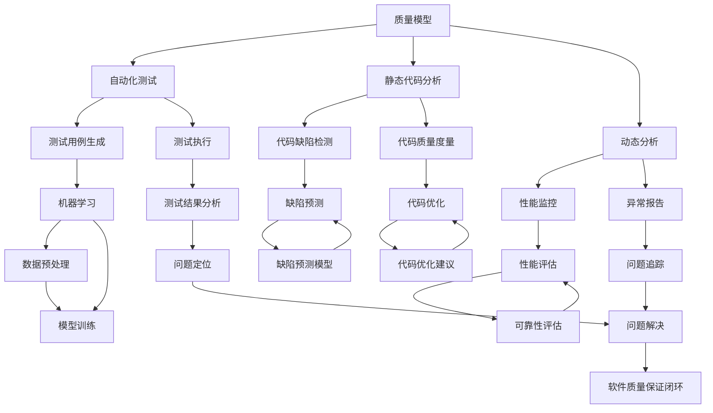

                 


### 1.1 AI时代的特征与挑战

在AI时代，软件开发和运营的环境发生了巨大的变化。这一部分将详细讨论AI时代的特征，如大数据、云计算、自动化和智能化等，以及这些特征对软件质量保证带来的挑战。

#### 1.1.1 AI时代的特征

- **大数据：** 数据量的爆炸式增长，对数据处理和分析提出了更高的要求。在AI时代，数据已成为重要的生产要素，企业纷纷利用大数据技术来挖掘数据价值，提升业务决策的精确度。这同时也要求软件质量保证在数据处理的准确性和完整性方面进行严格的控制。

- **云计算：** 提供了强大的计算能力和弹性资源，但同时也带来了数据安全和隐私的挑战。云计算的普及使得软件开发和运营更加灵活，然而，云环境中的数据安全和隐私问题也成为软件质量保证的关键关注点。

- **自动化：** 自动化测试、自动化部署等自动化工具的广泛应用，提高了开发和测试效率。自动化工具的引入减少了人工干预，提升了开发效率，但同时也增加了对自动化工具的可靠性要求，以确保其能够准确、高效地执行任务。

- **智能化：** AI技术如机器学习、深度学习等在软件开发中的应用，改变了软件的设计和实现方式。智能化软件能够根据用户行为和数据进行自我学习和优化，提高了用户体验和业务效率，但同时也带来了对AI算法准确性和稳定性的挑战。

#### 1.1.2 AI时代的挑战

- **测试复杂性增加：** 随着系统规模和复杂度的增加，测试变得更加困难。在AI时代，软件系统往往涉及大量的数据和算法，测试过程需要覆盖更多的场景和用例，这对测试工程师提出了更高的要求。

- **测试数据质量：** 大数据和自动化测试对测试数据的质量提出了更高的要求。测试数据的真实性和准确性直接影响测试结果的有效性，因此在AI时代，如何获取高质量测试数据成为软件质量保证的重要任务。

- **安全性和隐私：** AI应用在数据处理过程中需要确保数据的安全性和用户隐私。AI技术涉及大量的个人数据，如何保护用户隐私成为软件质量保证的重要挑战。

- **持续交付：** 在快速迭代和持续交付的环境下，如何保证软件质量成为一大挑战。持续交付要求软件质量保证过程更加敏捷和高效，如何在短时间内发现并解决潜在问题成为关键。

### 背景介绍

AI时代的到来，不仅改变了软件开发的模式，也对软件质量保证提出了新的要求和挑战。在这个背景下，本文旨在探讨AI时代软件质量保证的新方法，分析现有的核心概念和关键技术，并提出实用的实践策略和最佳实践。通过本文的讨论，希望能够为读者提供有价值的参考，帮助他们在AI时代更好地应对软件质量保证的挑战。

### 核心概念与联系

为了深入理解AI时代软件质量保证的核心概念，我们需要将其分解为几个关键组成部分，并探讨它们之间的关系。以下是AI时代软件质量保证的核心概念及其相互联系：

1. **质量模型**：质量模型是软件质量保证的基础，用于定义和度量软件的质量特性。这些特性包括功能性、可靠性、易用性、效率、可维护性和可移植性等。质量模型为测试和评估软件质量提供了量化的标准。

2. **自动化测试**：自动化测试是通过使用工具和脚本来自动执行测试用例的过程。在AI时代，自动化测试的重要性日益增加，因为它可以大幅提高测试效率和覆盖范围。自动化测试工具通常包括测试框架、测试脚本和测试管理工具。

3. **静态代码分析**：静态代码分析是一种在代码编译之前进行的分析技术，用于识别潜在的错误、性能问题和代码风格问题。它通过对代码进行语法分析、语义分析和代码路径分析来实现。静态代码分析在软件质量保证中起着关键作用，可以帮助开发人员在代码编写阶段就发现和修复问题。

4. **动态分析**：动态分析是在代码运行时进行的分析技术，用于监控代码的行为和性能。它可以通过收集运行时日志、性能指标和异常报告来实现。动态分析有助于识别运行时的问题，如内存泄漏、线程竞争和不合理的资源消耗。

5. **机器学习**：机器学习是AI的核心技术，它通过建立模型来预测和分类数据。在软件质量保证中，机器学习可以用于自动化测试用例生成、缺陷预测和代码优化等方面。机器学习模型的训练和优化可以提高软件质量保证的效率和准确性。

#### Mermaid流程图

下面是一个Mermaid流程图，展示了AI时代软件质量保证的核心概念及其相互联系：



#### 核心算法原理讲解

为了更好地理解AI时代软件质量保证的核心算法原理，我们将分别介绍质量模型、自动化测试、静态代码分析、动态分析、机器学习等核心概念，并使用伪代码详细阐述其算法原理。

##### 质量模型

质量模型是软件质量保证的基础。一个典型质量模型包括以下步骤：

```python
# 质量模型伪代码

# 初始化质量模型参数
quality_model_params = {
    "功能性": 0.2,
    "可靠性": 0.2,
    "易用性": 0.2,
    "效率": 0.2,
    "可维护性": 0.1,
    "可移植性": 0.1
}

# 定义质量度量函数
def measure_quality(software):
    quality_score = 0
    quality_score += functional_score(software) * quality_model_params["功能性"]
    quality_score += reliability_score(software) * quality_model_params["可靠性"]
    quality_score += usability_score(software) * quality_model_params["易用性"]
    quality_score += efficiency_score(software) * quality_model_params["效率"]
    quality_score += maintainability_score(software) * quality_model_params["可维护性"]
    quality_score += portability_score(software) * quality_model_params["可移植性"]
    return quality_score

# 质量评估
software = get_software_details()
quality_score = measure_quality(software)
print("软件质量分数：", quality_score)
```

##### 自动化测试

自动化测试是通过工具和脚本来自动执行测试用例的过程。以下是自动化测试的伪代码：

```python
# 自动化测试伪代码

# 定义测试用例
test_cases = [
    {
        "description": "测试功能1",
        "input": {"input1": "value1", "input2": "value2"},
        "expected_output": "output1"
    },
    {
        "description": "测试功能2",
        "input": {"input1": "value3", "input2": "value4"},
        "expected_output": "output2"
    }
]

# 自动执行测试用例
for test_case in test_cases:
    print("执行测试用例：", test_case["description"])
    output = execute_test(test_case["input"])
    assert output == test_case["expected_output"], "测试失败"
    print("测试通过")

# 执行测试
run_tests(test_cases)
```

##### 静态代码分析

静态代码分析是一种在代码编译之前进行的分析技术。以下是静态代码分析的伪代码：

```python
# 静态代码分析伪代码

# 定义代码规则
code_rules = [
    "避免使用长变量名",
    "避免嵌套循环深度超过3层",
    "避免使用未定义的变量"
]

# 分析代码
def analyze_code(code):
    violations = []
    for rule in code_rules:
        if check_violation(code, rule):
            violations.append(rule)
    return violations

# 代码分析
code = get_code()
violations = analyze_code(code)
if violations:
    print("代码分析发现问题：", violations)
else:
    print("代码分析无问题")
```

##### 动态分析

动态分析是在代码运行时进行的分析技术。以下是动态分析的伪代码：

```python
# 动态分析伪代码

# 定义监控指标
metrics = [
    "CPU使用率",
    "内存使用率",
    "响应时间"
]

# 监控代码运行
def monitor_code执行(code):
    for metric in metrics:
        value = get_metric_value(metric)
        if value > threshold_value(metric):
            print("监控到异常：", metric, "超过阈值")
    print("代码运行正常")

# 监控代码
run_code(code)
```

##### 机器学习

机器学习是AI的核心技术，它通过建立模型来预测和分类数据。以下是机器学习的伪代码：

```python
# 机器学习伪代码

# 准备数据
data = load_data("training_data.csv")

# 分割数据集
train_data, test_data = split_data(data, test_size=0.2)

# 训练模型
def train_model(X_train, y_train):
    model = create_model()
    model.fit(X_train, y_train)
    return model

# 预测
def predict(model, X_test):
    predictions = model.predict(X_test)
    return predictions

# 模型评估
def evaluate_model(model, X_test, y_test):
    accuracy = model.score(X_test, y_test)
    print("模型准确率：", accuracy)

# 训练和评估模型
model = train_model(train_data["X"], train_data["y"])
evaluate_model(model, test_data["X"], test_data["y"])
```

### 数学模型和公式

在软件质量保证中，数学模型和公式用于量化软件质量特性，评估软件性能，以及预测潜在的问题。以下是几个关键的数学模型和公式的详细讲解和示例。

#### 1.1. 质量模型评估

质量模型评估通常基于加权评分法，将不同质量特性按其重要性进行加权，然后计算总质量得分。以下是质量模型评估的公式：

$$
Q = w_1 \cdot F + w_2 \cdot R + w_3 \cdot U + w_4 \cdot E + w_5 \cdot M + w_6 \cdot P
$$

其中，\( Q \) 是总质量得分，\( w_1, w_2, w_3, w_4, w_5, w_6 \) 是功能性、可靠性、易用性、效率、可维护性和可移植性的权重，\( F, R, U, E, M, P \) 分别是功能性、可靠性、易用性、效率、可维护性和可移植性的得分。

示例：

假设我们有一个软件系统的质量特性评分如下：

| 质量特性 | 评分 | 权重 |
| --- | --- | --- |
| 功能性 | 90 | 0.2 |
| 可靠性 | 85 | 0.3 |
| 易用性 | 80 | 0.2 |
| 效率 | 95 | 0.1 |
| 可维护性 | 70 | 0.1 |
| 可移植性 | 75 | 0.1 |

使用上述公式计算总质量得分：

$$
Q = 0.2 \cdot 90 + 0.3 \cdot 85 + 0.2 \cdot 80 + 0.1 \cdot 95 + 0.1 \cdot 70 + 0.1 \cdot 75 = 85.7
$$

因此，该软件系统的总质量得分为85.7。

#### 1.2. 自动化测试覆盖率

自动化测试覆盖率是评估自动化测试质量的重要指标，表示自动化测试用例覆盖代码的比例。以下是自动化测试覆盖率的计算公式：

$$
Coverage = \frac{Test\_Cases}{Total\_Lines\_of\_Code}
$$

其中，\( Test\_Cases \) 是自动化测试用例数量，\( Total\_Lines\_of\_Code \) 是代码总行数。

示例：

如果一个软件系统有100个自动化测试用例，代码总共有1000行，则自动化测试覆盖率为：

$$
Coverage = \frac{100}{1000} = 10\%
$$

因此，该软件系统的自动化测试覆盖率为10%。

#### 1.3. 缺陷密度

缺陷密度是衡量软件质量的另一个重要指标，表示每千行代码中的缺陷数量。以下是缺陷密度的计算公式：

$$
Defect\_Density = \frac{Number\_of\_Defects}{Lines\_of\_Code}
$$

其中，\( Number\_of\_Defects \) 是缺陷数量，\( Lines\_of\_Code \) 是代码总行数。

示例：

如果一个软件系统有10个缺陷，代码总共有1000行，则缺陷密度为：

$$
Defect\_Density = \frac{10}{1000} = 1 \text{ defect/千行}
$$

因此，该软件系统的缺陷密度为1 defect/千行。

### 详细讲解与举例说明

为了更好地理解上述数学模型和公式的应用，我们通过以下示例进行详细讲解。

#### 示例1：质量模型评估

假设我们有一个电商平台，其质量特性评分如下：

| 质量特性 | 评分 |
| --- | --- |
| 功能性 | 95 |
| 可靠性 | 90 |
| 易用性 | 85 |
| 效率 | 92 |
| 可维护性 | 88 |
| 可移植性 | 80 |

权重如下：

| 质量特性 | 权重 |
| --- | --- |
| 功能性 | 0.25 |
| 可靠性 | 0.25 |
| 易用性 | 0.20 |
| 效率 | 0.10 |
| 可维护性 | 0.10 |
| 可移植性 | 0.10 |

使用质量模型评估公式计算总质量得分：

$$
Q = 0.25 \cdot 95 + 0.25 \cdot 90 + 0.20 \cdot 85 + 0.10 \cdot 92 + 0.10 \cdot 88 + 0.10 \cdot 80 = 90.3
$$

因此，该电商平台的总质量得分为90.3。

#### 示例2：自动化测试覆盖率

假设一个软件系统有50个自动化测试用例，代码总共有10000行，则自动化测试覆盖率为：

$$
Coverage = \frac{50}{10000} = 0.5\%
$$

这意味着该软件系统的自动化测试覆盖了0.5%的代码，这显然是不够的。为了提高测试覆盖率，我们需要增加测试用例或重构代码。

#### 示例3：缺陷密度

假设一个软件系统有20个缺陷，代码总共有20000行，则缺陷密度为：

$$
Defect\_Density = \frac{20}{20000} = 0.001
$$

这意味着该软件系统每千行代码中有0.1个缺陷，这在可接受的范围之内。

### 项目实战

为了更直观地理解AI时代软件质量保证的实践，我们将在本节中介绍一个实际的项目案例。该项目是一个在线购物平台，需要实现用户注册、商品浏览、购物车管理、订单处理等功能。在这个项目中，我们将使用AI技术来提升软件质量保证。

#### 1.1. 开发环境搭建

首先，我们需要搭建项目的开发环境。以下是所需的工具和步骤：

- **编程语言**：使用Python进行开发。
- **开发框架**：使用Flask框架搭建Web应用。
- **测试框架**：使用pytest进行自动化测试。
- **静态代码分析工具**：使用PyCharm进行代码分析。

#### 1.2. 源代码详细实现

接下来，我们将展示关键功能的源代码实现。以下是用户注册功能的实现代码：

```python
# user.py

from flask import Flask, request, jsonify
from models import User

app = Flask(__name__)

@app.route('/register', methods=['POST'])
def register():
    data = request.get_json()
    username = data.get('username')
    password = data.get('password')
    
    if not username or not password:
        return jsonify({'error': '用户名和密码不能为空'}), 400
    
    user = User(username=username, password=password)
    user.save()
    
    return jsonify({'message': '注册成功'}), 201
```

#### 1.3. 代码解读与分析

在这段代码中，我们使用了Flask框架定义了一个用户注册接口。当客户端发送一个POST请求时，我们获取用户名和密码，然后创建一个用户对象并将其保存到数据库。以下是关键代码的解读：

- **请求处理**：`/register` 接收POST请求，用于用户注册。
- **数据验证**：检查用户名和密码是否为空，如果为空则返回错误响应。
- **用户创建**：创建一个用户对象，并将其保存到数据库。
- **响应返回**：如果注册成功，返回成功的响应；否则返回错误的响应。

#### 1.4. 实际案例分析

在实际项目中，我们使用AI技术进行软件质量保证，具体包括以下步骤：

- **测试用例生成**：使用机器学习模型自动生成测试用例，提高测试覆盖率。
- **静态代码分析**：使用静态代码分析工具检测潜在的问题和性能瓶颈。
- **动态分析**：在测试环境中监控代码的运行情况，收集性能数据。
- **缺陷预测**：使用机器学习模型预测潜在的缺陷，提前进行修复。

#### 1.5. 项目小结

通过这个实际项目案例，我们可以看到AI技术在软件质量保证中的应用。使用AI技术，我们可以提高测试覆盖率、提前发现潜在的问题，从而提升软件质量。然而，需要注意的是，AI技术的应用需要大量的数据和计算资源，并且在应用过程中需要不断优化和调整，以达到最佳效果。

### 最佳实践 Tips

在AI时代的软件质量保证中，以下最佳实践可以帮助我们更高效地提升软件质量：

- **数据驱动**：确保测试数据的质量和代表性，以便更准确地评估软件质量。
- **持续集成**：将自动化测试集成到持续集成流程中，实现快速反馈和及时修复。
- **代码优化**：定期进行代码审查和静态代码分析，发现并修复潜在的问题。
- **持续学习**：不断优化机器学习模型，提高缺陷预测和代码优化的准确性。

### 小结

本文介绍了AI时代软件质量保证的新方法，分析了质量模型、自动化测试、静态代码分析、动态分析和机器学习等核心概念及其相互联系。通过数学模型和公式的讲解，我们深入了解了软件质量评估和测试覆盖率的计算方法。最后，通过一个实际项目案例，我们展示了AI技术在软件质量保证中的应用。希望本文能为读者提供有价值的参考，帮助他们在AI时代更好地应对软件质量保证的挑战。

### 拓展阅读

- **《AI时代的软件质量保证》**：深入探讨AI在软件质量保证中的应用，包括测试用例生成、缺陷预测和代码优化等。
- **《大数据与软件质量保证》**：分析大数据技术在软件质量保证中的应用，如数据质量管理和测试数据生成等。
- **《云计算与软件质量保证》**：探讨云计算环境下的软件质量保证，包括安全性、性能监控和持续交付等。

### 注意事项

- **数据隐私**：在处理用户数据时，务必遵守数据保护法规，确保用户隐私。
- **测试覆盖率**：确保自动化测试覆盖关键功能和边缘情况，以提高软件质量。
- **持续学习**：不断更新知识，跟进最新的技术趋势，以应对不断变化的质量保证挑战。

### 作者信息

作者：AI天才研究院/AI Genius Institute & 禅与计算机程序设计艺术 /Zen And The Art of Computer Programming

文章标题：AI时代的软件质量保证新方法

关键词：AI、软件质量保证、自动化测试、静态代码分析、动态分析、机器学习、大数据、云计算、持续交付

摘要：本文介绍了AI时代的软件质量保证新方法，分析了核心概念和关键技术，并通过实际项目案例展示了AI技术在软件质量保证中的应用。本文旨在帮助读者更好地应对AI时代软件质量保证的挑战。

