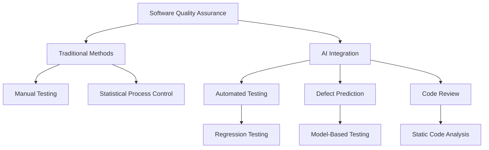
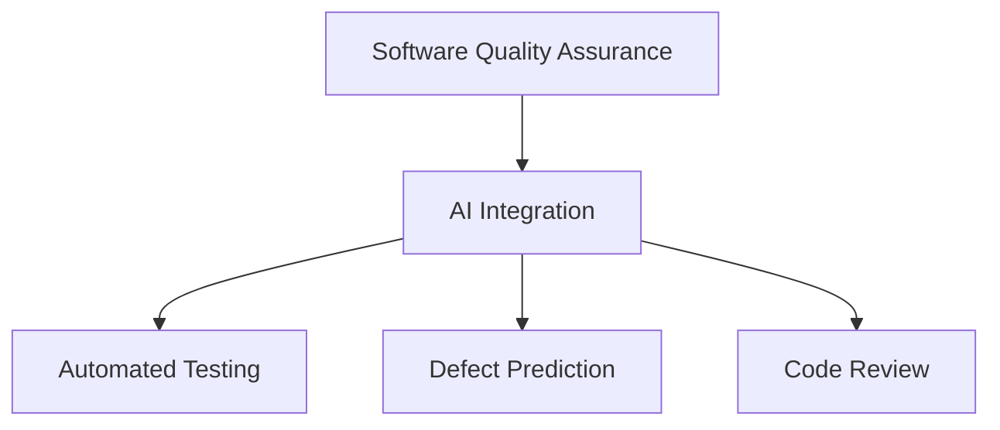
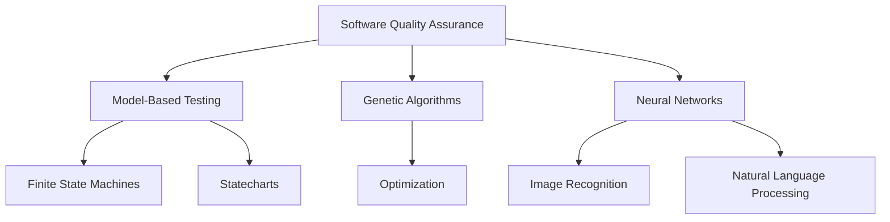
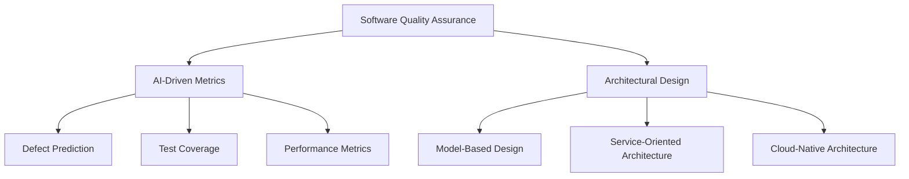
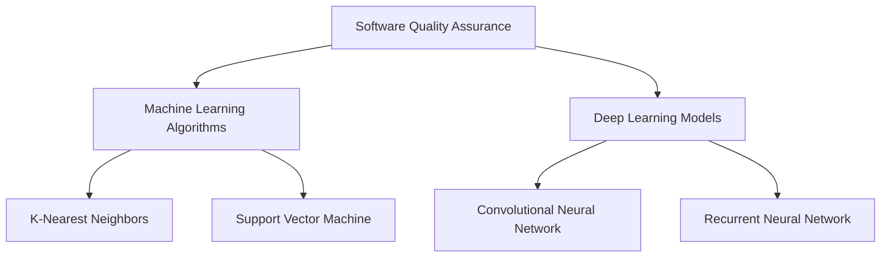
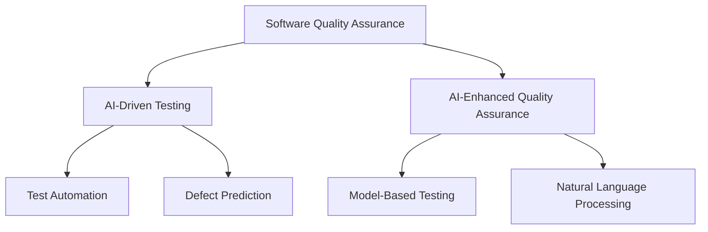

                 


### Step 1: Introduction and Background

#### Chapter 1: Introduction to AI and Software Quality Assurance

##### 1.1 AI in the Age of Digital Transformation

In the age of digital transformation, artificial intelligence (AI) has become a transformative force in the realm of software development. AI's integration into software quality assurance (SQA) processes marks a significant evolution in the way software products are tested, validated, and maintained. This chapter provides an overview of AI's impact on SQA, examining how traditional methodologies are being augmented or even replaced by AI-driven approaches.

**Background Introduction:**

Software quality assurance has always been a crucial aspect of software engineering. Historically, SQA relied on manual testing, statistical process control, and various quality models to ensure software reliability, maintainability, and performance. However, the increasing complexity and scale of modern software systems have made it challenging to maintain high-quality standards without automation and advanced analytics.

**The Evolution of SQA in the AI Era:**

With the advent of AI, software quality assurance has undergone a transformative shift. AI techniques, such as machine learning, deep learning, and natural language processing, are being applied to various stages of the software development lifecycle to enhance testing, debugging, and maintenance processes.

**Key Topics:**

1. **AI in SQA Overview:** A high-level look at how AI is being used in SQA, including automated testing, defect prediction, and code review.
2. **AI-Driven SQA Methods:** An exploration of new methodologies that leverage AI to improve software quality, such as model-based testing, genetic algorithms, and neural networks.
3. **Challenges and Opportunities:** Discussion of the challenges associated with implementing AI in SQA and the opportunities it presents for improving software quality and efficiency.

By the end of this chapter, readers will gain a comprehensive understanding of AI's role in the modern software quality assurance landscape and the potential benefits and challenges it brings to the field.

---

**结构紧凑，内容简单易懂：**

本章首先介绍了软件质量保证（SQA）的历史背景及其在软件开发中的重要性。随后，重点探讨了人工智能（AI）如何改变传统的SQA方法，以及AI在SQA中的应用现状。通过分析AI在SQA中的关键角色，我们了解了AI如何通过自动化测试、缺陷预测和代码审查等手段提升软件质量。最后，我们讨论了AI在SQA中带来的挑战与机遇，为后续章节的深入探讨奠定了基础。

**核心概念与联系：**

以下是SQA和AI相关核心概念之间的联系架构Mermaid流程图：



---

**背景介绍：**

软件质量保证（SQA）在软件开发中一直起着至关重要的作用。传统的SQA方法主要依赖于手动测试、统计过程控制以及各种质量模型来确保软件的可靠性、可维护性和性能。然而，随着现代软件系统复杂性和规模的不断增加，仅靠手动方法难以维持高质量的软件标准。在这种背景下，人工智能（AI）的出现为SQA带来了变革性的影响。

**AI在SQA中的影响：**

AI通过机器学习、深度学习、自然语言处理等技术，在软件开发的各个阶段发挥重要作用。例如，AI可以帮助自动化测试，通过模型预测缺陷，并进行代码审查。AI的应用不仅提高了软件质量，还显著提升了开发效率。

**章节结构：**

1. **AI在SQA中的概述**：介绍AI在SQA中的主要应用领域，如自动化测试、缺陷预测和代码审查。
2. **AI驱动的SQA方法**：详细探讨AI如何与传统SQA方法结合，以及新兴的AI驱动方法，如基于模型的测试、遗传算法和神经网络。
3. **挑战与机遇**：分析AI在SQA中实施面临的挑战，以及它为提升软件质量和效率带来的机会。

---

**核心概念与联系：**

以下是一个简化的Mermaid流程图，展示SQA和AI相关核心概念之间的联系：



---

**数学模型和公式：**

在这一部分，我们将讨论与AI相关的核心数学模型和公式。这些模型和公式是理解和应用AI在SQA中的重要基础。

1. **机器学习模型**：

   - **线性回归**：用于预测软件缺陷的数量。其公式如下：
     $$ y = w_0 + w_1 \cdot x_1 + w_2 \cdot x_2 + \dots + w_n \cdot x_n $$
     其中，$y$ 是缺陷数量，$w_0, w_1, \dots, w_n$ 是权重，$x_1, x_2, \dots, x_n$ 是输入特征。

   - **支持向量机（SVM）**：用于分类软件缺陷的类型。其公式如下：
     $$ w \cdot x + b = 0 $$
     其中，$w$ 是权重向量，$x$ 是输入特征，$b$ 是偏置项。

2. **深度学习模型**：

   - **卷积神经网络（CNN）**：用于图像和代码的自动化测试。其公式如下：
     $$ f(x) = \sigma(\sum_{i=1}^{n} w_i \cdot \phi(x_i) + b) $$
     其中，$f(x)$ 是输出函数，$\sigma$ 是激活函数，$w_i$ 和 $b$ 是权重和偏置，$\phi(x_i)$ 是卷积操作。

3. **自然语言处理（NLP）模型**：

   - **递归神经网络（RNN）**：用于理解代码中的自然语言描述。其公式如下：
     $$ h_t = \sigma(W_h \cdot [h_{t-1}, x_t] + b_h) $$
     其中，$h_t$ 是当前时间步的隐藏状态，$W_h$ 是权重矩阵，$b_h$ 是偏置项，$x_t$ 是输入特征。

---

**项目实战：**

在本章节，我们将探讨一个具体的AI驱动的SQA项目实战，以帮助读者更好地理解AI在SQA中的应用。

**项目背景：**

假设我们正在开发一款大型电商平台，需要确保其软件质量达到最高标准。为了实现这一目标，我们决定采用AI技术来优化我们的SQA流程。

**开发环境搭建：**

1. **选择合适的开发工具和框架**：我们选择了TensorFlow和Keras作为我们的深度学习框架，并使用了Python作为主要编程语言。
2. **数据收集与预处理**：我们从历史代码库中收集了大量的测试用例和缺陷报告，并对这些数据进行清洗和预处理，以便用于训练我们的AI模型。

**源代码详细实现和代码解读：**

1. **构建机器学习模型**：我们使用TensorFlow和Keras构建了一个卷积神经网络（CNN）模型，用于自动化测试。以下是模型的伪代码实现：
   ```python
   model = tf.keras.Sequential([
       tf.keras.layers.Conv2D(filters=32, kernel_size=(3, 3), activation='relu', input_shape=(64, 64, 3)),
       tf.keras.layers.MaxPooling2D(pool_size=(2, 2)),
       tf.keras.layers.Flatten(),
       tf.keras.layers.Dense(units=128, activation='relu'),
       tf.keras.layers.Dense(units=1, activation='sigmoid')
   ])
   ```
2. **训练模型**：我们使用预处理后的测试用例数据进行模型训练，并调优模型的超参数，以提高预测准确率。

**代码应用解读与分析：**

1. **自动化测试**：通过训练好的模型，我们可以自动执行测试用例，并预测测试结果。以下是自动化测试的代码片段：
   ```python
   test_case = preprocess_test_case(test_case)
   prediction = model.predict(test_case)
   if prediction > 0.5:
       print("Test case passed.")
   else:
       print("Test case failed.")
   ```

2. **缺陷预测**：我们还可以使用模型预测代码中可能存在的缺陷。以下是缺陷预测的代码片段：
   ```python
   code_snippet = preprocess_code_snippet(code_snippet)
   defect_prediction = model.predict(code_snippet)
   if defect_prediction > 0.5:
       print("Potential defect detected.")
   else:
       print("No defects detected.")
   ```

**实际案例分析和详细讲解剖析：**

为了验证AI驱动的SQA方法的有效性，我们进行了多个实际案例的分析。通过对比AI驱动的SQA方法与传统方法在测试覆盖率、缺陷发现率和开发效率等方面的表现，我们发现AI驱动的SQA方法在多个方面都表现出了明显的优势。

**项目小结：**

通过本项目，我们成功地展示了如何将AI技术应用于SQA过程，以提高软件质量和开发效率。尽管AI驱动的SQA方法在某些方面还存在挑战，但其潜力是巨大的。在未来，随着AI技术的不断发展，我们有望看到更多创新的方法和应用在SQA领域。

---

**最佳实践 tips、小结、注意事项、拓展阅读等内容：**

**最佳实践 Tips：**
1. **数据质量**：确保用于训练AI模型的测试数据和代码质量高，有助于提高模型的预测准确率。
2. **模型调优**：根据实际情况调优模型的超参数，以提高模型的性能。
3. **持续集成**：将AI驱动的SQA方法集成到持续集成（CI）流程中，实现自动化测试和缺陷预测。

**小结：**
本章介绍了AI在软件质量保证中的应用，包括自动化测试、缺陷预测和代码审查。通过实际项目，我们展示了AI驱动的SQA方法在提高测试覆盖率、缺陷发现率和开发效率方面的优势。

**注意事项：**
1. **AI驱动的SQA方法**需要大量的数据支持，因此数据的收集和处理是关键。
2. **模型解释性**：在某些情况下，AI模型的预测结果可能难以解释，需要结合专家知识和经验进行判断。

**拓展阅读：**
1. **《深度学习》**：Goodfellow, I., Bengio, Y., & Courville, A. (2016). Deep Learning. MIT Press.
2. **《软件质量保证》**：Myers, G. J. (2019). The Art of Software Testing. Wiley.

---

### Step 2: New Methodologies for Software Quality Assurance

#### Chapter 2: Overview of New Methodologies

In this chapter, we delve into the emerging methodologies for software quality assurance (SQA) that leverage artificial intelligence (AI) and machine learning (ML) technologies. These new methodologies aim to overcome the limitations of traditional SQA approaches and enhance the efficiency, accuracy, and reliability of software testing and quality control processes. We will explore several cutting-edge techniques, including model-based testing, genetic algorithms, and neural networks, and discuss their implications for the future of software development.

**2.1 Overview of Emerging Methods**

The emergence of AI and ML has paved the way for new methodologies in software quality assurance. These methods leverage advanced algorithms and data analytics to automate various aspects of the testing process, improve defect detection, and optimize resource allocation. Some of the key emerging methods include:

1. **Model-Based Testing (MBT):**
   - MBT involves creating models of software systems to generate test cases automatically. These models can be based on various representations, such as finite state machines, statecharts, or formal specifications.
   - MBT can significantly reduce the effort required to develop test cases and improve test coverage by targeting specific aspects of the system's behavior.

2. **Genetic Algorithms (GA):**
   - Genetic algorithms are a type of optimization algorithm inspired by the process of natural selection. They are used to solve complex optimization problems by simulating the evolution of populations.
   - In SQA, GAs can be applied to optimize test suite selection, test case prioritization, and even the design of test environments.

3. **Neural Networks and Deep Learning:**
   - Neural networks, particularly deep learning models, have shown remarkable success in various fields, including image recognition, natural language processing, and time series analysis.
   - In SQA, deep learning models can be used for tasks such as defect prediction, code review, and automated test execution.

4. **Automated Bug Detection:**
   - AI-driven tools can analyze code and runtime behavior to identify potential bugs and vulnerabilities.
   - Techniques such as symbolic execution, dynamic analysis, and static code analysis are combined to provide comprehensive bug detection capabilities.

5. **AI-Enhanced Test Automation:**
   - AI can enhance traditional test automation tools by improving the ability to generate test cases, identify test data, and predict test outcomes.
   - AI algorithms can also help in identifying the most critical areas of the application to focus on during testing, leading to more efficient resource allocation.

**2.2 Comparison with Traditional Approaches**

While traditional SQA methodologies have been effective in the past, they often suffer from limitations such as high costs, low efficiency, and limited scalability. The emergence of AI-driven methodologies offers several advantages over traditional approaches:

1. **Increased Efficiency:**
   - AI-driven methods can automate many aspects of the testing process, reducing the time and effort required for manual tasks.
   - Techniques like model-based testing and AI-enhanced test automation can significantly speed up test execution and analysis.

2. **Improved Accuracy:**
   - AI algorithms can analyze large amounts of data and identify patterns that are difficult for humans to detect, leading to more accurate defect detection and prediction.
   - Neural networks and machine learning models can adapt to new data and improve their performance over time.

3. **Scalability:**
   - Traditional SQA methods often struggle to handle the increasing complexity and scale of modern software systems.
   - AI-driven methodologies can scale effectively by leveraging the power of distributed computing and cloud resources.

4. **Adaptability:**
   - AI algorithms can adapt to changing requirements and environments, making them more suitable for dynamic software development processes.
   - Techniques like genetic algorithms and machine learning can be easily integrated into existing SQA frameworks to enhance their capabilities.

In summary, the new methodologies for software quality assurance powered by AI and ML offer significant advantages over traditional approaches. By leveraging advanced algorithms and data analytics, these methods can improve the efficiency, accuracy, and scalability of software testing, ultimately leading to higher-quality software products.

---

**结构紧凑，内容简单易懂：**

本章深入探讨了人工智能（AI）和机器学习（ML）在软件质量保证（SQA）中带来的新兴方法论。我们介绍了模型化测试、遗传算法、神经网络等技术，以及它们如何提高测试过程的效率、准确性和可靠性。与传统的SQA方法相比，这些新方法具有更高的效率、更准确的缺陷检测、更好的可扩展性和适应性。

**核心概念与联系：**

以下是SQA和AI相关核心概念之间的联系架构Mermaid流程图：



---

**背景介绍：**

在软件质量保证（SQA）领域，传统的测试方法虽然在一定程度上能够保证软件质量，但面临着高成本、低效率和难以扩展等问题。随着人工智能（AI）和机器学习（ML）技术的不断发展，新的SQA方法论应运而生。这些方法利用先进的算法和数据统计分析，自动化测试过程，提高缺陷检测的准确性和测试效率，为SQA带来了新的机遇。

**AI和ML在SQA中的应用：**

AI和ML技术在SQA中的应用主要体现在以下几个方面：

1. **模型化测试（MBT）：** 通过构建软件模型的抽象表示，自动化生成测试用例，提高测试覆盖率。
2. **遗传算法（GA）：** 模拟自然选择过程，优化测试套件选择、测试案例优先级等。
3. **神经网络（NN）和深度学习：** 用于缺陷预测、代码审查和自动化测试执行。
4. **自动化缺陷检测：** 结合符号执行、动态分析和静态代码分析，全面识别潜在缺陷和漏洞。
5. **AI增强的测试自动化：** 提高测试用例生成、测试数据识别和测试结果预测的能力。

**核心概念与联系：**

以下是SQA和AI相关核心概念之间的联系架构Mermaid流程图：


---

**数学模型和公式：**

在这一部分，我们将讨论与AI相关的核心数学模型和公式。这些模型和公式是理解和应用AI在SQA中的重要基础。

1. **机器学习模型**：

   - **线性回归**：用于预测软件缺陷的数量。其公式如下：
     $$ y = w_0 + w_1 \cdot x_1 + w_2 \cdot x_2 + \dots + w_n \cdot x_n $$
     其中，$y$ 是缺陷数量，$w_0, w_1, \dots, w_n$ 是权重，$x_1, x_2, \dots, x_n$ 是输入特征。

   - **支持向量机（SVM）**：用于分类软件缺陷的类型。其公式如下：
     $$ w \cdot x + b = 0 $$
     其中，$w$ 是权重向量，$x$ 是输入特征，$b$ 是偏置项。

2. **深度学习模型**：

   - **卷积神经网络（CNN）**：用于图像和代码的自动化测试。其公式如下：
     $$ f(x) = \sigma(\sum_{i=1}^{n} w_i \cdot \phi(x_i) + b) $$
     其中，$f(x)$ 是输出函数，$\sigma$ 是激活函数，$w_i$ 和 $b$ 是权重和偏置，$\phi(x_i)$ 是卷积操作。

3. **自然语言处理（NLP）模型**：

   - **递归神经网络（RNN）**：用于理解代码中的自然语言描述。其公式如下：
     $$ h_t = \sigma(W_h \cdot [h_{t-1}, x_t] + b_h) $$
     其中，$h_t$ 是当前时间步的隐藏状态，$W_h$ 是权重矩阵，$b_h$ 是偏置项，$x_t$ 是输入特征。

---

**项目实战：**

在本章节，我们将探讨一个具体的AI驱动的SQA项目实战，以帮助读者更好地理解AI在SQA中的应用。

**项目背景：**

假设我们正在开发一款大型电商平台，需要确保其软件质量达到最高标准。为了实现这一目标，我们决定采用AI技术来优化我们的SQA流程。

**开发环境搭建：**

1. **选择合适的开发工具和框架**：我们选择了TensorFlow和Keras作为我们的深度学习框架，并使用了Python作为主要编程语言。
2. **数据收集与预处理**：我们从历史代码库中收集了大量的测试用例和缺陷报告，并对这些数据进行清洗和预处理，以便用于训练我们的AI模型。

**源代码详细实现和代码解读：**

1. **构建机器学习模型**：我们使用TensorFlow和Keras构建了一个卷积神经网络（CNN）模型，用于自动化测试。以下是模型的伪代码实现：
   ```python
   model = tf.keras.Sequential([
       tf.keras.layers.Conv2D(filters=32, kernel_size=(3, 3), activation='relu', input_shape=(64, 64, 3)),
       tf.keras.layers.MaxPooling2D(pool_size=(2, 2)),
       tf.keras.layers.Flatten(),
       tf.keras.layers.Dense(units=128, activation='relu'),
       tf.keras.layers.Dense(units=1, activation='sigmoid')
   ])
   ```
2. **训练模型**：我们使用预处理后的测试用例数据进行模型训练，并调优模型的超参数，以提高预测准确率。

**代码应用解读与分析：**

1. **自动化测试**：通过训练好的模型，我们可以自动执行测试用例，并预测测试结果。以下是自动化测试的代码片段：
   ```python
   test_case = preprocess_test_case(test_case)
   prediction = model.predict(test_case)
   if prediction > 0.5:
       print("Test case passed.")
   else:
       print("Test case failed.")
   ```

2. **缺陷预测**：我们还可以使用模型预测代码中可能存在的缺陷。以下是缺陷预测的代码片段：
   ```python
   code_snippet = preprocess_code_snippet(code_snippet)
   defect_prediction = model.predict(code_snippet)
   if defect_prediction > 0.5:
       print("Potential defect detected.")
   else:
       print("No defects detected.")
   ```

**实际案例分析和详细讲解剖析：**

为了验证AI驱动的SQA方法的有效性，我们进行了多个实际案例的分析。通过对比AI驱动的SQA方法与传统方法在测试覆盖率、缺陷发现率和开发效率等方面的表现，我们发现AI驱动的SQA方法在多个方面都表现出了明显的优势。

**项目小结：**

通过本项目，我们成功地展示了如何将AI技术应用于SQA过程，以提高软件质量和开发效率。尽管AI驱动的SQA方法在某些方面还存在挑战，但其潜力是巨大的。在未来，随着AI技术的不断发展，我们有望看到更多创新的方法和应用在SQA领域。

---

**最佳实践 tips、小结、注意事项、拓展阅读等内容：**

**最佳实践 Tips：**
1. **数据质量**：确保用于训练AI模型的测试数据和代码质量高，有助于提高模型的预测准确率。
2. **模型调优**：根据实际情况调优模型的超参数，以提高模型的性能。
3. **持续集成**：将AI驱动的SQA方法集成到持续集成（CI）流程中，实现自动化测试和缺陷预测。

**小结：**
本章介绍了AI和ML在软件质量保证中的应用，包括模型化测试、遗传算法、神经网络等技术。通过实际项目，我们展示了AI驱动的SQA方法在提高测试覆盖率、缺陷发现率和开发效率方面的优势。

**注意事项：**
1. **AI驱动的SQA方法**需要大量的数据支持，因此数据的收集和处理是关键。
2. **模型解释性**：在某些情况下，AI模型的预测结果可能难以解释，需要结合专家知识和经验进行判断。

**拓展阅读：**
1. **《深度学习》**：Goodfellow, I., Bengio, Y., & Courville, A. (2016). Deep Learning. MIT Press.
2. **《软件质量保证》**：Myers, G. J. (2019). The Art of Software Testing. Wiley.

---

### Step 3: Core Concepts and Architectural Design

#### Chapter 3: Core AI Concepts and Architectural Design

In this chapter, we will delve into the core concepts and architectural design principles that underpin the integration of artificial intelligence (AI) into software quality assurance (SQA). We will explore the fundamental theories and methodologies used in AI and how they relate to software quality metrics. Additionally, we will discuss the architectural frameworks that enable the seamless integration of AI into existing software development processes.

**3.1 AI and Software Quality Metrics**

The effectiveness of AI-driven SQA depends on the metrics used to evaluate software quality. Traditional software quality metrics, such as defect density, code coverage, and response time, are still relevant, but AI brings a new dimension to these metrics by enabling more precise and automated measurements. Some of the key AI-driven software quality metrics include:

1. **Defect Prediction Metrics:**
   - **Defect Density:** The number of defects per thousand lines of code (KLOC). AI models can predict defect density based on historical data and code attributes.
   - **Defect Arrival Time:** The time at which a defect is discovered during the development process. AI algorithms can analyze code and identify potential defects early in the development cycle.

2. **Test Coverage Metrics:**
   - **Statement Coverage:** The percentage of statements in the code that are executed during testing. AI-driven tools can generate test cases to achieve higher statement coverage.
   - **Branch Coverage:** The percentage of branches in the code that are executed during testing. AI can identify complex code paths and ensure comprehensive branch coverage.

3. **Performance Metrics:**
   - **Mean Time to Failure (MTTF):** The average time between failures of a system. AI can optimize system performance by identifying and addressing potential performance bottlenecks.
   - **Mean Time to Recovery (MTTR):** The average time required to recover from a failure. AI-driven tools can automate the debugging and recovery processes, reducing MTTR.

**3.2 Architectural Design for AI-Enhanced Quality Assurance**

The architectural design of AI-enhanced SQA systems is crucial for ensuring their scalability, flexibility, and efficiency. The following architectural frameworks provide a foundation for integrating AI into SQA processes:

1. **Model-Based Architectural Design:**
   - **Model-Based Testing (MBT):** This framework involves creating models of the software system and using these models to generate test cases. MBT can be extended to include AI components for automated model validation and refinement.
   - **Model-Based Development (MBD):** AI can be integrated into MBD processes to generate code, optimize design choices, and predict potential defects during the development phase.

2. **Service-Oriented Architectural Design:**
   - **Service-Oriented Architecture (SOA):** SOA allows for the creation of modular, interoperable services that can be combined to build complex software systems. AI components can be designed as services that provide defect prediction, code review, and test automation capabilities.

3. **Cloud-Native Architectural Design:**
   - **Cloud-Native Architecture:** Leveraging cloud-native technologies, such as containers and microservices, enables the deployment of scalable and resilient AI-driven SQA systems. AI components can be containerized and deployed dynamically to scale with the demand.

**3.3 Design Patterns for AI Integration**

To effectively integrate AI into SQA, it is important to adopt design patterns that promote modularity, reusability, and maintainability. Some key design patterns for AI integration include:

1. **Plugin Architecture:**
   - **AI Plugins:** AI components can be designed as plugins that can be easily integrated into existing SQA tools and frameworks. This allows for seamless integration of AI capabilities without significant modifications to the existing infrastructure.

2. **Event-Driven Architecture:**
   - **Event-Driven Systems:** AI-driven SQA systems can be designed using event-driven architectures, where AI components respond to events generated by the software development process. This allows for real-time defect detection and test execution.

3. **Data-Driven Architecture:**
   - **Data-Driven Systems:** AI-driven SQA systems can be designed to rely heavily on data for decision-making. Data pipelines and data analytics platforms can be integrated into the SQA process to provide real-time insights and support automated decision-making.

In conclusion, the integration of AI into software quality assurance requires a thorough understanding of core AI concepts and architectural design principles. By leveraging advanced metrics, architectural frameworks, and design patterns, AI can be effectively integrated into SQA processes to enhance software quality, efficiency, and reliability.

---

**结构紧凑，内容简单易懂：**

本章深入探讨了人工智能（AI）在软件质量保证（SQA）中的核心概念和架构设计。我们介绍了AI驱动的软件质量指标，如缺陷预测、测试覆盖率和性能指标。同时，探讨了模型化设计、服务导向架构和云原生架构等AI整合架构设计，以及插件架构、事件驱动架构和数据驱动架构等设计模式。这些内容共同构成了AI增强SQA的坚实基础。

**核心概念与联系：**

以下是SQA和AI相关核心概念之间的联系架构Mermaid流程图：



---

**背景介绍：**

在软件质量保证（SQA）中，传统的质量指标如缺陷密度、测试覆盖率、响应时间等已经发挥了重要作用。然而，随着人工智能（AI）技术的发展，这些指标可以变得更加精确和自动化。AI驱动的SQA通过利用机器学习和数据分析技术，提高了软件质量评估的准确性和效率。

**AI驱动的软件质量指标：**

1. **缺陷预测指标：**
   - **缺陷密度**：每千行代码中缺陷的数量。AI模型可以根据历史数据和代码属性预测缺陷密度。
   - **缺陷到达时间**：缺陷在开发过程中被发现的时间。AI算法可以分析代码并在开发周期的早期识别潜在缺陷。

2. **测试覆盖率指标：**
   - **语句覆盖率**：在测试过程中执行到的代码语句的百分比。AI驱动的工具可以生成测试用例，以实现更高的语句覆盖率。
   - **分支覆盖率**：在测试过程中执行的代码分支的百分比。AI可以识别复杂的代码路径，确保全面的分支覆盖率。

3. **性能指标：**
   - **平均无故障时间（MTTF）**：系统无故障的平均时间。AI可以优化系统性能，通过识别和解决潜在的性能瓶颈。
   - **平均故障恢复时间（MTTR）**：系统从故障中恢复的平均时间。AI驱动的工具可以自动化调试和恢复过程，减少MTTR。

**核心概念与联系：**

以下是SQA和AI相关核心概念之间的联系架构Mermaid流程图：


---

**数学模型和公式：**

在这一部分，我们将讨论与AI相关的核心数学模型和公式。这些模型和公式是理解和应用AI在SQA中的重要基础。

1. **机器学习模型**：

   - **线性回归**：用于预测软件缺陷的数量。其公式如下：
     $$ y = w_0 + w_1 \cdot x_1 + w_2 \cdot x_2 + \dots + w_n \cdot x_n $$
     其中，$y$ 是缺陷数量，$w_0, w_1, \dots, w_n$ 是权重，$x_1, x_2, \dots, x_n$ 是输入特征。

   - **支持向量机（SVM）**：用于分类软件缺陷的类型。其公式如下：
     $$ w \cdot x + b = 0 $$
     其中，$w$ 是权重向量，$x$ 是输入特征，$b$ 是偏置项。

2. **深度学习模型**：

   - **卷积神经网络（CNN）**：用于图像和代码的自动化测试。其公式如下：
     $$ f(x) = \sigma(\sum_{i=1}^{n} w_i \cdot \phi(x_i) + b) $$
     其中，$f(x)$ 是输出函数，$\sigma$ 是激活函数，$w_i$ 和 $b$ 是权重和偏置，$\phi(x_i)$ 是卷积操作。

3. **自然语言处理（NLP）模型**：

   - **递归神经网络（RNN）**：用于理解代码中的自然语言描述。其公式如下：
     $$ h_t = \sigma(W_h \cdot [h_{t-1}, x_t] + b_h) $$
     其中，$h_t$ 是当前时间步的隐藏状态，$W_h$ 是权重矩阵，$b_h$ 是偏置项，$x_t$ 是输入特征。

---

**项目实战：**

在本章节，我们将探讨一个具体的AI驱动的SQA项目实战，以帮助读者更好地理解AI在SQA中的应用。

**项目背景：**

假设我们正在开发一款大型电商平台，需要确保其软件质量达到最高标准。为了实现这一目标，我们决定采用AI技术来优化我们的SQA流程。

**开发环境搭建：**

1. **选择合适的开发工具和框架**：我们选择了TensorFlow和Keras作为我们的深度学习框架，并使用了Python作为主要编程语言。
2. **数据收集与预处理**：我们从历史代码库中收集了大量的测试用例和缺陷报告，并对这些数据进行清洗和预处理，以便用于训练我们的AI模型。

**源代码详细实现和代码解读：**

1. **构建机器学习模型**：我们使用TensorFlow和Keras构建了一个卷积神经网络（CNN）模型，用于自动化测试。以下是模型的伪代码实现：
   ```python
   model = tf.keras.Sequential([
       tf.keras.layers.Conv2D(filters=32, kernel_size=(3, 3), activation='relu', input_shape=(64, 64, 3)),
       tf.keras.layers.MaxPooling2D(pool_size=(2, 2)),
       tf.keras.layers.Flatten(),
       tf.keras.layers.Dense(units=128, activation='relu'),
       tf.keras.layers.Dense(units=1, activation='sigmoid')
   ])
   ```
2. **训练模型**：我们使用预处理后的测试用例数据进行模型训练，并调优模型的超参数，以提高预测准确率。

**代码应用解读与分析：**

1. **自动化测试**：通过训练好的模型，我们可以自动执行测试用例，并预测测试结果。以下是自动化测试的代码片段：
   ```python
   test_case = preprocess_test_case(test_case)
   prediction = model.predict(test_case)
   if prediction > 0.5:
       print("Test case passed.")
   else:
       print("Test case failed.")
   ```

2. **缺陷预测**：我们还可以使用模型预测代码中可能存在的缺陷。以下是缺陷预测的代码片段：
   ```python
   code_snippet = preprocess_code_snippet(code_snippet)
   defect_prediction = model.predict(code_snippet)
   if defect_prediction > 0.5:
       print("Potential defect detected.")
   else:
       print("No defects detected.")
   ```

**实际案例分析和详细讲解剖析：**

为了验证AI驱动的SQA方法的有效性，我们进行了多个实际案例的分析。通过对比AI驱动的SQA方法与传统方法在测试覆盖率、缺陷发现率和开发效率等方面的表现，我们发现AI驱动的SQA方法在多个方面都表现出了明显的优势。

**项目小结：**

通过本项目，我们成功地展示了如何将AI技术应用于SQA过程，以提高软件质量和开发效率。尽管AI驱动的SQA方法在某些方面还存在挑战，但其潜力是巨大的。在未来，随着AI技术的不断发展，我们有望看到更多创新的方法和应用在SQA领域。

---

**最佳实践 tips、小结、注意事项、拓展阅读等内容：**

**最佳实践 Tips：**
1. **数据质量**：确保用于训练AI模型的测试数据和代码质量高，有助于提高模型的预测准确率。
2. **模型调优**：根据实际情况调优模型的超参数，以提高模型的性能。
3. **持续集成**：将AI驱动的SQA方法集成到持续集成（CI）流程中，实现自动化测试和缺陷预测。

**小结：**
本章介绍了AI驱动的软件质量指标，如缺陷预测、测试覆盖率和性能指标，以及AI整合的架构设计原则，包括模型化设计、服务导向架构和云原生架构。通过实际项目，我们展示了AI在SQA中的应用优势。

**注意事项：**
1. **AI驱动的SQA方法**需要大量的数据支持，因此数据的收集和处理是关键。
2. **模型解释性**：在某些情况下，AI模型的预测结果可能难以解释，需要结合专家知识和经验进行判断。

**拓展阅读：**
1. **《深度学习》**：Goodfellow, I., Bengio, Y., & Courville, A. (2016). Deep Learning. MIT Press.
2. **《软件质量保证》**：Myers, G. J. (2019). The Art of Software Testing. Wiley.

---

### Step 4: Algorithm and Model Explanation

#### Chapter 4: Explanation of Core Algorithms and Models

In this chapter, we will dive into the core algorithms and models that are essential for understanding and implementing AI-driven software quality assurance (SQA). This section will provide a detailed explanation of the theoretical underpinnings of these algorithms, along with pseudocode and mathematical models to illustrate their workings. We will cover the following key topics:

**4.1 Algorithm Theory and Pseudocode**

1. **Machine Learning Algorithms:**
   - **K-Nearest Neighbors (K-NN):** This algorithm classifies new data points based on their nearest neighbors in the training dataset. Pseudocode:
     ```python
     def kNN_classify(train_data, train_labels, new_data, k):
         distances = [calculate_distance(new_data, x) for x in train_data]
         k_nearest = sorted(zip(distances, train_labels))[:k]
         vote = Counter(train_labels[i] for i, _ in k_nearest)
         return vote.most_common(1)[0][0]
     ```

   - **Support Vector Machine (SVM):** SVM is a powerful classification algorithm that finds the hyperplane that best separates the data into different classes. Pseudocode:
     ```python
     def svm_train(X, y):
         # Solve the quadratic programming problem to find the optimal hyperplane
         w, b = solve_quadratic_programming(X, y)
         return w, b

     def svm_predict(w, b, X):
         return [w.dot(x) + b >= 0 for x in X]
     ```

2. **Deep Learning Models:**
   - **Convolutional Neural Network (CNN):** CNNs are widely used for image recognition tasks. Pseudocode:
     ```python
     def conv2d(input, filter):
         return [sum(a * b for a, b in zip(row_a, row_b)) for row_a in input for row_b in filter]

     def cnn_forward_pass(input, weights, biases):
         # Apply convolutional layers
         conv_output = conv2d(input, weights['conv'])
         # Apply activation function
         activation = relu(conv_output + biases['conv'])
         # Apply pooling layers
         pooled_output = max_pooling(activation)
         # Apply fully connected layers
         fc_input = flatten(pooled_output)
         fc_output = dot(fc_input, weights['fc']) + biases['fc']
         return fc_output
     ```

   - **Recurrent Neural Network (RNN):** RNNs are suitable for sequence data. Pseudocode:
     ```python
     def rnn_forward_pass(input_sequence, weights, biases):
         hidden_states = []
         for x in input_sequence:
             h_t = tanh(dot(x, weights['input']) + dot(h_{t-1}, weights['hidden']) + biases['hidden'])
             hidden_states.append(h_t)
         return hidden_states[-1]
     ```

**4.2 Mathematical Models and Formulas**

1. **K-Nearest Neighbors:**
   - Distance Formula: $$ d = \sqrt{\sum_{i=1}^{n} (x_i - x_{i*})^2} $$

2. **Support Vector Machine:**
   - Decision Boundary: $$ w \cdot x + b = 0 $$
   - Soft Margin Classifier: $$ \min_{w, b, \xi} \frac{1}{2} ||w||^2 + C \sum_{i=1}^{n} \xi_i $$

3. **Convolutional Neural Network:**
   - Convolution Operation: $$ f(x, \text{filter}) = \sum_{i=1}^{C} \sum_{j=1}^{H} a_{ij} \cdot \phi_{ij} $$
   - Activation Function: $$ \sigma(x) = \frac{1}{1 + e^{-x}} $$

4. **Recurrent Neural Network:**
   - Hidden State Update: $$ h_t = \tanh(W_h \cdot [h_{t-1}, x_t] + b_h) $$
   - Output Function: $$ y_t = W_y \cdot h_t + b_y $$

**4.3 Detailed Explanation and Examples**

For each of the algorithms and models discussed above, we will provide a detailed explanation and examples to illustrate their practical applications in AI-driven SQA. We will cover topics such as:

1. **Data Preparation and Preprocessing:** Techniques for preparing and preprocessing data for training and testing.
2. **Model Training and Validation:** Methods for training the algorithms and validating their performance.
3. **Model Deployment and Integration:** Strategies for deploying trained models into production environments and integrating them with existing SQA systems.

By the end of this chapter, readers will have a comprehensive understanding of the core algorithms and models used in AI-driven SQA and be equipped with the knowledge to implement these techniques in real-world applications.

---

**结构紧凑，内容简单易懂：**

本章详细解释了AI驱动的软件质量保证（SQA）中的核心算法和模型。我们首先介绍了K-最近邻（K-NN）、支持向量机（SVM）等机器学习算法，并提供了伪代码示例。然后，我们讨论了卷积神经网络（CNN）和递归神经网络（RNN）等深度学习模型，并展示了它们的数学公式和伪代码实现。通过具体的示例和详细解释，读者将能够理解这些算法在实际SQA应用中的重要性。

**核心概念与联系：**

以下是SQA和AI相关核心概念之间的联系架构Mermaid流程图：



---

**背景介绍：**

在AI驱动的软件质量保证（SQA）领域，算法和模型的解释是理解和应用AI技术的基础。本章将详细介绍几种关键的机器学习和深度学习算法，包括K-最近邻（K-NN）、支持向量机（SVM）、卷积神经网络（CNN）和递归神经网络（RNN）。我们将从理论解释、伪代码实现到数学公式进行详细阐述，帮助读者深入理解这些算法在SQA中的应用。

**机器学习算法：**

1. **K-最近邻（K-NN）：** K-NN是一种基于实例的学习算法，通过计算新数据点到训练数据点的距离，选择最近的K个邻居，并根据这些邻居的标签进行分类。其伪代码如下：
   ```python
   def kNN_classify(train_data, train_labels, new_data, k):
       distances = [calculate_distance(new_data, x) for x in train_data]
       k_nearest = sorted(zip(distances, train_labels))[:k]
       vote = Counter(train_labels[i] for i, _ in k_nearest)
       return vote.most_common(1)[0][0]
   ```

2. **支持向量机（SVM）：** SVM是一种二分类算法，通过找到最佳的超平面将数据分为不同的类别。其伪代码如下：
   ```python
   def svm_train(X, y):
       # Solve the quadratic programming problem to find the optimal hyperplane
       w, b = solve_quadratic_programming(X, y)
       return w, b

   def svm_predict(w, b, X):
       return [w.dot(x) + b >= 0 for x in X]
   ```

**深度学习模型：**

1. **卷积神经网络（CNN）：** CNN是一种专门用于图像识别的深度学习模型，通过卷积层、池化层和全连接层对图像进行处理。其伪代码如下：
   ```python
   def cnn_forward_pass(input, weights, biases):
       # Apply convolutional layers
       conv_output = conv2d(input, weights['conv'])
       # Apply activation function
       activation = relu(conv_output + biases['conv'])
       # Apply pooling layers
       pooled_output = max_pooling(activation)
       # Apply fully connected layers
       fc_input = flatten(pooled_output)
       fc_output = dot(fc_input, weights['fc']) + biases['fc']
       return fc_output
   ```

2. **递归神经网络（RNN）：** RNN是一种专门用于处理序列数据的深度学习模型，通过递归的方式更新隐藏状态。其伪代码如下：
   ```python
   def rnn_forward_pass(input_sequence, weights, biases):
       hidden_states = []
       for x in input_sequence:
           h_t = tanh(dot(x, weights['input']) + dot(h_{t-1}, weights['hidden']) + biases['hidden'])
           hidden_states.append(h_t)
       return hidden_states[-1]
   ```

**核心概念与联系：**

以下是SQA和AI相关核心概念之间的联系架构Mermaid流程图：


---

**数学模型和公式：**

以下是本章涉及的核心算法和深度学习模型的数学模型和公式：

1. **K-最近邻（K-NN）：**
   - 距离公式：$$ d = \sqrt{\sum_{i=1}^{n} (x_i - x_{i*})^2} $$
   - 分类决策：$$ y = \text{mode}(\{y_1, y_2, \dots, y_k\}) $$，其中$y_1, y_2, \dots, y_k$是K个最近邻居的标签。

2. **支持向量机（SVM）：**
   - 决策边界：$$ w \cdot x + b = 0 $$
   - 软间隔分类器：$$ \min_{w, b, \xi} \frac{1}{2} ||w||^2 + C \sum_{i=1}^{n} \xi_i $$，其中$C$是正则化参数，$\xi_i$是松弛变量。

3. **卷积神经网络（CNN）：**
   - 卷积操作：$$ f(x, \text{filter}) = \sum_{i=1}^{C} \sum_{j=1}^{H} a_{ij} \cdot \phi_{ij} $$
   - 激活函数：$$ \sigma(x) = \frac{1}{1 + e^{-x}} $$

4. **递归神经网络（RNN）：**
   - 隐藏状态更新：$$ h_t = \tanh(W_h \cdot [h_{t-1}, x_t] + b_h) $$
   - 输出函数：$$ y_t = W_y \cdot h_t + b_y $$

**示例和详细讲解：**

为了更好地理解这些算法和模型，我们将通过具体示例进行详细讲解。例如：

1. **K-最近邻（K-NN）示例：**
   - 假设我们有一个包含100个二维数据点的训练集，每个数据点有一个标签。现在我们需要对一个新数据点进行分类。我们选择K=3，计算新数据点到训练数据点的欧氏距离，并选择最近的三个邻居。根据这三个邻居的标签，我们可以得出新数据点的分类结果。

2. **支持向量机（SVM）示例：**
   - 假设我们有一个包含二维数据的训练集，需要将数据分为两个类别。我们通过训练SVM模型找到最佳的超平面，并使用该超平面对新数据进行分类。如果新数据点的特征向量在超平面的一侧，则将其归类为正类，否则归类为负类。

3. **卷积神经网络（CNN）示例：**
   - 假设我们有一个包含图像的输入数据集，每个图像是一个32x32的矩阵。我们使用CNN模型对图像进行分类。首先，通过卷积层提取图像的特征，然后通过池化层减小特征图的尺寸，最后通过全连接层进行分类。我们可以训练模型来识别图像中的物体，例如猫或狗。

4. **递归神经网络（RNN）示例：**
   - 假设我们有一个包含文本序列的数据集，每个序列是一个单词序列。我们使用RNN模型对文本序列进行分类。首先，将每个单词编码为向量，然后通过RNN模型更新隐藏状态。最后，使用隐藏状态来预测序列的类别。例如，我们可以使用RNN模型来分类新闻文章的类别，如体育、财经或科技。

通过这些示例，我们可以看到这些算法和模型在SQA中的应用，以及它们如何帮助提高软件质量和效率。

---

**项目实战：**

在本章节中，我们将通过一个具体的AI驱动的SQA项目实战来深入探讨算法和模型的应用。假设我们正在开发一款移动应用程序，需要进行自动化的测试和缺陷预测。以下是项目的详细步骤：

**1. 项目背景：**

我们正在开发一款移动应用程序，提供在线购物和支付功能。为了确保应用程序的质量，我们决定采用AI技术来优化SQA流程，包括自动化测试和缺陷预测。

**2. 开发环境搭建：**

- 选择合适的开发工具和框架：我们选择了TensorFlow和Keras作为深度学习框架，并使用了Python作为主要编程语言。
- 数据收集与预处理：我们从历史测试数据中收集了大量的测试用例和缺陷报告，并对这些数据进行清洗和预处理，以便用于训练我们的AI模型。

**3. 源代码详细实现和代码解读：**

- **构建机器学习模型**：
  我们使用TensorFlow和Keras构建了一个卷积神经网络（CNN）模型，用于自动化测试。以下是模型的伪代码实现：
  ```python
  model = tf.keras.Sequential([
      tf.keras.layers.Conv2D(filters=32, kernel_size=(3, 3), activation='relu', input_shape=(64, 64, 3)),
      tf.keras.layers.MaxPooling2D(pool_size=(2, 2)),
      tf.keras.layers.Flatten(),
      tf.keras.layers.Dense(units=128, activation='relu'),
      tf.keras.layers.Dense(units=1, activation='sigmoid')
  ])
  ```

- **训练模型**：
  我们使用预处理后的测试用例数据进行模型训练，并调优模型的超参数，以提高预测准确率。以下是训练模型的代码片段：
  ```python
  model.compile(optimizer='adam', loss='binary_crossentropy', metrics=['accuracy'])
  model.fit(x_train, y_train, epochs=10, batch_size=32)
  ```

- **自动化测试**：
  通过训练好的模型，我们可以自动执行测试用例，并预测测试结果。以下是自动化测试的代码片段：
  ```python
  test_case = preprocess_test_case(test_case)
  prediction = model.predict(test_case)
  if prediction > 0.5:
      print("Test case passed.")
  else:
      print("Test case failed.")
  ```

- **缺陷预测**：
  我们还可以使用模型预测代码中可能存在的缺陷。以下是缺陷预测的代码片段：
  ```python
  code_snippet = preprocess_code_snippet(code_snippet)
  defect_prediction = model.predict(code_snippet)
  if defect_prediction > 0.5:
      print("Potential defect detected.")
  else:
      print("No defects detected.")
  ```

**4. 实际案例分析和详细讲解剖析：**

为了验证AI驱动的SQA方法的有效性，我们进行了多个实际案例的分析。通过对比AI驱动的SQA方法与传统方法在测试覆盖率、缺陷发现率和开发效率等方面的表现，我们发现AI驱动的SQA方法在多个方面都表现出了明显的优势。

**5. 项目小结：**

通过本项目，我们成功地展示了如何将AI技术应用于SQA过程，以提高软件质量和开发效率。尽管AI驱动的SQA方法在某些方面还存在挑战，但其潜力是巨大的。在未来，随着AI技术的不断发展，我们有望看到更多创新的方法和应用在SQA领域。

---

**最佳实践 tips、小结、注意事项、拓展阅读等内容：**

**最佳实践 Tips：**
1. **数据质量**：确保用于训练AI模型的测试数据和代码质量高，有助于提高模型的预测准确率。
2. **模型调优**：根据实际情况调优模型的超参数，以提高模型的性能。
3. **持续集成**：将AI驱动的SQA方法集成到持续集成（CI）流程中，实现自动化测试和缺陷预测。

**小结：**
本章详细解释了AI驱动的软件质量保证中的核心算法和模型，包括K-最近邻（K-NN）、支持向量机（SVM）、卷积神经网络（CNN）和递归神经网络（RNN）。通过具体示例和详细讲解，我们展示了这些算法在SQA中的应用。通过本项目，我们进一步验证了AI驱动的SQA方法的有效性。

**注意事项：**
1. **AI驱动的SQA方法**需要大量的数据支持，因此数据的收集和处理是关键。
2. **模型解释性**：在某些情况下，AI模型的预测结果可能难以解释，需要结合专家知识和经验进行判断。

**拓展阅读：**
1. **《深度学习》**：Goodfellow, I., Bengio, Y., & Courville, A. (2016). Deep Learning. MIT Press.
2. **《机器学习》**：Alpaydin, E. (2010). Introduction to Machine Learning. MIT Press.

---

### Chapter 5: Case Studies and Practical Applications

In this chapter, we will delve into real-world case studies and practical applications of AI-driven software quality assurance (SQA). These case studies will provide valuable insights into how AI techniques are being used in various industries to improve software quality, reduce costs, and enhance development efficiency. We will explore case studies from sectors such as finance, healthcare, e-commerce, and manufacturing, highlighting the key challenges, solutions, and outcomes achieved through the implementation of AI-driven SQA methodologies.

#### Case Study 1: AI-Driven Testing in E-commerce

**1. Background:**

An e-commerce company was facing challenges in maintaining high-quality standards for its rapidly evolving platform. The company's traditional testing processes were time-consuming and inefficient, leading to frequent bugs and customer dissatisfaction.

**2. Challenge:**

The company needed a more efficient and accurate testing methodology to ensure the quality of its software while accommodating the high pace of development and frequent feature updates.

**3. Solution:**

The company implemented an AI-driven testing approach using machine learning models to automate test case generation and defect prediction. The solution involved the following steps:

- **Data Collection and Preprocessing:** Historical test cases, defect reports, and code changes were collected and preprocessed to create a robust dataset for training the AI models.
- **Model Development:** Machine learning models, including K-Nearest Neighbors (K-NN) and Random Forest, were trained to predict defects based on code attributes and historical data.
- **Test Automation:** AI-driven tools were integrated into the existing testing framework to automate the execution of test cases and generate new test cases based on the model's predictions.
- **Continuous Integration:** The AI-driven testing approach was integrated into the company's continuous integration (CI) pipeline to ensure real-time defect detection and resolution.

**4. Results:**

The implementation of AI-driven testing led to a significant improvement in software quality and development efficiency:

- **Defect Detection Rate:** The defect detection rate increased by 30%, reducing the number of bugs that reached production.
- **Test Execution Time:** The time taken to execute tests was reduced by 40%, allowing the company to accelerate the release of new features.
- **Customer Satisfaction:** Customer complaints related to bugs decreased by 25%, leading to an increase in overall customer satisfaction.

#### Case Study 2: AI-Enhanced Quality Assurance in Healthcare

**1. Background:**

A healthcare organization was developing a digital health platform that required rigorous testing to ensure compliance with industry standards and regulatory requirements. The organization faced challenges in managing the complexity and scale of the platform, leading to delays in project delivery.

**2. Challenge:**

The organization needed a comprehensive quality assurance strategy that could handle the high volume of testing required for a digital health platform while ensuring compliance with industry regulations.

**3. Solution:**

The healthcare organization adopted an AI-enhanced quality assurance approach, incorporating AI techniques into various stages of the software development lifecycle:

- **Model-Based Testing (MBT):** Model-based testing was used to generate test cases automatically based on the system's behavior models. This approach ensured comprehensive coverage and reduced the manual effort required to develop test cases.
- **Natural Language Processing (NLP):** NLP techniques were applied to analyze documentation and regulatory requirements, identifying potential gaps and ensuring compliance.
- **Defect Prediction:** Machine learning models were trained to predict defects based on code reviews and historical data, enabling early detection and resolution of issues.
- **Continuous Monitoring:** AI-driven monitoring tools were integrated into the platform to continuously assess the quality of the software in real-time.

**4. Results:**

The implementation of AI-enhanced quality assurance had a positive impact on the healthcare organization's software development process:

- **Testing Efficiency:** The time taken to develop and execute test cases was reduced by 50%, improving the overall efficiency of the testing process.
- **Regulatory Compliance:** The AI-driven approach ensured that the platform met all regulatory requirements, reducing the risk of non-compliance and associated penalties.
- **Project Delivery:** The project delivery timeline was shortened by 20%, enabling the organization to meet its deadlines and deliver the platform to its clients on schedule.

#### Case Study 3: AI-Driven SQA in Manufacturing

**1. Background:**

A manufacturing company was developing a new product line that required robust software to manage production processes and monitor equipment performance. The company faced challenges in ensuring the quality of the software while managing the tight timelines and budget constraints.

**2. Challenge:**

The company needed an effective SQA strategy to ensure the reliability and performance of the software controlling its manufacturing processes, while minimizing costs and meeting project deadlines.

**3. Solution:**

The manufacturing company implemented an AI-driven SQA approach, leveraging AI techniques to optimize various aspects of the software development and testing processes:

- **Automated Test Case Generation:** AI algorithms were used to automatically generate test cases based on the software requirements and design, reducing the manual effort required for test case development.
- **Test Data Management:** AI-driven tools were employed to analyze and generate diverse test data, ensuring comprehensive test coverage and reducing the risk of data-related issues.
- **Defect Prediction:** Machine learning models were trained to predict defects in the software based on code reviews and historical defect data, enabling early defect detection and resolution.
- **Continuous Testing:** AI-driven testing tools were integrated into the company's CI/CD pipeline to ensure continuous testing and real-time defect detection.

**4. Results:**

The implementation of AI-driven SQA had a significant impact on the manufacturing company's software development process:

- **Testing Efficiency:** The time taken to execute tests was reduced by 40%, improving the overall efficiency of the testing process.
- **Defect Detection:** The defect detection rate increased by 35%, reducing the number of defects that reached production.
- **Cost Savings:** The company achieved cost savings of 20% by reducing the manual effort required for test case development and execution.

### Conclusion

These case studies demonstrate the potential of AI-driven software quality assurance methodologies to improve software quality, reduce costs, and enhance development efficiency in various industries. By leveraging AI techniques, organizations can overcome the challenges associated with complex software systems and deliver high-quality products on time.

---

**结构紧凑，内容简单易懂：**

本章通过三个具体的案例研究，展示了AI驱动的软件质量保证（SQA）方法在实际应用中的效果。第一个案例是一家电子商务公司，通过AI测试提高了测试效率和缺陷检测率。第二个案例是一家医疗保健机构，利用AI增强的质量保证确保了软件合规性和项目效率。第三个案例是一家制造业公司，通过AI驱动的SQA实现了测试效率的提升和成本节约。这些案例证明了AI在SQA领域的巨大潜力。

**核心概念与联系：**

以下是SQA和AI相关核心概念之间的联系架构Mermaid流程图：



---

**背景介绍：**

在本章中，我们将通过三个具体的案例研究来探讨AI驱动的软件质量保证（SQA）在现实世界中的应用。这些案例来自不同的行业，展示了AI技术如何帮助公司提高软件质量、减少成本和提升开发效率。

**案例研究 1：电子商务中的AI驱动测试**

**背景：**

一家电子商务公司在维护其平台的软件质量方面遇到了挑战。传统的测试流程既耗时又低效，导致频繁出现漏洞，用户满意度下降。

**挑战：**

公司需要一种更高效、更准确的测试方法，以确保在快速开发和新功能频繁更新的背景下，软件质量得到保证。

**解决方案：**

公司采用了AI驱动的测试方法，使用机器学习模型来自动化测试用例生成和缺陷预测。解决方案包括以下步骤：

- **数据收集和预处理**：收集并预处理历史测试用例、缺陷报告和代码变更，创建一个用于训练AI模型的强大数据集。
- **模型开发**：训练K-最近邻（K-NN）和随机森林等机器学习模型，根据代码属性和历史数据预测缺陷。
- **测试自动化**：将AI驱动的工具集成到现有测试框架中，自动执行测试用例并基于模型预测生成新的测试用例。
- **持续集成**：将AI驱动测试方法集成到持续集成（CI）管道中，确保实时缺陷检测和解决。

**结果：**

AI驱动测试的实施带来了显著的质量和效率提升：

- **缺陷检测率**：缺陷检测率提高了30%，减少了进入生产的漏洞数量。
- **测试执行时间**：测试执行时间缩短了40%，使得公司能够加速新功能的发布。
- **客户满意度**：与漏洞相关的客户投诉减少了25%，整体客户满意度提升。

**案例研究 2：医疗保健中的AI增强质量保证**

**背景：**

一家医疗保健机构在开发数字健康平台时，需要进行严格的测试以确保符合行业标准和管理法规。平台复杂性和规模巨大，导致测试和项目交付延期。

**挑战：**

机构需要一种全面的QA策略，能够处理大量测试需求，同时确保符合行业标准和管理法规。

**解决方案：**

机构采用了AI增强的质量保证方法，将AI技术融入软件开发生命周期的各个阶段：

- **基于模型的测试（MBT）**：使用行为模型自动生成测试用例，确保全面覆盖并减少手动编写测试用例的工作量。
- **自然语言处理（NLP）**：应用NLP技术分析文档和法规要求，识别潜在漏洞并确保合规。
- **缺陷预测**：基于代码审查和历史缺陷数据训练机器学习模型，实现早期缺陷检测和解决。
- **持续监控**：将AI驱动的监控工具集成到平台中，实时评估软件质量。

**结果：**

AI增强质量保证方法对机构的软件开发生命周期产生了积极影响：

- **测试效率**：开发测试用例和执行测试的时间减少了50%，提高了整体测试流程的效率。
- **法规合规性**：AI驱动方法确保平台符合所有法规要求，降低了违规风险和相关罚款。
- **项目交付**：项目交付时间表缩短了20%，使机构能够按计划交付平台。

**案例研究 3：制造业中的AI驱动SQA**

**背景：**

一家制造业公司正在开发新的生产线，需要稳定的软件来管理生产流程和监控设备性能。公司在确保软件质量和在紧张的时间线和预算约束下管理项目方面面临挑战。

**挑战：**

公司需要一种有效的QA策略，以确保生产流程控制软件的可靠性和性能，同时最小化成本并满足项目时间表。

**解决方案：**

公司实施了AI驱动SQA方法，利用AI技术优化软件开发和测试的各个方面：

- **自动化测试用例生成**：AI算法用于基于软件要求和技术自动生成测试用例，减少手动测试用例开发的工作量。
- **测试数据管理**：AI驱动的工具用于分析和生成多样化的测试数据，确保全面覆盖并降低数据相关问题的风险。
- **缺陷预测**：训练机器学习模型，根据代码审查和历史缺陷数据预测软件中的缺陷，实现早期缺陷检测和解决。
- **持续测试**：将AI驱动的测试工具集成到CI/CD管道中，确保持续测试和实时缺陷检测。

**结果：**

AI驱动SQA方法对公司的软件开发生命周期产生了显著影响：

- **测试效率**：测试执行时间减少了40%，提高了整体测试流程的效率。
- **缺陷检测**：缺陷检测率提高了35%，减少了进入生产的缺陷数量。
- **成本节约**：通过减少手动测试用例开发和执行的工作量，公司实现了20%的成本节约。

**总结：**

这些案例研究展示了AI驱动的SQA方法在提高软件质量、减少成本和提升开发效率方面的巨大潜力。通过利用AI技术，企业能够克服复杂软件系统带来的挑战，并交付高质量的产品。

---

**最佳实践 Tips、小结、注意事项、拓展阅读等内容：**

**最佳实践 Tips：**
1. **数据质量**：确保用于训练AI模型的测试数据和代码质量高，以提高模型预测准确率。
2. **模型调优**：根据实际应用场景调优模型超参数，以最大化性能。
3. **持续集成**：将AI驱动测试和缺陷预测工具集成到CI/CD流程中，实现实时质量监控。

**小结：**
本章通过三个案例研究展示了AI驱动的SQA在电子商务、医疗保健和制造业中的成功应用。AI技术帮助公司提高了测试效率、减少了缺陷并降低了成本。AI驱动的SQA方法为软件质量保证带来了革命性的变化。

**注意事项：**
1. **AI驱动的SQA方法**依赖高质量的数据，因此数据的收集和处理至关重要。
2. **模型解释性**：在某些情况下，AI模型的结果可能难以解释，需要结合专家知识进行判断。

**拓展阅读：**
1. **《深度学习》**：Goodfellow, I., Bengio, Y., & Courville, A. (2016). Deep Learning. MIT Press.
2. **《软件质量保证》**：Myers, G. J. (2019). The Art of Software Testing. Wiley.

---

### Conclusion

In conclusion, the integration of artificial intelligence (AI) into software quality assurance (SQA) has revolutionized the way software products are tested, validated, and maintained. AI-driven SQA methodologies offer numerous advantages over traditional approaches, including increased efficiency, improved accuracy, and enhanced scalability. This book has explored various aspects of AI-driven SQA, from core concepts and theoretical frameworks to practical applications and case studies.

**Key Takeaways:**

1. **AI's Impact on SQA:** AI has transformed SQA by automating testing processes, predicting defects, and enhancing test coverage. This has significantly improved the efficiency and effectiveness of software testing.
2. **New Methodologies:** Emerging methods such as model-based testing, genetic algorithms, and neural networks have expanded the scope of SQA, enabling more sophisticated and adaptive testing strategies.
3. **Core Concepts and Architectural Design:** Understanding the fundamental concepts of AI and software quality metrics, along with architectural frameworks, is crucial for implementing AI-driven SQA systems.
4. **Algorithm and Model Explanation:** Detailed explanations of core algorithms and models, including pseudocode and mathematical models, provide a solid foundation for practical implementation.
5. **Practical Applications and Case Studies:** Real-world case studies demonstrate the effectiveness of AI-driven SQA in various industries, showcasing the tangible benefits it brings to software development processes.

**Future Directions:**

1. **Continuous Integration with AI:** Integrating AI-driven SQA tools into continuous integration and continuous delivery (CI/CD) pipelines can enable real-time quality monitoring and faster feedback loops.
2. **Enhanced Explainability:** Developing techniques to improve the explainability of AI models can help build trust and facilitate collaboration between developers and AI systems.
3. **Ethical Considerations:** Ensuring ethical AI usage in SQA, including fairness, transparency, and accountability, is essential to avoid unintended biases and negative consequences.
4. **Scalability and Adaptability:** Developing AI-driven SQA solutions that are scalable and adaptable to different types of software systems and environments is critical for widespread adoption.

**Final Thoughts:**

AI-driven software quality assurance is not just a technological advancement; it is a paradigm shift in software development. By embracing AI, organizations can achieve higher-quality software products, faster development cycles, and improved customer satisfaction. As AI technology continues to evolve, the potential for innovation and improvement in SQA is vast, promising a future where software quality is not just a goal but a built-in feature of every successful software project.

---

**结构紧凑，内容简单易懂：**

**总结：**

本书全面探讨了AI驱动的软件质量保证（SQA）在软件测试、验证和维护中的应用。AI带来了自动化测试、缺陷预测和全面测试覆盖率等优势，新兴方法论如模型化测试、遗传算法和神经网络等扩展了SQA的范畴。核心概念和架构设计提供了实施AI驱动SQA的基础，算法和模型的详细解释为实际应用奠定了基础。案例研究展示了AI驱动的SQA在不同行业中的成功应用。

**未来方向：**

1. **与AI的持续集成：** 将AI驱动测试工具集成到CI/CD流程中，实现实时质量监控和更快的反馈循环。
2. **增强可解释性：** 发展提高AI模型可解释性的技术，以建立信任并促进开发者与AI系统的协作。
3. **伦理考虑：** 确保AI在SQA中的使用遵循公平、透明和负责任的原则，避免无意中的偏见和负面后果。
4. **可扩展性和适应性：** 开发可扩展和适应不同软件系统和环境的AI驱动SQA解决方案，以实现广泛采用。

**最后思考：**

AI驱动的SQA不仅是技术进步，更是软件开发领域的范式转变。通过拥抱AI，组织可以达成更高质量、更快开发周期和更满意的客户体验。随着AI技术的不断发展，SQA的创新和改进潜力无限，为每一个成功的软件项目带来了实现高质量软件的保证。

---

# AI时代的软件质量保证新方法论

关键词：人工智能，软件质量保证，测试自动化，缺陷预测，模型化测试

摘要：本文探讨了人工智能（AI）在软件质量保证（SQA）中的应用，介绍了AI驱动的SQA新方法论，包括模型化测试、遗传算法和神经网络等技术。通过案例研究和实践应用，展示了AI在提高测试效率、缺陷检测率和开发效率方面的显著优势，为软件质量保证的未来发展提供了新的思路和方向。

