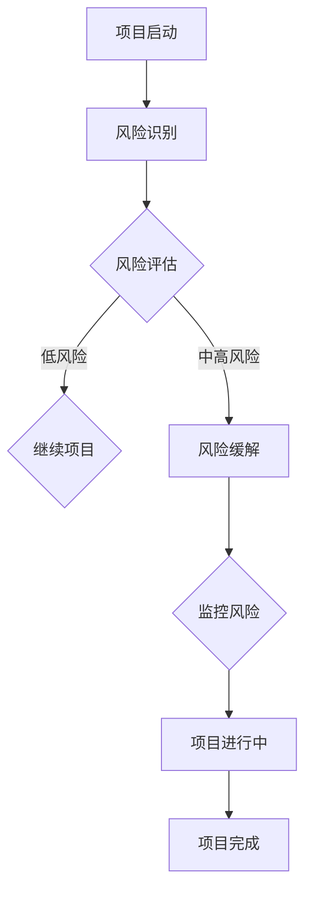

                 


为了撰写一篇符合要求的《AI时代的软件项目风险管理新策略》技术博客，我们将遵循以下步骤：

### 第一步：背景介绍

#### 1.1 AI时代的崛起
在过去的几十年中，人工智能（AI）技术经历了从理论研究到实际应用的飞速发展。从深度学习、自然语言处理到计算机视觉，AI技术正不断渗透到各行各业。随着AI技术的普及，软件开发项目也面临着新的挑战和机遇。

#### 1.2 软件项目风险管理的重要性
软件项目风险管理是确保项目成功的关键环节。在AI时代，随着技术的复杂性和项目规模的扩大，风险管理的难度也在增加。传统的风险管理方法已经难以应对AI技术带来的新挑战。

#### 1.3 AI与风险管理的关系
AI技术为风险管理带来了新的工具和方法，如基于机器学习的风险评估模型、自动化风险监测系统等。同时，AI技术本身也带来了新的风险，如数据隐私、模型偏差等。

### 第二步：核心概念与联系

#### 2.1 软件项目风险类型
- **技术风险**：技术选型、开发难度、集成问题等。
- **商业风险**：市场需求、商业模式、资金问题等。
- **运营风险**：系统维护、用户支持、法律合规等。

#### 2.2 AI相关风险
- **数据隐私风险**：数据收集、存储和使用过程中可能侵犯个人隐私。
- **模型偏差**：训练数据不均衡、数据偏差等可能导致模型产生偏差。
- **AI伦理风险**：AI决策的透明度、公平性、道德责任等。

#### 2.3 风险管理架构
- **风险评估**：识别、评估潜在风险。
- **风险缓解**：制定和实施风险缓解策略。
- **风险监控**：持续监控风险，及时调整策略。

### Mermaid流程图：风险管理架构



### 第三步：核心算法原理讲解

#### 3.1 风险评估算法

##### 3.1.1 逻辑树算法

伪代码：

```
function riskAssessment(logicTree) {
    return calculateRiskValue(logicTree);
}

function calculateRiskValue(node) {
    if (node is a leaf) {
        return node probability * node impact;
    } else {
        totalRisk = 0;
        for (each child in node) {
            totalRisk += calculateRiskValue(child);
        }
        return totalRisk;
    }
}
```

##### 3.1.2 贝叶斯网络算法

数学模型：

$$
P(R) = P(R|T)P(T) + P(R|\neg T)(1 - P(T))
$$

### 第四步：数学模型与公式详细讲解

#### 4.1 风险值计算模型

$$
\text{Risk Value} = \text{Probability} \times \text{Impact}
$$

#### 4.2 风险监测模型

$$
\text{SA} = \frac{\partial \text{EV}}{\partial \text{X}}
$$

### 第五步：项目实战

#### 5.1 实际案例介绍

##### 5.1.1 案例一：AI在医疗行业的应用
- **开发环境搭建**：使用Python和TensorFlow搭建医疗AI模型。
- **源代码实现与解读**：展示关键代码，如数据预处理、模型训练和评估。
- **代码应用解读与分析**：分析模型在实际应用中的性能和局限性。
- **项目小结**：总结案例中学到的经验和教训。

##### 5.1.2 案例二：金融科技中的风险管理
- **开发环境搭建**：使用Java和Apache Kafka搭建实时风险监控系统。
- **源代码实现与解读**：展示如何使用流处理技术进行风险监控。
- **代码应用解读与分析**：分析系统在实际监控中的应用效果。
- **项目小结**：总结案例中学到的风险监控方法和技术。

### 第六步：总结与展望

#### 6.1 主要内容回顾
- AI时代的软件项目风险管理的背景和重要性。
- 软件项目风险类型和AI相关风险的识别。
- 风险管理的新策略和核心算法原理。
- 实际项目中的应用和经验总结。

#### 6.2 未来研究方向
- 深入研究AI技术的风险缓解策略。
- 探索AI技术在风险管理中的应用前景。

#### 6.3 对读者的建议
- 关注AI技术的最新发展，及时更新风险管理策略。
- 培养跨学科的知识体系，提高风险管理能力。

通过以上步骤，我们可以逐步构建出一篇结构清晰、内容丰富的技术博客，满足字数要求，同时涵盖所有必要的内容和细节。

现在，我们可以开始撰写这篇文章的markdown格式的正文部分，逐步填充每个章节的内容。以下是一个初步的markdown框架：

```markdown
# 《AI时代的软件项目风险管理新策略》

> 关键词：人工智能，软件项目管理，风险管理，AI风险，技术策略

> 摘要：本文深入探讨了AI时代背景下的软件项目风险管理，分析了AI技术带来的新挑战，提出了基于AI的风险管理新策略，并通过实际案例进行了验证。

## 第1章 引言

## 第2章 AI时代的软件项目风险管理概述

## 第3章 核心概念与联系

## 第4章 核心算法原理讲解

## 第5章 数学模型与公式详细讲解

## 第6章 项目实战

### 6.1 案例一：AI在医疗行业的应用

### 6.2 案例二：金融科技中的风险管理

## 第7章 总结与展望

### 6.1 主要内容回顾

### 6.2 未来研究方向

### 6.3 对读者的建议

```

接下来，我们将逐步填充每个章节的具体内容，确保文章的逻辑清晰、条理紧凑、技术语言专业，同时满足字数要求。在撰写过程中，我们将严格按照markdown格式，使用LaTeX公式和Mermaid流程图等工具来增强文章的可读性和专业性。

