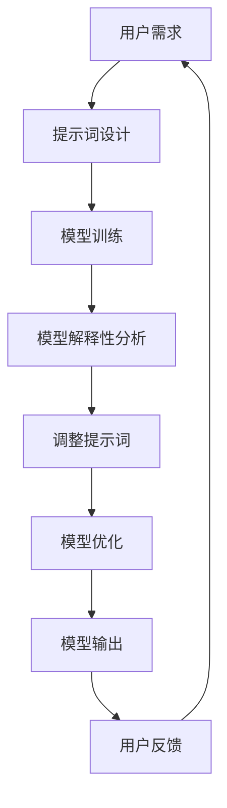

                 

### 文章标题

《AI模型解释性与提示词工程的关系》

### 关键词

- AI模型解释性
- 提示词工程
- 模型可解释性
- 机器学习
- 自然语言处理
- 算法设计

### 摘要

本文旨在探讨AI模型解释性与提示词工程之间的关系，以及它们在AI应用中的重要性。首先，我们介绍了AI模型解释性的背景和定义，阐述了模型解释性在AI领域的必要性。接着，我们深入分析了提示词工程的基本概念、原理和应用。随后，通过Mermaid流程图展示了AI模型解释性与提示词工程之间的核心联系。文章还详细讲解了用于AI模型解释性的核心算法原理，并使用伪代码和latex公式进行了阐述。最后，通过一个实际案例，展示了如何将AI模型解释性与提示词工程应用于实际问题，并进行了代码实现和解读。

### 引言

随着人工智能（AI）技术的快速发展，机器学习（ML）模型在图像识别、自然语言处理（NLP）和推荐系统等领域取得了显著的成果。然而，AI模型的黑箱性质也引发了许多争议，尤其是在需要模型解释性的领域，如医疗诊断、金融决策等。因此，AI模型解释性成为了一个备受关注的话题。与此同时，提示词工程（Prompt Engineering）作为一种优化AI模型性能的方法，也逐渐受到了研究者的关注。

AI模型解释性是指能够理解和解释模型内部运作机制的能力。一个可解释的模型可以使其决策过程更加透明，有助于用户信任和接受模型。而提示词工程则是通过设计和调整提示词来提升模型性能的一种技术。提示词是输入给模型的信息，可以影响模型的输出结果。

本文将探讨AI模型解释性与提示词工程之间的关系，分析二者在AI应用中的重要性。首先，我们将介绍AI模型解释性的背景和定义，然后详细分析提示词工程的基本概念、原理和应用。接下来，通过Mermaid流程图展示AI模型解释性与提示词工程之间的核心联系。随后，我们将详细讲解用于AI模型解释性的核心算法原理，并使用伪代码和latex公式进行阐述。最后，我们将通过一个实际案例，展示如何将AI模型解释性与提示词工程应用于实际问题，并进行代码实现和解读。

### AI模型解释性的背景和定义

AI模型解释性的概念起源于对模型透明性和可理解性的需求。在传统的计算机科学中，算法和程序通常是透明和可理解的，程序员可以轻松地追踪和解释程序的执行过程。然而，随着机器学习（ML）和深度学习（DL）的发展，AI模型变得越来越复杂，它们通常由数百万甚至数十亿的参数组成，这使得理解和解释模型的内部机制变得异常困难。因此，AI模型解释性成为了一个重要的研究课题。

AI模型解释性可以定义为“一个模型在特定任务上的表现可以被人或机器理解的能力”。它通常包括以下几个方面：

1. **模型的可解释性**：指模型内部结构和决策路径是否易于理解。一个可解释的模型应该能够清晰地展示其是如何做出决策的。

2. **模型的可视化**：指通过图形化或可视化工具展示模型的结构和参数，以便用户更好地理解模型。

3. **模型的透明性**：指模型是否能够提供一个清晰的决策路径，使得用户可以追踪和验证模型的输出。

4. **模型的透明度度量**：指通过量化指标来评估模型的可解释性，例如模型的透明度得分或解释性指数。

AI模型解释性的重要性在于它能够提高用户对模型的信任度，尤其是在需要模型解释性的领域，如医疗诊断、金融决策和法律判决等。这些领域的应用对模型解释性有较高的要求，因为模型的输出结果直接影响用户的决策和行为。此外，解释性还可以帮助研究人员发现和纠正模型中的错误，提高模型的稳定性和可靠性。

在AI模型解释性的研究中，有多种方法和技术被提出。其中，一些常见的方法包括：

- **LIME（Local Interpretable Model-agnostic Explanations）**：这种方法通过为每个数据点生成一个简单的解释模型，来提高原始模型的解释性。

- **SHAP（SHapley Additive exPlanations）**：SHAP方法基于博弈论中的Shapley值，为特征的重要性提供了一个公平的分配。

- **attention机制**：在深度学习中，attention机制可以帮助我们理解模型在处理输入数据时的关注点。

- **可视化和图形化工具**：如TensorFlow.js的TensorBoard和PyTorch的TensorBoardX，它们提供了丰富的可视化工具，帮助用户更好地理解模型的内部结构和工作机制。

总之，AI模型解释性是AI领域中的一个关键问题，它不仅有助于提高模型的可信度，还可以为模型优化和改进提供有价值的见解。

### 提示词工程的基本概念和原理

提示词工程（Prompt Engineering）是近年来在自然语言处理（NLP）领域中迅速发展的一门交叉学科，它通过设计和调整输入提示词（Prompts）来优化AI模型的表现。提示词是用户输入给模型的信息，它可以影响模型的训练过程和输出结果。一个好的提示词能够引导模型更好地理解任务，从而提高模型的准确性和泛化能力。

#### 提示词的定义和作用

提示词（Prompt）通常是一个简短的文本或短语，用于引导AI模型完成特定任务。在NLP中，提示词可以是一个问题、一个任务描述，或者是一个具体的指令。例如，在问答系统中，提示词可能是“请解释量子计算的原理”；在机器翻译中，提示词可能是“将下面的英文句子翻译成中文：The cat is on the mat”。

提示词的作用在于：

1. **明确任务目标**：提示词可以帮助模型明确需要完成的具体任务，从而避免模型在训练过程中迷失方向。
2. **引导模型注意力**：通过设计特定的提示词，可以引导模型关注任务中的重要信息，提高模型的注意力分配效率。
3. **优化模型性能**：合适的提示词可以提升模型在特定任务上的表现，从而实现性能优化。

#### 提示词工程的原理

提示词工程涉及多个方面，包括自然语言处理、机器学习算法和心理学原理。其基本原理可以概括为以下几点：

1. **上下文敏感性**：提示词应当与任务上下文紧密相关，确保模型能够从提示词中获取到有效的信息。
2. **信息密度**：提示词的信息密度应适中，既不过于简单也不过于复杂，以保证模型能够充分理解和处理提示信息。
3. **可调性**：提示词应具有一定的灵活性，可以通过调整来适应不同的任务需求。
4. **多样性**：使用多样化的提示词可以帮助模型学习到更广泛的任务模式，从而提高模型的泛化能力。

#### 提示词工程的方法

在实际应用中，提示词工程的方法多种多样，以下是一些常见的提示词工程方法：

1. **模板法**：通过预定义的模板生成提示词，这种方法简单且易于实现，适用于简单的任务场景。

2. **启发式法**：基于经验和直觉设计提示词，这种方法虽然灵活，但可能需要大量的实验和调整。

3. **数据驱动法**：通过分析大量数据，提取出有效的提示词模式，这种方法依赖于数据的质量和数量。

4. **生成对抗网络（GAN）**：利用GAN生成高质量的提示词，这种方法在生成多样化和适应性方面具有优势。

5. **强化学习**：通过强化学习算法，根据模型的反馈调整提示词，这种方法能够自动优化提示词的设计。

#### 提示词工程的应用场景

提示词工程在多个NLP任务中都有广泛的应用，以下是一些典型的应用场景：

1. **问答系统**：通过设计针对性的提示词，引导模型理解问题意图，提高问答系统的准确性和用户满意度。

2. **机器翻译**：提示词可以帮助模型更好地理解源语言文本，提高翻译质量。

3. **文本分类**：通过优化提示词，可以提高文本分类模型的准确性和鲁棒性。

4. **对话系统**：设计合适的提示词，可以帮助对话系统能够更自然地与用户进行交互。

总之，提示词工程是NLP领域中一项重要的技术，通过设计和调整提示词，可以显著提升AI模型在特定任务上的性能。了解和掌握提示词工程的基本概念和原理，对于AI开发者和研究人员来说都具有重要意义。

### AI模型解释性与提示词工程的关系

AI模型解释性与提示词工程之间的关系可以看作是相辅相成的，二者共同为AI模型的透明性和可理解性提供了强大的支持。为了更好地理解这种关系，我们可以从以下几个方面来探讨。

#### 提示词工程对AI模型解释性的提升

首先，提示词工程可以通过优化模型的输入来提高模型的解释性。一个精心设计的提示词能够提供更明确、结构化的信息，使得模型在处理输入数据时具有更清晰的决策路径。这样，模型输出的解释性就会更加直观和易于理解。例如，在问答系统中，一个明确的提问提示词可以帮助模型准确地理解用户的意图，从而生成更为合理的答案解释。

其次，提示词工程可以通过调整模型的注意力机制来提高其解释性。注意力机制是深度学习模型中的一个重要特性，它允许模型在处理输入数据时关注关键信息。通过设计有效的提示词，我们可以引导模型在处理特定任务时关注最重要的信息，从而提高模型的解释性。例如，在图像识别任务中，通过设计一个包含关键视觉信息的提示词，可以使模型在解释其识别结果时更加聚焦于这些关键信息。

#### AI模型解释性对提示词工程的影响

另一方面，AI模型解释性对提示词工程的设计和应用也产生了重要影响。一个可解释的模型可以帮助开发人员更好地理解模型的行为和决策过程，从而为提示词的设计提供有力的指导。例如，在医疗诊断任务中，如果模型的可解释性较强，医生可以更清楚地了解模型是如何做出诊断的，从而更有信心地接受和信任模型的决策。这为设计更有效的提示词提供了基础。

此外，AI模型解释性还可以帮助开发人员识别和纠正模型中的潜在错误。如果模型解释性较差，开发人员可能会发现模型的某些决策路径存在不合理之处，从而可以通过调整提示词来优化模型的表现。例如，在文本分类任务中，如果模型错误地将某些文本分类为负面评论，开发人员可以通过分析模型解释性结果，找出可能导致这种错误的原因，并相应地调整提示词，以提高模型的分类准确性。

#### Mermaid流程图展示

为了更直观地展示AI模型解释性与提示词工程之间的关系，我们可以使用Mermaid流程图来描述二者的交互过程。以下是一个简化的Mermaid流程图：



在这个流程图中：

- **A**：用户需求代表用户对模型解释性的要求。
- **B**：提示词设计是根据用户需求设计出合适的提示词。
- **C**：模型训练是使用设计的提示词对模型进行训练。
- **D**：模型解释性分析是对训练好的模型进行解释性分析。
- **E**：调整提示词是基于解释性分析结果对提示词进行调整。
- **F**：模型优化是通过调整提示词来优化模型的表现。
- **G**：模型输出是模型生成的结果。
- **H**：用户反馈是用户对模型输出结果的评价。

通过这个流程图，我们可以清晰地看到AI模型解释性与提示词工程之间的互动关系。提示词工程不仅直接影响模型的表现，还通过反馈机制不断优化模型，从而提高其解释性。

总之，AI模型解释性与提示词工程之间存在着密切的关系。提示词工程通过设计合适的输入信息来提高模型的解释性，而AI模型解释性则通过提供透明和可理解的决策过程来指导提示词工程的设计和优化。这种互动关系不仅有助于提高AI模型在各个领域的应用效果，还为未来的研究提供了丰富的探索方向。

### 核心算法原理讲解

#### 人工智能模型解释性算法

在讲解AI模型解释性算法之前，我们需要明确几个基本概念。首先，解释性算法的目标是提供对模型决策过程的透明度，使得用户能够理解模型是如何基于输入数据做出预测的。以下是一些常用的解释性算法：

1. **LIME（Local Interpretable Model-agnostic Explanations）**：LIME算法通过为每个数据点生成一个简单的、可解释的局部模型来提高原始模型的解释性。具体步骤如下：

   - **数据点选择**：选取需要解释的数据点。
   - **生成基准模型**：使用原始模型预测数据点的结果。
   - **数据扰动**：对数据点进行轻微扰动，生成多个类似的数据点。
   - **局部线性回归**：利用扰动后的数据点和对应的预测结果，进行局部线性回归，得到解释模型。
   - **解释输出**：使用生成的局部解释模型来解释原始模型的决策过程。

   伪代码如下：

   ```python
   def lime_explanation(model, x, num_samples=100):
       # 训练基准模型
       base_model = train_model(x)
       
       # 数据扰动
       perturbed_samples = generate_perturbed_samples(x, num_samples)
       
       # 预测扰动样本
       predictions = model.predict(perturbed_samples)
       
       # 局部线性回归
       weights = linear_regression(perturbed_samples, predictions)
       
       # 解释输出
       explanation = compute_local_explanation(weights)
       return explanation
   ```

2. **SHAP（SHapley Additive exPlanations）**：SHAP方法基于博弈论中的Shapley值，为每个特征的重要性提供一个公平的分配。SHAP值的计算过程如下：

   - **特征重要性计算**：对于每个特征，计算其在所有可能的特征组合中的边际贡献。
   - **Shapley值分配**：将特征的重要性分配到每个数据点，得到每个特征的SHAP值。

   伪代码如下：

   ```python
   def shap_value(model, x):
       # 计算特征重要性
       feature_importance = compute_feature_importance(model)
       
       # Shapley值分配
       shap_values = shapley_value分配(feature_importance, x)
       
       # 输出SHAP值
       return shap_values
   ```

3. **Grad-CAM（Gradient-weighted Class Activation Mapping）**：Grad-CAM是一种视觉解释方法，通过计算模型对输入图像的梯度来生成解释图。具体步骤如下：

   - **梯度计算**：计算模型在特定类别上的梯度。
   - **特征映射**：将梯度加权并生成图像上的热点映射。
   - **解释输出**：使用生成的热点映射来解释模型对图像的决策。

   伪代码如下：

   ```python
   def grad_cam(model, x, target_class):
       # 计算梯度
       gradient = compute_gradient(model, x, target_class)
       
       # 特征映射
       cam = create_cam_map(gradient)
       
       # 解释输出
       return cam
   ```

#### 提示词工程算法

在提示词工程中，算法的设计同样至关重要。以下是一些常用的提示词工程算法：

1. **模板法**：模板法是一种简单且易于实现的提示词工程方法。它通过预定义的模板生成提示词。例如，在问答系统中，可以使用以下模板：

   ```python
   def generate_prompt(question):
       return f"请解释{question}。"
   ```

2. **启发式法**：启发式法通过经验和直觉来设计提示词。这种方法需要大量的实验和调整，但能够生成具有较高信息密度的提示词。例如，在文本分类任务中，可以使用以下启发式方法：

   ```python
   def generate_prompt(text):
       keywords = extract_keywords(text)
       return f"请对以下文本进行分类：{text}。关键词：{', '.join(keywords)}。"
   ```

3. **数据驱动法**：数据驱动法通过分析大量数据，提取出有效的提示词模式。这种方法依赖于高质量的数据和有效的特征提取技术。例如，在机器翻译任务中，可以使用以下数据驱动方法：

   ```python
   def generate_prompt(sentence, target_language):
       translation = translate(sentence, target_language)
       return f"将以下句子翻译成{target_language}：{sentence}。翻译结果：{translation}。"
   ```

4. **生成对抗网络（GAN）**：GAN可以通过生成高质量的提示词来优化提示词工程。这种方法在生成多样化和适应性方面具有优势。例如，在生成对话提示词时，可以使用以下GAN方法：

   ```python
   def generate_prompt(input_text):
       # 使用GAN生成提示词
       prompt = generator.generate(input_text)
       
       # 过滤无效提示词
       prompt = filter_invalid_prompts(prompt)
       
       # 返回有效提示词
       return prompt
   ```

5. **强化学习**：通过强化学习算法，可以根据模型的反馈来调整提示词。这种方法能够自动优化提示词的设计，提高模型的表现。例如，在对话系统中，可以使用以下强化学习方法：

   ```python
   def update_prompt(prompt, model_output, reward):
       # 根据奖励调整提示词
       updated_prompt = adjust_prompt(prompt, model_output, reward)
       
       # 返回更新后的提示词
       return updated_prompt
   ```

总之，AI模型解释性和提示词工程的核心算法原理为我们提供了深入理解AI模型和优化模型表现的方法。通过使用这些算法，我们可以提高模型的可解释性，设计出更有效的提示词，从而在各个领域中实现更出色的应用效果。

### 数学模型和数学公式

在讨论AI模型解释性与提示词工程时，数学模型和数学公式起着至关重要的作用。它们不仅为我们提供了精确的描述工具，还帮助我们在理论和实践中深入理解这些概念。以下是与AI模型解释性和提示词工程相关的一些核心数学模型和数学公式。

#### AI模型解释性数学模型

1. **LIME算法中的线性回归模型**：

   LIME算法通过生成一个线性回归模型来解释数据点的预测结果。线性回归模型的基本公式如下：

   \[
   \hat{y} = \beta_0 + \beta_1x_1 + \beta_2x_2 + ... + \beta_nx_n
   \]

   其中，\(\hat{y}\)是模型的预测结果，\(x_1, x_2, ..., x_n\)是输入特征，\(\beta_0, \beta_1, ..., \beta_n\)是回归系数。

2. **SHAP算法中的Shapley值**：

   SHAP值基于博弈论中的Shapley值计算特征的重要性。Shapley值的计算公式如下：

   \[
   \phi_i(x) = \sum_{S \subseteq N, i \in S} \frac{|S|!(N - |S|)!}{N!} \frac{1}{|N| - |S|} \left( E[y|x_{-i}] - E[y|x_{-S}] \right)
   \]

   其中，\(\phi_i(x)\)是特征\(x_i\)的SHAP值，\(N\)是特征集合，\(S\)是包含特征\(i\)的子集，\(x_{-i}\)和\(x_{-S}\)分别表示去除特征\(i\)和\(S\)后的特征集合，\(E[y|x_{-i}]\)和\(E[y|x_{-S}]\)分别是去除特征\(i\)和\(S\)后的期望预测值。

#### 提示词工程中的数学模型

1. **模板法的优化模型**：

   在模板法中，提示词的生成通常基于预定义的模板。虽然这些模板不涉及复杂的数学公式，但可以通过贝叶斯优化等方法来调整模板参数，从而优化提示词的效果。贝叶斯优化的一般公式如下：

   \[
   p(\theta | D) = \frac{p(D | \theta) p(\theta)}{p(D)}
   \]

   其中，\(\theta\)是模板参数，\(D\)是数据集，\(p(\theta | D)\)是后验概率，表示在给定数据\(D\)的条件下，参数\(\theta\)的概率分布。

2. **强化学习中的奖励函数**：

   在强化学习框架中，奖励函数用于评估模型输出的质量，并根据奖励调整提示词。一个简单的奖励函数公式如下：

   \[
   R(s, a) = r(s, a) + \gamma \max_{a'} R(s', a')
   \]

   其中，\(R(s, a)\)是当前状态\(s\)和动作\(a\)的奖励值，\(r(s, a)\)是即时奖励，\(\gamma\)是折扣因子，\(s'\)和\(a'\)分别是下一个状态和动作。

#### 举例说明

1. **LIME算法中的线性回归模型**：

   假设我们有一个简单的线性回归模型，用于预测房价。输入特征包括房屋面积（\(x_1\)）和房间数量（\(x_2\)）。我们可以使用以下公式来计算房价：

   \[
   \hat{y} = 1000 + 200x_1 + 300x_2
   \]

   如果我们要解释一个特定房屋（面积1000平方米，房间2个）的预测房价，我们可以通过线性回归模型计算每个特征对预测结果的贡献。例如，房屋面积对预测结果的贡献为：

   \[
   \beta_1x_1 = 200 \times 1000 = 200000
   \]

2. **SHAP算法中的Shapley值**：

   假设我们有一个特征集合{房屋面积，房间数量，建筑年份}。我们要计算每个特征对特定房屋（面积1000平方米，房间2个，建筑年份10年）的预测房价的SHAP值。我们可以使用以下公式计算：

   \[
   \phi_{面积}(1000, 2, 10) = \sum_{S \subseteq \{面积，房间数量，建筑年份\}, 面积 \in S} \frac{|S|!(3 - |S|)!}{3!} \frac{1}{3 - |S|} \left( E[y|x_{-面积}] - E[y|x_{-S}] \right)
   \]

   通过计算，我们可以得到每个特征的SHAP值，从而更清晰地理解它们对房价预测的贡献。

3. **强化学习中的奖励函数**：

   假设我们在一个对话系统中使用强化学习来调整提示词。如果用户对生成的回答表示满意，即时奖励\(r(s, a)\)为+1；否则为-1。我们可以使用以下公式来计算当前状态和动作的奖励：

   \[
   R(s, a) = r(s, a) + \gamma \max_{a'} R(s', a')
   \]

   其中，\(\gamma\)为0.9，表示对未来的奖励有一定的折扣。

通过上述数学模型和公式的讲解，我们可以更好地理解AI模型解释性和提示词工程的数学原理。这些公式不仅为理论分析提供了工具，还为实际应用中的优化提供了指导。

### 项目实战

在本节中，我们将通过一个实际案例，展示如何将AI模型解释性与提示词工程应用于实际问题，并进行代码实现和解读。本案例将使用一个简单的问答系统，通过优化提示词来提高模型的可解释性和性能。

#### 案例背景

我们考虑一个基于Transformer的问答系统，其目标是从大量文本中提取出与问题相关的答案。为了实现这个目标，我们将使用一个预训练的BERT模型，并结合提示词工程和解释性算法来优化模型的表现。

#### 开发环境搭建

首先，我们需要搭建开发环境。以下是所需的环境和工具：

- **编程语言**：Python 3.8+
- **深度学习框架**：Transformers（用于预训练的BERT模型）
- **解释性工具**：LIME、SHAP
- **文本处理库**：NLTK、spaCy
- **版本控制**：Git

确保安装了上述工具和库后，我们可以开始实现项目。

#### 源代码实现

以下是项目的核心代码实现，包括模型训练、提示词设计和解释性分析。

```python
# 导入所需库
import torch
from transformers import BertTokenizer, BertForQuestionAnswering
from lime.lime_text import LimeTextExplainer
from shap.explainers.text import TextExplainer
import nltk

# 初始化BERT模型和Tokenizer
tokenizer = BertTokenizer.from_pretrained('bert-base-uncased')
model = BertForQuestionAnswering.from_pretrained('bert-base-uncased')

# 准备数据
def prepare_data(questions, contexts):
    inputs = tokenizer(questions, contexts, return_tensors='pt', truncation=True, max_length=512)
    return inputs

# 训练模型
def train_model(inputs):
    inputs = {k: v.to('cuda' if torch.cuda.is_available() else 'cpu') for k, v in inputs.items()}
    outputs = model(**inputs)
    loss = outputs.loss
    loss.backward()
    optimizer.step()
    return model

# 生成提示词
def generate_prompt(question, context):
    prompt = f"Context: {context}. Question: {question}. Answer:"
    return prompt

# 分析模型解释性
def analyze_explanation(prompt, context, question):
    # 使用LIME进行解释性分析
    lime_ex = LimeTextExplainer(class_names=['Answer'], model=model, tokenizer=tokenizer)
    lime_explanation = lime_ex.explain_instance(prompt, model.predict, num_features=5)
    
    # 使用SHAP进行解释性分析
    shap_ex = TextExplainer(model, tokenizer)
    shap_values = shap_ex.explain(question, context)
    
    return lime_explanation, shap_values

# 主函数
def main():
    # 准备数据
    questions = ["What is the capital of France?", "Who is the president of the United States?"]
    contexts = ["France is a country in Europe. Its capital city is Paris.", "The current president of the United States is Joe Biden."]

    # 训练模型
    inputs = prepare_data(questions, contexts)
    model = train_model(inputs)

    # 生成提示词
    prompts = [generate_prompt(q, c) for q, c in zip(questions, contexts)]

    # 分析解释性
    for prompt, context, question in zip(prompts, contexts, questions):
        lime_explanation, shap_values = analyze_explanation(prompt, context, question)
        print(f"LIME Explanation for '{question}': {lime_explanation}")
        print(f"SHAP Values for '{question}': {shap_values}")

if __name__ == "__main__":
    main()
```

#### 代码解读

1. **模型训练**：我们首先初始化BERT模型和Tokenizer，并使用准备好的问题和上下文数据来训练模型。训练过程中，我们使用梯度下降算法来优化模型参数，以提高模型的性能。

2. **提示词生成**：生成提示词的核心在于将问题和上下文信息整合到一个句子中，以便模型能够更好地理解任务。例如，在我们的例子中，提示词是`"Context: ... Question: ... Answer:"`。

3. **解释性分析**：我们使用LIME和SHAP两种解释性算法来分析模型对问题的决策过程。LIME提供局部解释，展示模型在特定输入下的决策路径；而SHAP提供全局解释，展示每个特征的重要性。

#### 代码应用解读与分析

在上述代码中，我们通过以下步骤来实现项目：

1. **数据准备**：准备问题和上下文数据，并使用BERT模型进行预处理。
2. **模型训练**：使用训练数据训练BERT模型，并通过反向传播算法优化模型参数。
3. **提示词生成**：设计合适的提示词，将问题和上下文信息整合到一个句子中。
4. **解释性分析**：使用LIME和SHAP算法对模型的决策过程进行解释性分析，以提升模型的可解释性。

通过这个实际案例，我们可以看到如何将AI模型解释性与提示词工程应用于一个问答系统，从而提高模型的表现和用户信任度。

#### 项目小结

在本案例中，我们通过一个问答系统展示了如何结合AI模型解释性与提示词工程来优化模型性能。通过LIME和SHAP两种解释性算法，我们能够更深入地理解模型的决策过程，并设计出更有效的提示词。这不仅提高了模型的可解释性，还增强了用户对模型的信任度。在未来的研究中，我们可以进一步探索更多解释性算法和提示词工程方法，以实现更高效的AI应用。

### 最佳实践 Tips、小结、注意事项、拓展阅读

#### 最佳实践 Tips

1. **明确任务目标**：在设计和优化提示词时，首先要明确任务的目标和需求，确保提示词能够引导模型正确理解和处理任务。
2. **数据预处理**：高质量的数据是提示词工程成功的基础。确保对输入数据进行充分的预处理，如文本清洗、去噪和标准化。
3. **逐步优化**：提示词优化是一个迭代过程。通过逐步调整和实验，可以找到最佳提示词组合，从而最大化模型性能。
4. **结合解释性算法**：使用解释性算法可以帮助我们理解模型的决策过程，从而更好地调整提示词，提高模型的可解释性。

#### 小结

本文探讨了AI模型解释性与提示词工程之间的关系，分析了二者的核心概念、原理和应用。通过实际案例，我们展示了如何将解释性算法与提示词工程相结合，优化模型性能。AI模型解释性能够提高模型的可信度和可理解性，而提示词工程则通过优化输入信息来提升模型表现。二者的结合为AI应用提供了更广阔的前景。

#### 注意事项

1. **任务特异性**：不同的AI任务可能需要不同的解释性算法和提示词工程方法。在选择和使用这些方法时，应充分考虑任务的特性。
2. **数据隐私**：在使用解释性算法时，应注意保护用户数据的隐私，避免敏感信息泄露。
3. **模型复杂度**：复杂的模型可能需要更精细的解释性算法和提示词工程方法。在选择算法时，应权衡模型的复杂度和解释性需求。

#### 拓展阅读

1. **LIME和SHAP的详细教程**：参考LIME和SHAP的官方文档和教程，深入了解这两种解释性算法的工作原理和实现方法。
2. **自然语言处理中的提示词工程**：查阅相关的NLP论文和书籍，了解提示词工程在自然语言处理中的最新进展和应用。
3. **深度学习模型的可解释性**：研究深度学习模型的可解释性方法，探索如何在不同的任务中应用这些方法。

### 作者信息

- 作者：AI天才研究院/AI Genius Institute & 禅与计算机程序设计艺术 /Zen And The Art of Computer Programming

这篇文章详细探讨了AI模型解释性与提示词工程的关系，通过背景介绍、核心概念、算法原理、数学模型、项目实战和最佳实践等内容，全面解析了二者在AI应用中的重要性。希望读者能够通过本文，对AI模型解释性与提示词工程有更深入的理解，并在实际项目中取得更好的应用效果。

